# Ingenieria de Software 2

- [Ingenieria de Software 2](#ingenieria-de-software-2)
- [[07-03-22] - Modelado y Diagrama de casos de uso](#07-03-22---modelado-y-diagrama-de-casos-de-uso)
  - [Modelo](#modelo)
    - [Herramientas de modelado](#herramientas-de-modelado)
    - [Diagramas de casos de uso](#diagramas-de-casos-de-uso)
- [[08-03-22] Repaso Ing. Soft. 1](#08-03-22-repaso-ing-soft-1)
  - [Calidad](#calidad)
- [[15-03-22] Visión general de UML](#15-03-22-visión-general-de-uml)
  - [UML](#uml)
  - [Modelado de casos de uso](#modelado-de-casos-de-uso)
    - [Elementos](#elementos)
    - [Pre y post condiciones](#pre-y-post-condiciones)
  - [Procesos de desarrollo](#procesos-de-desarrollo)
  - [proceso unificado de desarrollo de software](#proceso-unificado-de-desarrollo-de-software)
    - [El cliclo de vida del proceso unificado](#el-cliclo-de-vida-del-proceso-unificado)
- [[21-03-22] Casos de uso con trazo fino y grueso](#21-03-22-casos-de-uso-con-trazo-fino-y-grueso)
  - [Trazo fino](#trazo-fino)
  - [Trazo grueso](#trazo-grueso)
  - [Diagrama de clases de dominio](#diagrama-de-clases-de-dominio)
- [[28-03-22] Repaso de modelado de clases de dominio](#28-03-22-repaso-de-modelado-de-clases-de-dominio)
- [[05-04-22] Proceso de ingenieria de requerimientos](#05-04-22-proceso-de-ingenieria-de-requerimientos)
  - [Proceso de ingenieria de requerimientos](#proceso-de-ingenieria-de-requerimientos)
  - [Calidad de requerimientos](#calidad-de-requerimientos)
  - [Productos del proceso de la ingenieria de requerimientos](#productos-del-proceso-de-la-ingenieria-de-requerimientos)
- [[11-04-22] Metodologias agiles - Historias de usuario](#11-04-22-metodologias-agiles---historias-de-usuario)
- [[26-04-22]](#26-04-22)
  - [Validación de requerimientos](#validación-de-requerimientos)
  - [Administración de requerimientos](#administración-de-requerimientos)

**Profe practico**: Gerardo Fernando Córdoba.

**Profe teorico**: Natalia Mira (ncmira@gmail.com) 

# [07-03-22] - Modelado y Diagrama de casos de uso

Siempre nos vamos a encontrar con **requerimientos**, cualquier sea la rama que nos especifiquemos. Es muy importante aprender a **identificarlos** y **procesarlos**

**Objetivos**

* Comprender la **importancia** de **modelar**.
* Aprender a utilizar el **diagrama** de **casos de usos**.
* **Resolver** una problematica real utilizando el diagrama de casos de uso

## Modelo

Es una **representacion** en un cierto medio de algo que ayuda a **visualizar** el **sistema** o idea.

El modelo no busca tener todo el detalle, sino que trata de captar lo **importante** mediante un **punto** de **vista** **especifico** para simplificar / abstraer.

Se busca **reducir** la **complejidad** inherente de los sistemas grandes.

**Abstraer -> especificar -> Describir**

### Herramientas de modelado

**UML** (Lenguaje unificado de modelado)
* Distintos tipos de **diagramas**.
  * **Estructurales**: Elementos del sistema y sus relaciones .
  * **Comportamiento**: Funcionalidad del sistema en el tiempo.

### Diagramas de casos de uso

Especifica requerimientos funcionales. Se trata de identificar:
* **Actores**.
* **Casos de uso**.
* **Relaciones entre actores y casos de uso**.
* **Relaciones entre casos de uso y casos de uso**.
* Tambien pueden haber **relaciones** **entre actores**(?)

**Tipos** de **relaciones**:
* **include**: Si se da un caso de uso, el otro tambien se tiene que dar
* **Extend**: Agrega funcionalidad a otro caso de uso, que puede ejecutarse o no, es decir es **optativo**.
* **Generalizacion**: Herencia / Como POO.

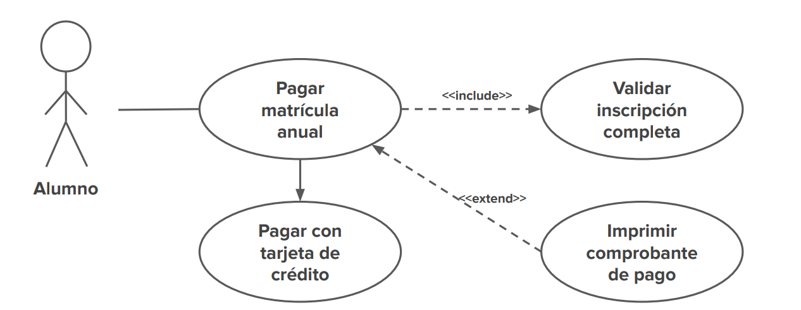

# [08-03-22] Repaso Ing. Soft. 1

* En el transcurso de la materia se hara un especial enfasis en el analisis de los requerimientos de un sistema, en el modelado y diseño del mismo.
* Se utilizara mediante trabajos practicos un proceso de desarrollo especifico utilizado por la profesora
* Se aplicaran conceptos y tecnicas para lograr diseños de calidad


## Calidad
* Modularidad
* Usabilidad
* Confiabilidad
* Robustez
* Complejidad
* Arquitectura
* Reusabilidad
* Portabilidad
* Mantenibilidad

El proceso de desarrollo consta (en terminos generales) de:
* Definir un objetivo
* Definir el alcance
* Definir los modulos o subsistemas (Quizas listar primero las funcionalidades)
* Realizar modelos de casos de uso
* Realizar diagramas de objetos de dominio (?)

# [15-03-22] Visión general de UML

Un modelo es la **abstraccion** de un sistema que nos permite ocuparnos de **detalles relevantes** para un proposito para abordar sistemas complejos.

Para realizar un modelado exitoso hay que utilizar un **lenguaje visual** que sea **sencillo** de **interpretar** y procesar.

Algunos de los **beneficios** de realizar modelado de sistemas son los siguientes:

* Nos ayudan a **visualizar** un **sistema** como es, o como queremos que sea.
* Nos permiten **especificar** la **estructura** o el **comportamiento** de un sistema.
* Nos dan una plantilla que nos **guía** en la **construcción** del sistema.
* **Documentan** las **decisiones** que hemos tomado.
* Nos **facilitan** la **comunicación** con el **cliente**.

```
Nota: La elección de qué modelos crear tiene una profunda influencia en cómo atacamos un problema y cómo delineamos una solución.
```

```
Nota: Un único modelo no es suficiente. Cualquier sistema es enfocado mejor con un conjunto de modelos independientes, pero relacionados.
```

**Conceptos** del modelado

* **Sistema software**: Descripto por un conjunto de modelos
* **Modelo**: Simpllificacion para comprender major un sistema
* **Diagrama**: Representacion grafica de un modelo (UML usa grafos)
* **Vista**: Subconjunto de diagramas de un modelo que analiza un aspecto concreto

En el contexto del software hay **cinco vistas** complementarias que son las mas importantes para visualizar, especificar, construir y documentar una arquitectura software
* Vista de **casos de uso**
* Vista de **diseño**
* Vista de **interacción**
* Vista de **implementación**
* Vista de **despliegue**

Cada una de estas vistas involucra modelado **estructural** y modelado de **comportamiento**.

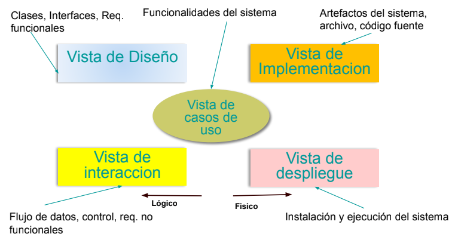

```
Nota: En el modelado Orientado a Objetos la vision actual del desarrollo de software toma una perspectiva orientada a objetos.
```

```
Nota: La Ingeniería dirigida por modelos (MDE) es un enfoque para el desarrollo de software donde los modelos en lugar de los programas son los principales resultados del proceso de desarrollo. Los programas que se ejecutan en una plataforma de hardware / software se generan automáticamente a partir de los modelos.
```

## UML

Es un **lenguaje** de **modelado**, de propósito general, usado para la visualización, especificación, construcción y documentación de sistemas Orientados a Objetos.

Decimos que es un **lenguaje** ya que provee un **vocabulario** y **reglas** para **combinar** los **elementos** del vocabulario con el propósito de comunicar. 

## Modelado de casos de uso

Muestra un **conjunto** de **Casos de Uso**, **actores** y sus
**relaciones**.

Permite establecer el **comportamiento** **deseado** del sistema. Especifica los **requerimientos funcionales** del Software.

Algunos **beneficios** del modelado de casos de uso son los siguientes:

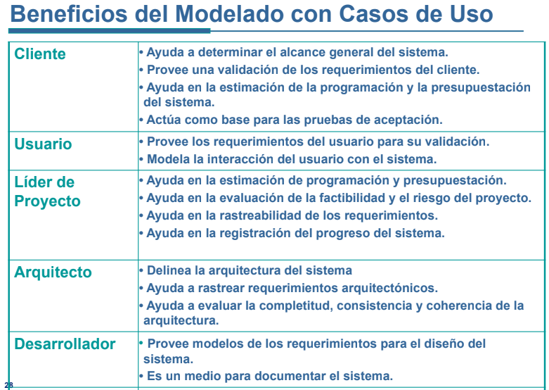

### Elementos

**Casos de uso**

Los Casos de Uso se **determinan** observando y precisando, actor por actor, las secuencias de **interacción**, los escenarios, desde el punto de vista del usuario

Un **escenario** es una instancia de un caso de uso.

**Actores**

Representa un rol que interactúa con el sistema, puede ser un **usuario** humano u **otro sistema** o dispositivo de **hardware**. El nombre del actor debe **describir** el **papel desempeñado**.

Hay actores **principales** (IZQ): son los que **usan** el sistema **directamente**; para quienes desarrollamos el sistema. 

Hay actores **secundarios** (DER): son aquellos de los que el **sistema** necesita **ayuda** para poder cumplir con el objetivo del Caso de Uso. Son aquellos que **mantienen** o **administran** el sistema.

**Relaciones**

**Extension**

Especifica como un Caso de Uso puede insertarse y así **extender** la
**funcionalidad** de **otro**. Se usan para modelar partes **optativas**, alternativas, etc.

Se dibuja con una flecha cuya dirección va **desde** el Caso de Uso de
extensión (**adicional**) **al** Caso de Uso **base**.

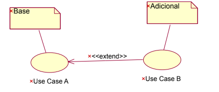

**Inclusion**

Se usan cuando su **intervención** es **necesaria** para **completar** un
**curso** completo de **eventos**.

Se dibuja con una flecha **desde** el Caso de Uso concreto o **base** **al** use case abstracto (**adicional**).


**Generalizacion**

Un Caso de Uso más **especifico** puede **especializar** a un Caso de Uso
más **general**.

Se dibuja con una flecha **desde** el Caso de Uso **hijo al padre**.

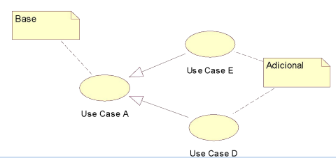

### Pre y post condiciones

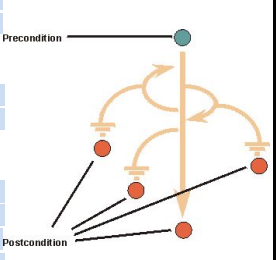

Una **pre-condición** es una **restricción** sobre **cuando** un Caso de Uso puede **empezar**. No es el evento que inicia el Caso de Uso.


Una **post-condición** para un Caso de Uso debe ser **verdadera**, **independientemente** de cual **flujo** sea **ejecutado**.

## Procesos de desarrollo

Hay 3 tipos: **Evolutivo**, **planificado** y de **reutilización**

Cual elegir dependera de ciertos criterios ca considerar:

1. Nivel de **flexibilidad** de los **requerimientos**
2. escala y el **alcance** del **desarrollo**
3. que conviene más teniendo en cuenta lo que exige el cliente (Plazos y tamaño del proyecto)
4. Definir los **usuarios finales** claramente
5. Considerar **donde** se **ubica** el **equipo** de desarrollo

```
Nota: En cualquier modelado es importante destacar correctamente el objetivo del sistema a elaborar.
```

## proceso unificado de desarrollo de software

Es un proceso **ORIENTADO A OBJETOS**
El proceso es:
* Guiado por **casos de uso**:
  * Los sistemas se crean para dar servicio a los usuarios.
  * Un CASO de USO es una pieza de **FUNCIONALIDAD** de un sistema que le proporciona a algún **USUARIO** un RESULTADO o **VALOR**.
* Centrado en la **arquitectura**:
  * La arquitectura de un sistema software es un **extracto** de los modelos del sistema que da una **idea** de qué **forma** tiene el **sistema** completo.
* Con un ciclo de vida **iterativo** e **incremental**:
* Se repiten VARIOS **MINIPROYECTOS**, cada miniproyecto **AMPLIA** EL **PRODUCTO**.

### El cliclo de vida del proceso unificado

Un ciclo de vida se **repite** a lo largo del tiempo. Tras cada ciclo de vida se genera una **versión nueva** del producto, un ciclo de vida se divide en **fases**, cada fase se divide en **iteraciones** y en cada iteración se realizan **flujos** de trabajo

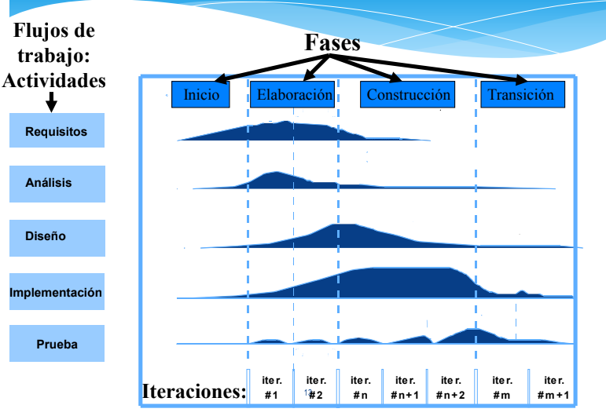

Cada **ciclo** constas de **cuatro fases**: **inicio**, **elaboración**, **construcción**, y **transición**.

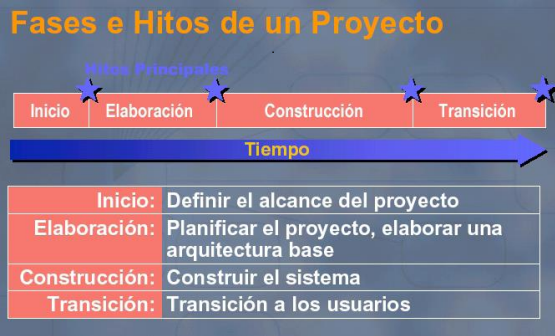

El **producto** generado a partir de un PU no es sólo **código** ejecutable, sino que son los **modelos** o **representación** del software.

# [21-03-22] Casos de uso con trazo fino y grueso

## Trazo fino
Descripcion **detallada** de la funcionalidad de uno o varios casos de uso

* **Brinda** un **contexto** del caso de uso en cuestion, 
* **Define precondiciones** para que se de un caso de uso, 
* **Define** que **acciones** realiza un actor y el sistema como un **flujo continuo** de **pasos**.
* Describe el **camino feliz** y **flujos alternatiavos** de la interaccion actor-sistema.
* Define las post condiciones que un caso de uso realiza al finalizar.
* Ayuda a ver las **relaciones** entre los diferentes **casos de uso** que definen una **funcionalidad**.

## Trazo grueso
SOLO da una **descripcion detallada** de al funcionalidad de un caso de uso, nada mas.

## Diagrama de clases de dominio

¿Que es? Es un:
* Vista general de los conceptos de negocio de mas alto nivel.
* Representacion visual de las clases conceptuales del mundo real en un dominio de interes
* Diccionario visual de abstracciones 

En un diagrama de clases de dominio graficamos **clases**, **asociaciones** y **atributos**.

Una **clase** es una idea, cosa u objeto, es un **concepto** dentro del sistema que estamos modelando.

Las **asociaciones** representan **relaciones** entre las instancias de las clases. Las relaciones pueden ser (**cardinalidad**):
* 1 a 1
* 1 a M
* M a M

Las asociaciones tambien pueden tener **nombres**.

Las asociaciones tambien tienen **clases**, es decir, aquello que se forma a partir de la llevada a cabo de una relacion.

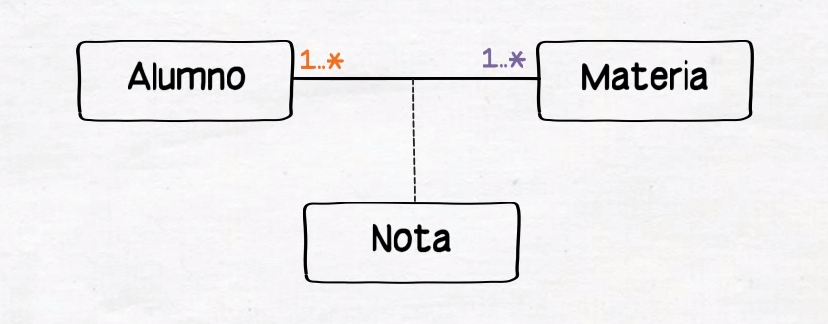

Los **atributos** son:
* Valor de datos logico de un objeto
* Es donde se modela o representa el dato para luego producir la informacion que nuestros sistemas bajo estudio gestionan
* Es esa informacion que necesito registrar dado ciertos requisitos y teniendo en cuenta siempre el DOMINIO que se esta analizando.

`NOTA: Para las asociaciones, no plasmamos las foreign keys como atributos de las clases.`


`NOTA: Los atributos multiples no se modelan como otras clases.`

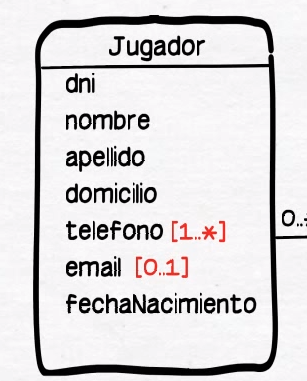

`NOTA: Los atributos derivables se modelan de esta forma:`

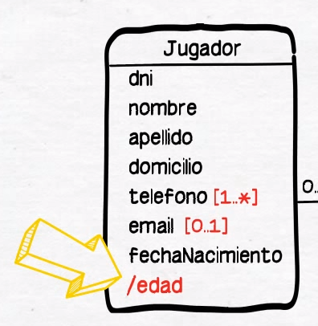

Clase asociativa:

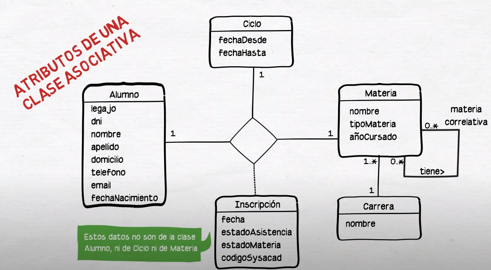

Asociacion derivable:

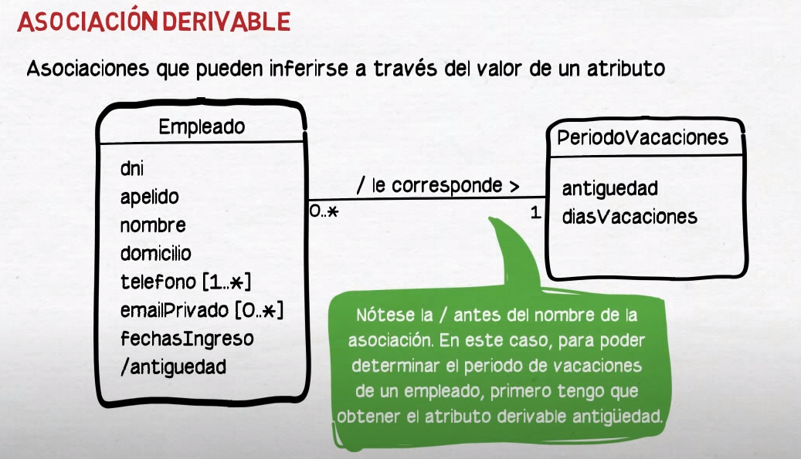

# [28-03-22] Repaso de modelado de clases de dominio

* En UML (Diagramas de clases de dominio) no tenemos en cuenta los **ID's**, ni los primarios ni los secundarios (las **relaciones** ya **generan** estos atributos en sus respectivas clases de dominio.
* No se tiene en cuenta el **tiempo**, es decir no se tienen en cuenta las **instancias** de las clases

# [05-04-22] Proceso de ingenieria de requerimientos

La redaccion de los requerimientos es vital en el proceso de desarrollo de software. Todos los requerimientos deben tener el mismo estilo de redacción.

Algunos ejemplos de buenas redacciónes son:

“El sistema en el modulo de ventas debe ofrecer una opción mediante la cual el usuario pueda ver una comparación de lo presupuestado versus la venta real en un rango de fechas” 

“Cuando el tiempo de conexión exceda el valor predeterminado como máximo, el sistema debe cancelar la selección informándole a el usuario que el tiempo se agoto y por lo tanto será desconectado”

Algunos consejos para una buena redacción de requerimientos son:

* Mantenga sentencias y párrafos cortos.
* Apropiada gramática, ortografía y puntuación.
* Haga un glosario
* Utilice términos consistentes definidos en el glosario.
* El sistema debe, deberá... Seguidas de una acción.
* Para evitar ambigüedades no use: amigable, fácil, simple, rápido, fuerte, superior, aceptable, robusto.
* Si encuentra “y”, “o”, “etc.”, esto puede representar varios requerimientos.

El proceso de requerimientos no es facil, algunos de los problemas que nos pueden surgir son:

* Requerimientos sin priorizacion
* Requerimientos incompletos
* Requerimientos contradictorios
* Requerimientos ambiguos
* Requerimientos del desarrollador (presunciones de diseño)

## Proceso de ingenieria de requerimientos

La ingenieria de requerimientos es el proceso para establecer los servicios que el sistema deberá proveer y las restricciones bajo las cuales deberá operar y ser desarrollado

Un requerimiento es una característica del sistema o una descripción de algo que el sistema es capaz de hacer con el objeto de satisfacer el propósito del sistema, lo que ha sido apropiadamente documentado y validado por el solicitante

No es lo mismo un pedido o deseo de un usuario o cliente que un requerimiento.

Para que un pedido o deseo de un usuario o cliente se convierta en requerimiento, este debe ser documentado apropiadamente y el solicitante debe validarlo.

Los ingenieros de software NO originan los requerimientos; su función es convertir pedidos de los usuarios o clientes en requerimientos. Luego deben proveer un sistema que los implemente.

Un **requerimiento funcional** describe una interacción entre el sistema y su ambiente.

Un **requerimiento no funcional** es una restricción sobre el sistema o su proceso de producción 

La calidad de los requerimientos tiene una influencia enorme sobre el éxito o fracaso del proyecto

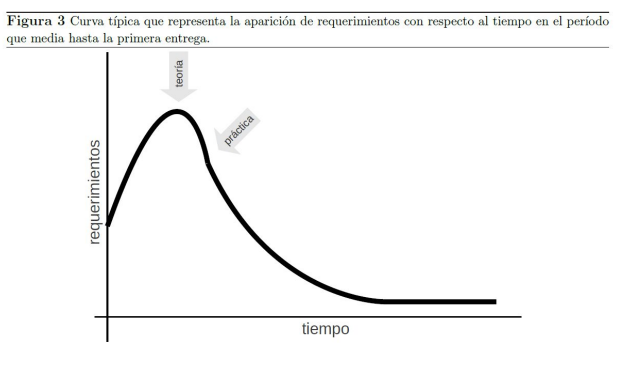

En el modelo cascada, solo se puede avanzar con la fase 3 (diseño) cuando la aparicion de requerimientos baje con respecto al tiempo como se muestra en la figura.

El proceso de ing de requerimientos es el siguiente

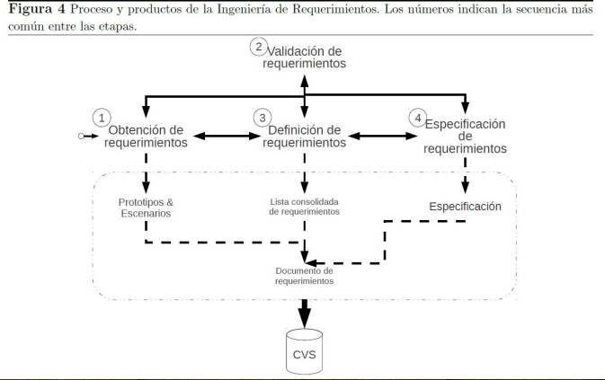

**Obtención de requerimientos**. En esta etapa se obtienen los requerimientos del sistema a través de la observación de sistemas existentes y del entorno donde se instalara el sistema mediante reuniones, prototipos, escenarios, etc.

**Validación de requerimientos**. Los requerimientos solo pueden ser validados por el cliente. Por lo tanto, una vez que se ha obtenido un requerimiento (preguntando al cliente) se le debe preguntar si ese es el requerimiento que expreso.

**Definicion de requerimientos**. En esta etapa la información colectada en la etapa anterior se vuelca en un documento consolidado, organizado y estructurado.

**Especificación de requerimientos**. en esta etapa la Lista consolidada de requerimientos se escribe desde la perspectiva del desarrollador

## Calidad de requerimientos

La calidad de un requerimiento se refiere en general a que tan perdurable en el tiempo sera tal y como esta descripto en este momento.

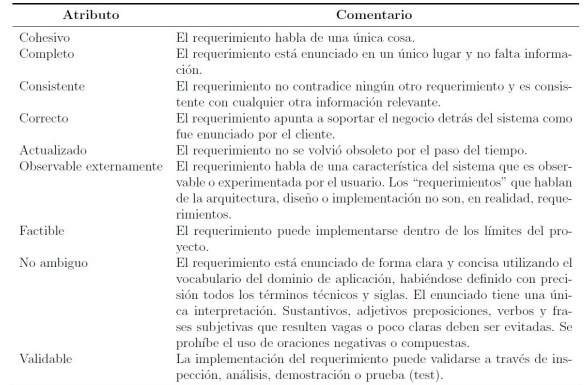

## Productos del proceso de la ingenieria de requerimientos

**Prototipos**

**Escenarios**

**Lista consolidada de requerimientos**

# [11-04-22] Metodologias agiles - Historias de usuario

`Nota: en metodologias agiles, la documentación es muy reducida pero no nula`

`Nota: Las historias de usuario son muy comunes en metodologias agiles, pero no son obligatorias para documentar requerimientos`

Las historias de usuario son pequeñas descripciones de los requerimientos del cliente. Se suele utilizar el lenguaje natural. Esta compuesto por.
* Rol
* Funcionalidad
* Resultado esperado
* Requisitos de aceptación

**COMO [...] QUIERO [...] PARA [...]**

`Nota: El para es muy importante para priorizar requerimientos.`

`Nota: Las historias de usuario estan centradas en el usuario, no en el producto o en la organización.`

Los **criterios de aceptación** **clarifican el contexto** en el que ocurre la historia de usuario y **facilitan** saber cuando estan **realmente terminadas**.

# [26-04-22]

## Validación de requerimientos

Que hacemos cuando **validamos requerimientos**?

* Verifica que los requerimientos realmente **definen** el **sistema** que el cliente **desea**.
* La importancia de esta etapa radica en **evitar costos** descubriendo **errores** en los **requerimientos** y no durante el desarrollo o después de que el sistema este en uso.

Proceso de validación de requerimientos:

* Verificaciones de **validez**: Aquí surgen funciones adicionales o diferentes a las planteadas.
* Verificaciones de **consistencia**: En el documento de requerimiento no debe haber restricciones o descripciones **contradictorias** de la misma función del sistema.
* Verificaciones de **completitud**: El documento de requerimiento debe incluir requerimientos que definan **todas** las **funciones** y **restricciones** propuestas por el usuario.
* Verificaciones de **realismo**: De acuerdo a la tecnología existente, los requerimientos deben verificarse para asegurar que se **pueden implementar**, también se debe tener en  cuenta el **presupuesto** y la **agenda**.
* **Verificabilidad**: Esto se logra si por cada requerimiento se puede escribir un conjunto de **pruebas** que **demuestren** que el **sistema** a entregar **cumple** con los **requerimientos** especificados.

**Tecnicas** de **validación** de requerimientos

* **Revisión** de **Requerimientos**: Los requerimientos son **analizados** **sistemáticamente** por un conjunto de **revisores**.
* **Construcción** de **prototipos**: Los usuarios pueden experimentar con este modelo para ver si cumple con las necesidades reales
* **Generación** de **casos** de **prueba**: Los requerimientos deben poder probarse. Se diseñan las **pruebas** **antes** de la codificación de los requerimientos

**Proceso** de **revisión** de requerimientos:

* Proceso manual que involucra a varios lectores, tanto del cliente como del contratista. 
* Puede ser formal o informal. 
* En la revisión formal el equipo de desarrollo "conduce" al cliente a través de los requerimientos, explicándole las implicaciones de cada uno. 
* Los conflictos, contradicciones, errores y omisiones deben señalarse durante la revisión y registrarse formalmente 

Preguntas para realizar las revisiones:

* **Entendimiento**: Se **entiende** el requerimiento? Este es el atributo mas importante de del documento de requerimientos ya que si no se puede entender no puede ser validado.
* **Redundancia**: Hay informacion **repetida** innecesariamente en el doc. de requerimientos? A veces repetir informacion aclara la compremsion del requerimiento pero a veces por el contrario hace la  comprension mas dificil.
* **Completitud**: La personas que valida percibe que **falta informacion** en el requerimiento o falta informacion en la descripcion del mismo?
* **Ambiguedad**: Existen en la descripcion de requerimientos terminos que no se entienden? Todos los lectores **interpretan lo mismo** sobre el requerimiento o existen diferentes interpretaciones.
* **Consistencia**: Algunos requerimentos son **contradictorios** entre si? Se contradicen con la idea general del sistema, o de las reglas del negocio?
* **Organizacion**: EStan los requerimientos agrupados segun funcionalidad? respetan alguna estructura?
* **EStandar**: Respetan los estandares adoptados?
* **Trazabilidad**: Los requerimeintos incluyen links con otros requerimientos relacionados? Son **trazables** con casos de uso, modelos o diagramas? Son trazables  con la fuente de informacion

## Administración de requerimientos

Es importante mantener una **trazabilidad** de los requerimientos ya que estos **cambian** a lo largo del tiempo de vida del proyecto, ademas de que la **comprensión** del problema por parte de los stakeholders va **cambiando** a medida que el proyecto se va llevando a cabo.

La gestión o administración de requerimientos es el proceso de **comprender** y **controlar** los **cambios** en los **requerimientos**.
Hay que establecer un **proceso formal** para implementar las **propuestas** de **cambios** y vincular estos a los requerimientos del sistema.
El proceso de gestión de requerimiento debería empezar en cuanto este disponible una **versión preliminar** del documento de requerimientos. 

Desde una perspectiva evolutiva, los requerimientos se dividen en 2 clases:
* **Duraderos**: relativamente estables que se derivan de la actividad principal de la organización
* **Volatiles**: probablemente cambien durante el proceso de desarrollo del sistema o después de que este se haya puesto en funcionamiento. 
  * **cambiantes**: los requerimientos cambian debido a los **cambios** en el **entorno** en el que opera la organización.
  * **emergentes**: los requerimientos que emergen al **incrementarse** la **comprensión** del cliente en el desarrollo del sistema. El proceso de diseño puede revelar requerimientos emergentes nuevos.
  * **consecuentes**: los requerimientos que son el resultado de la introducción del sistema informático, esto puede cambiar los procesos de negocio, las formas de trabajo que generan nuevos requerimientos.
  * **de compatibilidad**: estos requerimientos dependen de sistemas particulares o procesos de negocios dentro de la organización.

Es importante distinguir entre estos 2 tipos de requerimientos.

Para mantener la trazabilidad de los cambios de los requerimientos, se establecen politicas de rastreo:

* Relaciones entre requerimientos
* Relaciones entre los requerimientos y el diseño del sistema que se debe registrar Y de que manera estos registros se deben mantener.

Existen tres tipos de **información** de **rastreo** que pueden ser mantenidas. 
* Información de rastreo de la **fuente**:
  * Vincula los **requerimientos** con los **stakeholders** que propusieron los requerimientos y la **razón** de éstos. Cuando se propone un cambio, esta información se utiliza para encontrar y consultar a los stakeholders sobre el cambio.
* Información de rastreo de los **requerimientos**:
  * Vincula los **requerimientos dependientes** en el documento de requerimientos. Esta informacion se utiliza para evaluar cómo es probable que muchos requerimientos se vean afectados por un cambio propuesto y la magnitud de los cambios consecuentes en los requerimientos.
* Información de rastreo del **diseño**
  * vincula los **requerimientos** a los **módulos del diseño** en los cuales son implementados. Esta información se utiliza para evaluar el impacto de los cambios de los requerimientos propuestos en el diseño e implementación del sistema.

**Matriz de rastreo**

A menudo, la información de rastreo se representa utilizando matrices de rastreo, las cuales relacionan los requerimientos con los stakeholders, con los módulos del diseño los requerimientos entre ellos. En una matriz de rastreo de requerimientos, cada requerimiento se representa en una fila y en una columna de la matriz. Cuando existen dependencias entre diferentes requerimientos, éstas se registran en la celda en la  intersección fila/columna.

Las matrices de rastreo son utiles cuando la cantidad de requerimientos es baja. Para estos casos hay herramientas automatizadas como las siguientes.

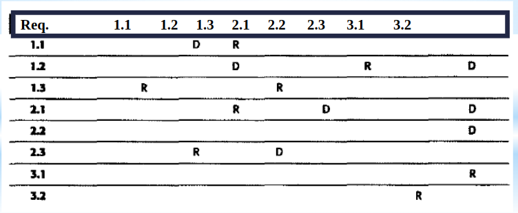

**Herramientas CASE**

* **Almacenar requerimientos**. Los requerimientos deben mantenerse en un almacén de datos seguro y administrado que sea accesible a todos los que estén implicados en el proceso de ingeniería de requerimientos.
* Gestionar el **cambio**. Este proceso se simplifica si está disponible una herramienta de ayuda.
* Gestionar el **rastreo**. Como se indicó anteriormente, las herramientas de ayuda para el rastreo permiten que se descubran requerimientos relacionados. Algunas herramientas utilizan técnicas de procesamiento del lenguaje natural para ayudarle a descubrir posibles relaciones entre los requerimientos.

Existen **tres etapas** principales en un proceso de gestión de cambio:

**Análisis** del **problema** y **especificación** del **cambio**. 

El proceso empieza con la identificación de un **problema** en los **requerimientos** 0, algunas veces, con una **propuesta** de **cambio** específica. Durante esta etapa, el problema o la propuesta de cambio se analiza para **verificar** que ésta es **válida**. Los resultados del análisis se pasan al solicitante del cambio, y algunas veces se hace una propuesta de cambio de requerimientos más específica.

**Análisis** del **cambio** y **cálculo** de **costes**. 

El efecto de un cambio propuesto se **valora** utilizando la **información** de **rastreo** y el conocimiento general de los requerimientos del sistema. El coste de hacer un cambio se estima en términos de **modificaciones** al **documento** de requerimientos y, si es apropiado, al **diseño** e **implementación** del sistema. Una vez que este análisis se completa, se toma una decisión sobre si se continúa con el cambio de requerimientos.

**Implementación** del **cambio**. 

Se **modifica** el **documento** de requerimientos y, en su caso, el **diseño** e **implementación** del sistema. Debe organizar el documento de requerimientos de modo que pueda hacer cambios en él sin tener que hacer grandes reorganizaciones o redactar nuevamente gran cantidad del mismo. Como sucede con los programas, los cambios en los documentos se llevan a cabo minimizando las referencias externas y haciendo las secciones del documento tan modulares como sea posible. De esta manera, se pueden cambiar y reemplazar secciones individuales sin afectar a otras partes del documento.


Los procesos de **desarrollo iterativo**, como la programación extrema, se han diseñado para **hacer frente** a los **requerimientos** que **cambian** durante el proceso de desarrollo. En estos procesos, cuando un usuario propone un cambio en los requerimientos, no se hace a través de un proceso formal de gestión del cambio. Más bien, el usuario tiene que establecer la prioridad del cambio y, si es de alta prioridad, decidir qué característica del sistema que fue planificada para la siguiente iteración debería abandonarse.