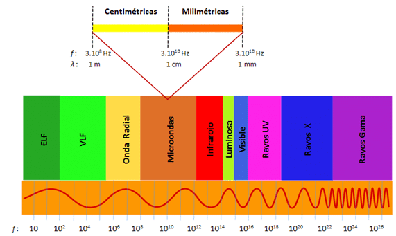
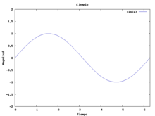
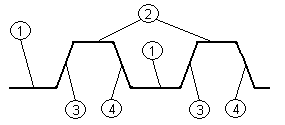
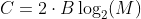
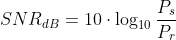
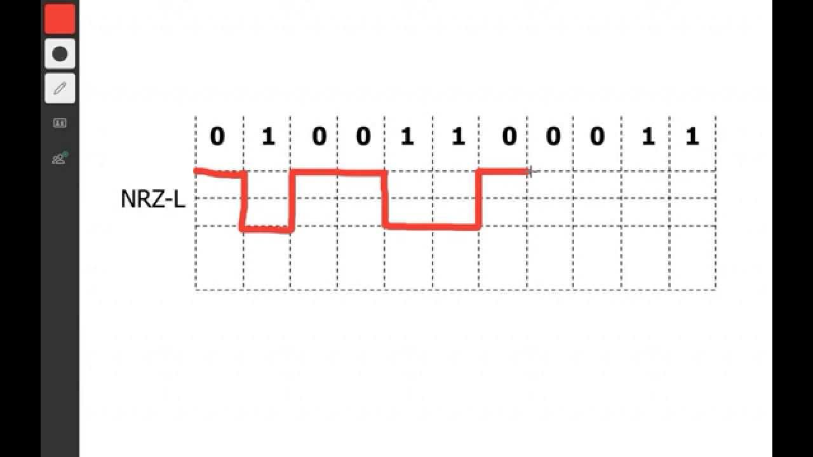
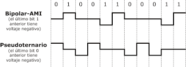
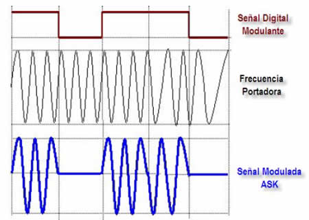
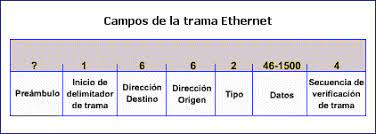

# Redes teleinformaticas

- [Redes teleinformaticas](#redes-teleinformaticas)
- [Modelo de comunicaciones](#modelo-de-comunicaciones)
- [Redes de comunicación](#redes-de-comunicación)
  - [Modelo TCP/IP](#modelo-tcpip)
  - [Modelo OSI](#modelo-osi)
- [Transmisión de datos](#transmisión-de-datos)
  - [Perturbaciones en la transmisión](#perturbaciones-en-la-transmisión)
    - [Atenuación](#atenuación)
    - [Ruido](#ruido)
    - [Capacidad de canal](#capacidad-de-canal)
      - [Nyquist](#nyquist)
      - [Shannon](#shannon)
  - [Codificación - Modulación](#codificación---modulación)
    - [Esquemas de codificación digital](#esquemas-de-codificación-digital)
      - [NRZ-L / NRZ-I](#nrz-l--nrz-i)
      - [Binario multinivel](#binario-multinivel)
      - [Bifase](#bifase)
    - [Modulación - Codificación analogica](#modulación---codificación-analogica)
- [Medios de comunicación](#medios-de-comunicación)
  - [Medios guiados](#medios-guiados)
    - [Cable de par trenzado](#cable-de-par-trenzado)
    - [Cable coaxial](#cable-coaxial)
    - [Fibra optica](#fibra-optica)
  - [Medios no guiados](#medios-no-guiados)
    - [Microondas terrestres](#microondas-terrestres)
    - [Microondas por satelite](#microondas-por-satelite)
    - [Ondas de radios](#ondas-de-radios)
    - [Infrarrojos](#infrarrojos)
- [Capa 2 OSI - Capa de enlace de datos](#capa-2-osi---capa-de-enlace-de-datos)
  - [1 - Sincronización](#1---sincronización)
  - [2 - Control de flujo de datos](#2---control-de-flujo-de-datos)
    - [Stop and wait](#stop-and-wait)
    - [Ventana deslizante](#ventana-deslizante)
  - [3 - Detección de errores](#3---detección-de-errores)
    - [Control de paridad](#control-de-paridad)
    - [Cyclick Redundancy Check (CRC):](#cyclick-redundancy-check-crc)
  - [4 - Control de errores](#4---control-de-errores)
  - [5 - Direccionamiento](#5---direccionamiento)
- [Redes lan](#redes-lan)
  - [Elementos de las lan](#elementos-de-las-lan)
- [Redes Wlan](#redes-wlan)
  - [Elementos de las WLan](#elementos-de-las-wlan)

# Modelo de comunicaciones

El modelo de comunicaciones que utilizaremos a lo largo del cursado es el siguiente:

En donde los componentes se describen de la siguiente manera:
* **Fuente**: La fuente que genera los datos
* **Transmisor**: el elemento que se encarga de transformar los datos a comunicar en un formato que se pueda enviar por el medio y codificar dichos datos de manera tal que el receptor pueda entenderlos
* **Medio**: Es el camino fisico mediante el cual viajara el mensaje. En este se pueden generar ruidos e interferencias que dificulten la comunicación de la información.
* **Receptor**: Elemento encargado de transformar y desencriptar los datos recibidos por el medio
* **Destino**: Entidad encargada de recibir los datos y procesarlos.

# Redes de comunicación

A veces no es practico conectar directamente dos dispositivos entre si debido a, entre otras cosas, la distancia entre dichos dispositivos, o la cantidad de dispositivos a conectar entre si. Por esto se generan los siguientes modelos de comunicaciones:
* Red de area amplia(**WAN**): Red que cubre una **extensa area geografica**, requieren atravesar rutas de acceso publico y utilizan parcialmente circuitos proporcionados por un ISP. Es una serie de dispositivo de conmutación interconectados.
* Red de area local (**LAN**): Red que comunica dispositivos, solo que su **cobertura geografica** es mas **pequeña** y sus **velocidades** de transmición dentro de los dispositivos de la misma red son **mas altas**.

## Modelo TCP/IP

Esta es la **arquitectura** de desarrollo de **estandares** de comunicación mas adaptada para la comunicación de sistemas desarrollado por Arpanet. consiste tambien de una familia de **protocolos** que se han erguido como estandares de internet. se puede organizar en **5 etapas** diferentes:

* **Aplicación**: Logica que posibilita las apps de ussuario
* **Transporte**: Asegura el correcto envio de los datos entre las apps
* **Internet**: Permite que los datos atraviesen distintas redes interconectadas
* **Acceso a red**: Proporciona a la red los datos e interfaces para lograr la comunicación.

## Modelo OSI

Es otra arquitectura para las comunicaciones entre computadores desarrollado por la ISO. Esta arquitectura posee **7 capas**:

# Transmisión de datos

La transmisión de datos entre un emisor y un receptor se realiza mediante un **medio de transmision**. Este medio puede ser **guiado** (las ondas electromagneticas se confinan en un camino fisico) o **no guiado** (las ondas no se confinan y se emiten al "aire" o al ambiente).

Los medos tambien pueden ser **punto a punto** o **multipunto**.

La transmisión de datos se puede clasificar según si es:
* **Simplex**: Únicamente permiten la transmisión en un sentido (unidireccional). Es aquel en el que una estación siempre actúa como fuente y la otra siempre como receptor.
* **Half duplex**: los datos fluyen en una u otra dirección, pero no las dos al mismo tiempo (walkie talkie).
* **Duplex**: permite canales de envío y recepción simultáneos.

El espectro electromagnetico de una señal es el conjunto de frecuencias de la misma. El ancho de banda absoluto es la anchura de dicho espectro. El ancho de banda efectivo (o simplemente **ancho de banda**) es la **banda de frecuencias** que contiene la **mayor parte** de la **energia** de una señal.

Al intentar transmitir una señal por un medio, la **naturaleza** del mismo **limitara** el anch**o de banda** que se pueda transmitir (sobre todo en medios guiados). Cuanto **mayor** sea el ancho de banda de un medio, **mayor** sera la **velocidad** de transmision de los datos.

Hay dos tipos de señales que se pueden transmitir en un medio:
* **Señales analogicas**: Es una señal representable por una función matematica continua.

* **Señales digitales**: Es una secuencia de pulsos de tenmsion constantes en la que se codificican los datos

## Perturbaciones en la transmisión

### Atenuación

Este es el decaimiento de la potencia ed una señal con la distancia. Es una función creciente de la **frecuencia** y se calcula de la siguiente manera:

### Ruido

En cualquier dato, la señal recibida consistira en la señal transmitida (originalmente) modificada debido a distorciones introducidas de manera no deseada. A estas distorsiones se las denomina **ruido**. Los ruidos pueden ser:

* **Ruido termico**: Se debe a la agitación termica de los electrones y se calcula de la siguiente manera

En donde K es la constante de boltzmann (1.38*10^-23 Joule/K°) y T es la temperatura en grados Kelvin.

* **Ruido de intermodulación**: Ruido producido por señales de distintas frecuencias que comparten un mismo medio. Sucede cuando no hay **linearidad** ne el sistema de transmisión
* **Diafonia**: Acoplamiento no deseado de señales
* **Ruido impulsivo**: Esta constituido por picos irregulares de corta duración y de gran amplitud generados por diversas fuentes.

### Capacidad de canal

Esta es la cantidad o **velocidad** a la que se pueden **transmitir datos** en un **canal**. Cuanto **mayor** es el **ancho de banda** de un servicio, **mayor** es el **costo**. Las **limitaciones** en el ancho de banda surgen de las **propiedades fisicas** del medio y por **limitaciones** impuestas **deliberadamente** para evitar **interferencias**. Por esto es deseable hacer un uso enficiente dado un ancho de banda limtado, es decir, conseguir la mayor velocidad sin superar la tasa de erorres permitida. Existen dos formulas que nos permiten calcular la capacidad de un medio:

#### Nyquist

Si no tenemos cuenta el ruido, para señales binarias, el limite maximo de la velocidad de transmisión depende del ancho de banda (o **dos veces** el **ancho de banda**, segun Nyquist).

Sin embargo, se pueden implementar señales de dos o mas niveles mediante la **modulación/codificación**, por lo que cada elemento de señal pede representar **mas** de **2 bits**. La formula quedaria asi:

donde **N** es la **cantidad de bits** que se pueden enviar mediante dicha modulación/codificación

#### Shannon

Usando esta formula se tiene en cuenta el **ruido** y la tasa de errores. La presencia de ruido puede **corromper** 1 o mas bits. Si se **aumenta** la **velocidad** de transmision, el bit se hace mas **corto**, por lo que el **ruido afecta a mas bits**.

Dado un nivel de ruido es de esperar que **incrementando** la **potencia** de la señal se **mejora** la **recepción** de los datos en la presencia de ruidos. Por ello, en esta formula un parametro fundamental es la **relación señal ruido**.

Una **SNR alta** significa una señal de **alta calidad** ya que esta expresión muestra cuanto excede la señal al ruido.

Este parametro junto con el **ancho de banda** determinan la **maxima velocidad de transmisión** en la formula de **Shannon**:

## Codificación - Modulación

La transmisión **analogica** se basa en una señal **continua** de **frecuencia constante** denominada **señal portadora** (la frecuencia se elige para que sea compatible con el medio). Los datos (digitales o analogicos) se pueden transmitir modulando la señal portadora. 

La **modulación** es el proceso de **codificar** los **datos** generados en la fuente modulando la **señal portadora**, modificando uno o mas de los tres **parametros fundamentales** de las señales/ondas: la **amplitud**, **frecuencia** y **fase**. La señal de entrada se denomina **señal moduladora** y la de salida **señal modulada**.

En la señalización digital, una fuente de datos se codifica en una señal digital eligiendo una **tecnica de codificación** que optimize el uso del medio.

### Esquemas de codificación digital

#### NRZ-L / NRZ-I

Este esquema de codificación utiliza un nivel de **tension constante** para cada elemento de señal (**1** para el **negativo** y **0** para el **positivo**).

En el **NRZ-I**, tambien la tension se mantiene **constante** durante la duración de un bit, solo que se codifica comparando la **polaridad** de los elementos de señal **adyacentes**, es decir, si llega el **mismo valor**, se codifica la **misma señal** que la anterior. Si se trata de **otro valor**, entonces se codifica utilizando una **señal diferente**. Los datos se decodifican mediante la presencia o ausencia de una **transición** al **principio** del **intervalo** del bit (no se evalua a la mitad del intervalo)

Esto se conoce como **codificación diferencial** y es mas **tolerable al ruido**.

Los codigos **NRZ** son **faciles** de **implementar** y hacen un uso **eficaz** del **ancho de banda**. Sin enbargo sigue conteniendo una **componente continua** y no contiene capacidad de **sincronización** entre el emisor y receptor.

#### Binario multinivel

En estos esquemas de codificación, no hay problemas de **sincronización** en los casos donde se **fuerza** una **transición**. En esos casos tampoco hay **componente continua**. El otro caso es un poblema. Estos metodos tambien una forma sencilla de **detectar errores**. Sin embargo, no hace un uso tan eficaz del ancho de banda como los NRZ (se necesita mas potencia para ebitar errores por ruido)

#### Bifase

El codigo Manchester siempre tiene una **transición** a **mitad** del intervalo del bit. Esto sirve tanto como **sincronización** y **transmisión** de **datos**. Una transición de **bajo a alto** es un **1** y al revez es **0**. En Manchester **diferencial**, la transición a mitad del intervalo es solo para **sincronizar**. Un **0** se representa con una transición al **inicio del intervalo** del bit y un **1** mediante la **ausencia** del mismo.

Estos codigos son los **mas usados** para la transmisión de **datos** ya que proveen **sincronización**, no tienen **componente continua** y proveen **detección de errores**. Sin embargo, ya que requieren el **doble** de **velocidad de modulación**, se necesita un **mayor ancho de banda**.

### Modulación - Codificación analogica

Estas técnicas permiten un mejor **aprovechamiento** del **canal** de comunicación lo que posibilita transmitir **más información** de forma **simultánea** además de mejorar la resistencia contra posibles ruidos e interferencias.

La modulación involucra uno o mas parametros de la señal portadora, por lo que las tecnicas de codificación son las siguientes:

* **ASK** (Amplitud key shifting)

* **FSK** (frecuency key shifting)

* **PSK** (phase key shifting)

# Medios de comunicación

En los sistemas de transmisión, el medio de transmision es el **camino fisico** entre el **transmisor** y el **receptor**. Los medios de transmision se clasifican en medios **guiados** y **no guiados**. En ambos casos, la comunicación se lleva a cabo con **ondas electromagneticas**. 

En los medios **guiados**, las ondas se confinan en un medio **solido**, mientras que en los no guiados, las ondas se generan y reciben mediante **antenas**, que reciben y envian dichas ondas a traves de la **atmosfera**.

## Medios guiados

[ 1 GHz ]

En los medios guiados, la capacidad de transmisión depende drasticamente de la distancia y del tipo de red (punto a punto o multipunto). La calidad de la transmisión dependera tanto de la señal como de las caracteristicas del medio.

### Cable de par trenzado

Este es el medio **mas economico** y usado para las redes de **area local** y comunicación de info digital. Este medio esta compuesto por** pares de cobre** embutidos y **entrecruzados** en forma de **espiral** para **reducir las interferencias** entre los **pares adyacentes** de una **misma envolutura**.

Algunas caracteristicas de este medio son que este es el mas **economico**, y debido a sus distintas categorias (que se logran aumentando la cantidad de trenzas) proporciona **altas velocidades**/capacidades de transferencia de datos. Ademas, su **instalación** es muy **sencilla**.

* **CAT 3**: 10 Mbps - 16 MHz
* **CAT 5**: 100 Mbps - 100 MHz
* **CAT 7**: 10 Gbps - 600 MHz
* **CAT 8**: 40 Gbps - 1200 MHz

Sin embargo, la distancia maxima es **100 metros**, su ancho de banda es muy **limitado** y es muy **suceptible** a las **interferencias**. Para reducir esta suceptibilidad a las interferencias se pueden utilizar los cables **apantallados** o **STP** en donde se reviste al cable con una **malla metalica** que lo proteje de dichas interferencias.

### Cable coaxial

El cable coaxial opera sobre un **rango mayor** de **frecuencias** que el UTP (GHz). Esta compuesto por **dos conductores**, uno exterior y otro interior, ambos regularmente **espaciados** y bien **protegidos**. Debido a esto, este medio es mucho **menos suceptible** a **interferencias** y diafonias que el UTP.

### Fibra optica

La fibra optica es un medio **flexible** y **fino** capaz de confinar un haz de naturaleza **optica**. Este medio tiene una serie de ventajas:

* **Mayor capacidad** (Mayor ancho de banda y velocidades de transmición)
* **Menor tamaño** y **peso**
* **Atenuación menor**
* **Inafectados** por **interferencias**

La fibra optica propaga el haz de luz internamente de acuedo con el principio de la **reflexión total**, este fenomento se produce cuando un rayo de luz atravieza un medio de **indice** de **refracción menor** que el indice de refracción en el que se encuentra, por lo cual se refracta de tal modo que no es capaz de atravezar la supericie entre ambos medios, **reflejandose completamente**. Este fenomeno solo se produce para **angulos** de **incidencia** superiores a un cierto valor critico.

En la fibra optica la luz proveniente de la fuente **penetra** en el **nucleo** **cilindrico**. Los rayos que inciden con angulos **superficiales** se **reflejan** y **propagan** dentro edl nucleo, mientras que para otros angulos los rayos son **absorbidos** por el revestimiento. 

A este tipo de FO se la denomina **multimodal** ya que hay **muchos angulos** para los que se da la **reflexión total**. En este tipo de transmisión existen **multiples caminos** para los haces de luz, cada uno con **diferentes longitudes** y **tiempos de propagación**. Esto **limita** la **velocidad** a la que los datos pueden ser correctamente recibidos y la **distancia** (distancias cortas).

Cuando el redio del nucleo se reduce, la reflexión total se da en un numero menor de angulos. Al **reducir** el **radio** del nucleo a dimensiones del orden de la magnitud de onda, **solo un rayo** puede **pasar** (el rayo axial). Esta propagación **monomodo** proporciona **prestaciones superiores** ya que la distorción multimodal no puede darse y se usa en aplicaciones a **larga distancias**.

## Medios no guiados

En estos medios, la transmisión y recepción se lleva a cabo mediante **antenas** que **radian** y **captan** **energia electromagnetica** al **aire**.

En las transmisiones inalambricas hay 2 configuraciones:

* **Direccional**: La antena emite la energia concentrandola en un haz. El emisor y receptor deben estar perfectamente alineados. (Frecuencias altas, **Microondas**: 2-40 Ghz)
* **Omnidireccional**: Se emite energia en todas las direcciones, pudiendo la señal ser recibida por varias antenas (frecuencas bajas, ondas de radio: 30 MHz - 1Ghz)

### Microondas terrestres

Se usan antenas parabolicas (3m de diametro) **perfectamente alineadas** a una **altura** considerable del nivel del suelo para conseguir **mayores distancias** entre ellas y eliminar obstaculos en la transisión.

La distancia maxima se calcula mediante la siguiente formula

Donde d es la distancia en [ Km ], h la altura en [ m ] y k un factor de corrección que generalmente vale 4/3

Estos medios sustituyen a la fibra optica ya que **recorren mayores distancias** y necesitan menos repetidores

En las microondas (2 y 40 Ghz) cuanto mayor sea la frecuencia, mayor ancho de banda y por lo tanto mayores velocidades de transmisión.

Para este tipo de transmisiones, tambien hay **atenuación** y esta se mide mediante la sig formula:

Donde d es la distancia y lamda la longitud de onda, ambas en la misma magnitud. Cabe destacar que en las microondas, la atenuación aumenta con las **lluvias**.

### Microondas por satelite

Un **satelite** de comunicaciones es una **estación** que **retransmite** **microondas**. Se usa como **enlace** entre **dos** o **mas** **receptores** y **transmisores terrestres**. el satelite recibe la señal en una banda de frecuencia (**banda ascendente**) la amplifica o repite y retransmite en otra banda de frecuencia (**canal descendente**).

Para que un satelite funcione con eficacia su **posición** debe de tener una **orbita geoestacionaria** para mantener su posición con respecto a la tierra y **mantenerse alineado** con las **estaciones**.

Si dos satelites usan la misma banda de frecuencias, estos deben estar lo suficientemente separados como para no interferirse entre si.

Debido a las grandes distancias involucradas, hay un **retardo de propagación** que genera problemas a la hora de controlar errores y flujos de transmisión de datos.

### Ondas de radios

Estas son ondas **omnidireccionales**, por lo que no se necesitan antenas parabolicas. Estan ubicadas entre las frecuencias **30 MHz y 1GHz** y son muy usadas para las FM. Este rango de frecuencias es muy adecuado para la difusión simultanea a varios destinos.

Estas ondas son menos sensibles a la atenuación por la lluvia.

La distancia maxima y atenuación se calcula de igual manera que se calculan en las microondas, solo que debido a las logitudes de onda mayores, las ondas de radio sufren **menos atenuación**.

### Infrarrojos

Estas comunicaciones se llevan a cabo mediante transmisores y receptores que **modulan luz infrarroja**. Estos transmisores y receptores deben estar **alineados directamente** o mediante **reflexiones** en determinadas superficies (esta transmisión no puede atravesar paredes).

# Capa 2 OSI - Capa de enlace de datos

Esta capa cumple cinco funciones para que una vez que se han vinculado dos o mas equipos mediante la utilización de un medio fisico, podamos dar forma la información tomando un molde que se llama trama o frame y con el establecer la comunicación mas eficientemente posible y libre de errores.

Las funciones que realiza esta capa son las siguientes:

## 1 - Sincronización

Para indicar donde esta el comienzo y fin de cada bloque de datos, cada bloque comienza con un patron de bits especifico y termina con otro.

## 2 - Control de flujo de datos

Si se comienza a transmitir con una velocidad mayor a la que el receptor puede recibir datos, se va a producir overflow en el receptor y se perdera información. Para evitar esto, existen (o conocemos) dos tecnicas de control de datos.

### Stop and wait

El emisor manda un mensaje, el receptor lo confirma y una vez el emisor recibe dicha confirmación, se envia el nuevo mensaje

### Ventana deslizante

El receptor reserva espacio para almacenar W tramas, por lo que el emisor envia W tramas. Estas tramas se etiquetan con un numero de secuencia. El receptor confirma una trama enviando una señal de confirmación en donde se pide el numero de la siguiente trama a recibir, por lo que el emisor emite las siguientes W tramas a partir de la trama pedida.

Este metodo es mejor que el Stop and wait debido a que un mensaje suele estar compuesto por varias tramas.

## 3 - Detección de errores

Otra función es detectar cuando una trama llega con errores al receptor. Para lograr esto se asigna un campo en la trama formado por el resultado obtenido al aplicar un algoritmo entre la trama a enviar y un codigo que poseen los emisores y receptores. Este campo se denomina Frame Check Secuence.

Hay (o conocemos) dos metodos para la detección de errores:

### Control de paridad

Se alade un bit de tal forma que el bloque de datos tenga un numero par o impar de unos (paridad par o impar)

### Cyclick Redundancy Check (CRC): 

El transmisor agrega a una secuencia de n bits otra de k bits de tal forma que n + k sea divisible por algun numero establecido. Luego el receptor realiza esa división y si esta no da resto entonces significa que no hubo error en la transferencia.

El CRC es mejor que el control de paridad ya que en este ultimo en el caso en el que ocurran dos errores en 2 bits distintos de la trama, no se podria detectar que ha ocurrido un error en la transmisión.

## 4 - Control de errores

Las tecnicas empleadas para controlar los errores en el caso que estos se den son las siguientes:

* ARQ (Automatic Repet reQuest) Stop and wait: ANalogo al control de flujo de datos.
* ARQ Go back to N: Analogo a ventana deslizante
* ARQ Selective reject: El emisor envia una serie de W tramas y si hay error, el receptor avisa especificamente las tramas con error al transmisor, guardando las demas. El transmisor luego envia solo las tramas que fueron rechazadas.

En una primera instancia, se podria pensar que el Selective reject es mejor que el Go back to N. Sin embargo esto no es asi ya el Selective reject necesita mas memoria para alojar todas aquellas tramas correctas o sin errores, ademas que necesita que el receptor posea una logica adicional para ordenar las tramas, hecho que lo hace menos eficiente.

## 5 - Direccionamiento

Para saber quien envia la trama y hacia donde se dirige se reserva un campo en la trama para escribir las direcciones de origen y destino.

# Redes lan

Las reeds lan a diferencia de las wan son privadas y tienen mayores capacidades. El estandar mas usado es el 802.3

Las velocidades de las lan (entre los dispositivos dentro de dicha red) puede ir desde los 10 Mbps hasta los 1Gbps

Una colision es cuando 2 o mas estaciones comienzan a retransmitir tramas simultaneamente generando interferencias

## Elementos de las lan

Un repetidor prolonga la potencia de la señal para que esta llegue correctamente al receptor (capa 1 OSI)

Un bridge es un dispositivo de interconexion de redes de computadoras que opera en la capa 2 del modelo OSI (reconoce las tramas)

Un switch es un dispositivo que opera en la capa 2 e interconecta 2 o mas dispositivos sin que estos ocupen todo el espacio de la red

# Redes Wlan

Las redes WLan son redes de comunicación de distancias cortas que como medio de comunicación usan radiofrecuencia. El estandar de estas redes es 802.11.

## Elementos de las WLan

**Access point**: Provee a los clientes / dispositivos acceso a las redes wireless

**WNIC**: tarjeta adaptadora de red inalambrica que permite a los dispositivos conectarse a una red inalambrica mediante los AP

**Antenas**: Hilo de material conductor que permite enviar o recibir ondas electromagneticas. La dimension de estas esta directamente relacionada con la longitud de onda de las frecuencias para las que han sido diseñadas. Las antenas se pueden clasificar segun su:
* Diagrama de radiacióm
  * Isotropica
  * Omnidireccional
  * Direccional
  * Sectorial
* Ganancia
* BW
* Eficiencia

Modelos de operación de las WLan:
* Ad-Hoc
* Infraestructura

Metodos de autenticación:
* Open system
* PSK
* AES
* Filtro mac

Tipos de cifrado:
* WEP
* WPA
* WPA2