# Gestion agil de proyectos con scrum

- [Gestion agil de proyectos con scrum](#gestion-agil-de-proyectos-con-scrum)
- [[22-03-22] Modulo 1 - Métodos de gestión de proyectos](#22-03-22-modulo-1---métodos-de-gestión-de-proyectos)
  - [Implementacion agil en las organizaciones](#implementacion-agil-en-las-organizaciones)
  - [Como implementar la agilidad](#como-implementar-la-agilidad)
- [[05-04-22] Modulo 2 - El marco de trabajo Scrum](#05-04-22-modulo-2---el-marco-de-trabajo-scrum)
  - [Conceptos fundamentales de Scrum](#conceptos-fundamentales-de-scrum)
    - [Pilares de scrum](#pilares-de-scrum)
    - [Scrum como marco de trabajo](#scrum-como-marco-de-trabajo)
  - [Responsabilidades, ceremonias y artefactos](#responsabilidades-ceremonias-y-artefactos)
    - [Equipos](#equipos)
    - [Ceremonias](#ceremonias)
    - [Artefactos](#artefactos)
- [[19-04-22] Modulo 3 - Prácticas, valores y habilidades ágiles](#19-04-22-modulo-3---prácticas-valores-y-habilidades-ágiles)
  - [Habilidades y competencias para la agilidad](#habilidades-y-competencias-para-la-agilidad)
    - [Competencias técnicas y disciplinares](#competencias-técnicas-y-disciplinares)
    - [Competencias personales](#competencias-personales)
    - [Competencias interpersonales](#competencias-interpersonales)
  - [Valores y practicas agiles](#valores-y-practicas-agiles)
  - [Equipos agiles](#equipos-agiles)
  - [Practicas agiles](#practicas-agiles)
- [[10-05-22]](#10-05-22)
  - [Prácticas adicionales de Scrum](#prácticas-adicionales-de-scrum)
    - [1.Refinamiento del Backlog](#1refinamiento-del-backlog)
    - [2.Estimaciones en Scrum](#2estimaciones-en-scrum)
    - [3.Seguimiento del trabajo en Scrum (Burndown chart)](#3seguimiento-del-trabajo-en-scrum-burndown-chart)
    - [4.Scrum de Scrums](#4scrum-de-scrums)
    - [5.Sprint 0](#5sprint-0)
    - [6.Sprint H](#6sprint-h)
    - [7.Aterrizaje de Emergencia de Sprint](#7aterrizaje-de-emergencia-de-sprint)
    - [8.Planificación de Entregas](#8planificación-de-entregas)
    - [9.User Story Mapping](#9user-story-mapping)
  - [Comunidades y certificaciones ágiles](#comunidades-y-certificaciones-ágiles)
  - [Herramientas para la gestión de proyectos ágiles](#herramientas-para-la-gestión-de-proyectos-ágiles)

# [22-03-22] Modulo 1 - Métodos de gestión de proyectos

**Proyecto** (según la norma **ISO 21500**): **conjunto** único de **procesos** que consiste en **actividades coordinadas** y **controladas** con fechas de inicio y fin, llevado a cabo para lograr un **objetivo**. El logro de los objetivos del proyecto requiere **entregables** conforme a **requerimientos específicos**, incluyendo múltiples **restricciones** como el tiempo, costos y recursos.

`NOTA: Cada proyecto es unico`

Entonces, cuando usamos la palabra **“proyecto**”, hacemos referencia a **dos conceptos** fundamentales:
1. Es un **esfuerzo temporal** (tiene un comienzo y un final);
2. que se orienta a **generar** un **producto**, un **servicio** o un **resultado** que es **único**.

`NOTA: Proyecto !== proyecto`

La gestion de proyectos surgue a partir de necesidades militares estadounidenses y se profundiza en el rubro del software, con la creacion de la PMI (Proyect Management Institute) y el libro PMBOOK.

**Gestion de proyectos tradicional**

Es un enfoque de trabajo **predictivo**, que considera a la **planificación** como uno de sus pilares de éxito y expone la necesidad de organizar un proyecto a través de una **secuencia organizada de etapas** lógicas. la ejecución radica en la puesta en marcha de lo **definido** y **documentado** en una **etapa previa** de **planificación**, bajo la **responsabilidad** de un **líder** del proyecto

**Gestion de proyectos agiles**

Son aquellos enfoques que privilegian la **flexibilidad**, los **ciclos cortos de producción**, un mayor **involucramiento** de los **clientes**, y la **evaluación** y **mejora continua** de los **procesos** a través de un marco de trabajo **flexible** y **adaptativo**. 
los enfoques ágiles, abrazan los principios de la **satisfacción** del **cliente**, la **adaptación** al **cambio**, la **simplicidad** como regla, las **entregas frecuentes** y continuas, y los **equipos** de trabajo **motivados** y **autosuficientes**. 

**Ciclo de vida de un proyecto**

El ciclo de vida de un proyecto es la **serie de fases** que atraviesa un proyecto desde su **inicio** hasta su **conclusión**. Proporciona el marco de referencia básico para dirigir el proyecto. Este marco de referencia básico se aplica independientemente del trabajo específico del proyecto involucrado. Este puede ser **predictivo** o **adaptativo**

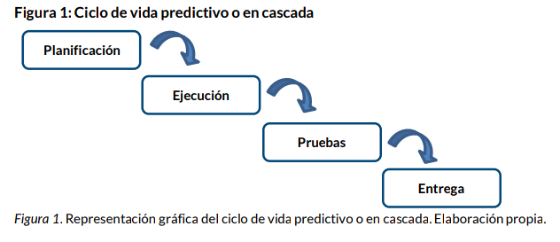

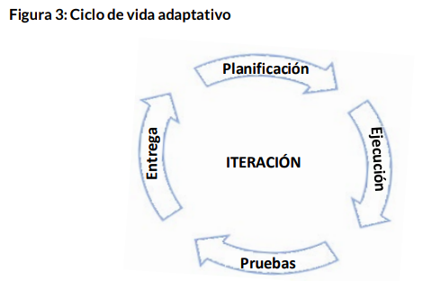

en el ciclo de vida **adaptativo**, propio de las metodologías **ágiles**, los proyectos se dividen en **iteraciones** de una duración **fija** predeterminada (comúnmente, de dos a cuatro semanas) en las que se **planifica**, **ejecuta**, **prueba** y **entrega** un **alcance** **acordado** y acotado del proyecto global, sin enfocarse la ejecución de procesos establecidos, sino en la **coordinación ágil**, **dinámica** y **flexible** del trabajo. Esto garantiza **entregas rápidas** de resultados, foco en un alcance reducido a cada iteración, y disminución del riesgo y la incertidumbre en la planificación, la cual se realiza sólo
para cada ciclo corto de desarrollo 

A través de estas iteraciones, los ciclos de vida adaptativos se concentran en un **desarrollo incremental** de **resultados**,
bajo la premisa de que el **alcance global** del producto **no necesita** estar completamente **definido** al comienzo del proyecto. De este modo, el equipo de trabajo se concentra en la entrega rápida de un producto o servicio funcional y viable para ser puesto de inmediato en el mercado, y en su posterior evolución y crecimiento en torno a su utilización
y el feedback continuo de sus usuarios finales.

Ejemplo de metodologia agil --> **LEAN**, **KANBAN**, **KAISEN**

Las metodologias agiles deben su auge a las propuestas de metodos de desarollo agil en la industria del software. SCRUM es una de ellas y la que mas ha llegado a trascender con aplicaciones en varios rubros alrededor del mundo.


2001 --> Manifiesto agil --> compendio de posiciones y **principios** que dio origen a la **corriente de métodos ágiles** de desarrollo de **software** (Tiene 12 principios).

```
Individuos e interacciones sobre procesos y herramientas.
Software funcionando sobre documentación extensiva.
Colaboración con el cliente sobre negociación contractual.
Respuesta ante el cambio sobre seguir un plan.
```

Como una de las muestras del impacto y expansión de la base asentada por el Manifiesto Ágil, en el año 2005 se redactó la Declaración de Interdependencia, un texto enfocando en la aplicación del marco de trabajo ágil a la disciplina de gestión de proyectos.

## Implementacion agil en las organizaciones

En este contexto de alta demanda y competitividad, la diferenciación y la innovación se convierten en ejes fundamentales para una organización, para lo cual debe repensar su estructura, sus procesos y su cultura en pos de reducir su time to market (el período que sucede desde la concepción de una idea o producto y su arribo al mercado), lograr la máxima eficiencia en su estructura de costos, promover la responsabilidad y los valores sociales en su personal, y lograr adaptarse y navegar con éxito tanto etapas de estabilidad y equilibrio como momentos de cambio e incertidumbre.

Una institución ágil es una organización:
* En donde se trabaja con orden y disciplina en torno a las necesidades del cliente.
* En donde se promueve e incentiva la motivación y el compromiso del equipo de desarrollo en torno a un objetivo común.
* Que opera en torno a los pasos de planificar - actuar - evaluar - mejorar.
* Resiliente, especialmente diseñada y organizada para lograr el mayor éxito en entornos tanto estables como inciertos.
* Que se estructura en torno a equipos multidisciplinarios y auto gestionados, en donde se promueve el trabajo colaborativo.
* Que opera bajo la máxima simplicidad y la mayor excelencia técnica.
* Que capitaliza un proceso de trabajo en torno a ciclos cortos y rápidos de aprendizaje.
* En donde la toma de decisiones es un proceso de ejecución rápido.
* En donde la información fluye y es transparente

* una organización ágil se propone desarrollar las competencias necesarias para lograr la estabilidad a través de la flexibilidad y la adaptación.

* Agilidad es la habilidad de una organización de renovarse a sí misma, adaptarse, cambiar rápidamente y tener éxito en un entorno variable, ambiguo y turbulento. Agilidad no es incompatible con estabilidad; todo lo contrario. Agilidad requiere de estabilidad para la mayoría de las organizaciones. 

* La agilidad necesita dos cosas. Una es una capacidad dinámica, la capacidad de moverse rápido: velocidad, agilidad, capacidad de respuesta. Y la agilidad requiere estabilidad, una base estable (una plataforma, por así decirlo) de cosas que no cambian.

* Las metodologías ágiles de gestión de proyectos ayudan a las organizaciones a alcanzar esa flexibilidad sin adulterar su principio estructural, componente esencial para asegurar la productividad en un entorno de eficiencia y eficacia. 

* El desafío de la agilidad radica, entonces, en encontrar ese punto de equilibrio indispensable entre la estabilidad y la flexibilidad, logrando así la minimización del riesgo inherente a todo proyecto

* La esencia misma hacia una transformación ágil reside en un cambio de mentalidad que lleva reconocer que el éxito de las instituciones se logra trabajando en equipo y de manera colaborativa con clientes, proveedores y aún con la competencia, a través de prácticas organizativas ágiles implementadas por equipos multidisciplinarios, auto-gestionados, empoderados y productivos

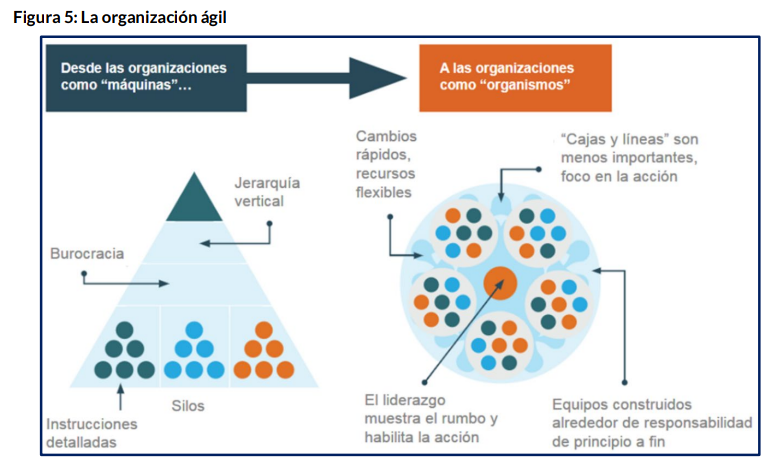

`NOTA: la flexibilidad, la agilidad y la capacidad de adaptación a los cambios del contexto resultan vitales para la supervivencia de las organizaciones.`

## Como implementar la agilidad

* La agilidad no es propietaria de una industria, sino que es una propuesta que ofrece un marco de trabajo adaptable a cualquier sector.
* las principales barreras para adoptar las nuevas metodologías se hallan en casa: la falta de experiencia en metodologías ágiles, la resistencia al cambio y la brecha de conocimiento en tecnologías.
* Un principio básico de la implantación pragmática de scrum es la flexibilidad, que consiste en adaptar las prácticas de scrum a la organización y no al revés.
* Para lograr un buen flujo de interacciones y facilitar la coordinación de acciones durante esta transición ágil, será importante también recuperar los espacios de representación física que promueven la comunicación y la transparencia: tableros, pizarras, notitas o post its

En resumen, la propuesta ágil es, en realidad, bastante simple…
* En vez de una organización bajo una estructura funcional, conformar equipos de trabajo autónomos, multidisciplinares y auto-gestionados.
* Hacer fluir una comunicación activa y transparente con el equipo, la dirección y el cliente.
* Trabajar de manera colaborativa (cada integrante tiene un rol, pero es también responsable del éxito global del equipo) y gestionar mediante consensos.
* Toda la organización trabaja hacia un objetivo común: proveer el máximo valor posible a sus clientes.
* Promover el aprendizaje continuo y la constante mejora técnica hacia la excelencia.
* Organizar el trabajo en ciclos cortos, con entregas rápidas y continuas.
* “Aplanar” las estructuras y agilizar el proceso de toma de decisiones.
* Compartir el conocimiento y las lecciones aprendidas al interior de la organización.
* Aceptar la incertidumbre y la variabilidad del entorno, y apostar a la innovación y la productividad para desarrollar productos y servicios de valor agregado.

# [05-04-22] Modulo 2 - El marco de trabajo Scrum

## Conceptos fundamentales de Scrum

Scrum es un **marco** de **trabajo liviano** que ayuda a las personas, equipos y organizaciones a **generar valor** a través de soluciones **adaptativas** para problemas complejos de manera creativa y **productiva**.

Scrum es el método ágil **más utilizado** y el único que logró **atravesar** las barreras del sector del **software**, es fácilmente **adaptable** a todo tipo de **proyectos** e industrias, lo cual lo convierte para muchos en la máxima representación de la agilidad.

`Nota: Scrum no es en si mismo una metodologia, sino mas bien un marco de trabajo`

El marco de trabajo Scrum propone el desarrollo de proyectos bajo ciclos de vida **cortos adaptativos** e **iterativos**, en donde se suceden los ciclos de **planificación**, **ejecución**, **entrega** y **evaluación**. De esta forma se consigue la construcción productos de manera **incremental**: cada ciclo o iteración genera un **entregable** de producto que se **incrementa** o evoluciona en la **iteración siguiente**.

El marco de trabajo Scrum asume que los **requerimientos** de los usuarios **cambian** con el **tiempo** y por ello el equipo que desarrolla un producto debe **adaptarse** a esa **variabilidad**. 

El trabajo por iteraciones cortas permite manejar un **alcance reducido** del proyecto, garantizando así una **rapidez** en la **respuesta** y el cambio de rumbo necesario.

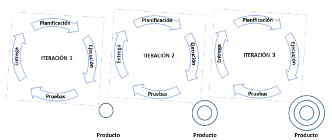

### Pilares de scrum

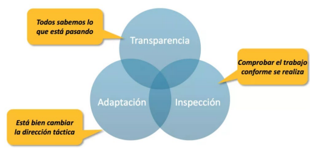

* La **transparencia**. Este pilar implica que toda la **información** del proyecto y los procesos de trabajo se **comparten** y son **visibles** y comprensibles para **todos**. La transparencia se basa en la **confianza** dentro del equipo, el cual se encuentra en un ambiente seguro para **opinar** y **participar**. A través de la transparencia, el proceso de trabajo y sus resultados están abiertos y disponibles a **toda** la **organización**.
* La **inspección**. El Equipo Scrum **inspecciona** el **avance** del trabajo de manera **periódica** para detectar **dificultades** y oportunidades de **mejora**, y comprobar el correcto avance del proyecto hacia sus objetivos. Con este propósito, cada iteración tiene una **reunión** especialmente destinada a la **inspección** del **equipo**, del **trabajo**, de las **herramientas** y del **proceso global**.
* La **adaptación**. Cuando en la inspección se identifican aspectos que no cumplen con un nivel aceptable según el marco de trabajo Scrum o los acuerdos realizados con el cliente, deben realizarse los **ajustes** necesarios para encauzar el proceso de trabajo. La adaptación se promueve mediante la priorización de los requerimientos ante cambios o necesidades del entorno y la reducción o ampliación del alcance de las iteraciones.

### Scrum como marco de trabajo

El proceso global de trabajo comienza cuando el **Dueño** de **Producto** (representante del cliente) captura y **prioriza** todos los **requerimientos** del producto o servicio y los plasma en un documento llamado **Backlog** de Producto. 

Al comenzar cada **Sprint** se realiza una Reunión de **Planificación** que toma ese listado de requerimientos y **selecciona**, en base a los elementos **prioritarios**, el **alcance** que se **desarrollará** en el Sprint.

Los Desarrolladores se comprometen por consenso a ese alcance de Sprint y **desglosan** los **requerimientos** en un listado de **tareas** a realizar que se plasma en un **Backlog** de **Sprint**. Con este compromiso, comienza el trabajo que se acompaña de una **Reunión Diaria** breve, de no más de 15 minutos, en la que los Desarrolladores pueden **coordinar** el **avance** de las tareas definidas.

Durante el desarrollo del Sprint, el Backlog de Sprint acordado **no se modifica**, a fin de garantizar la concentración de los Desarrolladores en el alcance definido en la planificación. 

El **Scrum Master** **acompaña** al equipo para que mantenga su nivel de productividad, **resuelva** cualquier **duda** o decisión sobre los requerimientos en desarrollo y logre los **niveles óptimos** de **comunicación** y **coordinación** necesarios para realizar el trabajo de manera eficiente. 

El último día del Sprint, los Desarrolladores entregan los requerimientos desarrollados al Dueño de Producto en una **Reunión de Revisión**. Posterior a ello, y también en el último día del Sprint, los Desarrolladores trabajan en una **Reunión de Retrospectiva** para inspeccionar y analizar cómo ha ido el Sprint y cuáles son las mejoras o correcciones que debería implementar en el siguiente, a fin de lograr una mayor eficiencia, eficacia y rendimiento general en el desarrollo del producto.

De este modo, el marco de trabajo Scrum acepta e incorpora rápidamente todo cambio de requerimientos que vaya proponiendo el cliente, ya que mientras los Desarrolladores **trabajan** en un **Sprint** con alcance acordado, el Dueño de Producto continúa **evolucionando** y priorizando los **requerimientos** del **Backlog** de **Producto**.

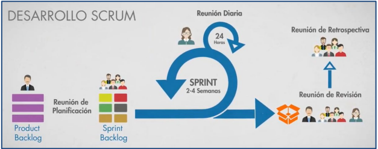

## Responsabilidades, ceremonias y artefactos

Son 3 responsabilidades, 5 ceremonias y 3 artefactos

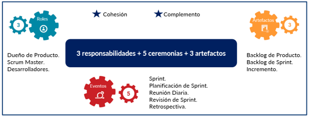

### Equipos

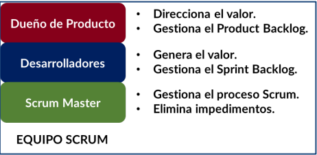

* **Dueño de producto**:
  * **representante** del **cliente** dentro del Equipo Scrum
  * **Optimiza** el **valor** del trabajo asegurándose de **priorizar** los **requerimientos** de **mayor valor** para el negocio.
  * **Administra** el **presupuesto** del proyecto determinando en qué requerimientos se **asignarán** los **esfuerzos** del equipo (horas de trabajo).
  * **Asegura** el **retorno** de la **inversión** mediante la prioridad de los requerimientos y la revisión y aceptación en conformidad de los entregables
  * debe tener pleno conocimiento del negocio y de la visión del producto
* **Desarrolladores**
  * Es un equipo de trabajo interdisciplinario 
  * se auto gestiona para decidir cómo desarrollar los requerimientos que define y prioriza el Dueño de Producto
  * no tienen un jefe o superior que lo dirija y coordine
  * todos los integrantes son igualmente responsables y tienen la misma voz y voto en el proceso de trabajo
  * no menos de 3 ni más de 9 miembros
  * equipo de alto desempeño y motivado, preferentemente estable y con dedicación completa al proyecto.
* **Scrum master**
  * velar por la correcta aplicación del marco de trabajo Scrum 
  * apoyar a los Desarrolladores para que puedan lograr el desarrollo del máximo valor posible
  * Se asegura de que: 
    * se arribe a consensos en las ceremonias o eventos
    * de que el Equipo comprenda los requerimientos planteados por el Dueño de Producto
    * de que los Desarrolladores realicen estimaciones acertadas y conscientes
    * de que las ceremonias cumplan su propósito, y de que se respete la duración de cada evento.
  *  es un coach, mentor, facilitador, guía y líder 


### Ceremonias

**1- Sprints**

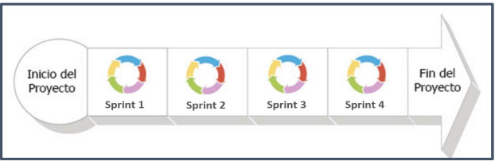

Se recomienda que los Sprint tengan siempre la misma duración a lo largo del proyecto, en ciclos de entre 1 a 4 semanas

Se desarrolla un alcance acotado del proyecto que a su finalización debe poder entregarse un incremento que cumpla con los criterios de “terminado”, según definido por el Equipo Scrum.

Cada Sprint comienza inmediatamente después a la finalización del anterior

**2- Planning**

primera ceremonia del Sprint en la que se acuerda el alcance del Sprint

Requiere de la participación de todo el Equipo Scrum y de un Backlog de Producto bien priorizado

En la Reunión de Planificación se define un **objetivo** para el Sprint (**Sprint Goal**) que permite clarificar qué se espera alcanzar al concluirlo: ¿qué haremos? y ¿para qué? transmitiendo el motivo por el cual el Sprint es valioso para el proyecto.

Esta ceremonia tiene una duración recomendada máxima de **8 horas** para un Sprint de un mes y se estructura en **dos partes**: en primera instancia se aborda la definición del **QUÉ** se realizará (alcance), para pasar luego a identificar el **CÓMO** se hará (plan de trabajo).

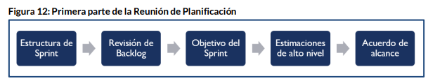

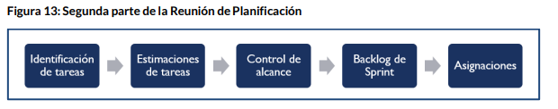

`Nota: Al momento de estimar tareas, Idealmente, cada tarea requerirá un día de trabajo. Si una tarea tiene una duración menor, se intentará combinar con otra; en caso de que tenga una duración mayor, se buscará dividirla en subtareas.`

**3- Daily**

ceremonia de no más de **15 minutos** de duración, en la cual los Desarrolladores **sincronizan el avance** de su trabajo en el Sprint. 

Una de las recomendaciones principales para estas reuniones es la de realizarla con todos los **integrantes parados**, a fin de mantenerla activa y breve. Si en esas reuniones surge alguna problemática, duda o cuestión que deba abordarse con mayor profundidad, se **reservará** un **espacio** para tratarlo de manera **posterior** a ella, de modo de **no romper** con la **dinámica** de la ceremonia. El Scrum Master es el responsable de
gestionar esas resoluciones.

Las Reuniones Diarias deben realizarse todos los días del Sprint en el mismo espacio físico y en el mismo horario e, idealmente, al lado del Tablero de Sprint

**4- Sprint review**

En el último día del Sprint sucede la Revisión del Sprint o Sprint Review, ceremonia en la cual el Equipo **presenta** el o los **incrementos** a los **interesados**

Estos incrementos se presentan funcionando

La duración recomendada de esta reunión es de 4 horas para un Sprint de un mes.

Al finalizar la revisión, el Dueño de Producto acepta el entregable, lo rechaza o identifica mejoras necesarias

**5- Retrospective**

La última ceremonia del Sprint y sucede luego de la reunión de Revisión del Sprint.

el Equipo Scrumrevisa los procesos y acciones del Sprint en la búsqueda de oportunidadesde mejora. Tambien se revisa que falló y qué debería mejorarse con respecto al vínculo y la coordinación en el quipo, al proceso de trabajo y a las herramientas utilizadas.

El resultado de esta reunión es un plan de mejora que se pondrá en marcha en el próximo Sprint y cuyos resultados serán evaluados en la siguiente Retrospectiva. 

Esta ceremonia requiere de una buena **moderación** y **facilitación** por parte del **Scrum Master** a fin de lograr explorar la real **causa** de los inconvenientes detectados y construir un **espacio seguro** para **conversarlas abiertamente**.

dura como máximo 3 horas

### Artefactos

Los artefactos de Scrum **representan trabajo** o valor. Están diseñados para **maximizar** la **transparencia** de la información clave. 

**Backlog de producto**

listado de todos los requerimientos del producto, registrados y priorizados por el Dueño de Producto. Es un documento vivo que está en constante modificación y evolución según las necesidades cambiantes del cliente

El registro de requerimientos en el Backlog de Producto se realiza en formato de **historias de usuario**, pequeñas oraciones breves y sencillas que describen una funcionalidad desde los diferentes roles de usuario del producto.

A través de estas breves narraciones o historias, logramos entendimiento común y el Dueño de Producto puede plasmar un requerimiento sin demasiada documentación asociada. Una historia de usuario se compone de tres
elementos: **¿quién?, ¿qué?, y ¿para qué?**

cada historia de usuario debe contar con sus criterios de aceptación

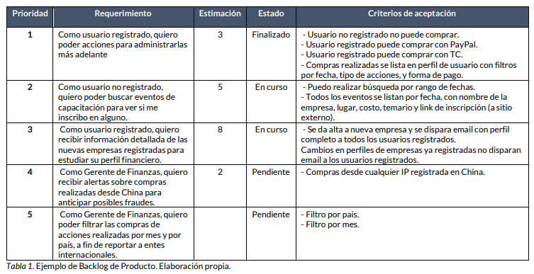

**Backlog de Sprint**

el listado de los requerimientos comprometidos para el Sprint con el desglose
de las tareas necesarias para cumplirlos.

Así como el Backlog de Producto es gestionado únicamente por el Dueño de Producto, el Backlog de Sprint es ámbito exclusivo de los Desarrolladores

Si durante la ejecución del Sprint aparecen nuevas tareas necesarias para cumplir con los requerimientos acordados, estas se suman al Backlog de Sprint.

Este artefacto suele llevarse al formato de un tablero (Tablero de Sprint), de modo que sirva de herramienta visual para el control y la transparencia del avance del Sprint hacia el Objetivo del Sprint

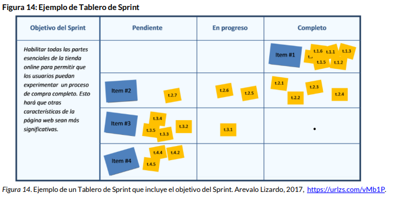

**Incremento**

resultado entregable del Sprint que aporta el valor proyectado en el objetivo definido y, por ende, representa un paso hacia el cumplimiento del Objetivo del Producto.

El incremento es “potencialmente entregable”, es decir, debe funcionar correctamente, haber sido probado y estar listo para ser puesto en marcha, independientemente de si así será hecho por el cliente. 

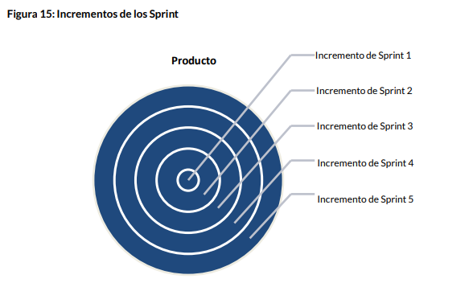

# [19-04-22] Modulo 3 - Prácticas, valores y habilidades ágiles

## Habilidades y competencias para la agilidad

El trabajo en entornos ágiles requiere de la **adquisición** de competencias y habilidades que resultan indispensables para alcanzar y asegurar una correcta **comunicación** y **coordinación** de acciones de manera **flexible**, **dinámica** y **ágil**. Estas habilidades pueden agruparse en **tres niveles**: competencias **técnicas** y disciplinares, competencias **personales** y competencias **interpersonales**. Veamos de qué se trata cada una de ellas.

### Competencias técnicas y disciplinares

Cuando trabajamos con proyectos es necesario desarrollar un conjunto de **habilidades** y **conocimientos** **técnicos** y disciplinares esenciales para una correcta gestión y dirección de acciones que nos permitan alcanzar los objetivos planteados.

Todos los que participan de un proyecto y, más aún, quienes ocupan un rol relevante en la toma de decisiones que lo afectan, deben tener o adquirir ciertas bases fundamentales sobre la **disciplina** de **gestión** de **proyectos**. Esto implica:
* reconocer y diferenciar las características de los ciclos de vida de los proyectos
* Determinar la implicancia, alcance e impacto del proyecto dentro de la estrategia de la organización.
* Reconocer la incidencia de la cultura organizacional en el proyecto
* Conocer las propuestas de las metodologías de gestión de proyectos, tanto de tipo tradicional como ágil
* Conocer sobre herramientas de gestión de proyectos
* Conocimiento técnico específico del rol que ocupa dentro del proyecto, su alcance y responsabilidades

Los proyectos suceden dentro de un **marco** (generalmente, una organización) y como parte de un **entorno** específico (industria, región). Ese contexto del proyecto incide sobre él, determinando ciertas características, tales como procesos o documentación obligatoria, restricciones en el tipo u horario del personal del proyecto, herramientas de gestión, entre otras. La organización en la cual se ejecuta el proyecto tiene una historia y una cultura definida, lo cual también afecta la forma en la cual se ejecuta, documenta y gestiona el proyecto. 

La gestión de proyectos en entornos **multiculturales** y con equipos **remotos** es una realidad que atraviesa de lleno a gran cantidad de proyectos en todo tipo de industrias. Esto también **influye** en las herramientas de comunicación y gestión que se utilizarán en el proyecto, en la coordinación de tareas y reuniones, en los procesos de toma de decisiones, en la cultura global de la organización y en la eficiencia y eficacia ágil general del proyecto.

Por otra parte, los **activos** de los procesos de la organización son todos aquellos recursos, políticas, documentos, procedimientos y bases de conocimiento propios de la organización que pueden ser **insumos** de **utilidad** para el **proyecto**. Ejemplos de activos de los procesos de la organización son: políticas de confidencialidad, lista de proveedores, plantillas de documentos y reportes y archivos de proyectos anteriores (Project Management Institute, 2017).


### Competencias personales

El trabajo en el entorno de proyectos demanda el desarrollo de habilidades personales esenciales para la autogestión en un contexto de colaboración, trabajo en equipo y gestión transversal de acciones en búsqueda de un objetivo común. Repasemos algunas de ellas:

* Gestión del tiempo (covey, pomodoro)
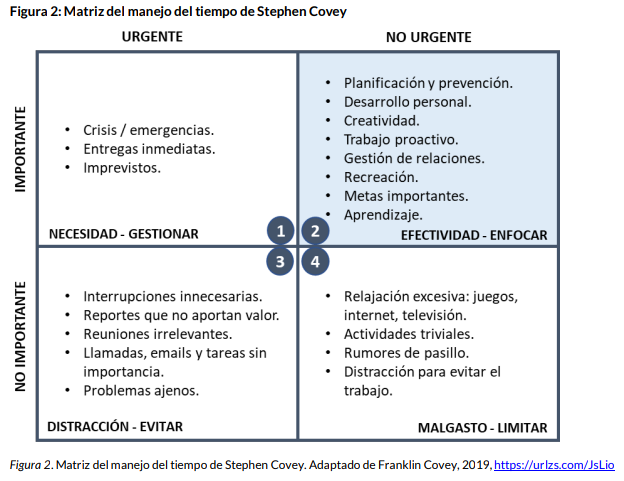
* Capacidad de toma de desiciones
* Manejo de las emociones
* Asertividad y empatía
* Creatividad e innovación
* Ética e integridad profesional
* Orientación a resultados

### Competencias interpersonales

El trabajo en el marco de un proyecto requiere del desarrollo de un gran número de competencias interpersonales indispensables para garantizar la armonía, integración y coordinación con otros en pos de una meta común.
* Liderazgo
* Motivación e influencia
* Comunicación
* Gestión de conflictos
* Negociación
* Trabajo en equipo

## Valores y practicas agiles

El Manifiesto Ágil propone cuatro valores esenciales para la agilidad: las personas, el resultado como generación de valor, la colaboración y trabajo en equipo, y la flexibilidad ante el cambio. 

Tomando esa base, el marco de trabajo Scrum establece un conjunto de cinco valores para la práctica ágil: el **coraje**, el **compromiso**, el **foco**, la **apertura** y el **respeto**

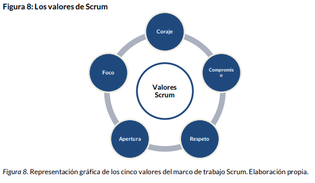

## Equipos agiles

Los equipos de trabajo ágiles:
* Son **equipos interdisciplinarios**: cada integrante aporta sus conocimientos técnicos y entre todos abordan el desarrollo integral de un producto o servicio.
* Cada integrante es **responsable** de su **propio rol** y del **rendimiento global** del equipo de trabajo, lo cual genera compromiso, colaboración y cohesión.
* Son equipos autónomos para realizar su trabajo, **sin jefes** ni **jerarquías** internas.
* El trabajo se gestiona de manera **colaborativa** y **consensuada**: entre todos definen un objetivo común y un alcance determinado en base a la mejor estimación de sus esfuerzos y capacidades.
* Son equipos que se **autogestionan** para lograr sus objetivos: identifican las tareas y acciones necesarias y definen la mejor manera de organizarse para realizarlas.
* Comparten un **único compromiso**, por lo cual asumen una responsabilidad mutua y compartida, toman decisiones en equipo y generan acuerdos a través de la negociación y el consenso.

se recomienda que estos equipos sean estables en el tiempo, ubicados en una misma oficina y teniendo una dedicación completa a un único proyecto.

Albaladejo (2009) explica que un **equipo ágil** debe poseer habilidades que enmarca en **tres tipos** de **inteligencia**: la inteligencia de **negocio**, relacionada con la generación de valor; la inteligencia **emocional**; y la inteligencia **vital**, vinculada al deseo de evolución y mejora continua.

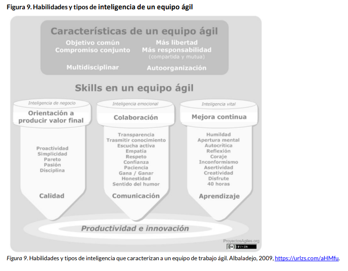

## Practicas agiles

Para lograr implementar la agilidad en la vida personal, académica y profesional, más allá de la etapa en la que se encuentre “mi equipo de trabajo”, podemos llevar adelante prácticas ágiles que se desprenden del cuerpo conceptual de tales metodologías de gestión y que representan un primer estadio hacia una cultura ágil individual y grupal.

* Reuniones periódicas y asiduas, breves, informales e informativas.
* Desarrollo iterativo en ciclos cortos de trabajo.
* Visualización gráfica del estado del trabajo: tener siempre visible nuestro avance.
* Organización de las prioridades: ¿qué es lo importante? ¿Qué aporta el mayor valor?
* ¡Comunicación!
* Trabajo en equipo: colaboración.
* Evaluación de lo realizado, aprendizaje y mejora continua.

# [10-05-22]

## Prácticas adicionales de Scrum

### 1.Refinamiento del Backlog

La práctica de **Refinamiento del Backlog** se dedica a preparar los elementos del Backlog de Producto para que contengan todas las **precisiones** necesarias para que las Reuniones de Planificaciones de Sprint avancen con mayor **certeza** y **celeridad**. A través de esta práctica, el Equipo Scrum se asegura de que el Backlog de Producto se encuentre debidamente priorizado, estimado y detallado. 

Para que los Desarrolladores puedan proveer estimaciones de esfuerzo de alto nivel acertadas para cada requerimiento, es necesario que el Backlog de Producto contenga toda la claridad e información necesaria. Para ello, el Backlog de Producto debería ser **DEEP**:

* **Detallado apropiadamente**. Los elementos de mayor prioridad están más detallados y especificados que los de menor prioridad, ya que se trabajará antes en los primeros que en los segundos.
* **Estimado**. Los elementos de que componen la siguiente versión del producto (release) deben estar estimados y, lo que es más, deberían revisarse y re-estimarse cada Sprint conforme vamos obteniendo nueva información.
* **Emergente**. Debido a la variabilidad y al aprendizaje experimentado, el Backlog de Producto es refinado regularmente.
* **Priorizado**. Los elementos del Backlog de Producto están priorizados de manera ordenada, de 1 a N.

Bill Wake propone utilizar el acrónimo **INVEST** para asegurar historias de usuario de buena calidad, de modo que cada una de ellas sea:
• I- **Independiente**: se trata de lograr historias de usuario independientes entre sí para poder construirlas en cualquier orden, según las prioridades de negocio.
• N- **Negociable**: las historias de usuario deben permitir a los Desarrolladores negociar con el Dueño de Producto el alcance detallado de las mismas para lograr una exploración conjunta de funcionalidad y llegar a un acuerdo.
• V- **Valiosa**: se debería poder identificar claramente el valor de la historia de usuario para el cliente o usuario.
• E- **Estimable**: se debería poder estimar con precisión el esfuerzo necesario para construir la historia de
• S- **Small** / Pequeña: se deben tener historias de usuario lo más pequeñas posibles para facilitar su estimación y minimizar su tiempo de construcción.
• T- **Testeable** / Comprobable: las historias de usuario deben poder comprobarse para verificar y validar su cumplimiento. (Scrum Manager, 2019)

### 2.Estimaciones en Scrum

Las **estimaciones** en entornos ágiles son **aproximaciones** informadas de la **duración** de una tarea en condiciones de trabajo ideales, se suelen medir a través del concepto de **esfuerzo** **necesario**, y (generalmente) se representan por medio de la unidad de “puntos de historia”. El significado de la escala de puntos de historia es **propio** de cada **Equipo** Scrum o de la misma organización de la cual este Equipo forma parte, según la duración de una tarea ya conocida o el equivalente a un conjunto de horas determinado.

Es importante que la **métrica** empleada, su significado y la forma de aplicación sea **consistente** en todas las mediciones de la organización, y conocida por todas las personas

Las estimaciones en Scrum son responsabilidad de los **Desarrolladores**

La técnica de estimación ágil más utilizada es el **Planning Poker**, la cual utiliza el criterio Delphi de realizar tantas rondas de estimación como sean necesarias hasta llegar a un consenso. Esta técnica utiliza una baraja de cartas que emplea una secuencia numérica para representar el esfuerzo de la tarea o historia de usuario. E

La estimación con Planning Poker sigue 4 pasos básicos:
1. El Equipo **discute** sobre la **funcionalidad** a estimar, analizando sus diferentes aristas y evacuando todas sus dudas con el Dueño de Producto.
2. Una vez que los Desarrolladores han logrado cabal comprensión del requerimiento o la tarea, cada integrante **elige** una **carta** que representa su estimación personal de esfuerzo para la funcionalidad y la deja **boca abajo**. Cuando todos ya seleccionaron su carta, al mismo tiempo ponen las cartas **boca arriba** y las presentan al mismo tiempo que los demás (de esta forma se evita que la decisión de un miembro pueda influir en los otros).
3. Si hubo **consenso** en la representación del esfuerzo, esa unidad de medida se asigna a la tarea o historia de usuario. Si no hay consenso, aquellos integrantes que presentaron las estimaciones más altas y bajas **explican** sus **razones** y se procede a una nueva ronda de estimación.
4. Este ciclo se realiza hasta arribar a consenso y resolver todas las inquietudes y diferencias

La **velocidad** del Equipo se calcula con el **avance** de los **Sprints** y se asocia al promedio de puntos de historia que desarrolla por iteración (cantidad de trabajo realizado por período de tiempo). Identificar este valor permite **estimar** con mayor **facilidad** si una determinada historia podrá ser cumplida o no en un Sprint, según cuántos puntos represente y cuál sea la capacidad del Equipo

La velocidad del Equipo no se mantiene fija, sino que va **cambiando** y debe ir ajustándose a medida que el Equipo madura y va avanzando los Sprint.

### 3.Seguimiento del trabajo en Scrum (Burndown chart)

Este gráfico es una herramienta útil para el autocontrol de los Desarrolladores, ya que permite **visualizar** de manera simple y rápida el **avance** del **trabajo** **acordado** para un Sprint. El gráfico de burn down (quemar hacia abajo, en inglés) muestra el progreso hacia el incremento de funcionalidad mediante una línea idealmente descendente hacia “cero esfuerzos pendientes”, es decir, esta herramienta muestra el trabajo restante hasta finalizar el Sprint (trabajo futuro).

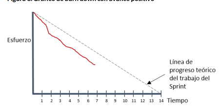

### 4.Scrum de Scrums

El Scrum de Scrums o Meta Scrum es la práctica de **Scrum** escalada a **equipos** de trabajo de gran cantidad de integrantes. Su aplicación consiste en la **coordinación** de los grupos de Desarrolladores (que poseen entre 3 y 9 miembros) a través de una **Reunión** Diaria llamada Scrum de Scrums en donde se busca la **sincronización** de todos los grupos. Cada grupo de Desarrolladores envía a un “embajador” que lo representa en esa reunión global, la cual suele suceder luego de la Reunión Diaria.

A diferencia de la reunión de Sincronización, la Reunión Diaria de un Scrum de Scrums suele celebrarse dos a tres veces por semana y durar hasta 45 minutos, permitiendo así tratar **inconvenientes** y tomar **decisiones** que no se abordan en la Reunión Diaria de los Desarrolladores. Idealmente, el embajador de cada Equipo Scrum irá variando de una reunión a otra, ofreciendo así a todos la posibilidad de participar en ese espacio de coordinación de acciones.

### 5.Sprint 0

El Sprint 0 es la iteración previa al comienzo de los Sprint del proyecto. Esta no es una práctica aceptada ni adoptada por todas las organizaciones, pero sí es recomendable su uso cuando recién se está comenzando con la implementación de este marco de trabajo. El Sprint 0 suele durar una semana, ya que es la iteración que se dedica a **organizar** el **marco** del proyecto

### 6.Sprint H

El Sprint H o **Sprint Hardening** es esa iteración que se dedica a **estabilizar** el producto desarrollado, **robustecerlo** o mejorar algunos de sus aspectos técnicos. En este Sprint no se hace entrega de incremento, sino que se **mejora** lo ya **realizado**, y es por ello que no es una práctica aceptada entre todos los practicantes de Scrum.

Es por esto que muchos autores consideran al Sprint H como una evidencia de **fallas** en el proceso, más que como un espacio para la estabilidad y mejora del producto del proyecto.

### 7.Aterrizaje de Emergencia de Sprint

es un proceso de cuatro pasos introducido por Sutherland para intentar recuperar el normal desarrollo de un Sprint antes de su posible
fracaso. Este procedimiento se activa cuando al promediar el avance del Sprint se observa que la carga de trabajo no se reduce

En ese caso, Sutherland propone seguir cuatro pasos:
1. Analizar las causas del retraso y trabajar en equipo para encontrar nuevas formas de abordarlas.
2. Solicitar ayuda a alguien externo a los Desarrolladores.
3. Reducir el alcance recortando las funcionalidades de menor prioridad para intentar cumplir el objetivo del Sprint.
4. Si nada de lo anterior funciona, cancelar el Sprint y comenzar nuevamente. (Leffingwell, 2008). 

### 8.Planificación de Entregas

generar un plan de alto nivel que aborde las diferentes etapas del proyecto a través de entregas o releases. Una entrega del producto incluye un conjunto de incrementos como resultado del trabajo de varios Sprint

### 9.User Story Mapping

El user story mapping es una técnica para planificar el desarrollo global del producto, organizándolo en etapas según entregas o releases previstos al mercado.
El mapeo de historias, conocido en inglés como Story Mapping, es una técnica para

proporcionar un esquema visual del producto y sus componentes clave. El mapeo de historias, formulado por primera vez por Jeff Patton (2005), se utiliza comúnmente para ilustrar la ruta del producto. Los mapas de historia representan la secuencia de las iteraciones de desarrollo del producto y trazan las características que serán incluidas en el primer, segundo, tercero y subsecuentes lanzamientos

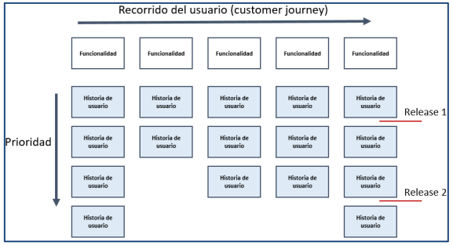

Todo el Equipo Scrum participa de la construcción del user story mapping y su elaboración es incremental, lo mismo que con el Backlog de Producto.

## Comunidades y certificaciones ágiles

* Scrum Alliance®
* Scrum.org
* Project Management Institute
* ICAgile
* SCRUMstudy
* CertiProf

## Herramientas para la gestión de proyectos ágiles

Existe un gran número de herramientas para el trabajo colaborativo en proyectos de gestión ágil

* Jira
* VersionOne
* TargetProcess
* PivotalTracker
* Taiga
* SwiftKaban
* Kanbanize
* Trello

Otras herramientas:

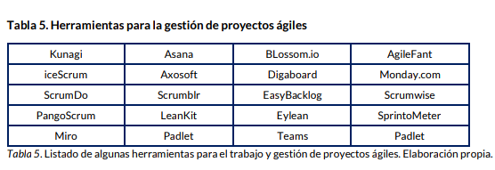