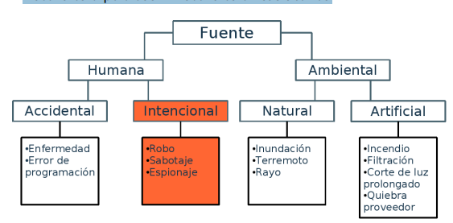
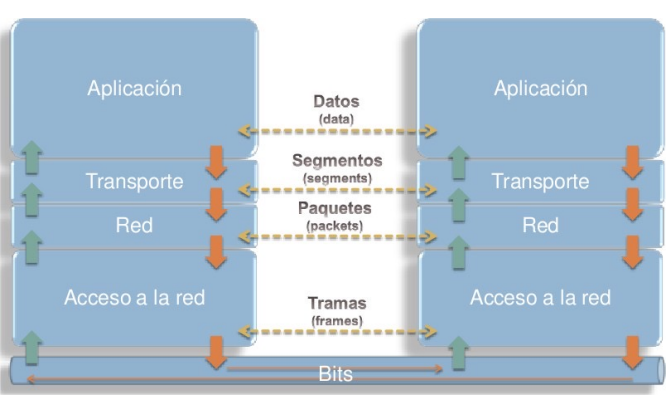
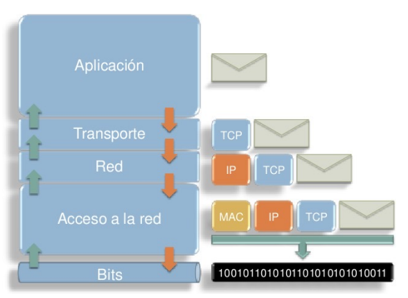
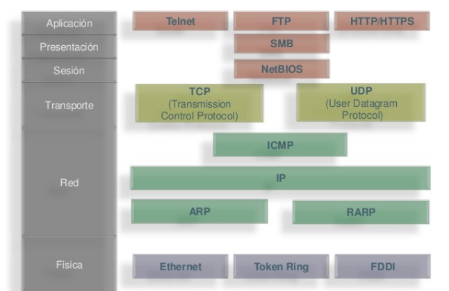
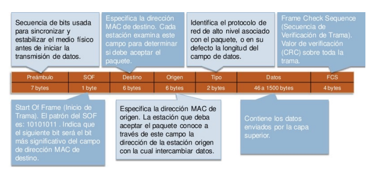

# Seguridad informatica

- [Seguridad informatica](#seguridad-informatica)
- [[10-03-22] Introducción](#10-03-22-introducción)
  - [Seguridad de la informacion (SI)](#seguridad-de-la-informacion-si)
  - [Terminologia](#terminologia)
  - [Dificultades de la seguridad de la informacion](#dificultades-de-la-seguridad-de-la-informacion)
  - [4 Virtudes de la SI](#4-virtudes-de-la-si)
    - [Consideración diaria](#consideración-diaria)
    - [Esfuerzo comunitario](#esfuerzo-comunitario)
    - [Foco generalizado](#foco-generalizado)
    - [Educación para todos](#educación-para-todos)
  - [8 Reglas de la Seguridad de la información](#8-reglas-de-la-seguridad-de-la-información)
  - [Regla del menor privilegio](#regla-del-menor-privilegio)
  - [Regla de los cambios](#regla-de-los-cambios)
  - [Regla de la confianza](#regla-de-la-confianza)
  - [Regla del eslabón más débil](#regla-del-eslabón-más-débil)
  - [Regla de la separación](#regla-de-la-separación)
  - [Regla del proceso de tres etapas](#regla-del-proceso-de-tres-etapas)
  - [Regla de la acción preventiva](#regla-de-la-acción-preventiva)
  - [Regla de la respuesta inmediata y adecuada](#regla-de-la-respuesta-inmediata-y-adecuada)
- [[17-03-22]](#17-03-22)
- [[31-03-22] Red](#31-03-22-red)

# [10-03-22] Introducción

## Seguridad de la informacion (SI)

La **protección** de la información y **sistemas** de
información de **acceso no autorizado**, **uso**, **difusión**, **disrupción**, **modificación** o **destrucción**, a fines de proporcionar **confidencialidad**, **disponibilidad** e **integridad** a dichos sistemas.

## Terminologia

**Confidencialidad**:Capacidad de **proporcionar acceso** a usuarios **autorizados**, y **negarlo** a **no autorizados**.

**Integridad**: Capacidad de garantizar que una información o mensaje **no** han sido **manipulados** o alterados y de que los servicios procesan **correctamente** la información.

**Disponibilidad**: Capacidad de **acceder** a información o utilizar un servicio **siempre** que lo **necesitemos**.

**Activos**: recurso del sistema de información o relacionado con este a defender, necesario para que la organización funcione correctamente y alcance los objetivos propuestos.

**Amenazas**: es un evento que puede desencadenar un incidente en la organización, produciendo daños
materiales o pérdidas inmateriales en sus activos.

Fuentes de las amenazas:

**Vulnerabilidad**: es una **debilidad** que influye **negativamente** en un activo y que posibilita la materialización de una **amenaza**.

**Exposición**: una exposición innecesaria de información que puede utilizarse para llevar a cabo un ataque.

**Exploit**: es una pieza de software, un grupo de datos o una **secuencia** de **comandos** que **aprovechan** una falla o **vulnerabilidad** para causar un **comportamiento no deseado** o imprevisto en sistemas de software o hardware.

**Ataque**: **evento**, exitoso o no, que **atenta** sobre el **buen funcionamiento** del sistema.

**Incidente** (ataque exitoso): **acceso**, uso, divulgación, **modificación** o destrucción **no autorizada** de información; **impedimento** en la **operación normal** de las redes, sistemas o recursos informáticos.

**Defensa**: conjunto de **productos**, **medidas** y **procesos** tendientes a **evitar** la concreción de un **incidente**.

**Riesgo**: es la **probabilidad** de que **suceda** la **amenaza** o evento no deseado.

**Impacto**: medir la **consecuencia** al materializarse una **amenaza**.

## Dificultades de la seguridad de la informacion

* NUNCA existe un sistema 100% seguro
* Para que un sistema sea ideal hay que encontrar el equilibrio entre usabilidad y seguridad. A mayor seguridad menor usabilidad y viceversa.
* Un sistema de informacion va a ser tan seguro como lo sea su eslabon (o subsistema) mas debil.
* La seguridad de la informacion no es siempre una cuestion tecnologica. A veces es una cuestion humana / social.

## 4 Virtudes de la SI

### Consideración diaria

Podemos evitar algun incidente de seguridad haciendo de esta una consideración diaria

### Esfuerzo comunitario

Las buenas prácticas de seguridad requieren un esfuerzo comunitario donde todos cumplan su parte para proteger sus propios sistemas. No solo los expertos en seguridad informatica sino tambien el equipo de desarrollo, los gerentes/directores, los clientes y tambien los terceros desarrolladores de subsistemas.

### Foco generalizado

En el mundo de la SI, hay miles de vulnerabilidades explotables por decenas de miles de ataques con virtualmente millones de permutaciones posibles. La seguridad es muy dinámica, y requiere métodos elevados de pensamiento.

### Educación para todos

Si la seguridad va a ser un trabajo diario, un esfuerzo comunitario, y considerado en todo, entonces **todos** deben estar **envueltos** en algún grado en las prácticas de seguridad. Por lo
tanto, todos los implicados deben tener algún nivel de **educación** en seguridad.

## 8 Reglas de la Seguridad de la información

## Regla del menor privilegio

Permita **sólo** el **acceso requerido** para hacer **el trabajo**, y **nada más**. Es la única forma en que podemos estar seguros de que sabemos quién tiene acceso a qué, y por qué.

## Regla de los cambios

Los **cambios** deben ser **administrados**, **coordinados** y deben **considerarse** las posibles **implicancias** de **seguridad**. Los cambios sólo deberían ocurrir después de que se ha
probado que sean seguros.

## Regla de la confianza

Aplicar el principio de mínimo privilegio: sólo **confiar** en aquello que es **necesario**. Aplicar distintos “**niveles** de **confianza**” según sea necesario.

## Regla del eslabón más débil

Una práctica de seguridad es sólo tan fuerte como su control más débil.

## Regla de la separación

Para asegurar algo, ésto debe estar separado de los peligros y amenazas del mundo que lo rodea.

## Regla del proceso de tres etapas

Toda medida de seguridad debe ser pensada como un proceso de tres etapas:
* **Implementación**: realizamos un análisis, diseñamos una solución, adquirimos las herramientas, lo construimos, lo probamos y ponemos en producción.
* **Monitoreo**: no existe la “seguridad completamente automatizada”.
* **Mantenimiento**: cualquier dispositivo de seguridad sin actualizaciones por un tiempo prolongado fallará en reconocer nuevos ataques

## Regla de la acción preventiva

La seguridad sólo puede ser exitosa si se enfrenta con un enfoque proactivo.

## Regla de la respuesta inmediata y adecuada

Se debe contar con un **plan organizado** de cómo responder a un ataque, analizar los riesgos pendientes y planificar los pasos futuros.

# [17-03-22]

**Interfaz de Comandos en Lınea**: Una **interfaz** de **comandos** en
lınea (CLI) es un mecanismo para **interactuar** con un **Sistema Operativo** de computadora o software escribiendo **comandos** para realizar tareas especıficas.

**Shell**(o Command-line Interpreter): **programa** encargado de **recibir**, **analizar** y **ejecutar** el **comando** solicitado. Luego de completar el comando, muestra al usuario la salida correspondiente en forma de texto.

Shells de **windows**:
* COMMAND.COM: utilizado en MS-DOS y hasta Windows 9.x
* cmd.exe: Windows NT en adelante
* PowerShell: int ́erprete de comandos y lenguaje de scripting basado en .NET. Fue liberado en 2006 y hecho open source y multiplataforma en 2016.

Shells de **linux**:
* sh: Bourne shell. Introducido en 1979 implementa las funciones minimas comunes a cualquier shell Unix.
* bash: Bourne-Again Shell. Implementaci ́on GNU mas completa que sh y la mas utilizada en distribuciones Linux.
* dash: subconjunto de bash utilizado por Debian.
* ksh: Korn shell
* csh: C shell
* zsh: Z shell

# [31-03-22] Red

Vemos de nuevo la suite TCP/IP.

A medida que un mensaje hacia otro equipo viaja de la capa superior hasta la inferior, se le agrega un encabezado con informacion perteneciente a dicha capa, que cada capa tendra que traducir para procesar la informacion que le llega y mandarla a la capa siguiente.

Estos son algunos de los protocolos mas usados en la suite TCP

La unidad de información logica mas pequeña que existe en los sistemas de telecomunicaciones es la **trama**

**Protocolo ARP**: Protocolo de nivel de red responsable de encontrar la dirección hardware (Ethernet **MAC**) que corresponde a una determinada dirección IP.

TCP (**Transmission Control Protocol**): provee una **entrega ordenada** y **confiable** de un flujo de **bytes** desde un programa en una computadora hacia otro programa en un equipo remoto (cliente-servidor).

UDP (**User Datagram Protocol**): permite a las aplicaciones enviar mensajes (datagramas) a otros equipos en una red IP **sin requerir** el establecimiento de **canales especiales** de **comunicación**.