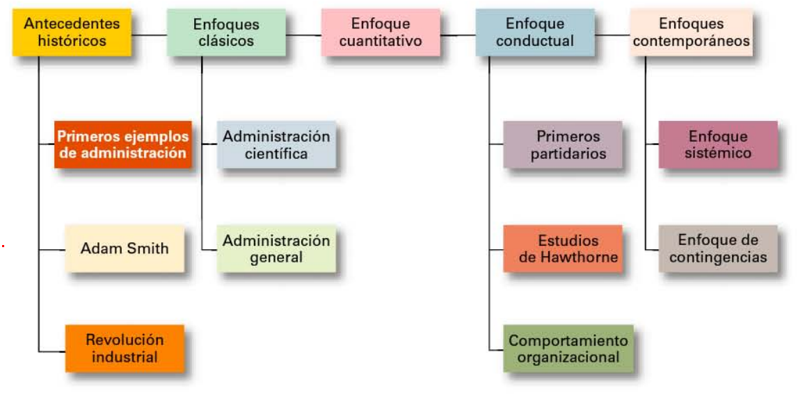
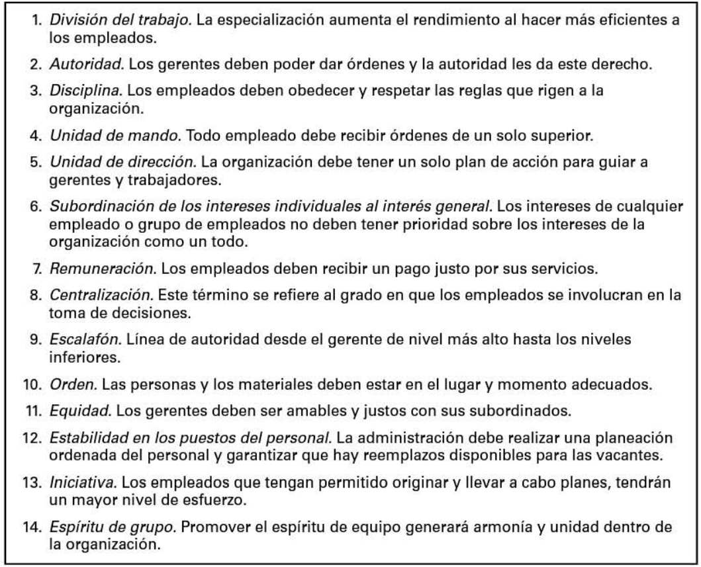
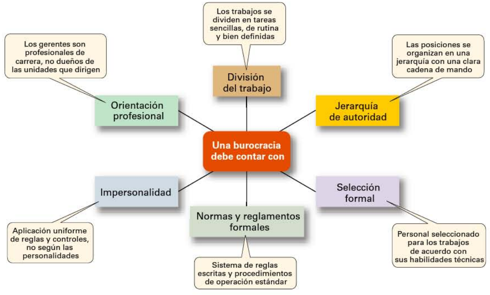
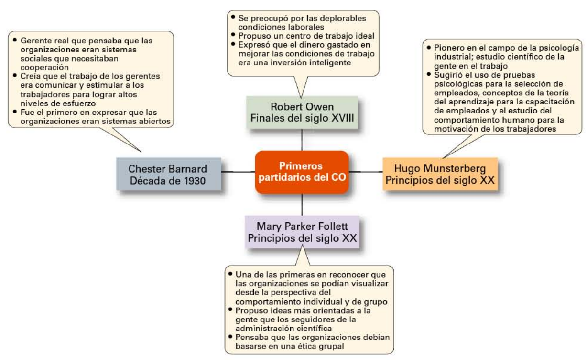
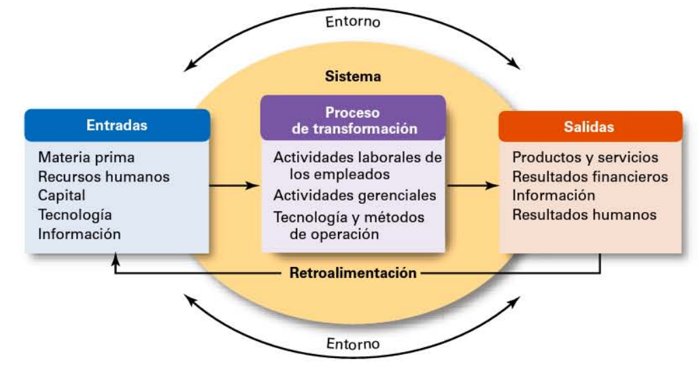
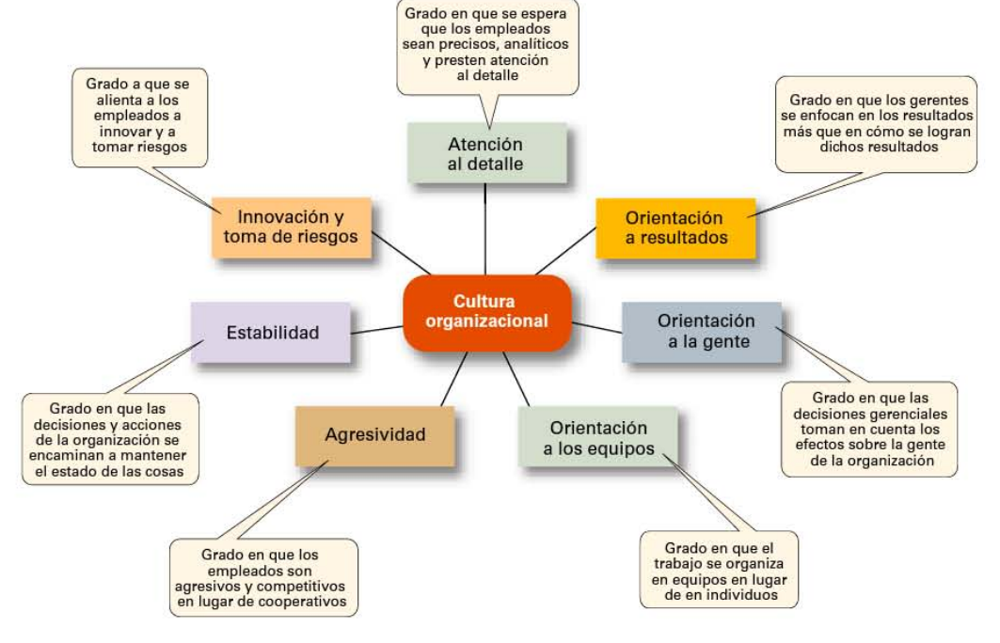
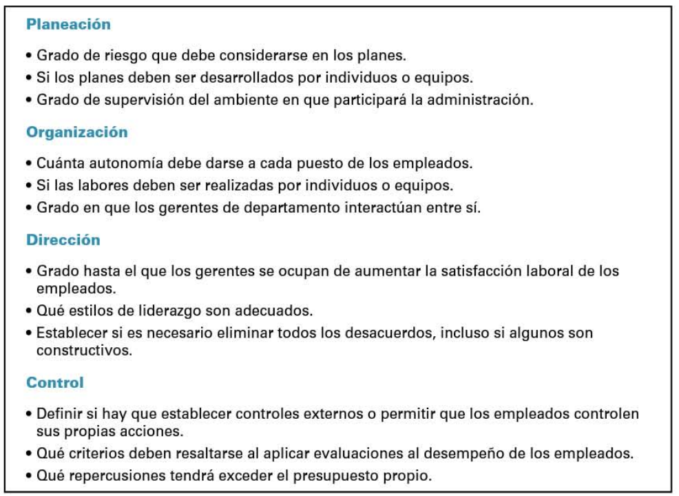
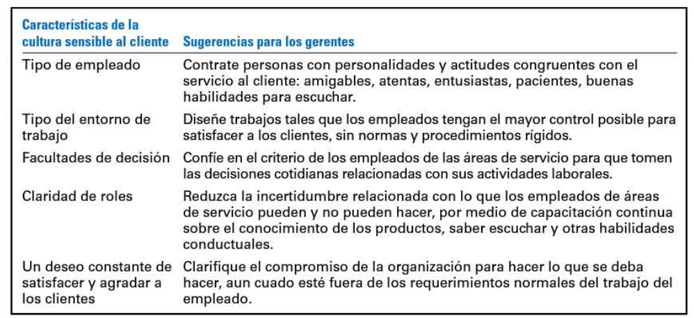
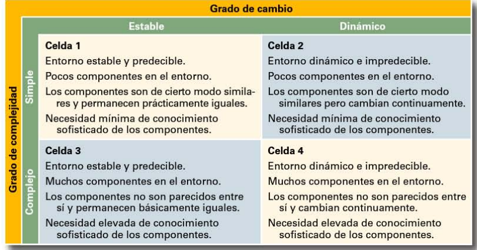
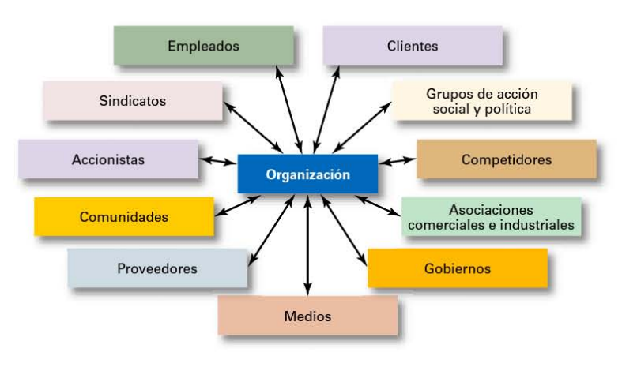

# Organización y Administración de empresas

- [Organización y Administración de empresas](#organización-y-administración-de-empresas)
- [Capitulo 1  - Administración y Organización](#capitulo-1----administración-y-organización)
  - [Organización](#organización)
  - [Gerentes](#gerentes)
  - [Administración](#administración)
    - [Funciones gerenciales](#funciones-gerenciales)
    - [Roles gerenciales](#roles-gerenciales)
    - [Habilidades de los gerentes](#habilidades-de-los-gerentes)
- [Capitulo 2 - Historia de la administración](#capitulo-2---historia-de-la-administración)
  - [Enfoque clasico](#enfoque-clasico)
    - [Administración cientifica](#administración-cientifica)
    - [Teoria general de la administración](#teoria-general-de-la-administración)
  - [Enfoque cuantitativo](#enfoque-cuantitativo)
  - [Enfoque conductal](#enfoque-conductal)
  - [Enfoque contemporaneo](#enfoque-contemporaneo)
    - [teoria de sistemas](#teoria-de-sistemas)
    - [Enfoque de contingencias](#enfoque-de-contingencias)
- [Capitulo 3 - Cultura organizacional](#capitulo-3---cultura-organizacional)
  - [Cultura Organizacional y entorno](#cultura-organizacional-y-entorno)
  - [De donde proviene la cultura y como termina?](#de-donde-proviene-la-cultura-y-como-termina)
  - [Como aprenden los empleados la cultura](#como-aprenden-los-empleados-la-cultura)
  - [Como afecta la cultura a los gerentes](#como-afecta-la-cultura-a-los-gerentes)
  - [cinco temas culturales de actualidad](#cinco-temas-culturales-de-actualidad)
    - [Cultura etica](#cultura-etica)
    - [Cultura de innovación](#cultura-de-innovación)
    - [Cultura sensible al cliente](#cultura-sensible-al-cliente)
    - [Cultura que apoya la diversidad](#cultura-que-apoya-la-diversidad)
    - [Espiritualidad y cultura organizacional](#espiritualidad-y-cultura-organizacional)
  - [Entorno](#entorno)
    - [Ambiente externo](#ambiente-externo)
    - [Como afecta el entorno a los gerentes](#como-afecta-el-entorno-a-los-gerentes)
- [Capitulo 4 - La administración en un entorno global](#capitulo-4---la-administración-en-un-entorno-global)
  - [Comercio global](#comercio-global)
  - [Tipos de organizaciones internacionales](#tipos-de-organizaciones-internacionales)
  - [Como se internacionalizan las empresas?](#como-se-internacionalizan-las-empresas)
  - [Administración en un entorno global](#administración-en-un-entorno-global)

# Capitulo 1  - Administración y Organización

## Organización

**Organización**: **Sistema social** con un **próposito definido** que interactúa en el **medio** que lo circunda

* Conjunto **interrelacionado** de recursos
* Conjunto **interdependiente** de recursos
* Tipos de recursos:
  * humanos, materiales, tecnológicos y de información
* Interactúan en un accionar **sinérgico**
* Orientados hacia **objetivos determinados**
* Con permanente intercambio con el **medio ambiente**:
  * macroambiente y ambiente intermedio


Una organización tiene un **propósito definido**. Este propósito generalmente se expresa a través de objetivos que la organización espera cumplir. Segundo, cada organización está **formada** por **personas**. Cuenta con ellas para realizar el trabajo necesario para que la organización logre sus metas. Tercero, todas las organizaciones crean una **estructura deliberada** dentro de la cual los miembros realizan su trabajo. Esa estructura puede
ser abierta y flexible, sin debe res laborales específicos o un estricto apego a acuerdos de trabjo explícitos.

El **proposito** de la organización es: La **producción** y la **distribución** de los **medios** necesarios para cumplir los **reclamos** y **demandas** de las sociedad.


- **Microambiente**: Ambiente dentro de la misma org (?)
- **Ambiente intermedio**: La org puede interactuar e infuir dichos elementos del ambiente
- **Macroambiente**: Fuerzas del entorno en donde la org no puede ejercer influencia, solo es influenciada por las mismas.

Las organizaciones se pueden clasificar según su:
1. **integración del capital** (Privadas, estatales, mixtas)
2. **fin** (Con/sin fines de lucro)
3. **forma jurídica** (Unipersonal Colegiada)
4. **origen de capital** (Nacional, extranjera, mixta)
5. **tamaño** (Grandes, medianas, pequeñas)
6. **alcance geográfico** (Locales, nacionales, multinacionales, globales)
7. **duración** (Permanentes, temporales)
8. **tipo de actividad** (Industriales, comerciales y de servicio)

## Gerentes

**Gerentes**: Un gerente es alguien que **coordina** y **supervisa** el trabajo de **otras personas** para que se logren los **objetivos** de la organización. El trabajo de un gerente no tiene que ver con logros personales, sino con **ayudar** a **otros** a realizar su trabajo.

¿Existe alguna forma de **clasificar** a los gerentes de una empresa?

Suele suceder que se clasifique a los gerentes como de **primera línea**, gerentes de nivel **medio** y gerentes de **nivel alto**.

Los gerentes de **primera linea** dirigen el Trabajo del **personal** que por
lo general está involucrado con la **producción** de la organización o con el **servicio** a los **clientes** de la empresa. 

Los gerentes de nivel **medio** son aquellos que se encuentran entre el nivel más bajo y el más alto d e la organización. Estos gerentes **dirigen** el **trabajo** de los gerentes de **primera línea**. 

En los niveles superiores de la organización se encuentran los gerentes de **nivel alto**, quienes son responsables de **tomar** las **decisiones** de la **empresa** y de establecer los **planes** y **objetivos** que afectan a toda la organización.


## Administración

**Administración**: **Proceso** de **adoptar decisiones** e **impartir órdenes** en representación de los grupos de miembros de la organización. Apunta a **definir** el **trabajo** y el **comportamiento** de la organización necesarios para **cumplir** sus **objetivos**.

Los gerentes son los encargados de llevar la administración de una empresa de tal forma que se garantice que la gente responsable de llevar a cabo las actividades lo haga de forma **eficiente** y **eficaz**


### Funciones gerenciales

Los gerentes al momento de administrar una organización de manera eficiente y eficaz deben de realizar cuatro actividades o **funciones gerenciales** principales definidas por Henry Fayol: **Planeación**, **Organización**, **Dirección**, **Control**.


### Roles gerenciales

Los gerentes tambien se pueden observar según los la visión de **roles gerenciales** de Mintzberg. Estos roles se refieren a las **acciones** que un gerente realiza en el dia a dia (nosotros cumplimos los roles de hijos / alumnos / amigos / trabajadores / parejas / etc.). Estos roles se agrupan en **interpersonales**, de **transferencia de info** y de **toma de decisiones**.

Los **roles interpersonales** son aquellos que involucran **personas** (subordinados y perso nas ajenas a la organización ) y otros deberes que son de naturaleza **ceremonial** y **simbólica**. Los tres roles interpersonales son **representante**, **líder** y **enlace**.

Los roles **informativos** involucran **reunir**, **recibir** y **transmitir** **información**. Los tres roles informativos son **monitor**, **difusor** y **portavoz**. 

Por último, los roles **decisorios** conllevan la **toma** de **decisiones** o elecciones. Los cuatro roles decisorios son **emprendedor**, **manejador** de **problemas**, **asignador** de **recursos** y **negociador**.

### Habilidades de los gerentes

los gerentes necesitan tres habilidades básicas: **técnicas**, **humanas** y **conceptuales**. 

Las habilidades **técnicas** son el **conocimiento** específico del **trabajo** y las **técnicas** necesarias para realizar **competentemente** las **tareas laborales**. Estas habilidades suelen ser más importantes en el caso de los gerentes de **primera línea**, ya que por lo general manejan empleados que utilizan herramientas y técnicas para manufacturar los productos de la empresa o para dar servicio a los clientes. 


Las habilidades **humanas** involucran la capacidad de **trabajar bien** con **otras personas**, tanto de manera **individual** como en **grupo**. Debido a que todos los gerentes tienen que ver con personas, estas habilidades son **igualmente importanes** en **todos** los **niveles** de la **administración**. Los gerentes con buenas habilidades humanas obtienen lo mejor de su gente. Ellos saben cómo comunicarse, motivar dirigir e inspirar emusiasmo y confianza.

Por último, las habilidades **conceptuales** son las habilidades que los gerentes utilizan para **pensar** y **conceptualizar** situaciones abstractas y complejas. A través de estas habilidades, los gerentes ven la organización como un todo, comprenden la relación entre diversas subunidades y visualizan cómo encaja la organización en su entorno general. Estas habilidades son las más importames para gerenles de **alto nivel**.

# Capitulo 2 - Historia de la administración

En la antiguedad ya se practicaba la administración, por ejemplo al construir la muralla China, las piramides de Egipto, o la ciudad de Venecia. Si bien todos estos antecedentes historicos son importantes para la historia de la administración, hay 2 hechos fundamentales que son considerados parteaguas en dicha historia.

El primero fue la **publicación** de **Adam Smith** llamado "La riqueza de las naciones" donde se planteo las ventajas economicas que las organizaciones y la sociedad obtendrian a partir de la division del trabajo o la especialización laboral

El segundo hecho imponante es la **revolución industrial**. Estas grandes y eficientes fábricas necesitaban a alguien que previera la demanda, que garantizara que los materiales necesarios para la fabricación de productos estuvieran disponibles, que se asignaran tareas a la gente, que dirigiera actividades diarias, etcétera. Ese "alguien " era un **gerente**, y ese gerente necesitaria teorias formales para poder dirigir estas grandes organizaciones. 

A continuación se analizaran los cuatro enfoques principales de la teoría de la administración: clásico, cuantitativo, conductual y contemporáneo



## Enfoque clasico

Las dos teorias principales de este enfoque son: administración cientifica y administración general.

### Administración cientifica

Esta teoria describe el uso de **métodos científicos** para definir "la **mejor forma**" de realizar un **trabajo**. Cuando los gerentes analizan las tareas básicas que deben realizarse, utilizan un estudio de tiempos y movimientos para eliminar movimientos inútiles, contratan a los empleados más calificados para un trabajo, o diseñan sistemas de incentivos basados en resultados, están empleando los principios de la administración científica.

### Teoria general de la administración

Un grupo de escritores analizaron el tema de la administración desde la perspectiva de la **organización** como un **todo**. Este enfoque, conocido como **teoría general de la administración**, se centra más en lo que **hacen** los **gerentes** y en lo que constituye una **buena práctica** de **administración**. Los dos individuos más prominentes detrás de la teoría general de la administración fueron **Henri Fayol** y **Max Weber**. 

Henri Fayol desarrollo los **14 principios** de la administración:



Max Weber desarrolló una teoría de **estructuras** de **autoridad** y **relaciones** basadas en un tipo ideal de **organización** a la cual llamó **burocracia**; una forma de organización caracterizada por la división del trabajo, una jerarquía claramente definida, normas y reglamentos detallados y relaciones impersonales.



## Enfoque cuantitativo

Este enfoque (que también se conoce como ciencia de la administración) hace uso de técnicas cuantitativas para mejorar la toma de decisiones. Por ejemplo:

```
Aunque los tropiezos de los pasajeros que intentan encontrar sus asientos en un avión pueden ser un motivo de enfado para ellos, éste resulta un problema mayor para las aerolíneas ya que los pasillos se congestionan, y esto hace que el avión tarde más en volver al aire. Basándose en investigaciones sobre geometría del espacio-tiempo, American West Airlines innovó con un proceso único de abordaje llamado "pirámide invertida" que ha ahorrado al menos dos minutos en tiempo de abordaje.
```

Éste consiste en la aplicación de la **estadística**, de modelos de **optimización** y de **información**, de **simulación** por computadoras y de otras **técnicas** cuantitativas a actividades de **administración**. Por ejemplo, la programación lineal

## Enfoque conductal

Como sabemos, los gerenles logran que las cosas se hagan, trabajando con personas. Esto explica por qué algunos autores han elegido analizar la administración enfocándose en la gente de una organización. Al campo de estudio que investiga las **acciones** (comportamiento) de la gente en el trabajo se le conoce como **comportamiento organizacional** (CO). Mucho de lo que hacen los gerentes hoy en día cuando manejan personas (motivar, ordenar, dar confianza, trabajar con u n equipo, manej o de conflictos, etcétera), ha surgido de la investigación del CO.



Algunos de los **primeros partidarios** de la CO fueron los mostrados en la anterior imagen y concluyeron en las ideas plasmadas en sus respectivos cuadros de texto.

Sin embargo, la contribución más importante al campo del CO provino de los estudios de **Hawthorne**, una serie de estudios llevados a cabo en Western Electric Company Works, en Cicero, illinois. Estos estudios **estimularon** el **interés** de las organizaciones en el **comportamiento humano**.

## Enfoque contemporaneo

Los investigadores en administración comenzaron a analizar lo que ocurría en el entorno que estaba **fuera** de los límites de la organización y no en el interior de la misma. Dos perspectivas contemporáneas de administración forman parte de este enfoque: la de **sistemas** y la de **contingencias**

### teoria de sistemas

Un sistema es un **conjunto** de partes **interrelacionadas** e **interdependientes** dispuestas de tal forma que se produce un **todo unificado**. Los dos tipos básicos de sistemas son cerrados y **abiertos**.

una organización toma elementos (**recursos**) de su entorno y los transforma o procesa como productos que se **distribuyen** nuevamente en el entorno. La organización está "**abierta**" al entorno e interactúa con él.



### Enfoque de contingencias

El enfoque de contingencias (algunas veces llamado enfoque de situaciones o situacional) plantea que las organizaciones no son iguales, enfrentan situaciones distintas (contingencias) y requieren diferentes formas de dirección. 

La administración no se basa (y no puede hacerlo) en principios simplistas que puedan aplicarse en todas las situaciones. Situaciones cambiantes y diferentes requieren que los gerentes utilicen enfoques y técnicas distintas.

# Capitulo 3 - Cultura organizacional

¿Qué diferencia hace un gerente en el desempeño de una organización?

La visión dominante en la teoría de la administración y de la sociedad en general es que los gerentes son responsables directos del éxito o fracaso de una organización. A esta perspectiva la llamaremos **visión omnipotente** de la administración. 

Po rotra parte, otros han dicho que parte del éxito o del fracaso de una organización se debe a factores externos que están fuera del control de los gerentes. A esta perspectiva se le llama **visión simbólica** de la administración.

En realidad, los gerentes no son todopoderosos, pero tampoco están indefensos; sin embargo, sus **opciones** para **actuar** y **decidir** están **restringidas**. Las restricciones internas provienen de la **cultura** de la **organización** y las **externas** del **entorno** de la organización

## Cultura Organizacional y entorno

La **cultura organizacional** se ha descrito como los **valores**, **principios**, **tradiciones** y formas de hacer las cosas que **influyen** en la forma en que **actúan** los **miembros** de la **organización**. En la mayoría de las organizaciones, estos valores y prácticas compartidos han evolucionado con el tiempo y determinan en gran medida cómo se hacen las cosas en la organización.

Nuestra definición de cultura implica tres cosas. 
* Es una **percepción**. No es algo que pueda tocarse o verse físicamente, pero los empleados la perciben según lo que experimentan dentro de la organización. 
* Es **descriptiva**. Tiene que ver con cómo perciben los miembros la cultura, no con si les gusta. 
* Es **compartido**. Aunque los individuos pueden tener distintas experiencias, o trabajar en niveles diferentes de la organización, tienden a describir la cultura de la organización en términos similares.

Dimensiones de la cultura organizacional:



Todas las organizaciones tienen culturas, pero no todas las culturas influyen en el comportamiento y acciones de los empleados. Las **culturas fuertes**, son aquellas en las que los valores fundamentales están profundamente arraigados y son muy compartidos, tienen mayor influencia sobre los empleados que las culturas débiles.

en las organizaciones con culturas fuenes los empleados son más leales que los de organizaciones con culturas débiles. 

## De donde proviene la cultura y como termina?

En general, la fuente original de la cultura refleja la visión de los fundadores. Ellos y pueden establecer la primera cultura formando una imagen de lo que quieren que sea la organización.

Cuando la cultura está establecida, ciertas prácticas organizacionales ayudan a mantenerla. Por ejemplo, durante el proceso de **selección de empleados**, los gerentes normalmente **juzgan** a los candidatos no sólo por los requerimientos del empleo, sino también por qué tan bien se adaptarán a la organización.

Las **acciones** de los **gerentes** de **nivel alto** también tienen un efecto importante sobre la cultura de la organización. A través de lo que **dicen** y de **cómo se comportan**, los gerenles de nivel alto establecen normas que se filtran hacia los n de abajo de la organización y pueden tener un efecto positivo sobre el comportamienlo de los empleados.

Por último, las organizaciones ayudan a los empleados a adaptarse a la cultura a través de la **socialización**, un proceso que ayuda a los nuevos empleados a aprender la forma en que la empresa hace las cosas.

## Como aprenden los empleados la cultura

Los empleados "aprenden la cultura de una organización de diversas maneras. Las más comunes son a través de **historias**, **rituales**, **símbolos materiales** y **lenguaje**.

## Como afecta la cultura a los gerentes

la cultura establece e l comportamiento adecuado y esperado de los gerentes. La cultura organizacional influye la forma de trabajar de los empleados
y la manera en que los gerentes planean, o rganizan, dirigen y controlan. 




## cinco temas culturales de actualidad

### Cultura etica 

Una cultura organizacional que tiene más posibilidades de establecer estándares é ticos elevados es aquella que es más tolerante ante los riesgos, poco tolerante ante la agresividad y se enfoca tanto en medios como en resultados. Los gerentes de tales culturas son alentados a tomar riesgos e innovar, no se les apoya cuando se trata de competir desenfrenadamente, y se presta atención a cómo se logran los o bjetivos así como a qué metas se alcanzaron.

### Cultura de innovación

Estas culturas se clasifican por lo siguiente:

* **Desafíos y participación**. ¿Los empleados están involucrados, motivados y comprometidos con los objetivos de largo plazo y el éxito de la organización?
* **libertad**. ¿Los empleados pueden, de manera independiente, definir su trabajo, aplicar sus criterios y tomar la iniciativa en sus actividades cotidianas?
* **Confianza y sinceridad**. ¿Los empleados se apoyan y respetan entre sí?
* **Tiempo de ideas**. ¿Los individuos tienen tiempo de pensar en nuevas ideas antes de actuar?
* **Alegria/sentido del humor**. ¿En el centro de trabajo se percibe esponta neidad y alegría?
* **Solución de conflictos**. ¿Los individuos toman decisiones y resuelven asuntos basándose en el bien de la organización o en los intereses personales?
* **Debates**. ¿Se permite a los empleados expresar opiniones e ideas para que se consideren y revisen?
* **Toma de riesgos**. ¿Los gerentes toleran la incertidumbre y la ambiguedad, y los empleados son reconocidos por tomar riesgos?

### Cultura sensible al cliente



### Cultura que apoya la diversidad

Las organizaciones actuales se caracterizan por la diversidad de la fuerza de trabajo, una fuerza que es heterogénea en términos de género, raza, etnia, edad y otras caracteristicas que reflejan diferencias.

### Espiritualidad y cultura organizacional

¿Qué es la **espiritualidad** en el centro de trabajo? Es una característica de las culturas en las cuales los valores organizacionales promueven un **sentido** del **propósito** a través del **trabajo significativo** realizado en el contexto de la comunidad. Las organizaciones con una cultura espiritual aceptan que la gente tiene una mente y un espíritu, buscan el **sentido** y el **propósilo** en su **trabajo** y desean relacionarse con otros seres humanos y ser parte de una comunidad.

En algunas personas la religión formal no ha funcionado y continúan buscando otros recursos para sustituir la falta de fe y para eliminar la sensación
de vacío cada vez mayor. En estos casos, las organizaciones espirituales generalmente tienen cinco características culturales.

* Fuerte sentido del proposito
* Enfoque en el desarrollo individual
* Confianza y sinceridad
* Otorgamiento de facultades de decisión a los empleados.
* Tolerancia frente a la expresión de los empleados.

Los críticos del movimiento de la espiritualidad se han enfocado en dos puntos: 
* la cuestión de la legitimidad (¿las organizaciones tienen el derecho de imponer valores espirituales a sus empleados?) 
* y la cuestión económica (¿la espiritualidad y las utilidades son compatibles?). 

## Entorno

Las organizaciones interactuan con su entrorno debido a que son sistemas abiertos. Toma recursos de dicho entorno, los transforma y los distribuye a dicho entorno. Las fuerzas ambientales representan un papel importante al moldear las acciones de los gerentes.

### Ambiente externo

El término **ambiente externo** se refiere a los factores y fuerLas de fuera de la organización que afectan su desempeño. Este incluye 2 componentes:
* **Entorno especifico**: fuerzas externas que afectan directamenle las decisiones y acciones de los gerenles y tienen importancia directa para el logro de los objetivos de la organización (clientes, proveedores, competidores, grupos de presion)
* **Entorno general**: factores externos que no afectan a las organizaciones hasta el grado en que lo hacen los cambios en su entorno específico, pero que los gerentes deben considerarlos cuando planean, organizan, dirigen y controlan.
  * condiciones **económicas**
  * condiciones **político**-**legales**
  * condiciones **socioculturales**
  * condiciones **demográficas**
  * condiciones **tecnológicas**
  * condiciones **globales**

### Como afecta el entorno a los gerentes

Los entornos difieren en términos de lo que llamamos **incertidumbre ambiental**, la cual es el grado de **cambio** y **complejidad** del entorno de la organización.



Debido a que la incertidumbre es una amenaza para la efectividad de una compañía, los gerentes tratan de minimizarla. Si existe la opción, los gerentes pre ferirían operar en entornos de menor incertidumbre.

La **naturaleza** de las **relaciones** entre las p**artes interesadas** es otra forma en la que el emorno influye a los gerentes. Cuanto más abiertas y seguras sean estas relaciones, más influencia tendrán los gerentes sobre los resultados organizacionales. 

Las partes interesadas son todos los elementos del entorno de una organización que se ven afectados por sus decisiones y acciones. Estos grupos tienen interés en la organización o se ven significativameme influenciados por ella. A su vez, pueden influir en la organización



¿Por qué a los gerentes debe interesarles la administración de las relaciones con las partes interesadas? Por una razón: hacerlo puede conducir a resultados deseables para la organización, como mejorar las predicciones en los cambios ambientales, innovaciones más exitosas, mayor grado de confianza entre las partes interesadas y mayor flexibilidad organizacional para reducir el efecto del cambio.

# Capitulo 4 - La administración en un entorno global

Todas las organizaciones se han visto afectadas de alguna manera por la **globalización**. si los gerentes no vigilan de cerca los **cambios** en su ambiente **global** o no toman en cuenta las características **especiales** de cada **localidad** al planear organizar, dirigir y controlar, podrían tener un éxito global **limitado**.

**provincialismo**: una visión del mundo que sólo considera perspectivas y convicciones **propias** La gente que tiene una actitud provincial no reconoce que otros tienen maneras diferentes de vivir y de trabajar; ignoran los valores y costumbres de los demás, y tienen una actitud rígida de "Lo nuestro es mejor que lo de ellos" frente a las culturas extranjeras. Este tipo de actitud estrecha y estricta es una de las **tres** posturas posibles que puede tomar un gerente frente a la globalización, pero no es la única.

* **postura etnocéntnca**: creencia provincial de que las mejores prácticas y métodos de trabajo son los del país de **origen**. No confian en los empleados extranjeros para decisiones clave o cuestiones de tecnología.
* **postura policéntrica**: visión de que la gente del país **huésped** conoce los mejores métodos y prácticas de trabajo para operar sus negocios. Los gerentes dejan que los empleados del país huésped se las arreglen para hacer las cosas a su manera.
* **postura geocéntrica**, un punto de vista orienlado al mundo, que se enfoca en emplear los
mejores métodos y gente de todo el mundo. Los gerentes con este tipo de postu ra tienen una visión glo bal y buscan los mejores métodos y gente, sin importar su origen.

## Comercio global

El comercio global actual está formado por dos fuerzas: las **alianzas comerciales regionales** y los **tratados comerciales** negociados a través de la **Organización Mundial de Comercio**

**Alianzas comerciles regionales** (acuerdos regionales que buscan, entre otras cosas, liberalizar el comercio entre regiones, el ingreso a nuevos mercados, y el dinamismo de las economías):
* Unión Europea (UE)
* el Tratado de Libre Comercio de América del Norte (TLCAN)
* La Asociación de Naciones del Sureste Asiático (ASEAN)
* etc.

**Organización mundial del comercio**: Existen sistemas de comercio global para garantizar que el comercio continúe de manera **eficiente** y **eficaz** cuando surgen **problemas comerciales**.la **OMC** es la única organización global que lidia con **reglas** de **comercio** entre las naciones. Agrupa como miembros a 153 países. El objetivo de la OMC es ayudar a los países a llevar a cabo el comercio a través de un sistema de reglas comerciales.

una de las realidades de la globalización es la **interdependencia** entre los países, esto es, lo que sucede en uno puede afectar a otros, para bien o para mal. 

## Tipos de organizaciones internacionales

Una **empresa multinacional** (MNC) es cualquier tipo de empresa internacional que tiene operaciones en distintos países.

* Un tipo de MNC es una empresa **multidoméstica**, la cual descentraliza la administración y otras decisiones en el país local. (postura **policentrica**)
* Otro tipo d e MNC es una empresa **global**, la cual **centraliza** su administración y otras decisiones en su **país de origen**. Este método de globalización refleja la postura **etnocéntrica**. las decisiones administrativas con implicaciones para toda la empresa se toman desde las oficinas centrales en el país de origen.
* Otras empresas utilizan estructuras que **eliminan barreras geográficas** artificiales. Con frecuencia, a este tipo de MNC se le llama **empresa transnacional** o **sin fronteras**, y refleja una **postura geocéntrica**.

## Como se internacionalizan las empresas?

Los gerentes podrían querer ingresar al mercado global con una inversión mínima. En este punto, querrían comenzar con un **sourcing global**, esto significa la compra de materiales o trabajo
alrededor del mundo basado en un **menor costo**.

El siguiente paso en la internacionalización podría tener que ver con la **exportación** o **importación** de los productos de la empresa.

Por último, los gerentes podrían utilizar licencias o **franquicias**, las cuales son métodos similares que involucran a una empresa que otorga a otra empresa el derecho de utilizar su nombre de marca, tecnología o especificaciones de producto, como respuesta a un pago o una cuota (por lo general basada en ventas).

Cuando una empresa ha realizado negocios internacionales durante un tiempo y ya ha ganado experiencia en los mercados internacionales, es posible que los gerentes decidan invertir de manera más directa. Una manera d e hacerlo es a través de una **alianza estratégica**, la cual es una asociación entre una empresa o empresas extranjeras asociadas, en la que ambas **comparten recursos** y **conocimientos** sobre el desarrollo de **nuevos productos** o la construcción d e lugares para la manufactura.

A un tipo específico de alianza estratégica, en la cual los socios forman una empresa separada e independiente para un propósito de negocio específico, se le llama **joint venture**

Por último, los gerentes pueden elegir la inversión **directa** en un país extranjero mediante la instalación de una **subsidiaria extranjera** a manera de **oficina separada** e **independiente**. Es posible manejar esta subsid iaria como una empresa **multidoméstica**  o como una **empresa global**.

## Administración en un entorno global

Cualquier gerente que se encuentre en un **nuevo país** enfrenta **desafíos**. Algunos de estos son:
* Entorno **politico-legal**: 
  * Sobre todo en los paises con altos **niveles de riesgo** (Argentina, Tailan dia, Colombia, etc.) generan una gran **incertidumbre** para los administradores. 
  * Tambien en algunos paises la **intervención politica** en las empresas por parte de los gobiernos (Ej: china) es un tema de gran preocupación. 
  * El entorno p olítico-Iegal de un país no tiene que ser riesgoso o inestable para que sea motivo de preocupación para los administradores. El simple hecho de que **difiera** del país de **origen** es importante. Los gerentes deben reconocer estas diferencias si tienen la esperanza de comprender las restricciones y las oportunidades existentes.
* Entorno **economico**:
  * Es importante comprender el tipo de **sistema económico** de un país ya que tiene el potencial de restringir las decisiones
    * Economia de **libre mercado**: los recursos pertenecen y son controlados primordialmente por el sector privado
    * Economia **planeada**: Las decisiones económicas se planean mediante un **gobierno central**
  *  **tipos de  cambio**: Las utilidades de una MNC pueden variar drásticameme de acuerdo con la fuerza de su moneda local y las monedas de los países con los que opera.
  *  **tasas de inflación**: Los gerentes tienen que dar seguimiento a las tendencias de la inflación para que puedan prever posibles cambios en las políticas monetarias de un país y tomar buenas decisiones.
  *  **diversas políticas** de **impuestos**:  Los gerentes necesitan información exacta sobre las reglas fiscales de los países en que operan para minimizar las obligaciones fiscales generales de un negocio. 
* Entorno **cultural**:  las organizaciones tienen diferentes culturas. La **cultura nacional** es el conjunto de **valores** y **actitudes** que comparten los **individuos** de un **país** específico, el cual define su **comportamiento** y creencias sobre lo que es importante. Para los gerentes es de suma importancia evaluar esta cultura debido a que la cultura nacional tiene mucho mas peso sobre los empleados de un pais que la cultura organizacional de la empresa en la que trabajan. Para evaluar estas culturas al momento de ser gerente en un pais externo, hay distintos esquemas como el de Hofstede, GLOBE, entre otros.