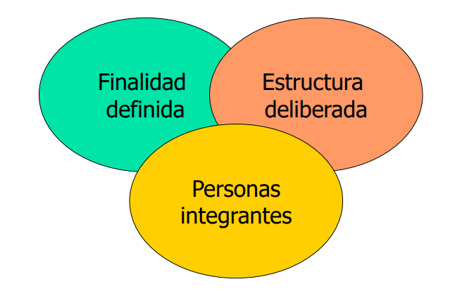
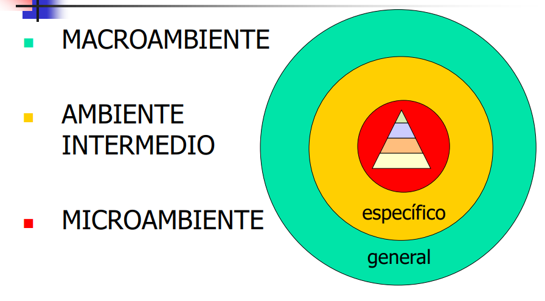
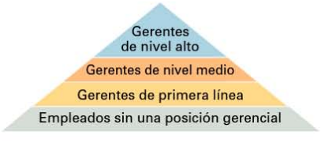
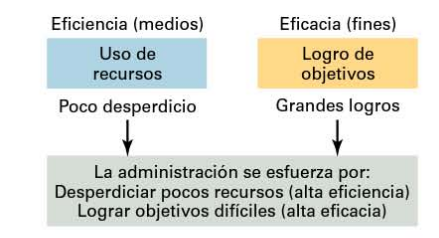
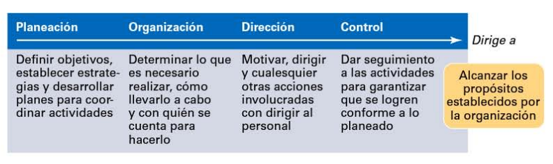

# Organización y Administración de empresas

- [Organización y Administración de empresas](#organización-y-administración-de-empresas)
- [Unidad 1 - Administración y Organización](#unidad-1---administración-y-organización)
  - [Organización](#organización)
  - [Gerentes](#gerentes)
  - [Administración](#administración)
    - [Funciones gerenciales](#funciones-gerenciales)
    - [Roles gerenciales](#roles-gerenciales)
    - [Habilidades de los gerentes](#habilidades-de-los-gerentes)

# Unidad 1 - Administración y Organización

## Organización

**Organización**: **Sistema social** con un **próposito definido** que interactúa en el **medio** que lo circunda

* Conjunto **interrelacionado** de recursos
* Conjunto **interdependiente** de recursos
* Tipos de recursos:
  * humanos, materiales, tecnológicos y de información
* Interactúan en un accionar **sinérgico**
* Orientados hacia **objetivos determinados**
* Con permanente intercambio con el **medio ambiente**:
  * macroambiente y ambiente intermedio

Una organización tiene un **propósito definido**. Este propósito generalmente se expresa a través de objetivos que la organización espera cumplir. Segundo, cada organización está **formada** por **personas**. Cuenta con ellas para realizar el trabajo necesario para que la organización logre sus metas. Tercero, todas las organizaciones crean una **estructura deliberada** dentro de la cual los miembros realizan su trabajo. Esa estructura puede
ser abierta y flexible, sin debe res laborales específicos o un estricto apego a acuerdos de trabjo explícitos.

El **proposito** de la organización es: La **producción** y la **distribución** de los **medios** necesarios para cumplir los **reclamos** y **demandas** de las sociedad.

- **Microambiente**: Ambiente dentro de la misma org (?)
- **Ambiente intermedio**: La org puede interactuar e infuir dichos elementos del ambiente
- **Macroambiente**: Fuerzas del entorno en donde la org no puede ejercer influencia, solo es influenciada por las mismas.

Las organizaciones se pueden clasificar según su:
1. **integración del capital** (Privadas, estatales, mixtas)
2. **fin** (Con/sin fines de lucro)
3. **forma jurídica** (Unipersonal Colegiada)
4. **origen de capital** (Nacional, extranjera, mixta)
5. **tamaño** (Grandes, medianas, pequeñas)
6. **alcance geográfico** (Locales, nacionales, multinacionales, globales)
7. **duración** (Permanentes, temporales)
8. **tipo de actividad** (Industriales, comerciales y de servicio)

## Gerentes

**Gerentes**: Un gerente es alguien que **coordina** y **supervisa** el trabajo de **otras personas** para que se logren los **objetivos** de la organización. El trabajo de un gerente no tiene que ver con logros personales, sino con **ayudar** a **otros** a realizar su trabajo.

¿Existe alguna forma de **clasificar** a los gerentes de una empresa?

Suele suceder que se clasifique a los gerentes como de **primera línea**, gerentes de nivel **medio** y gerentes de **nivel alto**.

Los gerentes de **primera linea** dirigen el Trabajo del **personal** que por
lo general está involucrado con la **producción** de la organización o con el **servicio** a los **clientes** de la empresa. 

Los gerentes de nivel **medio** son aquellos que se encuentran entre el nivel más bajo y el más alto d e la organización. Estos gerentes **dirigen** el **trabajo** de los gerentes de **primera línea**. 

En los niveles superiores de la organización se encuentran los gerentes de **nivel alto**, quienes son responsables de **tomar** las **decisiones** de la **empresa** y de establecer los **planes** y **objetivos** que afectan a toda la organización.

## Administración

**Administración**: **Proceso** de **adoptar decisiones** e **impartir órdenes** en representación de los grupos de miembros de la organización. Apunta a **definir** el **trabajo** y el **comportamiento** de la organización necesarios para **cumplir** sus **objetivos**.

Los gerentes son los encargados de llevar la administración de una empresa de tal forma que se garantice que la gente responsable de llevar a cabo las actividades lo haga de forma **eficiente** y **eficaz**

### Funciones gerenciales

Los gerentes al momento de administrar una organización de manera eficiente y eficaz deben de realizar cuatro actividades o **funciones gerenciales** principales definidas por Henry Fayol: **Planeación**, **Organización**, **Dirección**, **Control**.

### Roles gerenciales

Los gerentes tambien se pueden observar según los la visión de **roles gerenciales** de Mintzberg. Estos roles se refieren a las **acciones** que un gerente realiza en el dia a dia (nosotros cumplimos los roles de hijos / alumnos / amigos / trabajadores / parejas / etc.). Estos roles se agrupan en **interpersonales**, de **transferencia de info** y de **toma de decisiones**.

Los **roles interpersonales** son aquellos que involucran **personas** (subordinados y perso nas ajenas a la organización ) y otros deberes que son de naturaleza **ceremonial** y **simbólica**. Los tres roles interpersonales son **representante**, **líder** y **enlace**.

Los roles **informativos** involucran **reunir**, **recibir** y **transmitir** **información**. Los tres roles informativos son **monitor**, **difusor** y **portavoz**. 

Por último, los roles **decisorios** conllevan la **toma** de **decisiones** o elecciones. Los cuatro roles decisorios son **emprendedor**, **manejador** de **problemas**, **asignador** de **recursos** y **negociador**.

### Habilidades de los gerentes

los gerentes necesitan tres habilidades básicas: **técnicas**, **humanas** y **conceptuales**. 

Las habilidades **técnicas** son el **conocimiento** específico del **trabajo** y las **técnicas** necesarias para realizar **competentemente** las **tareas laborales**. Estas habilidades suelen ser más importantes en el caso de los gerentes de **primera línea**, ya que por lo general manejan empleados que utilizan herramientas y técnicas para manufacturar los productos de la empresa o para dar servicio a los clientes. 

Las habilidades **humanas** involucran la capacidad de **trabajar bien** con **otras personas**, tanto de manera **individual** como en **grupo**. Debido a que todos los gerentes tienen que ver con personas, estas habilidades son **igualmente importanes** en **todos** los **niveles** de la **administración**. Los gerentes con buenas habilidades humanas obtienen lo mejor de su gente. Ellos saben cómo comunicarse, motivar dirigir e inspirar emusiasmo y confianza.

Por último, las habilidades **conceptuales** son las habilidades que los gerentes utilizan para **pensar** y **conceptualizar** situaciones abstractas y complejas. A través de estas habilidades, los gerentes ven la organización como un todo, comprenden la relación entre diversas subunidades y visualizan cómo encaja la organización en su entorno general. Estas habilidades son las más importames para gerenles de **alto nivel**.