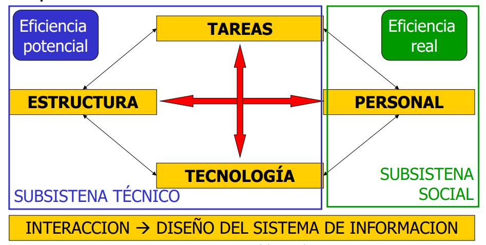

# Administración de empresas

- [Administración de empresas](#administración-de-empresas)
- [Introducción](#introducción)
- [Unidad 1](#unidad-1)

# Introducción

`Nota: Tener la materia al dia`

`Nota: Libro en carpetas publicas`

* Unidad 1 (Organización y administración) es introductoria.
* Unidad 2 (entorno y cultura)
* Unidad 3 ()

# Unidad 1

**Organización**: **Sistema social** con un **próposito definido** que interactúa en el **medio** que lo circunda

* Conjunto **interrelacionado** de recursos
* Conjunto **interdependiente** de recursos
* Tipos de recursos:
  * humanos, materiales, tecnológicos y de información
* Interactúan en un accionar **sinérgico**
* Orientados hacia **objetivos determinados**
* Con permanente intercambio con el **medio ambiente**:
  * macroambiente y ambiente intermedio

El **proposito** de la organización es: La **producción** y la **distribución** de los **medios** necesarios para cumplir los **reclamos** y **demandas** de las sociedad.

- **Microambiente**: Ambiente dentro de la misma org (?)
- Ambiente intermedio: La org puede interactuar e infuir dichos elementos del ambiente
- **Macroambiente**: Fuerzas del entorno en donde la org no puede ejercer influencia, solo es influenciada por las mismas.

Las organizaciones se pueden clasificar según su:
1. integración del capital (Privadas, estatales, mixtas)
2. fin (Con/sin fines de lucro)
3. forma jurídica (Unipersonal Colegiada)
4. origen de capital (Nacional, extranjera, mixta)
5. tamaño (Grandes, medianas, pequeñas)
6. alcance geográfico (Locales, nacionales, multinacionales, globales)
7. duración (Permanentes, temporales)
8. tipo de actividad (Industriales, comerciales y de servicio)

**Administración**: **Proceso** de **adoptar decisiones** e **impartir órdenes** en representación de los grupos de miembros de la organización. Apunta a **definir** el **trabajo** y el **comportamiento** de la organización necesarios para **cumplir** sus **objetivos**.