# Economia

- [Economia](#economia)
- [Introducción](#introducción)
- [Unidad 1 - Introducción a la economia](#unidad-1---introducción-a-la-economia)
  - [Importancia de la economia](#importancia-de-la-economia)
  - [Alternativas y escasez](#alternativas-y-escasez)
  - [Factores productivos](#factores-productivos)
  - [La economia positiva y normativa](#la-economia-positiva-y-normativa)
  - [Frontera de posibilidades de producción - FPP](#frontera-de-posibilidades-de-producción---fpp)
  - [Costo de oportunidad](#costo-de-oportunidad)
  - [Teorias, modelos y supuestos](#teorias-modelos-y-supuestos)
    - [ceteris paribus](#ceteris-paribus)
  - [Los modelos](#los-modelos)
  - [La economia de mercado y el estado](#la-economia-de-mercado-y-el-estado)
- [Unidad 2 - Teoria de la producción, costos y oferta](#unidad-2---teoria-de-la-producción-costos-y-oferta)
  - [La función de producción](#la-función-de-producción)
  - [La función de producción a corto plazo](#la-función-de-producción-a-corto-plazo)
    - [Productividad total (P.T)](#productividad-total-pt)
    - [Productividad marginal del trabajo (PML)](#productividad-marginal-del-trabajo-pml)
    - [Producto medio o productividad media (PMe)](#producto-medio-o-productividad-media-pme)
  - [Producción a largo plazo](#producción-a-largo-plazo)
  - [Rendimientos de escala](#rendimientos-de-escala)
  - [Funcion de Cobb-Douglas (?)](#funcion-de-cobb-douglas-)
  - [Costos - Isocostos](#costos---isocostos)
    - [Eficiencia economica](#eficiencia-economica)
    - [Sendero de expanción](#sendero-de-expanción)
  - [Costos](#costos)
    - [Corto plazo](#corto-plazo)
    - [Largo plazo](#largo-plazo)
  - [Función de oferta](#función-de-oferta)
- [Unidad 3 - Demanda y mercados](#unidad-3---demanda-y-mercados)
  - [La demanda](#la-demanda)
    - [La tabla y curva de la demanda](#la-tabla-y-curva-de-la-demanda)
  - [Teoria de la utilidad](#teoria-de-la-utilidad)
    - [La isoutilidad](#la-isoutilidad)
  - [Elasticidad](#elasticidad)
    - [Elasticidad de la demanda](#elasticidad-de-la-demanda)
      - [Elasticidad - precio de la demanda](#elasticidad---precio-de-la-demanda)
      - [Elasticidad-cruzada de la demanda](#elasticidad-cruzada-de-la-demanda)
      - [Elasticidad-ingreso de la demanda](#elasticidad-ingreso-de-la-demanda)
  - [Mercado](#mercado)
    - [Tipos de mercado](#tipos-de-mercado)
    - [Equilibrio del mercado](#equilibrio-del-mercado)
    - [Politica: los controles de precios](#politica-los-controles-de-precios)
    - [Las empresas en mercados de competencia perfecta](#las-empresas-en-mercados-de-competencia-perfecta)
    - [Las empresas en monopolio](#las-empresas-en-monopolio)
    - [Indice de lerner](#indice-de-lerner)
- [Macroeconomia](#macroeconomia)
  - [instrumentos de la politica macroeconomica](#instrumentos-de-la-politica-macroeconomica)
    - [Politica monetaria](#politica-monetaria)
    - [Politica fiscal](#politica-fiscal)
    - [Politica comercial-cambiaria](#politica-comercial-cambiaria)
    - [Politicas de oferta](#politicas-de-oferta)
  - [Modelo de oferta y demanda agregada](#modelo-de-oferta-y-demanda-agregada)
    - [Demanda agregada](#demanda-agregada)
    - [Oferta agregada](#oferta-agregada)
    - [Equilibrio macroeconomico](#equilibrio-macroeconomico)
  - [Medición de la actividad economica](#medición-de-la-actividad-economica)
    - [PBI](#pbi)
    - [Impuestos](#impuestos)
    - [Producto interno y nacional](#producto-interno-y-nacional)
    - [Nivel de actividad](#nivel-de-actividad)
    - [Nivel de empleo](#nivel-de-empleo)
    - [IPC](#ipc)
    - [Curva de phillips](#curva-de-phillips)
  - [Teoria de Keynes](#teoria-de-keynes)
    - [El modelo del multiplicador](#el-modelo-del-multiplicador)
  - [Flujo circular del ingreso](#flujo-circular-del-ingreso)
  - [Politica fiscal](#politica-fiscal-1)
    - [Medidas de política fiscal](#medidas-de-política-fiscal)
  - [Intermediarios financieros](#intermediarios-financieros)
  - [Politica monetaria](#politica-monetaria-1)
    - [Multiplicador monetario](#multiplicador-monetario)
  - [Comercio internacional](#comercio-internacional)
    - [La balanza de pagos](#la-balanza-de-pagos)
  - [Crecimiento economico y desarrollo](#crecimiento-economico-y-desarrollo)
  - [Nueva economia](#nueva-economia)
- [Economia de empresas](#economia-de-empresas)
  - [Contabilidad general](#contabilidad-general)
    - [Valuación de activos](#valuación-de-activos)
  - [Estructura financiera de las empresas](#estructura-financiera-de-las-empresas)
    - [Indicadores y ratios de performance](#indicadores-y-ratios-de-performance)
  - [Contabilidad de costos](#contabilidad-de-costos)
    - [Costeo por absorción](#costeo-por-absorción)
    - [Costeo variable](#costeo-variable)
- [Ingenieria economica](#ingenieria-economica)
  - [El valor del dinero en el tiempo](#el-valor-del-dinero-en-el-tiempo)
    - [Tasas de interes](#tasas-de-interes)
    - [Factores de equivalencia](#factores-de-equivalencia)
    - [Sistema de amortización de deuda](#sistema-de-amortización-de-deuda)
    - [Flujo de fondos](#flujo-de-fondos)
    - [Indicadores de eficiencia economica](#indicadores-de-eficiencia-economica)
  - [Evaluación de alternativas para la toma de desiciones](#evaluación-de-alternativas-para-la-toma-de-desiciones)
    - [Reemplazo de equipos](#reemplazo-de-equipos)
    - [Fabricar o comprar](#fabricar-o-comprar)

# Introducción

**Profesores**:
* Ramiro garcia (1226249@ucc.edu.ar) -> teorico
* Lic. Andres Rabinovich (1945525@ucc.edu.ar) -> practico
* John Henry Martinez (9305558@ucc.edu.ar) -> practico

# Unidad 1 - Introducción a la economia

## Importancia de la economia

Los ingenieros somos parte del aparato productivo de un pais, nuestro trabajo tiene q ser eficiente tecnica y economicamente, amigable con el medio amiente

La economia nos proporciona **herramientas** necesarias para la **toma de desiciones**. Los trabajos que realice el ingeniero buscarán lograr una relación optima entre el **rendimiento**, la **confiabilidad** y el **costo**. Es decir, el ingeniero deberá realizar **análisis económicos** y **financieros**, además del análisis técnicos, debiendo conocer y entender conceptos **económicos básicos**.

Estudiamos economia en ingenieria debido al **desarrollo sustentable**: desarrollo que satisface las necesidades presentes sin comprometer la habilidad de las futuras generaciones de satisfacer sus propias necesidades.

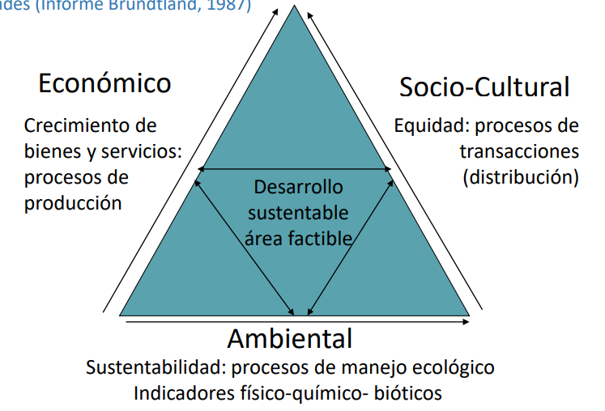

## Alternativas y escasez

En la vida real **elegimos** constantemente. Los consumidores, las empresas y el sector público tienen que plantearse constantemente **alternativas** a la hora de actuar y decidir cuál de ellas es la más conveniente. De hecho, todas las sociedades se enfrentan a la elección y, por lo tanto, actúan en el ámbito de la Economía.

La Economía se ocupa de las cuestiones que surgen en relación con la **satisfacción** de las **necesidades** de los individuos y de la sociedad. La satisfacción de necesidades **materiales** (alimentos, vestido o vivienda) y **no materiales** (educación, ocio, etc.)

La **Economía** estudia cómo las sociedades administran los recursos **escasos** para producir bienes y servicios, y distribuirlos entre los distintos individuos.

El **dilema** económico y, en consecuencia, la Economía, surge porque las **necesidades humanas** son, en la práctica, **ilimitadas**, mientras que los **recursos económicos** son **limitados** y, por lo tanto, también los bienes económicos. La **escasez** no es un problema tecnológico sino de **disparidad** entre deseos humanos y medios disponibles para satisfacerlos.

La Economía se estudia según **dos enfoques**: 
* La **Microeconomía** estudia los comportamientos básicos de los **agentes económicos individuales**. Estudia el modo en que toman decisiones los **hogares** y las **empresas** y la forma en que interactúan
* La **Macroeconomía**, por el contrario, analiza comportamientos agregados o **globales**, y se ocupa de temas como el **empleo**, la **inflación** o el **producto total** de una economía (fenómenos que afectan al conjunto de la economía).

## Factores productivos

Los **factores** o recursos **productivos** (inputs) son los **recursos** empleados por las empresas o unidades económicas de producción para **producir bienes** y **servicios**. 

* Trabajo (humano o intelectual)
* Capital
* Recursos naturales

Los inputs se combinan con el fin de obtener los productos. Los **productos** (outputs) consisten en la amplia gama de **bienes** y **servicios**, cuyo objetivo es el **consumo** o su **uso posterior** en la producción.

## La economia positiva y normativa

Los economistas no solo se dedican a **comentar** los hechos que **observan** sino que, en ocasiones, formulan **propuestas** y **afirmaciones** sobre cómo **deberían ser** las cosas. Por ello, cabe distinguir entre:
* **Afirmaciones positivas**: Explicaciones **objetivas** del funcionamiento de los **fenómenos económicos**; tratan sobre “lo que es o podría ser” .
* **Afirmaciones normativas**: Ofrecen prescripciones para la acción basadas en **juicios** de **valor personales** y **subjetivos**; tratan de “ lo que debería ser”

## Frontera de posibilidades de producción - FPP

La curva de transformación o **frontera de posibilidades de producción** (FPP) muestra la **cantidad máxima** posible de unos **bienes** o **servicios** que **puede producir** una determinada economía con los **recursos** y la **tecnología** de que **dispone**, y dadas las cantidades de otros bienes y servicios que también produce. Ej:

Si a partir de una situación dada se decide producir más computadoras personales, y se orientan los esfuerzos en esa dirección, se tendrá que aceptar una producción menor de teléfonos celulares.

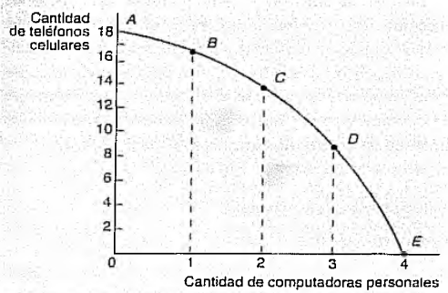

La FPP de una economía, como su propio nombre lo indica, es una frontera, pues delimita dos regiones: una en la que la economía está **despilfarrando recursos** (la que está situada debajo de la FPP), y otra que **no es alcanzable** (la situada por encima de la FPP)

La **eficiencia** es una propiedad según la cual la sociedad **aprovecha** de la **mejor manera** posible sus **recursos** escasos. Cuando una economía está **situada** sobre su **frontera** de posibilidades de producción, se dice que es **eficiente productivamente**.

El **crecimiento económico** supone el aumento de la capacidad productiva de la economía. Gráficamente, se puede representar mediante un **desplazamiento** hacia la **derecha** de la FPP.

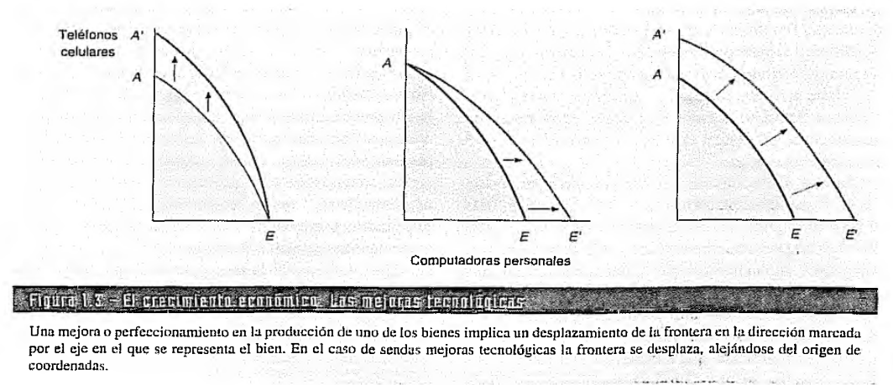

## Costo de oportunidad

La Economía nos enseña que “no hay nada gratis” , lo cual equivale al principio de que todo tiene un costo, que denominamos costo de oportunidad.

El **costo de oportunidad** de una cosa es aquello a lo que se **renuncia** para conseguirla.

producir una cantidad mayor de un bien exigirá producir menos de otro. La opción que debe abandonarse para poder producir u obtener otra cosa se asocia, en Economía, al concepto de costo de oportunidad.

## Teorias, modelos y supuestos

Una **teoría** es una **explicación** del **mecanismo** que subyace en los fenómenos observados.

Una **variable económica** es algo que **influye** en las **decisiones** relacionadas con los problemas económicos fundamentales o algo que describe los resultados de esas decisiones.

Los **supuestos** son **proposiciones** cuya **validez** se toma como **dada** y se introducen porque concretan los modos de conducta de los agentes económicos.

Las **teorías** no deben **evaluarse** por el **realismo** de sus **supuestos** sino por la **validez** de sus **predicciones**.

### ceteris paribus

Esta condición consiste en suponer que si, por ejemplo, estamos estudiando la incidencia del precio de los automóviles en la cantidad demandada de este bien, las **demás variables** que inciden en la demanda de automóviles, excepto el precio, permanecen **constantes**. Solo de esta forma podemos analizar el efecto de un cambio en el precio de los automóviles “ ceteris paribus” en la cantidad demandada de este bien.

## Los modelos

Un modelo es una simplificación y una abstracción de la realidad que, a través de supuestos, argumentos y conclusiones, explica una determinada proposición o un aspecto de un fenómeno más amplio.

## La economia de mercado y el estado

Un **sistema económico** se define como el conjunto de **relaciones** básicas, técnicas e institucionales que **caracterizan** la **organización económica** de una sociedad y **condicionan** el sentido general de sus **decisiones** fundamentales, así como los cauces predominantes de su actividad.

El problema economico de toda sociedad es:
* ¿Que producir?
* ¿Como producirlo?
* ¿Para quien producirlo?

Algunas de las formas organizacionales que existen para dar respuestas a estas preguntas son:
* Sistema de mercado
* Sistema de autoridad
* Sistema mixto

Cuando los diferentes agentes sociales actúan **libremente** dentro de un marco institucional determinado, estamos hablando de una **economía de mercado**. En una economía de mercado los recursos se asignan por medio de las decisiones descentralizadas de muchas empresas y hogares, conforme interactúan en los mercados de bienes y servicios. 

El **mercado** es un **mecanismo** por medio del cual los **compradores** y los **vendedores** **interactúan** para fijar los precios e intercambian bienes y servicios.

si las relaciones entre los agentes sociales están **determinadas** por las decisiones que toma una **autoridad**, nos encontramos ante una **planificación central**. En cualquier caso, el análisis de la realidad nos dice que, en determinadas circunstancias, el Estado puede y debe intervenir, corrigiendo o complementando el libre funcionamiento de los mercados. Los motivos que pueden justificar la intervención del Estado en la actividad económica pueden clasificarse en tres categorías: 
1. redistribución del ingreso y equidad, 
2. razones macroeconómicas
3. existencia de fallas de mercado.

En una **economía mixta**, el sector público colabora con la iniciativa privada para dar respuesta a las preguntas sobre el qué, el cómo y el para quién del conjunto de la sociedad

# Unidad 2 - Teoria de la producción, costos y oferta

La **teoría** de la **Producción** muestra como las empresas utilizan factores de producción y los convierten en bienes y servicios.

Al producir, la empresa incurre en una serie de costos que tendrá que valorar adecuadamente para que la **diferencia** entre los **ingresos** que obtiene y los **costos** sea lo **más elevada** posible. En cualquier caso, la decisión básica que toda empresa debe tomar es la **cantidad** que va a producir, y esta depende del **precio de venta** y del **costo de producción**. En el proceso que sigue para determinar la cantidad de producto que va a colocar en el mercado, la empresa se guía por el deseo de maximizar los beneficios, es decir, la diferencia entre los ingresos y los costos totales.

La empresa tiene como función básica transformar los factores de producción para convertirlos en bienes y servicios aptos para el consumo o para la inversión. La **producción** se organiza en empresas porque la eficiencia generalmente obliga a producir en gran escala, a reunir un elevado volumen de recursos externos y a gestionar y supervisar cuidadosamente las actividades diarias.

## La función de producción

Dada una cantidad **fija** de **factores**, la **cantidad** de **producto** que se puede **obtener** depende del estado de la **tecnología**. Esta es un conjunto de **técnicas** disponibles en un momento dado, para la **combinación** de **factores de producción**. Se relaciona con la **forma** o el modo en que se **combinan** los **recursos** y con los métodos que se emplean en la producción y la proporción en que se usan los distintos factores.

La **función de producción** especifica la cantidad **máxima** de un bien que puede producirse con una cantidad dada de **factores** o insumos, y se define para un estado dado del **conocimiento tecnológico**.

## La función de producción a corto plazo

Muchos de los factores que se emplean en la producción son bienes de capital, tales como maquinarias, edificios, etc. Si quisiéramos aumentar la producción rápidamente, algunos de estos factores no podrían incrementarse debido a que en el **corto plazo** son **fijos**. 

Lo contrario sucede con los **factores variables**, como el trabajo, cuya adquisición en mayores cantidades sí resulta factible en el corto plazo.

El **corto plazo** es un período de **tiempo** a lo largo del cual las empresas pueden **ajustar la producción** cambiando los **factores variables**, tales como el trabajo y los materiales. En el corto plazo los factores **fijos**, como la planta y el equipo, **no pueden ajustarse** plenamente.

Algunas definiciones: 

### Productividad total (P.T)

Esto es, la cantidad de producto que se obtiene para diferentes niveles de trabajo.
  
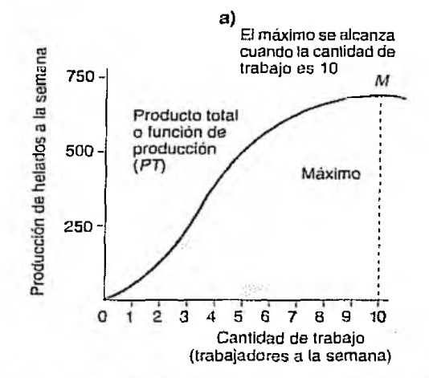

La **curva de producto total** muestra la relación entre la cantidad de un factor variable (el trabajo) y la cantidad de producto obtenida. La **curva de producto marginal** de un factor variable (el trabajo) muestra el aumento en el producto total como consecuencia de utilizar una unidad adicional de ese factor.

### Productividad marginal del trabajo (PML)

variación que tiene lugar en el producto total (PT) cuando se utiliza una unidad más del factor variable (tasa de crecimiento)

Como puede observarse en la Figura a, el producto total del trabajo arranca en el origen de coordenadas (pues si se utilizan 0 unidades de trabajo, se obtienen 0 unidades de producto) y es **creciente**. Aumenta de forma continua a un ritmo creciente (conforme se incrementa la cantidad empleada de trabajo) hasta que se contrata el cuarto trabajador. En este momento la curva del producto total tiene un **punto de inflexión** y pasa de aumentar a un ritmo creciente a hacerlo a un ritmo **decreciente**. En este mismo intervalo, el **producto marginal** es creciente (Figura 5.1 b). A partir de este trabajador, la cantidad total de producto  continúa aumentando, pero a un ritmo **decreciente** hasta alcanzar un **máximo** (el máximo técnico, M ) cuando se emplean 10 trabajadores, y después **decrece**.

La justificación del comportamiento observado en la descansa en la llamada **ley de los rendimientos decrecientes**. Según esta ley, a partir de un **cierto nivel** de factor variable se obtienen **cantidades de producto sucesivamente menores** al añadir dosis iguales de un factor variable a una cantidad fija de un factor.

### Producto medio o productividad media (PMe)

cociente entre el producto total y el número de unidades físicas del factor de producción variable (promedio)

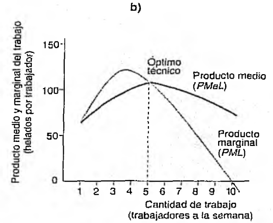

En la literatura económica, al **producto medio** del trabajo se lo suele denominar **productividad** del trabajo, e indica el **nivel de producción** que obtiene la empresa por **unidad de trabajo empleada**. De forma genérica, el concepto de productividad se asocia con el cociente entre el producto total y el número de trabajadores

al igual que el producto marginal (PML), el producto medio **aumenta inicialmente** cuando se incrementa la cantidad de trabajadores y, a partir de cierto nivel empieza a **decrecer**. El **máximo producto** o productividad media se denomina **óptimo técnico**. Además, cuando el producto marginal es mayor que el producto medio, la curva de producto medio es **creciente** y, cuando es menor, la curva de producto medio es **decreciente**, de forma que, cuando la curva de producto marginal **corta** la curva de producto medio, esta alcanza su **máximo**.

## Producción a largo plazo

Si el producto que una empresa lanza al mercado experimenta una demanda creciente, esta deseará aumentar la producción. De forma inmediata ia empresa puede hacer que la **mano de obra** existente trabaje **horas extras**, y también puede **incrementar** el **número de empleados** contratados. En un **plazo algo mayor**, y si continúa la presión de la demanda, la empresa se planteará la conveniencia de **ampliar las instalaciones** e incluso de **construir** una **nueva fábrica**.

A **largo plazo** las empresas tienen la posibilidad de **alterar** la **cantidad** de **cualquiera** de los **factores** que emplean en la producción, incluido el capital.

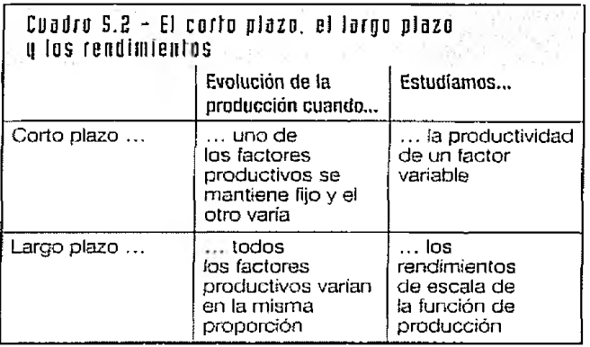

## Rendimientos de escala

Las propiedades técnicas de la producción a largo plazo se determinan en torno al concepto de **rendimientos de escala**. Escala significa el **tamaño** de la **empresa** medido por su **producción**.

Los **rendimientos de escala** reflejan la **respuesta** del **producto total** cuando **todos** los **factores** se **incrementan proporcionalmente**.

* **Rendimiento de escala creciente**: Fijándonos en el comportamiento de la cantidad producida de un bien, diremos que existen **rendimientos** o economías de **escala crecientes** cuando, al **variar** la cantidad utilizada de **todos** los **factores** en una **determinada proporción**, la **cantidad obtenida** del producto **varía** en una **proporción mayor** (por ejemplo, al duplicar las cantidades utilizadas de todos los factores obtenemos más del doble del producto).
* **Rendimientos constantes de escala**: cuando la cantidad utilizada de todos los factores y la cantidad obtenida de producto **varían** en la **misma proporción**.
* **Rendimientos de escala decrecientes**: cuando, al variar la cantidad utilizada de todos los factores en una proporción determinada, la cantidad obtenida de producto varía en una **proporción menor**

`Nota: Todo el siguiente tema de isocuantas no lo encontre en los libros "Economia, principios y aplicaciones" ni "Principios de economia".`

**CURVA ISOCUANTA**: Muestra las distintas **combinaciones** de **factores** para producir el **mismo** **nivel** de **producción**. La curva isocuanta o curva del mismo producto surge de unir algunas de las posibles combinaciones de factores productivos (k y L) que permiten producir una cantidad determinada de producto (qo)

Si suponemos que en la producción solo intervienen dos factores, el trabajo (L ) y el capital (K), la función vendrá dada por la siguiente expresión: q = F (L, K).

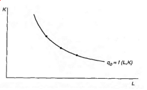

LA **TASA MARGINAL DE SUSTITUCIÓN TÉCNICA** : Es la cantidad de un insumo que una firma está dispuesta **ceder** a cambio de una **unidad adicional** de **otro insumo**, sin que se produzcan **pérdidas** en la **producción**. Se mide por la **pendiente** de la isocuanta en el punto que representa esa combinación (derivada, TMST (L,K) = -dK/dL).

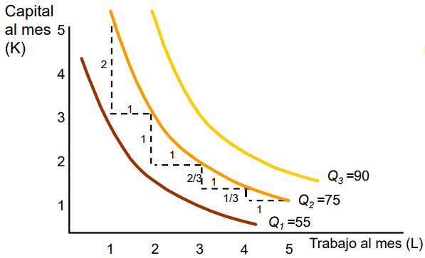
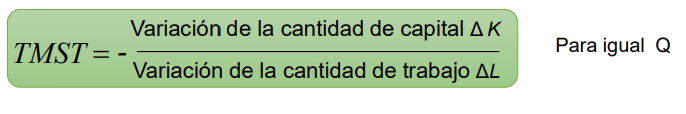

Los rendimientos de escala se pueden ver reflejados utilizando las curvas isocuanticas:

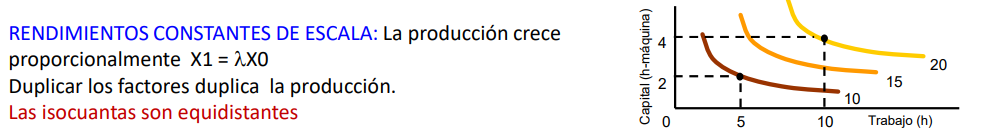

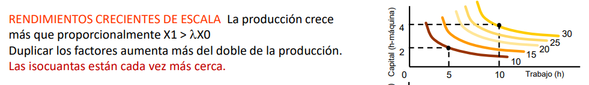

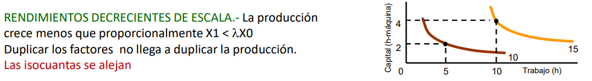

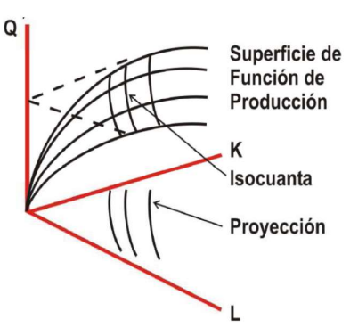

## Funcion de Cobb-Douglas (?)

Representa una relación en donde las **proporciones** de **trabajo** y **capital**, con respecto al **producto total**, son **constantes**.

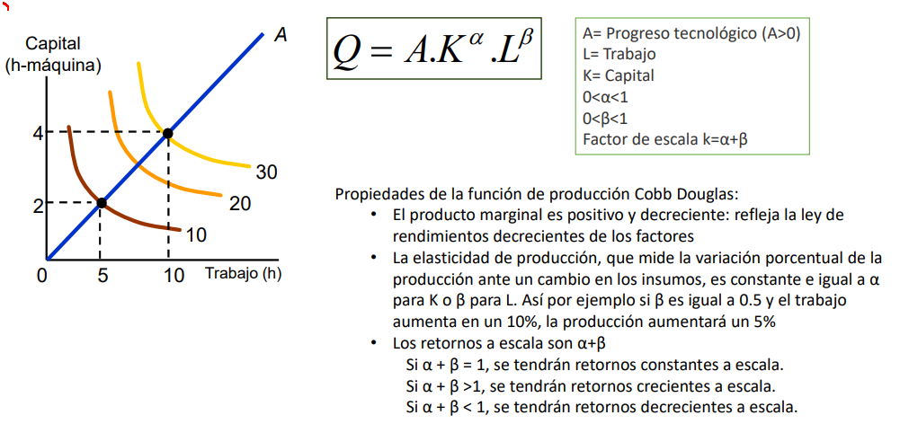

## Costos - Isocostos

Cualquiera de las combinaciones en la curva isocuanta es apropiada para obtener la cantidad q_o, todas son técnicamente eficientes, sin embargo, la empresa **buscará** encontrar la combinación que le permita producir q_o al **menor costo**.

Dados los precios de los factores, siendo **w** el precio del trabajo y **r** el precio del capital, el **costo total** (CTq) de emplear cualquier volumen de L y K será: CTo = wL + rK

El conjunto de combinaciones de factores que pueden comprarse por un costo total determinado, que denotamos por CTo, se denomina **línea isocosto**. 

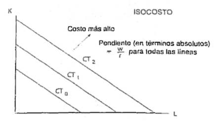

### Eficiencia economica

CO, C1 y C2 son tres líneas isocosto.

Q1 es una isocuanta para un producto total de ese nivel.

La Isocosto C2 muestra que la cantidad Q1  puede ser producida a ese costo con las combinaciones K2L2 o K3L3. Sin embargo, ambas son combinaciones de **mayor costo** que K1L1.

EN EL **PUNTO DE EFICIENCIA ECONÓMICA** Existe una **combinación de factores** para la cual la **recta** de **isocosto** es **tangente** a la **curva** de **isocuanta**. En este caso:
* Para una recta de isocosto dada, se tiene la máxima cantidad de producción alcanzable
* Para una determinada cantidad de producción, se minimiza el costo

La condición para minimizar los costos se alcanza cuando la razón entre los precios de los factores se iguala a la razón de los productos marginales de los factores, esto es:

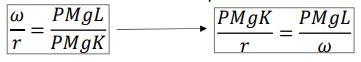

### Sendero de expanción

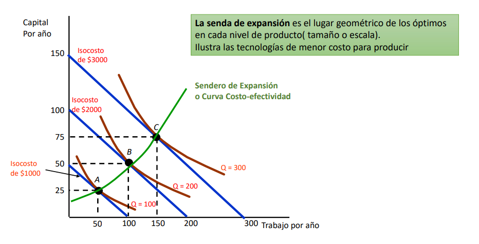

## Costos

### Corto plazo

EL **COSTO** viene determinado por el **valor** de los **factores** utilizados por la empresa para producir el bien. Costo: sacrificio de recurso productivo

El **costo económico** considera el **costo de oportunidad** de todos los recursos utilizados, esto es, lo que todos los recursos podrían obtener en su mejor uso alternativo. (incluye tanto los costos explícitos como los implícitos)

* Los **costos fijos** (CF), son los costos de los **factores fijos** de la empresa y, por lo tanto, a corto plazo son **independientes** del nivel de **producción**. 
* Los **costos variables** (CV), dependen de la **cantidad** empleada de los **factores variables** y, por lo tanto, del nivel de **producción**.
* Los **costos totales** (CT) son iguales a los costos **fijos** mas los costos **variables** C T = C F + C V

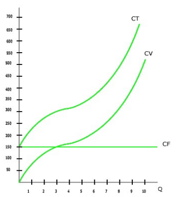

LOS **COSTOS MEDIOS** son los costos por unidad de producción.

* El costo **fijo** medio (CFMe), es el cociente entre el **costo fijo** (CF) y el nivel de **producción** CFMe=CF/Q. La curva del costo fijo medio (CFMe) muestra como este costo disminuye conforme aumenta la producción.
* El costo **variable** medio (CVMe), es el **costo variable** (CV) dividido por el nivel de **producción** CVMe=CV/Q.
* El costo **total** medio (CTMe), es el **costo total** (CT = CF + CV) dividido por el numero de **unidades producidas**: CTMe=CT/Q=CFMe+CVMe. Nos dice lo que cuesta en promedio cada unidad de producto.

Las curvas CTMe y CVMe tienen forma de “U”, lo que se explica, por la existencia de rendimientos **crecientes** en una **primera fase** y **decrecientes** en una **segunda** fase. Lo contrario de lo que ocurre con la curva de producto medio

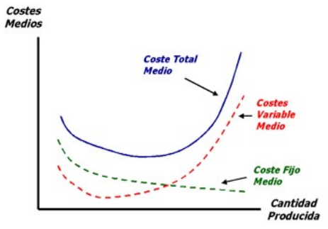

EL **COSTO MARGINAL** (CMg) es el **costo adicional** ligado a la **producción** de **una unidad adicional** de un bien. CMg=DCT/DQ.

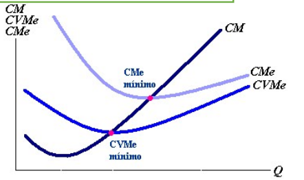

La curva de costos marginales ha de cortar la curva de costos medios en su **mínimo**. 

Si la producción de una unidad adicional hace disminuir el costo medio, el costo marginal será inferior al costo medio 

si la producción de una unidad adicional hace que aumenten los costos medios, el costo de esa unidad adicional (costo marginal) será mayor que el costo medio

### Largo plazo

A largo plazo, la empresa tiene tiempo suficiente, dados unos precios concretos de los factores, paraajustar la cantidad empleada de la totalidad de los factores de producción, de modo que no existes factores fijos.

La **curva de costos totales de largo plazo** (CTL), es la envolvente de las curvas de costos totales a corto plazo, en el mínimo nivel de costo para cada nivel de producción

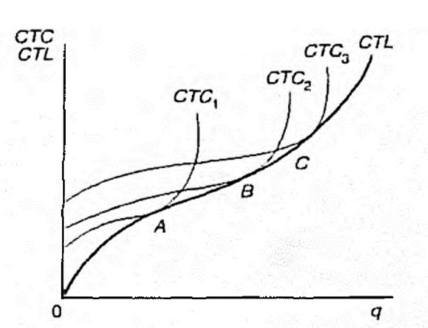

La **curva de costo medio de largo plazo** (CMeL) muestra el **costo medio mínimo** de producción cuando **todos** los **factores productivos** son totalmente **variables**. (el costo medio mínimo de producir cada cantidad).

A cada tamaño de la planta le corresponde una curva de costo total medio de corto plazo, que muestra los costos medios de producción, utilizando un tamaño dado de la planta y variando las cantidades de factor variable. Debido a que en el largo plazo la empresa tiene mas flexibilidad, los costos medios de corto plazo están por encima de los costos medios de largo plazo. (curva **envolvente**)

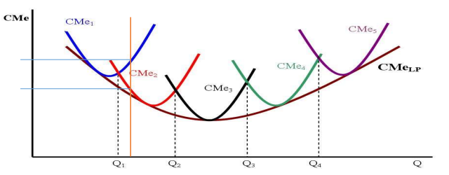

Al hablar de **Economía de escala**, se hace referencia a propiedad según la cual el **costo medio** a **largo plazo** **disminuye** conforme se **incrementa la producción**. Sin embargo, no debe olvidarse que al hablar de Economía de escala nos estamos refiriendo a la función de producción de la empresa. La curva de costos medios está relacionada con los costos de producción, que dependen de la función de producción:

* Si un **aumento** en las **cantidades producidas**, requiere un incremento **menos que proporcional** en los factores de producción, producirá una **disminución** en los **costos medios** y se dice que existen **rendimientos crecientes** o economía de escala. (a mayor Q, menor CMeL);
* Si un aumento en las cantidades producidas, requiere un incremento **mas que proporcional** en los factores de producción, producirá un **aumento** en los **costos medios** y existen rendimientos decrecientes o **deseconomías de escala** (a mayor Q, mayor CMeL)
* Si un aumento en las cantidades producidas, requiere un incremento se la **misma proporción** en los factores de producción, **no producirá cambios** en los costos medios y existen rendimientos de escala (a mayor Q, igual CMeL)

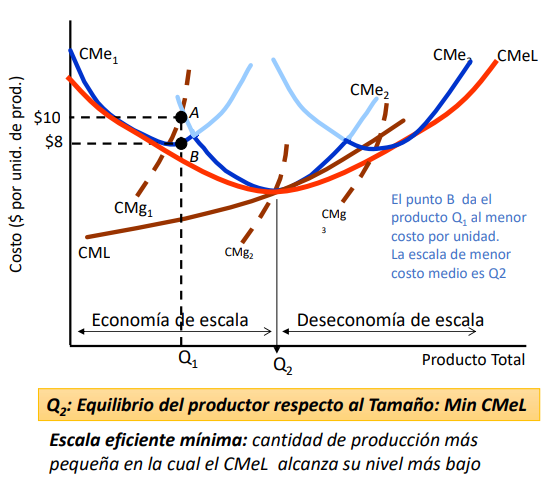

La **curva de costo marginal de largo plazo** (CMgL) muestra el **costo adicional** necesario para obtener **una unidad más de producción** cuando a todos los factores son totalmente variables, de forma que estos se pueden modificar óptimamente a fin de minimizar costos

La curva de CMgL corta en su **mínimo** la curva de CMeL, coincidiendo, obviamente, con un determinado mínimo de las curvas de corto plazo

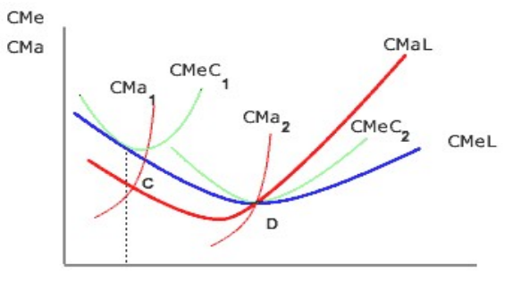

La curva de CMgL tiene la misma relación con la CMeL, que la curva de costo marginal de corto plazo con la curva de costo total medio de corto plazo. Así, cuando la curva CMgL se encuentra por **debajo** de CMeL, esta es **descendente**, mientras que si se encuentra por **encima**, la curva CMeL es **ascendente**.

## Función de oferta

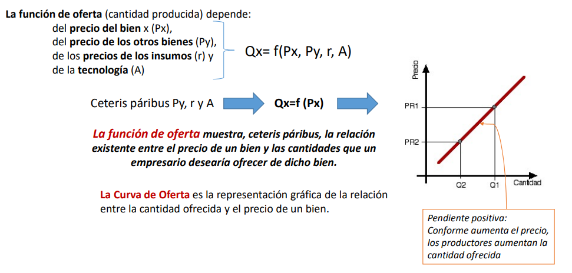

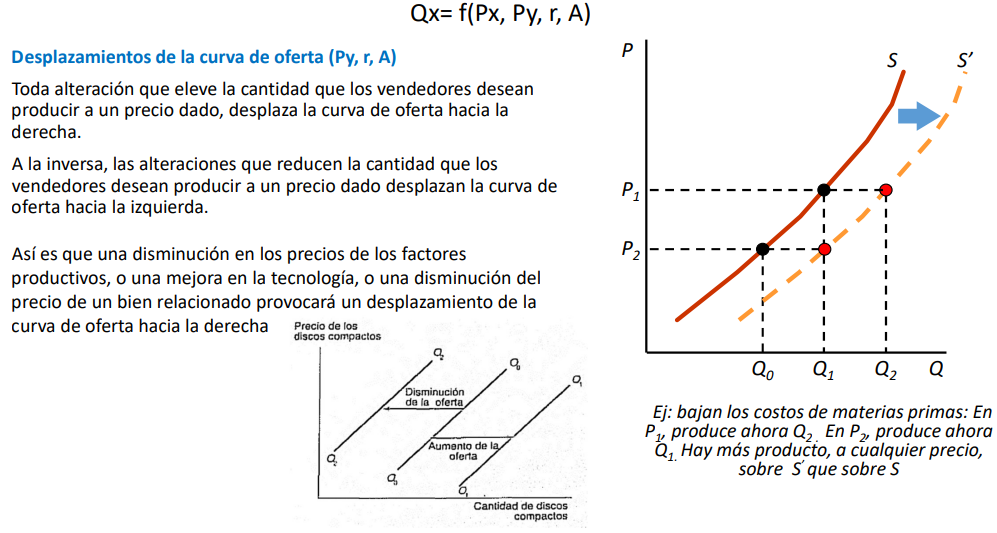

# Unidad 3 - Demanda y mercados

Durante los meses de verano, el precio de los deparamentos ubicados en la costa se eleva. Cuando llegan las fiestas de Navidad, el de algunos alimentos sube de manera rápida; sin embargo, a mediados del verano el precio del melón suele alcanzar sus niveles más bajos.

Estos hechos, y otros parecidos que podríamos citar, se hacen evidentes en el funcionamiento de los mercados y tienen en común una serie de factores que actúan a través de la oferta y la demanda. El juego de compradores y vendedores (es decir, de las fuerzas que actúan en los mercados) establece las cantidades y los precios de los distintos bienes y servicios.

## La demanda

A las **cantidades** de un bien que los consumidores **deseen** y puedan **comprar** las denominamos **demanda** de dicho bien.

**Demandar** significa estar **dispuesto a comprar**, mientras que **comprar** es efectuar realmente la **adquisición**.

Así, la **demanda** refleja una **intención**, y la **compra** constituye una **acción**.

### La tabla y curva de la demanda

Hay una serie de **factores** determinantes de las cantidades que los consumidores desean adquirir de cada bien por unidad de tiempo, tales como sus **preferencias**, sus **ingresos** en ese período, los precios de los **demás bienes** y, sobre todo, el **precio** del propio bien en cuestión.

Si consideramos constantes todos los factores, excepto el precio del bien, esto es, si aplicamos la condición ceteris paribus, podemos hablar, por ejemplo, de la **tabla** de **demanda** de un **producto** por un **consumidor determinado** cuando consideremos la relación que existe entre la cantidad demandada y el precio del producto, es decir, la tabla de demanda muestra la relación entre el precio de un bien y la cantidad demandada.

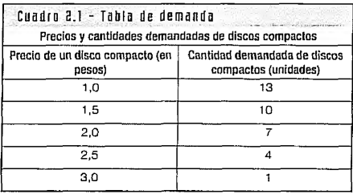

Bajo la condición ceteris paribus, y para un precio determinado de los discos compactos, la **suma** de las **demandas individuales** nos dará la **demanda** global o **del mercado** de dicho bien.

La **ley de la demanda** se refiere a la **relación inversa** existente entre el **precio** de un bien y la **cantidad demandada**, en el sentido de que al aumentar el precio disminuye la cantidad demandada, y lo contrario ocurre cuando se reduce el precio.

Hay dos razones por las cuales la cantidad demandada por todos los consumidores disminuye cuando el precio de un bien aumenta. Por un lado, al aumentar el precio de un bien, algunos consumidores que previamente lo adquirían dejarán de hacerlo o lo comprarán en menor cantidad, y buscarán otros bienes que lo sustituyan (**Efecto sustitución**). Por otro lado, cuando un bien se encarece los consumidores demandarán menos unidades porque la elevación del precio ha reducido la capacidad adquisitiva de los ingresos, y esto hará que puedan comprar menos de todos los bienes y, en particular, del que estamos considerando (**Efecto ingreso**).

Podemos representar gráficamente la demanda mediante una **curva decreciente** que relaciona la **cantidad demandada** de un bien con el **precio**. A  reducirse el precio, aumenta la cantidad demandada. A cada precio P le corresponde una cantidad Q que los demandantes están dispuestos a adquirir. Al trazar la curva de demanda, suponemos que se mantienen constantes a los demás factores, excepto el precio, que puedan afectar la cantidad demandada

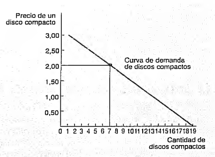

La **función de demanda** expresa la relación entre la **cantidad** demandada de un bien, su **precio** y otras variables

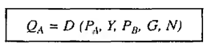

* cantidad demandada de un bien (Qa) 
* precio del bien (P_A)
* los ingresos (Y)
* precios de otros bienes (P_B)
* los gustos de los consumidores (G)
* el tamaño del mercado (N)

Para representar la curva de la Figura 2.1, hemos supuesto que, en la expresión anterior, esto es, en la función de demanda, los valores de todas las variables, salvo la cantidad demandada del bien A y su precio, permanecen constantes. Es decir, hemos aplicado la condición ceteris paribus.

En este sentido, cabe preguntarse qué sucederá cuando, aun permaneciendo invariable el precio del bien, se altere alguno de los factores que, bajo la condición ceteris paribus, hemos considerado constantes. En estos casos, la curva de la demanda se **desplaza**

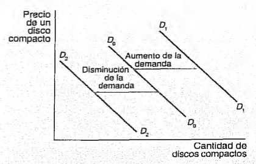

las alteraciones de estos factores, distintos del precio, originan desplazamientos de la curva de demanda. cuando la curva de demanda se aleja en su desplazamiento del origen de ordenadas, decimos que se ha producido un **incremento** en la demanda. Cuando se desplaza hacia el origen de ordenadas decimos que se ha producido una **disminución** de la demanda

**Ingreso de los consumidores**

Si el ingreso de los consumidores aumenta, se produce un incremento o disminución de la demanda dependiendo de si el producto es:
* **Bien normal**: al aumentar el ingreso de los consumidores, la cantidad demandada a cada uno de los precios se incrementa.(Celulares, autos)
* **Bien inferior**: al aumentar el ingreso de los consumidores, la cantidad demandada a cada uno de los precios disminuye (alimentos de mala calidad).

**Los precios de los bienes relacionados**

La curva tambien puede incrementarse o disminuirse dependiendo del tipo de bien relacionado cuyo precio cambie:

* **Bienes complementarios**: al aumentar el precio de uno de ellos, se reduce la cantidad demandada del otro, cualquiera sea el precio.
* **Bienes sustitutivos**: al aumentar el precio de uno de ellos, la cantidad demandada del otro se incrementa, cualquiera sea el precio.
* **Bienes independientes**: no guardan ninguna relación entre sí, de modo que la variación del precio de uno de ellos no afecta la cantidad demandada del otro. 

**Los gustos o preferencias de los consumidores**

Si, como consecuencia de la alteración de los gustos los consumidores demandan una mayor cantidad de un bien, la curva de demanda de dicho bien se desplazará hacia la derecha; mientras que, si las preferencias cambian en sentido contrario, la curva de demanda se desplazará hacia la izquierda.

**El tamaño del mercado y otros factores**

la demanda de un determinado bien en un país que tiene el doble de población que otro será significativamente mayor.

## Teoria de la utilidad

Para explicar el comportamiento de los consumidores, podemos aceptar como punto de partida que éstos tienden a elegir aquellos **bienes** y **servicios** que valoran mas, es decir, los que les reportan **mayor utilidad** o **satisfacción**. En otras palabras, vamos a suponer que los individuos **maximizan su utilidad**, lo que implica que eligen el conjunto de bienes de consumo que prefieren.

La **utilidad** es el sentimiento subjetivo de **placer** o **satisfacción** que una persona experimenta como consecuencia de **consumir** un **bien** o un **servicio**.

Para analizar las decisiones del consumidor, empecemos por describir la relación que existe entre las **cantidades consumidas** de un bien y la **utilidad** que éstas proporcionan. Parece lógico suponer (y la experiencia así lo sugiere) que, a medida que **aumenta** la **cantidad consumida** de un bien, digamos helado, **aumenta** la **satisfacción** o **utilidad total** proporcionada por dicha cantidad.

Cuando aumenta la cantidad consumida de, por ejemplo, helado en un kilo, obtenemos un aumento de utilidad total que denominamos **utiiidad marginal**.

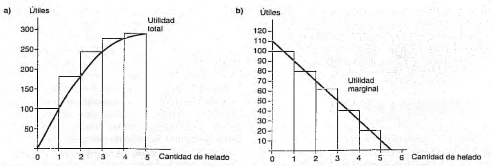

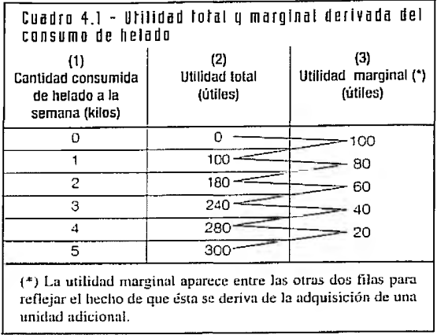

### La isoutilidad

Una **CURVA DE ISOUTILIDAD** O CURVA DE INDIFERENCIA muestra el conjunto de combinaciones ante las cuales el consumidor es indiferente debido a que cada una de ellas le reporta el mismo nivel de utilidad.

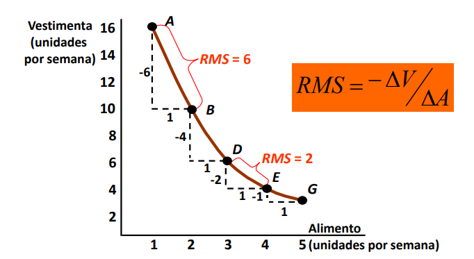

La **RELACIÓN MARGINAL DE SUSTITUCIÓN** entre un bien y otro, se define como la cantidad máxima del segundo a que esta dispuesto a renunciar un consumidor, sin reducir con ello su utilidad, para aumentar el consumo del primer bien en una unidad. Tasa a la cual un consumidor está dispuesto a intercambiar un bien por otro.

La **RESTRICCIÓN PRESUPUESTARIA** establece que la suma de las cantidades gastadas en cada bien (precio por cantidad de cada bien) es igual al ingreso.

La **RECTA DE BALANCE** muestra las combinaciones máximas de bienes que el consumidor puede comprar, dados los precios que tiene que pagar y sus ingresos (R = Px*Qx + Py*Qy)

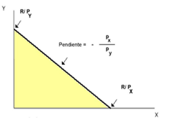

El **equilibrio del consumidor** se alcanza cuando la relación marginal de sustitución del consumidor (la pendiente en un punto de la curva de indiferencia), es igual a la pendiente de la recta de balance, esto es, a la relación entre el precio de los dos bienes.

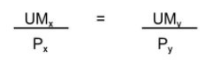

EL **PRINCIPIO DE LA IGUALDAD DE LAS UTILIDADES MARGINALES** establece que el consumidor que cuenta con un ingreso monetario dado y se enfrenta a unos precios para los distintos bienes, solo maximizara su utilidad, si cada bien se demanda hasta el punto en el que la utilidad marginal del ultimo peso gastado en él, sea exactamente igual a la utilidad marginal del ultimo peso gastado en cualquier otro bien.

En el óptimo, la utilidad marginal por cada unidad monetaria que se gasta en el bien X es igual a la utilidad marginal por cada unidad monetaria que se gasta en el bien Y.

El valor es lo que se recibe del producto y se relaciona con Ume= UnidadesTotales / Unidades consumidas

El precio, es la disposición a pagar y se relaciona con Utilidad Marginal y no con U Media.

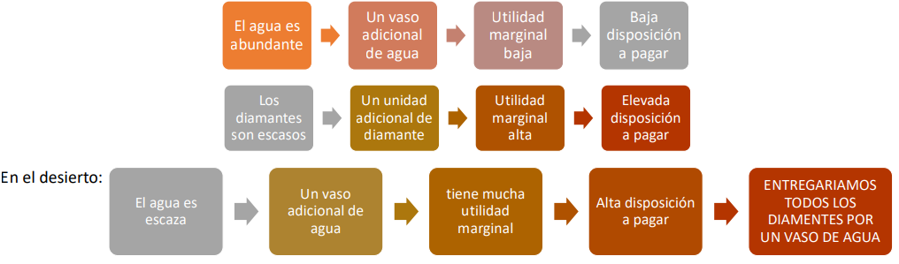

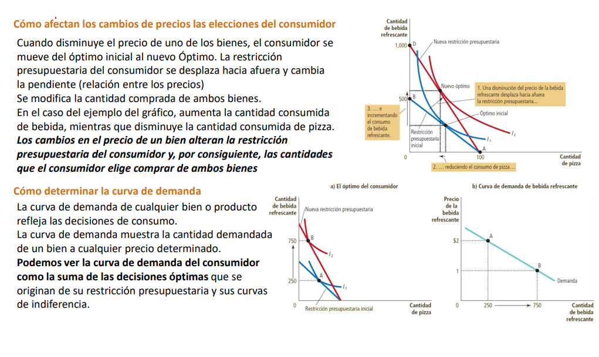

## Elasticidad

**Nota**: El análisis de la Microeconomía se divide en **tres bloques**.
* En el primero, la atención se centra en la **conducta** de los **mercados** de **productos**, esto es, los mercados de todos los bienes y servicios producidos por las empresas. Analizamos de **dónde procede** la **demanda** de los consumidores, **cómo toman** las **decisiones** de producción las empresas y de qué modo los precios y los beneficios (o pérdidas) orientan una eficiente asignación de los recursos en los distintos mercados. 
* En el segundo bloque se estudian los **mercados** de **factores de producción**, como el trabajo, el capital y la tierra. Los precios que se forman en estos mercados contribuyen a determinar el ingreso que perciben los trabajadores, los : inversores y los terratenientes.
* Un tercer bloque se ocupa de estudiar en qué circunstancias **fallan** los mercados y el papel del **Estado** ante tales situaciones.

Con el fin de utilizar la oferta y la demanda como instrumentos verdaderamente útiles, necesitamos saber **cuánto responden** éstas a las **variaciones** de los **precios**.

Así, por ejemplo, el gasto en viajes de turismo o en barcos de vela resulta bastante afectado por las variaciones de los precios, mientras que los gastos en otros bienes considerados necesarios son muy poco sensibles a dichas variaciones. 

Para conocer las razones que explican la distinta sensibilidad de las cantidades demandadas ante cambios en los precios, suele utilizarse un concepto fundamental en Economía: la **elasticidad**, que es una forma de **cuantificar** la **sensibilidad** de la oferta y la demanda a las **variaciones** de los **precios**.

### Elasticidad de la demanda

La **elasticidad** es una medida de la **sensibilidad** de la **cantidad demandada** o de la cantidad ofrecida ante un **cambio** en alguno de sus **factores determinantes**.

#### Elasticidad - precio de la demanda

podemos decir que el coeficiente de **elasticidad-precio** de la demanda, E_p, es la **razón** entre la **variación porcentual** de la **cantidad demandada** de un bien y la **variación porcentual** de su **precio**, manteniéndose constantes todos los demás factores que afectan la cantidad demandada.

La elasticidad-precio de la demanda mide el grado en que la **cantidad demandada responde** a las **variaciones** del **precio** de mercado.

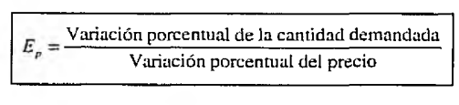
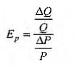
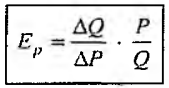

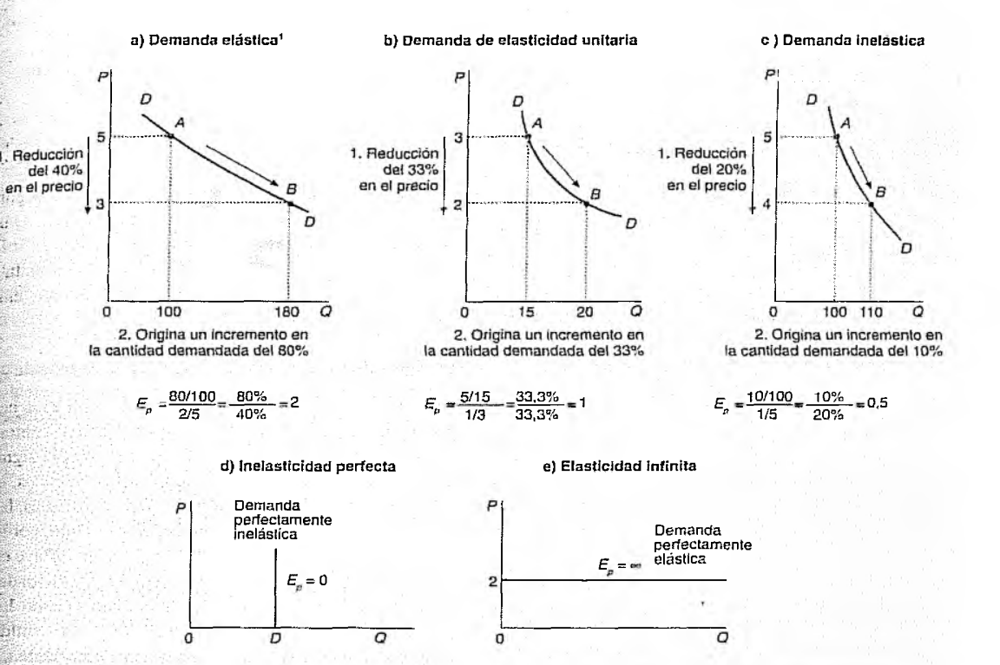

Algunos de los factores determinantes de la elasticidad-precio de la demanda son los siguientes:
* Tipo de **necesidad** que satisface el bien: Si el bien satisface una necesidad primaria (comida, medicamentos) es de esperar valores de elasticidad reducidos, caso contrario de los bienes de lujo (smartphones, etc.)
* **Disponibilidad** de **bienes sustitutivos**: Los bienes con muchos bienes sustitutos son mas suceptibles a ser elasticos a diferencia de aquellos bienes sin sustitutos directos (cuya elasticidad es practicamente nula).
* **Proporción** de **ingreso** gastada en el bien: Los bienes que tienen una importancia considerable en el presupuesto de gastos suelen tener una demanda más elástica que aquellos que cuentan con una participación reducida.
* **Período considerado**: En general, cuanto mayor es el período, más elástica será la demanda para la mayoría de los bienes.

* La demanda es **elástica** si la elasticidad-precio de la demanda es **mayor que 1** 
* es **inelástica** si es **menor que 1**
* es de elasticidad **unitaria** si es **igual a 1** .

Otros casos singulares de curva de demanda según el valor de la elasticidad-precio de la demanda son: 1 la demanda **perfectamente elástica** y la demanda **perfectamente inelástica** (como en la imagen de arriba)

`Nota: En el caso de la elasticidad-precio de la demanda, el signo no importa.`

La definición de elasticidad que hemos ofrecido solo es correcta cuando mide las consecuencias de **cambios muy pequeños** en los precios. Para evidenciar esta indeterminación, pensemos que en la Figura anterior (a) se trata de medir la elasticidad de la curva cuando tiene lugar un movimiento del punto A al punto B. Si tomamos como punto inicial el punto A, el valor de la elasticidad será 0.8/0.4 = 2, mientras que si se toma el punto B, el valor de la elasticidad será 0.44/0.67=0.66.

Para paliar esta indeterminación, es decir, para que la elasticidad sea distinta según comencemos en A o en B, se puede calcular una **elasticidad promedio** para el **arco** comprendido entre dichos puntos.

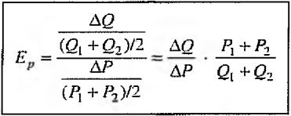

Todos los empresarios saben que, dada una curva de demanda, la cantidad demandada será mayor si baja el precio, mientras que si éste aumenta, la cantidad que los consumidores demandan se reducirá. Sin embargo, una información de mayor interés para ellos es saber cómo se verá afectado ei **ingreso totai** que la empresa obtiene como consecuencia del **cambio en el precio**. El sentido del cambio del ingreso total cuando varía el precio depende de la “sensibilidad” de la cantidad demandada, y esto se expresa mediante el concepto de elasticidad-precio de la demanda.

En general, cuando el **precio** se **reduce**, el ingreso total:
* **Aumenta** si la **demanda** es **elástica** (a bajos cambios de precio hay grandes cambios de la demanda)
* Se **reduce** si la **demanda** es **inelástica** (recien a altos cambios de precio hay bajos cambios en la demanda).
* **No se altera** si la **demanda** es **unitaria** (a cambios de precio hay cambios proporcionales de demanda).

Así, pues, el ingreso total de los vendedores o, lo que es lo mismo, el gasto total de los consumidores se **maximiza** en el punto en que la **demanda** tiene **elasticidad unitaria**.

**Caso companias de vuelos**

Algunos viajarán por razones de **trabajo** y otros lo harán como **turistas**. Centrándonos simplemente en estas dos categorías, las compañías aéreas tratarán de cargar el **máximo precio** posible a los que viajan por **negocios**, que se caracterizarán por ser poco sensibles al precio, esto es, por tener una **elasticidad-precio bastante baja**; en cambio a los turistas, que tienen una **elasticidad-precio elevada**, procurarán fijarles un precio lo suficientemente **bajo** como para que los vuelos lleven el mínimo número de asientos vacíos. Así, pues, la clave está en identificar a los clientes que tienen una elasticidad-precio distinta y fijar precios diferentes para cada tipo de cliente, esto es, seguir una política de **discriminación de precios**.

#### Elasticidad-cruzada de la demanda

Como se desprende de la **función de demanda**, la cantidad demandada de un bien no solo cambia cuando se altera el precio de éste, sino que también depende de variables tales como los **precios** de los **bienes relacionados** y el **ingreso**. 

al analizar los desplazamientos de la curva de demanda, se señaló este hecho y se habló de dos tipos de bienes: **complementarios** y **sustitutivos**. Así, es de esperar que la cantidad demandada de automóviles dependa del precio del combustible, Cuanto más caro sea el combustible, es lógico pensar que la cantidad demandada de automóviles, a un precio dado, se reducirá.

Dada la existencia de la anterior relación, se necesita una medida de la **sensibilidad** de la **cantidad demandada** de un bien ante las **variaciones** de los **precios** de los **bienes relacionados** con éste. Esta medida es la **elasticidad cruzada** de la **demanda**, que se define de la siguiente forma:

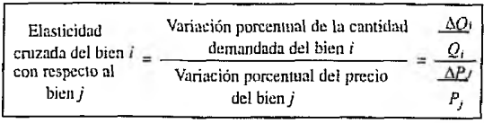

* Dos bienes son **sustitutivos** cuando sus elasticidades cruzadas de la demanda son **positivas**;
* son **complementarios** cuando las elasticidades cruzadas son **negativas**; 
* son **independientes** entre sí cuando sus elasticidades cruzadas son **nulas**

#### Elasticidad-ingreso de la demanda

La **respuesta** de la **demanda** a los **cambias** del **ingreso** se mide por la **elasticidad-ingreso** de la demanda, que se define como el cambio porcentual de la cantidad demandada dividido por el cambio porcentual del ingreso.

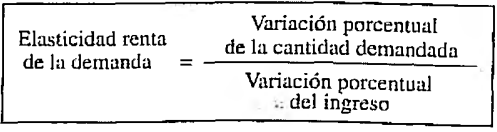

* Un **bien normal** es aquel cuya **elasticidad-ingreso** de la demanda es **positiva**.
  * Un **bien de lujo** tiene una elasticidad-ingreso de la demanda **mayor que 1**.
  * Un **bien necesario**, o no de lujo, tiene una elasticidad-ingreso de la demanda **menor que 1** .
* Un **bien inferior** es aquel cuya **elasticidad-ingreso** de la demanda es **negativa**.

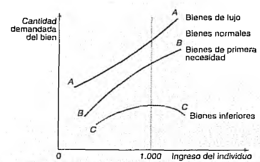

## Mercado

**Oferta** y **demanda** son las fuerzas que, al interactuar, hacen que las economías de mercado o capitalistas funcionen. Esa interacción determina la **cantidad** que se produce de cada bien y servicio, como así también el **precio** al que debe venderse

Un **mercado** es toda institución social en la que cual los bienes y servicios, así como los factores productivos, se intercambian libremente. E1 **mercado** de un producto está formado por todos los **compradores** y **vendedores** de ese producto.

Los compradores y vendedores se ponen de acuerdo sobre el **precio** de un bien o un servicio, de forma tal que se produce un intercambio de cantidades determinadas de dicho bien o servicio por una cantidad de dinero, también determinada.

El **precio absoluto** de un bien es su relación de cambio por **dinero**, esto es, el número de unidades monetarias que se necesitan para obtener a cambio una unidad del bien. El **precio relativo** de un bien es su precio en unidades de **otro bien**.

Los precios **coordinan** las **decisiones** de los **productores** y los **consumidores** en el mercado. Precios **bajos** estimulan el **consumo** y desaniman la producción, mientras que precios **altos** tienden a reducir el consumo y estimulan la **producción**. Los precios actúan como el **mecanismo equilibrador** del mercado.

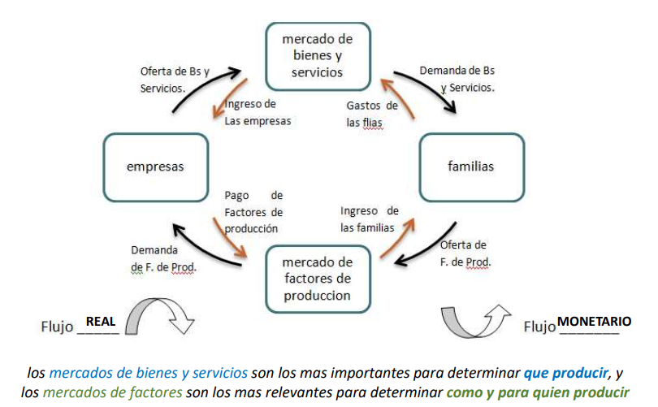

### Tipos de mercado

Al analizar los mercados, se suele establecer la siguiente tipología: 
* **mercados transparentes**: cuando hay un solo punto de equilibrio
* **mercados opacos**: cuando, debido a la existencia de información incompleta entre los agentes, hay más de una situación de equilibrio. 
* **mercados libres**: sometidos al libre juego de las fuerzas de oferta y demanda
* **mercados intervenidos**: cuando agentes extemos como, por ejemplo, las autoridades económicas, fijan los precios.
* **mercado competitivo**: Si existen muchos vendedores y muchos compradores, es muy probable que nadie, por sus propios medios, tenga capacidad para imponer y manipular el precio.
* **competencia imperfecta**: hay muy pocos vendedores o incluso uno solo, existirán grandes posibilidades de que éstos o éste pongan un precio a su conveniencia.

### Equilibrio del mercado

El **precio de equilibrio**, o precio que vacía el mercado, es aquel para el cual la **cantidad demandada** es **igual** a la **ofrecida**. Esta cantidad es la **cantidad de equilibrio**. El equilibrio se encuentra en la **intersección** de las **curvas** de **oferta** y **demanda**. En ese punto no hay ni **escasez** ni **excedente**.

Un exceso de oferta o **excedente** es la situación en la cual la cantidad ofrecida es mayor que la demandada.

Un exceso de demanda o **escasez** es la situación en la cual la cantidad demandada es mayor que la ofrecida

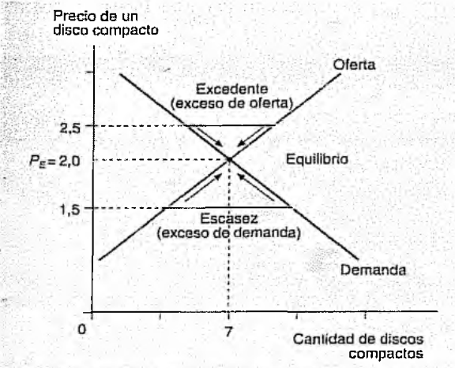

La **ley de la oferta y la demanda** establece que el **precio** de un bien se **ajusta** para **equilibrar** su **oferta** y su **demanda**.

Cuando se alteran los factores que subyacen a las curvas de demanda o de oferta, éstas experimentan **desplazamientos** y tienen lugar cambios en el precio y en la cantidad de equilibrio. 

Conviene, pues, distinguir entre un **aumento** en la **demanda** o en la **oferta**, que tiene lugar cuando se produce un **desplazamiento** de la **curva** de demanda o de oferta, y un **aumento** en la **cantidad** demandada u ofrecida; en este último caso lo que tiene lugar es un movimiento **a lo largo** de la curva de demanda o de oferta.

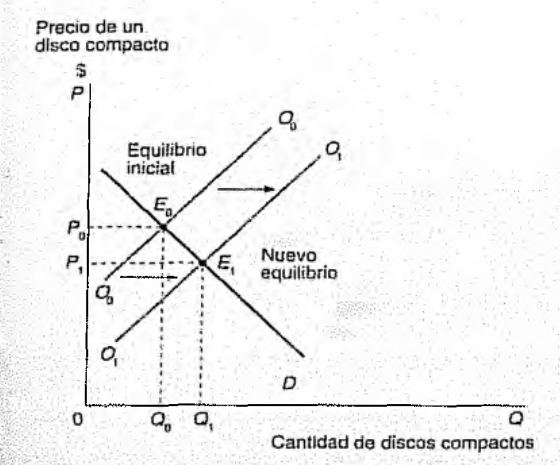

`Nota: En una economía de mercado los recursos se asignan por medio de las decisiones descentralizadas de muchas empresas y hogares conforme interactúan en los mercados de bienes y servicios.`

**Flujo circular del ingreso y la mano invisible**

Si se desea algo y se tiene suficiente dinero, se compra; y si hay un número suficiente de personas que hacen lo mismo, las ventas totales de ese producto aumentarán, y probablemente también su precio. Paralelamente, los productores, al ver que aumentan las ventas y los precios, procurarán incrementar la producción de ese bien y emplearán más recursos (capital y trabajo).

Esta forma de funcionar del sistema de economía de mercado fue denominada por Adam Smith el principio de la “ mano invisible” . En esencia, este principio establece que cada individuo, al actuar egoístamente persiguiendo su propio interés personal, de hecho se comporta como si estuviera guiado por una mano invisible, de modo que se alcanza lo mejor para todos.

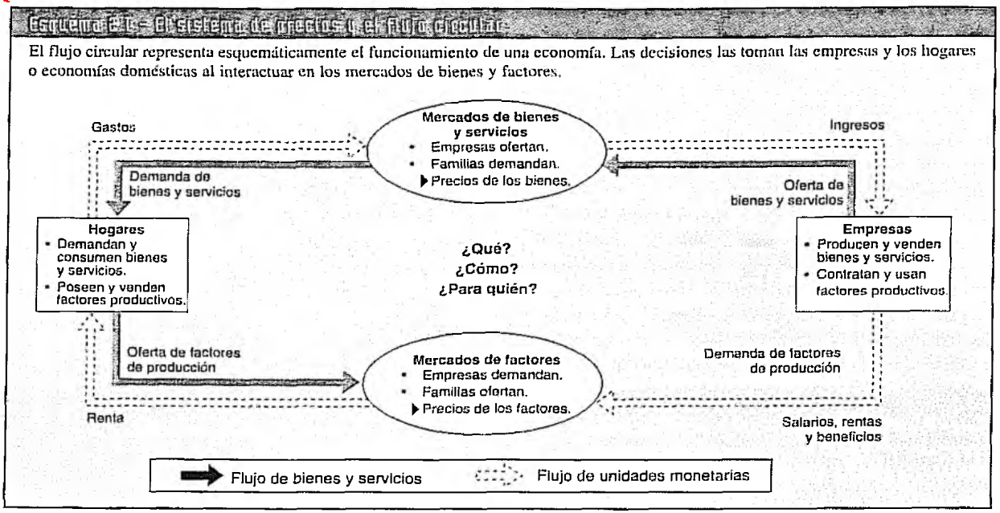

### Politica: los controles de precios

el Gobierno interviene fijando, en unos casos, precios máximos y, en otros, precios mínimos. En ambos casos, lo relevante es que el Gobierno intenta mantener los precios de determinados bienes en unos niveles que no son los de equilibrio.

* Un precio **máximo** es el precio legal más **alto** al que puede venderse un bien.
* Un precio **mínimo** es el precio legal más **bajo** al que puede venderse un bien.

Este tipo de intervenciones gubernamentales genera excesos de demanda o de oferta, ya no transitorios.

Para que un precio **máximo** sea relevante, debe ser **inferior** al precio de equilibrio. Cuando el Gobierno establece un **precio máximo** que supone una **restricción efectiva** en un mercado, aparecerá una **escasez** del bien; por lo tanto, los vendedores deberán racionar el bien escaso entre los compradores.

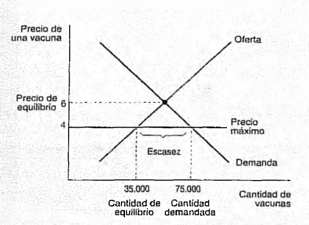

En el caso de precios **minimos**, para que estos sean relevantes deben ser **superiores** al precio de equilibrio (Ej: vuelos low-cost), en estos casos, ya que el precio no se puede reacomodar y bajar hasta el punto de equilibrio, se genera un **excedente** constante.

### Las empresas en mercados de competencia perfecta

cuando tiene lugar una alteración del precio de mercado, los efectos sobre la empresa que decide modificar los precios serán muy distintos según se trate de un mercado competitivo, como el del trigo, o monopolístico, como el del gas domiciliario.

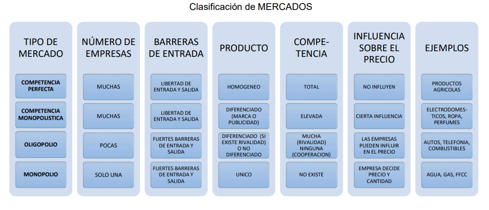

El funcionamiento de este mercado puede esquematizarse como sigue: la **oferta** y la **demanda** **determinan** el **precio de equilibrio** y, a dicho precio, las empresas deciden libremente **qué cantidad producir**. En términos de la siguiente figura, el mercado determina el precio de equilibrio, P E, y cada empresa de las muchas que lo integran acepta dicho precio como un dato fijo sobre el que no puede influir.

A este precio, una empresa concreta puede vender la cantidad que decida, pues individualmente su peso en el conjunto del mercado no es significativo y no influirá en el precio. Por ello, la **curva de demanda** de la empresa individual es **horizontal**. Si decidiera vender su producto a un precio algo superior a P E perdería todos los clientes.

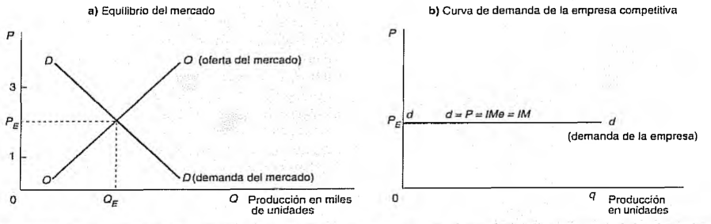

La horizontalidad de la curva de demanda se debe a que la empresa puede vender toda la cantidad que produzca a **precio vigente** en el **mercado**, esto es, a P_E o a un precio más bajo. A un precio algo superior la cantidad demandada será cero, ya que perderá todos los clientes. El precio P_E está **dado** y no se ve afectado** por** la **cantidad vendida** por la **empresa individual**, al ser esta una **parte diminuta** del mercado. 

El **ingreso medio** o unitario es igual al **ingreso total** dividido por el número de **unidades vendidas**. Dada la definición de ingreso total (I_T = P • q), el ingreso medio es el precio del bien, de modo que podemos escribir:

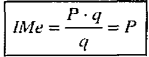

la empresa competitiva no puede influir en el precio, pues se enfrenta a una curva de demanda totalmente horizontal, de forma que el ingreso adicional o **ingreso marginal** derivado de cada unidad adicional vendida es el **precio de mercado**. el precio de mercado no se ve afectado por las variaciones en la producción de la empresa. Para vender unidades adicionales de producto no es preciso bajar el precio, por lo que cada unidad adicional vendida añade al I_T exactamente el valor del precio.

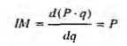

La empresa competitiva **maximiza los beneficios** cuando produce en un nivel en el cual el **ingreso marginal** se iguala al **costo marginal** (Principio de maximización de beneficios), ya que en estos puntos, la distancia entre la curva de ingresos y costos sera maxima.

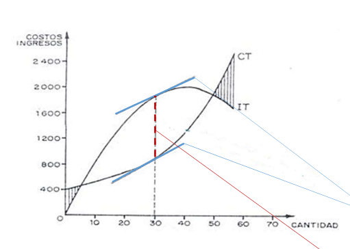

Como en el mercado competitivo el ingreso marginal es igual al precio, la grafica quedaria tal que asi:

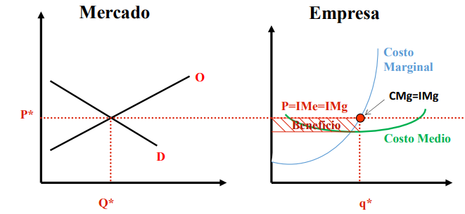

Al ser siempre P = CM_g el punto en el que la empresa maximiza sus beneficios independientemente de las fluctuaciones del mercado, podemos decir que la curva de CM_g es la **curva de oferta** de la empresa. Sin embargo, aunque sigamos esta curva, la empresa todavia podria estar perdiendo dinero.

En consecuencia, para decidir a corto plazo si producir o no, la empresa debe comparar el nivel de producción en que maximiza el beneficio (P = CM), el precio y el costo variable medio (CVMe) Si ei **precio** es **igual o superior** al **costo variable medio** a la empresa le convendrá **producir**; en cambio, si dicho precio es **menor** deberá **cerrar**, ya que mejorará su situación dejando totalmente de producir.

Decir que la condición para producir exige que el precio sea igual o mayor que el costo variable medio equivale a afirmar que a la empresa que incurre en **pérdidas** solo le convendrá producir si éstas son **iguales o menores** que los **costos fijos**. Esta afirmación nos lleva al concepto de costo fijo o irrecuperable, o **costo hundido** (son irrelevantes, pueden dejarse de lado).

si el precio de mercado es P_2, esta línea corta la curva de costo marginal en el punto de nivelación N, en el cual el CT_Me e alcanza su mínimo. Por lo tanto, para el nivel de producción óptimo (aquel para el que P = CM_g), la empresa no obtiene ni beneficios extraordinarios ni pérdidas, ya que justamente cubre los costos totales medios (**beneficio nulo**).

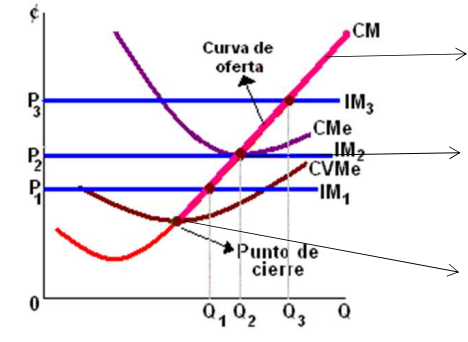

En el **punto de cierre** la empresa cubre estrictamente los **costos variables**; en consecuencia, para cualquier precio superior a P_c le convendrá **producir**, ya que al menos **parcialmente** cubre los **costos fijos**. Pero sí el precio está por **debajo** de este nivel, la empresa no podrá cubrir sus costos variables y se verá obligada a **cerrar** (decisión a **corto plazo** de no producir nada durante un periodo específico).

En el **largo plazo**, la empresa sale del mercado si el ingreso que obtendría de producir es menor que sus costos totales, es decir, si el precio/demanda se encuentra por **encima** del **costo total promedio**.

Notas:

* Solo el innovador obtiene beneficios superiores a los normales (por un tiempo, hasta que actúa la imitación)
* Si alguna empresa decide cobrar un precio superior al determinado por el mercado, no vendería, ya que otraempresa obtendría los favores de los consumidores.
* Cada empresa puede vender tanto o tan poco como lo permitan sus costos, al precio determinado en elmercado

### Las empresas en monopolio

Tal vez no sorprenda a nadie que las empresas eléctricas fijen precios superiores a sus costos marginales, puesto que los clientes no tienen muchas alternativas. En cualquier caso, esto no quiere decir que puedan también determinar la **cantidad** que sus clientes **demandarán**.

Si el precio de la energía eléctrica es muy elevado, los clientes ajustarán lo máximo posible su consumo, procurarán introducir sistemas de ahorro energético e incluso pensarán en recurrir a fuentes de energía alternativas. Así, pues, si los **precios** de la energía son muy **altos**, los clientes **reducirán** la **cantidad demandada**, tal como nos dice la ley de la demanda. Esto sugiere que, si bien los monopolios pueden **controlar los precios**, no pueden obtener el nivel de **beneficios** que **deseen**, pues si sus precios son muy elevados, se reducirá la cantidad que sus clientes les comprarán. Por lo tanto, que los monopolios tengan poder de mercado para fijar los precios no quiere decir que sus beneficios sean ilimitados.

Antes de hablar de monopolios describimos un poco los mercados de **competencia imperfecta**.

En un mercado de **competencia imperfecta** las empresas que lo integran tienen la capacidad de **influir en el precio** de su producto actuando individualmente.

Gráficamente, la **diferencia** básica entre la competencia **imperfecta** y la competencia **perfecta** se observa en la siguiente figura. En el caso de la competencia perfecta, la empresa se enfrenta a una **demanda individual** que es **completamente elástica**, e indica que puede vender todo lo que desee al precio de mercado. En el caso de la empresa no competitiva, la demanda a la que se enfrenta tiene **pendiente negativa** (elasticidad finita), de forma que para poder incrementar sus ventas, tendrá necesariamente que reducir el precio de su producto.

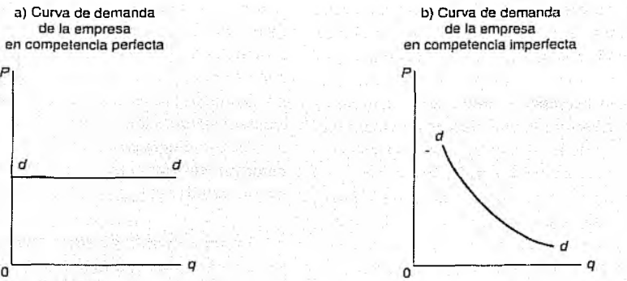

Los distintos tipos de competencias imperfectas son:

* El **monopolio**: es el caso extremo de la competencia imperfecta y se caracteriza por tener un único vendedor que controla la industria.
* El **oligopolio**: este mercado se caracteriza por tener pocos vendedores, de forma que cada empresa puede influir en el precio de mercado y en la conducta de sus competidores.
* La **competencia monopolística**: ocurre cuando un gran número de vendedores produce bienes diferenciados, en el sentido de que sus características importantes varían. Esta estructura de mercado se parece a la competencia perfecta en que hay muchos vendedores, ninguno de los cuales posee una gran cuota de mercado; pero se diferencia de ella en que los productos que ofrecen las distintas empresas no son idénticos.

El caso **extremo** de un mercado imperfectamente competitivo es el **monopolio**, ya que hay un **único oferente** en la industria. De hecho, podemos afirmar que una empresa es un monopolio si es la única que ofrece un producto y si éste **no tiene bienes sustitutivos cercanos**. La causa principal del monopolio son las barreras a la entrada.

Las causas que explican la aparición del monopolio son: 
* **Propiedad exclusiva** de un ciertos **recursos** (poco común)
* **Monopolios Naturales**: La existencia de **costos decrecientes** o **economías de escala**: una sola empresa produce a un costo menor que un gran numero de productores (por ejemplo la distribución de servicios)
* **Regulaciones del gobierno**: concesión a una sola empresa el derecho de fabricar un producto o prestar un servicio. (las patentes, derechos de propiedad intelectual, etc)

El empresario monopolista cumple un papel determinante en el proceso de **fijación del precio** de su mercado, pues tiene capacidad para **decidir su cuantía**. Ello se debe a que la curva de demanda del monopolista es la curva de demanda del mercado. 

**¿cuánto producir y qué precio fijar?**

Todas las empresas que operan en mercados de competencia imperfecta se enfrentan a una **curva de demanda** que tiene **pendiente negativa**; ello supone una diferencia fundamental respecto de la empresa competitiva, la cual se enfrenta a una curva de demanda que es una iínea recta horizontal al nivel del precio de mercado. A **ese precio** la empresa **competitiva** puede vender **todo** lo que **desee**. 

El **monopolista** se puede **mover** a lo largo de su **curva de demanda**. Aunque puede subir el precio de su producto, si lo hace los consumidores comprarán menos. Si opta por reducir la cantidad que produce, el precio de su producto aumentará.

Aquí cabe preguntarse qué punto de su curva de demanda elegirá. La respuesta es aquella cantidad que **maximice su beneficio**, lo cual implica que debemos tener en cuenta los **ingresos** y los **costos** y, mas concretamente, el ingreso **marginal** y el costo **marginal**.

Cuando la empresa se enfrenta a una curva de **demanda** con **inclinación negativa** resulta que **P > IM**

Para explicar intuitivamente este hecho, debe tenerse en cuenta que el ingreso marginal de la empresa monopolista es diferente del ingreso marginal de la empresa competitiva. Cuando un monopolio aumenta la cantidad que vende, origina **dos efectos** sobre el ingreso total (IT = P . Q):

• El **efecto producción**: se vende una cantidad mayor del producto; por lo tanto, Q es mayor.
• El **efecto precio**: al aumentar la cantidad, el precio baja; por lo tanto, P es menor.

En el caso de la empresa competitiva, dado que puede vender todo lo que desee al precio de mercado, **no se produce el efecto precio**. Cuando produce una unidad más, recibe por ella el precio de mercado y no recibe menos por la cantidad que ya vendía. En consecuencia, su ingreso marginal es igual al precio de su bien (IM = P).

Por el contrario, cuando la empresa monopolista **produce una unidad más**, **debe bajar el precio** que cobra por cada una de las unidades que vende, y esta reducción del precio **disminuye el ingreso** generado por las unidades que ya estaba vendiendo. Por esta razón, el **ingreso marginal** del monopolista es **menor** que su **precio** (IM < P).

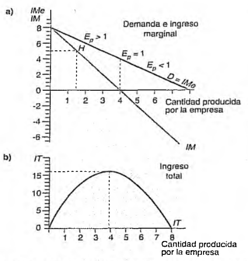

La curva de IM corta el eje de abscisas, esto es, resulta ser igual a cero, en el punto donde el ingreso total es máximo.

**Maximización de beneficios**

La empresa monopolista estará en equilibrio cuando, al **incrementar la producción** en una unidad, la **variación** de los **ingresos** y los **costos** sea **igual** (**IM = CM**).

Volviendo al caso de la compañía que abastece de electricidad a un pueblo en régimen de monopolio, resulta que si la producción de un kilovatio más de electricidad aumenta más el ingreso que el costo, la empresa debe incrementar su producción. Por el contrario, si cuando se reduce la producción disminuyen los costos más que los ingresos, a la empresa le convendrá reducir la producción. En otras palabras, como toda empresa, para determinar su equilibrio la compañía de electricidad compara el **costo marginal** y el **ingreso marginal**.

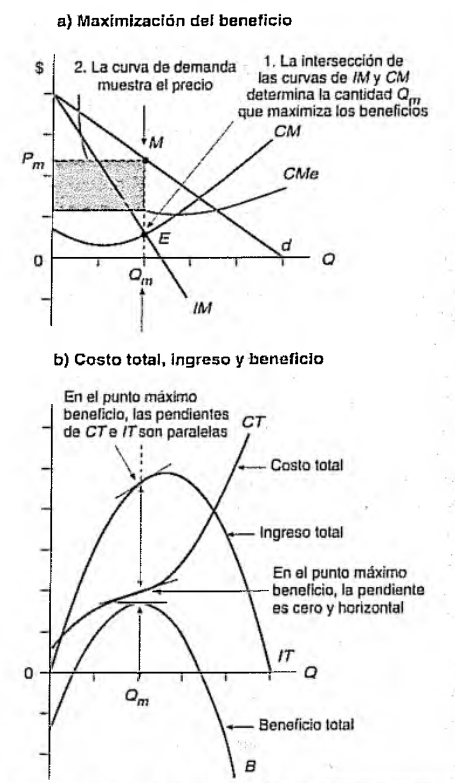

Si bien en lo que se refiere a la regla de maximización de los beneficios las empresas competitivas y monopolistas son iguales, existe una importante diferencia: el ingreso marginal de una empresa competitiva es igual a su precio, mientras que el de la empresa monopolista es menor que su precio. Es decir:

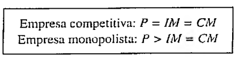

El monopolista, cuando selecciona su nivel de producción de acuerdo con la fórmula IM = CM, puede estar obteniendo tanto **beneficios** como **pérdidas**. Al igual que en el caso de ía empresa competitiva, la regla IM = CM solo nos asegura que si obtenemos beneficios, estos serán **máximos** y, si obtenemos pérdidas, estas serán **mínimas**. Para saber qué ocurre con los resultados económicos, necesitamos conocer la función de **costos totales medios**.

un monopolista solo puede obtener beneficios monopolísticos si, al nivel de producción de equilibrio, la curva de demanda de su producto se encuentra por encima de su curva de costo total medio.

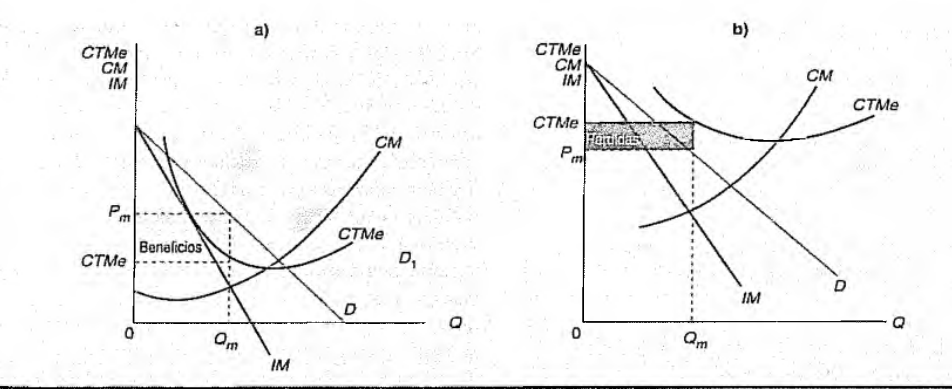

En un mercado monopolizado por un solo productor y, en general, en un mercado que no sea de competencia perfecta, el **precio** será **superior** al **ingreso marginal**; en el **equilibrio** tendremos que **P** es **mayor** que **CM**. Esto indica que el consumidor está forzado a pagar un **precio superior** al que tendría que abonar en competencia perfecta. Pero dado que la **combinación precio-cantidad** de **equilibrio** ha de estar sobre la **función de demanda**, un **mayor precio** supone una **menor cantidad** producida y vendida.

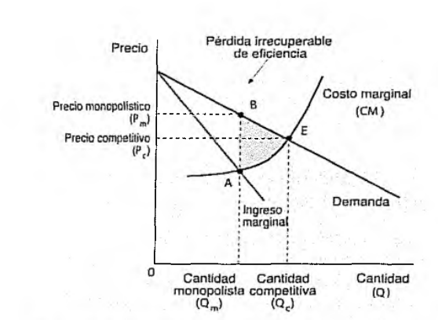

El monopolio, en comparación con la competencia perfecta, **reduce la producción** y **eleva el precio**.

**Discriminación de precios**

El monopolista tratará de **diferenciar** dentro de los potenciales compradores distintos **subgrupos** en función del posible **valor** que puedan darle al bien. De este modo, tratará de venderlo **más caro** a aquellos consumidores que **valoren más** el bien y que por tanto está **dispuesto** a **pagar** un **precio más elevado**. Y por el contrario, venderlo más barato a aquellos otros que lo valoren menos o que tengan menos recursos y que están dispuestos a pagar menos por el bien.

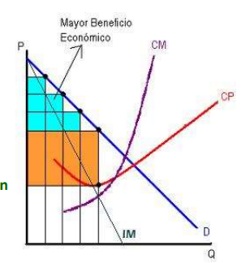

### Indice de lerner

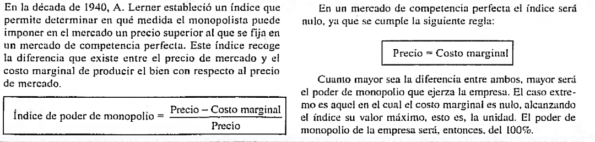

# Macroeconomia

La **macroeconomia** estudia el funcionamiento de la economia en su conjunto, es decir, el **comportamiento global** del sistema economico. Su proposito es obtener una **visión simplificada** de la economia, pero que al mismo tiempo permita conocer y actuar sobre el **nivel** de **actividad economica** de un pais determinado o de un conjunto de paises. 

La macroeconomia se ocupa de los cambios que se producen en las variables globales como la **inflación** la **inversión** nacional, el **desempleo**, el **crecimento**, etc.

Las medidas de **políticas** macroeconómica influyen sobre la marcha de la economía y tienen por objetivo:

* Mantener un **crecimiento sostenible** en el mediano-largo plazo. 
* Conseguir **estabilidad** de **precios**.
* **Bajas tasas** de **desempleo**.
* **Equilibrio** en **cuentas públicas** y en la **balanza de pagos**, etc.

Los economistas **evalúan** el funcionamiento de una economía según el cumplimiento de una serie de **objetivos**: 

* **Actividad economica**.
  * Elevado nivel de producción y consumo
  * Contar con abundante cantidad de bienes y servicios
  *  El indicador más amplio de la producción total de una economía es el **producto interno bruto** (PIB)
* **Nivel de empleo**.
  * variable macroeconómica que más directamente afecte a los individuos
  * la tasa de desempleo, es el porcentaje de la población activa que está desempleada
  * la población activa está formada por todas las personas ocupadas y todos los desempleados que están buscando trabajo
* **Nivel de precios**.
  * Lograr una baja inflación o un nivel general de precios estable es un objetivo macroeconómico clave
  * El **índice** de **precios al consumidor** (IPC) mide el costo de una canasta fija de bienes generalmente adquiridos por el consumidor medio.
  * Las variaciones del nivel de precios se conocen como tasa de inflación
* **Deficit publico**.
  * Diferencia entre los gastos públicos y los ingresos públicos
  * Es un indicador del grado de equilibrio o desequilibrio de la actuación del sector público.
* **Balanza de pagos**.
  * Las relaciones de un país con el resto del mundo se reflejan en la balanza de pagos.
  * Existe un déficit en el saldo de la balanza cuando las importaciones son mayores que las exportaciones
* **Tipo de pago**.
  * Expresa el precio en unidades monetarias nacionales de una unidad de una moneda extranjera
  * la cotización se fija según la oferta y la demanda, pero el Banco Central interviene activamente comprando o vendiendo divisas con el fin de morigerar las fluctuaciones.

## instrumentos de la politica macroeconomica

Un **instrumento** de política económica es una **variable** controlada por las autoridades económicas que puede **influir** en uno o en varios **objetivos**.

### Politica monetaria

Los gobiernos suelen recurrir a la política monetaria para tratar de **estabilizar** la **actividad económica** y evitar, o al menos paliar, los inconvenientes derivados de los ciclos económicos. Para ello **controlan** la **evolución** de la **cantidad de dinero**, el **crédito** y, en general, el funcionamiento del sistema financiero.

Mediante el control de la cantidad de dinero, el Banco Central puede **influir** en las **tasas de interés**, en la **inversión** (y, por lo tanto, en el **PIB**), en el **nivel** general de **precios**, en los **tipos de cambio** (por consiguiente, en las exportaciones netas), en los precios de las acciones y en los precios de las viviendas.

Así, si la economía está experimentando una fuerte **presión alcista** sobre los precios, y se lleva a cabo una **política monetaria restrictiva**, la reducción de la oferta monetaria hará que **suban** las **tasas de interés**, se **reduzca** la **inversión** y **disminuyan el PIB** y la **inflación**.

Por el contrario, si la actividad económica ha entrado en una recesión, el Banco Central puede **aumentar** la **oferta monetaria** y **reducir** las **tasas de interés** para **reactivar**
la **economía**.

La política monetaria, a través del control de la oferta monetaria por parte del Banco Central y su
capacidad de incidir sobre las tasas de interés y las condiciones crediticias, **afecta el gasto** de los sectores de la economía que son **sensibles** a las **tasas de interés**, como la inversión empresarial, el consumo y las exportaciones netas. De esta forma, la política monetaria influye tanto en el **PIB** efectivo como en el potencial, así como en los precios.

### Politica fiscal

La **política fiscal** se refiere a ia **utilización** del **gasto público** y de los **impuestos** para ayudar a determinar la **distribución** de los **recursos** entre los bienes privados y los públicos. Incide sobre los **ingresos** y el **consumo** de los **individuos** y ofrece **incentivos** a la **inversión** y otras decisiones económicas.

La política fiscal se refiere a las decisiones del Gobierno sobre el nivel del gasto público y los impuestos.

El **gasto público** incluye dos tipos de gasto: las **compras del Estado**, esto es, el gasto en bienes y servicios, como, por ejemplo, la construcción de carreteras, la compra de ferrocarriles, el pago a los funcionarios, etc., y las **transferencias del Estado**. Éstas aumentan los ingresos de determinados grupos de individuos, como los jubilados o los desocupados. Al determinar
la cuantía y composición del gasto público, se determinan las dimensiones relativas del sector público y del sector privado, esto es, qué parte del PIB se consume colectivamente y no en forma privada. El gasto público es uno de los componentes que integran el nivel global de gasto de la economía y uno de los determinantes del nivel del PIB.

Los **impuestos** constituyen el otro instrumento de la política fiscal e inciden en la economía de dos formas. En primer lugar, **reduciendo** los **ingresos** de los **individuos**, lo que influye tanto en la cantidad que estos gastan en bienes y servicios como en la cantidad de ahorro privado. De esta forma, los impuestos, al condicionar el consumo y el ahorro privados, influyen en la producción y en la inversión tanto a corto como a largo plazo.

En segundo lugar, los impuestos inciden sobre los **precios** de los **bienes** y de los **factores** de producción y, por lo tanto, afectan los incentivos y ia conducta de los individuos.

La política fiscal, debido a su impacto sobre el ahorro, la inversión y los incentivos para trabajar, suele utilizarse para **incidir** en el **crecimiento económico**.

### Politica comercial-cambiaria

Las autoridades económicas se ocupan del **sector exterior** mediante la **política comercial** y la gestión financiera internacional. La política comercial, a través de los **aranceles**, **cuotas** y otros mecanismos, trata de **estimular** las **exportaciones** netas. 

En la gestión financiera internacional, una variable clave es el **tipo de cambio**. Generalmente, los países adoptan, como parte de su política monetaria, diferentes sistemas para regular sus
mercados de divisas. Las políticas de tipos de cambio son muy distintas:
* algunos países optan por dejar que los tipos de cambio se determinen libremente por la oferta y la demanda en el mercado de divisas, como sucede con los integrantes de la Unión Monetaria Europea (UME)
* Mientras que otros establecen un tipo de cambio fijo frente a otras monedas, como ocurrió en la Argentina durante el régimen de convertibilidad.

### Politicas de oferta

Los responsables de ta política económica también se preocupan por las condiciones de **oferta** de la economía. Este tipo de iniciativas se integran en lo que se denomina
**políticas de oferta**. Su objetivo es propiciar los **incentivos** al **trabajo** y a la **producción**, así como ia incorporación de **mejoras tecnológicas** que eleven la eficiencia y la productividad del trabajo.

Los resultados de las políticas de oferta se concretan en reducciones de la tasa de desempleo, disminuciones de los precios y aumentos en la productividad media del trabajo y en el PIB potencial.

## Modelo de oferta y demanda agregada

En cualquier economía, la **producción**, el **empleo**, los **precios** y el **crecimiento económico** pueden experimentar grandes **oscilaciones** debido a la influencia tanto de
la **política económica** como de las **perturbaciones externas**. Desde una perspectiva macroeconómica, cabe preguntarse por los mecanismos que explican estas fluctuaciones. Así, resulta interesante conocer cómo los **cambios** en la **cantidad de dinero**, en los **impuestos** o
en los **precios** de las materias primas se transmiten a la **producción** y a los precios al por menor. También es importante saber qué **medidas** pueden tomar ios gobiernos para **mejorar** los resultados de la economía.

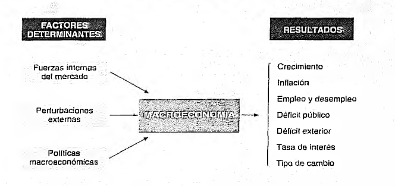

La actividad económica global viene definida por una serie de variables que determinan el nivel de precios, ei nivel de producción y el empleo. Estas variables se pueden agrupar en dos grandes categorías: unas que afectan la demanda agregada y otras que inciden sobre la oferta agregada.

### Demanda agregada

Hay dos tipos de variables que inciden en la demanda agregada: unas lo hacen **directamente**, las **variables no financieras** como el **consumo**, la **inversión**, el **gasto público** y las **exportaciones netas**, y otras, **indirectamente**, las **variables financieras** como el dinero y otros activos financieros;

por ejemplo, alteraciones en la cantidad de dinero incidirán en la tasa de interés y, consecuentemente, en el deseo de gasto de los individuos.

Los **componentes** de la demanda agregada incluyen los **bienes de consumo** que compran los consumidores (tales como los alimentos, la ropa, los automóviles), los **bienes de capital** (como las fábricas, el equipo y 1a maquinaria que compran las empresas), los **bienes** que **compra el Estado** (como los trenes, las computadoras y los muebles) y las exportaciones netas (esto es, las exportaciones menos las importaciones).

La **demanda agregada** se refiere a la **cantidad total** que están dispuestos a **gastar** los diferentes sectores de la economía durante un período de tiempo. Los componentes de ia demanda agregada son el **consumo** (C), la **inversión** (I), el **gasto público** (G) y las **exportaciones netas** (NX).

La curva de demanda agregada muestra la relación entre el nivel general de precios y el gasto agregado de la economía.

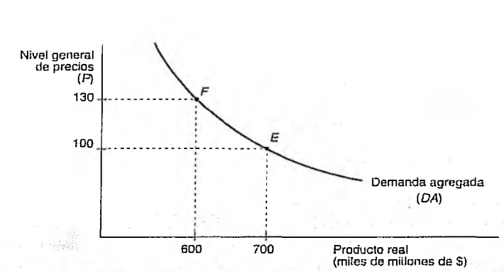

### Oferta agregada

La oferta agregada está relacionada con factores tales como los márgenes de beneficios y los costos de producción, la utilización de la capacidad productiva, la cantidad y calidad de los factores productivos empleados, la productividad y la tecnología

Es la cantidad total de bienes y servicios que las empresas de un país están dispuestas a producir y vender en un determinado período, dados los precios, la capacidad productiva, los costos y las condiciones del mercado.

Viene determinado por: 
* El Producto Bruto Interno a precio de mercado (PBIpm)
* Importaciones (M)

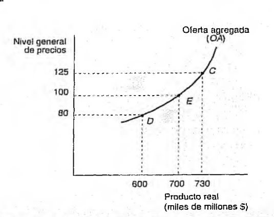

### Equilibrio macroeconomico

En términos gráficos, el equilibrio macroeconómico, esto es, el **PIB real** y el **nivel general de precios** que **satisfacen** a los **demandantes** y a los **vendedores**, se encuentra en el punto de **intersección** de las curvas de oferta y demanda agregadas. En este punto se alcanza un nivel general de precios en el que las empresas están dispuestas a producir y a vender lo que los consumidores y otros demandantes están dispuestos a comprar. 

El **equilibrio macroeconómico** es aquella **combinación** del **PIB real** y del **nivel general de precios** que es coherente con los costos unitarios de las empresas, y el gasto y la producción están en equilibrio.

## Medición de la actividad economica

La **CONTABILIDAD NACIONAL** mide la **actividad** de una **economía** a lo largo de un periodo, generalmente un año, registrando las transacciones realizadas entre los diferentes agentes que forman parte de dicha economía.

### PBI

El indicador más amplio de la producción total de una economía es el **PRODUCTO INTERNO BRUTO** (PIB), que mide el **valor de mercado** de todos los **bienes** y **servicios finales** que **produce el país** durante un **período dado de tiempo**, generalmente un año.

El PIB puede expresarse en términos reales o nominales: 
- el PIB **nominal** se mide a **precios corrientes** de mercado
- el PIB **real** se calcula a **precios constantes**. Es un índice de la cantidad de bienes y servicios producidos

El **PIB per CÁPITA**: Valor del PBI Real, dividido por la población del país.

El PBI puede ser **calculado** mediante: 
* El **método del Gasto**, el cual consiste en **sumar** todas las demandas (**gastos**) finales de **bienes** y servicios realizados por cada tipo de usuario final en un periodo dado (gasto de consumo público y privado + inversión interna + las exportaciones –importaciones) 
* El método del **Ingreso**, el cual consiste en sumar todos los **ingresos** que contribuyen al proceso productivo, es decir, la suma del costo de los factores adquiridos por todas las empresas (sueldos y salarios, comisiones, alquileres, derechos de autor, honorarios, intereses, utilidades, etc.=Ingresos de las familias) 
* El método del **valor Agregado**, el cual consiste en la suma de los **valores añadidos** en cada **etapa** del **proceso productivo**, utilizando los valores de mercado de los productos e insumos

### Impuestos

Impuesto indirecto: es el impuesto que grava el consumo. No afecta de manera directa los ingresos de un contribuyente, sino que recae sobre el costo de algún producto o mercancía. Ej: IVA

Impuesto directo: es el impuesto que grava directamente las fuentes de riqueza, la propiedad o la renta. Ej.: Impuesto sobre el patrimonio, Impuesto sobre la renta.

### Producto interno y nacional

**PRODUCTO INTERNO**: Es el producto de la actividad que se desarrolla dentro de un país, sin importar si los individuos o empresas que lo hacen son del país o foráneos.

**INGRESO INTERNO**: Es la retribución por los factores de producción que se utilizan dentro de las fronteras de un país, sin importar si los individuos o empresas que lo hacen son del país o foráneos.

**PRODUCTO NACIONAL** : Es el producto de la actividad que desarrollan habitantes de un país, ya sea que residan en el mismo o fuera de las fronteras.

**INGRESO NACIONAL** : Es la retribución por los factores de producción que reciben los residentes de un país , ya sea que residan en el mismo o fuera de las fronteras.

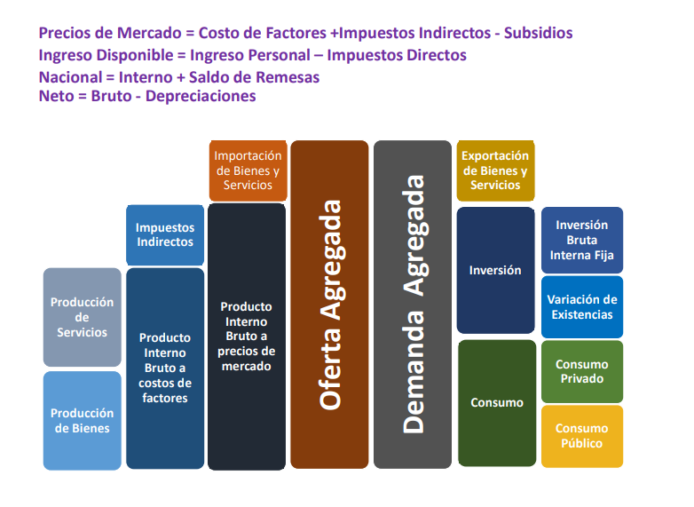

### Nivel de actividad

El nivel de actividad o volumen de producción es el grado de uso de la capacidad de producción. Se la suele medir como un porcentaje de uso de dicha capacidad. También se usan magnitudes absolutas, como unidades producidas, horas de servicio insumidas, cantidad de servicios realizados, etc.

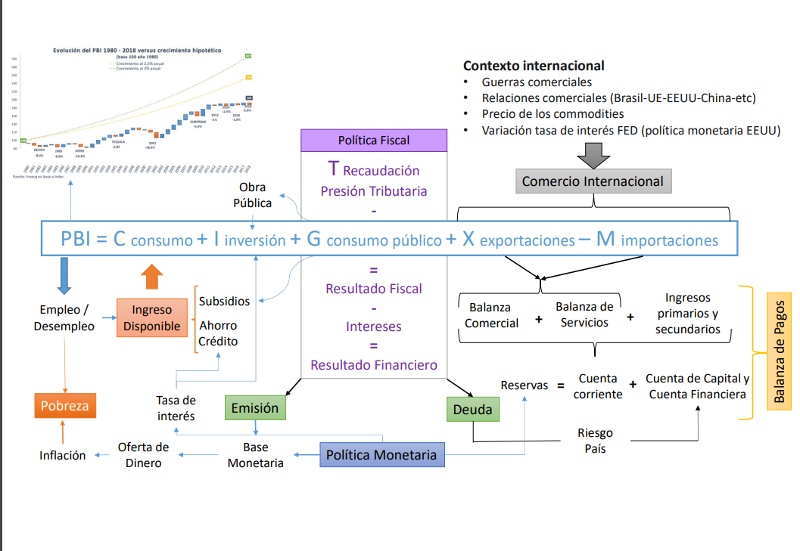

### Nivel de empleo

**POBLACIÓN OCUPADA**: conjunto de personas que tiene por lo menos una ocupación, es decir que en la semana de referencia ha trabajado como mínimo una hora (en una actividad económica).

**POBLACIÓN DESOCUPADA**: se refiere a personas que, no teniendo ocupación, están buscando activamente trabajo. Corresponde a la desocupación abierta. Este concepto no incluye otras formas de precariedad laboral tales como personas que realizan trabajos transitorios

**POBLACIÓN SUBOCUPADA**: se refiere a la subocupación por insuficiencia de horas, visible u horaria y comprende a los ocupados que trabajan menos de 35 horas semanales por causas involuntarias y están dispuestos a trabajar más horas.

**POBLACIÓN SOBREOCUPADA**: población ocupada que trabaja más de 45 horas semanales. 

**POBLACIÓN ECONÓMICAMENTE ACTIVA** (PEA): la integran las personas que tienen una ocupación o que sin tenerla la están buscando activamente. Está compuesta por la población ocupada más la población desocupada.

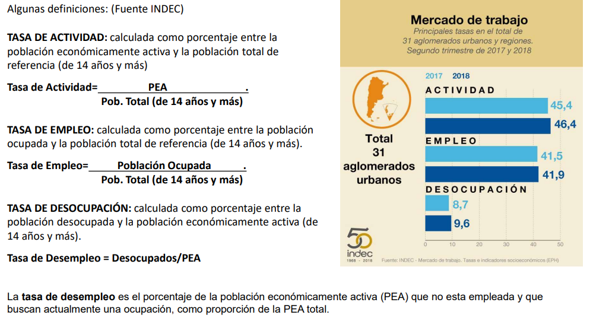

### IPC

Los índices de precios al consumidor miden la **variación** de **precios** de los **bienes** y **servicios** representativos del gasto de **consumo** de los **hogares** residentes en la zona seleccionada en comparación con los precios vigentes en el año base.

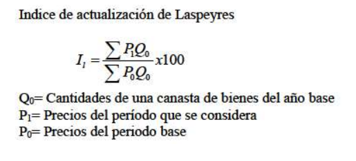

La **inflación**, medida por el IPC, es la tasa de variación porcentual que experimenta este índice en el periodo de tiempo considerado.

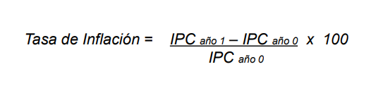

### Curva de phillips

Muestra la existencia de una **relación inversa** entre la **tasa de crecimiento** de los **salarios nominales** y la **tasa de desempleo** en el sentido de que cuanto mayor es una (la tasa de crecimiento de los salarios), menor es la otra (la tasa de desempleo).

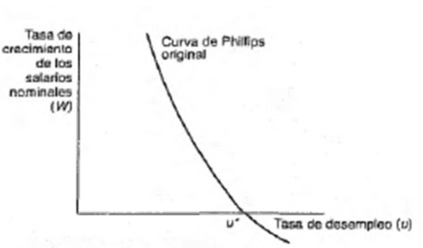

La versión convencional de la curva de Phillips muestra la relación existente entre la **tasa de inflación** y la **tasa de desempleo**, dada la estrecha relación existente entre el crecimiento de los salarios nominales y de los precios (reducciones en la tasa de desempleo se logran a costa de aumentos en la tasa de inflación, y que una disminución en las tensiones alcistas de los precios implicara un agravamiento del desempleo)

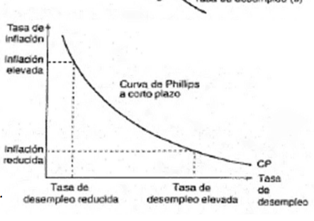

## Teoria de Keynes

Para explicar la teoria de keynes, el modelo de cruz keynesiana o el modelo del multiplicador, primero detallamos la funcion de consumo y la funcion de ahorro.

Para don keynes, las personas al comportarse como consumidores normales dedican una parte de sus ingresos al consumo de productos diaros, y otra parte la dedican al ahorro. Es decir, existe una relación entre el ingreso de un individuo y su consumo, misma relación que se puede expresar en la **función de consumo**:

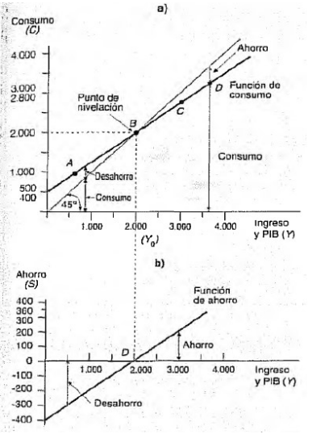

Como se puede ver en el grafico, si nuestra función de consumo se encuentra en la recta a 45° del grafico, se puede decir que el individuo para esa cantidad de ingresos dados no ahorra nada, ya que consume la misma cantidad de dinero (punto de nivelación). Cuando la función se situa en un punto menor a la recta de 45°, se dice que el individuo ahorra una cantidad de dinero igual a la diferencia entre la función de consumo y la recta de 45°. En cambio, si la función se encuentra por encima de esta recta, el individuo desahorra ya que consume mas de lo le recibe de ingresos.

La **función de ahorro** surge de la función de consumo y es nada mas ni nada menos que la diferencia entre la función de consumo y la recta de 45°, es decir:

Ingreso = Consumo + Ahorro

Despejando:

Ahorro = Ingreso - Consumo

LA **PROPENSIÓN MARGINAL A CONSUMIR** (PMC) es la cantidad adicional que consumen los individuos cuando reciben un peso adicional de ingreso disponible (pendiente de la función de consumo).

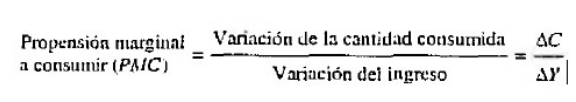

Una de las hipótesis keynesianas básicas sostiene que un aumento en el ingreso genera un aumento -aunque menoren el consumo; esto es, que la PMC es siempre positiva y menor que la unidad (0 < PMC < 1). 

LA **PROPENSIÓN MEDIA A CONSUMIR** (PMeC), se define para cada nivel determinado del ingreso, como la relación entre el consumo total y el ingreso total.

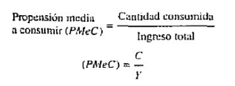

**PROPENSION MARGINAL A AHORRAR**(PMS) se mide por el cociente entre la variación correspondiente del ahorro y la variación del ingreso. Analíticamente:

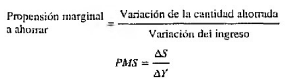

**PROPENSION MEDIA AL AHORRO** (PMES) se mide como el resultado de dividir al ahorro total por el ingreso total, para un nivel de ingreso dado. Analíticamente:

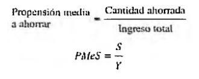

Dado que en el modelo simplificado que estamos analizando, el ingreso se consume o se ahorra, por lo tanto, la suma de las propensiones medias a consumir y a ahorrar tiene que ser igual a la unidad y otro tanto ocurre con las propensiones marginales

### El modelo del multiplicador

Los supuestos básicos del modelo del multiplicador son dos: los precios y los salarios son fijos y hay recursos desempleados (predominación de la demanda agregada). 

Este modelo sostiene que ante un **aumento** de la **demanda** de bienes y servicios se decide **incrementar la inversión**, El incremente de inversión hará que las empresas **aumenten la producción** y el empleo, El aumento del empleo lleva a que las **economías domesticas** dispongan de un **ingreso mayor**, Ese ingreso mayor les permite, a su vez, **incrementar la demanda** de consumo.

En respuesta a este incremento de la demanda, las empresas volverán a aumentar la
producción, de forma que se pone en marcha un proceso que determina que el **aumento de la producción** sea **superior** al **incremento inicial** de la **demanda**. El problema entonces es saber cuanto aumentará la producción ante un aumento en la inversión

El multiplicador es el número por el cual debe multiplicarse la variación de la inversión para averiguar el cambio resultante de la producción total.

Quienes reciban el dinero de la inversión original, si se comportan como consumidores típicos, su gasto será el resultado de multiplicar el dinero recibido por la PMC. Éste gasto recae en otros individuos que a su vez también gastaran de dicho dinero, un porcentaje igual a la PMC. Así, el dinero gastado originalmente en inversión pone en marcha toda una cadena de gasto de consumo secundario, que, si bien es interminable, es decreciente y acaba generando una cantidad finita de gasto.

Variación de la producción = multiplicador (K) x Variación de la inversión

Podemos expresar el multiplicador como el cociente entre la variación del ingreso o producto de equilibrio y la variación de la inversión que motiva la alteración del ingreso

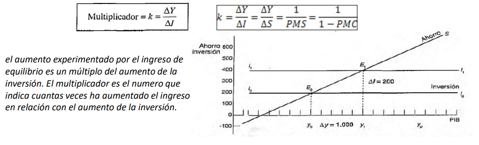

## Flujo circular del ingreso

EL FLUJO CIRCULAR DEL INGRESO es la corriente de bienes y servicios y de pagos entre las empresas, las economías domesticas, el sector publico y el resto del mundo.

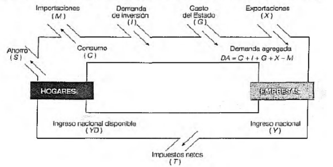

**entrada** es una **adición** al ingreso de las empresas que no proviene del gasto de los consumidores (la inversión de las empresas, los gastos del sector publico y la demanda de exportaciones realizada por otros países).

**salida** es todo ingreso que no se reintegra al flujo circular (el ahorro, los impuestos establecidos por el sector publico y las importaciones de bienes y servicios)

Desde un punto de vista contable, las **entradas** son **iguales** a las **salidas** y, lo detraído del flujo del ingreso debe ser, por definición, igual a lo que se ha incorporado.

Sin embargo, desde un punto de vista económico, pueden originarse **alteraciones** en el flujo circular debido a **cambios** en las entradas y en las salidas. Las salidas tienden a reducir el flujo circular y las entradas a aumentarlo

Equilibrios:

Sector Privado: I=S
Sector Externo: X=M
Sector Público: G=T-S

## Politica fiscal

La POLÍTICA FISCAL se refiere a las **decisiones** del Gobierno sobre el nivel de **gasto publico** y los **impuestos**.

Incide sobre los **ingresos** y el **consumo** de los individuos y ofrece **incentivos** a la **inversión** y otras decisiones económicas.

El **gasto publico**, incluye **compras** de bienes y servicios por parte del **Estado** (construcciones de infraestructurapublica, compra de bienes publicos, etc) **o Transferencias** del Estado (subsidios, jubilaciones, etc). El gasto público también está dirigido a **reducir** el margen de **desigualdad** en la distribución del ingreso.

Mediante los **impuestos**, reduce los ingresos e **influye** en el **gasto privado** y en el **ahorro Privado**. A su vez, al incidir sobre los precios de los bienes y de los factores de producción, influyen sobre los incentivos que las personas tienen para trabajar.

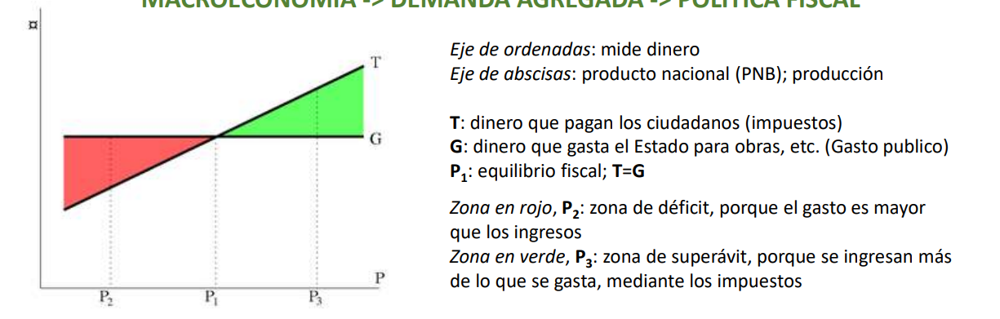

El **Resultado Fiscal Primario** (sea Déficit o Superávit) toma en cuenta específicamente los ingresos y gastos propios del Estado. Es decir, no tiene en cuenta el pago de intereses generados por la deuda contraída. La utilidad de calcular el Resultado Fiscal Primario reside en que recoge los pagos y cobros sobre los que el Gobierno tiene control.

Cuando se tiene en cuenta el pago de intereses generados por la deuda contraída, hablamos de **Resultado Fiscal Total o Resultado Financiero**.

El déficit fiscal se mide en relación al PIB propio de cada país.

### Medidas de política fiscal

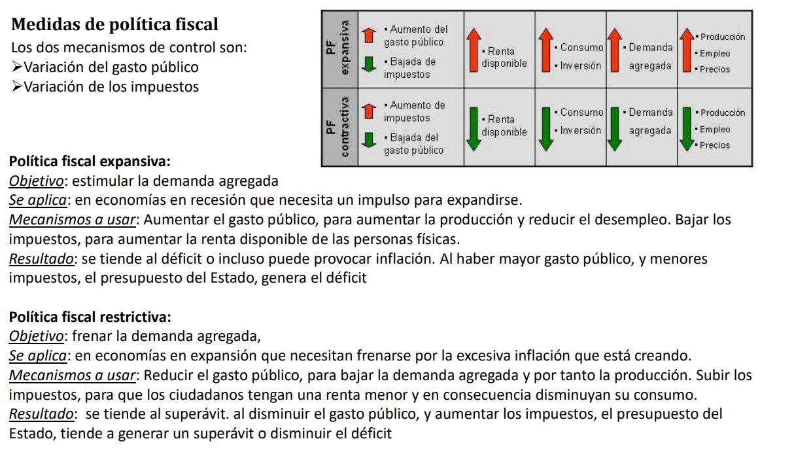

## Intermediarios financieros

El dinero bancario y muchos otros servicios financieros son suministrados por los **intermediarios financieros**, esto es, **instituciones** como los bancos comerciales que **aceptan** depósitos o **fondos** de los hogares y las empresas que los han ahorrado y se los **prestan** a otros hogares y a otras empresas.

Los intermediarios financieros transfieren fondos de los prestamistas a los prestatarios y, de esta forma, crean acdvos financieros, como las cuentas comentes (depósitos a la vista), esto es, el dinero bancario.

Los **bancos comerciales** son instituciones financieras que tienen autorización para aceptar depósitos y para conceder créditos. Sus **reservas** son activos disponibles inmediatamente para satisfacer los derechos de los depositantes. El **coeficiente de caja** o de reservas es el cociente entre las **reservas** y los **depósitos**

Las **reservas** son **activos** que poseen los bancos en forma de **efectivo** o de fondos depositados en el **Banco Central**. Los bancos mantienen algunas reservas para hacer frente a las **necesidades financieras diarias**, pero la mayor parte de ellas tiene por objeto cumplir los requisitos legales.

Si los bancos, como cualquier otra empresa, persiguen la obtención de **beneficios**, tratarán de prestar los fondos que reciben de forma tal que la diferencia entre los ingresos que obtienen y los costos en que incurren sea la mayor posible.

Los **ingresos** los obtendrán básicamente de los activos rentables, esto es, de los **intereses** que cobran por los **créditos** y **préstamos** concedidos y por los valores mobiliarios que poseen.

Los **costos** de los bancos se derivan, sobre todo, de los **intereses** pagados por los **fondos recibidos**, es decir, depósitos de clientes y préstamos del Banco Central, y de los **gastos de intermediación** (amortizaciones, sueldos, salarios y demás costos de gestión). La diferencia entre los ingresos y los costos da lugar a los beneficios.

La **tasa activa** es la que te **cobra** el banco por el dinero que te presta el intermediario financiero

La **tasa pasiva** es la que te **paga** el banco por tus depósitos el intermediario financiero

**Spread** = **tasa activa** – **tasa pasiva** (es diferencia entre el precio de compra y el de venta de un activo financiero)

**Banco Central de la República Argentina**: es el **organismo rector del sistema financiero** de la República Argentina, encargado de la **política monetaria** del país.

E1 banco central de un país es la institución encargada de supervisar el sistema bancario y de regular la cantidad de dinero que hay en la economía

## Politica monetaria

LA POLITICA MONETARIA, es el proceso por el cuál la autoridad monetaria de un país **controla** la evolución de la **cantidad de dinero**, el crédito y, en general, el **funcionamiento del sistema financiero**.

A través del control de la oferta monetaria por parte del Banco Central y su capacidad de incidir sobre las **tasas de interés** y las condiciones crediticias, **afecta el gasto** de los sectores de la economía que son sensibles a las tasas de interés, como la **inversión empresarial**, el **consumo** y las **exportaciones netas**.

De esta forma, la política monetaria influye tanto en el **PIB**, así como en los **precios**.

El objetivo fundamental de cualquier banco central es **mantener** la **estabilidad de los precios** y del **tipo de cambio**.

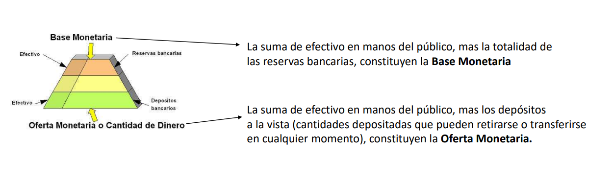

### Multiplicador monetario

El efecto multiplicador del dinero, es un proceso por el cual los bancos multiplican el dinero partiendo de una
cantidad dada. Esto se debe que los bancos solo están obligados a mantener en sus reservas un nivel mínimo de dinero, el coeficiente de caja, determinado por cada Banco Central.

Por ejemplo: Juan realiza un depósito en un banco de 1000$, si el coeficiente de caja es 10 por ciento. El Banco podrá prestar 900$ de esedinero a María. Si María toma los 900$ y los deposita otra vez en el banco, el banco guarda un 10% de los 900$ depositados y presta los 810$ restantes a Fulano, así sucesivamente en una serie infinita decreciente.

``NOTA: Esto no lo entendi:``

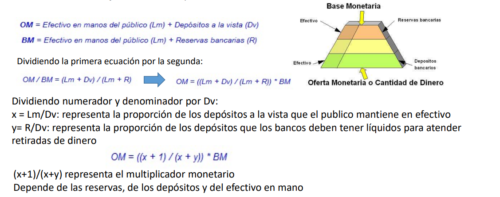

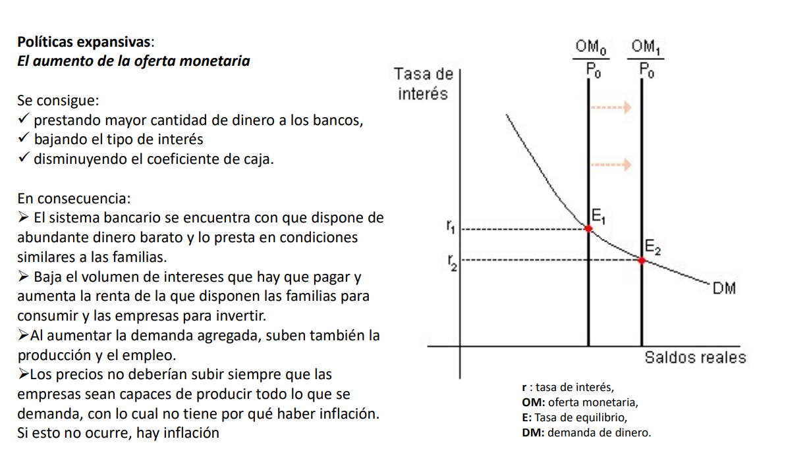

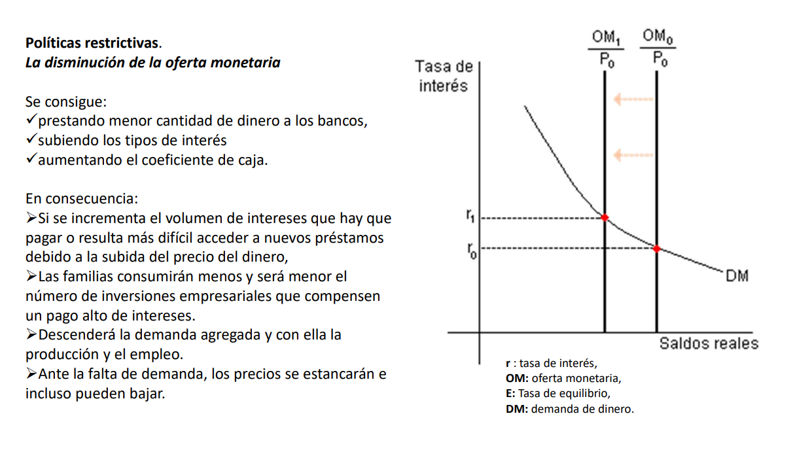

## Comercio internacional

El COMERCIO INTERNACIONAL consiste en el **intercambio de bienes**, **servicios** y **capitales** entre los diferentes países.

Razones por las cuales los países participan en el comercio internacional: 
* Diferencias en las dotaciones de recursos productivos. 
* Distintas capacidades tecnológicas, 
* Ventajas comparativas en los costos de producción. 
* Diferencias en los gustos o preferencias de los consumidores.

Los países tienden a **especializarse** en la **producción** y **exportación** de aquellas mercancías para las que poseen **mayores ventajas comparativas**, es decir, cuando puede producirlo con menor costo de oportunidad que otros países

Cuando cada país se especializa en la producción de aquellos bienes en los que tiene ventaja comparativa, todos se ven beneficiados. Gracias al comercio internacional, el intercambio de bienes entre países permite que la economía mundial produzca y consuma mayor cantidad de bienes utilizando la misma cantidad de recursos.

Las distintas formas en que se **relacionan** los **países** pueden sintetizarse en dos categorías:

* **Globalizadora**, que pretende abarcar a todos las países y fomentar el libre comercio internacional. Ej: el Acuerdo General de Tarifas y Comercio (GATT, por su sigla en ingles) y la Organización Mundial del Comercio (OMC).

* **Regional**, que frecuentemente incluye iniciativas propias del bilateralismo comercial. Ej: Uniones aduaneras (arancel externo comun), áreas de libre comercio (arancel propio ante terceros), Unión económica (Unión monetaria)

Los **instrumentos de protección** están formados por el conjunto de **políticas**, **medidas** y
**procedimientos** que adoptan los gobiernos con el fin de **obstaculizar** las **transacciones** económicas con el **extranjero**. Razones que justifican el proteccionismo:

* Fomentar las **industrias** relacionadas con la **defensa nacional** y la industrialización del pais sustituyendo las importaciones por productos nacionales.
* **Desarrollar** las **industrias nacientes**.
* Combatir el déficit del sector externo

Las intervenciones sobre el comercio internacional, integran la denominada **política comercial**, la cual influye sobre el comercio internacional mediante: 

* **aranceles** o cuotas a la **importación**, 
* **barreras no arancelarias** 
* **subvenciones** a la **exportación**.

### La balanza de pagos

es el **registro** sistemático de las **transacciones** económicas realizadas durante un tiempo determinado **entre** los residentes de un **país** y los del **resto del mundo**.

Se contabiliza:
* los **ingresos** (entradas de moneda extranjera) 
* los **pagos** (salidas de moneda extranjera).

El saldo viene dado por la diferencia entre los ingresos y los pagos.

Las **RESERVAS** son las **posesiones** que un país tiene de **divisas** y otros **activos** que pueden utilizarse para satisfacer las demandas de divisas y que sitúan al país como **acreedor** frente al exterior, ya que estas representan activos frente al resto del mundo.

La balanza de pagos resume las transacciones entre residentes en una economía y no residentes (resto del mundo) durante un período determinado. Comprende la cuenta corriente (bienes y servicios, ingreso primario e ingreso secundario), la cuenta de capital y la cuenta financiera. 

* La **cuenta corriente** muestra los flujos de bienes, servicios, ingreso primario e ingreso secundario entre residentes y no residentes. 
* En la cuenta de capital se asientan las compras y ventas de activos y pasivos, como acciones, bonos y tierras. 
* En la balanza financiera se recoge la compra y venta de activos y pasivos financieros por los residentes de un país al resto del mundo

El Banco Central reduce sus reservas de divisas cuando la balanza de pagos tiene un déficit y las incrementa cuando esta presenta un superávit. Es decir, el análisis de las reservas del Banco Central permite determinar la situación de déficit o superávit de la balanza de pagos globalmente considerada. De hecho, la variación neta de reservas es el saldo de la balanza de pagos.

## Crecimiento economico y desarrollo

El **crecimiento económico** supone la **expansión** del **PIB** potencial de un país, lo que en términos de la frontera de posibilidades de producción equivale a un desplazamiento hacia **fuera**.

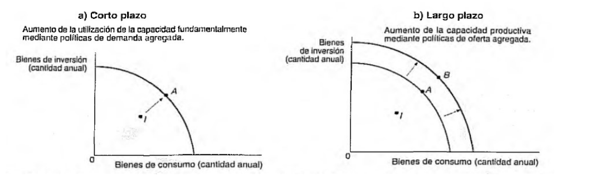

Las fuentes de crecimiento económico son los factores que explican el crecimiento de la producción de un país y se concretan en el **aumento** de la **disponibilidad** y la calidad del **trabajo**, el **aumento** de la dotación de **capital físico** y la **mejora** de la **tecnología**.

Los conceptos de desarrollo y subdesarrollo económicos, hacen alusión a la brecha real que separa los niveles de vida que se alcanzan en unos y otros países, y a los procesos que llevan a elevar el nivel de vida. Se puede medir mediante un conjunto amplio de indicadores: nivel de ingresos por habitante, índices de analfabetismo, estructura sanitaria, estructura productiva y tecnológica, tasas de desempleo, distribución interna del ingreso, etc

## Nueva economia

La Economía del Conocimiento son aquellas actividades productivas que se caracterizan por el uso intensivo de tecnología y que requieren capital humano altamente calificado. Algunas de las actividades que incluye: Software, servicios informáticos y digitales.

Estas actividades son las más dinámicas que tienen el potencial de aumentar transversalmente la productividad, la cantidad y calidad de empleo y las exportaciones.

# Economia de empresas

## Contabilidad general

Una **empresa**: Se puede definir como un conjunto de **factores** de **producción coordinados**, cuya función es **producir bienes y servicios**. Objetivo: **maximizar su beneficio**.

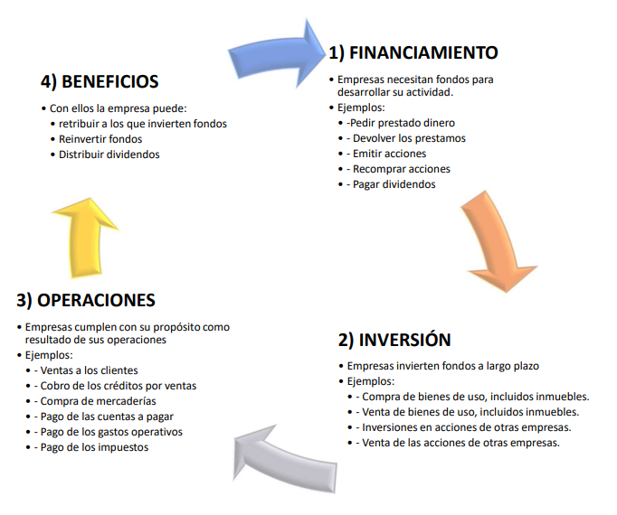

Una **sociedad comercial** existe cuando dos o más personas en forma organizada, conforme a uno de los tiposprevistos en la ley, se obligan a realizar aportes para aplicarlos a la producción o intercambio de bienes o servicios,participando de los beneficios y soportando las pérdidas (SA, SRL, etc.)

**Contabilidad**: proceso de **identificar**, **medir**, **registrar**, **comunicar** los **eventos económicos** de una organización para usuarios interesados en la información.

la **contabilidad financiera** se enfoca en el suministro de información a agentes externos, tales como **inversionistas**, instituciones **gubernamentales**, **bancos** y proveedores. Mide y registra las transacciones del negocio para proporcionar **estados financieros** elaborados con base en los principios de contabilidad generalmente aceptados y/o normas de información financiera (nif).

La **contabilidad administrativa** mide, analiza y reporta información financiera y no financiera para ayudar a los **gerentes** a tomar decisiones encaminadas al logro de los objetivos de una organización.

La **contabilidad de costos** proporciona información para la contabilidad administrativa y para la contabilidad financiera. La contabilidad de costos **mide**, **analiza** y **reporta** información financiera y no financiera relacionada con los costos de adquisición o uso de los recursos dentro de una organización.

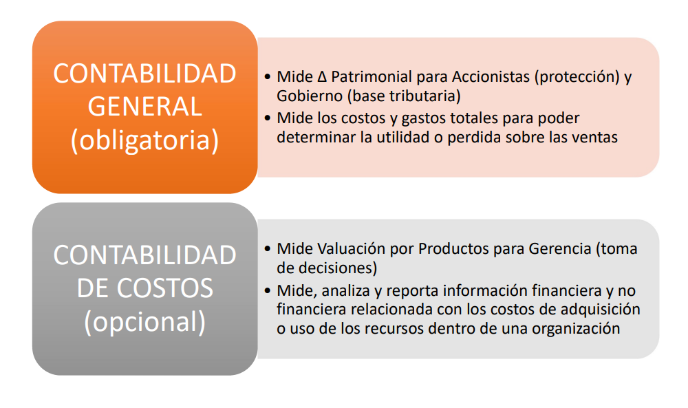

En nuestro país la Ley de Sociedades Comerciales (LSC) ha incorporado prescripciones relativas a la **documentación** y **contabilidad**, con carácter general para todas las sociedades comerciales:

* **Estado de situación patrimonial**: Foto instantánea de la situación financiera de una entidad en un punto dado del tiempo. La **ecuación contable fundamental**: 
  * ACTIVO = PASIVO + PATRIMONIO NETO
* **Estado de resultados**: Presenta el desarrollo de las operaciones en un periodo dado de tiempo. La ecuación fundamental es:
  * BENEFICIO = INGRESOS – COSTOS = P x Q – CU x Q – Otros Costos
* **Estado de evolución del patrimonio**: Resume las distintas componentes del patrimonio neto y sus cambios. La ecuación fundamental es:
  * Beneficio Acum al inicio + Beneficio del periodo – Dividendos = Beneficios Acum al final 
* **Estado de variaciones de capital corriente**: Diseñado para vincular el beneficio contable con los movimientos de entradas y salidas de dinero. La ecuación fundamental es: 
  * Saldo de Caja al inicio + Fondos Generados (operativos + financieros + inversión) – Fondos Usados (operativos + financieros + inversión) = Saldo de Caja al fin

**ACTIVO**: conjunto de **bienes** y **derechos** que pertenecen a la empresa, con la característica común de que se utilizan en la **generación de ingresos**.
* **Activo No Corriente**: aquellos bienes y derechos adquiridos con intención de que permanezcan en la empresa durante más de un año. (ACTIVOS FIJOS)
* **Activo Corriente**: aquellos bienes y derechos adquiridos con intención de que permanezcan menos de un año.
  
Activo = Activo Corriente + Activo Fijo

**PASIVO**: está formado por el conjunto de recursos financieros obtenidos por la empresa para el desarrollo de sus funciones. Principalmente formado por las **obligaciones** que la empresa tiene **contraídas con terceros**.
* **Pasivo No Corriente**: los conforman préstamos con vencimiento a un periodo superior a un año.
* **Pasivo Corriente**: los conforman préstamos con vencimiento a un periodo menores a un año.

Pasivo = Pasivo Corriente + Pasivo No Corriente

**PATRIMONIO NETO**: está constituido por los **fondos** aportados por los **propietarios** o los **generados** por la **propia empresa**.

`Nota: La adquisición de los bienes que conforman el ACTIVO de la empresa (estructura económica), obliga a disponer de RECURSOS FINANCIEROS, que constituyen la fuente de financiamiento de la empresa (estructura financiera).`

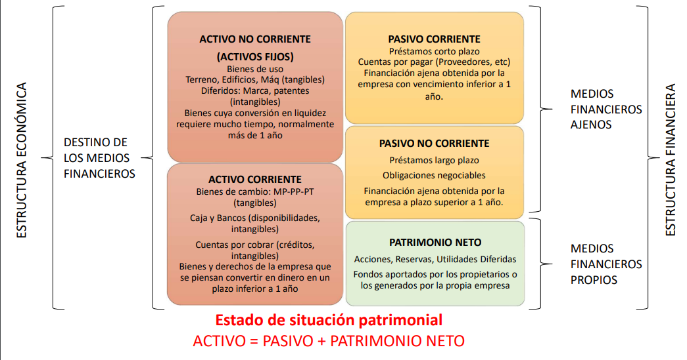

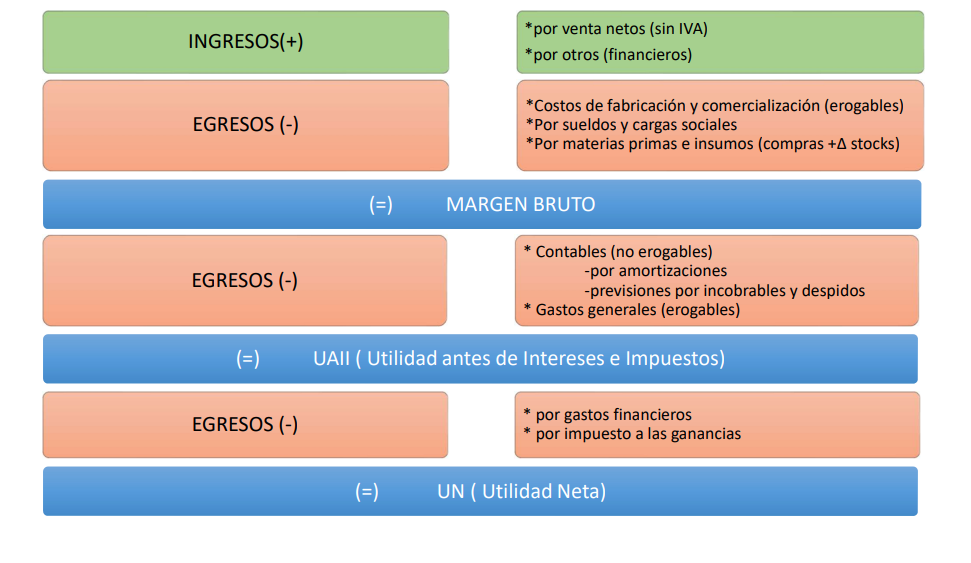

**AUDITORÍA**: Verificación de cumplimiento de procedimientos y criterios contables establecidos por la Federación de Consejos de Ciencias Económicas de Argentina (FCCEA)

Tipos de auditorías:

* Interna (de la empresa)
* Externa solicitada por la empresa (auditoría independiente de los estados patrimoniales)
* Externa del gobierno ( inspección de sociedades comerciales)

El auditor debe asegurarse mediante sus procedimientos que un **fraude** o error con efecto significativo sobre losestados financieros no ha ocurrido

### Valuación de activos

**Depreciación funcional**: **disminución** del **valor económico** de un bien de capital por **pérdida** de **capacidad para producir**:
* Por desgaste físico: debido al uso del activo en el proceso económico
* Por envejecimiento: debido al desgaste gradual independiente del funcionamiento del mismo
* Por obsolescencia tecnológica: debido a la existencia de mejoras técnicas o aparición de nuevos procedimientos 
* Aplicable a construcciones, instalaciones, equipos. El Terreno no se deprecia

**Depreciación contable**: es un **reconocimiento racional** y **sistemático** del costo de los bienes, distribuido durante su vida útil estimada, con el fin de obtener los recursos necesarios para la reposición de los bienes, de manera que se conserve la capacidad operativa o productiva de la empresa. **Es la pérdida de Valor de libros de activos fijos por métodos contables**.

Diferencia entre **Depreciación** y **Amortización**:

**Amortización**: es la **distribución sistemática** del **importe amortizable** de un **activo intangible** durante los años de su vida útil. Es el mismo proceso que la depreciación, con la única diferencia que utilizada sólo para los **activos intangibles** y los activos diferidos (los Activos que tienen valor, pero que no se puede tocar), Por ejemplo, una patente o marca y los gastos pagados por anticipados.

**METODOS CONTABLES PARA DETERMINAR EL VALOR DE LIBRO DE LOS ACTIVOS FIJOS**

En los estados contables, la adquisición de un activo fijo se reflejará positivamente y su pérdida de valor con el paso del tiempo, quedará reflejada en una cuenta negativa que indica lo que vale de menos en forma acumulada, período tras período.

Normalmente para la amortización de un activo intangible se utiliza el método de **línea recta**, no obstante en la depreciación de los activos fijos existe varios métodos.

* Método de la línea recta: Distribuye la base de amortización en partes iguales a cada año de su vida útil
* Método de Saldo de Declinación: Método acelerado de depreciación en el cual se aplica un porcentaje constante sobre el valor no depreciado del activo 
* Método del servicio prestado: Método que utiliza unidades ligadas a algún aspecto de producción, independiente del tiempo
* Métodos específicos

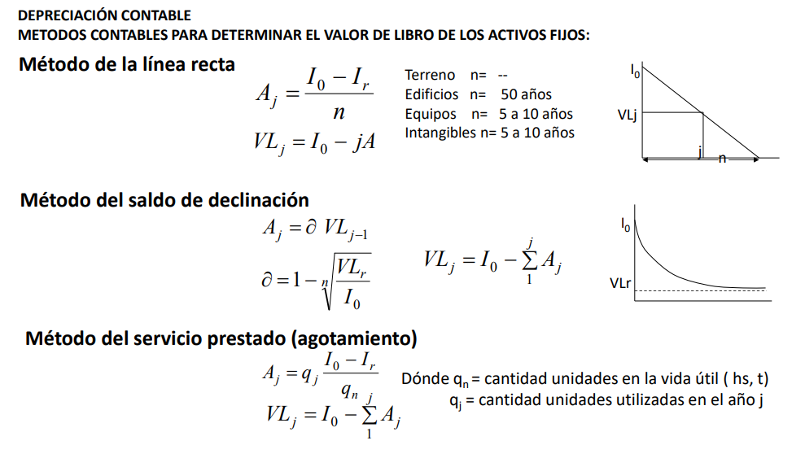

## Estructura financiera de las empresas

Toda empresa requiere de **recursos** para realizar sus actividades. El inicio de una empresa o de un nuevo proyecto implica una **inversión**, por lo que se requiere de recursos financieros para que se pueda llevar a cabo.

La adquisición de los bienes que conforman el **ACTIVO** de la empresa (**estructura económica**), obliga a disponer de **RECURSOS FINANCIEROS**, que constituyen la fuente de financiamiento de la empresa (**estructura financiera**).

En otras palabras, la **Estructura financiera** de la empresa se compone de todos los **recursos financieros** empleados por la empresa, para hacer posible inversiones en **activos**. 

Estos recursos financieros pueden clasificarse según su procedencia:
* inversiones de accionistas (capital accionario)
* préstamos a largo plazo (Pasivo No Corriente)
* préstamos a corto plazo (Pasivo Corriente)

Motivo necesidad de financiamiento: 
* **Falta de liquidez** necesaria para hacer frente a las operaciones diarias
* Ante la posibilidad de llevar a cabo una nueva inversión (crecimiento-expansión) no se cuenta con **capital propio suficiente** o no se desea comprometer 100% capital propio

Se puede clasificar el financiamiento según su **origen** (si se genera dentro o fuera de la empresa) 
* **Financiación interna**: reservas, capital accionario, nueva emisión de acciones (PN) 
* **Financiación externa**: créditos, cuentas a pagar, anticipos, aportes de socios (Pasivo exigible)

Se puede clasificar el financiamiento según la **titularidad** (propios o ajenas)
* **Financiación Propia**: No hay que devolverlo: Reservas (int) 
* **Financiación Ajena**: Hay que devolverlo: Prestamos, créditos, etc.

**PERIODO DE MADURACIÓN ECONÓMICO** (también llamado Ciclo Operativo), es el período de tiempo que trascurre desde que la empresa **invierte** en el **proceso productivo**, a través de la compra de existencias (materias primas y mercaderías), hasta que **recupera** esta **inversión** mediante el cobro a los clientes . El período de días que se requieren para cobrar una venta se denomina Periodo de Cuentas por Cobrar (PCC)

**PERIODO DE MADURACIÓN FINANCIERO** (también llamado Ciclo de Efectivo), es el período de tiempo que
transcurre desde que la empresa **paga** a los **proveedores** hasta que **cobra** de los **clientes**. Es decir, el numero de días que transcurren hasta que ingresa el importe efectivo de una venta, medido desde el momento en que se pagaron estos productos en inventario

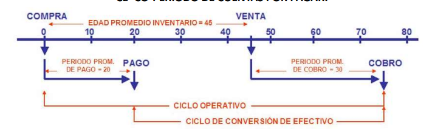

### Indicadores y ratios de performance

Los **Ratios Financieros** o índices financieros: Miden la **capacidad** de la **empresa** para **hacer frente** a sus **obligaciones**, tanto en el corto como en el largo plazo. Por si mismo, no es mas que un cociente de dos datos extraídos de los estados contables. Toma significado cuando es comparado con normas o rangos encontrados en otros negocios de la misma industria o similar

La **rentabilidad financiera** es la comparación cuantitativa entre la **capacidad** de una empresa para **producir beneficios económicos netos** y la **inversión** en **recursos** propios empleados para obtener esos beneficios.

La **rentabilidad económica** es la comparación cuantitativa entre la **capacidad** de una empresa para **producir beneficios económicos**, respecto al **activo total empleado** para obtener esos beneficios

Los **Ratios de Rentabilidad**, miden como las empresas utilizan eficientemente sus activos, indicando además la eficiencia operativa de la gestión empresarial.

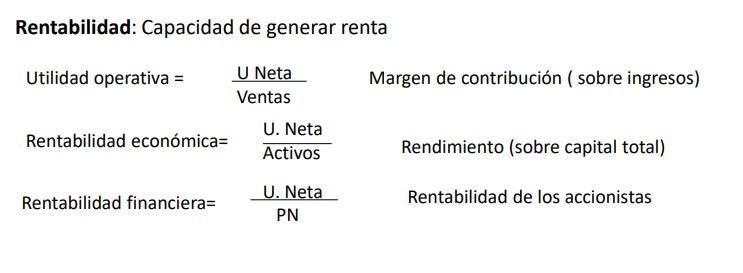

La **liquidez** es la capacidad que una empresa posee para cancelar sus obligaciones en el corto plazo

La solvencia es la capacidad que una empresa tiene para atender el pago de los compromisos adquiridos en el largo plazo

Los **Ratios de Liquidez**, miden la disponibilidad de dinero en efectivo que tiene la empresa para cancelar sus obligaciones en el corto plazo (menos de un año desde la fecha de cierre del ejercicio)

Los **Ratios de Solvencia**, miden la capacidad de pago de una empresa ante sus obligaciones. Puede expresarse en forma agregada (relación entre los activos totales y los pasivos totales) o en forma desagregada (en función de activos y pasivos corriente o no corriente)

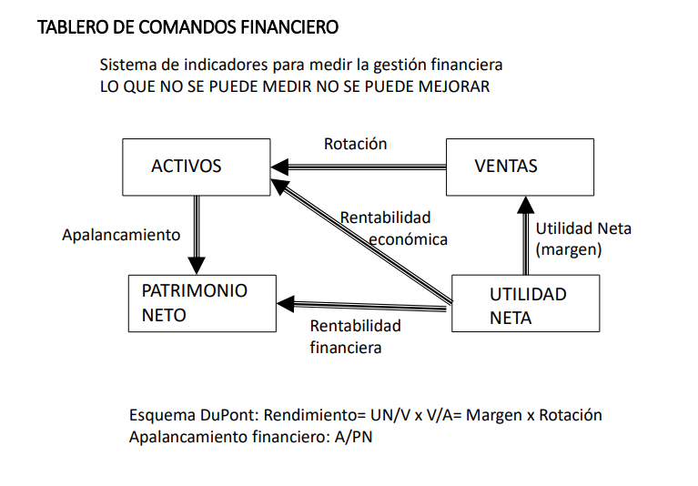

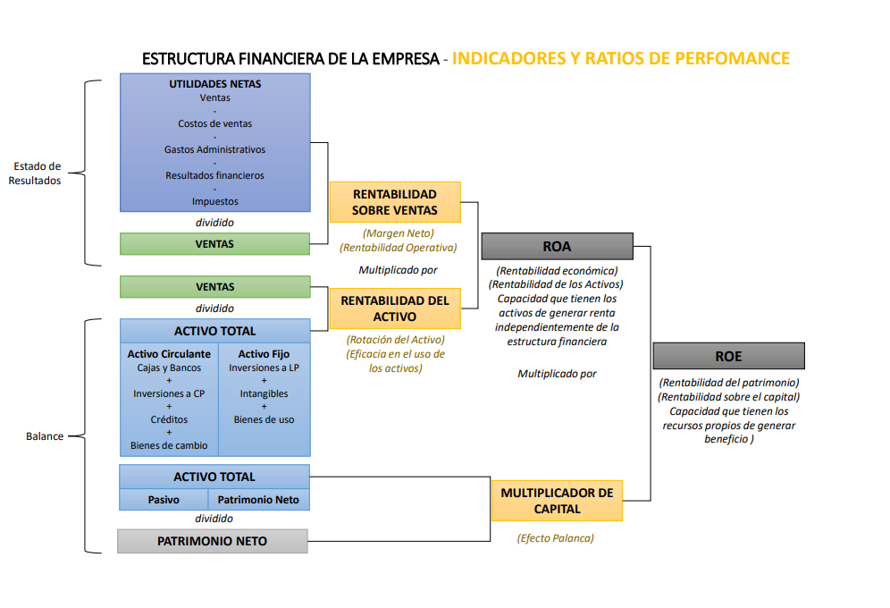

## Contabilidad de costos

Los **GASTOS** se identifican con intervalos de tiempo y no con los productos elaborados. Se relacionan con las funciones de distribución, administración y financiamiento de la empresa.

Los **COSTOS** se refieren al **valor monetario** de los **recursos asignados** a la **elaboración** de un **producto** o a la prestación de un **servicio**. Es decir, materia prima directa, mano de obra directa y los cargos indirectos.

LA **CONTABILIDAD DE COSTOS** es un sistema que le permite a las empresas **identificar** los **costos** de las tareas ejecutadas. Provee de información que sirva para la toma de decisión, la planificación y la evaluación del desempeño.

LOS **OBJETIVOS** DE LA CONTABILIDAD DE COSTOS

1. Proveer de **información útil** para la asignación de valor monetario a productos o servicios
2. Proveer información de **uso interno** de los directivos de la empresa, que permita el desarrollo de las tareas de planeación, control y toma de decisiones
3. Visualizar desviaciones para tomar las **medidas correctivas**. (optimización de los recursos)

**Elementos de costo**

El costo de Producción se compone de:

* Costo de **Materia Prima**
* Costo de **Mano de obra**
* **Costos Indirectos de fabricación** CIF: Aquellos costos que intervienen en la transformación, pero que no son ni materiales ni mano de obra y no se pueden asignar a una partida especifica de producción (compuestos por los materiales indirectos, la mano de obra indirecta y otros gastos de producción como las depreciaciones, las primas de seguros, los alquileres, la iluminación general, etc.). Se debe utilizar una base que sea conveniente para la repartición proporcional de los CIF

El costo de Distribución y Desarrollo se compone de:
* Comercialización
* Administración
* Financiación
* Desarrollo

**METODOS DE COSTEO**

1. COSTEO POR **ABSORCIÓN**
2. COSTEO **VARIABLE**
3. 
La diferencia entre ambos es que en el **costeo variable** los costos **fijos** de manufactura se **excluyen** de los costos **inventariables**; mientras que en el costeo absorbente, los costos fijos de manufactura se incluyen en los costos inventariables.

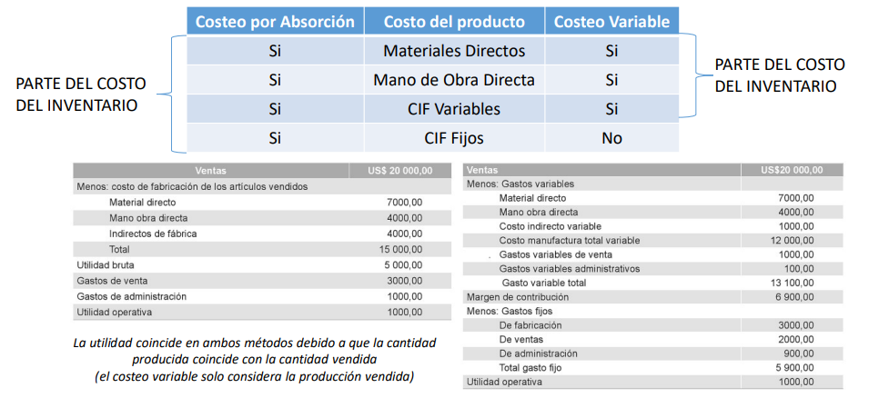

### Costeo por absorción

Es un método de costeo donde **todos los Costos** del Producto (fijos y variables), se incluyen como **costos inventariables**. Es decir, el inventario “absorbe” todos los costos de manufactura. En el costeo por absorción se considera como costo del producto: 

* el costo de material
* costo de mano de obra
* costos indirectos de fábrica tanto fijos como variables.

Los **costos fijos** son costos que se mantienen **constantes** a **cualquier nivel de producción** o venta. Los **costos variables** se consideran aquellos costos que **varían** en la misma proporción que el **nivel de producción** o venta.

El **Costo del producto fabricado** y vendido, se convierte en el **Estado de Resultado**, en gastos con la forma de “costo de venta” o “costo de fabricación de artículos vendidos” 

Todos los costos que no son de manufactura: Comercialización, Administración, Financiación, Desarrollo, etc. Resultan **No inventariables** y se registran como **Gastos del Periodo** (GP):

Se han desarrollado dos sistemas de asignación de costos: 

• Si se producen productos que son bastantes **distintos** entre si, se utiliza entonces el **costeo por ordenes** (los costos se acumulan o se reúnen por cada **pedido del cliente**) 
• Si se producen grandes cantidades de productos homogéneos, se utiliza el **costeo por procesos** (los costos se acumulan por dichos procesos o por departamentos o secciones durante un período de tiempo dado)

El sistema de **COSTEO POR ORDENES**, es aplicable a aquellas empresas manufactureras que producen de acuerdo a **especificaciones del cliente** (constructoras, publicitarios, imprentas, plásticos, etc) En él, para **cada orden**, se acumulan los **costos** de **material prima**, **mano de obra**, costos **indirectos**, **gastos generales** y **beneficios**. 

Generalmente se acumulan los costos primos, y los CIF y Gastos del Período se incluyen aplicando el concepto de **centro de costo** o bien, se determinan en base a los costos de MP y MOD: Margen Bruto (CIF+GP)=(MP+MOD) x MB

El costo de un trabajo es una base para hacer una comparación con el precio de venta y sirve como referencia para las futuras cotizaciones de precios de trabajos similares.

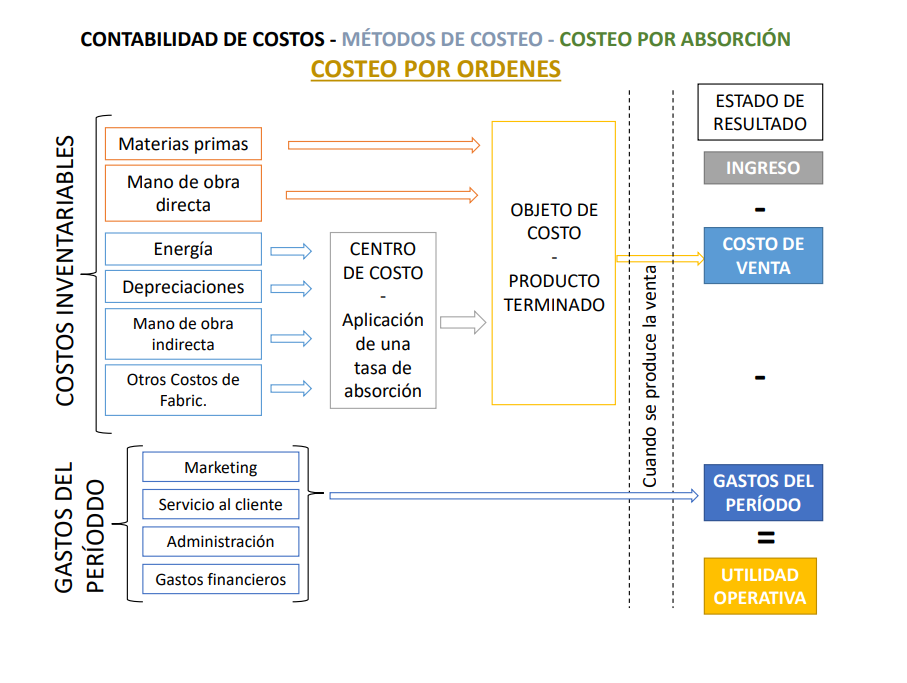

El sistema de **COSTEO POR PROCESO** es adecuado cuando las operaciones representan producción en **masa** o procesos continuos. (el procesamiento de alimentos, refinerías de petróleo, productos químicos, producción de acero, textiles, etc).

En él, se identifican los costos de manufactura o elaboración, con departamentos individuales en un intervalo dado de tiempo. Los costos unitarios promedio se calculan dividiendo los costos totales de un periodo contable dado, entre las unidades producidas en ese periodo. Este último es el costo unitario promedio que se aplica a cada una de las unidades idénticas o similares elaboradas en ese período.

El costo de los materiales es identificado con los departamentos y por lo tanto con las unidades individuales en un sistema de costos por procesos.

Los costos primos son siempre individualizables

Los CIF se registran en centros de costos (departamentos)

Costo proceso A + Costo proceso B + Costo Proceso C = Costo de producción

Estructura de costos:

Costo unitario desagregado en % MP, % MOD, % CIF

Bases de prorrateo: Cantidad q; Facturación p x q

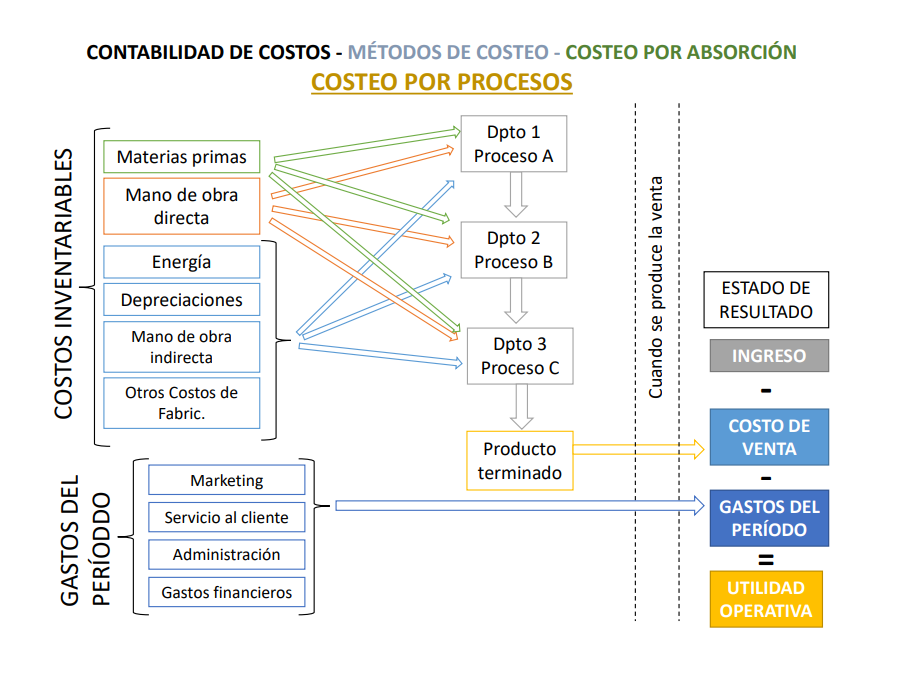

El sistema de distribución de costos POR **PRODUCCIÓN CONJUNTA** se utiliza cuando a partir de la misma materia prima, de un proceso productivo, se dan **más de un producto resultante**. No son un nuevo sistema de costeo. Es una **variante** del costo por **procesos**. En estos procesos se **comparten costos primos** y **CIF** hasta un punto de separación.

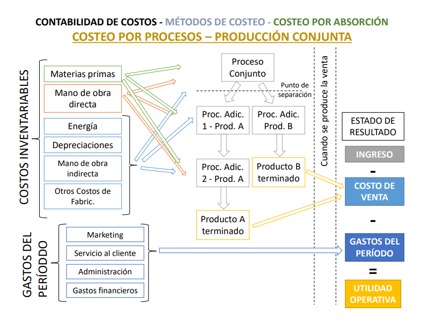

En el **COSTEO BASADO EN ACTIVIDADES**, los productos no consumen costos, sino las **actividades consumen recursos** y es la disponibilidad y uso de esos recursos lo que generan costos. Es decir, la imputación al producto o servicio será en función de las actividades que haya producido o consumido. En este sistema, se identifican las **actividades** como los **objetos de costos**. 

Debemos definir: que es una actividad? Una actividad es un evento, una **tarea** o una unidad de trabajo que tiene un **propósito especificado**. De una manera más informal, las actividades son **verbos**: algo que hace una empresa Un conductor de costo causa (o conduce) los costos de una actividad. Es un suceso que afecta al costo de una actividad por tener efecto directo con el consumo de recursos.

Los sistemas ABC :
1. Se identifican las actividades de todas las funciones de la cadena de valor. Es decir, se descompone la organización en una estructura de actividades
2. Se identifican conductores de costos asociados a cada actividad
3. Se calculan los costos de las actividades individuales (costo por unidad de conductor de costo)
4. Se asignan los costos a los objetos de costos —como los productos y servicios— con base en la mezcla de actividades necesarias para producir cada producto o servicio.
5. Se asignan costos a los productos multiplicando el costo unitario del conductor de costo por el volumen de unidades consumidas conductoras de costo por el producto

Diferentes **tipos** de **conductores de costos**
* De transacción (frecuencia con que se desarrolla una actividad)
* De duración (tiempo requerido para desarrollar una actividad)
* De intensidad o imputación directa (imputación de recursos utilizados)

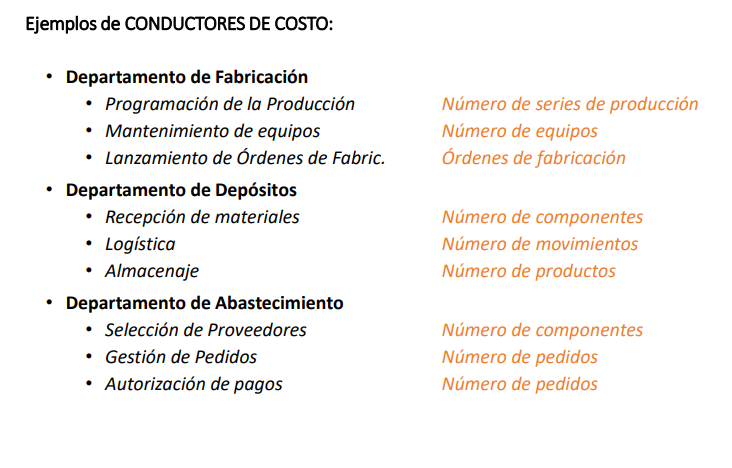

### Costeo variable

**COSTEO VARIABLE O COSTEO DIRECTO**, separa los **costos fijos** de los **variables**. Los costos **variables** representan los costos de **producir**, mientras que los **fijos** los costos de permanecer o **estar**. Se considera que la producción que no se vende es una variación de los bienes de la empresa, por lo que el estudio se debe solo a la producción vendida. Es un Costeo marginal o variable: una unidad más

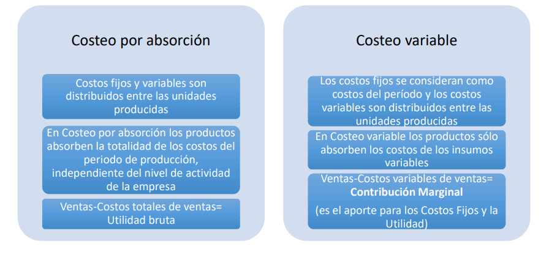

# Ingenieria economica

**INGENIERÍA ECONÓMICA**: Son conceptos y técnicas matemáticas aplicadas:
* en el análisis, comparación y evaluación financiera de alternativas relativas a proyectos
* para la toma de decisiones monetarias, que permiten llevar a cabo una aproximación racional y significativa

## El valor del dinero en el tiempo

### Tasas de interes

Cuando se habla de una suma de dinero, se debe especificar la fecha, de lo contrario la información es incompleta 

**El dinero cambia de valor a través del tiempo.**

El **INTERÉS** es el **costo** de **usar dinero** durante cierto **tiempo**, por lo que nos referimos a el como: **el valor tiempo del dinero** --> La tasa de interés es el porcentaje que se **paga** por el **alquiler** del **dinero**.

El capital tiene un **costo de oportunidad** en el tiempo y su **remuneración** es el **interés**.

* **Interés simple**: En el caso del interés simple se computa un monto de interés por cada periodo, tomando siempre como **base** el **mismo capital**;
* **Interés compuesto**: En el caso del interés compuesto el monto del interés en cada periodo se computa sobre el **principal** **mas** todo el **interés acumulado** en **periodos anteriores**.

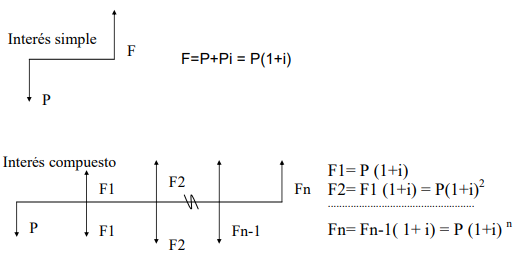

**Tasa nominal de interes**:

La tasa de interés nominal se expresa mediante un %, y representa la remuneración a un capital por un tiempo determinado. Es muy importante saber que **se expresa anualmente** aunque puede generar intereses más de una vez al año. Para conocer estos intereses generados, en el caso de que sea más de una vez al año, debemos calcular la tasa efectiva.

**Tasa efectiva**:

La tasa de interés efectiva es la **tasa verdadera** que **pagamos** por un pasivo o **recibimos** por un activo financiero, puede calcularse para cualquier periodo; mes, trimestre, semestre, etc. La tasa de interés efectiva es compuesta y vencida.

Se diferencia de la tasa de interés nominal que hace caso omiso de la capitalización y otra serie de factores. Con el tipo de interés efectivo, podemos representar el efecto de la reinversión de los intereses. Como la capitalización del interés se produce varias veces por año, generalmente de forma mensual, se obtiene un tasa efectiva mayor que la nominal. Asimismo, la tasa efectiva incluye, además del pago de intereses, el efecto que produce sobre el capital los impuestos, comisiones y otros gastos vinculados a la operación financiera.

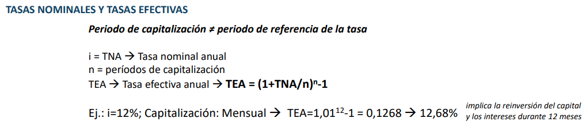

**Tasa de capitalización continua** (?)

Si la frecuencia de capitalización aumenta, el monto compuesto resultante también aumenta. Cuando “n” aumenta en forma indefinida (tiende a infinito), el monto compuesto tiende a un valor límite.

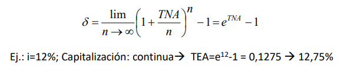

**Inflación e interes**

TIA = Tasa de Inflación Anual
TRI = Tasa Real de Interés

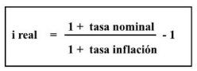

Si la inflación es de 3%, y la tasa de interés de un préstamo, 2%, el rendimiento que obtiene el prestamista es inferior a cero. En ese caso, decimos que la tasa de interés real —la tasa nominal menos la tasa de inflación— es negativa.

Los bancos centrales modifican esa tasa llamada “**tasa de política monetaria**”. Una tasa de política monetaria más alta **estimula el ahorro**; una tasa más baja promueve el **consumo** y reduce el costo de la inversión empresarial.

Al fijar esa tasa, los bancos centrales se guían por la idea de la **tasa de interés neutral**; o sea, la tasa de interés a largo plazo que es **congruente** con una **inflación estable**. Cuando las tasas de interés son inferiores a la tasa neutral, la **política monetaria** es **expansiva**; si son **superiores**, es **contractiva**.

### Factores de equivalencia

La **CAPITALIZACIÓN** es la operación que nos permite **agregar** a un **valor presente**, un cierto **valor** para obtener un **valor futuro** --> significa **avanzar** en el tiempo, **agregando** el **interés obtenido**.

La **ACTUALIZACIÓN** es determinar que cantidad de dinero **significa hoy**, una **suma de dinero futuro** --> ¿Que suma de dinero debo depositar hoy para obtener en un tiempo determinado un monto específico?

El **VALOR FUTURO** de un monto, es el referido **monto** más todos los **intereses** compuestos **acumulados**, a una **cierta tasa**.

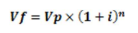

El **VALOR PRESENTE** de un monto es el **capital futuro** **menos** todo el **interés** compuesto descontado a la fecha presente, a una cierta tasa.

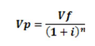

**Anualidades**:

FACTOR DE RECUPERACIÓN DE CAPITAL (**FRC**)

Se utiliza para encontrar el **valor** de una **serie uniforme de pagos iguales** (Anualidades) que inician en el periodo 1 y que se extienden hasta (n) periodos, a partir de un **valor presente** (P) y dado una **tasa de interés** (i), donde el interés se calcula sobre saldos.

Nos permite obtener el costo anual uniforme equivalente A, durante “n” períodos, de una inversión P cuando la tasa de interés es “i.

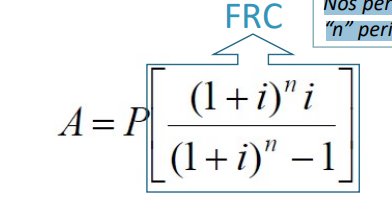

### Sistema de amortización de deuda

* En el **sistema** de **amortización francés** las cuotas (capital + interés) son **iguales** y **consecutivas**, pagando al **principio** mayor proporción de **interés** que de **capital**, invirtiéndose los porcentajes a lo largo de la cancelación de la deuda
* En el **sistema** de **amortización alemán** las cuotas (capital + Interés) son **decrecientes** y consecutivas **pagando** siempre el **mismo monto de capital** a cancelar y **disminuyendo** el monto de **interés** a lo largo del periodo del crédito.

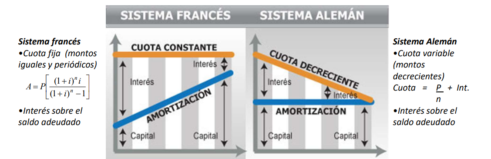

En ambos sistemas, los **intereses** se aplican sobre el saldo del **capital adeudado**, por lo que en el sistema **alemán** se **abona un total de intereses menor** que en el sistema **francés**,

En el sistema francés se pagan **cuotas menores** al **principio**, en comparación con el sistema alemán y desde el punto de vista contable, permite en las primeras cuotas mayores devengamiento de intereses.

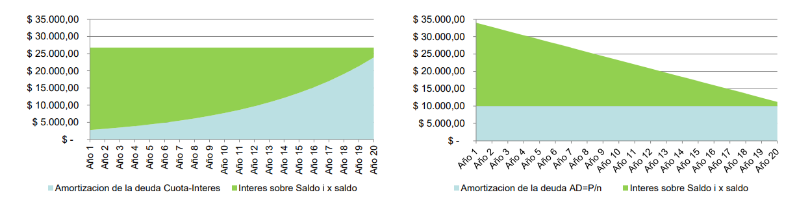

### Flujo de fondos

Es una técnica que permite **ordenar** y **estudiar** un hecho económico para **establecer** anticipadamente los **recursos necesarios** y **evaluar** sus posibles **resultados**. 

El flujo de caja se estructura en **varias columnas** que representan **momentos**, los cuales reflejan los **movimientos de caja** ocurridos durante un **periodo**, y los desembolsos que deben ser realizados para que los eventos del periodo siguiente puedan ocurrir.

Se realiza una **proyección** de **ingresos** y **egresos**, a **valores corrientes**. Luego, se pueden realizar análisis calculando distintas **medidas de rentabilidad**, que tienen en cuenta el valor del dinero en el tiempo y sirven de base para la **comparación de alternativas**.

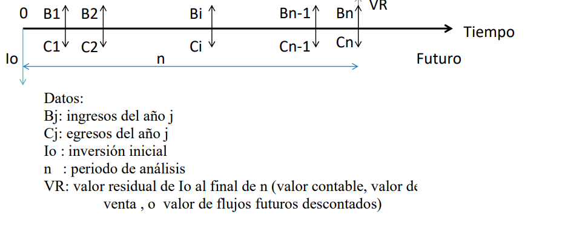

### Indicadores de eficiencia economica

* **El Valor Actual Neto** (VAN): mide **monetariamente**, expresado en el **momento presente**, en cuánto varía la **riqueza** por hacer la **inversión**. Es decir, cuánto se **gana** por sobre lo que **quiere ganar**, **después de recuperada la inversión**.

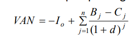

* **La Tasa Interna de Retorno** (TIR): es aquella **tasa de interés** que hace igual a **cero** el **valor actual neto**. Es conveniente realizar la inversión cuando la tasa exigida es menor que la TIR
* **El Punto de Equilibrio** (PE): determina la cantidad de **ventas** que deben realizarse para que los **ingresos netos** sean iguales a los **costos totales** en el corto plazo. A mayor PE, mayor riesgo. Cantidad “Q” tal que: PxQ = CF+CVu x Q
* **La Relación Beneficio-Costo** (RBC): compara el **valor actual** de los **beneficios** del proyecto con los **costos actuales** del mismo y la **inversión inicial**. Si la relación es mayor que uno, el negocio será rentable. Ingresos a valor presente sobre Costos a valor presenta. Conviene si RBC>1

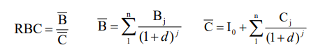

* **El Beneficio del Primer Año**: La tasa de ingresos del primer año sobre la inversión, deben ser mayor a la tasa de descuento, sino conviene postergar la inversión (BPA = B1/Io x 100>d)
* **El Período de Recupero de Capital** (PRC), es el **tiempo** (años) para que los **ingresos netos** **igualen** la **inversión inicial** Io. A mayor tiempo de recupero, mayor es el riego. PRC, períodos “n” tal que: 

**VAN**

Criterio de decisión: Si el VAN resulta positivo, el proyecto ofrece una rentabilidad mayor que la tasa de descuento adoptada. 

Siempre existe una alternativa para comparar que es la alternativa nula, es decir, el flujo de fondo sin proyecto. Si VAN > 0 equivale al aumento de riqueza por la inversión

el VAN de la alternativa nula = 0

Tiene como ventaja que refleja la incorporación de valor, pero como desventaja, que no mide la tasa de rentabilidad del proyecto.

**TIR**

la TIR representa la rentabilidad del proyecto.

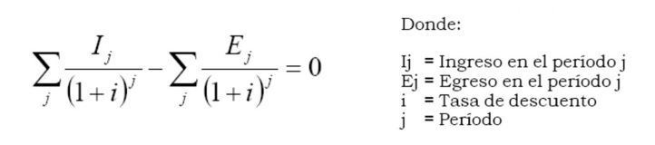

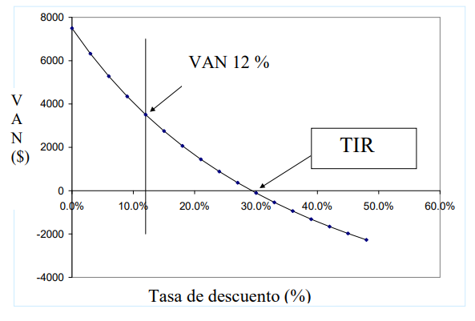

Criterio de decisión: cuando la TIR es mayor que la tasa de descuento, quiere decir que el proyecto es capaz de arrojar una diferencia positiva luego de devolver las inversiones, pagar los intereses de la deuda y pagar los dividendos del capital propio.

Tiene la ventaja de representar la verdadera rentabilidad del proyecto, pero la desventaja de no reflejar una contribución económica al valor de la empresa.

## Evaluación de alternativas para la toma de desiciones

Existen diferentes **métodos** para **evaluar alternativas** y elegir la más conveniente, dependiendo de los datos disponible, de su confiabilidad, del objetivo perseguido, etc.

Los **métodos Generales** se clasifican en: 
* métodos que **no tienen en cuenta** el **valor** del **dinero** en el **tiempo** y cuyas decisiones tienen sustentos en un plan general (analogías, parámetros técnicos, indicadores, etc.)
* métodos que sí **tienen en cuenta** el **valor** del **dinero** en el **tiempo**, donde el procedimiento es el análisis beneficiocosto con indicadores (VAN, TIR, Relación B-C, Beneficio del Primer Año, Periodo de recupero de capital, Punto de equilibrio)

Los métodos de análisis beneficio-costo tienen indicadores que se clasifican en

* aquellos que expresan valores monetarios (ej: VNA) y
* aquellos que expresan tasas o relaciones (ej: TIR, relación Beneficio-Costo)

En aquellos casos en que se conocen o es posible asignar probabilidades a los eventos, decimos que es una **decisión con Riesgo** y es posible utilizar **métodos probabilísticos**. (**Valor esperado**, **arboles de decisión**, Montecarlo, etc)

En aquellos casos en que no se conocen o no es posible asignar probabilidades a los eventos, decimos que es una **decisión con Incertidumbre** y se aplican métodos con información limitada. (Criterios de **Maximax**, **Maximin**, **Hurwics**, **Savage**, etc)

### Reemplazo de equipos

Una empresa debe generar políticas eficientes de **reemplazo** de los **activos** que utiliza, ya que de no hacerlo, se encuentra en desventaja frente a la competencia, sufre una **disminución** de su **capital** y se originan **excesivos costos** de **mantenimiento** y **operación**.

Son **motivos** de **reemplazo** de equipos: 
• el rendimiento disminuido de los equipos existentes debido a un deterioro físico:
• el incumplimiento de los requerimientos de producción de los equipos existentes, 
• la obsolescencia de los mismos

El **activo propuesto** (Desafiante) suele tener un **costo de capital alto**, **costos** de **operación bajos** y una **larga vida remanente**, mientras que el activo existente (defensor) suele poseer **costos de capital bajo**, **costos de operación** altos y una **corta vida útil**.

Ante cantidades equivalentes de producción el criterio de decisión se basa en el mayor valor presente neto.

Costo anual equivalente

Costo anual equivalente de operación y mantenimiento

Crece con el paso del tiempo debido al gasto ocasionado por reparaciones y mantenimiento

Costo anual equivalente de la inversión

Decrece en la medida que se prolonga el plazo de reposición, al distribuir el mismo valor actual en un horizonte mayor de tiempo

El **mínimo** costo anual equivalente representa la **vida útil económica óptima** para el activo

Para el análisis de alternativas en donde la **vida útil** del **retador** es **igual** a la vida útil del **defensor** se utiliza cualquiera de los métodos de evaluación de alternativas, es decir, a través del valor presente (VP) o del costoanual equivalente (CAE)

El método del **costo anual equivalente** se utiliza para comparar proyectos de **distinta vida útil** que son replicados a perpetuidad.

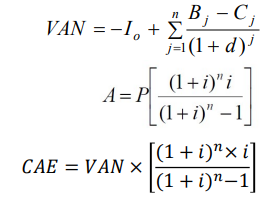

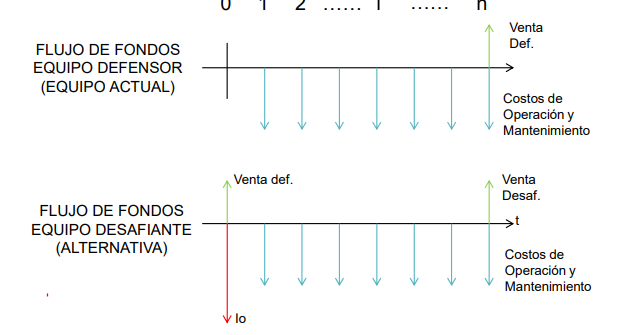

### Fabricar o comprar

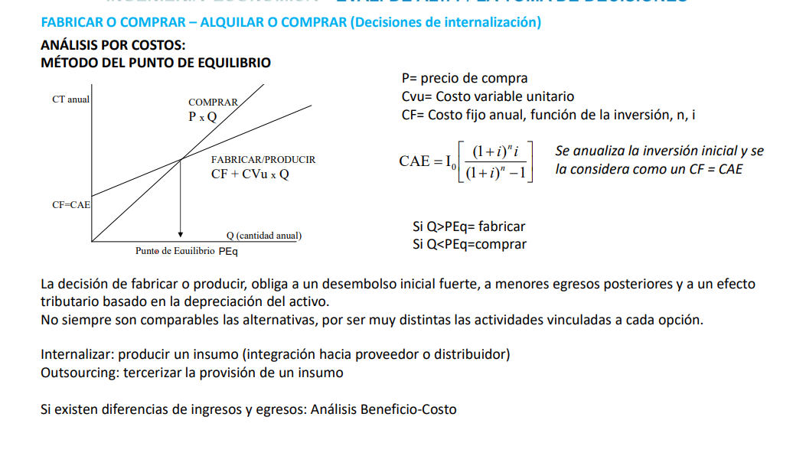

