# Sistemas operativos

- [Sistemas operativos](#sistemas-operativos)
- [Introducción](#introducción)
  - [Clasificación de SO's](#clasificación-de-sos)
- [Capitulo 1 - Introducción a los sistemas informaticos](#capitulo-1---introducción-a-los-sistemas-informaticos)
  - [Elementos basicos](#elementos-basicos)
  - [Registros del procesador](#registros-del-procesador)
  - [Ejecución de instrucciones](#ejecución-de-instrucciones)
  - [Interrupciones](#interrupciones)
  - [Jerarquia de memoria](#jerarquia-de-memoria)
  - [Memoria cache](#memoria-cache)
  - [Tecnicas de comunicación de E/S](#tecnicas-de-comunicación-de-es)
- [Capitulo 2 - Introducción a los SO](#capitulo-2---introducción-a-los-so)
  - [Objetivos y funciones de los SO](#objetivos-y-funciones-de-los-so)
    - [Facilidad de uso](#facilidad-de-uso)
    - [Eficiencia](#eficiencia)
    - [Capacidad de evolución](#capacidad-de-evolución)
  - [Evolución de un SO](#evolución-de-un-so)
    - [Procesamiento serie](#procesamiento-serie)
    - [Sistemas en lotes sencillos](#sistemas-en-lotes-sencillos)
    - [Sistemas en lotes multiprogramados](#sistemas-en-lotes-multiprogramados)
    - [Sistemas de tiempo compartido](#sistemas-de-tiempo-compartido)
  - [Principales logros](#principales-logros)
    - [Procesos](#procesos)
    - [Gestion de memoria](#gestion-de-memoria)
    - [Planificación y gestión de los recursos.](#planificación-y-gestión-de-los-recursos)
    - [Estructura del sistema.](#estructura-del-sistema)
- [Software libre y linux](#software-libre-y-linux)
  - [Categorias del software](#categorias-del-software)
  - [Linux](#linux)
    - [Introducción](#introducción-1)
    - [Caracteristicas](#caracteristicas)
    - [El kernel](#el-kernel)
  - [Arranque](#arranque)
  - [Estructura del sistema de archivos](#estructura-del-sistema-de-archivos)
    - [Implementación de un sistema de archivos](#implementación-de-un-sistema-de-archivos)
  - [Sistemas de archivos soportados por linux](#sistemas-de-archivos-soportados-por-linux)

# Introducción

## Clasificación de SO's

La construcción de un SO se asienta sobre 2 requisitos: el usuario y el software

* **Estructura**:
  * Monolitica
  * Jerarquica
* **N° usuarios**:
  * monouser
  * multiuser
* **N° tareas**:
  * Monotask
  * Multitask
* **Nro de procesadores**:
  * Monoprocesador
  * Multiprocesador
  * Simetrico
  * Asimetrico
* **Como ofrece servicios**
  * de red
  * distribuidos

# Capitulo 1 - Introducción a los sistemas informaticos

Un sistema operativo:
* explota los recursos hardware de uno o más procesadores para proporcionar un conjunto de servicios a los usuarios del sistema. 
* El sistema operativo también gestiona la memoria secundaria y los dispositivos de E/S (entrada/salida) para sus usuarios.

## Elementos basicos

Los elementos de los sistemas computacionales son:
* **Procesador**: Controla el funcionamiento del computador y realiza sus funciones de procesamiento de datos. Cuando sólo hay un procesador, se denomina usualmente unidad central de proceso (Central Processing Unit, CPU).
* **Memoria principal**: Almacena datos y programas. Esta memoria es habitualmente volátil; es decir, cuando se apaga el computador, se pierde su contenido. En contraste, el contenido de la memoria del disco se mantiene incluso cuando se apaga el computador. A la memoria principal se le denomina también memoria real o memoria primaria.
* **Modulos de E/S**: Transfieren los datos entre el computador y su entorno externo. El entorno externo está formado por diversos dispositivos, incluyendo dispositivos de memoria secundaria (por ejemplo, discos), equipos de comunicaciones y terminales.
* **Bus del sistema**: Proporciona comunicación entre los procesadores, la memoria principal y los módulos de E/S.

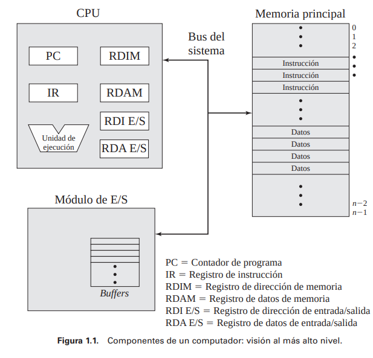

Una de las funciones del procesador es el intercambio de **datos** con la **memoria**. Para este fin, se utilizan normalmente dos registros internos (al procesador): 
* un registro de dirección de memoria (**RDIM**), que especifica la **dirección** de memoria de la siguiente lectura o escritura; 
* y un registro de **datos** de memoria (**RDAM**), que contiene los datos que se van a escribir en la memoria o que recibe los datos leídos de la memoria. 

De manera similar, un registro de **dirección** de **E/S** (**RDIE/S**) especifica un determinado dispositivo de E/S, y un registro de **datos** de **E/S** (**RDAE/S**) permite el intercambio de datos entre un módulo de E/S y el procesador.

Un **módulo** de **memoria** consta de un conjunto de **posiciones definidas** mediante **direcciones** numeradas secuencialmente. Cada posición contiene un **patrón de bits** que se puede interpretar como una instrucción o como datos. 

Un **módulo** de **E/S** transfiere datos desde los **dispositivos externos** hacia el procesador y la memoria, y viceversa. Contiene **buffers** (es decir, zonas de almacenamiento internas) que mantienen temporalmente los datos hasta que se puedan enviar.

## Registros del procesador

Los registros del procesador sirven para dos funciones:
* **Registros visibles para el usuario**: Permiten al programador en lenguaje máquina o en ensamblador **minimizar** las **referencias** a **memoria principal** optimizando el uso de registros. Para lenguajes de alto nivel, un compilador que realice **optimización** intentará tomar decisiones inteligentes sobre qué variables se asignan a registros y cuáles a posiciones de memoria principal.
* **Registros de control** y **estado**. Usados por el procesador para **controlar** su **operación** y por rutinas privilegiadas del sistema operativo para **controlar** la **ejecución** de **programas**.

Tipos de registros **visibles**:
* Registros de **datos**: De proposito general, utilizados para operaciónes sobre datos
* Registros de **dirección**: De proposito general o dedicados, utilizados para operaciónes sobre direcciones de memoria o partes de direcciones de memoria (Ej: registro indice, puntero de pila)

En algunas máquinas, una llamada a una subrutina o a un procedimiento implica **salvar** automáticamente todos los **registros visibles** para el usuario, que se **restaurarán** al retornar. El procesador realiza estas operaciones de salvar y restaurar como parte de la ejecución de las instrucciones de **llamada** y de **retorno**. En otras máquinas, el programador es el responsable de guardar el contenido de los registros visibles para el usuario antes de una llamada a un procedimiento, incluyendo instrucciones para ello en el programa

En cuanto a los **registros** de **control** y **estado**, en las maquinas se emplean varios registros del procesador para controlar el funcionamiento del mismo. Algunos registros de control son por ejemplo:
* Contador de programa (**Program Counter**, PC): Contiene la **dirección** de la **próxima instrucción** que se leerá de la memoria.
* Registro de instrucción (**Instruction Register**, IR). Contiene la **última instrucción leída**.

Todos los diseños de procesador incluyen también un **registro**, o conjunto de registros, conocido usualmente como la **palabra** de **estado** del **programa** (Program Status Word, PSW), que contiene información de **estado**. La PSW contiene normalmente **códigos** de **condición**, además de otra información de estado, tales como un bit para habilitar/inhabilitar las interrupciones y un bit de modo usuario/supervisor.

Los **códigos** de **condición** (también llamados indicadores) son **bits** cuyo valor lo asigna normalmente el **hardware** de procesador teniendo en cuenta el **resultado** de las **operaciones**. Por ejemplo, una operación aritmética puede producir un resultado **positivo**, **negativo**, **cero** o **desbordamiento**. Posteriormente, se puede **comprobar** el código de condición como parte de una operación de **salto condicional**. Los bits de código de condición no pueden ser **alterados** por una referencia **explícita** debido a que están destinados a la realimentación del resultado de la ejecución de una instrucción

## Ejecución de instrucciones

En su forma más simple, el **procesamiento** de **una instrucción** consta de **dos pasos**: 

* el procesador lee (busca) instrucciones de la memoria, una cada vez, 
* y ejecuta cada una de ellas. 

La ejecución del programa consiste en **repetir** el proceso de búsqueda y ejecución de instrucciones.

Se denomina **ciclo** de instrucción al procesamiento requerido por una única instrucción

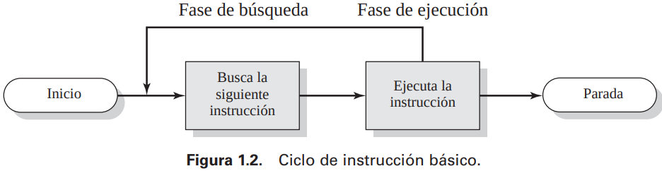

Al principio de cada ciclo de instrucción, el procesador lee una **instrucción** de la **memoria**. En un procesador típico, el contador del programa (PC) almacena la dirección de la **siguiente instrucción** que se va a leer. A menos que se le indique otra cosa, el procesador siempre **incrementa** el PC después de cada instrucción ejecutada, de manera que se leerá la **siguiente** instrucción en orden **secuencial**.

La instrucción leída se **carga** dentro de un registro del procesador conocido como **registro de instrucción** (IR). La instrucción contiene **bits** que especifican la **acción** que debe realizar el procesador. El procesador **interpreta** la instrucción y **lleva a cabo** la acción requerida.

En general, estas acciones se dividen en cuatro categorías:
* Procesador-**memoria**
* Procesador-**E/S**
* Procesamiento de **datos**
* **Control** (Saltos, branches)

`Nota: Se pueden intercambiar datos directamente entre un módulo de E/S. sin embargo, en algunos casos, es deseable permitir que los intercambios de E/S se produzcan directamente con la memoria para liberar al procesador de la tarea de E/S. En tales casos, el procesador concede a un módulo de E/S la autorización para leer o escribir de la memoria, de manera que la transferencia entre memoria y E/S puede llevarse a cabo sin implicar al procesador. Durante dicha transferencia, el módulo de E/S emite mandatos de lectura y escritura a la memoria, liberando al procesador de la responsabilidad del intercambio. Esta operación, conocida como acceso directo a memoria (Direct Memory Access, DMA)`

## Interrupciones

Las interrupciones constituyen una manera de mejorar la utilización del procesador.  La mayoría de los dispositivos de E/S son mucho más **lentos** que el procesador. Supóngase que el procesador está transfiriendo datos a una impresora utilizando el esquema de **ciclo** de instrucción. Después de cada instrucción de escritura, el procesador debe **parar** y permanecer **inactivo** hasta que la impresora la lleve a cabo. La longitud de esta pausa puede ser del orden de muchos miles o incluso **millones** de **ciclos** de instrucción. Claramente, es un enorme desperdicio de la capacidad del procesador.

Gracias a las interrupciones, el procesador puede dedicarse a ejecutar otras instrucciones mientras que la operación de E/S se está llevando a cabo. 

**Proceso de interrupción**: 
* El programa de usuario alcanza un punto en el que hace una llamada al sistema que consiste en una llamada de **escritura** de **E/S**. El programa de E/S que se invoca en este caso consta sólo del código de preparación y el mandato real de E/S (y no la espera de confirmación de escritura). 
* Después de que se ejecuten estas pocas instrucciones, se **devuelve** el **control** al **programa** de **usuario**. Mientras tanto, el dispositivo externo está ocupado **aceptando** **datos** de la memoria del computador e **imprimiéndolos**. La operación de E/S se lleva a cabo de forma concurrente con la ejecución de instrucciones en el programa de usuario. 
* Cuando el dispositivo externo está listo para ser atendido, es decir, cuando está preparado para aceptar más datos del procesador, el módulo de E/S de este dispositivo externo manda una **señal** de petición de **interrupción** al **procesador**. 
* El procesador responde **suspendiendo** la **ejecución** del programa actual, saltando a la rutina de servicio específica de este dispositivo de E/S, conocida como **manejador** de **interrupción**, y **reanudando** la **ejecución** original después de haber atendido al dispositivo.

Para tratar las interrupciones, se añade una **fase de interrupción** al ciclo de instrucción. En la fase de interrupción, el procesador **comprueba** si se ha producido cualquier **interrupción**, hecho indicado por la presencia de una **señal** de **interrupción**. Si no hay interrupciones pendientes, el procesador **continúa** con la fase de búsqueda y lee la siguiente instrucción del **programa** actual. Si está pendiente una interrupción, el procesador **suspende** la **ejecución** del programa actual y ejecuta la rutina del **manejador** de **interrupción**.

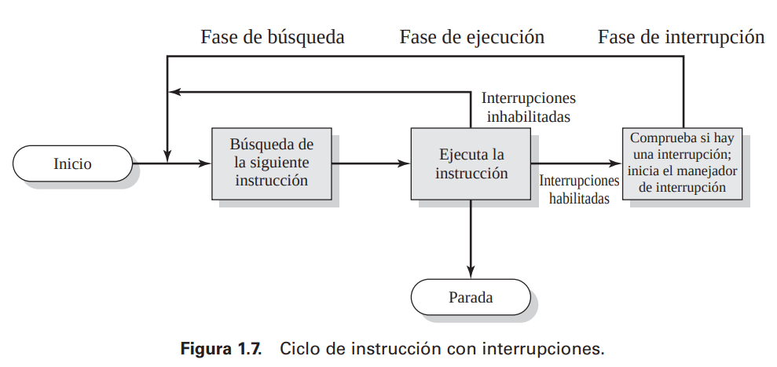

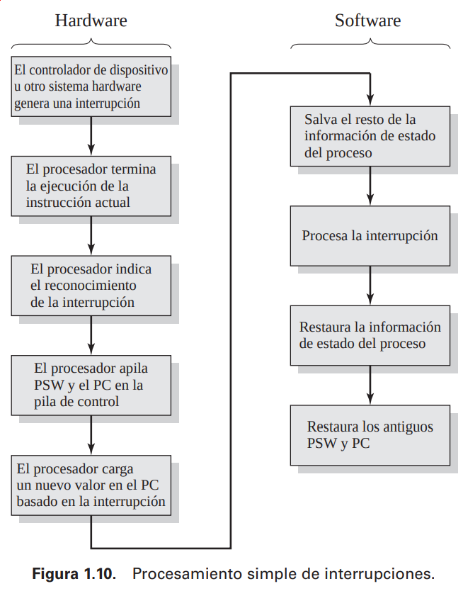

Se pueden considerar dos alternativas a la hora de tratar con múltiples interrupciones. La primera es **inhabilitar** las **interrupciones** mientras que se está **procesando** una **interrupción**.

Una segunda estrategia es **definir prioridades** para las **interrupciones** y permitir que una interrupción de más prioridad cause que se interrumpa la ejecución de un manejador de una interrupción de menor prioridad

## Jerarquia de memoria

Como se podría esperar, hay un compromiso entre las tres características fundamentales de la memoria: a saber, **coste**, **capacidad** y **tiempo** de **acceso**. En cualquier momento dado, se utilizan diversas tecnologías para implementar los sistemas de memoria. En todo este espectro de tecnologías, se cumplen las siguientes relaciones:

* Cuanto **menor tiempo de acceso**, **mayor coste** por bit.
* Cuanto **mayor capacidad**, **menor coste** por bit.
* Cuanto **mayor capacidad**, **menor velocidad** de acceso

Queda claro el dilema al que se enfrenta el diseñador. A él le gustaría utilizar tecnologías que proporcionen una memoria de gran capacidad, tanto porque se necesita esa capacidad como porque su coste por bit es bajo. Sin embargo, para cumplir con los requisitos de rendimiento, el diseñador necesita utilizar memorias de capacidad relativamente baja con tiempos de acceso rápidos.

La solución a este dilema consiste en no basarse en un único componente de memoria o en una sola tecnología, sino emplear una **jerarquía de memoria**. Según se desciende en la jerarquía, ocurre lo siguiente:
1. Disminución del coste por bit.
2. Aumento de la capacidad.
3. Aumento del tiempo de acceso.
4. Disminución de la frecuencia de acceso a la memoria por parte del procesador

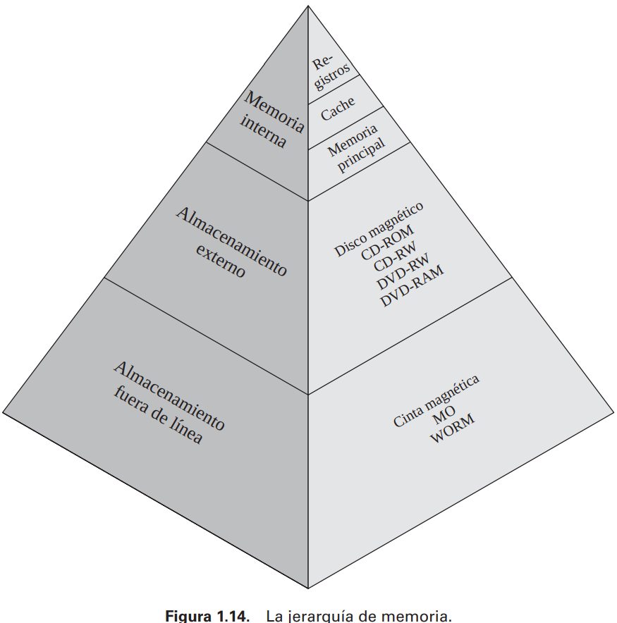

* Memoria principal -> **volatil**
* Memoria secundaria -> **no volatil**

## Memoria cache

En todos los ciclos de instrucción, el procesador accede a memoria al menos una vez, para leer la instrucción y, con frecuencia, una o más veces adicionales, para leer y/o almacenar los resultados. La velocidad a la que el procesador puede ejecutar instrucciones está claramente limitada por el tiempo de ciclo de memoria. La solución a esta limitación consiste en aprovecharse del **principio** de la **proximidad** utilizando una memoria pequeña y rápida entre el procesador y la memoria principal, denominada **cache**.

Hay una memoria principal relativamente grande y lenta junto con una memoria cache más pequeña y rápida. La cache contiene una **copia** de una **parte** de la memoria principal. Cuando el procesador intenta leer un byte de la memoria, se hace una **comprobación** para determinar si el **byte** **está** en la **cache**. Si es así, se le **entrega** el byte al **procesador**. 

En caso contrario, se lee e **introduce** dentro de la cache un **bloque** de **memoria** principal, que consta de un **cierto número** fijo de **bytes**, y, a continuación, se le **entrega** el byte pedido al **procesador**. 

Debido al fenómeno de la **proximidad** de referencias, cuando se lee e introduce dentro de la cache un bloque de datos para satisfacer una única referencia de memoria, es probable que muchas de las referencias a memoria en el futuro próximo correspondan con otros bytes del bloque (Ej: bucles).

## Tecnicas de comunicación de E/S

Hay tres técnicas para llevar a cabo las operaciones de E/S:
• **E/S programada**: el procesador **comprueba periódicamente** el estado del módulo de E/S hasta que encuentra que se ha completado la operación.
• **E/S dirigida de interrupciones**: el procesador genere un mandato de E/S para un módulo y, acto seguido, continúe realizando algún otro trabajo útil. El módulo de E/S **interrumpirá** más tarde al procesador para solicitar su servicio cuando esté listo para intercambiar datos con el mismo. El procesador ejecutará la transferencia de datos, como antes, y después reanudará el procesamiento previo.
• **Acceso directo a memoria** (DMA). Cuando el procesador desea leer o escribir un bloque de datos, genera un mandato al módulo de **DMA**. A continuación, el procesador continúa con otro trabajo. Ha delegado esta operación de E/S al módulo de DMA, que se ocupará de la misma. El módulo de DMA **transferirá** el bloque completo de datos, palabra a palabra, hacia la **memoria** o desde ella **sin pasar** a través del **procesador**. Por tanto, el procesador solamente está involucrado al **principio** y al **final** de la transferencia

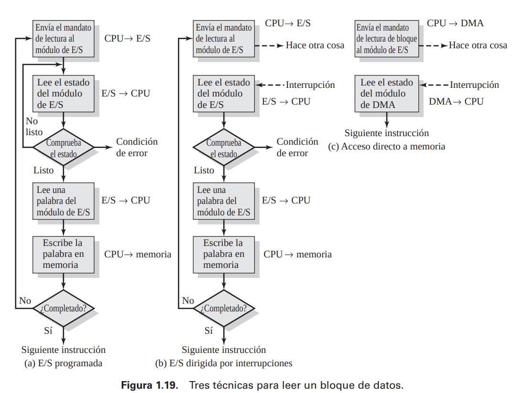

# Capitulo 2 - Introducción a los SO 

## Objetivos y funciones de los SO

Un **sistema operativo** es un **programa** que:
* **Controla** la **ejecución** de **aplicaciones** y **programas** 
* Actua como **interfaz** entre las **aplicaciones** y el **hardware** del computador.
* "Lo primero que arranca cuando arranca la PC (BIOS)"

Se puede considerar que un sistema operativo tiene los siguientes tres objetivos:

*  **Facilidad de uso**: Un sistema operativo **facilita** el **uso** de un computador.
* **Eficiencia**: Un sistema operativo permite que los **recursos** de un sistema de computación se puedan **utilizar** de una manera **eficiente**.
* Capacidad para **evolucionar**: Un sistema operativo se debe construir de tal forma que se puedan desarrollar, probar e **introducir nuevas funciones** en el sistema sin interferir con su servicio.

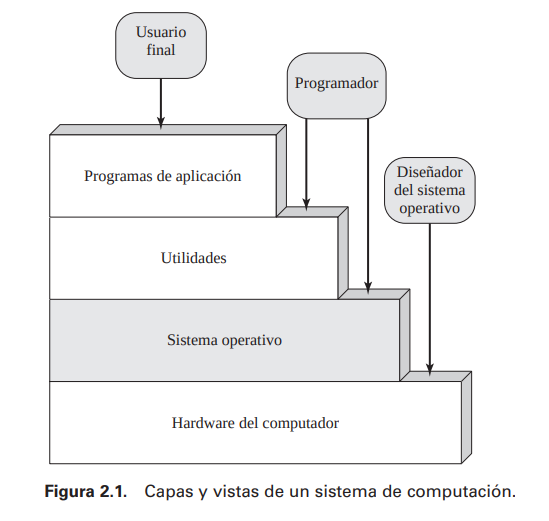

### Facilidad de uso

Algunos de los **servicios** que ofrece el SO son:

* **Desarrollo de programas**: El sistema operativo proporciona una variedad de utilidades y servicios, tales como **editores** y **depuradores**, para asistir al programador en la creación de los programas
* **Ejecución** **de programas**: Se necesita realizar una serie de pasos para ejecutar un programa. Las instrucciones y los datos se deben cargar en memoria principal. Los dispositivos de E/S y los ficheros se deben inicializar, y otros recursos deben prepararse. Los sistemas operativos realizan estas labores de planificación en nombre del usuario
* **Acceso a dispositivos de** **E/S**: Cada dispositivo de E/S requiere su propio conjunto peculiar de instrucciones o señales de control para cada operación. El sistema operativo proporciona una interfaz uniforme que esconde esos detalles de forma que los programadores puedan acceder a dichos dispositivos utilizando lecturas y escrituras sencillas.
* **Acceso controlado a los** **ficheros**: Para el acceso a los ficheros, el sistema operativo debe reflejar una comprensión detallada no sólo de la naturaleza del dispositivo de E/S (disco, cinta), sino también de la estructura de los datos contenidos en los ficheros del sistema de almacenamiento. Adicionalmente, en el caso de un sistema con múltiples usuarios, el sistema operativo puede proporcionar mecanismos de protección para controlar el acceso a los ficheros.
* **Acceso al** **sistema**: Para sistemas compartidos o públicos, el sistema operativo controla el acceso al sistema completo y a recursos del sistema específicos.
* **Detección** y **respuesta** a **errores**: El sistema operativo debe proporcionar una respuesta que elimine la condición de error, suponiendo el menor impacto en las aplicaciones que están en ejecución.
  * Errores de HW
    * Internos
    * Externos
  * Errores de SW
    * Division por cero
    * Acceso prohibido a memoria
* **Contabilidad** (estadistica)
  * Recoger estadisticas
  * Supervisar su rendimiento
  * Utilizado para anticiparse a las mejoras futuras
  * Utilizando a los usuarios de cuotas

### Eficiencia

¿Se puede decir que es el sistema operativo quien controla el transporte, almacenamiento y procesamiento de los datos? Desde un punto de vista, la respuesta es afirmativa. **Gestionando** los **recursos** del **computador**, el sistema operativo tiene el control de las **funciones básicas** del mismo.

El sistema operativo dirige al procesador en el uso de los otros recursos del sistema y en la temporización de la ejecución de otros programas. No obstante, para que el procesador pueda realizar esto, el sistema operativo debe dejar paso a la ejecución de otros programas. Por tanto, 
El sistema operativo deja el control para que el procesador pueda realizar trabajo «útil» y de nuevo retoma el control para permitir al procesador que realice la siguiente pieza de trabajo.

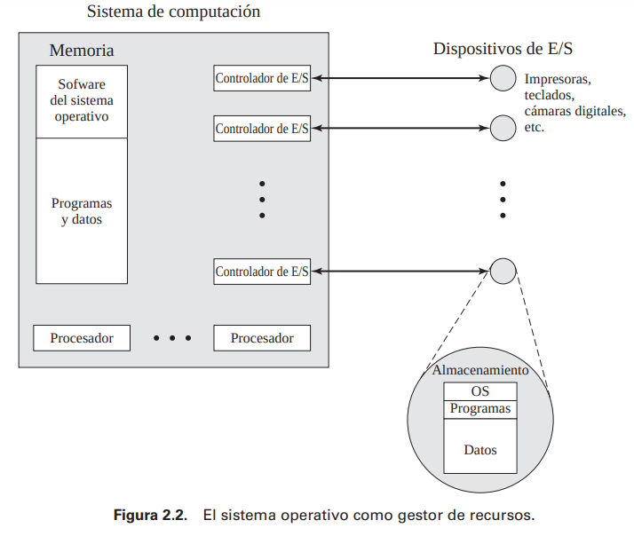

**Nucleo** / **kernel**: Una porción del sistema operativo se encuentra en la **memoria principal**. Contiene las funciones del sistema operativo más frecuentemente utilizadas y, en cierto momento, otras porciones del sistema operativo actualmente en uso. El resto de la memoria principal contiene programas y datos de usuario.

El sistema operativo decide cuándo un programa en ejecución puede utilizar un dispositivo de E/S y controla el acceso y uso de los ficheros. El procesador es también un recurso, y el sistema operativo debe determinar cuánto tiempo de procesador debe asignarse a la ejecución de un programa de usuario particular.

### Capacidad de evolución

Un sistema operativo importante debe evolucionar en el tiempo por las siguientes razones:
* Actualizaciones de hardware más nuevos tipos de hardware.
* Nuevos servicios
* Resolución de fallos

## Evolución de un SO

Para comprender los requisitos claves de un sistema operativo y el significado de las principales características de un sistema operativo contemporáneo, es útil considerar la evolución de los sistemas operativos a lo largo de los años.

### Procesamiento serie

Con los primeros computadores, desde finales de los años 40 hasta mediados de los años 50, el programador interaccionaba **directamente** con el **hardware** del computador; no existía ningún sistema operativo.

Estas máquinas eran utilizadas desde una consola que contenía luces, interruptores, algún dispositivo de entrada y una impresora. 

Los programas en **código máquina** se cargaban a través del dispositivo de entrada (por ejemplo, un lector de **tarjetas**). Si un error provocaba la parada del programa, las **luces** indicaban la condición de **error**. 

El programador podía entonces **examinar** los **registros** del procesador y la memoria principal para determinar la causa de error. Si el programa terminaba de forma normal, la salida aparecía en la impresora.

Estos sistemas iniciales presentaban dos problemas principales:

* **Planificación**. La mayoría de las instalaciones utilizaban una **plantilla impresa** para **reservar tiempo de máquina**. Típicamente, un usuario podía solicitar un bloque de tiempo en múltiplos de **media hora** aproximadamente. Un usuario podía obtener una hora y terminar en 45 minutos; esto implicaba **malgastar tiempo** de procesamiento del computador.
* **Tiempo de configuración**. Un único programa, denominado trabajo, podía implicar la **carga en memoria** del **compilador** y del **programa** en lenguaje de alto nivel (programa en código fuente) y a continuación la carga y el enlace del programa objeto y las funciones comunes. Cada uno de estos pasos podían suponer **montar** y **desmontar** cintas o configurar **tarjetas**. Si ocurría un error, el desgraciado usuario normalmente tenía que **volver al comienzo** de la secuencia de configuración. Por tanto, se utilizaba una cantidad considerable de tiempo en configurar el programa que se iba a ejecutar.

Este modo de operación puede denominarse procesamiento serie, para reflejar el hecho de que los usuarios acceden al computador en serie.

### Sistemas en lotes sencillos

La idea central bajo el esquema de procesamiento en lotes sencillo es el uso de una pieza de **software** denomina **monitor**. Con este tipo de sistema operativo, el usuario no tiene que acceder directamente a la máquina. En su lugar, el usuario **envía** un **trabajo** a través de una **tarjeta** o cinta al operador del computador, que crea un **sistema por lotes** con todos los trabajos enviados y coloca la **secuencia de trabajos** en el dispositivo de **entrada**, para que lo utilice el **monitor**. Cuando un programa finaliza su procesamiento, devuelve el control al monitor, punto en el cual dicho monitor comienza la carga del siguiente programa.

El monitor realiza una función de **planificación**: en una **cola** se sitúa un **lote de trabajos**, y los trabajos se ejecutan lo más rápidamente posible, sin ninguna clase de tiempo ocioso entre medias. Además, el monitor mejora el **tiempo de configuración** de los trabajos. Con cada uno de los trabajos, se incluye un conjunto de **instrucciones** en algún formato primitivo de **lenguaje de control de trabajos** (Job Control Language, JCL).

El monitor, o sistema operativo en lotes, es simplemente un programa. Éste **confía** en la habilidad del procesador para **cargar instrucciones** de diferentes porciones de la memoria principal que de forma alternativa le permiten tomar y abandonar el control. Otras características hardware son también deseables:

* **Protección de memoria**. Durante la ejecución del programa de usuario, éste no debe alterar el área de memoria que contiene el monitor. Si esto ocurriera, el hardware del procesador debe detectar un error y transferir el control al monitor. El monitor entonces abortará el trabajo, imprimirá un mensaje de error y cargará el siguiente trabajo.
* **Temporizador**. Se utiliza un temporizador para evitar que un único trabajo monopolice el sistema. 
* **Instrucciones privilegiadas**. Ciertas instrucciones a nivel de máquina se denominan privilegiadas y sólo las puede ejecutar el monitor.
* **Interrupciones**. Los modelos de computadores iniciales no tenían esta capacidad. Esta característica proporciona al sistema operativo más flexibilidad para dejar y retomar el control desde los programas de usuario.

Ciertas consideraciones sobre la protección de memoria y las instrucciones privilegiadas llevan al concepto de **modos de operación**. Un programa de usuario ejecuta en **modo usuario**, en el cual los usuarios no pueden acceder a ciertas áreas de memoria y no puede ejecutar ciertas instrucciones. El monitor ejecuta en **modo sistema**, o lo que se denomina modo núcleo, en el cual se pueden ejecutar instrucciones privilegiadas y se puede acceder a áreas de memoria protegidas.

### Sistemas en lotes multiprogramados

El procesador se encuentra frecuentemente ocioso, incluso con el secuenciamiento de trabajos automático que proporciona un sistema operativo en lotes simple. El problema consiste en que los dispositivos de E/S son lentos comparados con el procesador. El procesador ejecuta instrucciones durante cierto tiempo hasta que alcanza una instrucción de E/S. Entonces debe esperar que la instrucción de E/S concluya antes de continuar (**Monoprogramación**).

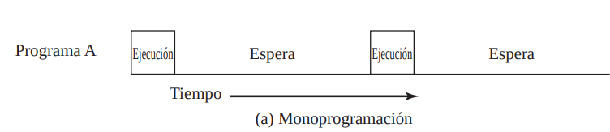

Esta ineficiencia puede evitarse. Se sabe que existe suficiente memoria para contener al sistema operativo (monitor residente) y un programa de usuario. Supóngase que hay espacio para el sistema operativo y dos programas de usuario. Cuando un trabajo necesita **esperar** por la E/S, se puede **asignar** el procesador al **otro trabajo**, que probablemente no esté esperando por una operación de E/S. Más aún, se puede expandir la memoria para que albergue tres, cuatro o más programas y pueda haber **multiplexación** entre todos ellos. Este enfoque se conoce como **multiprogramación** o multitarea. Es el tema central de los sistemas operativos modernos.

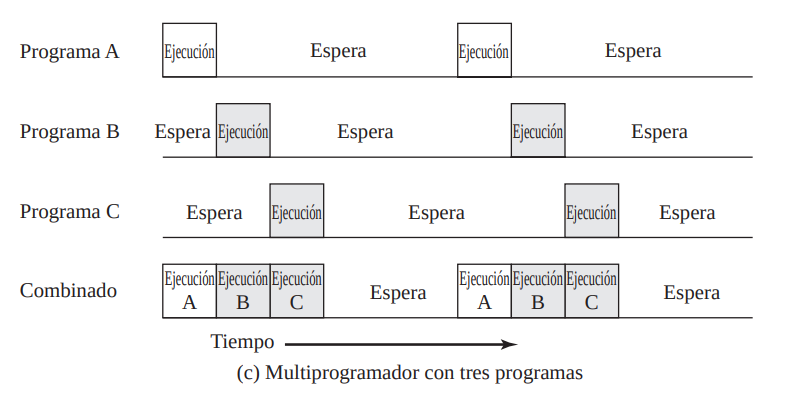

Del mismo modo que un sistema en lotes simple, un sistema en lotes multiprogramado también debe basarse en ciertas características hardware del computador. La característica adicional más notable que es útil para la multiprogramación es el hardware que soporta las **interrupciones** de E/S y **DMA** (Direct Memory Access: acceso directo a memoria). Con la E/S gestionada a través de interrupciones o DMA, el procesador puede solicitar un mandato de E/S para un trabajo y continuar con la ejecución de otro trabajo mientras el controlador del dispositivo gestiona dicha operación de E/S. Cuando esta última operación finaliza, el procesador **es interrumpido** y se pasa el control a un programa de tratamiento de interrupciones del sistema operativo. Entonces, el sistema operativo pasará el control a otro trabajo.

Los sistemas operativos multiprogramados son bastante **sofisticados**, comparados con los sistemas monoprogramados. Para tener varios trabajos listos para ejecutar, éstos deben guardarse en memoria principal, requiriendo alguna forma de **gestión de memoria**. Adicionalmente, si varios trabajos están listos para su ejecución, el procesador debe decidir **cuál** de ellos **ejecutar**; esta decisión requiere un **algoritmo** para **planificación**.

### Sistemas de tiempo compartido

la técnica se denomina **tiempo compartido** porque se **comparte** el **tiempo** de **procesador** entre **múltiples usuarios**. En un sistema de tiempo compartido, múltiples usuarios acceden **simultáneamente** al **sistema** a través de **terminales**, siendo el sistema operativo el encargado de entrelazar la ejecución de cada programa de usuario en pequeños intervalos de tiempo o cuantos de computación.

Ambos tipos de procesamiento, en lotes y tiempo compartido, utilizan **multiprogramación**.

La compartición de tiempo y la multiprogramación implican nuevos problemas para el sistema operativo. Si existen múltiples trabajos en memoria, éstos deben protegerse para evitar que interfieran entre sí, por ejemplo, a través de la modificación de los datos de los mismos. Con múltiples usuarios interactivos, el sistema de ficheros debe ser protegido, de forma que sólo usuarios autorizados tengan acceso a un fichero particular. También debe gestionarse los conflictos entre los recursos, tal como impresoras y dispositivos de almacenamiento masivo. 

## Principales logros

Se proponen propone cinco principales **avances teóricos** en el desarrollo de los sistemas operativos:
* Procesos.
* Gestión de memoria.
* Protección y seguridad de la información.
* Planificación y gestión de los recursos.
* Estructura del sistema.

### Procesos

Es un término un poco más general que el de trabajo. Se han dado muchas definiciones del término proceso, incluyendo:

* Un programa en **ejecución**.
* Una instancia de un programa **ejecutándose** en un computador.
* La **entidad** que se **puede** asignar o **ejecutar** en un procesador.
* Una unidad de actividad caracterizada por un solo hilo secuencial de ejecución, un estado actual, y un conjunto de recursos del sistema asociados.

Tres líneas principales de desarrollo del sistema de computación crearon problemas de temporización y sincronización que contribuyeron al desarrollo del concepto de proceso:
* **operación en lotes multiprogramados**: la multiprogramación se diseñó para permitir el uso simultáneo del procesador y los dispositivos de E/S, incluyendo los dispositivos de almacenamiento, para alcanzar la máxima eficiencia.
* **tiempo compartido**:el objetivo clave de diseño es responder a las necesidades del usuario y, debido a razones económicas, ser capaz de soportar muchos usuarios simultáneamente. 
* **sistemas de transacciones de tiempo real**: un cierto número de usuarios realizan consultas o actualizaciones sobre una base de datos. 

El diseño del software del sistema para **coordinar** estas diversas actividades resultó ser notablemente **difícil**. Con la progresión simultánea de muchos trabajos, cada uno de los cuales suponía la realización de numerosos pasos para su ejecución secuencial, era **imposible** analizar **todas** las posibles **combinaciones** de secuencias de eventos.

Con la ausencia de algún **método** sistemático de **coordinación** y **cooperación** entre las actividades, los programadores acudían a métodos «ad hoc» basados en la comprensión del entorno que el sistema operativo tenía que controlar. Estos esfuerzos eran vulnerables frente a **errores** de programación sutiles, cuyos efectos sólo podían observarse cuando ciertas extrañas secuencias de acciones ocurrían.

Estos errores eran difíciles de diagnosticar, porque necesitaban distinguirse de los errores software y hardware de las aplicaciones. Incluso cuando se detectaba el error, era difícil determinar la **causa**, porque las condiciones precisas bajo las cuales el error aparecía, eran difíciles de reproducir. En términos generales, existen cuatro causas principales de dichos errores:

* **Inapropiada sincronización**: Es frecuente el hecho de que una rutina se suspenda esperando por algún evento en el sistema. Por ejemplo, un programa que inicia una lectura de E/S debe esperar hasta que los datos estén disponibles en un buffer antes de proceder. En este caso, se necesita una señal procedente de otra rutina. El diseño inapropiado del mecanismo de señalización puede provocar que las señales se pierdan o se reciban señales duplicadas.
* **Violación de la exclusión mutua**: Frecuentemente, más de un programa o usuario intentan hacer uso de recursos compartidos simultáneamente. Por ejemplo, dos usuarios podrían intentar editar el mismo fichero a la vez. Si estos accesos no se controlan, podría ocurrir un error.
* **Operación no determinista de un programa**: Los resultados de un programa particular normalmente dependen sólo de la entrada a dicho programa y no de las actividades de otro programa en un sistema compartido. Pero cuando los programas comparten memoria, y sus ejecuciones son entrelazadas por el procesador, podrían interferir entre ellos, sobreescribiendo zonas de memoria comunes de una forma impredecible. Por tanto, el orden en el que diversos programas se planifican puede afectar a la salida de cualquier programa particular.
* **Interbloqueos**: Es posible que dos o más programas se queden bloqueados esperándose entre sí. Por ejemplo, dos programas podrían requerir dos dispositivos de E/S para llevar a cabo una determinada operación (por ejemplo, una copia de un disco o una cinta). Uno de los programas ha tomado control de uno de los dispositivos y el otro programa tiene control del otro dispositivo. Cada uno de ellos está esperando a que el otro programa libere el recurso que no poseen. Dicho interbloqueo puede depender de la temporización de la asignación y liberación de recursos.

Lo que se necesita para enfrentarse a estos problemas es una **forma sistemática** de **monitorizar** y **controlar** la **ejecución** de **varios programas** en el procesador. El concepto de **proceso** proporciona los fundamentos. Se puede considerar que un proceso está formado por los siguientes **tres componentes**:

* Un **programa ejecutable**.
* Los **datos asociados** que necesita el programa (variables, espacio de trabajo, buffers, etc.).
* El **contexto** de **ejecución** del programa.

Este último elemento es esencial. El **contexto** de **ejecución**, o estado del proceso, es el conjunto de **datos** interno por el cual el sistema operativo es capaz de supervisar y controlar el proceso. El contexto incluye el contenido de diversos registros del procesador, tales como el contador de programa y los registros de datos. También incluye información de uso del sistema operativo, como la prioridad del proceso y si un proceso está esperando por la finalización de un evento de E/S particular.

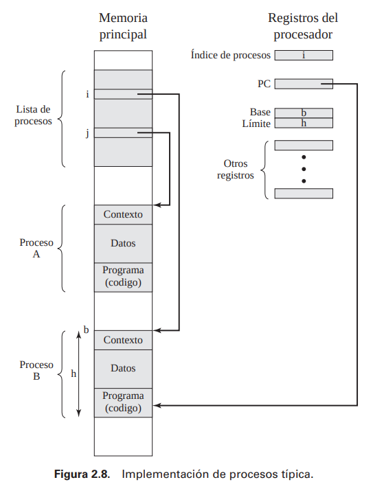

Esta figura indica una forma en la cual los procesos pueden gestionarse. Dos procesos, A y B, se encuentran en una porción de memoria principal. Es decir, se ha asignado un bloque de memoria a cada proceso, que contiene el programa, datos e información de contexto. Se incluye a cada proceso en una lista de procesos que construye y mantiene el sistema operativo. La lista de procesos contiene una entrada por cada proceso, e incluye un puntero a la ubicación del bloque de memoria que contiene el proceso.

el proceso puede verse como una estructura de datos. Un proceso puede estar en ejecución o esperando ejecutarse. El estado completo del proceso en un instante dado se contiene en su contexto. 

Esta estructura permite el desarrollo de técnicas potentes que aseguran la coordinación y la cooperación entre los procesos. Se pueden diseñar e incorporar nuevas características en el sistema operativo (por ejemplo, la prioridad), expandiendo el contexto para incluir cualquier información nueva que se utilice para dar soporte a dicha característica.

### Gestion de memoria

Un entorno de computación que permita **programación modular** y el uso **flexible** de los **datos** puede ayudar a resolver mejor las necesidades de los usuarios. Los gestores de sistema necesitan un **control eficiente** y **ordenado** de la asignación de los recursos. Para satisfacer estos requisitos, el sistema operativo tiene **cinco responsabilidades** principales de **gestión de almacenamiento**:

* **Aislamiento de procesos**. El sistema operativo debe evitar que los procesos independientes **interfieran** en la **memoria** de **otro proceso**, tanto datos como instrucciones.
* **Asignación y gestión automática**. Los programas deben tener una **asignación** dinámica de **memoria** por demanda, en cualquier nivel de la jerarquía de memoria. La asignación debe ser **transparente** al programador. Por tanto, el programador no debe preocuparse de aspectos relacionados con limitaciones de memoria, y el sistema operativo puede lograr incrementar la eficiencia, asignando memoria a los trabajos sólo cuando se necesiten.
* **Soporte a la programación modular**. Los programadores deben ser capaces de definir **módulos** de programación y crear, destruir, y alterar el tamaño de los módulos dinámicamente.
* **Protección y control de acceso**. La **compartición de memoria**, en cualquier nivel de la jerarquía de memoria, permite que un programa direccione un espacio de memoria de otro proceso. Esto es deseable cuando se necesita la compartición por parte de determinadas aplicaciones. Otras veces, esta característica amenaza la integridad de los programas e incluso del propio sistema operativo. El sistema operativo debe permitir que varios usuarios puedan **acceder** de **distintas formas a porciones** de memoria.
* **Almacenamiento a largo plazo**. Muchas aplicaciones requieren formas de almacenar la información durante largos periodos de tiempo, después de que el computador se haya apagado.

El sistema operativo implementa un almacenamiento a **largo plazo**, con la información almacenada en objetos denominados **ficheros**. El fichero es un **concepto lógico**, conveniente para el programador y es una unidad útil de control de acceso y protección para los sistemas operativos.

La **memoria** virtual es una utilidad que permite a los programas direccionar la memoria desde un punto de vista **lógico**, sin importar la **cantidad** de memoria principal **física disponible**. La memoria virtual fue concebida como un método para tener **múltiples trabajos** de usuario residiendo en memoria principal de forma **concurrente**, de forma que no exista un intervalo de tiempo de espera entre la ejecución de procesos sucesivos, es decir, mientras un proceso se escribe en almacenamiento secundario y se lee el proceso sucesor.

Debido a que los procesos **varían** de **tamaño**, si el procesador planifica un determinado número de procesos, es **difícil almacenarlos** compactamente en **memoria principal**. Se introdujeron los sistemas de **paginación**, que permiten que los procesos se **compriman** en un número determinado de bloques de **tamaño fijo**, denominados **páginas**.

Un programa referencia una palabra por medio de una **dirección virtual**, que consiste en un **número de página** y un **desplazamiento** dentro de la página. Cada página de un proceso se puede localizar en **cualquier sitio** de **memoria principal**. El sistema de paginación proporciona una **proyección dinámica** entre las **direcciones virtuales** utilizadas en el programa y una dirección real, o **dirección física**, de memoria principal.

**Todas** las **páginas** de un proceso se mantienen en **disco**. Cuando un proceso está en **ejecución**, algunas de sus páginas se encuentran en **memoria principal**. Si se referencia una página que no está en memoria principal, el hardware de gestión de memoria lo detecta y permite que la página que falta se **cargue**.

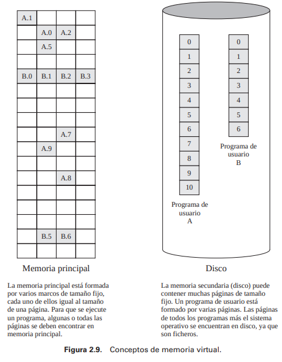

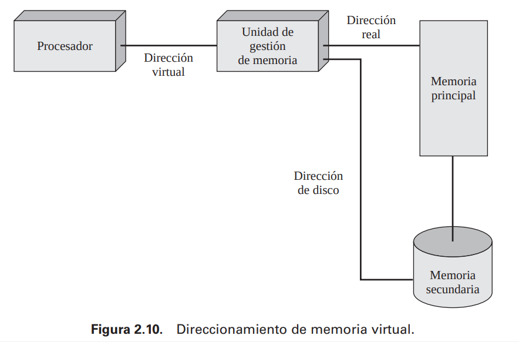

### Planificación y gestión de los recursos.

Una responsabilidad clave de los sistemas operativos es la **gestión** de varios **recursos disponibles** para ellos (espacio de memoria principal, dispositivos de E/S, procesadores) y para **planificar** su **uso** por parte de los distintos **procesos activos**. Cualquier asignación de recursos y política de planificación debe tener en cuenta **tres factores**:

* **Equitatividad**. Normalmente, se desea que todos los procesos que compiten por un determinado recurso, se les conceda un **acceso equitativo** a dicho recurso. Esto es especialmente cierto para trabajos de la misma categoría, es decir, trabajos con demandas similares.
* **Respuesta diferencial**. Por otro lado, el sistema operativo puede necesitar **discriminar** entre diferentes clases de trabajos con **diferentes requisitos** de servicio. El sistema operativo debe tomar las decisiones de **asignación** y **planificación** con el objetivo de **satisfacer** el **conjunto total** de **requisitos**. Además, debe tomar las decisiones de forma dinámica. Por ejemplo, si un proceso está esperando por el uso de un dispositivo de E/S, el sistema operativo puede intentar planificar este proceso para su ejecución tan pronto como sea posible a fin de liberar el dispositivo para posteriores demandas de otros procesos.
* **Eficiencia**. El sistema operativo debe intentar **maximizar** la **productividad**, **minimizar** el **tiempo** de **respuesta**, y, en caso de sistemas de tiempo compartido, acomodar tantos usuarios como sea posible.

La siguiente figura sugiere los principales elementos del sistema operativo relacionados con la planificación de procesos y la asignación de recursos en un entorno de multiprogramación.

El sistema operativo mantiene un número de **colas**, cada una de las cuales es simplemente una **lista de procesos** esperando por algunos recursos.

La cola a **corto plazo** está compuesta por procesos que se encuentran en memoria principal y están **listos** para **ejecutar**, siempre que el procesador esté disponible. Cualquiera de estos procesos podría usar el procesador a continuación. Es responsabilidad del planificador a corto plazo, o **dispatcher**, elegir uno de ellos. Una estrategia común es asignar en orden a cada proceso de la cola un **intervalo de tiempo**; esta técnica se conoce como **round-robin** o turno rotatorio. En efecto, la técnica de turno rotatorio emplea una cola circular.

La cola a **largo plazo** es una lista de nuevos trabajos esperando a utilizar el procesador. El sistema operativo añade trabajos al sistema transfiriendo un proceso **desde** la cola a largo plazo **hasta** la cola a corto plazo. En este punto, se debe asignar una **porción** de **memoria principal** al **proceso entrante**. Por tanto, el sistema operativo debe estar seguro de que **no sobrecarga** la **memoria** o el tiempo de procesador admitiendo demasiados procesos en el sistema. 

Hay una **cola de E/S** por cada **dispositivo** de E/S. Más de un proceso puede solicitar el uso del mismo dispositivo de E/S. Todos los **procesos** que esperan **utilizar dicho dispositivo**, se encuentran alineados en la **cola** del dispositivo. De nuevo, el sistema operativo debe determinar a qué proceso le asigna un dispositivo de E/S disponible.

Si ocurre una **interrupción**, el sistema operativo recibe el control del procesador a través de un **manejador de interrupciones**.

Un proceso puede invocar específicamente un servicio del sistema operativo, tal como un manejador de un dispositivo de E/S, mediante una **llamada a sistema**. Una vez que se maneja la interrupción o la llamada a sistema, se invoca al planificador a corto plazo para que seleccione un proceso para su ejecución.

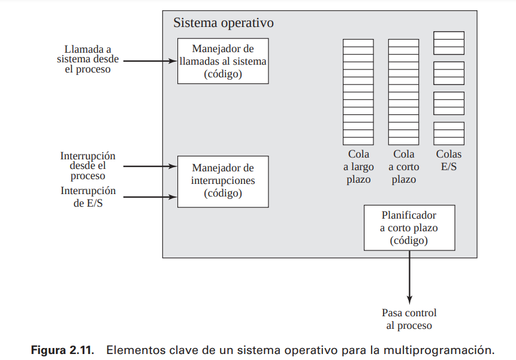

### Estructura del sistema.

El tamaño de un sistema operativo con un conjunto completo de características, y la dificultad del problema que afronta dicho sistema, ha llevado a esta disciplina a **cuatro** desafortunados, aunque demasiado comunes, **problemas**. 
* Los sistemas operativos se entregan tarde de forma crónica. 
* Los sistemas tienen fallos latentes que deben ser planteados y resueltos. 
* El rendimiento no es frecuentemente el esperado. 
* Se ha comprobado que es imposible construir un sistema operativo complejo que no sea vulnerable a una gran cantidad de ataques de seguridad, incluyendo virus, gusanos y accesos no autorizados.

Para gestionar la complejidad de los sistemas operativos y eliminar estos problemas, se ha puesto mucho énfasis en la estructura software del sistema operativo a lo largo de los años. Ciertos puntos parecen obvios. El software debe ser **modular**. Esto ayudará a organizar el proceso de desarrollo de software y limitará el esfuerzo de diagnosticar y corregir errores. Los módulos deben tener **interfaces bien definidas**, y estas interfaces deben ser tan **sencillas** como sea posible. De nuevo, esto facilita la programación. También facilita la evolución del sistema. Con mínimas interfaces entre los módulos, se puede modificar un módulo con un mínimo impacto en otros módulos.

Para sistemas operativos grandes no es suficiente la programación modular. La **estructura jerárquica** de un sistema operativo moderno separa sus **funciones** de acuerdo a las características de su escala de **tiempo** y su **nivel de abstracción**. Se puede ver el sistema como una serie de **niveles**. Cada nivel realiza un subconjunto relacionado de funciones requeridas por el sistema operativo. Dicho nivel confía en los niveles inmediatamente **inferiores** para realizar funciones más **primitivas** y **ocultar** los **detalles** de esas funciones. Cada nivel proporciona servicios a la capa inmediatamente **superior**. Idealmente, estos niveles deben definirse de tal forma que los cambios en un nivel no requieran cambios en otros niveles. Por tanto, de esta forma se ha descompuesto un problema en un número de subproblemas más manejables.

En general, las capas **inferiores** tratan con una escala de **tiempo menor**. Algunas partes del sistema operativo deben interaccionar directamente con el **hardware** del computador, donde los eventos pueden tener una escala de tiempo tan ínfima como unas pocas mil millonésimas de segundo. En el otro extremo del espectro, algunas partes del sistema operativo se comunican con el **usuario**, que invoca mandatos en una escala de tiempo mucho más larga, tal vez unos pocos **segundos**. El uso de un conjunto de niveles se adapta adecuadamente a este entorno.

* **Nivel 1**. Está formado por **circuitos electrónicos**, donde los objetos tratados son **registros**, **celdas** de **memoria**, y **puertas lógicas**. Las operaciones definidas en estos objetos son acciones,
como poner a cero un registro o leer una posición de memoria.
* **Nivel 2**. El conjunto de **instrucciones** del **procesador**. Las operaciones a este nivel son aquéllas permitidas en el conjunto de instrucciones de lenguaje máquina, como adición, resta, carga o almacenamiento.
* **Nivel 3**. Añade el concepto de **procedimiento** o **subrutina**, más las operaciones de llamada y retorno (call/return).
* **Nivel 4**. Introduce las **interrupciones**, que permiten al procesador guardar el contexto actual e invocar una rutina de tratamiento de interrupciones.

Estos cuatros primeros niveles no son parte del sistema operativo, sino que constituyen el **hardware** del **procesador**.

* **Nivel 5**. En este nivel se introduce la noción de un **proceso** como un **programa en ejecución**. Los requisitos fundamentales de los sistemas operativos para dar soporte a múltiples procesos incluyen la habilidad de **suspender** y **continuar** los **procesos**.
* **Nivel 6**. Trata los dispositivos de **almacenamiento secundario** del computador. En este nivel, se dan las funciones para posicionar las cabezas de lectura/escritura y la transferencia real de bloques. El Nivel 6 delega al Nivel 5 la planificación de la operación y la notificación al proceso solicitante de la finalización de la misma. Niveles más altos se preocupan de la dirección en el disco de los datos requeridos y proporcionan una petición del bloque de datos apropiado a un controlador de dispositivo del Nivel 5.
* **Nivel 7**. Crea un espacio de **direcciones lógicas** para los **procesos**. Este nivel organiza el espacio de **direcciones virtuales** en bloques que pueden moverse entre memoria principal y memoria secundaria.

Hasta este punto, el sistema operativo trata con los recursos de un **único procesador**. Comenzando con el Nivel 8, el sistema operativo trata con **objetos externos**, como dispositivos periféricos y posiblemente redes y computadores conectados a la red.

* **Nivel 8**. Trata con la comunicación de información y **mensajes entre** los **procesos**. Una de las herramientas más potentes para este propósito es la **tubería** o **pipe**, que es un canal lógico para el flujo de datos entre los procesos. Una tubería se define por su salida de un proceso y su entrada en otro proceso.
* **Nivel 9**. Da soporte al **almacenamiento** a **largo plazo** en **ficheros** con nombre. En este nivel, los datos en el almacenamiento secundario se ven en términos de entidades **abstractas** y con **longitud variable**.
* **Nivel 10**. Proporciona acceso a los **dispositivos externos** utilizando **interfaces estándar**.
* **Nivel 11**. Es el nivel responsable para mantener la asociación entre los **identificadores externos** e internos de los recursos y objetos del sistema. El identificador externo es un nombre que puede utilizar una aplicación o usuario. El identificador interno es una dirección de otro identificador que puede utilizarse por parte de los niveles inferiores del sistema operativo para localizar y controlar un objeto. 
* **Nivel 12**. Proporciona una utilidad completa para dar **soporte** a los **procesos**. Se da soporte a toda la información necesaria para la gestión ordenada de los procesos. Esto incluye el espacio de direcciones virtuales de los procesos, una lista de objetos y procesos con la cual puede interactuar y las restricciones de esta interacción, parámetros pasados al proceso en la creación.
* **Nivel 13**. Proporciona una **interfaz** del sistema operativo al **usuario**. Se denomina **shell** (caparazón), porque separa al usuario de los detalles de los sistemas operativos y presenta el sistema operativo simplemente como una **colección** de **servicios**. El shell acepta mandatos de usuario o sentencias de control de trabajos, los interpreta y crea y controla los procesos que necesita para su ejecución.

# Software libre y linux

El termino software libre se refiere a que un usuario goza de las siguientes libertades:
* La libertad de **usar** el programa, con cualquier propósito.
* La libertad de estudiar cómo funciona el programa y adaptarlo a sus necesidades. El **acceso al código fuente** es una condición previa para esto.
* La libertad de **distribuir copias**.
* La libertad de **mejorar** el programa y hacer **públicas** las **mejoras** a los demás, de modo que toda la comunidad se beneficie.

## Categorias del software

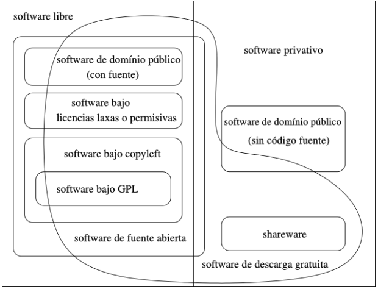

**Software Libre**

El software libre es software que viene con autorización para que cualquiera pueda **usarlo**, **copiarlo** y **distribuirlo**, ya sea literalmente o con modificaciones, gratis mediante una gratificación. En particular, esto significa que **código fuente** debe estar **disponible**.

**Software de Dominio Público**

El software de **dominio público** software que no está protegido con copyright, ósea no tiene derechos de autor. Un programa ejecutable puede ser de dominio público pero no disponer libremente del código fuente. En ese caso no es software libre, porque el software libre requiere **accesibilidad al código fuente**. Por otro lado, la mayoría del software libre no está en el dominio público sino bajo los derechos de autor, y los titulares de esos derechos han dado el permiso legal para que todos puedan utilizarlo en libertad, usando una licencia de software libre.

**Software protegido con Copyleft**

El software protegido con copyleft es software libre cuyos términos de distribución no** permiten** a los redistribuidores agregar ninguna **restricción adicional** cuando éstos **redistribuyen** o modifican el software. Copyleft es un concepto general: para poner un programa bajo copyleft, es necesario adoptar un conjunto específico de **cláusulas** para la **distribución**. Existen varias maneras de redactar las cláusulas de copyleft, por lo que en principio pueden existir muchas licencias libres con copyleft. Sin embargo, en la práctica, para casi todo el software con copyleft se usa la Licencia Pública General de **GNU** (GNU General Public License).

**Software abarcado por GPL**

La GPL(General Public License/Licencia Pública General) de GNU es un conjunto específico de **términos de distribución** para publicar programas con copyleft.

**Software GNU**

Es software que es liberado bajo el auspicio del Proyecto GNU. La mayoría del software GNU está protegido con copyleft. Todo el software GNU debe ser software libre.

**Software Semilibre**

El software semilibre es software que no es libre, pero viene con **autorización** para particulares de **usar**, **copiar**, **distribuir** y **modificar**(incluyendo la distribución de versiones modificadas) **sin fines de lucro**.

**Software Propietario**

El software propietario es software que no es libre ni semilibre. Su uso, redistribución o modificación está **prohibida**, o requiere que usted solicite **autorización** o está tan restringida que no pueda hacerla libre de un modo efectivo.

**Freeware**

El término “freeware” es usado comúnmente para paquetes que permiten la **redistribución** pero no la **modificación**(y su código fuente no está disponible). Estos paquetes no son software libre.

**Shareware**

El término “shareware” es software que viene con autorización para la gente de **redistribuir** copias, pero dice que quien continúe haciendo uso de una copia deberá **pagar** un **cargo** por **licencia**.

**Software Comercial**

El software comercial es software que está siendo desarrollado por una entidad que tiene la intención de hacer dinero del uso del software. “Comercial” y “Propietario” no son la misma cosa. La mayoría del software comercial es propietario, pero hay **software libre comercial** y hay software no libre no comercial.

**Freemium**

El modelo freemium es un modelo de negocio en el que la mayor parte de los servicios se ofrecen de manera **gratuita** (freemium), aunque existe un pequeño paquete de servicios de pago (**premium**) para algunos clientes que lo deseen.

## Linux

### Introducción

Linux es un **sistema operativo multitarea** y **multiusuario** que corre en diversas plataformas de hardware: Intel, Alpha, SPARC, MIPS, PowerPC y que se distribuye libremente bajo los términos de la licencia **GPL** de **GNU**. Fue creado por **Linus Torvalds** a comienzos de los ’90 y actualmente es desarrollado y mantenido por una **multitud** de **desarrolladores** distribuidos por todo el mundo. Su objetivo principal es propulsar el software de libre distribución junto con su código fuente para que pueda ser modificado por cualquier persona, dando rienda suelta a la creatividad.

### Caracteristicas

**Software Libre**

Linux se distribuye bajo los términos de la **Licencia Pública General** de **GNU**, lo cual garantiza que puede ser usado, estudiado, copiado y modificado sin restricciones de ningún tipo, salvo aquellas que impiden que esto deje de ser así(copyleft).

**Multitarea**

Se pueden llevar a cabo **múltiples tareas**(o procesos) en forma simultánea y se pueden acceder múltiples
dispositivos al mismo tiempo.

**Multiusuario**

**Varios usuarios** pueden acceder a las aplicaciones y recursos del sistema Linux al **mismo tiempo**. Y, por supuesto, cada uno de ellos puede ejecutar varios programas a la vez(multitarea).

**Multiplataforma**

Linux puede correr en casi **cualquier plataforma** Actualmente se ejecuta en plataformas Intel, Sparc, Alpha, MIPS, PowerPC, ARM y hasta en Mainframes de IBM (S/390).

**Protección de memoria entre procesos**

De manera que ninguno de ellos pueda colgar el sistema.

**Carga de ejecutables por demanda**

Linux sólo lee de disco aquellas partes de un programa que están siendo usadas actualmente.

**Memoria virtual con paginación por demanda**

Linux utiliza una porción del disco como memoria virtual, incrementando así la eficiencia del sistema al mantener los procesos activos en memoria RAM y ubicando los procesos que son utilizados menos frecuentemente o porciones inactivas de memoria en el disco.

**Librerías compartidas**

Cada aplicación comparte una librería común de subrutinas que puede llamar en tiempo de ejecución.
Compatible POSIX.1 y UNIX.

### El kernel

El kernel o núcleo de Linux se podría definir como el corazón de este sistema operativo y cuando hablamos de Linux, en realidad nos deberíamos referir al Kernel. Es el encargado de que el software y el hardware puedan trabajar juntos.

Sus funciones más importantes, aunque no las únicas, son:
* Administración del **sistema**.
* Administración de la **memoria** física y virtual para los procesos en ejecución.
* Manejo de **periféricos** y dispositivos de nuestro ordenador.

Las versiones del kernel se numeran con 3 números, de la siguiente forma: XX.YY.ZZ, donde:
* **XX**: Indica la **serie principal** del kernel. Hasta el momento sólo existen la 1 y 2 (existe hasta la 5 - 23-08-22). Este número cambia cuando la manera de funcionamiento del kernel ha sufrido un cambio muy importante.
* **YY**: Indica si la versión es de **desarrollo** o de **producción**. Un numero **impar**, significa que es de desarrollo, uno **par**, que es de producción.
* **ZZ**: Indica nuevas **versiones** dentro de una versión, en las que lo único que se ha modificado, son fallos de programación o bugs.

## Arranque

Una de las características más importantes y poderosas de Linux es el método abierto y configurable para el inicio y cierre del sistema operativo. Los usuarios son libres de configurar muchos aspectos del proceso de arranque, incluyendo qué programas se lanzarán al momento de arranque.

El proceso de arranque en un sistema Linux ocurre de la siguiente manera:

1. La **BIOS** del sistema comprueba y lanza la **primera etapa** del gestor de arranque del **MBR**(por Mater Boot Record) del disco duro primario (GPT ?).
2. La primera etapa del gestor de arranque se **autocarga** en memoria y lanza la **segunda etapa** del gestor de arranque desde la partición **/boot/**.
3. La segunda etapa del gestor de arranque **carga el kernel** en memoria, el cual en su momento carga los **módulos** necesarios y monta la **partición root** para sólo-lectura.
4. El kernel transfiere programa **/sbin/init**.
5. El programa /sbin/init carga todos los **servicios** y **herramientas** de espacio del usuario y monta todas las **particiones** listadas en **/etc/fstab**.
6. Se presenta al usuario un prompt de **login** de comandos para el sistema Linux apenas arrancado.

En el momento de arranque de una máquina x86, el procesador busca al final de la memoria del sistema el programa de la **BIOS** y lo ejecuta. La BIOS controla no sólo el primer paso del proceso de arranque, sino que también proporciona una interfaz de bajo nivel para dispositivos periféricos. 

Una vez que se haya cargado, la BIOS chequea los **periféricos** y localiza un dispositivo con el que **arrancar** el sistema desde el que carga en memoria cualquier programa que resida en el primer sector de este dispositivo, llamado Master Boot Record o **MBR** (ahora existe **GPT**). La MBR sólo tiene 512 bytes de tamaño y contiene las **instrucciones** de código de máquina para el arranque del equipo, llama un **gestor de arranque** (Grub) así como también la **tabla de particiones**. Una vez que la BIOS haya encontrado y cargado el gestor de arranque en memoria, le deja el control del proceso de arranque a éste.

Los **gestores de arranque** de Linux (Grub) para la plataforma x86 se dividen en dos etapas:

La primera es un **código binario** de máquina pequeña en el MBR. Su única función es la de localizar el gestor de arranque de la **segunda etapa** y cargar la primera parte de éste en memoria. 

La segunda etapa del gestor de arranque es usar la información del MBR para determinar las **opciones** de **arranque** disponibles para el usuario. Esto significa que cada vez que se produzca un cambio en la configuración o se actualice el kernel de forma manual, se debe ejecutar un comando para escribir la información apropiada al MBR (actualizar el Grub ?). 

Una vez que el gestor de arranque de la segunda etapa está en memoria, presenta al usuario la **pantalla inicial** mostrando los diferentes sistemas operativos o kernels que se han configurado para arrancar.

Una vez que el gestor de arranque de la segunda etapa haya determinado qué kernel arrancar, localizará el **binario** del **kernel correspondiente** en el directorio /boot/. El kernel binario es llamado usando el siguiente formato: /boot/vmlinuz-kernel-version 

Cuando el **kernel** se carga, inmediatamente se inicializa y configura la **memoria** del ordenador y los diferentes dispositivos de hardware conectados al sistema, incluyendo procesadores, subsistemas de entrada/salida y dispositivos de almacenamiento.

A continuación buscará la imagen **initrd** en una ubicación predeterminada en memoria, la descomprimirá, la montará y cargará todos los controladores necesarios.

El kernel luego crea un dispositivo root, monta la partición root como sólo lectura y libera cualquier memoria no utilizada.

El programa **/sbin/init**(también llamado **init**) coordina el resto del proceso de **arranque** y configura el ambiente del usuario. Cuando el comando init arranca, se vuelve el **padre** de todos los **procesos** que comienzan automáticamente en el sistema Linux.

Primero, ejecuta el script **/etc/rc.d/rc.sysinit**, que establece la **ruta** a **otros programas**, activa el swap, controla los sistemas de archivo y se encarga de todo lo que el sistema necesita tener hecho al momento de la inicialización.

El comando init lee su configuración de **/etc/inittab**, que describe cómo el sistema debería configurarse en cada nivel de ejecución del init. 

A continuación, el comando init configura la librería de funciones base
**/etc/rc.d/init.d/functions**. Esto indica el modo en el que se debe empezar o matar un programa y cómo
determinar el PID del programa.

El programa init inicia todos los procesos de fondo buscando en el directorio apropiado rc por el nivel de
ejecución especificado por defecto en **/etc/inittab**.

Los directorios rc están numerados para corresponder al nivel de ejecución que represente. Por ejemplo,
**/etc/rc.d/rc5.d/** es el directorio para el nivel de ejecución 5. Cuando se arranca el nivel de ejecución 5, el programa init consulta el directorio **/etc/rc.d/rc5.d/** para determinar qué procesos iniciar o parar.

## Estructura del sistema de archivos

Un **sistema de archivos** son los **métodos** y **estructuras de datos** que un sistema operativo utiliza para seguir la **pista** de los **archivos** de un **disco** o **partición**; es decir, es la manera en la que se **organizan** los **archivos** en el **disco**.

Un sistema de archivos se podría resumir en términos de dos categorías diferentes de archivos:
* Archivos compartibles vs. no compartibles
* Archivos variables vs. Estáticos

Los archivos **compartibles** son aquéllos a los que se puede acceder desde varios hosts; mientras que los archivos **no compartibles** no están disponibles a todos los hosts.

Los archivos **variables** pueden cambiar en cualquier momento sin una intervención del gestor de sistemas; 

los archivos **estáticos**, tales como documentación, librerías y binarios, no cambian sin una actuación por parte del administrador de sistemas o de una agente que el administrador de sistemas haya escogido para realizar esta tarea.

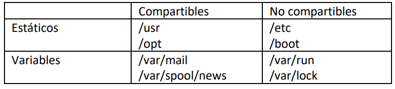

El Estándar de Jerarquía del Sistema de Archivos (más comúnmente llamado [FHS](https://www.pathname.com/fhs/), del inglés Filesystem Hierarchy Standard), el cual es un documento que detalla el propósito de los **directorios** en un sistema **Linux** moderno.

Este estándar consiste en un conjunto de requerimientos y guías para la **ubicación** de **archivos** y **directorios** en sistemas operativos tipo-UNIX. Las guías provistas por FHS buscan tanto garantizar la **interoperabilidad** de las aplicaciones, herramientas de administración, herramientas de desarrollo y scripts como dar una mayor **uniformidad** a la documentación de estos sistemas.

El sistema de archivos raíz se simboliza con un slash (/) y como su nombre lo indica, es la raíz de la cual penden todos los otros sistemas de archivos o directorios. Este sistema de archivos debe contener todo lo necesario para el arranque, la restauración y/o la reparación del sistema. El estándar FHS establece que los siguientes directorios o enlaces simbólicos a directorios deben estar presentes en /:

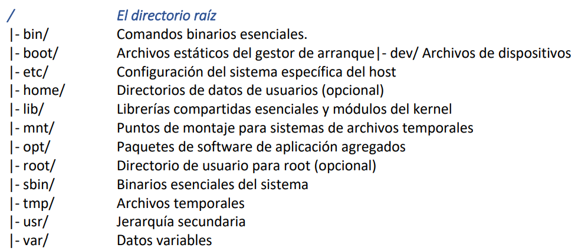

El directorio /usr es uno de los directorios más importantes del sistema puesto que contiene los programas de uso común para todos los usuarios.

### Implementación de un sistema de archivos

Antes de que una partición o disco sea utilizada como un sistema de archivos, necesita ser iniciada, y las estructura de datos necesitan escribirse al disco. Este proceso se denomina construir un sistema de archivos. La mayoría de los sistema de archivos UNIX tienen una estructura general parecida, aunque los detalles exactos pueden variar un poco. Los conceptos centrales son:
* **Superbloque**: tiene información del sistema de archivos en conjunto, como su tamaño
* **Nodo-i**: tiene toda la información de un archivo, salvo su nombre. El nombre se almacena en el directorio, junto con el número de nodo-i. 
* **Bloque de datos**: El nodo-i contiene los números de varios bloques de datos, que se utilizan para almacenar los datos en el archivo. 
* **Entrada de directorio**: consiste en un nombre de archivo y el número de nodo-i que representa al archivo.
* **Bloque indirecto**: Sólo hay espacio para unos pocos números de bloques de datos en el nodo-i; en cualquier caso, si se necesitan más, más espacio para punteros a los bloques de datos son colocados de forma dinámica.

## Sistemas de archivos soportados por linux

* **EXT4**: el NTFS de Linux
* **XFS**: diseñado para sistemas que realizan muchas lecturas y escrituras de datos en los discos.
* **F2FS**: creado para trabajar con unidades basadas en NAND, como memorias USB o, sobre todo, unidades SSD
* **BtrFS**:  fue diseñado por Oracle con la intención de suceder a EXT. Sin embargo, aún no lo ha conseguido.
* **OpenZFS**:  diseñado para funcionar en sistemas RAID