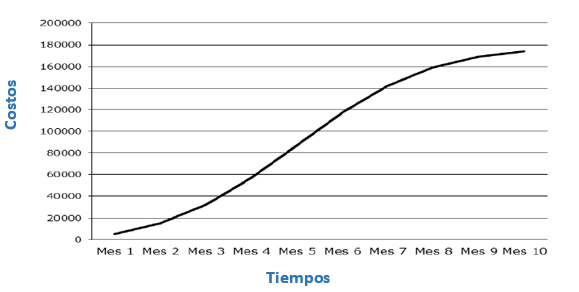

# Administración de proyectos

- [Administración de proyectos](#administración-de-proyectos)
- [Introducción](#introducción)
  - [7 pasos para obtener resultados en proyectos](#7-pasos-para-obtener-resultados-en-proyectos)
    - [1 - Alcance](#1---alcance)
    - [2 - Tiempos](#2---tiempos)
    - [3 - Costos](#3---costos)
    - [4 - Adquisiciones](#4---adquisiciones)
    - [5 - Riesgos](#5---riesgos)
    - [6 - Comunicaciones](#6---comunicaciones)
    - [7 - RACI](#7---raci)
    - [Matriz de planificación](#matriz-de-planificación)
    - [Cierre](#cierre)
- [Preguntas 16-03](#preguntas-16-03)
  - [Verificación vs validación](#verificación-vs-validación)
  - [Función de un ingeniero en sistemas](#función-de-un-ingeniero-en-sistemas)
  - [Hito](#hito)
  - [Release](#release)
  - [Version](#version)
  - [Entregable](#entregable)
  - [Requerimientos](#requerimientos)
  - [Gestión de proyectos de software](#gestión-de-proyectos-de-software)
  - [Las 4 P's](#las-4-ps)
  - [Ambiguedad](#ambiguedad)

# Introducción

## 7 pasos para obtener resultados en proyectos

### 1 - Alcance

Desglozamos el proyecto en partes mas pequeñas y manejables

**Estructura desglozada del trabajo** (EDT): Primero, hay que saber en qué consiste el proyecto. Por ello, el proceso de planificación arranca con la Estructura Desglosada del Trabajo (EDT) que nos permite descomponer un proyecto en partes más pequeñas; es lo más cercano a la célebre estrategia "divide y vencerás"

Su uso no implica muchas reglas, sin embargo, debemos ser muy precisos a la hora de descomponer el proyecto. Es importante tomar en cuenta que no es práctico cuando el alcance se transforma en una lista con cientos de entregables; la EDT sirve para llevar control del proyecto y hacerlo más manejable.

A la hora de descomponer las actividades, vale la pena que pienses en las siguientes **ideas**: 

* Considera el **100%** del alcance del proyecto.                      
* Define la EDT con tu **equipo**, no lo hagas de manera individual. Necesitarás el compromiso de tu equipo para lograr el trabajo que identifiques en tu EDT.   
* Divide el proyecto en partes (entregables) hasta que sean lo suficientemente **fáciles para manejar**, asignarles tiempos, costos y responsables.                            
* Asigna un **código** (número de identificación) a cada entregable que vas obteniendo (ejemplo: 1.1.1. Tres escuelas equipadas).
* Coloca en la EDT el **resultado de las actividades**, no la actividad en sí misma (ejemplo: el resultado de “Instalar 30 equipos de cocina” es “30 equipos de cocina instalados”).
* Crea un **diccionario**, explica ligera pero claramente cada entregable y lo más importante, recuerda que esta herramienta la ven otras personas que no necesariamente saben del proyecto.                                                                              
* Busca la **aprobación** de la EDT y asegúrate que **todos los involucrados** puedan opinar y estar de acuerdo con lo efectuado

### 2 - Tiempos

Definimos un cronograma, es decir, de que forma secuenciamos las actividades y sus tiempos para controlar el alcance del proyecto

Para desarrollar el Cronograma, vamos a:

* Desarrollar **lista de actividades** que nos permita alcanzar cada uno de los entregables del último nivel de la EDT.
* Identificar los **recursos humanos** y **materiales** necesarios para llevar a cabo los entregables. 
* **Secuenciar** el **listado de entregables** considerando las precedencias obligatorias o discrecionales de cada uno.
* **Estimar la duración** de cada uno de los entregables en función de los **recursos** asignados, sus **restricciones**, la **experiencia** y los **registros históricos**.

El Cronograma no solo permite **identificar los entregables** que se deben realizar, sino que también es un **registro** de las **tareas que completaste**.

En muchas ocasiones nos encontramos con la necesidad de **acelerar la programación** del Cronograma y para ello contamos con **2 técnicas** reconocidas:

1. **Intensificación** (Crashing): se asignan **más recursos** al proyecto con el objetivo de acelerar ciertos entregables. Consecuencia negativa: incrementa automáticamente el costo

2. **Ejecución rápida** (Fast Tracking): se llevan a cabo entregables de manera **paralela** que normalmente se ejecutarían en secuencia. Consecuencias negativas: incrementa el riesgo y puede comprometer la calidad del alcance

### 3 - Costos

Podemos ver el avance financiero del proyecto con una curva S

Apoyados del Cronograma podemos **asignar costos** a cada uno de los **entregables** con base a una **estimación**, de tal manera que cuando terminemos la asignación contaremos con el presupuesto del proyecto.

La Curva de Uso de Recursos o también conocida como **Curva S**, corresponde a la representación gráfica del **presupuesto** de **gastos programados** a lo largo del proyecto, y nos permite por un lado entender el **comportamiento** del **flujo de recursos** y, por otro, nos sirve como **medida de avance** respecto al o los productos que se reciben fruto de la ejecución del proyecto. Si la comparamos con la curva de los gastos reales, nos ayuda a apreciar de manera gráfica la variación de costos del proyecto entre lo planificado y lo realmente gastado.

El eje Y representa el valor acumulado y el eje X el tiempo del proyecto. Normalmente, la gráfica tiene la forma de la letra “S” porque al principio del proyecto los gastos son bajos, luego se incrementan y, después, se reducen a medida que el proyecto vaya finalizando.

### 4 - Adquisiciones

Las adquisiciones son parte importante de los proyectos y dependiendo de qué tran críticas son, pueden convertirse fácilmente en un riesgo y/o un problema si no se gestionan

Para el desarrollo de la matriz utilizamos como referencia la EDT, relacionando los entregables con el tipo de adquisición (bienes o servicios), su modalidad (Licitación Privada Nacional, Licitación Privada Internacional, etc.) y el Cronograma. Luego se consideran las restricciones propias de la compra como: 

Esta herramienta nos permite visualizar en su conjunto los entregables identificados en la EDT y el proceso de adquisición adecuado para su ejecución; de esta forma se logra gestionar una estrategia de compra integral del proyecto y agrupar las adquisiciones donde sea posible, para evitar contar con procesos individuales por cada uno de los trabajos. La matriz deberá ser actualizada regularmente, en especial si existen cambios en el Cronograma o el presupuesto del proyecto.

### 5 - Riesgos

Los riesgos son **eventos** o condiciones **inciertas** que están presentes en todas las etapas del ciclo de vida de los proyectos y que a pesar que pueden ser detectados y su actuar es predecible, podrían materializarse y convertirse en un problema para el proyecto.

Riesgo se define como cualquier **evento previsto o imprevisto** capaz de **afectar** el logro de los objetivos y **resultados** esperados del proyecto. Su evaluación se basa en la **probabilidad de ocurrencia** y el **impacto** que puede causar dentro del proyecto. Los riesgos con impacto negativo se denominan amenazas y los riesgos con impacto positivo, oportunidades.

Cuanto más avanza el proyecto la cantidad de riesgos tiende a disminuir. Sin embargo, el impacto es más grande si éstos llegaran a ocurrir. Los riesgos afectan principalmente a los elementos de la triple restricción (**costo, tiempo, alcance** y **calidad**). 

A fin de dar respuesta a los riesgos negativos o amenazas, el equipo de proyecto podría elegir entre las siguientes estrategias o acciones:

* **Evitar**: realizar cambios en el plan para eliminar el riesgo 
* **Transferir**: trasladar el impacto de una amenaza a un tercero junto con la responsabilidad de la respuesta  
* **Mitigar**: disminuir la probabilidad y/o impacto de que se produzca el riesgo 
* **Aceptar**: no tomar medida a menos que el riesgo suceda

### 6 - Comunicaciones

La Matriz de Comunicaciones es una herramienta que facilita la gestión de las comunicaciones en los proyectos y permite priorizar los esfuerzos en aquellas dirigidas a los interesados (Stakeholders) de mayor importancia e influencia.

### 7 - RACI

La Matriz RACI es una herramienta de gestión del recurso humano que establece los roles y responsabilidades entre los entregables que aparecen en la EDT y los miembros del equipo de proyecto y otros interesados.

Esta matriz consta de 4 figuras fundamentales para llevar a cabo un proyecto y es por esto que es conocida como Matriz RACI: 

Responsable Aprueba Consultado Informado 

No todos los roles deben asignarse a cada uno de los entregables o actividades. La única figura que sí debe de estar presente en todas es responsable. Asimismo, hay que tener en cuenta que no puede existir más de un responsable por entregable o actividad.

### Matriz de planificación

La Matriz de Planificación es el instrumento que **consolida** las **7 herramientas** de planificación que se han detallado a lo largo de este infográfico y permite visualizar en un solo lugar los aspectos más importantes del proyecto.

Con esta matriz, el gerente de proyecto tiene una herramienta donde se relacionan las distintas áreas de gestión (tiempo, costos, etc.) con los entregables a fin de facilitar la toma de decisiones integrales.

El objetivo principal de la matriz es mostrar de manera muy simple la información del plan de ejecución del proyecto, sin importar lo grande o complicado que sea, ya que ésta tiene la capacidad de expresar los elementos esenciales de la planificación y permite monitorear el proyecto sin perderse en los detalles. Esta herramienta sirve también como un instrumento de comunicación con otros interesados (stakeholders) porque presenta la información de una forma fácil y práctica.

¡Como la mayoría de las herramientas de gestión de proyectos, es recomendable que esta matriz sea completada de manera conjunta y participativa dentro del equipo de proyecto!

### Cierre

Comenzar un proyecto es un hito que merece celebrarlo; sin embargo, más importante aún es terminarlo, y terminarlo dentro del alcance, tiempos y costos planificados.
Es sumamente importante comprender que el beneficio del proyecto debe tener un sentido dentro del marco de una estrategia más amplia, ya que al no hacerlo, podemos completar grandes proyectos sin ningún valor práctico. 

Recomendaciones al cierre

* Cerrar todos los contratos abiertos: Dentro de los proyectos varios contratos pueden abrirse; es necesario cerrar adecuadamente estos contratos antes de cerrar el proyecto.
* Notificar a los interesados del cierre: Aunque parezca lógico, en ocasiones no se hace; comuniquemos del cierre o finalización del proyecto a los interesados del proyecto. 
* Documentar lecciones aprendidas: Importante el hacer un resumen del proyecto y las principales lecciones que puedan servir de recomendación para el próximo proyecto. 
* Liberar formalmente los recursos: Utilizando canales formales liberamos los recursos humanos y materiales que se asocian al desarrollo del proyecto y reconozcamos el esfuerzo
* Celebremos!: El éxito es un sentimiento que debe ser compartido, invitemos a nuestro equipo a ser parte de este cierre y finalización del proyecto

# Preguntas 16-03

## Verificación vs validación

La **verificación** y **validación** son dos procesos distintos que se realizan para **asegurar la calidad** de un software. La verificación se enfoca en asegurar que el software cumpla con los requisitos especificados en la fase de análisis y diseño del software, mientras que la validación se enfoca en asegurar que el software cumpla con las necesidades del usuario y sea útil para el propósito previsto.

La **verificación** se centra en evaluar si el software se ha desarrollado de acuerdo con los requisitos especificados y si cumple con los estándares de calidad. La verificación incluye actividades como revisión de código, pruebas unitarias y de integración, pruebas de sistema y pruebas de aceptación.

Por otro lado, la **validación** se centra en evaluar si el software cumple con las expectativas y necesidades del usuario. Esto incluye actividades como pruebas de usabilidad, pruebas de aceptación del usuario y evaluación de la satisfacción del usuario.

En resumen, la verificación se enfoca en asegurar que el **software** se haya **desarrollado correctamente**, mientras que la validación se enfoca en asegurar que el software **sea útil** para el propósito previsto y cumpla con las necesidades del usuario. Ambos procesos son importantes para asegurar la calidad del software y deben ser realizados durante todo el ciclo de vida del software.

## Función de un ingeniero en sistemas

Un ingeniero en sistemas es un profesional que se dedica al **diseño**, **desarrollo**, **implementación**, **mantenimiento** y **gestión** de sistemas informáticos y de tecnologías de la información. El objetivo principal del ingeniero en sistemas es utilizar la tecnología para **solucionar problemas** y **mejorar procesos** en distintas áreas de la sociedad, como la educación, la salud, la industria, los negocios, entre otras.

Entre las tareas que puede realizar un ingeniero en sistemas se encuentran: **análisis** y **diseño** de sistemas informáticos, **programación**, **gestión de bases de datos**, **gestión de redes** de computadoras, **implementación** y **mantenimiento de software**, **evaluación** y **selección de tecnologías** de la información, **gestión de proyectos** de tecnología, entre otras.

Para ser un ingeniero en sistemas es necesario tener conocimientos sólidos en áreas como la programación, la base de datos, las redes de computadoras, la seguridad informática, la inteligencia artificial, la ingeniería de software, entre otras. Además, es importante tener habilidades como la resolución de problemas, la toma de decisiones, la creatividad, la capacidad de trabajo en equipo y la comunicación efectiva.

## Hito

Un **hito** en la gestión de proyectos de software es un **evento significativo** que marca un **punto importante** en el **progreso** del proyecto. Por lo general, un hito representa una etapa importante completada con éxito, una fecha límite alcanzada, la finalización de una tarea crítica, la entrega de un entregable importante, entre otros.

Los **hitos** son importantes en la gestión de proyectos de software porque permiten al equipo del proyecto **medir el progreso** y evaluar si el proyecto se está desarrollando de acuerdo con el **cronograma** y el **presupuesto** establecidos. También son útiles para **comunicar** el **estado** del proyecto a los **interesados** y mantenerlos informados sobre los avances.

Algunos ejemplos de hitos en la gestión de proyectos de software pueden ser la **finalización del análisis de requerimientos**, la **finalización del diseño** de la arquitectura del software, la **finalización del desarrollo** de una **función clave**, la realización de pruebas de aceptación exitosas, la finalización del lanzamiento del software, entre otros.

En resumen, los hitos son eventos significativos que marcan el progreso del proyecto y son útiles para medir el progreso del proyecto, comunicar el estado del proyecto a los interesados y mantenerlos informados sobre los avances.

## Release

En el desarrollo de software, un **release** (lanzamiento en español) se refiere a una **versión** del **software** que se ha **completado** y está **lista** para **ser entregada** o **puesta en producción** para su uso por los usuarios finales.

Un release puede incluir una o varias **funcionalidades** nuevas o mejoras, así como **correcciones** de **errores** o bugs en la versión anterior del software. El proceso de liberación de un release se conoce como release management y es un paso importante en el ciclo de vida del software.

Antes de lanzar un release, es importante realizar pruebas exhaustivas para asegurarse de que el software funciona correctamente y cumple con los requisitos establecidos. También se debe documentar adecuadamente el release para que los usuarios finales sepan cómo utilizar el software y qué cambios o mejoras se han realizado.

Es importante destacar que los releases no son eventos aislados, sino que son parte de un proceso continuo de desarrollo y mejora del software. Después de cada release, se deben analizar los resultados y la retroalimentación de los usuarios para identificar áreas de mejora y planificar futuros releases.

En resumen, un release en el desarrollo de software es una versión del software que ha sido completada y está lista para ser entregada o puesta en producción para su uso por los usuarios finales. Es importante realizar pruebas exhaustivas y documentar adecuadamente el release antes de lanzarlo. Además, los releases son parte de un proceso continuo de desarrollo y mejora del software.

## Version

En el desarrollo de software, una **versión de software** se refiere a una **iteración específica** del software que se ha desarrollado. Cada versión tiene un **número** de versión **único** que se utiliza para identificarla, y puede incluir nuevas funcionalidades, correcciones de errores, mejoras de rendimiento y otras actualizaciones.

La numeración de versiones suele seguir un patrón estándar, como el formato "X.Y.Z", donde "X" representa la versión principal o mayor, "Y" representa la versión menor o de características, y "Z" representa la versión de corrección de errores o de parche. Por ejemplo, la versión 2.1.5 indica la segunda versión principal, la primera versión menor con nuevas características y la quinta versión de corrección de errores.

Las nuevas versiones de software se crean para introducir mejoras y nuevas funcionalidades, y para corregir errores y problemas que se encontraron en versiones anteriores. Las versiones de software también pueden ser creadas para adaptar el software a nuevas plataformas o sistemas operativos, para actualizar la seguridad o para mejorar el rendimiento.

En resumen, una versión de software es una iteración específica del software que se ha desarrollado y tiene un número de versión único que se utiliza para identificarla. Las nuevas versiones se crean para introducir mejoras, nuevas funcionalidades y corregir errores en versiones anteriores.

## Entregable

En la gestión de proyectos de software, un **entregable** (deliverable en inglés) se refiere a un producto o **resultado tangible** que se debe entregar a un cliente o a un stakeholder en un momento específico del proyecto.

Los entregables son una parte fundamental del proceso de gestión de proyectos de software, ya que establecen las expectativas y los requisitos del cliente, y permiten medir el progreso y el éxito del proyecto. Además, los entregables ayudan a garantizar que el equipo del proyecto se centre en los objetivos y las metas del proyecto.

Algunos ejemplos de entregables en la gestión de proyectos de software pueden ser la **documentación** de requerimientos, el **diseño de la arquitectura** del software, el **código fuente** del software, el plan de pruebas, la documentación del usuario final, el **manual** de instalación y configuración, entre otros.

Es importante destacar que los entregables deben estar claramente definidos y documentados en el plan de proyecto para que todos los miembros del equipo del proyecto entiendan cuándo se espera que se entreguen. Además, los entregables deben ser evaluados y revisados para asegurar que cumplen con los requisitos establecidos y que satisfacen las necesidades del cliente.

En resumen, un entregable en la gestión de proyectos de software se refiere a un producto o resultado tangible que se debe entregar a un cliente o stakeholder en un momento específico del proyecto. Los entregables son importantes para establecer expectativas, medir el progreso y el éxito del proyecto, y garantizar que el equipo del proyecto se centre en los objetivos y metas del proyecto.

## Requerimientos

Los **requerimientos de software** son las **especificaciones detalladas** de lo que el software **debe hacer**, cuáles son sus **funciones** y **cómo debe operar**. Son una parte esencial del proceso de desarrollo de software ya que establecen las bases para la construcción de un software de alta calidad que cumpla con las necesidades y expectativas del usuario final.

Existen varios tipos de requerimientos de software, algunos de ellos son:

* **Requerimientos funcionales**: describen lo que el software debe hacer, es decir, su comportamiento y las funciones que debe realizar.
* **Requerimientos no funcionales**: describen los atributos de calidad que debe tener el software, como su seguridad, rendimiento, escalabilidad, usabilidad, entre otros.
* 
## Gestión de proyectos de software

La **gestión de proyectos de software** se refiere a la **planificación**, **seguimiento** y **control** de las actividades necesarias para desarrollar software de alta calidad en el plazo y presupuesto establecidos. Es un proceso complejo que involucra la coordinación de múltiples equipos, recursos y stakeholders para lograr los objetivos del proyecto.

La gestión de proyectos de software incluye la **identificación** de los **requerimientos del software**, la **definición** de las **metas** y **objetivos** del proyecto, la **planificación** de las **tareas** necesarias para completar el proyecto, la **asignación de recursos** y el **seguimiento** y control del progreso del proyecto.

Los proyectos de software pueden variar en tamaño y complejidad, desde pequeños proyectos individuales hasta grandes proyectos empresariales con múltiples equipos y recursos. Por lo tanto, la gestión de proyectos de software requiere una comprensión detallada de las prácticas y técnicas de gestión de proyectos, así como del proceso de desarrollo de software.

Entre las actividades clave en la gestión de proyectos de software se encuentran:

* **Definir los requerimientos** del software y los objetivos del proyecto.
* **Planificar las tareas** necesarias para desarrollar el software.
* Establecer un **presupuesto** y un **calendario** para el proyecto.
* **Asignar recursos y equipos** a las tareas del proyecto.
* Seguir y **controlar el progreso** del proyecto.
* **Identificar** y **gestionar** los **riesgos** del proyecto.
* **Gestionar el cambio** y las expectativas de los stakeholders.
* Evaluar y **mejorar continuamente el proceso** de gestión de proyectos de software.

En resumen, la gestión de proyectos de software es un proceso clave para asegurar el éxito del desarrollo de software. Se centra en la planificación, seguimiento y control de las actividades necesarias para completar el proyecto en tiempo y forma, cumpliendo con los requerimientos y expectativas del cliente.

## Las 4 P's

Las "cuatro P" de la gestión de proyectos de software son un conjunto de **factores clave** que se deben **considerar** en la **planificación** y **gestión** de proyectos de software. Estas "cuatro P" son:

* **Personas**: se refiere a la **identificación** de los **miembros** del equipo de proyecto adecuados y a la **asignación de roles** y responsabilidades claros y definidos. La gestión eficaz de las personas implica establecer un **equipo** de proyecto **sólido**, asegurar una **comunicación efectiva**, mantener la **motivación** del equipo y fomentar el trabajo en equipo y la **colaboración**.

* **Procesos**: se refiere a los procesos y **metodologías** utilizados para desarrollar y gestionar el software. La gestión efectiva de los procesos implica establecer una metodología de desarrollo de software **adecuada**, definir claramente los **roles** y responsabilidades de los miembros del equipo, establecer **estándares de calidad** y **procesos** de gestión de riesgos, y asegurar que se cumplan las **regulaciones** y **normativas** pertinentes.

* **Producto**: se refiere al software que se está desarrollando. La gestión efectiva del producto implica definir los requerimientos del software, establecer un plan de desarrollo de software claro y realista, establecer métricas y objetivos claros para el software y asegurar que se cumplan los estándares y regulaciones de calidad.

Proyecto: se refiere a la planificación y gestión del proyecto de software en sí. La gestión efectiva del proyecto implica establecer un plan de proyecto claro y realista, establecer objetivos y metas claras y alcanzables, asignar recursos y presupuesto adecuados, identificar y gestionar los riesgos del proyecto y asegurar una comunicación efectiva con los stakeholders del proyecto.

En resumen, las "cuatro P" de la gestión de proyectos de software son personas, procesos, producto y proyecto. La gestión eficaz de estos factores es esencial para el éxito del proyecto y la entrega de un software de alta calidad.

## Ambiguedad

La **ambigüedad** en el contexto de los requerimientos de software se refiere a la **falta de claridad**, **precisión** o **especificidad** en la descripción de los requerimientos de software. Esto puede conducir a **malentendidos**, interpretaciones erróneas y **errores** en el proceso de desarrollo de software.

La ambigüedad en los requerimientos de software puede surgir por diversas razones, como la falta de conocimiento del dominio del problema, la falta de comunicación efectiva entre los stakeholders del proyecto, la falta de definición de términos o conceptos clave, o la falta de especificidad en la descripción de los requerimientos.

La ambigüedad en los requerimientos de software puede tener **efectos negativos** en el proceso de **desarrollo** de software, como el aumento del tiempo y coste del proyecto, la insatisfacción del cliente o usuario final, o incluso el **fracaso del proyecto**.

Para evitar la ambigüedad en los requerimientos de software, es importante establecer un proceso claro de definición y validación de los requerimientos, involucrar a los stakeholders clave del proyecto en el proceso de definición de los requerimientos, utilizar un lenguaje claro y preciso en la descripción de los requerimientos, y asegurarse de que los requerimientos sean específicos, medibles y alcanzables.

En resumen, la ambigüedad en los requerimientos de software es un problema común que puede surgir en el proceso de desarrollo de software. Es importante reconocer y abordar la ambigüedad en los requerimientos para garantizar el éxito del proyecto y la entrega de un software de alta calidad.