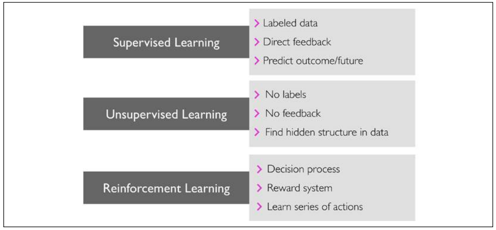
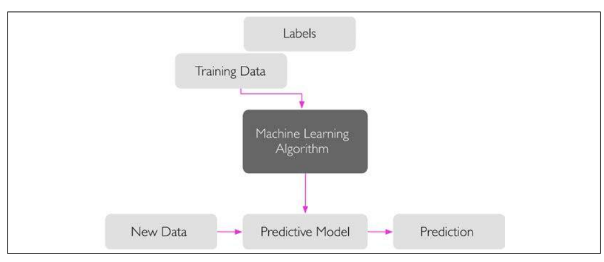
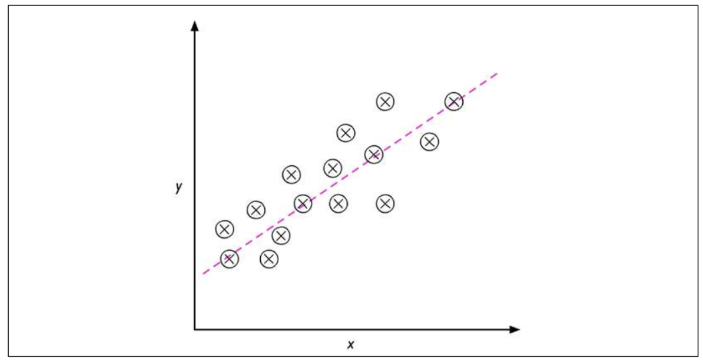
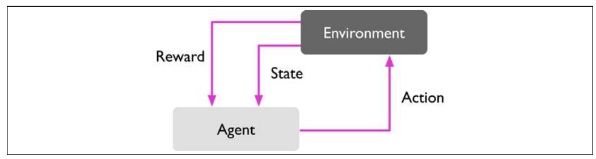
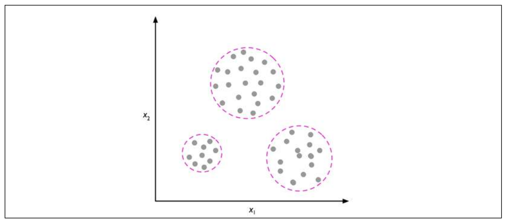
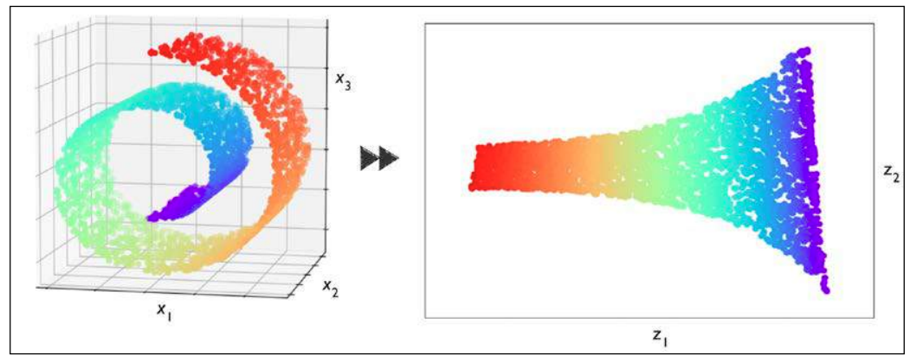
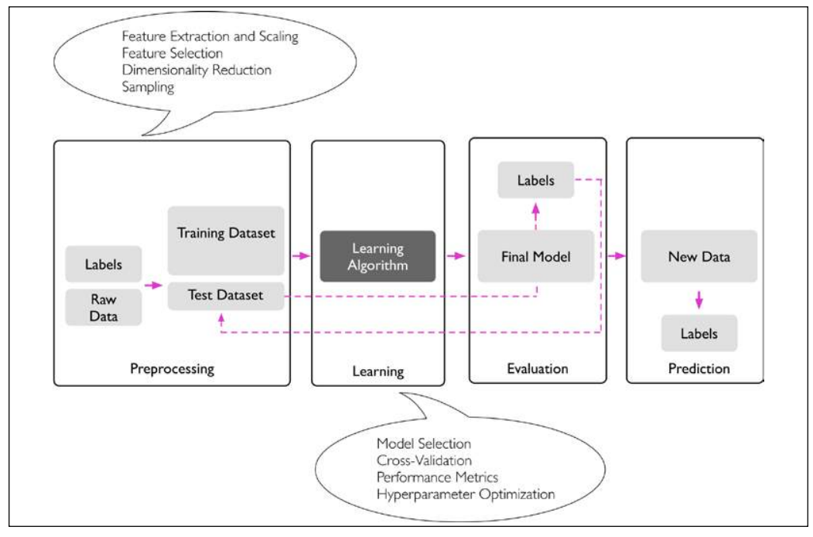
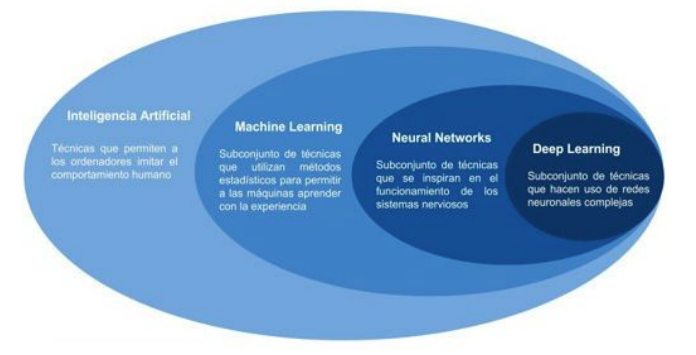

# Sistemas inteligentes

- [Sistemas inteligentes](#sistemas-inteligentes)
- [Capitulo 1 - Libro](#capitulo-1---libro)
  - [3 Tipos de machine learning](#3-tipos-de-machine-learning)
  - [Aprendizaje supervisado](#aprendizaje-supervisado)
    - [Clasificación](#clasificación)
    - [Regresión](#regresión)
  - [Aprendizaje por refuerzo](#aprendizaje-por-refuerzo)
  - [Aprendizaje no supervisado](#aprendizaje-no-supervisado)
    - [Clustering](#clustering)
    - [Reducción de dimensionalidad](#reducción-de-dimensionalidad)
  - [Terminologia utilizada](#terminologia-utilizada)
  - [Pasos para una elaboración de un sistema de machine learning](#pasos-para-una-elaboración-de-un-sistema-de-machine-learning)
- [Clase 2 - introduccion al machine learning](#clase-2---introduccion-al-machine-learning)
  - [Retos del machine learning](#retos-del-machine-learning)
  - [No free lunch theorem](#no-free-lunch-theorem)

# Capitulo 1 - Libro

Existe un recurso que tenemos en abundancia, estos son los datos ya sean estructurados o no estructurados. El **machine learning** es un subcampo de la inteligencia artificial que envuelve algoritmos que aprenden a partir de estos datos para realizar predicciones.

Gracias al machine learning, hoy en dia contamos con filtros de spam de email robustos, reconozedores de voz y texto eficientes, mototres de busqueda web, programas de ajedrez, etc.

## 3 Tipos de machine learning

Los 3 tipos son: **Aprendizaje supervisado**, **Aprendizaje no supervisado**, y **aprendizaje por refuerzo**.



## Aprendizaje supervisado

El principal objetivo del aprendizaje supervisado es aprender un modelo que nos permita hacer predicciones acerca de datos futuros. El hecho de que sea **supervisado** hace referencia a un set de ejemplos o inputs de data donde las señales de outputs (labels) ya se conocen. De esta forma, el modelo se entrena para que pueda predecir nuevas entradas de datos sin "labelear".



En el caso del filtro de spam, se puede entrenar un modelo usando un algoritmo de machine learning supervisado en un conjunto de emails que han sido correctamente marcados como spam o no spam, de tal forma que el modelo prediga si un nuevo email sin marcar pertenece a una de estas 2 categorias. En este caso, la tarea se llama **clasificación**. Otra categoria de aprendizaje supervisado es la **regresión**, en donde el output es un valor continuo.

### Clasificación

La clasificación es una subcateogira del aprendizaje supervisado cuyo proposito es predecir la categoria de nuevas instancias de datos, basado en observaciones con datos supervisados. En el caso del spam, tenemos una tarea de **clasificación binaria**, en donde el algoritmo de machine learning aprende a partir de datos para distinguir entre 2 posibles clases: emails **spam** y **no spam**

Sin embargo, no necesariamente el conjunto de marcas tiene que tener una naturaleza binaria. El modelo predictivo puede asignar cualquier marca presentada en el dataset. En este caso hablamos de clasificación multiclase (Ej: Reconocimiento de letras del abecedario escritas a mano).

### Regresión

En este caso, se predicen datos continuos (**analisis de regresión**). Aquí obtenemos un conjunto de **variables predictivas** (explicatorias (?)) y una respuesta variable continua y tratamos de encontrar la relaciónm entre esas 2 variables que nos permiten predecir un valor.

```
Variables predictivas -> "features"

Respuestas -> "target variables"
```

Por ejemplo, supongamos que estamos interesados en predecir las notas de los examenes de los estudiantes. Podriamos usar la relación entre la cantidad de tiempo estudiado y la nota obtenida para predecir las notas de los futuros estudiantes.



## Aprendizaje por refuerzo

En este caso, el objetivo es desarrollar un sistema (agent) que mejore su performance basandose en interacciones con un "entorno". Este entorno devuelve una señal de recompenza ante dichas interacciones, que el sistema puede utilizar como si fuera una especie de aprendizaje supervisado. Mediante estas interacciones, el sistema aprende una serie de acciones para maximizar estas recompenzas via prueba / error o mediante un plan deliverado.

Un ejemplo popular del aprendizaje por refuerzo es un motor de ajedrez. En este caso, el sistema decide que movimiento hacer dependiendo del estado del tablero, y la recompenza pueed ser definida como una victoria o derrota al final del juego.



## Aprendizaje no supervisado

En este caso, tratamos con datos completamente desconocidos, ya sea por su marca y/o estructura. Mediante el aprendizaje sin supervisar, somos capaces de explorar la estructura de nuestros datos para extraer informaciónm importante sin la guia de un "outcome" sabido o de una función de recompenza.

### Clustering

Clustering es una tecnica de analisis de datos que nos permite organizar una pila de info en subgrupos o clusters Sin tener ningun conocimiento a priori de su pertenencia a los mismos. Cada cluster que surge durante el analisis define un grupo de objetos que comparten cierto grado de similaridad pero q son distintos a los objetos que estan en otros clusteres. Por esto es que al clustering se lo llama clasificación sin supervisación. El clustering se usa por ejemplo para descubrir grupos de consumidores basado en los intereses de los mismos para desarrollar distintos programas de marketing.



### Reducción de dimensionalidad

cada observación viene con un alto número de mediciones, que pueden presentar un desafío para el espacio de almacenamiento limitado y el rendimiento computacional de los algoritmos de aprendizaje automático. la reducción de la dimensionalidad sin supervisión es un enfoque comúnmente utilizado en el preprocesamiento de características para eliminar el ruido de los datos, que también puede degradar el rendimiento predictivo de ciertos algoritmos, y comprimir los datos en un subespacio dimensional más pequeño manteniendo la mayor parte de la información relevante.



## Terminologia utilizada

* **Features** = Columnas de un dataset
* **Training example** = Row de un dataset (o conjunto de rows) o el dataset en si mismo
* **Training** = Ajuste de modelo, para modelos paramétricos similares al parámetro Estimacion (?)
* **Target**: Output de datos
* **Loss function**: Costo o error de una función

## Pasos para una elaboración de un sistema de machine learning



# Clase 2 - introduccion al machine learning

Machine Learning es el campo de estudio que le da a las computadoras la habilidad de aprender sin ser programadas explícitamente



Tipos de sistemas de machine learning:

- Supervisados, no supervisados y reinforcement learning
- Online y batch learning
- Basado en instancia o en modelos

## Retos del machine learning

* Tener buenos datos (evitar sampling bias)
* Tener una cantidad de datos apropiada
* Evitar el overfitting
* Evitar el underfitting

## No free lunch theorem

Si no se sabe absolutamente nada de los datos no podes
elegir un modelo sobre otro a priori.