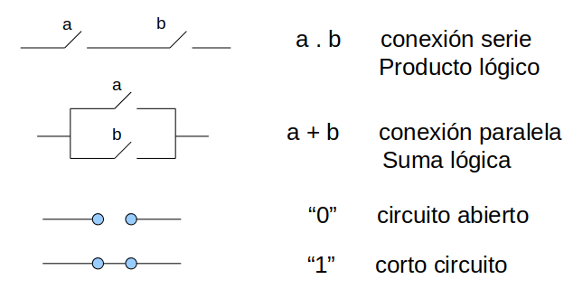
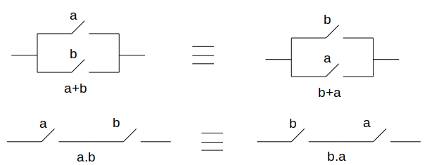
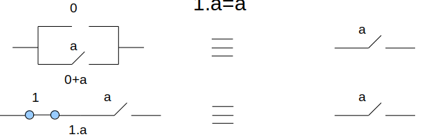
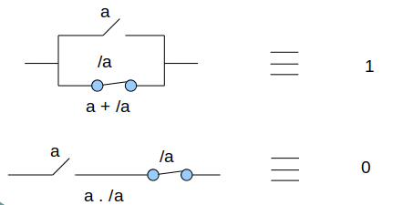

# Resumen de Arquitectura de computadoras

## Indice

- [Resumen de Arquitectura de computadoras](#resumen-de-arquitectura-de-computadoras)
  - [Indice](#indice)
  - [Algebra de Boole](#algebra-de-boole)
    - [Postulados](#postulados)
    - [Logica con Boole (Tablas de verdades)](#logica-con-boole-tablas-de-verdades)
    - [Teoremas](#teoremas)
    - [Funcion en Boole](#funcion-en-boole)

## Algebra de Boole

Se utiliza para describir la interconexión de compuertas digitales y para **transformar** **diagramas de circuitos** en **expresiones algebraicas**

El algebra de Boole es todo conjunto de elementos que solo pueden tomar los valores 0 o 1, relacionados mediante **operaciones binarias** (no aritmeticas) llamadas **suma logica** (+), **producto logico** (*) y complementacion o **inversion** (/ -) y cumplen con los siguientes **postulados** (axiomas):

### Postulados

1. Ambas operaciones son **conmutativas**:
    - a+b = b+a
    - a.b = b.a

2. Posee 2 **elementos neutros** (0 y 1) que cumplen con la propiedad de **identidad** con la suma y producto logico respectivamente:
   - 0+a=a
   - 1.a=a

3. Cada operacion es **distributiva** con respecto a la otra:
   - a.b(b+c) = a.b + a.c
   - a+b.c = (a+b).(b+c)

4. Para cada elemento a existe un a (**a negado**) tal que:
   - a+ a = 1
   - a.a = 0

**Ejemplos con llaves**

**Postulados con llaves**

1. 
2. 
3. 
4. 

### Logica con Boole (Tablas de verdades)

1. OR
   - 0+0 = 0
   - 0+1 = 1
   - 1+0 = 1
   - 1+1 = 1
2. AND
   - 0.0 = 0
   - 0.1 = 0
   - 0.1 = 0
   - 1.1 = 1
3. NOT
   - a = 1 y a = 0

**Compuertas**: materializar operaciones logicas (?)

### Teoremas

**Principio de dualidad**
Dada una **igualdad** (=), si se cambia suma lógica (+) por producto lógico (.), producto lógico por suma lógica, ceros por unos y unos por ceros, la **igualdad permanece válida**.

Se demuestra por la **simetría** de los postulados

**Ley de la absorcion**

> a+a.b = a

**Teorena del concenso**

> x.y + x.z +y.z = x.y + x.z

**Demostracion**

> x.y + x.z +y.z = x.y + x.z +y.z. (x+x)
> 
> =  x.y + x.z +y.z + x.y.z
> 
>= x.y + x.y.z+ x.z + x.y.z
> 
>= x.y . (1+z) + x.z . (1+y)
>  
> = x.y + x.z

**Teorema de Morgan**

>(x+y) = x . y
> 
> (x.y) = x + y

**Tablas de verdades para verificar Morgan**

### Funcion en Boole
(Desde ahora x = /x)

Una **función** del álgebra de Boole es una **expresión algebraica** en las que aparecen las **variables** de las cuales la **función depende** en forma **directa o negada** y relacionadas por las operaciones de **suma lógica** y/o **producto lógico**.

>f(a,b,c) = a.b.c + /a.b./c + /b./c + a./b = (a+b+c).(/a+b+/c).(/b+/c).(a+/b) (Por dualidad)

**Terimno Canonico**

Un término es **canónico** cuando aparecen **todas las variables** de las cuales la función depende ya sea en **forma directa o negada**.

>f(a,b,c) = a.b.c + /a.b./c + /b./c + a./b = (a+b+c).(/a+b+/c).(/b+/c).(a+/b)(El primer termino es producto / suma canonica)

**Funcion canonica**

Una función es **canónica** cuando **todos** sus **términos** son **canónicos**. Puede ser expresada como suma de productos canónicos o como producto de sumas canónicas.

En una función expresada como **suma de productos canónicos**, cada producto canónico representa un **uno** de la función. Basta que **uno** de los **términos** sea uno para que la **función valga uno**.

En una función expresada como **producto de sumas canónicas**, cada **suma canónica** representa un **cero** de la función. Basta que **uno** de los **términos** sea **cero** para que la **función valga cero**.

Tanto la suma de productos como el producto de sumas constituyen la **representación algebraica de la función**. 