# Arquitectura de computadoras II

## Notas

* Profesora practico: Delfina Velez Ibarra (0703883@ucc.edu.ar)
* Libro de Patterson (?)
* Nuevo micro de base ARMv8

## Introduccion

Micro path del ARMv4 (el viejo):

La arquitectura del ARMv4 y ARMv8 son muy similares, solo que el v4 es de 32 bits y el v8 es de **64 bits** y en v8 ahora tenemos **32 registros**, es decir, el doble que en v4.

A pesar de ser una nueva version, las **instrucciones** siguen siendo de **32 bits** como en v4.

Diagrama basico de un **instruction fetch**:

(Leemos una instruccion, y como la memoria esta dividida en bytes sumamos 4 posiciones al PC para leer la siguiente instruccion.)

**LEGv8**: Lenguaje de programacion para codear sobre un ARMv8, un poco modificado por fines didacticos (**Subset** de **instrucciones** de ARMv8 con diferencias por temas **didacticos**).

Las operaciones tipo R son operaciones entre **registros** (Son las mas conocidas en un ARM, suma, resta, etc.)

Ahora se usan 5 bits para redireccionar los registros (Creo que es el proceso de armar la palabra hexadecimal).

`Nota: El registro 31 (x31 o x) siempre guarda el valor 0`

Otro conjunto de operaciones que podemos hacer en un ARM es el conjunto de operaciones en **memoria**. (load / store)

Por ultimo tenemos las operaciones de **salto** (Branch)

(Cuando hacemos un branch, la arquitectura primero verifica q se ejecuta un branch si el ALU levanta el flag zero (condicional, leyendo dicha flag). Luego, mediante el label y la posicion actual del PC vemos cuantas instrucciones necesitamos mover el PC para saltar al label en cuestion y sumamos ese numero multiplicado por 4, o corrido 2 veces hacia la izq al PC)

Arquitectura del LEGv8:

Las posibles instrucciones que podemos hacer en el datapath mostrado anteriopmente son las siguientes (5 bits):

**Estructura de las instrucciones:**

Las instrucciones tienen siempre 32 bits, solo que dependiendo del tipo de instruccion (tipo R, memoria o branch) los "bloques" o "campos" de dicha instruccion van a estar en distinto orden.

**Campos**

* **opcode**: tipo de operacion (R, memory, branch)
* **Rm**: la direccion del segundo registro (5 bits porque tenemos 32 registros, es decir del 0 al 31)
* **shamt**: operacion shift (6 bits porq podemos mover registros de 64 bits)
* **Rn**: Direccion del primer registro operando
* **Rd**: Direccion del registro de destino.

Ejemplo:

Los recursos utilizados por el ARMv8 / LEGv8 para realizar una operacion tipo R son los marcados con negro:

Estructura de las instrucciones tipo D (Load/Store)

Estructura de las instrucciones tipo branch:

* RT: en el caso de ser un salto condicional, este campo tiene el registro a verificar.

Instrucciones tipo I (Como tipo R pero operan con un registro y un inmediato):

Instrucciones tipo white immediate (Nos permite guardar un valor inmediato en un registro y especificar en que parte del registro guardar dicho valor inmediato.)

* MOVZ: Mueve el inmediato a la posicion indicada, dejando todas las demas en 0
* MOVK: Mueve el inmediato a la posicion del registro indicada, dejando todas las demas tal como estaban en un principio.

## Libro patterson

La computacion avanza y mejora todo el tiempo. Mientras mas hardware se implanta, mas rapido andan los sistemas y aplicaciones mas complicadas se pueden ejecutar.

**Ley de moore**: La cantidad de recursos de hardware (transistores) que se puede integrar en un chip se duplican cada 18 meses, por lo que se reducen los tamaños y nanometros necesarios para incrustar dichos recursos, estos van a ser mas pequeños y mas baratos.

`Nota: Hoy en dia casi todo es un sistema computacional.`

**La era postPC**: Hoy en dia las PC's no son relevantes en cuanto a cantidad de procesadores que se producen. La mayor cantidad de procesadores se fabrican para dispositivos IOT.

**Entendiendo performance**: Es muy importante tener en cuenta la performance, ya que un pequeño error o feature no optimizada puede generar ineficiencias abismales.

**Las 8 grandes ideas**:
* La ley de moore.
* Uso de abstraccion para simplificar diseño.
* Hacer el caso comun lo mas rapido posible.
* Performance via paralelismo
* Performance via pipeling
* Performance via prediccion
* Jerarquia de memorias
* Confiabilidad via redundancia

**Arquitecturas de 1 ciclo**: 1 instruccion se realiza en 1 ciclo

**Niveles de codigo programable:**
* Codigo de alto nivel
* Assembly
* Representacion del hardware (binario)

`Nota: El costo de elaborar un procesador depende mayormente del area del mismo`

* **Tiempo de respuesta**: Cantidad de tiempo tomado para resolver una actividad
* **Rendimiento**: Cantidad / Tasa de actividades realizadas por unidad de tiempo.
* **Performance**: Calculo para comparar dos procesos y ver cual es mas performante. proceso_1 / proceso_2

**CPU Clocking**: En un procesador de **un ciclo**, toda la instruccion se ejecuta en un solo ciclo. Un "Clock" es una señal de sincronismo.

* **Periodo** de un clock: Duracion de un ciclo de reloj
* **Frecuencia** de un clock: Ciclos por segundo

Casi todos los sistemas se realizan sobre CMOS: El semiconductor complementario de óxido metálico (CMOS) es una pequeña cantidad de memoria en una placa base del equipo que almacena la configuración del Sistema básico de entrada/salida (BIOS).

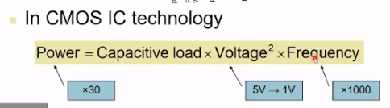

**Arquitecturas no convencionales de CPU's**:
* Intel x86
* CISC (Intel)
* RISC (ARM y todos los demas)

**Caracteristicas de los RISC**

* Tiene como meta ejecutar **una instruccion por ciclo** (en un ciclo de sincronismo entra una instruccion nueva y en el mismo ciclo sale otra instruccion) o tiene un ciclo de instruccion **constante** (Conjunto de instrucciones que entran por clock).
* Procesador orientado exclusivamente a **operaciones entre registros** (Porque el acceso a memoria es muy **lento**). Por lo que la cantidad de registros **aumenta** considerablemente.
* Modo de **direccionamiento** (Distintas formas de hacer referencia a una direccion de memoria) muy **sencillo** (Idealmente solo 1).
* **Formatos** de **instrucciones simples** (faclies de ver, entender y codificar)
* **Set** de **instrucciones reducido**.

**Implementaciones de ARM**

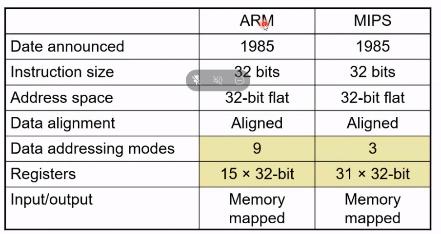

`Nota: En x86, una instruccion no se codifica con una cantidad fija de bits.`
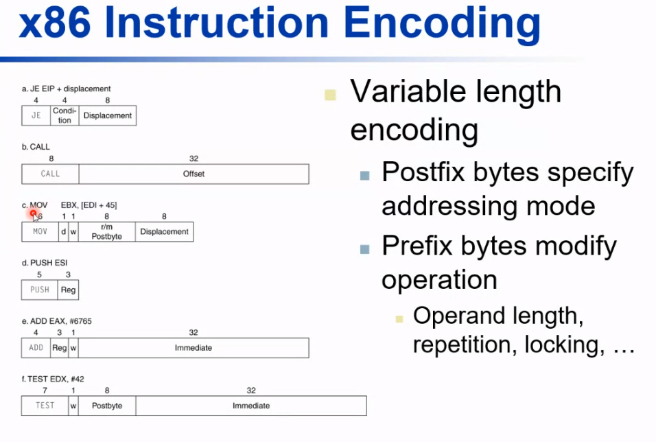

**"Falacias"**

* Mediante instrucciones mas potentes obtengo mejor performance (Las instrucciones complejas son dificiles y caras de implementar).
* Compatibilidad hacia atras no genera un cambio en el set de instrucciones (A medida que mejoran los procesadores, se van aumentando la cantidad de instrucciones)

## Semiconductores y acceso / organizacion de memoria.

Sistema de memoria: elemento capaz de **almacenar** y **retener** informacion. Estos sistemas siempre tienen un **medio fisico**. Los sistemas de memoria que veremos son los basados en **estructuras semiconductoras** (no los magneticos, ni los otpicos)

Los sistemas semiconductores tienen una determinada interfaz

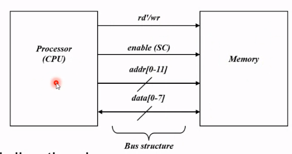

No todas las memorias semiconductoras son **iguales**.

* Memorias de **lectura-escritura**
    * Acceso **aleatoreo** 
        * **static ram**: Los bits duran eternamente (Es mas cara, 6 transistores) 
        * **dinamic ram**: Los bits duran microsegundos (Mhz --> frecuencia de refresco). Siempre se reescriben los bits.
    * Acceso **no aleatoreo**
* Memorias de lectura-escritura **no volatil**
* Memorias de **solo lectura**

**Algunas definiciones**:

Una memoria es buena dependiendo de estos parametros

**Tiempo de acceso**: Tiempo dado desde la request de un dato hasta la response del mismo (lectura o escritura, el tiempo de lectura es mas rapido que el de escritura).

**Tiempo de ciclo**: Tiempo que debe transcurrir entre 2 operaciones iguales.

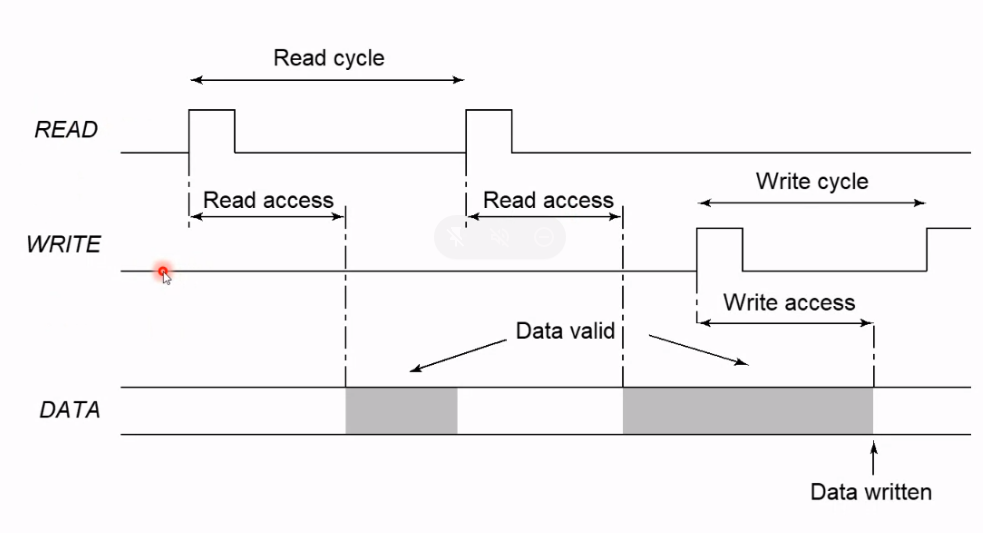

**Organizacion de un sistema de memoria**

Un sistema de memoria es un arrreglo o matriz de bits.

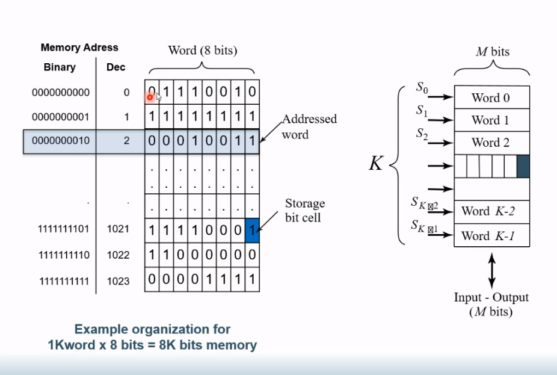

Cada fila es una **palabra** (**Unidad de acceso** del sistema de memoria, 8 bits que entran en un sistema de E/S) Estas unidades de direccionan mediante direcciones de acceso de memoria.

La **capacidad de memoria** se calcula mediante `cantidad de palabras * 8 bits`

Ya que las memorias son muy grandes (Muchas palabras), para acceder a dichas palabras se utiliza decodificadores y multiplexores

Al momento de implementar memorias, se debe de tener en cuenta el ancho y alto de las mismas, por lo que ordenan las palabras en matrices, y se usan los multiplexores y decodificadores para elegir la posicion deseada.

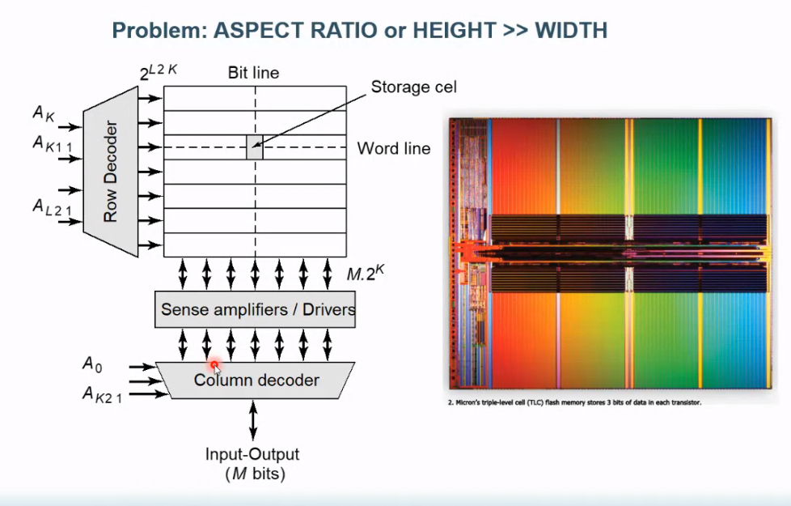

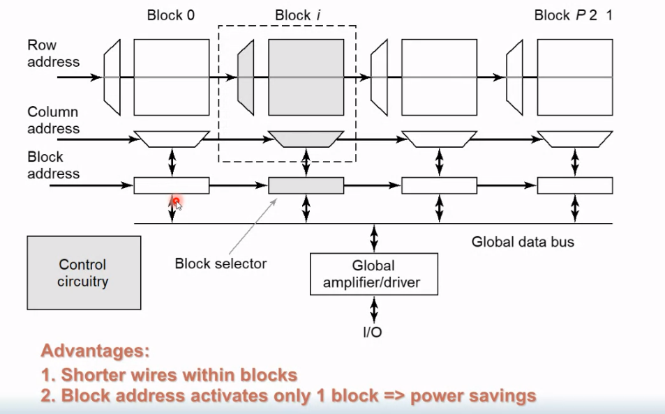

`Nota: Las memorias RAM pueden tener distintos layouts, es decir mas o menos bloques de memoria.` 

Estas distintas memorias (o son los bloques?) se pueden incrustar en una PC para **agrandar** ya sea el ancho de las palabras (**conexion en paralelo**) o la cantidad de palabras (**Conexion en serie**) y asi hacer mas grande el **mapa de memoria**.

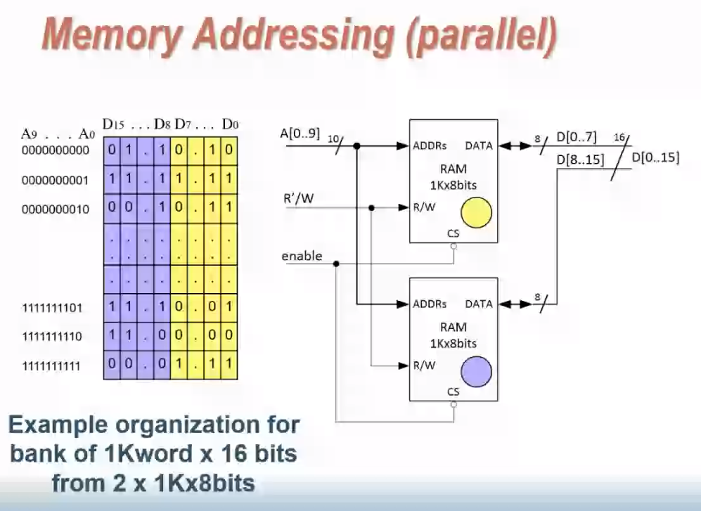

En ambos chips de memoria se accede utilzando la misma señal de address, asegurandonos que en ambos chips obtendremos fragmentos de la misma palabra.

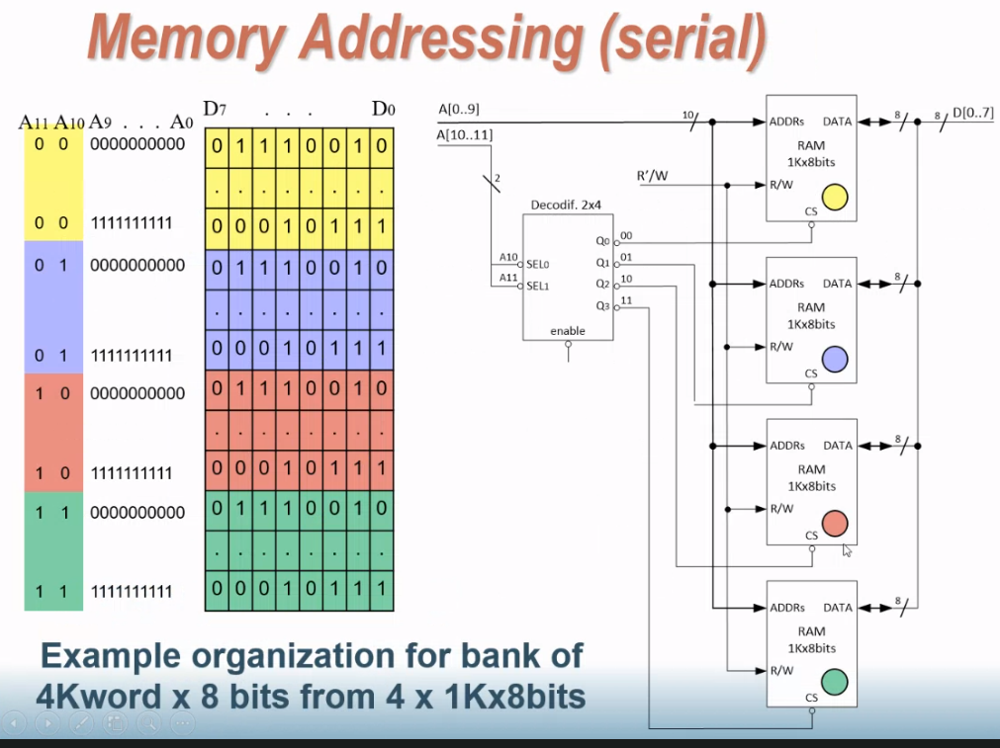

(A10 y A11 no van negados)

(Se niega 2 veces desde el decodificador hasta el bloque de memoria por los ruidos electricos)

`NOTA: ACTIVA POR BAJO`

El limite de bits en el addres que puedo implementar me lo da el microprocesador.

(Hasta aca vimos la logica de codificacion, señales de words)

## Memoria en sistemas computacionales 

**Principio de Localidad de las referencias**

La **posibilidad** de acceso a una direccion de memoria **decrece** a medida que me voy alejando del acceso actual del procesador. 

Permite determinar que los programas en realidad acceden a una **pequeña porcion** del mapa de direcciones de la memoria en un **momento determinado**.

* **Localidad temporal**: como en los loops (**lazos**), las direcciones ya accedidas son muy probables a ser vueltas a acceder.
* **Localidad espacial**: En un programa es muy probable acceder a direcciones de memoria cercanas a la actual

Este principio nos permite: 
* "adivinar" cual va a ser la siguiente direccion de memoria.
* Guardar las direcciones de memoria mas probables a ser accedidas en sistemas de jerarquias altos (veloces y caros), muy cerca del procesador.

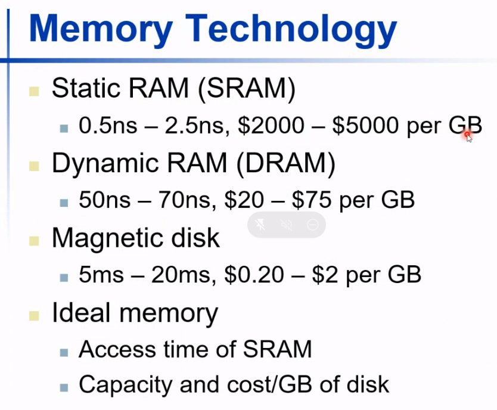

**Aumentando el ancho de banda de una memoria (Ver de nuevo el fragmento la clase)**

(Los procesadores salen mas caro porq aumentan el cache)

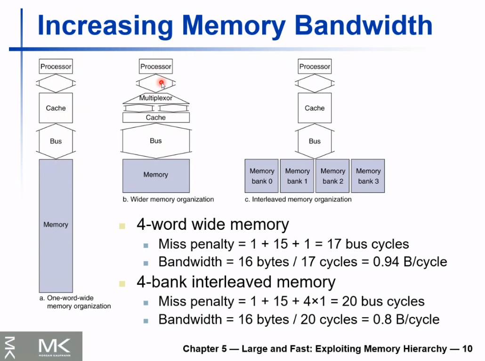

**Memoria cache (Leer del libro)**

Nivel / jerarquia superior de memoria, es el mas cercano al procesador.

No es de acceso aleatoreo, es asociativo. Si no tiene una direccion de memoria se abre.

Si se tiene el dato pedido, se devuelve un bloque (conjunto de palabras)

La cache esta distribuida en lineas, referenciadas por tags. cada linea tiene un bloque (conjunto de x palabras). HAY MUCHOS MAS BLOQUES QUE LINEAS.

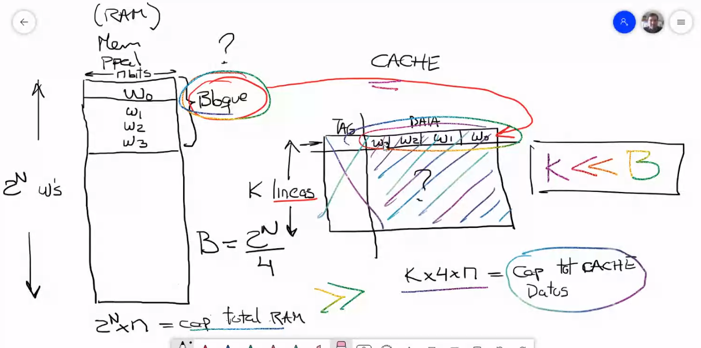

**Criterio de correspondencia / tipo de cache**

* **Cache de Mapeo directo**: Hay solo una forma de guardar los datos en cache con respecto a la memoria principal.

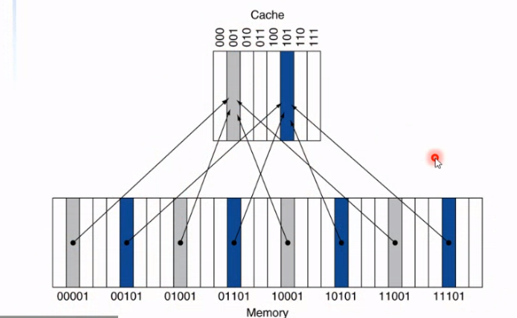

Direccion de acceso: tag | verification | index | word offset | byte offset |

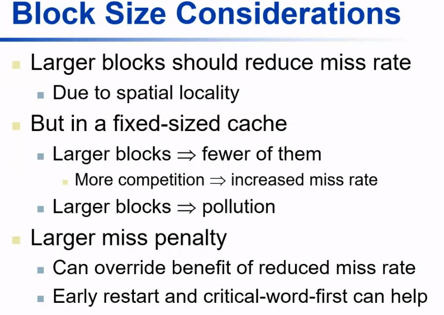

Aclaraciones:
- En un bloque (en una linea) hay mas de 1 palabra del procesador.
- Bloques mas grandes reducen la probabilidad de miss
- Si los bloques on muy grandes, puede haber polucion (reveer en la clase del 27/08)
- larger miss penalty

Si el cache falla, demoramos mas ciclos en traer la info del siguiente nivel jerarquico de memoria, por lo que demoramos mas tiempo.

* **Caches asociativas**

* Es imposible de implementarse debido a su alto costo
* Cualquier bloque puede entrar en cualquier linea de cache
* Todas las lineas deberan ser vistas en una busqueda

`Nota: En terminos reales, las caches son asociativas por conjuntos de n-ways o n-vias`

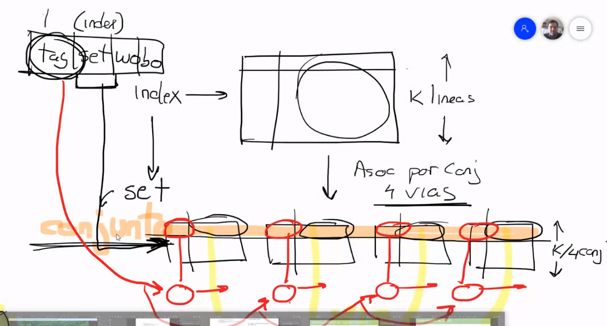

ojo con el algoritmo de sustitución, este puede ser una entrada con bit valido en 0, metodo LRU (last recently used), MRU (most recently used), random, etc.

**Cache multinivel**: Orden jerarquico dentro de las caches ordenados por la cercania o lejania de del procesador. Mientras el nivel sea mas alto, mas caro, performante y chico. Suelen tener 2 niveles. L1 (parte del CPU) y L2

## Sistemas de entrada salida (E/S)

Uno de los 3 subsistemas que conforman una gran parte de los sistemas computacionales.

Es el que me permite traer datos de la realidad o exponerlos hacia la misma.

`Nota: Perifericos no es lo mismo a modulo de E/S`

En arquitecturas viejas, los perifericos se conectaban a la PC mediante un sistema de puertos (canales de datos).

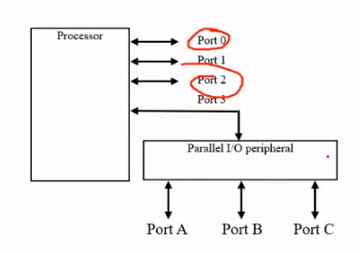

Hoy en dia se utilizan arreglos basados en **buses**. El periferico manda los datos al bus de datos o bus de E/S y el bus se encarga de mandarlo a la memoria

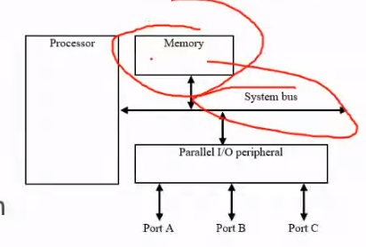

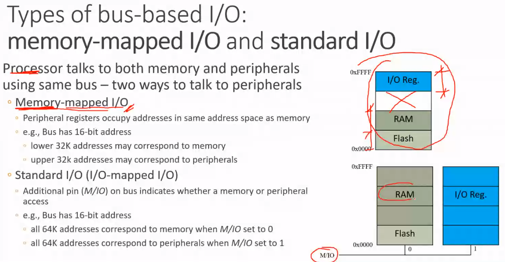

O se utlizan registros en la memoria principal para acceder a los perifericos (memory-mapped I/O, ARM) o se utiliza un mapa de memoria adicional (Standard I/O, intel) con instrucciones de acceso especiales.

**Ventajas y desventajas de C/U**

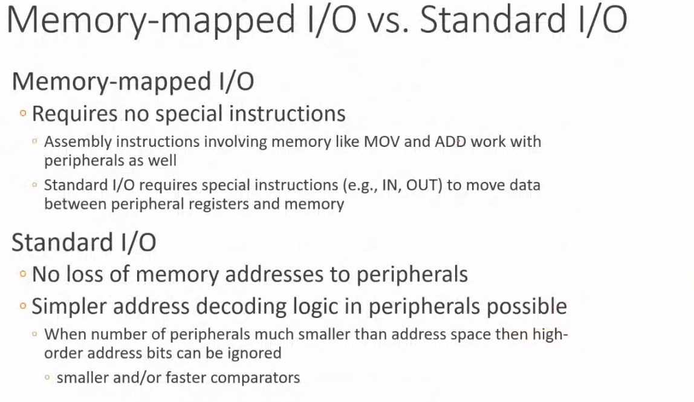

**Metodos de operacion de E/S**

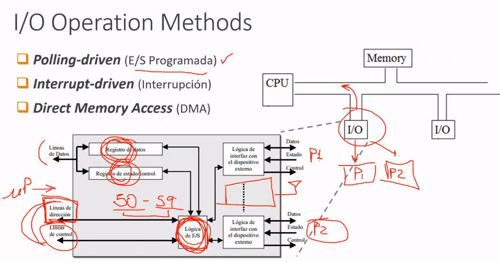

Hay 3 metodos para acceder a los recursos involucrados en un sistema computacional:

* **E/S programada** (Polling-driven): 

Todos los procedimentos del manejo de dispositivos E/S se manejan mediante programas especificos (instrucciones) escritos para dicho objetivo.

La principal desventaja es que se desperdician muchos ciclos en revisar el estado de modulo E/S (las instrucciones del programa estan en memoria, y el acceso a memoria es mas lento que la generacion de datos por parte del modulo E/S)

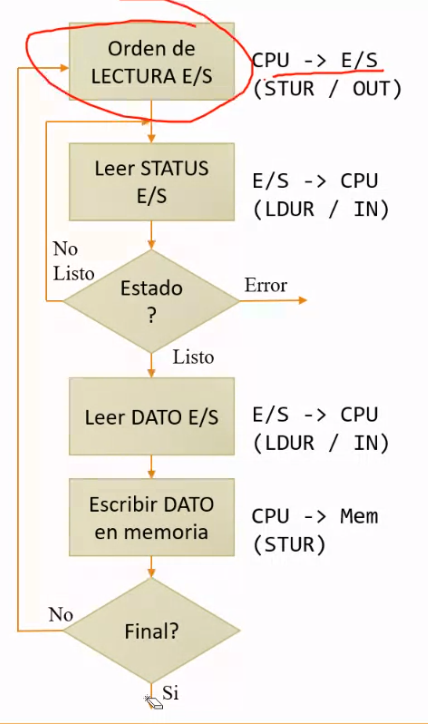

* **Interrupcion**

Una interrupcion es un **recurso fisico** (interrupt request). Cuando al CPU le llega un IR, este interrumpe la ejecucion normal de un codigo para leer el dato introducido en el modulo de E/S

Al finalizar **cada** ciclo de **instruccion**, el CPU verifica si hay IR pendientes (**No se consume ciclos de instruccion**).

Si hay IR, se corta el programa ejecutado por el CPU y se salta a una posicion especifica de memoria llamada **vector de interrupciones**. Dicho vector contiene las referencias a los codigos respectivos a cada modulo de E/S que garantizan el correcto funcionamiento del mismo. Este codigo se denomina **ISR** (interrupt service routine)

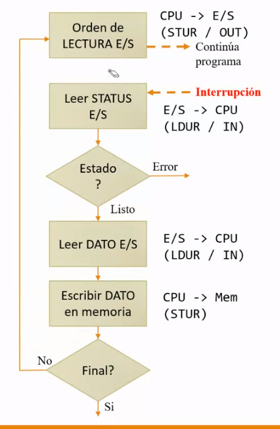

El vector de ISR se aloja en memoria. ¿donde?

* **Direccion fija**:

Direccion establecida en la propia logica de la CPU, y no es modificable (util cuando el sistema es pequeño y la cantidad de perifericos a utilizar es poca).

* **Direccion vectorizada**

El periferico provee la direccion al CPU por medio del bus de datos. Por lo que ahora existe una señal INTERRUPTION ACKNOWLEDGE que es mandada por el bus de datos desde el cpu al periferico que indica que dicha interrupcion ha sido tomada. Una vez el modulo de E/S recibio el INT ACK, se manda al CPU la direccion del ISR para ejecutar el programa de manejo de datos de perifericos.

¿Como se procesa una interrupcion?

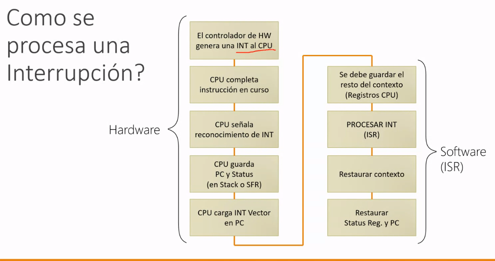

Consideraciones adicionales

**Interrupciones enmascarables vs. no enmascarables**

**Enmascaralble**: El programador puede modificar un bit que causa que el procesador ignore una solicitud de interrupcion (GEI)

**No enmascarable**: Una señal que no puede ser ignorada (internas al CPU, ej: interrupción de RESET de una PC)

**Multiples perifericos: Arbitraje**

Cuando muchos perifericos mandan interrupciones al CPU, tiene que haber un sistema de arbitraje que decida cual interrupcion atender primero o en que orden atender todas las soluciónes. Estos sistemas pueden ser:

**Software polling**:
se revisa 1*1 las ISR en el vector. La prioridad esta dada por el orden de las ISR en el vector. 

**Arbitro de prioridades**: Modulo que decide que interrupcion proveniente de los modulos de E/s se va a mandar al CPU. 
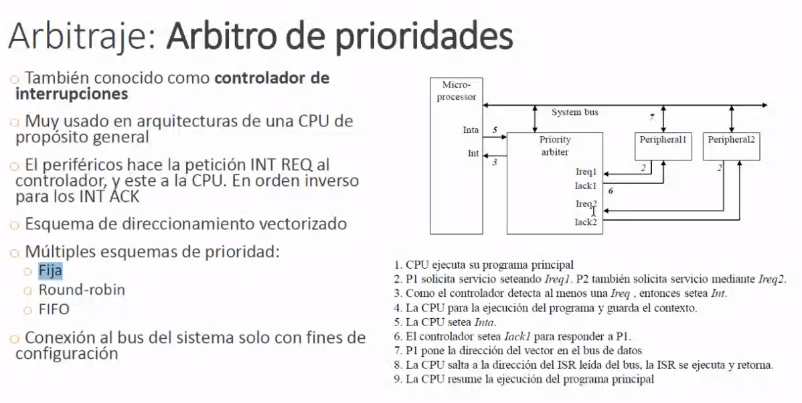

**Conexion en cadena/cascada**: Las interrupciones pasan por todos los perifericos antes de llegar al CPU o al periferico en cuestion segun corresponda. La prioridad la tiene el periferico con mas cercania al CPU.

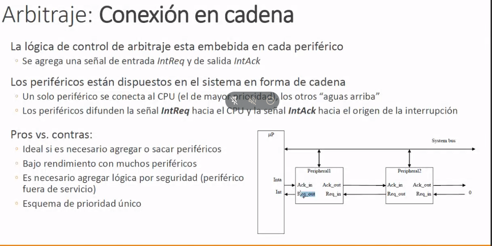

**Arbitraje de bus**: Hay como subbuses que determinan que interrupcion se va a mandar al CPU

**Excepciones**

Las interrupciones no solamente pueden venir de perifiercos. Tambien existen **excepciones** en las que una ejecucion normal de un programa se corta por la interrupcion de un evento inesperado. Estos eventos pueden venir de dispositivos e/s o del sistema mismo.

**Direct Memory Access (DMA)**

Es como un CPU aparte que administra las interacciones entre el CPU y los modulos de e/s

## Pipelining

El procesador deja de ser de 1 ciclo y pasa a ser multiciclo.

Mientras una instruccion se ejecuta, hay varias partes del cpu que no se utilizan debido a que necesita el resultado de la otra.

El pipeline permite que una parte ejecute algo de una instruccion, mientras otra parte ejecuta otra de otra instruccion.

Hay 5 etapas que el procesador tiene al ejecutar una instruccion promedio:

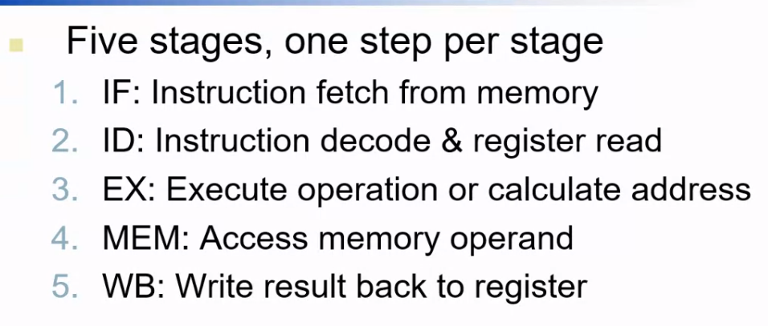

Estas etapas corresponden a ciertos elementos del microprocesador que van a ser utilizados para realizar lo pedido en la instrucción. Por ejemplo, una instruccion tipo branch utiliza los siguientes elementos del micro:

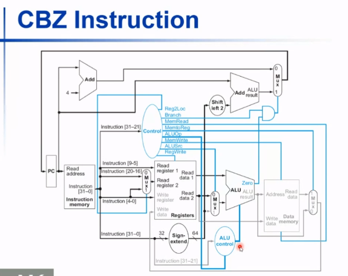

Como podemos ver en esta y en todo tipo de instrucciones hay elementos o etapas del micro que no son utilizadas y por lo tanto "estan al vicio" al momento de ejecutar una instruccion especifica.

Estas etapas tardan lo siguiente para este tipo de instrucciones:

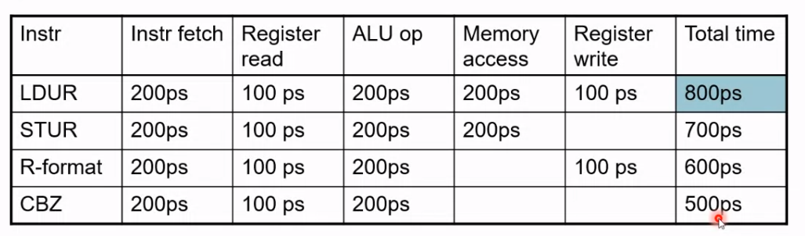

Aqui poedmos ver el tiempo empleado en ejecutar una seria de instrucciones con y sin pipelining.

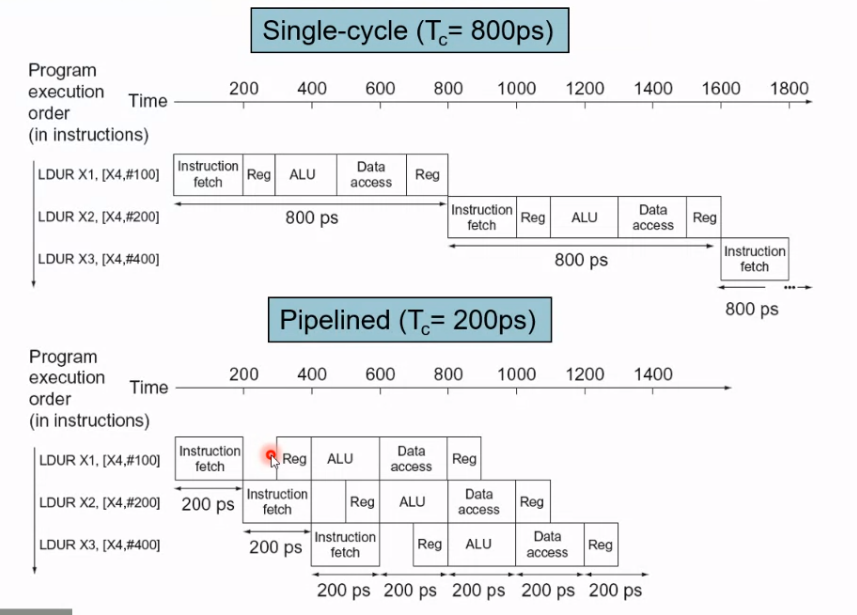

Como podemos ver, siempre estamos limitados por la etapa mas lenta, y nunca hay 2 mismas etapas ejecutandose simultaneamente para distintas instrucciones.

(izq reg write, derecha reg read)

La performance usando pipeline sera maxima cuando todas las etapas esten **balanceadas** (Usen el mismo tiempo, no quedan espacios en blanco)

**Hazards**

Situaciones que se dan en el micro con pipeline que hacen que sea imposible levantar una instruccion en el proximo ciclo. Hay 3 tipos de hazards:
* Structure hazard
* Data hazard
* Control hazard

**Hazard estructural**

Supone un conflicto en el uso de recursos por parte de 2 instrucciones distintas. (Ej)

Por ejemplo, las instrucciones se encuentran en el mismo banco de memoria que los accesos normales, por lo que siempre que se quiera leer o escribir algo, el instruction fetch tendira que esperar o permanecer en "stall" (burbuja)

Si hay un hazard estructural es porque hay una superpocision en la utilizacion de recursos por parte de una instruccion, y por lo tanto un mal diseño del microprocesador.

**Hazards de datos**

Dependencias de datos que generan un conflicto en el procesador.

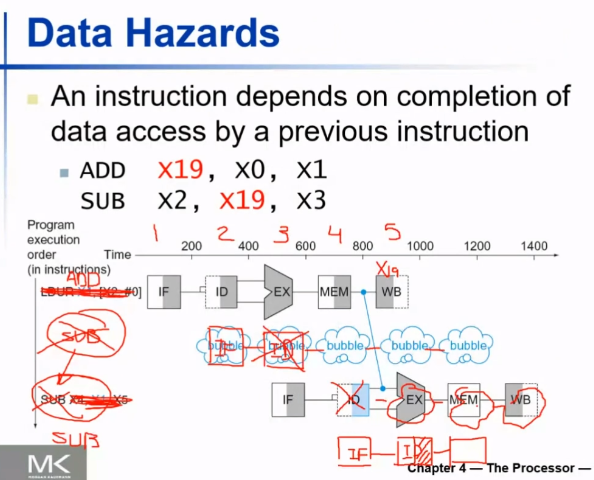

Como en el SUB necesito el valor de x19 para operar, debo de esperar a que se guarde dicho valor en la etapa Write Back del ADD para poder hacer el Instruction Decode del SUB y asi traer exitosamente el nuevo valor del X19. Como podemos ver en la imagen se generan 2 stalls o burbujas.

Una forma de evitar este hazard generado por dependencia de datos sin la necesida de generar stalls es mediante el "Forwarding" en donde el valor nuevo de X19 es "inyectado" a la etapa de execute del SUB justo despues de haber sido obtenido en la etapa execute del add. La etapa Instruction Decode del SUB decodea un valor incorrecto de X19 pero esto se corrige mediante el forwarding (Esto se logra mediante conexiones extras en el datapath).

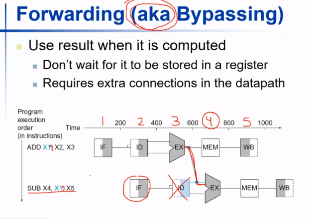

Otra forma es reordenar las instrucciones del codigo para evitar dichos stalls

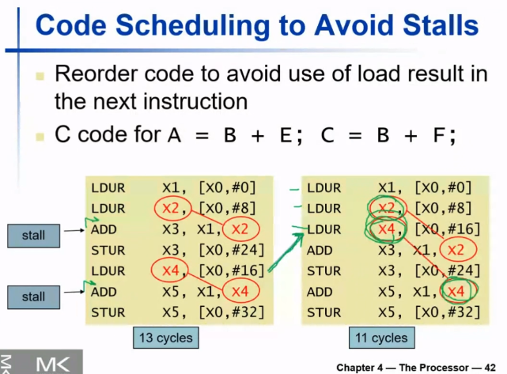

**Doble hazard de datos**

Cuando tenemos una situación en donde tanto en la etapa de execute como en la de memory se detecta un hazard, siempre se debe de realizar el forwarding (en un micro con forwarding) utilizando la etapa mas vieja (execute, ya que esta corresponde a la instruccion mas nueva) porque es el dato mas nuevo el que nos interesa utilizar en la ultima instrucion.

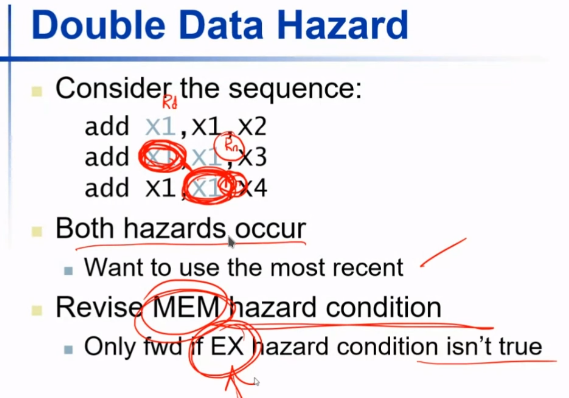

**Hazard de control**

Cuando un micro implementa pipelining, siempre que haya un branch ya sea condicional o incondicional, se nos pueden llegar a generar problmeas o hazards.

El micro se da cuenta que tiene que hacer un salto recien en la etapa de memory. Por lo que todo lo que se fetcheo y ejecuto mientras (gracias al pipelining) es erroneo (spoiler: flusheado)

### prediccion dianmica de branch

Hay metodos que nos permiten decidir en base a ciertos datos si el salto se va a tomar o no se va a tomar (taken / not taken). Algunos de estos metodos son el predictor de 1 bit o de 2 bits . 

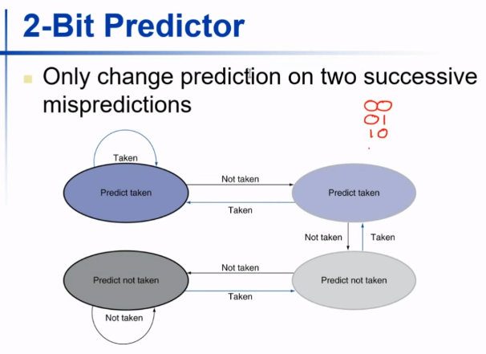

### Implementacion del pipelining

El pipelining se implementa mediante "bancos de registros" entre las distintas fases que retienen la información hasta que se de el siguiente ciclo de clock. Momento en el cual la info pasa al siguiente banco (previamente pasado por el respectivo proceso segun la fase implicada). 

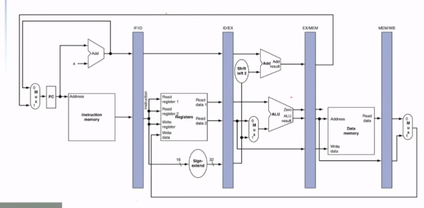

`Nota: La instruccion que utiliza TODAS las etapas del micro es el LOAD`

Ojo con el write register, cuyo dato debe ser enviado correctamente mediante el siguiente datapath:

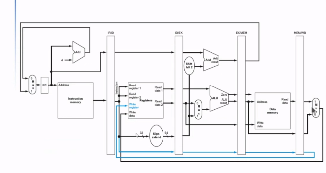

**Implementación de forwarding**

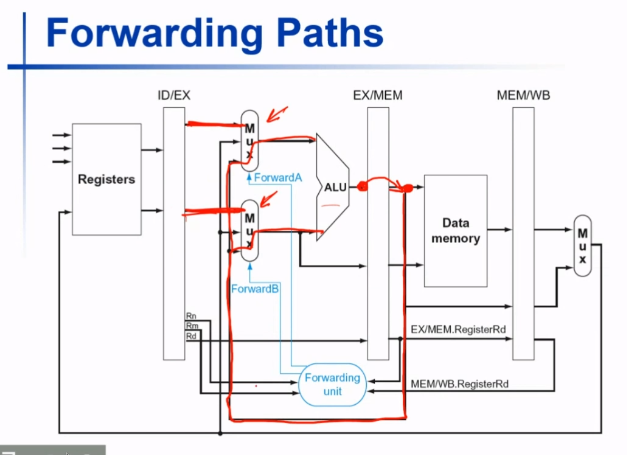

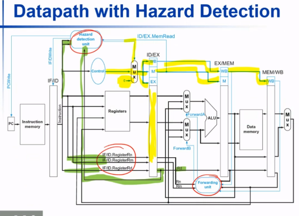

Cuando tenemos las instrucciones NOP o las "burbujas", en realidad el hazard detection unit hace que los registros de control no permitan que se guarde nada en los data banks de las distintas fases, por lo que todo se calcula, pero nada es guardado en ningun lado.

# Niveles de paralelismo

Para aumentar la cantidad de instrucciones ejecutadas de manera paralela en un microprocesador tenemos distintos metodos (obviando el multicore). Estos metodos depende del trabajo a realizar y su capacidad de ser paralelizable.
En terminos generales hay paralelismo a nivel de datos y a nivel de instrucciones. Podemos aumentar la cantidad de fases para reducir el tiempo por fase (hasta cierto punto) o podemos empezar a **captar mas de una instruccion por clock**

Esto se puede lograr sin duplicar los recursos. Simplemente dividimos los recursos que no suelen ser utilizados por cierta cantidad de instrucciones (y aumentamos algun q otro canal de acceso).

### Paralelismo a nivel de instruccion

`Nota: Pipelining != ejecutar varias instrucciones en **1 ciclo** de clock`

El ILP (Instruction level parallelism) es ejecutar mas instrucciones al mismo tiempo (en simultaneo) en el mismo hardware.

`Nota: Agregar mas etapas al pipelining aumenta la performance hasta cierto punto ya que al agregar bancos de registros entre etapas aumenta la latencia.`

Debido a esta restriccion del pipeline, se elaboraron los procesadores "multiple issue" en donde se tienen multiples pipelines para ejecutar multiples instrucciones por ciclo de clock. El CPI queda <1 por lo que se empieza a usar el IPC, si CPI = 1/4 entonces IPC = 4 (Aunq hay ciertas limiatciones que casi nunca permiten que se ejecuten la totalidad de las instrucciones del IPC).

#### Static Dual issue

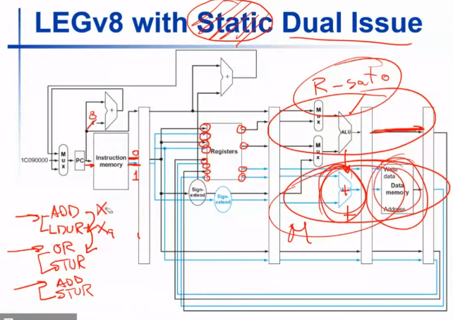

En esta implementacion dividimos la alu en 2. Una que ejecuta instrucciones tipo R y salto y otra que ejecuta instrucciones de acceso a memoria. El unico punto malo de esto es que el compilador debe de armar una secuenciaW de instrucciones de tal manera que no generen hazards de datos entre las instrucciones ejecutadas de manera paralela. (Con esta implementacion el CPI se reduce a la mitad). 
Esta implementacion se llama Static Dual Issue y el "static" se debe a que  el encargado de planear la secuencia optima de instrucciones es el compilador del lenguaje de programacion y no el procesador en si.

Este prcesador dual issue solo puede tener una instruccion tipo alu/branch y otra tipo load/store al mismo tiempo, por lo que las instrucciones ahora son de 64 bits (?).

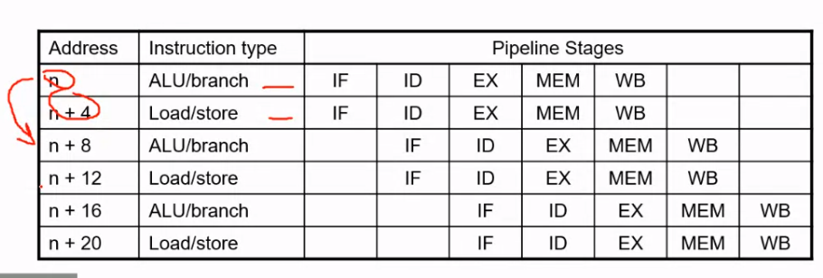

Como dijimos previamente, el compilador debe ser el encargado de corregir la mayoria (por no decir todos) de los data hazards ya que si no el microprocesador no puede ejecutar el paquete porque si o si daria un dato incorrecto (En estos casos los compiladores suelen insertar instrucciones nops).

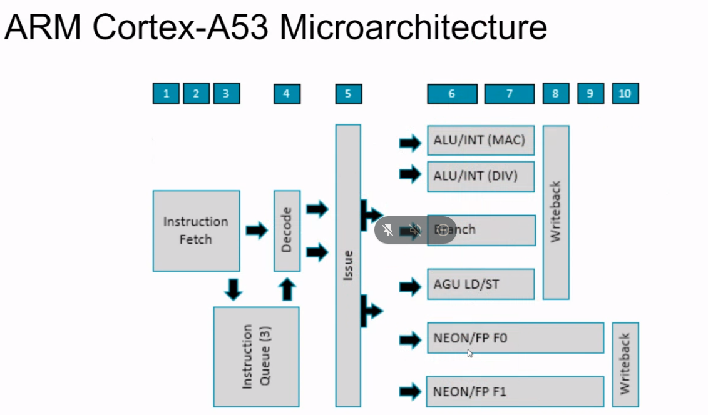

Este procesador permite ejecutar 2 paquetes al mismo tiempo (Trae 3 instrucciones) y las restricciones que le plantea al compilador son mucho menos "restrictivas" gracias a las divisiones de la alu / branch / memory access.

Cuando implementamos un procesador multiple issue, se nos generan otro tipo de dependencias de datos que nos generan problemas (principalmente al ejecutar 2 o mas instrucciones **al mismo tiempo**).

Las dependencias pueden ser a nivel de:
* **registros** (las que estabamos viendo hasta ahora), 
* **memoria** (no son tan faciles de ver, se dan cuando 2 instrucciones que acceden a memoria hacen referencia a la misma posicion)
* **Dependencia de control** (se da cuando una dependencia condicional determina el ordenamiento de una instruccion respecto a otra de salto.)
* **dependencias reales de datos** (La instruccion i es dependiente en datos con la instruccion j cuando la instruccion i produce un resultado que debe ser utilizado por la instruccion j)
* **Dependencia de nombre** (La que nos compete con multiple issue): Estas dependencias se dan cuando dos instrucciones usan el mismo registro o posicion de memoria, pero no hay flujo real de datos.
    - Dependencia de salida: Ocurre cuando las instrucciones i y j escriben la misma posicion de memoria (en dual issue, siempre que i y j esten en el mismo paquete, el micro no sabria con cual resultado escribir el registro ya que las 2 instrucciones se ejecutan al mismo tiempo).

`Nota: Register renaming es un metodo que cambia los nombres de los registros para que no se den dependencias de nombre.`

`Nota: Procesadores Multiple Issue no saben que instruccion de un paquete se ejecuta primero con respecto a la semantica del codigo.`

Cuando estas dependencias se combierten en Hazards, se pueden clasificar en 2 tipos de hazards:

* **RAW** (read after write): j intenta leer un dato antes de que i lo escriba, j obtiene el valor desactualizado 
* **WAW** (write after write): j intenta escribir un operando antes de que lo escriba i.

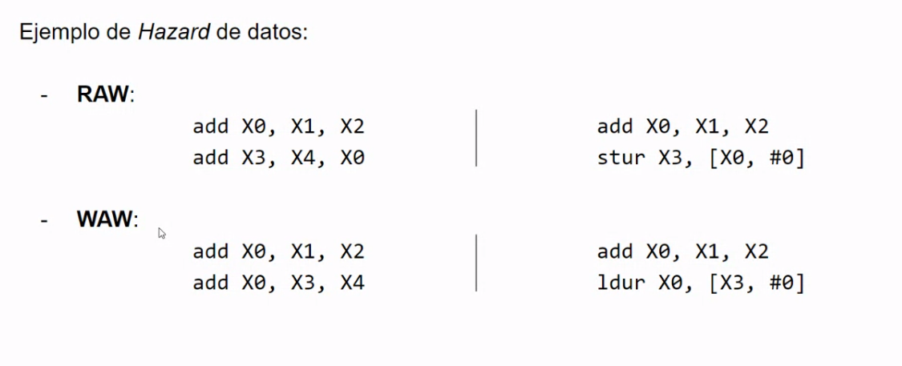