# Arquitectura de computadoras II

## Notas

* Profesora practico: Delfina Velez Ibarra (0703883@ucc.edu.ar)
* Libro de Patterson (?)
* Nuevo micro de base ARMv8

## Introduccion

Micro path del ARMv4 (el viejo):

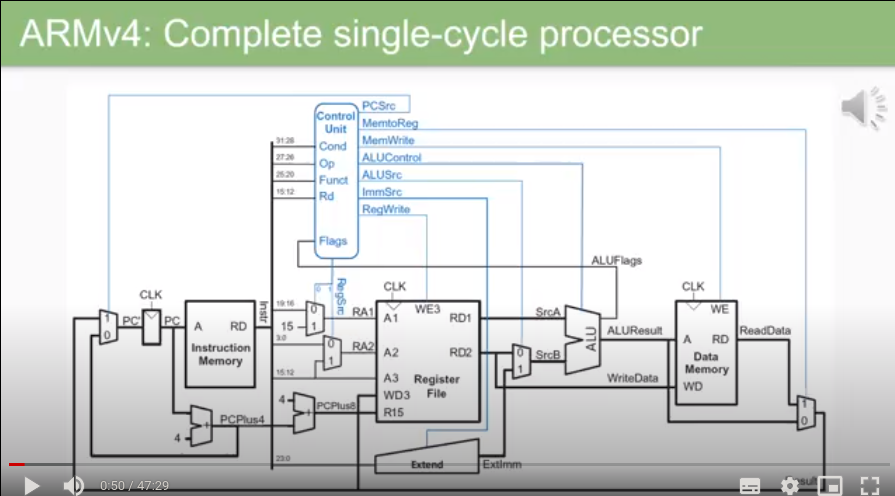

La arquitectura del ARMv4 y ARMv8 son muy similares, solo que el v4 es de 32 bits y el v8 es de **64 bits** y en v8 ahora tenemos **32 registros**, es decir, el doble que en v4.

A pesar de ser una nueva version, las **instrucciones** siguen siendo de **32 bits** como en v4.

Diagrama basico de un **instruction fetch**:

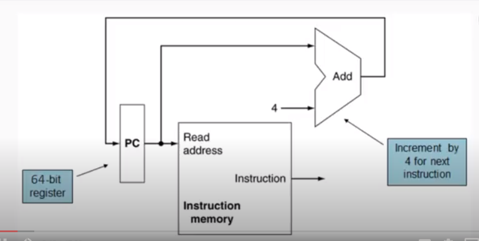

(Leemos una instruccion, y como la memoria esta dividida en bytes sumamos 4 posiciones al PC para leer la siguiente instruccion.)

**LEGv8**: Lenguaje de programacion para codear sobre un ARMv8, un poco modificado por fines didacticos (**Subset** de **instrucciones** de ARMv8 con diferencias por temas **didacticos**).

Las operaciones tipo R son operaciones entre **registros** (Son las mas conocidas en un ARM, suma, resta, etc.)

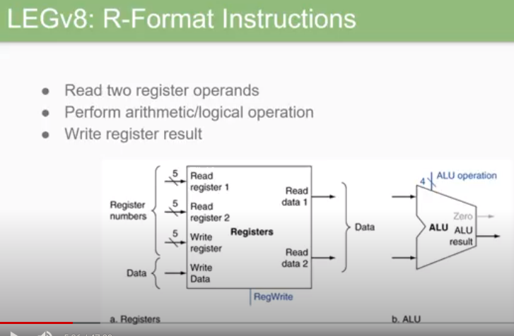

Ahora se usan 5 bits para redireccionar los registros (Creo que es el proceso de armar la palabra hexadecimal).

`Nota: El registro 31 (x31 o x) siempre guarda el valor 0`

Otro conjunto de operaciones que podemos hacer en un ARM es el conjunto de operaciones en **memoria**. (load / store)

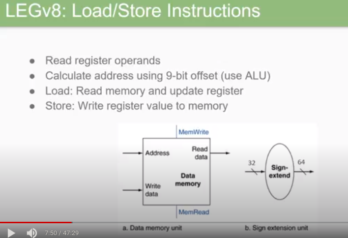

Por ultimo tenemos las operaciones de **salto** (Branch)

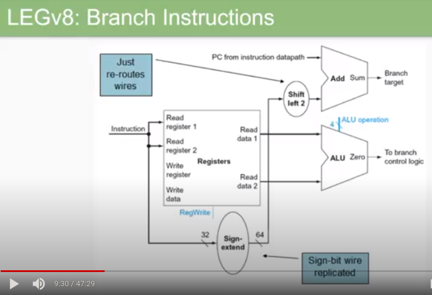

(Cuando hacemos un branch, la arquitectura primero verifica q se ejecuta un branch si el ALU levanta el flag zero (condicional, leyendo dicha flag). Luego, mediante el label y la posicion actual del PC vemos cuantas instrucciones necesitamos mover el PC para saltar al label en cuestion y sumamos ese numero multiplicado por 4, o corrido 2 veces hacia la izq al PC)

Arquitectura del LEGv8:

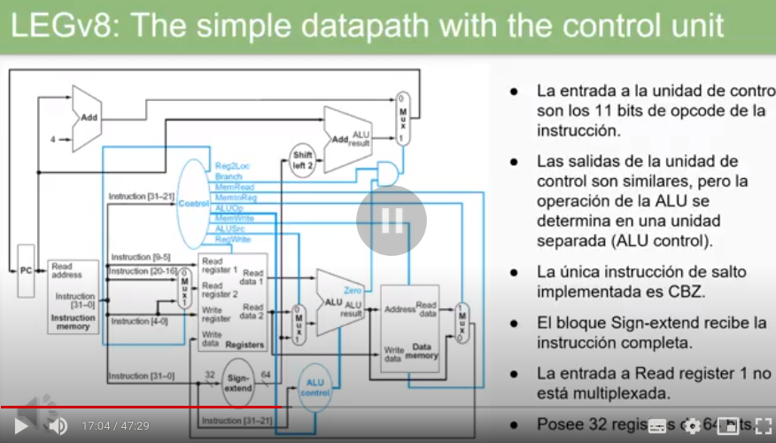

Las posibles instrucciones que podemos hacer en el datapath mostrado anteriopmente son las siguientes (5 bits):

**Estructura de las instrucciones:**

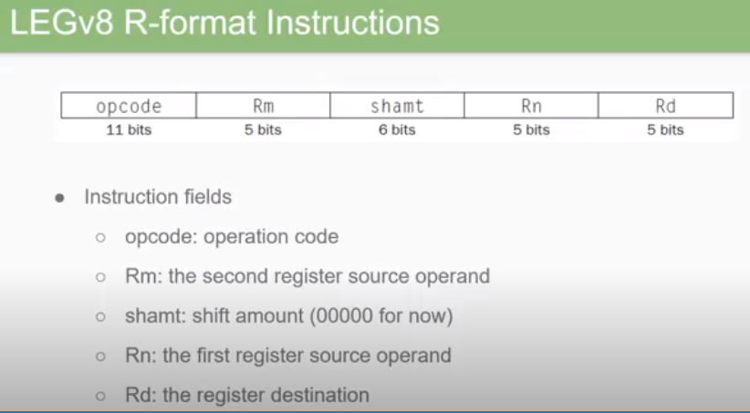

Las instrucciones tienen siempre 32 bits, solo que dependiendo del tipo de instruccion (tipo R, memoria o branch) los "bloques" o "campos" de dicha instruccion van a estar en distinto orden.

**Campos**

* **opcode**: tipo de operacion (R, memory, branch)
* **Rm**: la direccion del segundo registro (5 bits porque tenemos 32 registros, es decir del 0 al 31)
* **shamt**: operacion shift (6 bits porq podemos mover registros de 64 bits)
* **Rn**: Direccion del primer registro operando
* **Rd**: Direccion del registro de destino.

Ejemplo:

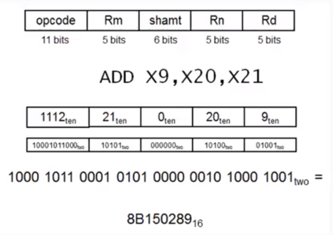

Los recursos utilizados por el ARMv8 / LEGv8 para realizar una operacion tipo R son los marcados con negro:

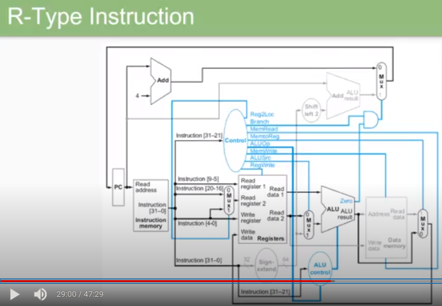

Estructura de las instrucciones tipo D (Load/Store)

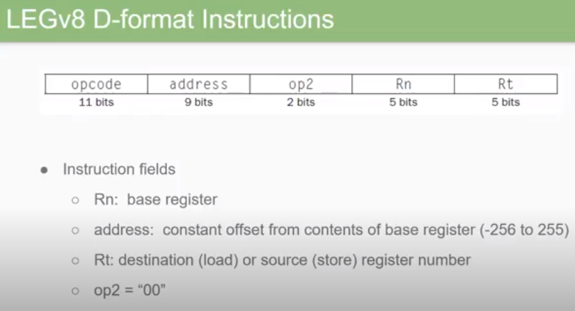

Estructura de las instrucciones tipo branch:

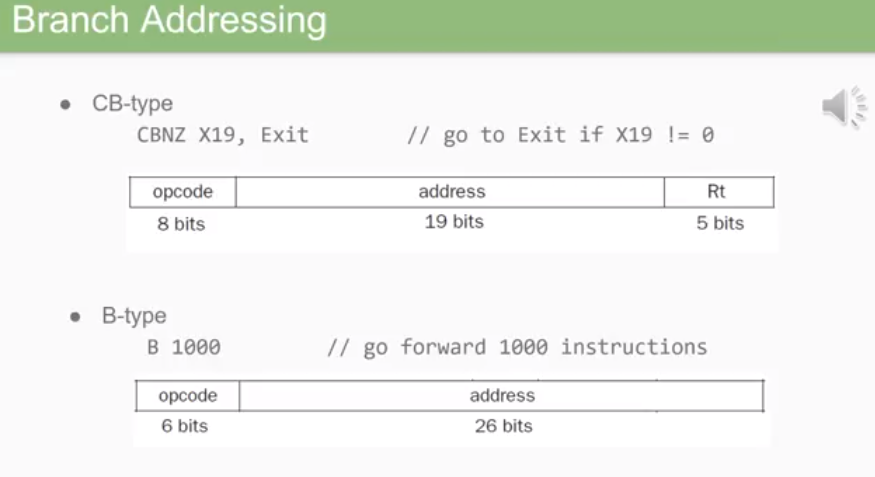

* RT: en el caso de ser un salto condicional, este campo tiene el registro a verificar.

Instrucciones tipo I (Como tipo R pero operan con un registro y un inmediato):

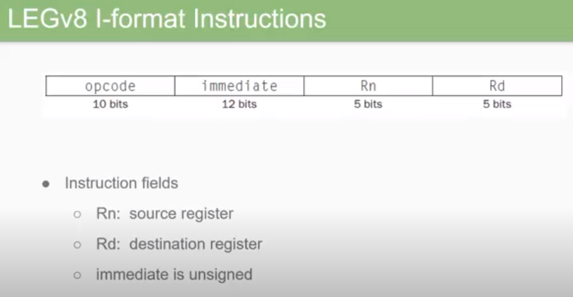

Instrucciones tipo white immediate (Nos permite guardar un valor inmediato en un registro y especificar en que parte del registro guardar dicho valor inmediato.)

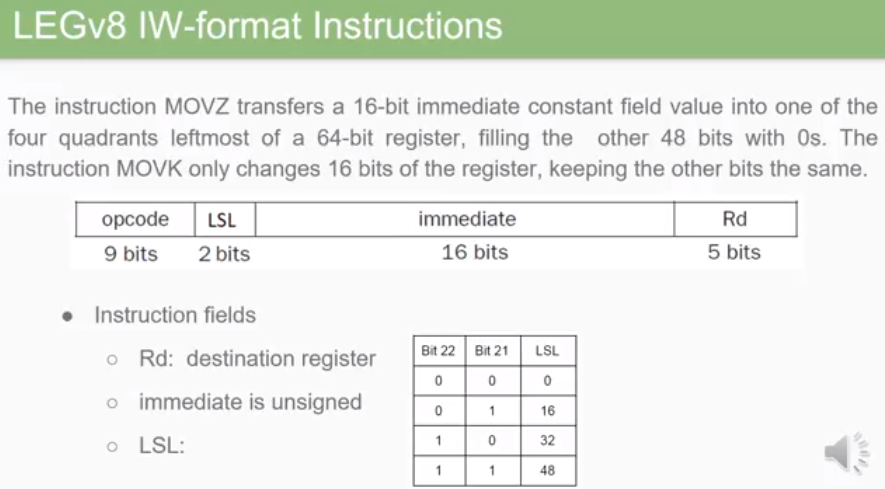

* MOVZ: Mueve el inmediato a la posicion indicada, dejando todas las demas en 0
* MOVK: Mueve el inmediato a la posicion del registro indicada, dejando todas las demas tal como estaban en un principio.

## Libro patterson

La computacion avanza y mejora todo el tiempo. Mientras mas hardware se implanta, mas rapido andan los sistemas y aplicaciones mas complicadas se pueden ejecutar.

**Ley de moore**: La cantidad de recursos de hardware (transistores) que se puede integrar en un chip se duplican cada 18 meses, por lo que se reducen los tamaños y nanometros necesarios para incrustar dichos recursos, estos van a ser mas pequeños y mas baratos.

`Nota: Hoy en dia casi todo es un sistema computacional.`

**La era postPC**: Hoy en dia las PC's no son relevantes en cuanto a cantidad de procesadores que se producen. La mayor cantidad de procesadores se fabrican para dispositivos IOT.

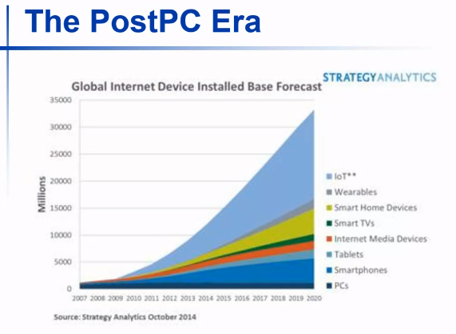

**Entendiendo performance**: Es muy importante tener en cuenta la performance, ya que un pequeño error o feature no optimizada puede generar ineficiencias abismales.

**Las 8 grandes ideas**:
* La ley de moore.
* Uso de abstraccion para simplificar diseño.
* Hacer el caso comun lo mas rapido posible.
* Performance via paralelismo
* Performance via pipeling
* Performance via prediccion
* Jerarquia de memorias
* Confiabilidad via redundancia

**Arquitecturas de 1 ciclo**: 1 instruccion se realiza en 1 ciclo

`Revisar: Frecuencia / periodo / clock`