# Resumen Arquitectura de software

## Indice
- [Resumen Arquitectura de software](#resumen-arquitectura-de-software)
  - [Indice](#indice)
  - [Introduccion](#introduccion)
    - [Repaso de POO](#repaso-de-poo)
    - [SOLID](#solid)
  - [Principios SOLID](#principios-solid)
    - [Principio de responsabilidad simple](#principio-de-responsabilidad-simple)
    - [Principio abierto / cerrado](#principio-abierto--cerrado)
    - [Sustitucion de Liskov](#sustitucion-de-liskov)
    - [Segreegacion de la interfaz](#segreegacion-de-la-interfaz)
    - [Inversion de dependencia](#inversion-de-dependencia)
  - [Patrones de diseño](#patrones-de-diseño)
    - [Introduccion](#introduccion-1)
    - [Clasificacion](#clasificacion)
  - [Patrones Creacionales](#patrones-creacionales)
    - [Patron builder](#patron-builder)
    - [Patron singleton](#patron-singleton)
    - [Patron abstract factory](#patron-abstract-factory)
    - [Patron factory method](#patron-factory-method)
    - [Patron Prototype](#patron-prototype)
  - [Patrones estructurales](#patrones-estructurales)
    - [Patron Adapter](#patron-adapter)
    - [Patron bridge](#patron-bridge)
    - [Patron composite](#patron-composite)
    - [Patron decorator](#patron-decorator)
    - [Patron facade](#patron-facade)
    - [Patron FlyWeight](#patron-flyweight)
  - [Patrones de comportamiento](#patrones-de-comportamiento)
    - [patron strategy](#patron-strategy)
    - [Patron observer](#patron-observer)
  - [Antipatrones](#antipatrones)
    - [Antipatrones de programacion](#antipatrones-de-programacion)
    - [Antipatrones de metodologia](#antipatrones-de-metodologia)
    - [Antipatrones de diseño](#antipatrones-de-diseño)
  - [Concurrencia y paralelismo](#concurrencia-y-paralelismo)
    - [Concurrencia VS. Paralelismo](#concurrencia-vs-paralelismo)
    - [Aplicaciones](#aplicaciones)
    - [Propiedades](#propiedades)
    - [Arquitecturas concurrentes (?)](#arquitecturas-concurrentes-)
    - [Nota](#nota)
    - [Problemas de la concurrencia](#problemas-de-la-concurrencia)
      - [DeadLocks](#deadlocks)
      - [Livelock](#livelock)
      - [starvation](#starvation)
  - [Telecomunicaciones](#telecomunicaciones)
    - [Modelo OSI](#modelo-osi)
    - [Protocolo IP](#protocolo-ip)
    - [Protocolo TCP](#protocolo-tcp)
    - [Protocolo HTTP](#protocolo-http)
    - [Protocolo DNS](#protocolo-dns)
  - [Patron Arquitectonico](#patron-arquitectonico)
    - [Patron MVC](#patron-mvc)
  - [ORM](#orm)

## Introduccion

Los **principios de programacion** son un conjunto de reglas que al aplicarlas al escribir codigo mejoran la **mantenibilidad** y **extensibilidad** del mismo.

Uno de estos principios es conocido como principios **SOLID** (Principios, no reglas)

Algunos de los problemas que empeoran la "calidad" del codigo son por ejemplo:
- Codigo muy grande
- Codigo repetido
- Necesidad de retocar codigo ya desarrollado para realizar un cambio al programa
- Complejidad ciclomatica elevada (Muchas sentencias dentro de otras sentencias)

### Repaso de POO

Pilares:

1. Encapsulamiento
2. Herencia
3. Polimorfismo
4. Abstraccion

**Buenas practicas** de POO:

- Poco **acoplamiento**: relacion entre modulos del sistema y su interdependencia. Si hay poca dependencia, hay mayor reusabilidad en otros sistemas
- Mucha **cohesion**: 1 modulo tiene 1 responsabilidad

**Design smells**:
Decimos que el codigo "Huele" cuando este funciona, pero tenemos una intuicion de que algo no esta bien y puede ser mejorado. Algunos smells son:
- Rigidez (Cuando un cambio genera una cascada de cambios)
- Fragilidad (Un cambio explota el codigo)
- Inmovilidad (Codigo poco rehusable)
- Viscocidad (El codigo induce a hacer malas practicas)
- Complejidad innecesaria
- Repeticion innecesaria
- Opacidad (Complejo de leer, poco intuitivo)

**Principios de diseño en POO**

- **DRY** (Dont Repeat Yourself)
- **KISS** (Keep it simple stupid)
- **YAGNI** (You Are Gonna Need It)
- **SOLID**

### SOLID

* Single responsability
* Open closed
* Liskov substitution
* Interface segregation
* Dependency inversion

## Principios SOLID

### Principio de responsabilidad simple 

Una clase debe tener una y solo una razon de cambio / responsabilidad

**Cuando aplicar este principio**
- Clase muy larga (+300 lineas Aprox.)
- Metodo muy largo (+40 lineas Aprox.)
- Muchas dependencias a otros objetos (+20 Aprox)
- Baja cohesion
- nombres muy genericos
- uso del antipatron [Spaghetti code](https://es.wikipedia.org/wiki/C%C3%B3digo_espagueti)

**Sobre que elementos aplicar este principio**

  - Metodos
  - Clases
  - Bibliotecas
  - Modulos
  - Sistemas

**Contras del principio**
- Genera muchas clases
- Codigo mas complicado de leer (no siempre)

### Principio abierto / cerrado

Todas las entidades de software deben ser abiertas a la **extension**, pero cerradas a la **modificacion**.

Debemosser capaces de **extender** el comportamiento del codigo sin tener que **modificar** su contenido.

**¿Sobre que elementos?**

- Funciones
- Clases
- Modulos

**Beneficios**

- Menus bugs
- bajo acoplamiento
- Flexibilidad
- Facil mantenimiento

**¿Cuando aplicar?**

- Case sujeta a un posible futuro cambio/s
- Extender una libreria de terceros

**Contras**

- Esfuerzo para diseñar
- mayor experiencia

### Sustitucion de Liskov

- Una clase **derivada** puede ser **reemplazada** por cualquier otra que use la **misma** clase **base** sin alterar su correcto funcionamiento

Este principio soplo afecta a **clases**

**Beneficios**

- Flexibilidad
- Facil mantenimiento

**¿Cuando aplicar?**

- para extender la funcionalidad del codigo usando clases derivadas sin tocar la base
- Existan clases que compartan comportamiento
- Al aplicar el principio open/closed

### Segreegacion de la interfaz

- La clase hijo no debe ser forzado a implementar **interfaces** que no necesite
- Interfaces pequeñas que resuelvan problemas especificos

**Se aplica a**
- Clases
- Interfaces

**Beneficios**
- Bajo acoplamiento
- Alta cohesion
- Codigo facil de mantener

**Cuando aplicar**
- Clases con metodos vacios o que devuelvan valores por defecto
- Clases con metodos que devuelvan excepciones
- Clase hijo solo usa algunos metodos de la padre

### Inversion de dependencia

Los modulos de alto nivel no deben depender de los de bajo nivel. Ambos deben depender de **abstracciones**.

Las abstracciones no deben depender de los detalles, sino mas bien los detalles deben depender de las abstracciones

**Se aplica a**

- Clases
- Modulos

**Beneficios**

- Bajo acoplamiento
- Testeabilidad
- Flexibilidad

**Cuando aplicar**

- Nivel de acoplamiento alto

**Desventajas**

- Mucha experiencia
- Mas esfuerzo para diseñar
- Muchas interfaces

## Patrones de diseño

### Introduccion

Los patrones de diseño son **soluciones habituales** a problemas que ocurren con **frecuencia** en el diseño de software. Son como planos prefabricados que se pueden personalizar para resolver un problema de diseño recurrente en tu código (El código del mismo patrón aplicado a dos programas distintos puede ser diferente).

**¿En qué consiste el patrón?**

Los patrones se definen de manera formal, y constan de:

- El **propósito** del patrón explica brevemente el problema y la solución.
- La **motivación** explica en más detalle el problema y la solución que brinda el patrón.
- La **estructura** de las clases muestra cada una de las partes del patrón y el modo en que se relacionan.
- El **ejemplo de código** en uno de los lenguajes de programación populares facilita la asimilación de la idea que se esconde tras el patrón.

**Historia de los patrones**

La idea fue recogida por cuatro autores: Erich Gamma, John Vlissides, Ralph Johnson y Richard Helm. En 1995, publicaron **Patrones de diseño**, en el que aplicaron el concepto de los patrones de diseño a la **programación**. El libro presentaba **23 patrones** que resolvían varios problemas del diseño orientado a objetos y se convirtió en un éxito de ventas con rapidez. Al tener un título tan largo en inglés, la gente empezó a llamarlo “el libro de la ‘**gang of four’**

**Beneficios de usar patrones**

- Te enseña a resolver **todo tipo** de **problemas** utilizando principios del diseño orientado a objetos.
- Los patrones de diseño definen un **lenguaje común** que puedes utilizar con tus compañeros de equipo para **comunicaros** de forma más **eficiente**.

**Criticas**

1 Normalmente, la necesidad por los patrones surge cuando la gente elige un lenguaje de programación o una tecnología que **carece** del **nivel necesario de abstracción**. En este caso, los patrones se convierten en una chapuza que otorga al lenguaje unas súper habilidades muy necesitadas.

Por ejemplo, el patrón **Strategy** puede implementarse con una simple función anónima (**lambda**) en la mayoría de lenguajes de programación modernos.

2 Los patrones intentan sistematizar soluciones cuyo uso ya es generalizado. Esta unificación es vista por muchos como un dogma, e implementan los patrones “al pie de la letra”, **sin adaptarlos** al contexto del proyecto particular.

3 "Si lo único que tienes es un martillo, todo te parecerá un clavo." Este es el problema que persigue a muchos **principiantes** que acaban de familiarizarse con los patrones. Una vez que aprenden sobre patrones, intentan aplicarlos en **todas partes**, incluso en situaciones en las que un código más simple funcionaría perfectamente bien.

### Clasificacion

Los patrones más básicos y de más bajo nivel suelen llamarse **idioms**. Normalmente se aplican a un **único lenguaje** de programación.

Los patrones más universales y de más alto nivel son los **patrones de arquitectura**. Los desarrolladores pueden implementar estos patrones prácticamente en **cualquier lenguaje**. Al contrario que otros patrones, pueden utilizarse para diseñar la arquitectura de una **aplicación completa**.

Además, todos los patrones pueden clasificarse por su **propósito**. Este libro cubre tres grupos generales de patrones:

- Los patrones **creacionales** proporcionan mecanismos de **creación de objetos** que incrementan la **flexibilidad** y la **reutilización** de código existente.
- Los patrones **estructurales** explican cómo **ensamblar objetos** y clases en estructuras más grandes a la vez que se mantiene la flexibilidad y eficiencia de la estructura.
- Los patrones de **comportamiento** se encargan de una **comunicación efectiva** y la asignación de responsabilidades **entre objetos**.

Ahora vemos algunos de los patrones que son mas utilizados.

## Patrones Creacionales

### Patron builder

**Proposito**

Es un patrón de diseño **creacional** que nos permite construir objetos complejos **paso a paso**. El patrón nos permite producir distintos tipos y representaciones de un objeto empleando el mismo código de construcción.

**Problema**

Se usa para instanciar objetos provenientes de clases con **muchos atributos**.

Imagina un **objeto complejo** que requiere una inicialización laboriosa, paso a paso, de **muchos campos y objetos anidados**. Normalmente, este código de inicialización está sepultado dentro de un **¡¡¡MONSTRUOSO CONSTRUCTOR!!!** con una gran cantidad de parámetros. O, peor aún: disperso por todo el código cliente en forma de muchisimas **subclases**.

**Solucion**

El patrón Builder sugiere que saques el código de construcción del objeto de su propia clase y lo coloques dentro de **objetos independientes** llamados constructores.

Podemos crear **varias clases constructoras** distintas que implementen la misma serie de pasos de construcción, pero de forma diferente. Entonces podemos utilizar estos constructores en el proceso de construcción (por ejemplo, una serie ordenada de llamadas a los pasos de construcción) **para producir distintos tipos de objetos**.

Puedes ir más lejos y extraer una serie de llamadas a los pasos del constructor que utilizas para construir un producto y ponerlas en una clase independiente llamada directora. La **clase directora** define el orden en el que se deben ejecutar los pasos de construcción, mientras que el constructor proporciona la implementación de dichos pasos.

### Patron singleton

Singleton es un patrón de diseño **creacional** que nos permite asegurarnos de que una clase tenga una **única instancia**, a la vez que proporciona un **punto de acceso global** a dicha instancia.

**Solucion**

1. Hacer **privado el constructor** por defecto para evitar que otros objetos utilicen el operador new con la clase Singleton.
2. Crear un método de **creación estático** que actúe como constructor. Tras bambalinas, este método invoca al constructor privado para crear un objeto y lo guarda en un **campo estático**. Las siguientes llamadas a este método devuelven el objeto almacenado en caché.

**Aplicabilidad**

* Utiliza el patrón Singleton cuando una clase de tu programa tan solo deba tener **una instancia disponible** para **todos los clientes**.
* Utiliza el patrón Singleton cuando necesites un **control más estricto** de las variables globales.

**Pros**

* Puedes tener la certeza de que una clase tiene una **única instancia**.
* Obtienes un punto de **acceso global** a dicha instancia.
* El objeto Singleton solo se **inicializa** cuando se requiere por **primera vez**.

**Contras**

* Vulnera el Principio de **responsabilidad única**. El patrón resuelve **dos problemas** al **mismo tiempo**.
* El patrón Singleton puede enmascarar un **mal diseño**, por ejemplo, cuando los componentes del programa saben demasiado los unos sobre los otros.
* El patrón requiere de un tratamiento especial en un entorno con múltiples hilos de ejecución, para que varios hilos no creen un objeto Singleton varias veces.
* Puede resultar **complicado** realizar la **prueba unitaria del código** cliente del Singleton porque muchos frameworks de prueba dependen de la herencia a la hora de crear objetos simulados (mock objects).

### Patron abstract factory

Abstract Factory es un patrón de **diseño creacional** que nos permite producir **familias de objetos relacionados sin especificar sus clases concretas**.

**Problema**

Imagina que estás creando un simulador de tienda de muebles. Tu código está compuesto por clases que representan lo siguiente:

Una familia de productos relacionados, digamos: `Silla` + `Sofá` + `Mesilla`.

Algunas variantes de esta familia. Por ejemplo, los productos `Silla` + `Sofá` + `Mesilla` están disponibles en estas variantes: `Moderna`, `Victoriana`, `ArtDecó`.

Necesitamos una forma de crear objetos individuales de mobiliario para que **combinen** con otros objetos de la **misma familia**. Los clientes se **enfadan** bastante cuando reciben **muebles que no combinan**.

**Solución**

Lo primero que sugiere el patrón Abstract Factory es que declaremos de forma explícita **interfaces** para cada producto diferente de la familia de productos (por ejemplo, silla, sofá o mesilla). Después podemos hacer que todas las **variantes** de los productos **sigan esas interfaces**. 

El siguiente paso consiste en declarar la **Fábrica abstracta**: una interfaz con una **lista de métodos de creación** para todos los productos que son **parte de la familia de productos** (por ejemplo, crearSilla, crearSofá y crearMesilla). Estos métodos deben devolver **productos abstractos** representados por las interfaces que extrajimos previamente: Silla, Sofá, Mesilla, etc.

Digamos que el cliente quiere una fábrica para producir una silla. El cliente **no tiene que conocer** la clase de la fábrica y tampoco importa el tipo de silla que obtiene. Ya sea un modelo moderno o una silla de estilo victoriano, el cliente debe tratar a todas las sillas del mismo modo, **utilizando la interfaz abstracta Silla**. Con este sistema, lo único que sabe el cliente sobre la silla es que implementa de algún modo el método sentarse. Además, sea cual sea la variante de silla devuelta, **siempre combinará** con el tipo de sofá o mesilla producida por el mismo objeto de fábrica.

Queda otro punto por aclarar: si el cliente sólo está expuesto a las interfaces abstractas, **¿cómo se crean los objetos de fábrica?** Normalmente, la aplicación crea un objeto de fábrica **concreto** en la etapa de inicialización. Justo antes, la aplicación debe seleccionar el **tipo de fábrica**, dependiendo de la configuración o de los ajustes del entorno.

**Aplicabilidad**

Utiliza el patrón Abstract Factory cuando tu código deba funcionar con **varias familias de productos relacionados**, pero **no** desees que **dependa** de las **clases concretas** de esos productos, ya que puede ser que no los conozcas de antemano o sencillamente quieras permitir una futura extensibilidad.

**Pros y contras**

* Puedes tener la certeza de que los **productos** que obtienes de una fábrica son **compatibles entre sí**.
* Evitas un acoplamiento fuerte entre productos concretos y el código cliente.
* **Principio de responsabilidad única**. Puedes mover el código de creación de productos a un solo lugar, haciendo que el código sea más **fácil de mantener**.
* Principio de **abierto/cerrado**. Puedes introducir **nuevas variantes de productos** sin **descomponer el código cliente existente**.

### Patron factory method

**Proposito**

Factory Method es un patrón de diseño **creacional** que proporciona una **interfaz** para **crear objetos** en una **superclase**, mientras permite a las **subclases alterar** el **tipo de objetos** que se crearán.

**Problema**

Imagina que estás creando una aplicación de gestión logística. La primera versión de tu aplicación **sólo es capaz** de **manejar el transporte** en **camión**, por lo que la mayor parte de tu código se encuentra dentro de la clase Camión.

La mayor parte de tu código está acoplado a la clase Camión. Para añadir **barcos** a la aplicación habría que hacer **cambios** en **toda la base del código**. Además, si más tarde decides añadir **otro tipo de transporte** a la aplicación, probablemente tendrás que **volver** a hacer todos estos **cambios**.

Al final acabarás con un **código** bastante **sucio**, **plagado de condicionales** que cambian el comportamiento de la aplicación dependiendo de la clase de los objetos de transporte.

**Solucion**

El patrón Factory Method sugiere que, en lugar de llamar al operador **new** para construir objetos directamente, se invoque a un método fábrica especial. Los objetos devueltos por el método fábrica a menudo se denominan **productos**.

Ahora puedes **sobrescribir** el método fábrica en una **subclase** y cambiar la clase de los productos creados por el método.

No obstante, hay una pequeña **limitación**: las subclases sólo pueden **devolver** productos de distintos tipos si dichos productos tienen una clase base o **interfaz común**. Además, el método fábrica en la **clase base** debe tener su tipo de retorno declarado como **dicha interfaz**.

**Estructura**

**Aplicabilidad**

Utiliza el Método Fábrica cuando **no conozcas** de antemano las dependencias y los **tipos exactos** de los **objetos** con los que deba funcionar tu código.

Utiliza el Factory Method cuando quieras ofrecer a los usuarios de tu biblioteca o framework, una forma de **extender** sus **componentes internos**.

**Pros**

* **Evitas un acoplamiento** fuerte entre el creador y los productos concretos.
* Principio de **responsabilidad única**. Puedes mover el código de creación de producto a un lugar del programa, haciendo que el código sea más fácil de mantener.
* Principio de **abierto/cerrado**. Puedes incorporar nuevos tipos de productos en el programa sin descomponer el código cliente existente.

**Contras**

* Puede ser que el **código se complique**, ya que debes incorporar una multitud de nuevas subclases para implementar el patrón. La situación ideal sería introducir el patrón en una jerarquía existente de clases creadoras.

### Patron Prototype

**Proposito**

Prototype es un patrón de **diseño creacional** que nos permite **copiar objetos existentes** sin que el código dependa de sus clases.

**Problema**

Digamos que tienes un objeto y quieres crear una copia exacta de él. ¿Cómo lo harías? En primer lugar, debes **crear un nuevo objeto** de la misma clase. Después debes **recorrer todos los campos** del objeto original y **copiar sus valores** en el nuevo objeto (no todos los objetos se pueden copiar de este modo, porque algunos de los campos del objeto pueden ser **privados e invisibles** desde fuera del propio objeto.).

Hay otro problema con el enfoque directo. Dado que debes conocer la clase del objeto para crear un duplicado, el **código** se vuelve **dependiente** de esa clase. 

**Solución**

El patrón Prototype **delega** el proceso de **clonación** a los **propios objetos** que están siendo clonados. El patrón declara una **interfaz común** para todos los **objetos** que **soportan la clonación**. Esta interfaz nos permite clonar un objeto sin acoplar el código a la clase de ese objeto. Normalmente, dicha interfaz contiene un **único método clonar**.

**Aplicabilidad**

* Utiliza el patrón Prototype cuando tu código no deba **depender** de las **clases concretas** de **objetos** que **necesites copiar**.

Utiliza el patrón cuando quieras **reducir** la **cantidad de subclases** que solo se **diferencian** en la forma en que **inicializan** sus respectivos **objetos**. Puede ser que alguien haya creado estas subclases para poder crear objetos con una configuración específica.

**Pros**

* Puedes **clonar objetos sin acoplarlos** a sus clases concretas.
* Puedes **evitar** un código de **inicialización repetido** clonando prototipos prefabricados.
* Puedes **crear objetos complejos** con más **facilidad**.
* Obtienes una **alternativa** a la **herencia** al tratar con preajustes de configuración para objetos complejos.

**Contras**

* Clonar objetos complejos con referencias circulares puede **resultar complicado**.

## Patrones estructurales

### Patron Adapter

**Propósito**

Adapter es un patrón de diseño **estructural** que permite la **colaboración** entre objetos con **interfaces incompatibles**.

**Problema**

Imagina que estás creando una aplicación de monitoreo del mercado de valores. La aplicación descarga la información de bolsa desde varias fuentes en **formato XML** para presentarla al usuario con bonitos gráficos y diagramas.

En cierto momento, decides mejorar la aplicación integrando una inteligente biblioteca de análisis de una tercera persona. Pero hay una trampa: la biblioteca de análisis solo funciona con datos en **formato JSON**.

**Solución**

Puedes crear un **adaptador**. Se trata de un objeto especial que **convierte** la interfaz de un objeto, de forma que otro objeto pueda comprenderla.

Los adaptadores no solo convierten datos a varios formatos, sino que también **ayudan** a objetos con **distintas interfaces** a colaborar. Funciona así:

1. El adaptador obtiene una **interfaz compatible** con uno de los objetos existentes.
2. Utilizando esta interfaz, el objeto existente puede **invocar** con seguridad los **métodos del adaptador**.
3. Al recibir una llamada, el adaptador pasa la solicitud al segundo objeto, pero en un **formato y orden** que ese segundo objeto espera.

**Estructura**

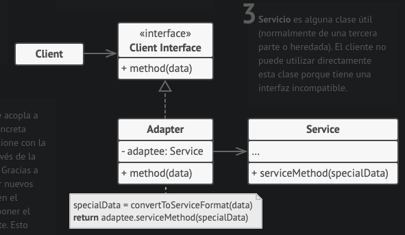

**Aplicabilidad**

- Utiliza la clase adaptadora cuando quieras usar una clase existente, pero cuya interfaz no sea compatible con el resto del código.
- Utiliza el patrón cuando quieras reutilizar varias subclases existentes que carezcan de alguna funcionalidad común que no pueda añadirse a la superclase.

**Pros**

- Principio de **responsabilidad única**. Puedes separar la interfaz o el código de conversión de datos de la lógica de negocio primaria del programa.
- Principio de **abierto/cerrado**. Puedes introducir nuevos tipos de adaptadores al programa sin descomponer el código cliente existente, siempre y cuando trabajen con los adaptadores a través de la interfaz con el cliente.

**Contras**

- La complejidad general del código aumenta, ya que debes introducir un grupo de nuevas interfaces y clases. En ocasiones resulta más sencillo cambiar la clase de servicio de modo que coincida con el resto de tu código.

### Patron bridge

**Proposito**

Bridge es un patrón de **diseño estructural** que te permite **dividir** una **clase grande**, o un **grupo de clases** estrechamente relacionadas, en **dos jerarquías separadas** (abstracción e implementación) que pueden **desarrollarse independientemente** la una de la otra.

Digamos que tienes una `clase geométrica` Forma con un par de subclases: `Círculo` y `Cuadrado`. Deseas extender esta jerarquía de clase para que incorpore **colores**, por lo que planeas crear las subclases de forma `Rojo` y `Azul`. Sin embargo, como ya tienes dos subclases, tienes que crear **cuatro combinaciones** de clase, como `CírculoAzul` y `CuadradoRojo`. Añadir nuevos tipos de forma y color a la jerarquía hará que ésta **crezca exponencialmente**. 

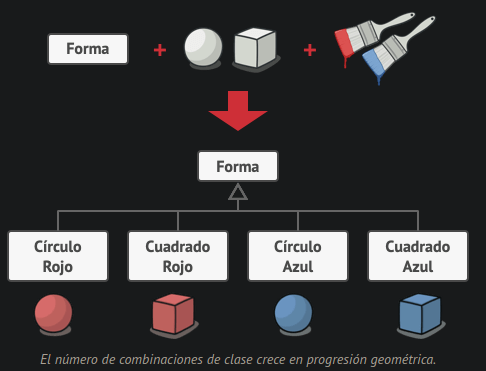

**Solucion**

El **patrón Bridge** intenta resolver este problema pasando de la herencia a la **composición del objeto**. Esto quiere decir que se **extrae** una de las **dimensiones** a una **jerarquía** de **clases separada**, de modo que las clases originales **referencian** un **objeto** de la nueva jerarquía, en lugar de tener todo su estado y sus funcionalidades dentro de una clase.

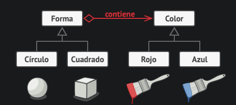

**Estructura**

**Aplicabilidad**

- Utiliza el patrón Bridge cuando quieras **dividir** y organizar una **clase monolítica** que tenga muchas variantes de una sola funcionalidad (por ejemplo, si la clase puede trabajar con diversos servidores de bases de datos).

- Utiliza el patrón cuando necesites **extender** una clase en varias **dimensiones ortogonales** (independientes).

- Utiliza el patrón Bridge cuando necesites poder **cambiar implementaciones** durante el **tiempo de ejecución**.

**Pros**

- Puedes **crear clases** y aplicaciones **independientes de plataforma**.
- El **código cliente** funciona con abstracciones de alto nivel. **No está expuesto** a los **detalles de la plataforma**.
- **Principio de abierto/cerrado**. Puedes introducir nuevas abstracciones e implementaciones independientes entre sí.
- **Principio de responsabilidad única**. Puedes centrarte en la lógica de alto nivel en la abstracción y en detalles de la plataforma en la implementación.

**Contras**

- Puede ser que el código se complique si aplicas el patrón a una **clase muy cohesionada**.

### Patron composite

**Propósito**

Composite es un **patrón de diseño estructural** que te permite componer objetos en **estructuras de árbol** y trabajar con esas estructuras como si fueran **objetos individuales**.

**Problema**

Imagina que tienes dos tipos de objetos: `Productos` y `Cajas`. Una Caja puede contener varios Productos así como cierto número de Cajas más pequeñas. Estas Cajas pequeñas también pueden contener algunos Productos o incluso Cajas más pequeñas, y así sucesivamente.

Digamos que decides crear un sistema de pedidos que utiliza estas clases. Los pedidos pueden contener productos sencillos sin envolver, así como cajas llenas de productos... y otras cajas. ¿Cómo determinarás el precio total de ese pedido?

Tienes que **conocer** de antemano las **clases** de Productos y Cajas a iterar, el **nivel de anidación** de las cajas y otros detalles desagradables.

**Solución**

El patrón Composite sugiere que trabajes con Productos y Cajas a través de una **interfaz común** que declara un método para calcular el precio total.

La gran ventaja de esta solución es que no tienes que preocuparte por las **clases concretas** de los objetos que componen el árbol. No tienes que saber si un objeto es un producto simple o una sofisticada caja. Puedes tratarlos a todos por igual a través de la **interfaz común**. Cuando invocas un método, los propios objetos pasan la solicitud a lo largo del árbol.

**Estructura**

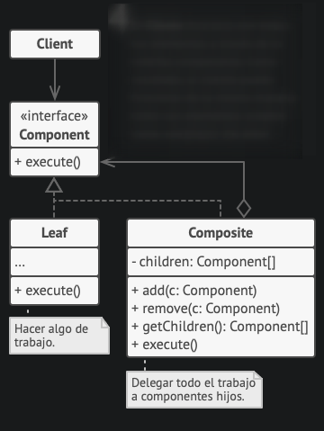

**Aplicabilidad**

- Utiliza el patrón Composite cuando tengas que implementar una **estructura de objetos** con **forma de árbol**.
- Utiliza el patrón cuando quieras que el código cliente trate elementos **simples** y **complejos** de la **misma forma**.

**Pros**

- Puedes trabajar con estructuras de árbol complejas con mayor **comodidad**: utiliza el polimorfismo y la recursión en tu favor.
- **Principio de abierto/cerrado**. Puedes introducir nuevos tipos de elemento en la aplicación sin descomponer el código existente, que ahora funciona con el árbol de objetos.

**Contras**

- Puede resultar **difícil** proporcionar una **interfaz común** para **clases** cuya **funcionalidad difiere** demasiado. En algunos casos, tendrás que **generalizar en exceso** la interfaz componente, provocando que sea más **difícil de comprender**.

### Patron decorator

**Propósito**

Decorator es un **patrón de diseño estructural** que te permite **añadir funcionalidades** a objetos **colocando** estos objetos dentro de **objetos encapsuladores** especiales que contienen estas funcionalidades.

**Problema**

Imagina que estás trabajando en una **biblioteca de notificaciones** que permite a otros programas notificar a sus usuarios acerca de eventos importantes.

La versión inicial de la biblioteca se basaba en la clase Notificador que solo contaba con unos cuantos campos, un constructor y un único método **send**. El método podía aceptar un argumento de mensaje de un cliente y enviar el mensaje a una lista de **correos electrónicos** que se pasaban a la clase notificadora a través de su constructor. 

A muchos de los usuarios les gustaría recibir mensajes **SMS**, otros por **Facebook** y por **Slack**.

Para ello Extendemos la clase Notificador y metemos los métodos adicionales de notificación dentro de nuevas subclases.

Pero entonces alguien te hace una pregunta razonable: “**¿Por qué no se pueden utilizar varios tipos de notificación al mismo tiempo?**“

Intentaste solucionar ese problema creando **subclases** especiales que **combinaban** varios **métodos** de notificación dentro de una clase. Sin embargo, enseguida resultó evidente que esta solución **inflaría** el código en gran medida, no sólo el de la biblioteca, sino también el código cliente.

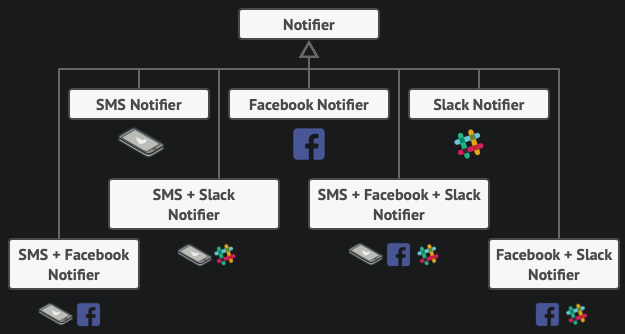

**Solución**

Como vimos anteriormente, la herencia tiene varias **limitaciones** importantes de las que debes ser consciente.

Una de las formas de superar estas limitaciones es empleando la Agregación o la **Composición**

puedes sustituir fácilmente el objeto “ayudante” vinculado por otro, cambiando el comportamiento del contenedor durante el **tiempo de ejecución**.

“**Wrapper**” (envoltorio, en inglés) es el sobrenombre alternativo del patrón Decorator, que expresa claramente su idea principal. Un wrapper es un objeto que puede **vincularse con** un objeto **objetivo**. El wrapper contiene el mismo grupo de métodos que el objetivo y le delega todas las solicitudes que recibe. No obstante, el wrapper puede **alterar** el **resultado** haciendo algo **antes o después** de pasar la solicitud al objetivo.

Los **wrapper** implementan la misma **interfaz** que el **objeto envuelto**. Éste es el motivo por el que, desde la perspectiva del cliente, estos objetos son **idénticos**. Haz que el campo de referencia del wrapper acepte cualquier objeto que siga esa interfaz. Esto te permitirá **envolver** un objeto en **varios wrappers**, añadiéndole el comportamiento combinado de todos ellos.

**Estructura**

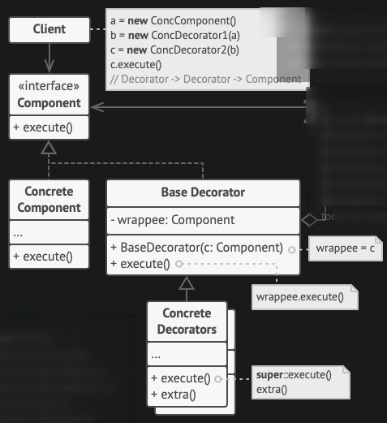

**Aplicabilidad**

- Utiliza el patrón Decorator cuando necesites **asignar funcionalidades** adicionales a objetos durante el **tiempo de ejecución** sin descomponer el código que utiliza esos objetos.
- Utiliza el patrón cuando resulte extraño o no sea posible **extender** el **comportamiento** de un objeto **utilizando** la **herencia**.

**Pros**

- Puedes **extender el comportamiento** de un objeto **sin crear una nueva subclase**.
- Puedes añadir o eliminar responsabilidades de un objeto durante el **tiempo de ejecución**.
- Puedes **combinar** varios **comportamientos** **envolviendo** un objeto con **varios decoradores**.
- **Principio de responsabilidad única**. Puedes dividir una clase monolítica que implementa muchas variantes posibles de comportamiento, en varias clases más pequeñas.

**Contras**

- Resulta difícil **eliminar** un **wrapper específico** de la pila de wrappers.
- Es difícil implementar un decorador de tal forma que su comportamiento no dependa del orden en la pila de decoradores.
- El código de configuración inicial de las capas pueden tener un aspecto desagradable.

### Patron facade

**Propósito**

Facade es un **patrón de diseño estructural** que proporciona una **interfaz simplificada** a una **biblioteca**, un **framework** o cualquier otro grupo complejo de clases.

**Problema**

Imagina que debes lograr que tu código trabaje con un amplio grupo de objetos que pertenecen a una sofisticada biblioteca o framework. Normalmente, debes inicializar todos esos objetos, llevar un registro de las dependencias, ejecutar los métodos en el orden correcto y así sucesivamente.

Como resultado, la lógica de negocio de tus clases se vería estrechamente acoplada a los detalles de implementación de las clases de terceros, haciéndola difícil de comprender y mantener.

**Solución**

Una fachada es una clase que proporciona una **interfaz simple** a un subsistema complejo que contiene muchas partes móviles. Una fachada puede proporcionar una **funcionalidad limitada** en comparación con trabajar directamente con el subsistema. Sin embargo, tan solo incluye las **funciones** realmente **importantes** para los clientes.

**Estructura**

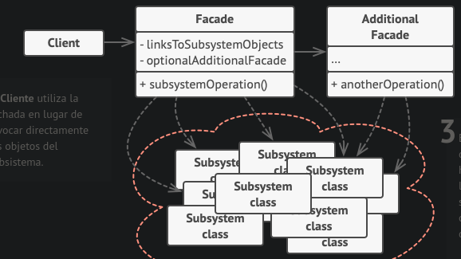

**Aplicabilidad**

- Utiliza el patrón Facade cuando necesites una interfaz limitada pero directa a un subsistema complejo.
- Utiliza el patrón Facade cuando quieras estructurar un subsistema en capas.

**Pros**

- Puedes aislar tu código de la complejidad de un subsistema.

**Contras**

- Una fachada puede convertirse en un [objeto todopoderoso](https://es.wikipedia.org/wiki/Objeto_todopoderoso) acoplado a todas las clases de una aplicación.

### Patron FlyWeight

**Propósito**

Flyweight es un patrón de diseño estructural que te permite **mantener más objetos** dentro de la **cantidad disponible de RAM** **compartiendo** las **partes comunes** del estado entre varios objetos en lugar de mantener toda la información en cada objeto.

**Problema**

Creas un sencillo videojuego con **grandes cantidades** de balas, misiles y metralla de las que explosiones volarán por todo el mapa, ofreciendo una apasionante experiencia al jugador.

Al terminarlo se lo envias a un amigo para una partida de prueba. Aunque el juego funcionaba sin problemas en tu máquina, tu amigo no logró jugar durante mucho tiempo. En su computadora el juego se paraba a los pocos minutos de empezar. Descubres que el juego se paraba debido a una cantidad insuficiente de RAM. Resulta que el equipo de tu amigo es mucho menos potente que tu computadora.

El problema estaba relacionado con tu sistema de partículas. Cada partícula, como una bala, un misil o un trozo de metralla, estaba representada por un objeto separado que contenía gran cantidad de datos. En cierto momento, cuando la masacre alcanzaba su punto culminante en la pantalla del jugador, las partículas recién creadas ya no cabían en el resto de RAM, provocando que el programa fallara.

**Solución**

La información constante de un objeto suele denominarse su **estado intrínseco**. Existe dentro del objeto y otros objetos únicamente pueden leerla, no cambiarla. El resto del estado del objeto, a menudo alterado “desde el exterior” por otros objetos, se denomina el **estado extrínseco**.

El patrón Flyweight sugiere que dejemos de **almacenar** el **estado extrínseco** dentro del objeto. En lugar de eso, debes **pasar este estado** a **métodos específicos** que **dependen de él**. Tan solo el estado intrínseco se mantiene dentro del objeto, permitiendo que lo reutilices en distintos contextos. Como resultado, necesitarás menos de estos objetos, ya que sólo se diferencian en el estado intrínseco, que cuenta con muchas menos variaciones que el extrínseco.

**Almacenamiento del estado extrínseco**

crear una clase de contexto separada que almacene el estado extrínseco junto con la referencia al objeto flyweight. 

**Fabrica FlyWeight**

Para un acceso más cómodo a varios objetos flyweight, puedes crear un método fábrica que gestione un grupo de objetos flyweight existentes. El método acepta el estado intrínseco del flyweight deseado por un cliente, busca un objeto flyweight existente que coincida con este estado y lo devuelve si lo encuentra. Si no, crea un nuevo objeto flyweight y lo añade al grupo.

**Estructura**

**Aplicabilidad**

Utiliza el patrón Flyweight únicamente cuando tu programa deba soportar una **enorme cantidad de objetos** que apenas quepan en la RAM disponible.

**Pros**

- Puedes **ahorrar mucha RAM**, siempre que tu programa tenga toneladas de objetos similares.

**Contras**

- Puede que estés cambiando **RAM por ciclos CPU** cuando deba calcularse de nuevo parte de la información de contexto cada vez que alguien invoque un método flyweight.
- El código se **complica mucho**. Los nuevos miembros del equipo siempre estarán preguntándose por qué el estado de una entidad se separó de tal manera.

## Patrones de comportamiento

### patron strategy

Strategy es un **patrón de diseño de comportamiento** que te permite definir una **familia de algoritmos**, colocar cada uno de ellos en una **clase separada** y hacer sus **objetos intercambiables**.

**Problema**

Creas una aplicación de navegación para viajeros ocasionales. La aplicación giraba alrededor de un bonito mapa que ayudaba a los usuarios a orientarse rápidamente en cualquier ciudad.

Una de las funciones más solicitadas para la aplicación era la planificación automática de rutas. Un usuario debía poder introducir una dirección y ver la ruta más rápida a ese destino mostrado en el mapa.

La primera versión de la aplicación sólo podía generar las rutas sobre carreteras. Despues añadiste una opción para crear rutas a pie. Después, añadiste otra opción para permitir a las personas utilizar el transporte público en sus rutas. Más tarde planeaste añadir la generación de rutas para ciclistas, y más tarde, otra opción para trazar rutas por todas las atracciones turísticas de una ciudad.

Cada vez que añadías un nuevo algoritmo de enrutamiento, la clase principal del navegador doblaba su tamaño. En cierto momento, la bestia se volvió demasiado difícil de mantener.

**Solución**

El patrón Strategy sugiere que tomes esa clase que hace algo específico de muchas formas diferentes y **extraigas** todos esos **algoritmos** para colocarlos en **clases separadas** llamadas **estrategias**.

La clase original, llamada **contexto**, debe tener un campo para **almacenar** una **referencia** a una de las estrategias. El contexto delega el trabajo a un objeto de estrategia vinculado en lugar de ejecutarlo por su cuenta.

La clase contexto funciona con **todas las estrategias** a través de la misma **interfaz genérica**, que sólo expone un único método para disparar el algoritmo encapsulado dentro de la estrategia seleccionada.

**Estructura**

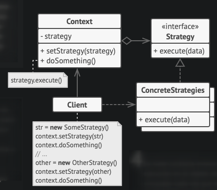

**Aplicabilidad**

- Utiliza el patrón Strategy cuando quieras utiliza **distintas variantes** de un algoritmo dentro de un objeto y poder **cambiar** de un algoritmo a otro durante el **tiempo de ejecución**.
- Utiliza el patrón Strategy cuando tengas muchas **clases similares** que sólo se diferencien en la **forma** en que **ejecutan** cierto **comportamiento**.
-  Utiliza el patrón para aislar la lógica de negocio de una clase, de los detalles de implementación de algoritmos que pueden no ser tan importantes en el contexto de esa lógica.
-  Utiliza el patrón cuando tu clase tenga un **enorme operador condicional** que cambie entre distintas variantes del mismo algoritmo.

**Pros**

- Puedes **intercambiar algoritmos** usados dentro de un objeto durante el **tiempo de ejecución**.
- Puedes **aislar** los **detalles** de **implementación** de un algoritmo del código que lo utiliza.
- Puedes sustituir la herencia por composición.
- **Principio de abierto/cerrado**. Puedes introducir nuevas estrategias sin tener que cambiar el contexto.

**Contras**

- Si sólo tienes un par de algoritmos que raramente cambian, no hay una razón real para complicar el programa en exceso con nuevas clases e interfaces que vengan con el patrón.
- Los clientes deben **conocer las diferencias entre estrategias** para poder seleccionar la adecuada.
- Muchos lenguajes de programación modernos tienen un soporte de tipo funcional que te permite implementar distintas versiones de un algoritmo dentro de un grupo de funciones anónimas. Entonces puedes utilizar estas funciones exactamente como habrías utilizado los objetos de estrategia, pero sin saturar tu código con clases e interfaces adicionales.

### Patron observer

**Propósito**

Observer es un **patrón de diseño de comportamiento** que te permite definir un **mecanismo de suscripción** para **notificar** a varios **objetos** sobre cualquier **evento** que le suceda al objeto que están observando.

**Problema**

Imagina que tienes dos tipos de objetos: un objeto `Cliente` y un objeto `Tienda`. El cliente está muy interesado en una marca particular de producto (digamos, un nuevo modelo de iPhone) que estará disponible en la tienda muy pronto.

El cliente puede **visitar** la tienda cada día para comprobar la disponibilidad del producto. Pero, mientras el producto está en camino, la mayoría de estos viajes serán en vano.

Por otro lado, la tienda podría enviar cientos de correos (lo cual se podría considerar **spam**) a todos los clientes cada vez que hay un nuevo producto disponible. Esto ahorraría a los clientes los interminables viajes a la tienda, pero, al mismo tiempo, molestaría a otros clientes que no están interesados en los nuevos productos.

**Solución**

El objeto que tiene un estado interesante le llamaremos **notificador**. El resto de los objetos que quieren conocer los cambios en el estado del notificador, se denominan **suscriptores**.

Este mecanismo consiste en: 1) un campo matriz para almacenar una lista de **referencias a objetos suscriptores** y 2) varios métodos públicos que permiten **añadir suscriptores** y **eliminarlos** de esa lista.

Ahora, cuando le sucede un evento importante al notificador, **recorre sus suscriptores** y llama al método de **notificación** específico de sus objetos.

Es fundamental que todos los suscriptores implementen la **misma interfaz** y que el notificador únicamente se comunique con ellos a través de esa interfaz. Esta interfaz debe declarar el **método de notificación** junto con un grupo de parámetros que el notificador puede utilizar para pasar cierta información contextual con la notificación.

**Estructura**

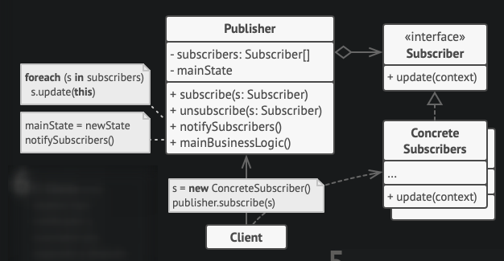

**Aplicabilidad**

- Utiliza el patrón Observer cuando los cambios en el estado de un objeto puedan necesitar **cambiar otros objetos** y el grupo de objetos sea desconocido de antemano o **cambie dinámicamente**.
- tiliza el patrón cuando algunos objetos de tu aplicación **deban observar** a otros, pero sólo durante un tiempo limitado o en casos específicos.

**Pros**

- **Principio de abierto/cerrado**. Puedes introducir nuevas clases suscriptoras sin tener que cambiar el código de la notificadora (y viceversa si hay una interfaz notificadora).
- Puedes **establecer relaciones** entre objetos durante el **tiempo de ejecución**.

**Contras**

-  Los suscriptores son notificados en un orden aleatorio.

## Antipatrones

Un antipatron es un patron que invariablemente conduce a una mala solucion para un problema. Un buen programador procurará evitar los antipatrones siempre que sea posible, lo que requiere su reconocimiento e identificación tan pronto como sea posible, dentro del ciclo de vida del software.

### Antipatrones de programacion

**Accidental complexity**

Agregar complejidad inecesaria al codigo

**Cult programming**

Usar patrones, metodos y/o metodologias sin saber porque

**Spaghetti code**

Construir sistemas cuya estructura es difícilmente comprensible, especialmente debido a la escasa utilización de estructuras de programación.

**Hard code**

Incluir constantes y variables **supuestas** al codigo

**Soft code**

La abstracción de demasiados valores y características puede introducir más problemas de complejidad y mantenimiento que los que se experimentarían al cambiar el código cuando sea necesario.

**Lava flow**

Mantener código viejo, malo o redundante

**Boat anchor**

Mantener parte del codigo que no se use mas

**Magic numbers/strings**

Incluir numeros o strings **pelados** en comparaciones o eventos.

**Single function exit point**

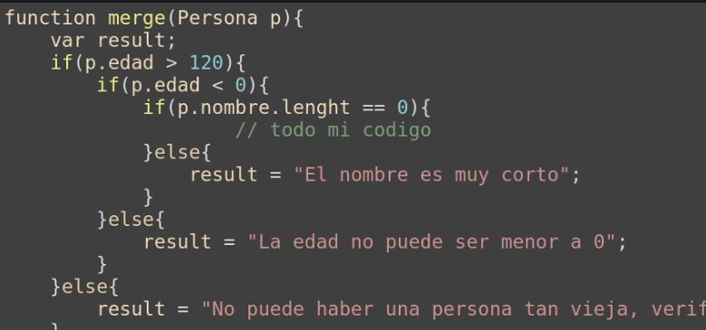

**Guard class**

**Arrow**

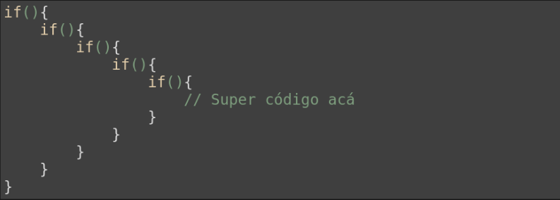

### Antipatrones de metodologia

**Copy and paste programming**

Copiar y pegar de stack overflow

**Tester Driven Development**

Probar, corregir, probar, corregir, probar, corregir

**silver bullet**

Asumir que nuestra solución técnica favorita puede resolver un problema mucho mayor.

**Programing by permutati**

Tratar de aproximarse a una solución modificando el código una y otra vez para ver si acaba por funcionar.

### Antipatrones de diseño

**Dependencias circulares**

Una clase depende de otra y esta depende de la primera (?)

**God Object**

Concentrar demasiada funcionalidad en una única parte del diseño (clase).

**Sequential Coupling**

Construir una clase que necesita que sus métodos se invoquen en un orden determinado.

**Base bean**

Heredar funcionalidad de una clase utilidad en lugar de delegar en ella.

## Concurrencia y paralelismo

**Concurrencia** se refiere a la habilidad de distintas partes del programa de ser ejecutados en **desorden**.

El **paralelismo** es la capacidad de realizar varios calculos **simultáneamente** basado en el principio de divide y triunfaras.

El paralelismo solo funciona si tenemos mas de 1 procesador. Si tenemos **n procesadores**, podremos realizar **n procesos** simultaneamente.

En un sistema **monoprocesador** se **intercalan** las operaciones de las tareas (multiplexado en el tiempo, **paralelismo lógico**)

### Concurrencia VS. Paralelismo

* La concurrencia es mas general que el paralelismo
* Las soluciones en P. Concurrente son validas en paralelismo
* Paralelismo es ejecución simultanea de procesos concurrentes
* Paralelismo implica concurrencia, pero concurrencia no siempre implica paralelismo

### Aplicaciones

Se suele aplicar concurrencia en **GUI's reactivas**, en **servidores**, para mejorar el **rendimiento** (con respecto al tiempo) y para realizar **calculos complejos**.

### Propiedades

Los programas concurrentes deben ser:

* Correctos (Hacen lo esperado)
* Seguros (Sin errores)
* Vivaces (Nunca apagados)
* Equitativos (Todos los hilos hacen la misma cantidad de procesos)

### Arquitecturas concurrentes (?)

* SMP
* NUMA
* GPGPU

### Nota

Lo que denominamos como "tiempo real" depende de lo que se espera del sistema, TIEMPO REAL != PERFORMANCE!!!!

### Problemas de la concurrencia

Si muchos hilos utilizan la misma variable, pueden surgir problemas. Esto se llama **seccion critica**

Cuando el resultado depende del orden de entrada de las operaciones de c/hilo se llama **Condición de Carrera**

Para evitar condiciones de carrera es preciso asegurar la **exclusión mutua** entre hilos en las regiones criticas.Cuando un hilo está en una región crítica, **ningún** otro **hilo** puedo **acceder** a los **mismos datos**. De esta forma se consiguen que las operaciones con variables compartidas sean **atómicas**.

`Mutex`

Forma para asegurar la exclucion mutua (lock, unlock)
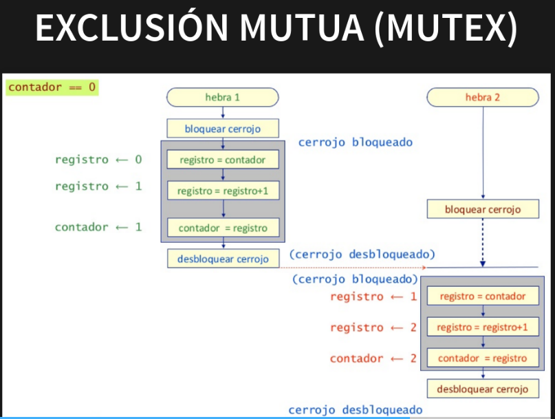

#### DeadLocks

Situación en la que varios hilos están **suspendidos** esperando unos de otros y ninguno puedo avanzar. Se puede dar cuando se usan recursos de forma **exclusiva** y se asignan a **distintos hilos**.

Los interbloqueos no se pueden detectar, pero si prevenir.

#### Livelock

Ninguno de los procesos conseguirá los recursos: bloqueo "vivo"

#### starvation
Uno de los procesos no conseguirá nunca los recursos: inanición

## Telecomunicaciones

### Modelo OSI

Este es un **modelo** de **referencia** para los **protocolos** de la red. Está conformado por **7 capas** o niveles de abstracción. Cada uno de estos niveles tendrá sus propias **funciones** para que en conjunto sean capaces de poder alcanzar su objetivo final.

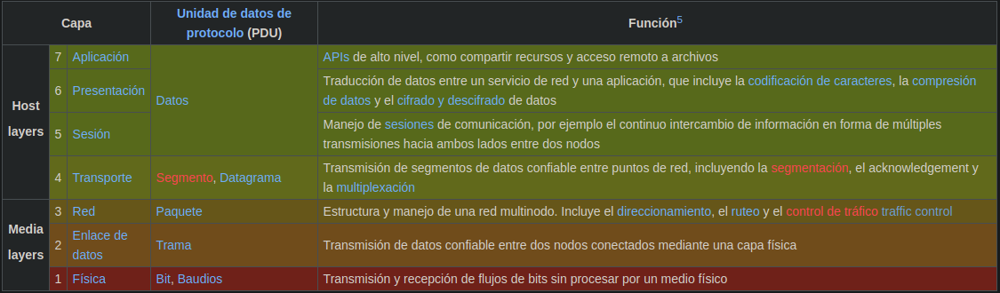

### Protocolo IP

Perteneciente a la **capa de red** (3) del modelo OSI, su función principal es el uso bidireccional en origen o destino de **comunicación** para **transmitir datos** mediante un protocolo no orientado a conexión que transfiere paquetes conmutados a través de distintas redes físicas previamente enlazadas según la norma OSI de enlace de datos.

Mediante **IPv4**, Se nos otorgan **direcciones IP** que nos permiten identificarnos en la RED, ya sea direcciones **publicas** o **privadas** para identificarnos en las respectivas redes publicas o privadas.

Estas direcciones son del tipo

192.168.0.1

Donde el numero maximo que puede tomar una seccion es 255.

### Protocolo TCP

Una vez conectado un dispositivo con otro mediante el protocolo IP, el dispositivo destino (que llamaremos servidor) gracias al protocolo TCP es capas de otorgar varios **servicios** al mismo tiempo mediante "puertos".

Estos puertos son numeros que van desde el 0 al 64535 (2¹⁶) y se indican con : luego de la direccion IP: xxx.xxx.xxx.xxx:80

Los puertos mas comunes son:
(Destaco el SSH -> 21)

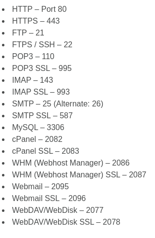

### Protocolo HTTP

HTTP, de sus siglas en inglés: "**Hypertext Transfer Protocol**", es el nombre de un protocolo el cual nos permite realizar una **petición de datos** y recursos, como pueden ser **documentos HTML**.

Esta basado en Requests y Responses(req, res)

Es imprescindible conocerlo para desarrollar sistemas web.

### Protocolo DNS

(Domain Name Service)Es un protocolo que sirve para **traducir** un "nombre" a una IP para no tener que acordarse de cada IP cuando queramos acceder a cada pagina/servicio web.

Los dominios son **otorgados** por entidades mediante un sistema **jerarquico** en donde las organizaciones principales son ., .com, .net (USA), la organizacion . le otorga a argentina el .ar y argentina nos puede otorgar nuestro dominio .com.ar, etc.

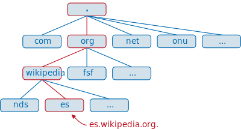

El protocolo HTTP utiliza URL's para identificar univocamente una pagina

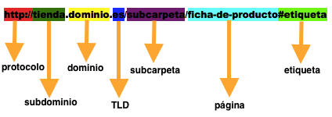

El protocolo HTTP define una serie de metodos que un cliente puede usar para pedir/modificar los datos de un servidor. Los mas usados son:

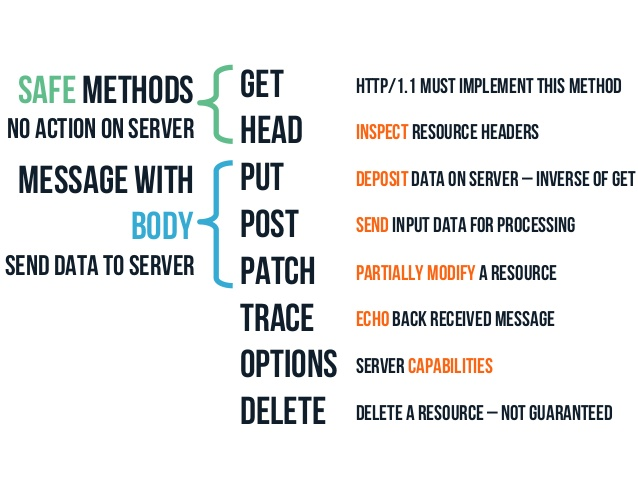

El protocolo HTTP tambien contiene **HEADERS**. Los HTTP headers son la parte central de los HTTP **requests** y **responses**, y transmiten información acerca del navegador del cliente, de la página solicitada, del servidor, etc.

Los **responses** pueden devolver headers con distintos **codigos**. Estos codigos son:

## Patron Arquitectonico

Un patron arquitectonico es una solucion general y reutlizable a un problema comun en la arquitectura de software dentro de un contexto dado. Los patrones arquitectonicos son **similares** al **patron de diseño** de software pero tienen un **alcance mas amplio**.

### Patron MVC

MVC (Model-View-Controller) es un **patrón arquitectural**, un modelo o guía que expresa **cómo** organizar y **estructurar** los **componentes** de un sistema software, sus responsabilidades y las relaciones existentes entre cada uno de ellos.

La arquitectura MVC propone, independientemente de las tecnologías o entornos en los que se base el sistema a desarrollar, la **separación** de los componentes de una aplicación en tres grupos (o capas) principales: el **modelo**, la **vista**, y el **controlador**, y describe cómo se relacionarán entre ellos para mantener una estructura organizada, limpia y con un **acoplamiento mínimo** entre las distintas capas.

**Modelo**

En la capa Modelo encontraremos siempre una **representación** de los **datos** del dominio, es decir, aquellas entidades que nos servirán para almacenar información del sistema que estamos desarrollando.

El Modelo será también el encargado de **gestionar** el **almacenamiento** y recuperación de datos y entidades del dominio, es decir, incluirá **mecanismos** de **persistencia** o será capaz de **interactuar** con ellos. Dado que habitualmente la persistencia se delega a un motor de bases de datos, es muy frecuente encontrar en el Modelo la implementación de componentes tipo DAL (Data Access Layer, o Capa de Acceso a Datos) y **ORMs**.

**Vista**

Los componentes de la Vista son los responsables de generar la **interfaz** de nuestra aplicación, es decir, de componer las **pantallas**, **páginas**, o cualquier tipo de **resultado** utilizable por el usuario o **cliente** del sistema. De hecho, suele decirse que la Vista es una representación del estado del Modelo en un momento concreto y en el contexto de una acción determinada.

**Controlador**

La misión principal de los componentes incluidos en el Controlador es actuar como **intermediarios** entre el usuario y el sistema. Serán capaces de **capturar** las **acciones** de éste sobre la Vista, como puede ser la pulsación de un botón o la selección de una opción de menú, **interpretarlas** y **actuar** en **función** de ellas. Por ejemplo, retornando al usuario una nueva vista que represente el estado actual del sistema, o invocando a acciones definidas en el Modelo para consultar o actualizar información.

Realizarán también tareas de **transformación** de **datos** para hacer que los componentes de la Vista y el Modelo se entiendan. Así, traducirán la información **enviada** **desde** la **interfaz**, por ejemplo los valores de campos de un formulario recibidos mediante el protocolo HTTP, a objetos que puedan ser comprendidos por el Modelo, como pueden las clases o las entidades del dominio.

Y de la misma forma, el Controlador **tomará** la **información** procedente del **Modelo** y la **adaptará** a formatos o estructuras de datos que la **Vista** sea **capaz** de **manejar**.

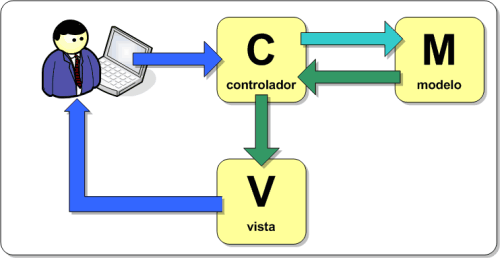

## ORM

Un ORM es un **modelo de programación** que permite **mapear** las **estructuras** de una **base de datos relacional** (SQL Server, Oracle, MySQL, etc.), a una **estructura lógica** de entidades con el objeto de **simplificar** y **acelerar** el **desarrollo** de nuestras **aplicaciones**.

