# Resumen Arquitectura de software

## Indice
- [Resumen Arquitectura de software](#resumen-arquitectura-de-software)
  - [Indice](#indice)
  - [Introduccion](#introduccion)
    - [Repaso de POO](#repaso-de-poo)
    - [SOLID](#solid)
  - [Principios SOLID](#principios-solid)
    - [Principio de responsabilidad simple](#principio-de-responsabilidad-simple)
    - [Principio abierto / cerrado](#principio-abierto--cerrado)
    - [Sustitucion de Liskov](#sustitucion-de-liskov)
    - [Segreegacion de la interfaz](#segreegacion-de-la-interfaz)
    - [Inversion de dependencia](#inversion-de-dependencia)
  - [Patrones de diseño](#patrones-de-diseño)
    - [Introduccion](#introduccion-1)
    - [Clasificacion](#clasificacion)
    - [Patron builder](#patron-builder)
    - [Patron singleton](#patron-singleton)
    - [Patron abstract factory](#patron-abstract-factory)
    - [Patron factory method](#patron-factory-method)

## Introduccion

Los **principios de programacion** son un conjunto de reglas que al aplicarlas al escribir codigo mejoran la **mantenibilidad** y **extensibilidad** del mismo.

Uno de estos principios es conocido como principios **SOLID** (Principios, no reglas)

Algunos de los problemas que empeoran la "calidad" del codigo son por ejemplo:
- Codigo muy grande
- Codigo repetido
- Necesidad de retocar codigo ya desarrollado para realizar un cambio al programa
- Complejidad ciclomatica elevada (Muchas sentencias dentro de otras sentencias)

### Repaso de POO

Pilares:

1. Encapsulamiento
2. Herencia
3. Polimorfismo
4. Abstraccion

**Buenas practicas** de POO:

- Poco **acoplamiento**: relacion entre modulos del sistema y su interdependencia. Si hay poca dependencia, hay mayor reusabilidad en otros sistemas
- Mucha **cohesion**: 1 modulo tiene 1 responsabilidad

**Design smells**:
Decimos que el codigo "Huele" cuando este funciona, pero tenemos una intuicion de que algo no esta bien y puede ser mejorado. Algunos smells son:
- Rigidez (Cuando un cambio genera una cascada de cambios)
- Fragilidad (Un cambio explota el codigo)
- Inmovilidad (Codigo poco rehusable)
- Viscocidad (El codigo induce a hacer malas practicas)
- Complejidad innecesaria
- Repeticion innecesaria
- Opacidad (Complejo de leer, poco intuitivo)

**Principios de diseño en POO**

- **DRY** (Dont Repeat Yourself)
- **KISS** (Keep it simple stupid)
- **YAGNI** (You Are Gonna Need It)
- **SOLID**

### SOLID

* Single responsability
* Open closed
* Liskov substitution
* Interface segregation
* Dependency inversion

## Principios SOLID

### Principio de responsabilidad simple 

Una clase debe tener una y solo una razon de cambio / responsabilidad

**Cuando aplicar este principio**
- Clase muy larga (+300 lineas Aprox.)
- Metodo muy largo (+40 lineas Aprox.)
- Muchas dependencias a otros objetos (+20 Aprox)
- Baja cohesion
- nombres muy genericos
- uso del antipatron [Spaghetti code](https://es.wikipedia.org/wiki/C%C3%B3digo_espagueti)

**Sobre que elementos aplicar este principio**

  - Metodos
  - Clases
  - Bibliotecas
  - Modulos
  - Sistemas

**Contras del principio**
- Genera muchas clases
- Codigo mas complicado de leer (no siempre)

### Principio abierto / cerrado

Todas las entidades de software deben ser abiertas a la **extension**, pero cerradas a la **modificacion**.

Debemosser capaces de **extender** el comportamiento del codigo sin tener que **modificar** su contenido.

**¿Sobre que elementos?**

- Funciones
- Clases
- Modulos

**Beneficios**

- Menus bugs
- bajo acoplamiento
- Flexibilidad
- Facil mantenimiento

**¿Cuando aplicar?**

- Case sujeta a un posible futuro cambio/s
- Extender una libreria de terceros

**Contras**

- Esfuerzo para diseñar
- mayor experiencia

### Sustitucion de Liskov

- Una clase **derivada** puede ser **reemplazada** por cualquier otra que use la **misma** clase **base** sin alterar su correcto funcionamiento

Este principio soplo afecta a **clases**

**Beneficios**

- Flexibilidad
- Facil mantenimiento

**¿Cuando aplicar?**

- para extender la funcionalidad del codigo usando clases derivadas sin tocar la base
- Existan clases que compartan comportamiento
- Al aplicar el principio open/closed

### Segreegacion de la interfaz

- La clase hijo no debe ser forzado a implementar **interfaces** que no necesite
- Interfaces pequeñas que resuelvan problemas especificos

**Se aplica a**
- Clases
- Interfaces

**Beneficios**
- Bajo acoplamiento
- Alta cohesion
- Codigo facil de mantener

**Cuando aplicar**
- Clases con metodos vacios o que devuelvan valores por defecto
- Clases con metodos que devuelvan excepciones
- Clase hijo solo usa algunos metodos de la padre

### Inversion de dependencia

Los modulos de alto nivel no deben depender de los de bajo nivel. Ambos deben depender de **abstracciones**.

Las abstracciones no deben depender de los detalles, sino mas bien los detalles deben depender de las abstracciones

**Se aplica a**

- Clases
- Modulos

**Beneficios**

- Bajo acoplamiento
- Testeabilidad
- Flexibilidad

**Cuando aplicar**

- Nivel de acoplamiento alto

**Desventajas**

- Mucha experiencia
- Mas esfuerzo para diseñar
- Muchas interfaces

## Patrones de diseño

### Introduccion

Los patrones de diseño son **soluciones habituales** a problemas que ocurren con **frecuencia** en el diseño de software. Son como planos prefabricados que se pueden personalizar para resolver un problema de diseño recurrente en tu código (El código del mismo patrón aplicado a dos programas distintos puede ser diferente).

**¿En qué consiste el patrón?**

Los patrones se definen de manera formal, y constan de:

- El **propósito** del patrón explica brevemente el problema y la solución.
- La **motivación** explica en más detalle el problema y la solución que brinda el patrón.
- La **estructura** de las clases muestra cada una de las partes del patrón y el modo en que se relacionan.
- El **ejemplo de código** en uno de los lenguajes de programación populares facilita la asimilación de la idea que se esconde tras el patrón.

**Historia de los patrones**

La idea fue recogida por cuatro autores: Erich Gamma, John Vlissides, Ralph Johnson y Richard Helm. En 1995, publicaron **Patrones de diseño**, en el que aplicaron el concepto de los patrones de diseño a la **programación**. El libro presentaba **23 patrones** que resolvían varios problemas del diseño orientado a objetos y se convirtió en un éxito de ventas con rapidez. Al tener un título tan largo en inglés, la gente empezó a llamarlo “el libro de la ‘**gang of four’**

**Beneficios de usar patrones**

- Te enseña a resolver **todo tipo** de **problemas** utilizando principios del diseño orientado a objetos.
- Los patrones de diseño definen un **lenguaje común** que puedes utilizar con tus compañeros de equipo para **comunicaros** de forma más **eficiente**.

**Criticas**

1 Normalmente, la necesidad por los patrones surge cuando la gente elige un lenguaje de programación o una tecnología que **carece** del **nivel necesario de abstracción**. En este caso, los patrones se convierten en una chapuza que otorga al lenguaje unas súper habilidades muy necesitadas.

Por ejemplo, el patrón **Strategy** puede implementarse con una simple función anónima (**lambda**) en la mayoría de lenguajes de programación modernos.

2 Los patrones intentan sistematizar soluciones cuyo uso ya es generalizado. Esta unificación es vista por muchos como un dogma, e implementan los patrones “al pie de la letra”, **sin adaptarlos** al contexto del proyecto particular.

3 "Si lo único que tienes es un martillo, todo te parecerá un clavo." Este es el problema que persigue a muchos **principiantes** que acaban de familiarizarse con los patrones. Una vez que aprenden sobre patrones, intentan aplicarlos en **todas partes**, incluso en situaciones en las que un código más simple funcionaría perfectamente bien.

### Clasificacion

Los patrones más básicos y de más bajo nivel suelen llamarse **idioms**. Normalmente se aplican a un **único lenguaje** de programación.

Los patrones más universales y de más alto nivel son los **patrones de arquitectura**. Los desarrolladores pueden implementar estos patrones prácticamente en **cualquier lenguaje**. Al contrario que otros patrones, pueden utilizarse para diseñar la arquitectura de una **aplicación completa**.

Además, todos los patrones pueden clasificarse por su **propósito**. Este libro cubre tres grupos generales de patrones:

- Los patrones **creacionales** proporcionan mecanismos de **creación de objetos** que incrementan la **flexibilidad** y la **reutilización** de código existente.
- Los patrones **estructurales** explican cómo **ensamblar objetos** y clases en estructuras más grandes a la vez que se mantiene la flexibilidad y eficiencia de la estructura.
- Los patrones de **comportamiento** se encargan de una **comunicación efectiva** y la asignación de responsabilidades **entre objetos**.

Ahora vemos algunos de los patrones que son mas utilizados.

### Patron builder

**Proposito**

Es un patrón de diseño **creacional** que nos permite construir objetos complejos **paso a paso**. El patrón nos permite producir distintos tipos y representaciones de un objeto empleando el mismo código de construcción.

**Problema**

Se usa para instanciar objetos provenientes de clases con **muchos atributos**.

Imagina un **objeto complejo** que requiere una inicialización laboriosa, paso a paso, de **muchos campos y objetos anidados**. Normalmente, este código de inicialización está sepultado dentro de un **¡¡¡MONSTRUOSO CONSTRUCTOR!!!** con una gran cantidad de parámetros. O, peor aún: disperso por todo el código cliente en forma de muchisimas **subclases**.

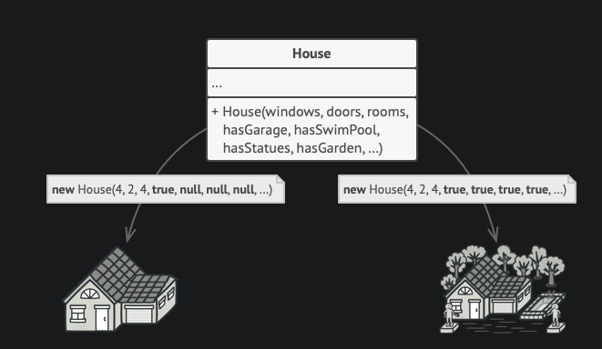
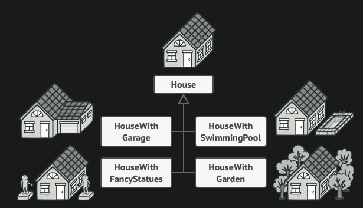

**Solucion**

El patrón Builder sugiere que saques el código de construcción del objeto de su propia clase y lo coloques dentro de **objetos independientes** llamados constructores.

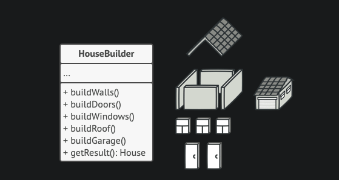

Podemos crear **varias clases constructoras** distintas que implementen la misma serie de pasos de construcción, pero de forma diferente. Entonces podemos utilizar estos constructores en el proceso de construcción (por ejemplo, una serie ordenada de llamadas a los pasos de construcción) **para producir distintos tipos de objetos**.

Puedes ir más lejos y extraer una serie de llamadas a los pasos del constructor que utilizas para construir un producto y ponerlas en una clase independiente llamada directora. La **clase directora** define el orden en el que se deben ejecutar los pasos de construcción, mientras que el constructor proporciona la implementación de dichos pasos.

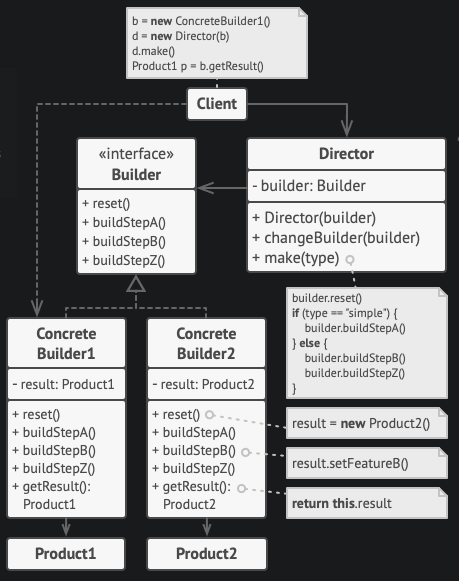

### Patron singleton

Singleton es un patrón de diseño **creacional** que nos permite asegurarnos de que una clase tenga una **única instancia**, a la vez que proporciona un **punto de acceso global** a dicha instancia.

**Solucion**

1. Hacer **privado el constructor** por defecto para evitar que otros objetos utilicen el operador new con la clase Singleton.
2. Crear un método de **creación estático** que actúe como constructor. Tras bambalinas, este método invoca al constructor privado para crear un objeto y lo guarda en un **campo estático**. Las siguientes llamadas a este método devuelven el objeto almacenado en caché.

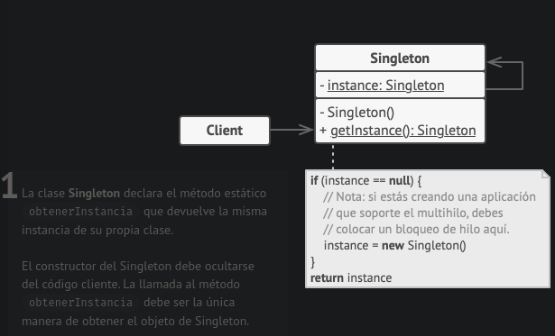

**Aplicabilidad**

* Utiliza el patrón Singleton cuando una clase de tu programa tan solo deba tener **una instancia disponible** para **todos los clientes**.
* Utiliza el patrón Singleton cuando necesites un **control más estricto** de las variables globales.

**Pros**

* Puedes tener la certeza de que una clase tiene una **única instancia**.
* Obtienes un punto de **acceso global** a dicha instancia.
* El objeto Singleton solo se **inicializa** cuando se requiere por **primera vez**.

**Contras**

* Vulnera el Principio de **responsabilidad única**. El patrón resuelve **dos problemas** al **mismo tiempo**.
* El patrón Singleton puede enmascarar un **mal diseño**, por ejemplo, cuando los componentes del programa saben demasiado los unos sobre los otros.
* El patrón requiere de un tratamiento especial en un entorno con múltiples hilos de ejecución, para que varios hilos no creen un objeto Singleton varias veces.
* Puede resultar **complicado** realizar la **prueba unitaria del código** cliente del Singleton porque muchos frameworks de prueba dependen de la herencia a la hora de crear objetos simulados (mock objects).

### Patron abstract factory

Abstract Factory es un patrón de **diseño creacional** que nos permite producir **familias de objetos relacionados sin especificar sus clases concretas**.

**Problema**

Imagina que estás creando un simulador de tienda de muebles. Tu código está compuesto por clases que representan lo siguiente:

Una familia de productos relacionados, digamos: `Silla` + `Sofá` + `Mesilla`.

Algunas variantes de esta familia. Por ejemplo, los productos `Silla` + `Sofá` + `Mesilla` están disponibles en estas variantes: `Moderna`, `Victoriana`, `ArtDecó`.

Necesitamos una forma de crear objetos individuales de mobiliario para que **combinen** con otros objetos de la **misma familia**. Los clientes se **enfadan** bastante cuando reciben **muebles que no combinan**.

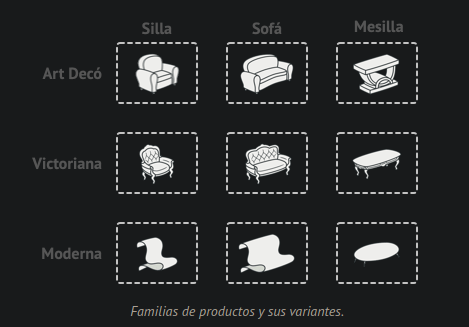

**Solución**

Lo primero que sugiere el patrón Abstract Factory es que declaremos de forma explícita **interfaces** para cada producto diferente de la familia de productos (por ejemplo, silla, sofá o mesilla). Después podemos hacer que todas las **variantes** de los productos **sigan esas interfaces**. 

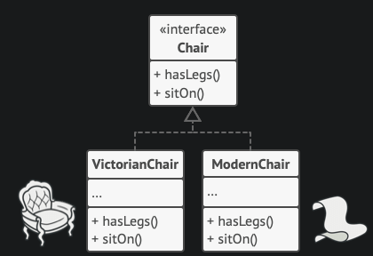

El siguiente paso consiste en declarar la **Fábrica abstracta**: una interfaz con una **lista de métodos de creación** para todos los productos que son **parte de la familia de productos** (por ejemplo, crearSilla, crearSofá y crearMesilla). Estos métodos deben devolver **productos abstractos** representados por las interfaces que extrajimos previamente: Silla, Sofá, Mesilla, etc.

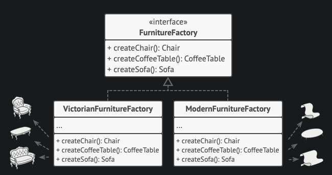

Digamos que el cliente quiere una fábrica para producir una silla. El cliente **no tiene que conocer** la clase de la fábrica y tampoco importa el tipo de silla que obtiene. Ya sea un modelo moderno o una silla de estilo victoriano, el cliente debe tratar a todas las sillas del mismo modo, **utilizando la interfaz abstracta Silla**. Con este sistema, lo único que sabe el cliente sobre la silla es que implementa de algún modo el método sentarse. Además, sea cual sea la variante de silla devuelta, **siempre combinará** con el tipo de sofá o mesilla producida por el mismo objeto de fábrica.

Queda otro punto por aclarar: si el cliente sólo está expuesto a las interfaces abstractas, **¿cómo se crean los objetos de fábrica?** Normalmente, la aplicación crea un objeto de fábrica **concreto** en la etapa de inicialización. Justo antes, la aplicación debe seleccionar el **tipo de fábrica**, dependiendo de la configuración o de los ajustes del entorno.

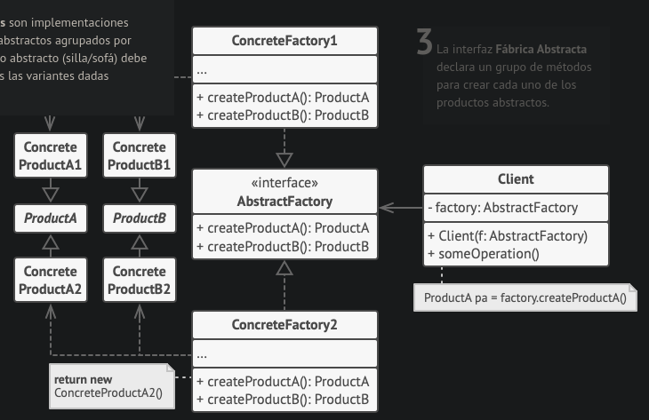

**Aplicabilidad**

Utiliza el patrón Abstract Factory cuando tu código deba funcionar con **varias familias de productos relacionados**, pero **no** desees que **dependa** de las **clases concretas** de esos productos, ya que puede ser que no los conozcas de antemano o sencillamente quieras permitir una futura extensibilidad.

**Pros y contras**

* Puedes tener la certeza de que los **productos** que obtienes de una fábrica son **compatibles entre sí**.
* Evitas un acoplamiento fuerte entre productos concretos y el código cliente.
* **Principio de responsabilidad única**. Puedes mover el código de creación de productos a un solo lugar, haciendo que el código sea más **fácil de mantener**.
* Principio de **abierto/cerrado**. Puedes introducir **nuevas variantes de productos** sin **descomponer el código cliente existente**.

### Patron factory method

**Proposito**

Factory Method es un patrón de diseño **creacional** que proporciona una **interfaz** para **crear objetos** en una **superclase**, mientras permite a las **subclases alterar** el **tipo de objetos** que se crearán.

**Problema**

Imagina que estás creando una aplicación de gestión logística. La primera versión de tu aplicación **sólo es capaz** de **manejar el transporte** en **camión**, por lo que la mayor parte de tu código se encuentra dentro de la clase Camión.

La mayor parte de tu código está acoplado a la clase Camión. Para añadir **barcos** a la aplicación habría que hacer **cambios** en **toda la base del código**. Además, si más tarde decides añadir **otro tipo de transporte** a la aplicación, probablemente tendrás que **volver** a hacer todos estos **cambios**.

Al final acabarás con un **código** bastante **sucio**, **plagado de condicionales** que cambian el comportamiento de la aplicación dependiendo de la clase de los objetos de transporte.

**Solucion**

El patrón Factory Method sugiere que, en lugar de llamar al operador **new** para construir objetos directamente, se invoque a un método fábrica especial. Los objetos devueltos por el método fábrica a menudo se denominan **productos**.

Ahora puedes **sobrescribir** el método fábrica en una **subclase** y cambiar la clase de los productos creados por el método.

No obstante, hay una pequeña **limitación**: las subclases sólo pueden **devolver** productos de distintos tipos si dichos productos tienen una clase base o **interfaz común**. Además, el método fábrica en la **clase base** debe tener su tipo de retorno declarado como **dicha interfaz**.

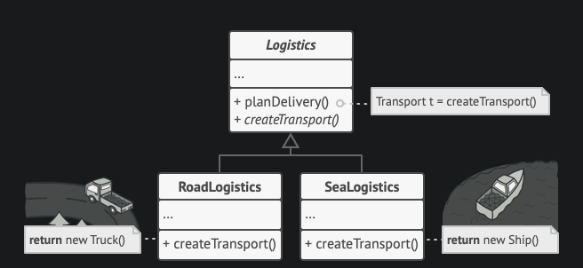
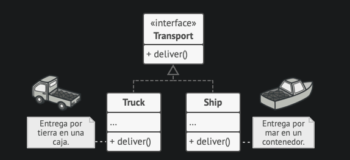

**Estructura**

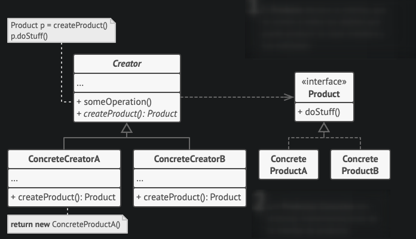

**Aplicabilidad**

Utiliza el Método Fábrica cuando **no conozcas** de antemano las dependencias y los **tipos exactos** de los **objetos** con los que deba funcionar tu código.

Utiliza el Factory Method cuando quieras ofrecer a los usuarios de tu biblioteca o framework, una forma de **extender** sus **componentes internos**.

**Pros**

* **Evitas un acoplamiento** fuerte entre el creador y los productos concretos.
* Principio de **responsabilidad única**. Puedes mover el código de creación de producto a un lugar del programa, haciendo que el código sea más fácil de mantener.
* Principio de **abierto/cerrado**. Puedes incorporar nuevos tipos de productos en el programa sin descomponer el código cliente existente.

**Contras**

* Puede ser que el **código se complique**, ya que debes incorporar una multitud de nuevas subclases para implementar el patrón. La situación ideal sería introducir el patrón en una jerarquía existente de clases creadoras.