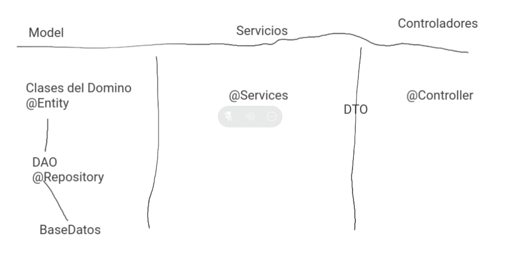

# Arquitectura de software II

- [Arquitectura de software II](#arquitectura-de-software-ii)
  - [Protocolo HTTP](#protocolo-http)
  - [MVC](#mvc)

**Notas:**
* Clases presenciales ultimo lunes del mes
* Num profe: 351 5959259

## [Protocolo HTTP](https://code.tutsplus.com/tutorials/http-the-protocol-every-web-developer-must-know-part-1--net-31177)

* Comunicacion entre arquitecturas **cliente - servidor**. Es un protocolo sin estado (**stateless**). 
* Mando una **REQUEST** y recibo una **RESPONSE**.
* El puerto por defecto de este protocolo es el 80 (No se levanta este puerto usualmente por motivos de seguridad).

**URL**

* **Protocolo**
* **Host**
* **Puerto**
* **Path** para alcanzar un recurso
* **queries** (elementos clave valor)

Metodos:

- **GET**: Traer recursos
- **POST**: Enviar recursos
- **PUT**: Actualizar recursos
- **DELETE**: Borrar recursos

Codigos HTTP:
- **100**: Ya ni se usan
- **200**: OK!
    - **201**: Created! (Se creo el recurso)
- **300**: Error de redireccion
    - **301**: Movido de manera permantente
    - **303**: Movido de manera temporal (Ojo con el header `location`)
- **400**: Error por parte del cliente
    - **400**: Bad request (body malformada).
    - **401**: Unauthorized.
    - **404**: Recurso no encontrado.
    - **405**: Method not allowed.
- **500**: Server error
    - **501**: Not implemented
    - **503**: Servicio no disponible (el server se cayo o esta sobrecargado)

**Headers**:

Metadatos asignados a una request. 

Hay algunos headers que son **generales**:

* **Cache-Control**: Se puede almacenar informacion util en el cache.

Los headers que empiezan con **X** son **custom**.

## MVC

Capas:

* Modelos
* Servicios
* Controladores

