# Resumen de base de datos 1

- [Resumen de base de datos 1](#resumen-de-base-de-datos-1)
  - [SGBD](#sgbd)
    - [Modelos de datos:](#modelos-de-datos)
    - [Usuarios de bases de datos:](#usuarios-de-bases-de-datos)
    - [Estructura general del sistema](#estructura-general-del-sistema)
    - [Historia de las DB](#historia-de-las-db)
  - [Modelo entidad-relacion](#modelo-entidad-relacion)
    - [Proceso de diseño](#proceso-de-diseño)
    - [Modelado](#modelado)
    - [Conjunto de relaciones](#conjunto-de-relaciones)
    - [Atributos](#atributos)
    - [Restricciones](#restricciones)
      - [Correspondencia de cardinales](#correspondencia-de-cardinales)
      - [Claves](#claves)
      - [Conjunto de entidades](#conjunto-de-entidades)
      - [Conjunto de relaciones](#conjunto-de-relaciones-1)
      - [Restricciones de participacion](#restricciones-de-participacion)
    - [Diagrama E-R](#diagrama-e-r)
      - [Papeles](#papeles)
      - [Restricciones de cardinalidad](#restricciones-de-cardinalidad)
      - [Participacion](#participacion)
    - [Cuestiones de diseño](#cuestiones-de-diseño)
      - [Relaciones binarias frente a no binarias](#relaciones-binarias-frente-a-no-binarias)
      - [Conjuntos de entidades débiles](#conjuntos-de-entidades-débiles)
      - [Especialización](#especialización)
      - [Generalizacion](#generalizacion)
      - [Restricciones de especialización/generalización](#restricciones-de-especializacióngeneralización)
  - [Normalizacion](#normalizacion)
    - [1FN](#1fn)
    - [FNBC](#fnbc)
  - [Almacenamiento y estructura de archivos](#almacenamiento-y-estructura-de-archivos)
    - [Clasificacion de medios fisicos](#clasificacion-de-medios-fisicos)
    - [Medios fisicos de almacenamiento](#medios-fisicos-de-almacenamiento)
    - [Discos magneticos](#discos-magneticos)
    - [RAID](#raid)
      - [Niveles de RAID](#niveles-de-raid)
      - [Eleccion de RAIDS](#eleccion-de-raids)
      - [Aspectos de hardware](#aspectos-de-hardware)
  - [Algebra relacional](#algebra-relacional)
    - [Conceptos](#conceptos)
    - [Ahora si, Algebra relacional](#ahora-si-algebra-relacional)
    - [Composicion de operaciones](#composicion-de-operaciones)
  - [SQL](#sql)
    - [Historia](#historia)
    - [DML y DDL](#dml-y-ddl)
      - [DDL (Data Definition Language)](#ddl-data-definition-language)
      - [DML (Data Manipulation Language)](#dml-data-manipulation-language)
    - [Consultas (DML)](#consultas-dml)

## SGBD

Los sistemas de gestión de bases de datos o SGBD son un tipo de software dedicado a servir de **interfaz** entre la **base de datos**, el **usuario** y las **aplicaciones** que la utilizan. El propósito general de los SGBD es el de **manejar** de manera clara, sencilla y ordenada un **conjunto de datos** que posteriormente se convertirán en **información relevante** para una organización.

**Objetivos**:

* **Abstracción de la información**. Los SGBD **ahorran** a los usuarios detalles acerca del **almacenamiento físico** de los datos. Da lo mismo si una base de datos ocupa uno o cientos de archivos, este hecho se hace **transparente** al usuario. Así, se definen varios **niveles de abstracción**.
* **Independencia**. La independencia de los datos consiste en la capacidad de **modificar** el esquema (físico o lógico) de una base de datos **sin** tener que **realizar cambios** en las **aplicaciones** que se sirven de ella.
* **Consistencia**. La base de datos representa una realidad determinada que tiene determinadas condiciones, por ejemplo que los menores de edad no pueden tener licencia de conducir. El sistema no debería aceptar datos de un conductor menor de edad. En los SGBD existen **herramientas** que facilitan la **programación** de este tipo de **condiciones**.
* **Seguridad**. La información almacenada en una base de datos puede llegar a tener un gran valor. Los SGBD deben **garantizar** que esta **información** se encuentra **segura** de permisos a usuarios y grupos de usuarios, que permiten otorgar diversas **categorías de permisos**.
* **Manejo de transacciones**. Una transacción es un programa que se ejecuta como una sola operación. Esto quiere decir que luego de una ejecución en la que se produce una falla es el mismo que se obtendría si el programa no se hubiera ejecutado. Los SGBD proveen mecanismos para **programar** las **modificaciones** de los datos de una forma mucho **más simple** que si no se dispusiera de ellos.
* **Tiempo de respuesta**. Lógicamente, es deseable **minimizar el tiempo** que el SGBD demora en proporcionar la información solicitada y en almacenar los cambios realizados.

En otras palabras, las bases de datos
- Permiten gestionar **gran cantidad** de **información** 
- Permiten definir **estructuras** para almacenar la información.
- Proveen mecanismos para su **manipulación**
- Garantizan la **fiabilidad** de la información almacenada
- Soportan **caidas del sistema**
- Controlan intentos de **accesos** no **autorizados**
- Administran el uso del SGBD compartido entre usuarios evitando resultados anómalos.

**Sistemas de archivos**

Antes de la existencia de los SGBD, para gestionar los datos se utilizaban sistemas de archivos. Esto traia varios inconvenientes como:

- **Redundancia** e **inconsistencia** de datos.
- **Dificultad** en el **acceso** a los datos
- Aislamiento de datos (diversos archivos con diferentes formatos)
- Problemas de **integridad**
- Problemas de **atomicidad**
- Anomalías en el **acceso concurrente**
- Problemas de **seguridad**

**Niveles de abstraccion**:

Niveles en los que los datos son almacenados, gestionados y visualizados.

- **Nivel fisico**: describe cómo se **almacenan** realmente los datos en disco.
- **Nivel lógico**: describe qué datos se almacenan en la **base de datos** y las **relaciones** existentes entre ellos.
- **Nivel de vistas**: los **programas** de aplicación **ocultan** detalles de los tipos de **datos**. Las vistas también pueden ocultar **información** (p. e., salarios) por razones de **seguridad**.

**Instancias y esquemas**

**Esquema**: Análogo a la información del **tipo** de una **variable** en un programa
- **Esquema físico**: diseño de la base de datos a nivel físico
- **Esquema lógico**: diseño de la base de datos a nivel lógico

**Instancia**: El **contenido real** de la base de datos en un instante de tiempo determinado (Análogo al valor de una variable)

**Independencia física de los datos**: la capacidad de modificar el esquema físico
sin cambiar el esquema lógico (?)

### Modelos de datos:
Colección de herramientas conceptuales para **describir** los **datos**, las **relaciones** entre ellos, la **semántica** de los datos y la **consistencia** entre los datos

**Modelo relacional**:

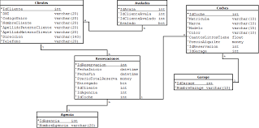

- Colección de tablas para representar los **datos** y sus **relaciones**
- Cada tabla tiene **columnas**, y las columnas un nombre único
- Modelo basado en **registros**
- Es el modelo de datos más ampliamente usado

**Modelo de entidad relacion** (E-R):
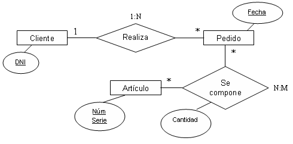

- Se basa en una **percepción** del **mundo real**
- Consiste en una colección de objetos básicos, **entidades** (cosa o objeto distinguible de otros
objetos) y **relaciones** (una asociación entre varias entidades)

**Modelo de datos orientado a objetos**:
  - Extiende el modelo de datos relacional incluyendo orientación a objetos y construcciones que manejan otros tipos de datos adicionales
  - Incluye los conceptos de **encapsulación**, **métodos** y la **identidad** de los objetos
  - Proporciona compatibilidad hacia arriba con lenguajes relacionales preexistentes. (?)
  - Permite atributos de tuplas con tipos complejos, incluyendo valores no atómicos como son las relaciones anidadas(?)


**Modelo de datos semiestructurados** (XML):
- Permite la **especificación** de **datos** donde los **elementos** de datos individuales del **mismo tipo** pueden tener **diferentes conjuntos de atributos**
- Originariamente era un lenguaje de marcado de documentos, no como lenguaje de base de datos.
- La posibilidad de especificar nuevas etiquetas y crear estructuras de etiquetas anidadas convierten a XML en un mecanismo perfecto para el intercambio de datos, no solo de documentos.

**Modelos antiguos**:
  - Modelo de red
  - Modelo jerárquico

**Lenguaje de manipulación de datos** (DML):
Lenguaje para acceder o **manipular** los datos organizados mediante el modelo de datos apropiado.
Existen dos clases de lenguajes
- Procedimentales: el usuario especifica que datos se necesitan y cómo han de obtenerse dichos datos
- **Declarativos** (no procedimentales): el usuario especifica qué datos se necesitan sin espcificar cómo se han de obtener

SQL (lenguaje **NO PROCEDIMENTAL**) es el lenguaje de consultas utilizado más ampliamente

**Lenguaje de definición de datos** (DDL):
Notación de especificación para **definir** el **esquema** de la base de datos

El compilador DDL genera un conjunto especial de tablas denominado **diccionario** de datos que contiene **metadatos**:
- **Esquema de base de datos**
- **Restricciones de integridad**
- **Autorización**
- etc.

**Diseño de la base de datos**:
Proceso de diseño de la estructura general de una base de datos:

- **Diseño lógico**: Decidir el **esquema** de la base de datos. El diseño de la base de datos requiere encontrar una **buena colección** de **esquemas de relación**.
  - **Decisión de negocio** – ¿Qué atributos se deberían registrar en la base de datos?
  - **Decisión informática** – ¿Qué relación de esquemas se deberían utilizar y cómo se deberían distribuir los atributos entre los distintos esquemas de relación?
- **Diseño físico**: Decidir sobre las características físicas de la base de datos

**Gestión de almacenamiento**:
El gestor de almacenamiento es un **módulo** de programa que proporciona la **interfaz** entre los **datos** de bajo nivel en la base de datos y los **programas de aplicación** y **consultas** emitidas al sistema.

El gestor de almacenamiento es responsable de:
- La interacción con el gestor de ficheros
- El almacenamiento, recuperación y actualización eficiente de los datos

**Procesamiento de consultas**
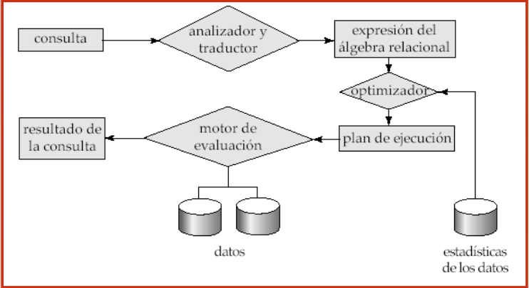

**Gestión de transaciones**:
Una **transacción** es una **colección de operaciones** que se llevan a cabo como una **única función lógica** en una aplicación de base de datos.

El **componente de gestión de transacciones** asegura que la base de datos permanezca en un estado **consistente** (correcto) a pesar de los **fallos** del sistema (p.e., fallos de energía y caídas del sistema operativo) y de los fallos en las transacciones.

El **gestor de control de concurrencia** controla la **interacción** entre las **transacciones concurrentes** para **asegurar** la **consistencia** de la base de datos.

**Arquitectura de bases de datos**

La arquitectura de una base de datos se ve muy influenciada por el **sistema informático** subyacente sobre el que se está ejecutando:

* Centralizado
* Cliente-servidor
* Paralelo (multi-procesador)
* Distribuido

### Usuarios de bases de datos:
Los usuarios se diferencian por la forma en que esperan interactuar con el sistema:
- **Programadores**: usan DML
- **Usuarios sofisticados**: Realizan querys a las DB
- **Usuarios especializados**: escriben aplicaciones de bases de datos especializadas que no cuadran con el marco de procesamiento de datos tradicional (?)
- **Usuarios normales**: Usan aplicaciones o interfaces.

**Administrador de la base de datos**
Coordina todas las actividades del sistema de la base de datos; posee buenos conocimientos de los recursos y necesidades de información de la empresa. Su funcion es:
- Definición del esquema
- Estructura de almacenamiento y definición del método de acceso
- Modificación del esquema y organización física
- Concesión de autorización para el acceso a los datos
- Especificación de las restricciones de consistencia
- Actuar como enlace con los usuarios
- Supervisión de rendimiento y respuesta a cambios de los requisitos

### Estructura general del sistema

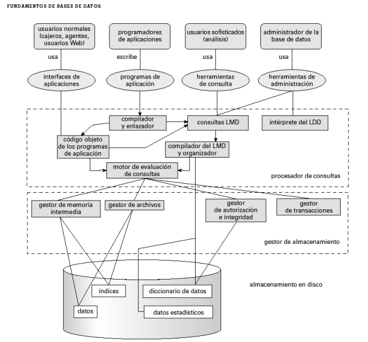

### Historia de las DB

- 50/60 's
  - Cintas magneticas (Solo acceso secuencial)
  - Tarjetas perforadas
- Finales de 60/70 's
  - Discos duros con acceso directo a datos
  - Modelos de datos jerárquicos y en red en amplio uso (?)
  - Modelo de datos **relacional**
- 80's  
  - Los **prototipos relacionales** de investigación evolucionan a **sistemas comerciales** (SQL estandar)
- 90's
  - Grandes almacenes de datos multi-terabyte
- 2000
  - Estándares XML XQuery
  - Administración automatizada de bases de datos

## Modelo entidad-relacion

### Proceso de diseño

El diseñador de la base de datos debe hablar con el cliente para asi identificar los **requisitos** y desarrollar una base de datos acorde a allos.

**Fases del diseño**
- **Inicial**: Hablar con los expertos del dominio y identificar los requerimientos
- **Diseño conceptual**: **Traducir** los requerimientos a un **esquema conceptual** usando algun **modelo**
- **Requisitos funcionales**: Los usuarios especifican las operaciones que se llevaran a cabo con estos datos.
- **Modelado fisico**: Se traduce el esquema conceptual al modelo de datos de la implementacion del sistema, y luego se pasa al modelo fisico en el que se especifican caracteristicas fisicas, archivos y estructuras internas.

En este proceso se debe evitar la **redundancia** e **Incompletitud**.

### Modelado

Una DB se puede pensar como una coleccion/ **relacion** de entidades.

Una **entidad** es un objeto distingible de los demas. Estas entidades tienen atributos (Nombre, edad, etc.)

Un **conjunto de entidades** se da cuando estas son del mismo tipo y comparten atributos.

### Conjunto de relaciones

Una **relacion** es una asociacion entre varias entidades

**Un conjunto de relaciones** es una relación matemática entre 2 o mas entidades, cada una de ellas tomadas de los conjuntos de entidades

Una **relación** puede tener atributos denominados **atributos descriptivos**, que pueden ser también **propiedad** de un **conjunto de relaciones**.

**Grado de un conjunto de relaciones**: Numero de entidades que participan en un conjunto de relaciones

Los conjuntos de relaciones que implican a dos conjuntos de entidades se denominan **binarios** (Estos son la mayoria). Las relaciones entre más de dos conjuntos de entidades no son muy
comunes.

### Atributos

Una entidad se representa mediante un conjunto de **atributos**, que describen **propiedades** que posee cada miembro de un conjunto de entidades.

El **dominio** es el **conjunto de valores permitidos** para cada atributo

Tipos de atributos:
- Simples / compuestos
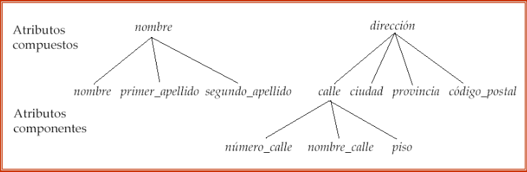
- Monovalorados/Multivalorados
- Derivados (edad -> fecha de nacimiento)

### Restricciones

El modelo E-R define ciertas restricciones:

#### Correspondencia de cardinales

Expresa el **número de entidades** a las que se **puede asociar** otra entidad a través de un conjunto de relaciones.

Para un conjunto de relaciones **binario**, la correspondencia de cardinalidades debe ser de uno de los tipos siguientes:
- 1 a 1
- 1 a N
- N a 1
- N a N

#### Claves

**Superclave**: conjunto de **uno o más atributos** cuyos valores permiten identificar **unívocamente** una entidad determinada.

**Clave candidata**: superclave mínima (?)

Aunque pueden existir varias claves candidatas, una de ellas se elige como la **clave primaria**. Esta es una decisión del diseñador de la base de datos. La clave primaria se debe elegir de manera que sus atributos, nunca o casi **nunca cambien**.

#### Conjunto de entidades

Dos entidades de un conjunto de entidades **no** pueden tener el **mismo valor** en su **clave**

#### Conjunto de relaciones

Las relaciones tienen **superclaves**, y estas son las claves primarias de las entidades que relacionan, mas algunos atributos de las mismas de ser posible.

#### Restricciones de participacion

Se dice que la participación de un conjunto de entidades E en un conjunto de relaciones R es **total** si **cada entidad** de E **participa** al menos en **una relación** de R.

Si sólo algunas entidades E participa en relaciones de R, se dice que la participación es **parcial**.

Se puede esperar que cada entidad préstamo este relacionada al menos con un cliente(participación total). 

Un individuo puede ser cliente de un banco aunque no tenga concedido ningún préstamo. (participación parcial).

### Diagrama E-R

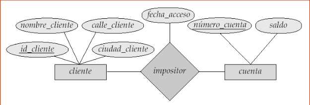

- Rectangulos: entidades
  - Rectangulos dobles: entidades debiles
- Rombos: relaciones
- Elipses: atributos
  - Elipses dobles: atributos multivalorados 
  - Elipses discontinuas: atributos derivados
  - Subrayado: atributos primarios 

#### Papeles

Los papeles se indican en diagramas E-R **etiquetando** las **líneas** que **conectan rombos con rectángulos**.Las etiquetas de papeles son **opcionales** y se utilizan para **aclarar** la **semántica de la relación**.

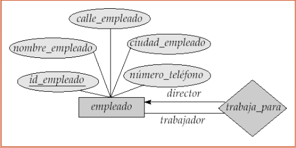

#### Restricciones de cardinalidad

Las restricciones de cardinalidad se expresan o bien dibujando una línea directa (-->), cuyo significado es ―uno,o bien con una línea indirecta (—), cuyo significado es ―varios, entre el conjunto de relaciones y el conjunto de entidades.

Ejemplo 1 a varios:

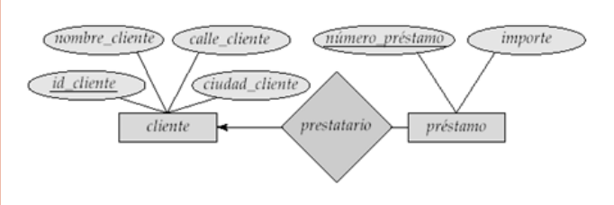

#### Participacion

- Participación **total** (indicada con **doble línea**):cada préstamo debe tener un cliente asociado a él a través de prestatario
- Participación **parcial**: puede ser que algunas entidades no participen en ninguna relación del conjunto de relaciones

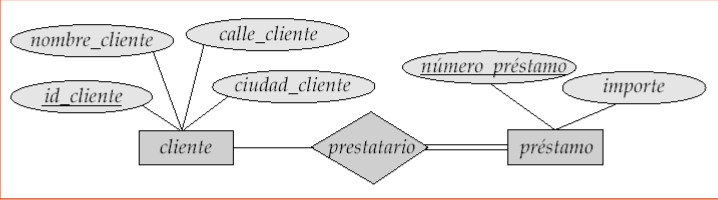

### Cuestiones de diseño

#### Relaciones binarias frente a no binarias

Algunas relaciones que parecía que eran no binarias se pueden representar mejor utilizando relaciones binarias
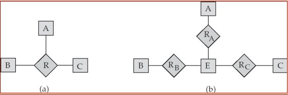

#### Conjuntos de entidades débiles

A los conjuntos de entidades que **no tienen** una **clave primaria** se denominan conjuntos de **entidades débiles**.  La existencia de un conjunto de entidades débiles **depende** de la existencia de un conjunto de **identidades identificadoras**. Se debe asociar al conjunto de entidades identificadoras a través de
un conjunto de relaciones uno a varios total desde la identificadora al conjunto de entidades débiles.

La relación identificadora se representa utilizando un **rombo doble**

El **discriminador** (o clave parcial) de un conjunto de entidades débil es el **conjunto** de **atributos** que lo **distinguen** entre todas las entidades de un conjunto de entidades débiles.

La **clave primaria** de un conjunto de entidades débiles se forma con la **clave primaria** del conjunto de entidades fuertes del que depende la
existencia del conjunto de entidades débiles, más el **discriminador** de dicho conjunto de entidades débiles.

Un conjunto de entidades débiles se representa por medio de **rectángulos dobles**.

El **discriminador** de un conjunto de entidades débiles se subraya con una **línea discontinua**.

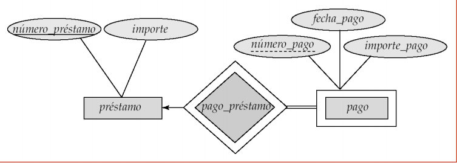

#### Especialización

se designan **subgrupos** **dentro** de un **conjunto** de entidades que se diferencian de alguna forma del resto de las entidades del conjunto.

Se representan por medio de un componente **triángulo** que contiene el nombre del conjunto de entidades

un conjunto de entidades de nivel más bajo **hereda** todos los atributos y la participación en las relaciones del conjunto de entidades de nivel superior al cuál está enlazado.

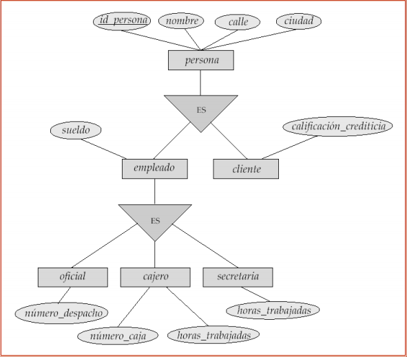

#### Generalizacion

**combina** un determinado número de conjuntos de entidades que comparten las mismas características en un conjunto de entidades de nivel superior.

La especialización y la generalización son **inversiones** simples una de la otra y se **representan** en un diagrama E-R **del mismo
modo**.

Ambos términos, especialización y generalización, son **perfectamente intercambiables**.

#### Restricciones de especialización/generalización

1. Restringe si las **entidades** pueden ser **miembros** de un conjunto dado de entidades de **nivel inferior**.
- definido por condición
- definido por el usuario

2. Restringe si las entidades pueden o no pertenecer a **uno** **o más** conjuntos de entidades de nivel inferior dentro de una generalización simple

- Disjunto: Solo 1 unico subconjunto
- Solapado: Solo mas de 1 subconjunto

3. **Restricción de completitud**: especifica si **una entidad** del conjunto de entidades de **nivel superior** debe pertenecer o no **al menos a uno** de los conjuntos de entidades del nivel inferior en una generalización.
- **total**: una entidad **sólo** puede pertenecer a **uno** de los conjuntos de entidades de nivel inferior
- **parcial**: una entidad **no necesita** pertenecer a uno de los conjuntos de entidades de nivel inferior

## Normalizacion

En esta seccion veremos las caracteristicas de los buenos dieños relacionales, y como poder desarrollar dichos buenos diseños.

En las bases de datos, se pueden descomponer y combinar las tablas. Pero no en todos los casos esto resulta conveniente. Ej:

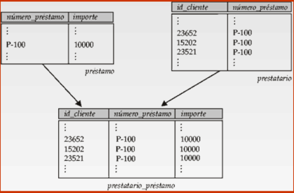
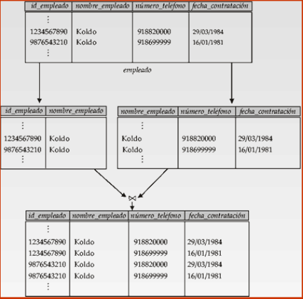

En estos ejemplos, se pierde informacion, o esta se vuelve de caracter ambiguo.

Para evitar estos casos, se suelen diseñar las bases de datos siguiendo unas **formas normales**, que son "reglas" a seguir para lograr un **buen diseño** en practicamente cualquier base de datos.

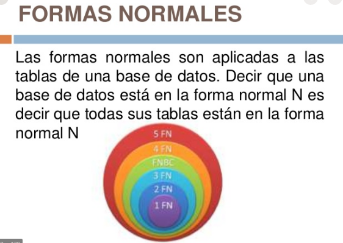

### 1FN

Una `tabla` está en **Primera Forma Normal** si:

- Todos los **atributos** son **«atómicos»**. Por ejemplo, en el campo teléfono no tenemos varios teléfonos.
- La tabla contiene una **clave primaria única**. Por ejemplo el NIF para personas, la matrícula para vehículos o un simple id autoincremental. Si no tiene clave, no es 1FN.
- La clave primaria **no** contiene **atributos nulos**. No podemos tener filas para las que no haya clave (por ejemplo, personas sin NIF o vehículos sin matrícula).
- **No** debe existir **variación** en el **número de columnas**. Si algunas filas tienen 8 columnas y otras 3, pues no estamos en 1FN.
- Los campos **no clave** deben **identificarse** por la **clave**. Es decir, que los campos no clave **dependen funcionalmente** de la clave. Esto es prácticamente lo mismo que decir que **existe clave primaria**.
  - Una dependencia funcional es **trivial** si la cumplen todos los ejemplares de una relacion. (Ej: nombre_cliente depende de número_préstamo y nombre_cliente)
- Debe Existir una **independencia del orden** tanto de las **filas** como de las **columnas**, es decir, si los datos cambian de orden no deben cambiar sus significados. Por ejemplo, si en la columna 1 tenemos el primer apellido y en la columna 2 tenemos el segundo, pues no estamos en 1FN. Igualmente si en la tercera fila tenemos el tercer mejor expediente y en la quinta fila el quinto, no estamos en 1FN.

Segun lo visto en clase, la primera forma normal consiste en que los atributos deben de ser atomicos.

Si no se cumple la 1FN, hay que **descomponer** los atributos en elementos mas pequeños.

### FNBC

La forma normal de **Boyle-Codd** consiste en que la unica dependencia funcional que debe exisitir en un esquema de relaciones es la de la **superclave** con los demas atributos. es decir, siendo `R` = `a` -> `b` un esquema relacional, dicho esquema esta en la forma normal de Boyle-Codd si:

- `a` -> `b` es **trivial**
- o `a` es una superclave.

Si no se cumple esta forma, debemos de desarmar el esquema, quedandonos con dos tablas nuevas:

- **tabla 1**: `a U b`
- **tabla 2**: `R - (a-b)` (no deberia ser R-b?) 

## Almacenamiento y estructura de archivos

### Clasificacion de medios fisicos

Los medios fisicos de almacenamiento de informacion se pueden clasificar segun:

- velocidad de acceso a datos
- coste por unidad de dato
- Fiabilidad (Perdida de datos por caidas)
- **Tipo** de **almacenamiento**
  - **Volatil**: Contenido se pierde al cortar el suministro electrico
  - **No volatil**: El contenido se conserva.

### Medios fisicos de almacenamiento

**Cache**: Es la memoria mas **rapida** y **costosa**, es **volatil** y no es gestionada por los SGBD

**Memoria principal** (RAM?): **Acceso rapido**, **pequeña** y **volatil**. El coste por unidad es caro

**Memoria flash** (EEPROM, USB, SSD): datos **fiables**, **acceso veloz** y **coste** por unidad igual al de la memoria principal.

**Disco magnetico** (Discos duros): **Acceso** a los datos un poco **lento**, se puede acceder a cualquier dato en **cualquier orden** (a diferencia de las cintas), **buen coste** por unidad y **sobrevive** a **fallos electricos**

**Almacenamiento optico** (DVD, CD): **no volatil**, lecturas y escrituras **lentas**.

**cintas magneticas** (VHS): **no volatil**, empleado para **copias de seguridad** (antes?), **acceso secuencial** (lentisimo), **coste** de almacenamiento muy **barato**, cintas son caras.

La **jerarquia** de medios se presenta asi, siendo la cuspide el medio mas **rapido** y **caro**:

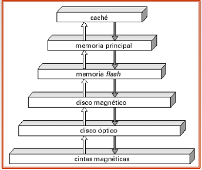

- Almacenamiento principal: Cache/principal
- Almacenamiento secundario: flash/ disco magnetico
- Almacenamiento terciario: disco optico / cintas

### Discos magneticos

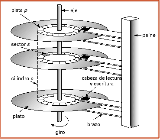

`Nota`: Los discos rigidos no almacenan los datos uno al lado del otro, sino q los guardan segun como le quede comodo al disco para acceder a ellos de manera mas rapida

Los cabezales lee la info de los distitnos platos, info que esta distribuida en pistas, y estas a su vez en sectores. Los platos giran continuamente.

Podemos acceder a estos datos en la PC gracias a los controladores de disco que permiten comandos de alto nivel para manipular el disco, y en terminos generales aseguran la escritura satisfactoria (mediante distintos procesos)

**Interfaces de discos**: SATA/ATA/SCSI

**Medidas de rendimiento de discos**:

- Tiempo de acceso
  - Tiempo de busqueda
  - Latencia rotacional
- Velocidad de transferencia de datos
- Tiempo medio entre fallos

**Optimizacion del acceso a los bloques del disco**

**Bloque**: secuencia contigua de sectores en una pista

Fragmentacion / defragmentacion de archivos (?)

RAM no volatil / disco de registro historico (?)

### RAID

(Arrays redundantes de discos independientes)

Los RAIDS son tecnicas de organizacion de muchos discos para proveer alta capacidad, velocidad y confiabiliad del almacenamiento,

"Se mejora la fiabilidad via redundancia"

**Redundancia**: Informacion extra almacenada implementada para reconstruir datos rotos/perdidos

"Se mejora el rendimiento via paralelismo"

**Imagenes**/sombras (duplicar discos)

**Paralelismo**: Dividir la info en varios discos
Objetivos:
- Equilibrar la carga en accesos pequeños
- Paralelizar los accesos grandes

Distribucion de la info a nivel de bit (no se usa mas)

Distribucion de la info a nivel de bloque

#### Niveles de RAID

Tipos de RAID con distintos **costes**, **rendimientos** y **fiabilidades**:

**Nivel 0** Distribucion de bloques sin redundancia

Se usa en apps que requieren acceder rapidamente, pero no importa que se pierdan los datos

**Nivel 1** Imagenes de discos con distribucion de bloques

Se distribuye la info en bloques, y se generan copias/imagenes de los discos

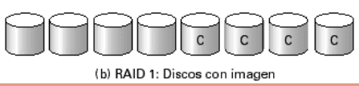

**Nivel 2** Organización de códigos de corrección de errores tipo memoria (ECC) con distribución de bit.

**Nivel 3** Paridad con bits entrelazados

Como el 2 pero **mas eficiente**, ya que con un solo bit se pueden regenerar los datos perdidos

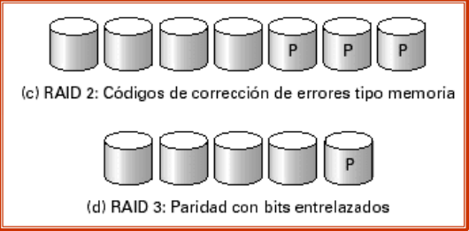

**Nivel 4** Paridad con bloques entrelazados

Emplea distribución en el nivel de bloque y mantiene un bloque de paridad en un disco independiente para los correspondientes bloques de los otros N discos. (mejor que nivel 3)

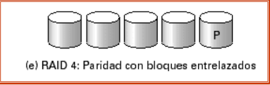

**Nivel 5** Paridad distribuida con bloques entrelazados

Datos y paridad divididos entre N + 1 discos, en vez de almacenar los datos en N discos y la paridad en 1. Velocidades E/S mas altas que el nivel 4


**Nivel 6** Esquema de redundancia P+Q

**similar al nivel 5**, pero almacena información redundante para proteger contra fallos de los múltiples discos.

Mayor **fiabilidad** que en nivel 5 a un **coste superior**

#### Eleccion de RAIDS

se tiene en cuenta:
- **Coste economico**
- **Rendimiento**
- Rendimiento durante **fallos**
- Rendimiento durante **reconstruccion**

Los que se suelen usar son los 1 y 5

El nivel 1 es **veloz** pero **caro**, el 5 es lento pero mas **barato**. Por lo tanto el nivel 5 se usa para aplicaciones con velocidades de actualizacion baja pero con **grandes cantidades de datos**. El nivel 1 se usa en todos los otros casos.

#### Aspectos de hardware

Las implantaciones RAID se pueden hacer puramente desde **software**, o con **hardware especial**. Algunos de estos hardwares son/tienen:
- **RAM's no volatiles**
- Dispositivos que implementen el **intercambio en caliente**
- **Discos de recambio**
- Fuentes de **alimentacion redundante**
- Multiples **controladores** de drivers/conexion.

## Algebra relacional

### Conceptos

Dados los conjuntos D_1, D_2,... D_n, una **relacion** r es un subconjunto de:

- D_1 X D_2 X ... X D_n

Asi, una relacion es un conjunto de **tuplas** (v_1, v_2, ..., v_n) donde

* v_n ∈ D_n

Un **esquema de relacion** es el conjunto de atributos pertenecientes a la relacion

A_1, A_2, A_n son atributos

R = A_1, A_2, A_n (R es un esquema de relaicon con A_n atributos)

r(R) es una relacion segun el esquema R

Las **instancias de relacion** son las tablas

El orden de las **tuplas** (registros) es irrelevante

Una **base de datos** consta de multiples relaciones

Una **clave primaria** es la clave candidata (superclave minima) que se ha elegido como medio principal de identificacion para las tuplas de una relacion.

Una clave externa de un esquema r_1 es la clave primaria de otro esquema r_2 usada como referencia. r_1 es el esquema referenciante y r_2 el esquema referenciado

**lenguajes de consulta**

Lenguajes para solicitar info a la base de datos. Estos pueden ser:

* **Procedimental** (Se indica una serie de operaciones)
* **No procedimental** (Se hacen queries sin un orden especifico)
* Lenguajes "**puros**" (Ej: algebra relacional, la base del SQL)

### Ahora si, Algebra relacional

Este es un lenguaje **procedimental** que consta de 6 operadores basicos. Estos operadores tienen como operandos una o dos relaciones y SIEMPRE producen una relacion (**recursividad**)

**selección σ**

Notacion: σ_p (r)

P es el **predicado** de seleccion


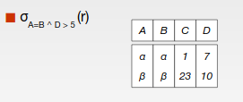

**proyección ∏**


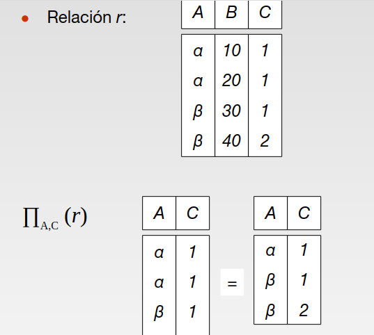

**unión: ∪**

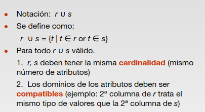

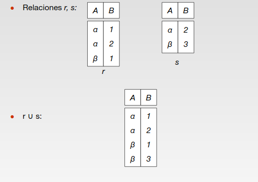

**diferencia de conjuntos –**

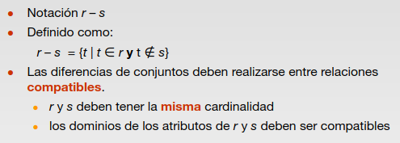

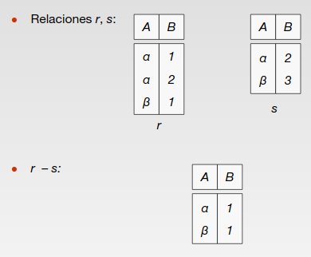

**producto cartesiano x**


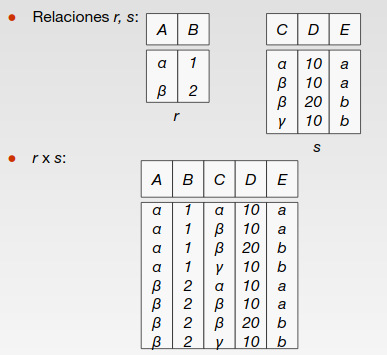

**renombramiento ρ**

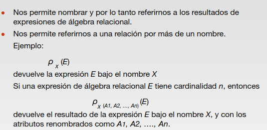


### Composicion de operaciones

Gracias a la recursividad, se puede realizar composicion de operaciones.

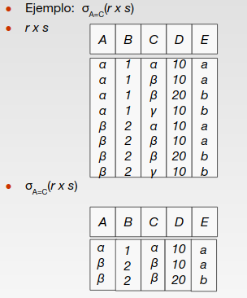


## SQL

### Historia

Este lenguaje fue desarrollado en sus principios por IBM, y originalmente se llamaba SEQUEL. Esto se hizo famoso y varios desarrolladores empiezan a desarrollar algo similar para sus productos.

En 1986 se lo renombra a SQL y se lo estandariza, actualizando dicho estandar varias veces.

### DML y DDL

Del SQL se derivan 2 "sub-lenguajes". Estos son:

#### DDL (Data Definition Language)

Lenguaje utilizado para **crear** las tablas y las bases de datos. (CREATE TABLE; ALTER TABLE; DROP TABLE; etc.)

Especifica informacion sobre el **conjunto** de relaciones, esta informacion consta de:
- Esquema de relacion
- Dominio de cada atributo (char, int, float, etc)
- Integridad de los datos (Reglas, ej: not null)
- Informacion de seguridad
- Estructura fisica en el disco

Ejemplo:

```SQL
CREATE TABLE proveedor
		(snum	integer,
		snombre	char(30) not null,
		situacion char(1),
		ciudad	char(30),
	  primary key (snum));
```

**Primary key**: Asegura q el atributo sea **not null** ya que esta sera la clave univoca que representara cada registro en el sistema.

`DROP TABLE` elimina la tabla y toda su info de la base de datos

`ALTER TABLE` es para modificarla (agregar/ quitar atributos `ALTER TALBE DROP ATTRIBUTE`)

#### DML (Data Manipulation Language)

Lenguaje utilizado para modificar las tablas y generar consultas (SELECT; UPDATE; DELETE; INSERT; etc.)

### Consultas (DML)

Las consultas son de la forma:

```SQL
select A1, A2, ..., An
	from r1, r2, ..., rm
	where P
```

Donde `Ai` son los atributos, `ri` las relaciones o tablas y `p` los predicados de seleccion.

Esta sentencia es equivalente a la exprecion siguiente del algebra relacional:

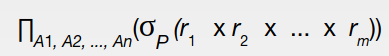

`Nota: `El resultado de una sentencia `SELECT` es otra relacion (recursividad, subqueries?)

Sentencia **SELECT** completa:

```SQL
SELECT [distinct] elemento(s)
FROM tabla(s)
[WHERE condicion]
[GROUP BY campo(s)]
[HAVING condicion]
[ORDER BY campo(s)]
```
Donde los componentes entre corchetes son opcionales.

El `Distinct` significa que los elementos repetidos no se mostraran.

Dentro de las clausulas `SELECT` se pueden poner operadores *-+/ y constantes/ variables para modificar los atributos mostrados:

```SQL
select snum, snombre, situacion * 100, ciudad
                  from proveedores
```

La clausula `WHERE` especifica las condiciones que deben cumplir los resultados

```SQL
select *
	from proveedores
	where ciudad = ‘París’ and situacion > 20
```
Se puede usar AND, OR y NOT y BETWEEN

La clausula `FROM` Especifica de que tablas se deben obtener los resultados

```SQL
select *
		from proveedores, partes
```
Se pueden renombrar las relaciones y atributos con la clausula `AS`

```SQL
select snum as numero_proveedor, snombre,         situacion, ciudad from proveedores
```