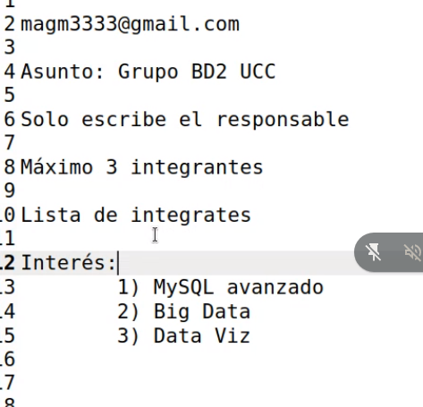
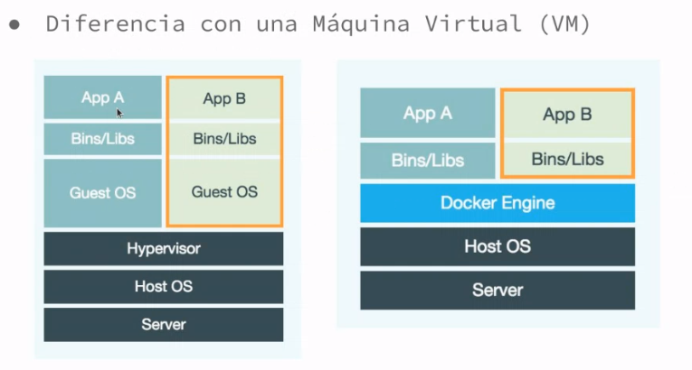
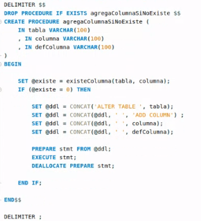
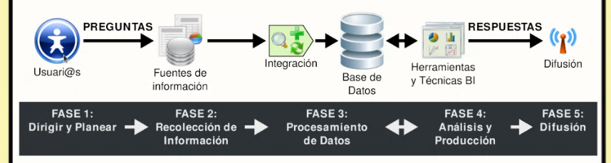
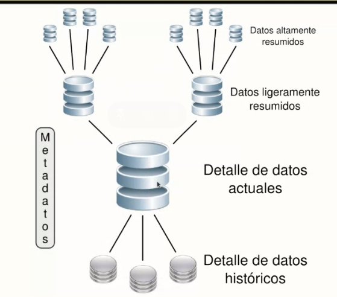
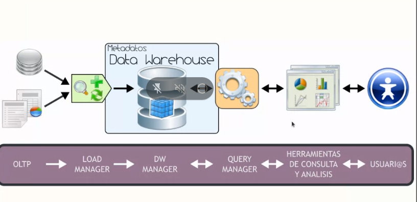
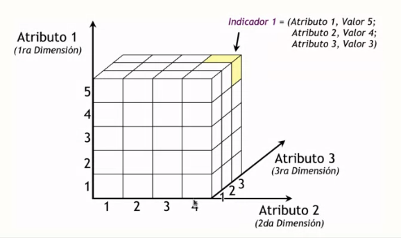
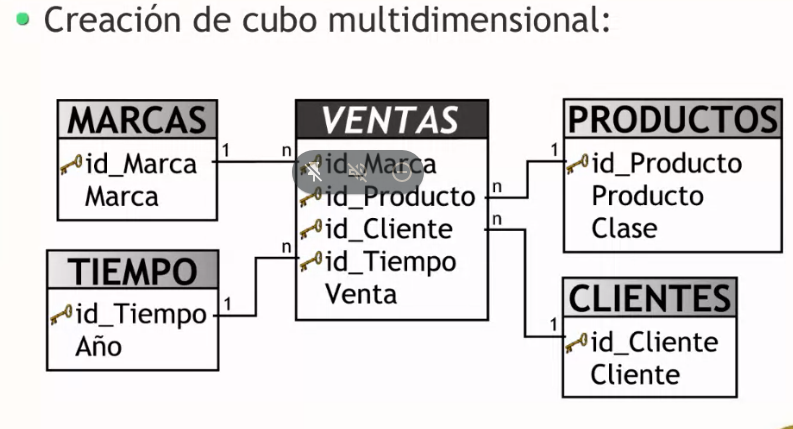
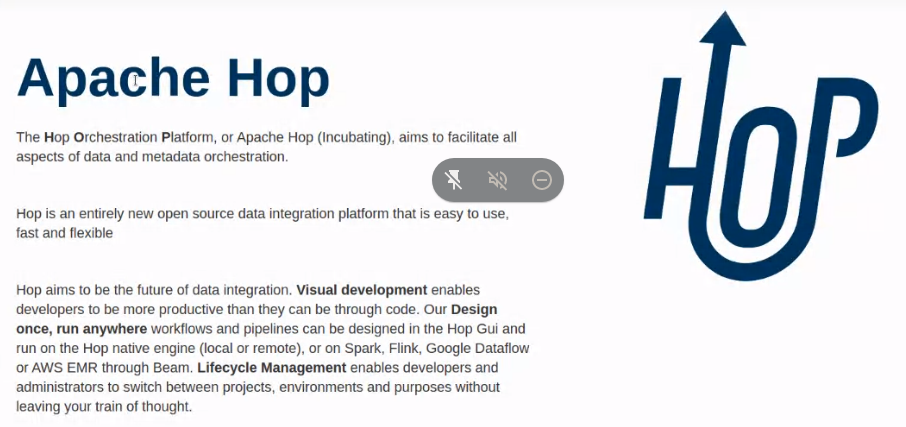

# Bases de datos II

- [Bases de datos II](#bases-de-datos-ii)
  - [Notas](#notas)
  - [Repaso](#repaso)
  - [Docker](#docker)
  - [Federacion de mysql](#federacion-de-mysql)
  - [Eventos](#eventos)
  - [Triggers](#triggers)
  - [Funciones](#funciones)
  - [Procedimientos almacenados](#procedimientos-almacenados)
  - [Marco teorico previo a HEFESTO](#marco-teorico-previo-a-hefesto)

## Notas

**Profe**:
* Mariano Alberto Garcia Mattio

## Repaso

* SGBD
* Diseños de DB --> Modelados conceptuales
* Modelos conceptuales --> ER
* Modelos mas avanzados --> Modelo relacional

magm3333@gmail.com

data en el mail a mandar:

## Docker

Crear contenedores **ligeros** y **portables** que puedan ejecutarse en maquina **independientemente** del **sistema operativo** que la maquina tenga por debajo **facilitando** sus **desplieges**.

Ventajas:
* **Desarrolladores** (se puede mandar todo el proyecto a desplegar o testear con la certeza de que va a andar igual que en el environment del desarrollador)
* **Testers**
* **Sysadmin**
* **Menos pesado** que una VM
* **Open source**
* **Prototipado** (servicios, microservicios, redes, interacciones complejas y heterogeneas)

**Imagen**

Es como una clase, una plantilla. Luego generamos un contenedor a partir de una imanen, este seria como la instancia o objeto.

Volumen: Espacio fisico que almacena los datos de cada contenedor. Se crean en el host real y se asocian a cada contenedor creado. (Locacion por defecto: /var/lib/docker/volumes).

Se pueden crear volumenes con nombres familiares para facilitar la gestion

docker run: prende el contenedor y ejecuta el comando, luego lo apaga.

docker exec: ejecuta un comando en un contenedor ya activado.

## Federacion de mysql

En dos servicios de MySQL, uno de ellos puede funcionar como cliente del otro reexponiendo rescources como por ejemplo tablas.

## Eventos

Objetos que contienen codigo que se pueden ejecutar de forma scheduled.

## Triggers

Es un objeto de la DB q esta asociado a una tabla y se activa cuando se ejecuta una accion sobre esa tabla (insert, update o delete).

## Funciones

Porcion de codigo que recibe parametros y devuelve elementos.

## Procedimientos almacenados

Ventajas:
* Ahorran ancho de banda
* Centralizan logica de negocios
* Aumentan la performance y respuesta general

## Marco teorico previo a HEFESTO

Los **datos** son parte fundamental que **conforma** la **información**.

**Inteligencia de negocios** responde a preguntas ¿que sucede? ¿que sucedió? ¿que sucederá? ¿por qué? (estas ultimas 2 mediante **data mining**). Otorga toda la informacion y conocimiento oportuni, relevante, util y adecuado al contexto a una empresa / gerente de una empresa para que este pueda tomar decisiones que resulten en un beneficio para la misma.

**Proceso de BL**

**Data Warehousing**

Conceptos clave

* Extraccion, transformacion, integracion y centralizacion de datos
* Analisis y exploracion
* Informacion
* Soporte a la toma de decisiones

Requiere:
* Almacenar los datos en una bd centralizada con **estructura multidimencional** (data warehouse)

**Data warehouse**

Es una coleccion de datos para el soporte del proceso de la toma de decisiones, que posee estas 4 caracteristicas principales.

* **Orientada al negocio**: **Solo** puede **tener** info que va a ser utilizada para la toma de decisiones
* **Integrada**: Toma datos internos, externos, de diferentes fuentes y compatibilizados.
* **Variante en el tiempo**: Cada porcion relevante en el DW debe tener un CELLO en el timepo de manera obligatoria.
* **No volatil**: Es de "solo lectura/consulta". La informacion no es modificable.

Los datos se guardan ya resumidos para mejorar la velocidad de las consultas

**Arquitectura del DWH**

1. **OLTP**: Sistemas de almacenamiento transaccional comun y corriente. Puede ser de fuentes internas y externas. Ejemplos: Archivos de texto, hojas de calculo, informes, BD transaccional.
2. **Load manager**: ETL (Extraccion, transformacion y carga)
    * Extraccion: 
        * Datos relevantes
        * Almacenamiento intermedio
    * Transformacion
        * Integracion
        * Limpieza de los datos
    * Carga
        * Carga y actualizacion del DW
        * Mantenimiento de la estructura del DW
3. **DW Manager**: Capa de software agregada a un SGBD comun para dar mas funcionalidades. Es un sistema de almacenamiento multidimencional (Tablas de hechos y dimensiones). Da soportes a cubos, BM, etc. y da lugar a 3 tipos de modelados:
    * Esquema estrella
    * Esquema copo de nieve
    * Esquema constelacion
Y al momento de la implementacion fisica tenemos estos 3 tipos:
    * ROLAP (relacional)
    * MOLAP (noseque)
    * HOLAP (hibrido)

**Tablas de dimensiones**: 

Son los aspectos de interes, o criterios de analisis en los que vamos a querer analizar los datos. (el tiempo esta si o si). 

La tabla de dimension tiempo es obligatoria, permite ver diferentes versiones de una misma info, y mantinene niveles jerarquicos especiales.

**Tablas de hechos**

Contienen los hechos que se quieren analizar, estos son datos instantaneos en el tiempo que son filtrados, agrupados y explorados a traves de condiciones definidas en tablas de dimensiones.

**Cubo multidimensional**

Forma de representacion multidimencional. Los datos se encuentran en las filas y las columnas, y los indicadores se encuentran en las intersecciones

Se agrupa sobre los ejes y se hace una sumatoria del indicador requerido.

Los cubos tienen indicadores y atributos

**Indicadores**

Son la aplicación de una funcion de agregación sobre algún hecho, o una expresion basada en alguna funcion de agregación, condicionadas por agrupos/jerarquias.

**Atributos**

(Dimensiones) Criterios de analisis en los que se van a basar los indicadores.

**Jerarquias**

Una dimension puede tener jerarquias, la jerarquia padre debe tener en su totalidad a los hijos.

**Creacion de un cubo multidimencional**

Vamos a usar un load manager especifico:

[Apache Hop](https://hop.apache.org)