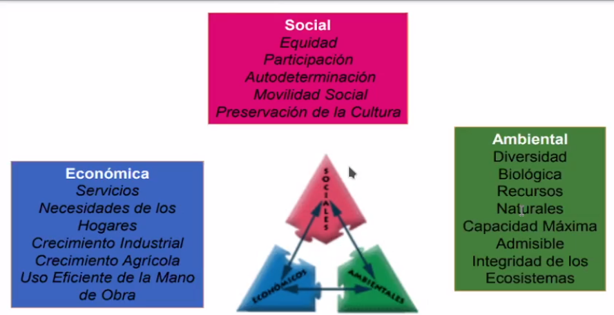
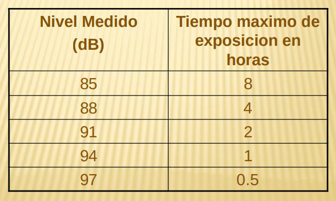
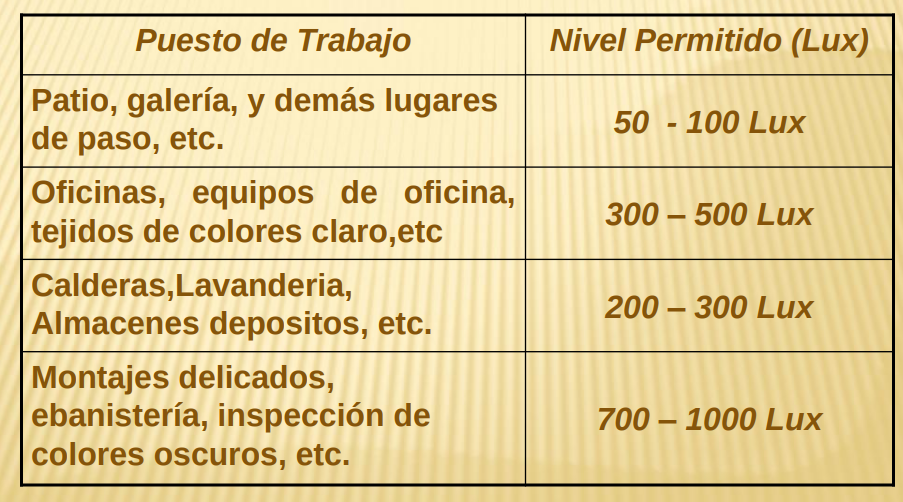
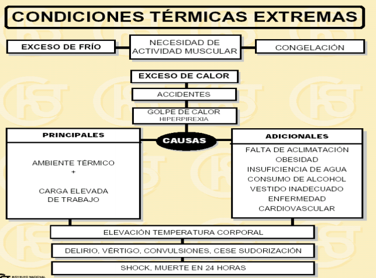
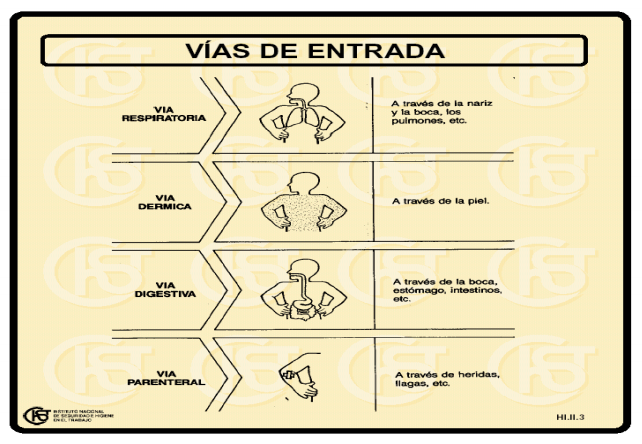
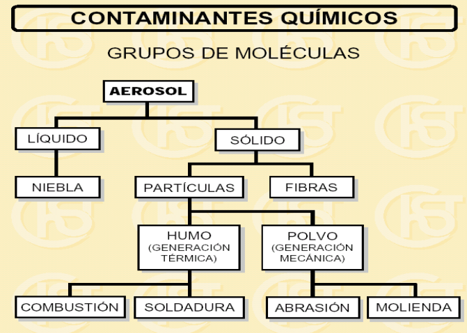
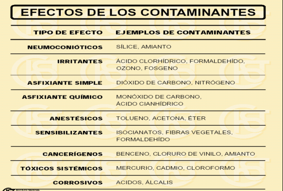
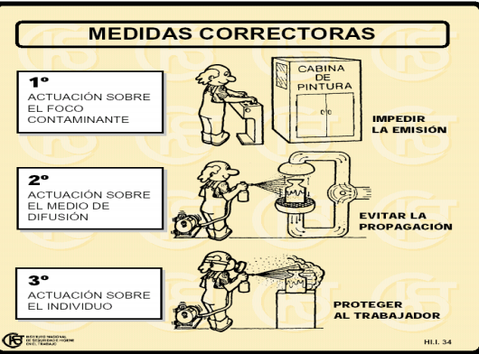

# Resumen Gestion Ambiental

- [Resumen Gestion Ambiental](#resumen-gestion-ambiental)
  - [Introduccion](#introduccion)
    - [ISO 14001](#iso-14001)
  - [Implantar un SGA en una empresa](#implantar-un-sga-en-una-empresa)
  - [Politica ambiental](#politica-ambiental)
  - [Produccion Mas Limpia (PML)](#produccion-mas-limpia-pml)
  - [Estudio del impacto ambiental](#estudio-del-impacto-ambiental)
  - [Contaminacion ambiental](#contaminacion-ambiental)
    - [Tipos de contaminaciones](#tipos-de-contaminaciones)
    - [Efecto invernadero](#efecto-invernadero)
    - [Agotamiento de la capa de ozono](#agotamiento-de-la-capa-de-ozono)
    - [Lluvia acida](#lluvia-acida)
    - [Efectos de la contaminacion del aire](#efectos-de-la-contaminacion-del-aire)
    - [Efectos del ruido y vibraciones](#efectos-del-ruido-y-vibraciones)
    - [Efectos de las radiaciones ionizantes](#efectos-de-las-radiaciones-ionizantes)
    - [Contaminacion de los suelos](#contaminacion-de-los-suelos)
  - [Desarrollo sostenible](#desarrollo-sostenible)
    - [Dimension ambiental](#dimension-ambiental)
    - [Dimension economica](#dimension-economica)
    - [Dimension social](#dimension-social)
    - [Interpretando](#interpretando)
    - [Alternativas](#alternativas)
  - [Derecho ambiental](#derecho-ambiental)
    - [Ley General del Ambiente](#ley-general-del-ambiente)
  - [Higiene y seguridad](#higiene-y-seguridad)
    - [Enfermedad laboral](#enfermedad-laboral)
    - [Alcance de la higiene industrial](#alcance-de-la-higiene-industrial)
    - [Contaminantes físicos](#contaminantes-físicos)
    - [Iluminacion](#iluminacion)
    - [Calor](#calor)
    - [Contaminantes quimicos](#contaminantes-quimicos)
    - [Contaminantes biologicos](#contaminantes-biologicos)

## Introduccion

Cualquier actividad economica producida por el hombre produce un **impacto ambiental**.

**Objetivos de la GA**

Los objetivos de la gestion ambiental implementada en una actividad economica:

- Preservar el **medio ambiente**
- Prevenir la contaminacion y los riesgos ambientales (Punto de vista **preventivo**)
- Tener un lugar de trabajo **seguro**

**Sistemas de gestion ambientas**

Los sistemas de gestion ambiental **produccen** acciones ambientales **fabricando** herramientas de gestion para **mejorar** el desempeño laboral.

El sistema de gestion ambiental que nosotros implementemos en una organizacion tendra alcance en todos los aspectos de la organizacion como el economico-financiero, el de produccion-marketing-gestion, el de recursos humanos, relaciones publicas, etc. (En la practica, se relaciona mucho los SGA con la produccion)

**Mejora continua**

Todo sistema de gestion de una empresa se debe basar en la mejora continua

**Estrategias para desarrollar SGA**

Se desarrolla un SGA **propio** para la empresa, pero se sigue siempre una norma segun la cual se puede certificar dicho SGA (certificar provee varios beneficios). Estas normas pueden ser

- ISO 14001 (Mundo)
- EMAS (Europa)

**Terminologia de SGA**

- **Aspecto**: elementos/productos/servicios que se **realizan** **dentro** de la **organizacion** para llevar a cabo el servicio/fin que tienen **relacion** con el ambiente (Ej: Uso de un quimico, consumo de agua-electricidad, etc.)
- **Impacto**: Cambio de las **condiciones normales** actuales de un sistema (Ej: Cambiar el PH del rio)
- **Efecto**: Consecuencia que puede llegar a tener este cambio en el ambiente.

### ISO 14001

**Ventajas de implantar ISO 14001**

- Permite consumir **menos recursos** (depende del proceso) y **mejorar** la cuenta de **resultados**
- Tiene repercusiones positivas sobre la **calidad** de **procesos** y **productos**.
- Mejora la **relación ambiental** con la **Administración local** y **ambiental**
- **Motiva** a los **empleados** (Capacitaciones, premios).
- Para cumplir las nuevas **normativas** ambientales.
- Como **requisito** del **cliente**.
- Mejora la **imagen** ante la **sociedad** y los **consumidores**.
- Una **ventaja frente** a sus **competidores** en nuevos mercados
- Facilita el acceso a las **ayudas** y **subvenciones públicas**
- Puede facilitar **servicios financieros** y de **seguros ventajosos** (Garantia que empresa funciona bien)
- Mejor **valoración** en las **contrataciones públicas**.

Nota: Implementacion 2015 con vigencia desde 2017 Pide que demostremos la vinculacion con las partes interesadas.

Nota: Siempre certificamos procesos, no prouctos

**Requerimientos para la implantacion de ISO 14001**

- Inversiones economicas
- Recursos humanos
- Constancia para mantener el compromiso ambiental
- Esfuerzo para que todas las partes se impliquen

Nota: La norma dice que debemos hacer, pero el como lo hacemos lo define la empresa

Nota: Economia circular-> estrategia que tiene por objetivo reducir tanto la entrada de los materiales vírgenes como la producción de desechos, cerrando los «bucles» o flujos económicos y ecológicos de los recursos.​

## Implantar un SGA en una empresa

**Recomendaciones para implantar un SGA**

- Tener en claro el **objetivo final** del proyecto
- Analizar la **necesidad** de **recursos**
- Obtener el **apoyo** de la **dirección**
- **Involucrar** a los **empleados** que estén **motivados**
- Identificar un **líder**
- Disponer de la **información necesaria**.
- Planificar la **formación interna** necesaria en **materia ambiental**

**Implantando un SGA**

Los lideres de la organizacion se **comprometen** a realizar la implementacion/certificacion, luego se hace una **revision** de la gestion ambiental actual de la empresa para conocer la situacion actual y el punto de partida para alcanzar los requisitos propuestos. Luego identificamos toda la **legislacion aplicable** a nuestras actividades. Luego, preparamos una **politica ambiental** (compromisos que va a asumir la organizacion publicamente con respecto al ambiente).

## Politica ambiental

La politica ambiental son **compromisos** con el medio ambiente preparados por la **direccion** de la empresa en un **documento publico**. Esta politica asegura que:

- Está definida al máximo nivel.
- Está **documentada**, **implantada** y **actualizada**.
- Sirve de base para establecer y revisar los objetivos y **metas ambientales**.
- Constituye un compromiso de **mejora continua** y **prevención**.
- Asume el **cumplimiento** de **requisitos legales** y reglamentarios.
- Está a **disposición del público**.

A continuacion especificamos los requisitos que la norma pide para poder certificar la empresa (No especifica como se deben cumplir).

**Identificacion de aspectos medioambientales**

**Evaluar los impactos ambientales**

Una vez identificados los aspectos e impactos, priorizamos los impactos ambientales que necesariamente se deben gestionar a la brevedad. Se suele usar esta herramienta (matriz) para calificar dichos impactos (La empresa decide cual es la probabilidad y severidad de cada impacto)

La evaluacion ambiental inical se plantea como una radiografia del estado actual de la empresa. En esta evaluacion se incluye:
- Identificacion de los impactos
- Practicas y procedimientos de gestion de la contaminacion
- Incidentes ocurridos
- Evaluacion de los aspectos ambientales para identificar los mas significativos
- Tener en cuenta la legislacion ambiental y la ley ISO 14001

(?)

**Caracteristicas de los objetivos**

Los objetivos planteados en funcion de los compromisos asumidos en la politica ambiental deben tener ciertas caracteristicas:

- Deben conseguir una **mejora real** en la **actuación ambiental**
- Deben ser **consecuentes** con la **Política
Ambiental**
- Deben ser **realistas y razonables**
- Deben estar establecidos de acuerdo a los aspectos ambientales **significativos** de la actividad

**Posibles objetivos**

- **Reducción** de **residuos** y del **consumo de recursos**
- Reducción o **eliminación** de **emisiones contaminantes**
- **Rediseño** de **productos** para minimizar su impacto ambiental
- **Promoción** de la **concienciación** de los empleados y de la comunicación exterior

**Ejemplo de gestion de un objetivo**

Este es un **programa** para la gestion de producto.

**Programa ambiental**

(Cuadro de arriba) Descripción documentada de las **responsabilidades** y los **medios** que la empresa destina a lograr los **objetivos** y **metas** medioambientales definidas en un **plazo establecido**. Dentro de esta descripcion se encuentra:
- ¿Quien?¿que?¿como?¿con que?¿cuando?
- Objetivos ambientales
- Metas
- Funciones y Responsabilidades
- Cronograma
- Medios necesarios
- Indicadores (si es posible)

**Estructura y responsabilidades**

La norma establece como requisito que se tiene que definir la estructura de la empresa (La norma no especifica como se define).  Ej:

Cada sector tiene sus propias responsabilidades (Ver en power point).

**Documentacion del sistema**

Los procesos de documentacion son tan burocraticos como la empresa decida. Pero la norma pide que haya documentacion. Esta debe/ puede constar de

- **Manual de Gestión Ambiental** donde se plasma la política ambiental, se definen las responsabilidades y los objetivos, metas y programas.
- **Procedimientos e Instrucciones** Técnicas donde se describen cómo se realizan las distintas actividades de la empresa.
- **Otros documentos** como son los Planes de Auditorías, Planes de Formación, Programas, Normativa, etc.
- **Registros de incidentes**, quejas, etc.

Esta puede estar hecha sobre papel, o en formatos **word/pdf**.

Esta documentacion debe pasar por un proceso regular de **control**, actualizandose de ser necesario.

**Control operacional**

Gracias la documentacion identificamos y controlamos las operaciones y actividades de la empresa y nos focalizamos en los impactos ambientales mas significativos para trabajarlos. 

Esto lo hacemos tambien para prevenir situaciones de emergencia. Para esto se suele establecer un **programa de prevencion de riesgos** (Esto lo establece la norma)

**Seguimiento y medicion**

El proceso que llevamos a cabo para cumplir las metas ambientales propuestas por la propia empresa debe ser periodicamente revisado para verificar que estemos por el camino correcto.

Estos seguimientos constan de:

- Control y medición de las características clave de las operaciones y actividades con impacto significativo en el ambiente.
- Calibración y mantenimiento de equipos de inspección.
- Evaluación del cumplimiento de la legislación y reglamentación ambiental aplicable.
- Establecimiento y actualización de los procedimientos y registros pertinentes.

**Mal funcionamiento**

Luego de los seguimientos, puede que haya deficiencias en el sistema. estas pueden ser debido a deficiencias en el diseño, deficiencias en la implantación, deficiencias o fallos en la propia instalación, deficiencias o fallos en los equipos principales o auxiliares, errores humanos, etc.

En funcion de estas deficiencias tomamos acciones **preventivas** (prevenir que no pase de nuevo) y/o **correctoras**(Moderar los efectos negativos)

**Registros**

Los seguimientos junto con sus resultados deben estar registrados de manera precisa, legible e identificada con la actividad, producto o servicio implicado

**Auditoria**

Las auditorias son inspecciones, verificaciones realizadas por un auditor con el fin de comprobar si se cumple con lo esperado. Estas pueden ser: 

- Internas: Yo mismo verifico si todo anda bien
- Externas: Llamo a un auditor para verificar si todo anda bien, o para obtener/mantener/renovar la **certificacion**.

**Revision por direccion**

Luego de todo esto, la direccion realiza una revision final y en base a eso toma decisiones.

**Resumen**

**Proceso de certificacion**

La empresa decide certificarse y solicita dicha certificacion. Junto con la solicitud, la empresa manda documentacion, que se estudia y se realiza una visita previa. Luego, se realiza una auditoria y en base a esta, la empresa realiza un plan de acciones correctivas. Si este plan cumple con los requisitos y es aprobado, se otorga la certificacion.

Esta certificacion dura 3 años, pero debe ser mantenida mediante un seguimiento anual.

## Produccion Mas Limpia (PML)

La **producción más limpia** es la aplicación continua de una **estrategia ambiental** **preventiva e integral**, a los procesos productivos, productos y servicios para incrementar la **eficiencia global** y reducir riesgos para los seres humanos y el ambiente.

La PML puede ser aplicada a los **procesos** empleados en **cualquier industria**, a los **productos** mismos y a los diferentes **servicios** prestados a la sociedad. 

Para empezar a implementar la PML, primero debemos **Identificar** **opciones** para **prevenir o reducir** la **generación de residuos** en fuente.

Para eso nos preguntamos:

1. Qué **clase** y qué **cantidad** de residuos están siendo generados?
2. Cuál es el **costo** relacionado con estos residuos?
3. **Dónde** exactamente se generan estos residuos?
4. **Por qué** se generan?
5. **Cómo pueden evitarse**?

La PML produce:

- **En los procesos productivos**: la PML conduce al **ahorro** de materias primas, agua y/o energía; a la **eliminación** de materias primas **tóxicas y peligrosas**; y a la reducción, en la fuente, de la **cantidad** y toxicidad de todas las **emisiones y desechos**, durante el proceso de producción.
- **En los productos**: la PML busca reducir los **impactos negativos** de los productos sobre el **ambiente**, la salud y la seguridad, durante todo su **ciclo de vida**, desde la extracción de las materias primas, pasando por la transformación y uso, hasta la disposición final del producto.
  

Mientras mas nos enfoquemos en la prevencion de los procesos productivos, mejor sera la inversion y mayor sera el beneficio ambiental que generaremos.

La PML se puede aplicar a cualquier tipo de organizacion. Ya sea a sus procesos, a los productos o a los servicios que esta brinde.

`Nota`: Un **residuo** es todo lo generado (solido, liquido, gaseoso, sonoro, etc.) que no es aprovechado y por lo tanto desechado.

**Beneficios para la empresa**

- Cumplimiento con la legislación
- Mejoras en la calidad del producto
- Mejora el desempeño ambiental
- Mejora la imagen de la empresa y producto 
- Reducción costos ambientales
- Nuevas oportunidades de mercado

Para **implementar** el PML, primero recolectamos los datos de la empresa.

Luego analizamos el **proceso productivo**. nos preguntamos cuanta cantidad de desechos se producen, donde, porque, etc.

Luego generamos las opciones segun este diagrama:

Se escogen las opciones mas viables y se implementan a travez del plan de accion ambiental.

Para un correcto desempeño del PML se debe tener un seguimiento y control del mismo que consta de:

- Control sistemático del cumplimiento del plan de acción ambiental.
- Evaluación de los beneficios obtenidos por su implementación.
- Análisis de los objetivos y metas ambientales.
- Evaluación de la contribución al mejoramiento del desempeño ambiental de la organización.

## Estudio del impacto ambiental

`EIA`: es un proceso de **análisis**, más o menos largo y complejo, encaminado a que los agentes implicados formen un **juicio previo**, lo más objetivo posible, sobre los **efectos ambientales** de una acción humana prevista (a la que se denomina **proyecto**) y sobre la posibilidad de **evitarlos**, **reducirlos** a niveles aceptables o **compensarlos**"

La ley es la que definen en que proyectos es necesarios un `EIA`.

Los impactos no necesariamente son ambientales (pueden ser culturales, quimicos, bioticos, socioeconomicos, etc) ni negativos.

En otras palabras, la `EIA` es:

- La `EIA` es un instrumento de **gestión pública**
- Es un **procedimiento administrativo**
- Como tal, trae implícita la capacidad de **establecer exigencias** y responsabilidades en los distintos niveles de gobierno
- Y también, sobre todo, de los sectores privados en su accionar con respecto al medio ambiente

A partir de estas conceptualizaciones se pone
de manifiesto que **cualquier actividad humana**
tiene **efectos** sobre el medio ambiente que
podrán ser positivos o negativos. 

Los problemas regionales que se generan a partir de estos impactos tienen repercusion con los problemas mundiales, y viceversa.

Al aplicar un `EIA` se debe estudiar:

1. La modificación de las características del medio.
2. La modificación de los valores o méritos, que hacen al mantenimiento o conservación de ese medio.
3. El significado ambiental que dichas modificaciones tienen en relación con la calidad de vida.

Este estudio se realiza analizando:

1. Los **síntomas** con que se expresa el efecto sobre el medio (contaminación, degradación de suelos, riesgos ambientales, etc.)
2. Las **causas** que originan el impacto (procesos productivos, irresponsabilidad de los actores sociales, insuficiente control, etc.)
3. Los **efectos** o repercusiones de los **síntomas** detectados (en los ecosistemas, en otras actividades, personas, etc.)
4. Los **agentes** implicados en las causas y los efectos.
5. La **sensibilización** de los actores implicados (administradores, población) para la prevención o corrección de las consecuencias de la acción desencadenante.
6. Las **capacidades** y **responsabilidades** de **intervención preventiva**, de control o compensatoria sobre causas y efectos.
7. Los **objetivos** a alcanzar en el tratamiento preventivo o correctivo (cómo hacerlo, para quién hacerlo, con quién hacerlo).

**Proceso de implementacion de un** `EIA`

Mas profundidad en el PP

## Contaminacion ambiental

Es la presencia en el ambiente de uno o mas **contaminantes** que perjudique factores en dicho ambiente.

**Contaminante**: Sustancia quimica, biologica o radiologica en cualquier estado o forma que al encontrarse por encima de las concentraciones normales en algun elemento del medio ambiente, cambia su composicion natural.

Los contaminantes pueden ser (segun su naturaleza):
- Biologicos (microorganismos)
- Quimicos (organicos e inorganicos)
- Fisicos (Radiaciones, calor, solidos)

Las **fuentes** de contaminacion son aquellas **instalaciones**, **procesos** o **actividades** que provocan contaminación ambiental.

Estas pueden ser:
- Puntuales
- Difusas
- Segun su origen
  - Naturales
  - tecnologicas
  - agricolas
  - pecuarias
  - domesticas y municipales
- estacionarias
- moviles

### Tipos de contaminaciones

**Contaminacion del agua**

Puede provocar  efectos
adversos a la salud humana y a la calidad
ambiental de los ecosistemas asociados. Puede ser tanto al nivel superficial como subterraneo

**Contaminacion del aire**

emisión de sustancias peligrosas al aire, en una tasa que excede la capacidad de los procesos naturales para diluirlas. Se puede contaminar mediante solidos, liquidos, gaseosos y/o energicos

### Efecto invernadero

Aumento de la temperatura de la tierra, producido por la liberación de determinados gases a la atmósfera

Esto provoca:
- Cambios del clima
- Huracanes, inundaciones
- Elevación del nivel del mar
- Extinción de especies
- Desertificación y sequía

### Agotamiento de la capa de ozono

Debido a la emisión de gases que contienen cloro. esto genera un incremento de radiación  ltravioleta

### Lluvia acida

Cualquier forma de precipitación  cuya acidez es alta, debido a la absorción de contaminantes presentes en el aire. Esto genera:
- Disminución de pH en cuerpos de agua y suelos
- Corrosión de estructuras y edificaciones
- Desaparición de bosques
- Afectación a organismos acuáticos y terrestres

### Efectos de la contaminacion del aire

La contaminacion del aire afecta tanto a las personas como a los animales y a las plantas de muchas maneras distintas

### Efectos del ruido y vibraciones

estres, perdida de audicion, iriitabilidad, alteraciones del sistema nervioso, anulacion de reflejos, etc.

### Efectos de las radiaciones ionizantes

- desórdenes funcionales;
- inducción al cáncer;
- acortamiento de la vida;
- envejecimiento precoz;
- taras genéticas.

### Contaminacion de los suelos

Deterioro de las propiedades físicas, químicas y biológicas que experimentan los suelos, como resultado de la incorporación en su seno de diversas sustancias contaminantes.

Causas: 
- Prácticas agrícolas inadecuadas (aplicación de agroquímicos);
- Vertimientos de sustancias químicas;
- Descargas de residuales líquidos;
- Disposición de residuos sólidos;
- Actividad pecuaria;
- Fugas en nichos de confinamiento de desechos peligrosos.

Efectos:

-Pérdida de la capacidad productiva;
-desvalorización de terrenos;
- Afectaciones a la vegetación y a las poblaciones de microorganismos del suelo por la acumulación de contaminantes.
- Modificación de sus propiedades;
- acidificación;
- Contaminación con gérmenes patógenos;
- Afectaciones a la salud;
- Degradación paisajística.

## Desarrollo sostenible

A partir de la revolucion industrial, se empezo a descubrir y plantear ciertos aspectos con respecto a la contaminacion ambiental. Nos empezamos a cuestionar el desarrollo que estaba teniendo la sociedad a nivel global y empezamos a tomar conciencia de los problemas ambientales a escala planetaria.

El **desarrollo humano** no es lo mismo que **desarrollo economico**.

En 1980 nos dimos cuenta que los recursos naturales eran limitados, y que era indispensable conservarlos para lograr un **desarrollo sostenible**

El desarrollo sostenible consta de **proteger la naturaleza** y **luchar contra la pobreza**

Segun la comision mundial del medio ambiente y desarrollo, el desarrollo sustentable es un desarrollo que satisface las necesidades del presente sin comprometer las necesidades de generaciones futuras.

El informe de esta comision concluye con que es posible una nueva era de crecimiento economico que alivie la pobreza mientras se funden politicas que sostengan y amplien la base de recursos, con un menor consumo.

El desarrollo sustentable abarca estos 3 aspectos (no solamente 1 de ellos):

### Dimension ambiental

El consumo de recursos se deberia de limitar segun la capacidad de regeneracion de los mismos, y la generacion de residuos se deberia limitar a la capacidad de asimilacion del ecosistema.

### Dimension economica

La calidad de los servicios y la forma de producirlos deberia de ser la mejor.

### Dimension social

Se deberia:
- Igualar los ingresos (0.o)
- satisfacer las necesidades basicas
- superar la pobreza
- detener el sobre consumo
- formar capital humano y social

### Interpretando

Hay distintas interpretaciones de este planteamiento, y cada pais tiene su postura con respecto al mismo. Sin embargo, no se debe rechazar esto de antemano y se deberia debatir para lograr comprender el problema.

### Alternativas

Se pueden construir alternativas con la premisa de mirar hacia el futuro, cuidar y compartir los recursos y moderar el consumo. Esto implica muchos **desafios**.

## Derecho ambiental

El articulo 41 de la constitucion nacional dice que:

Todos los habitantes gozan del derecho a un **ambiente sano**, equilibrado, apto para el desarrollo humano y para que las actividades productivas satisfagan las **necesidades presentes** sin comprometer las de las generaciones **futuras**; y tienen el deber de preservarlo. El **daño ambiental** generará prioritariamente la **obligación de recomponer**, según lo establezca la ley.

Las autoridades proveerán a la **protección** de este derecho

Corresponde a la Nación dictar las normas que contengan los presupuestos mínimos de protección, y a las provincias, las necesarias para complementarlas, sin que aquéllas alteren las jurisdicciones locales. (?)

Se prohíbe el ingreso al territorio nacional de residuos actual o potencialmente **peligrosos**, y de los radiactivos.

### Ley General del Ambiente

En nuestro pais, la ley **general del ambiente** (**ley 25.675**) establece **diez principios** de política ambiental.

1. **Principio de congruencia**:  La legislación provincial y municipal referida a lo ambiental deberá ser **adecuada** a los principios y normas fijadas en la presente ley; en caso de que así no fuere, éste prevalecerá sobre toda otra norma que se le oponga.
2. **Principio de prevención**:  Las **causas** y las **fuentes** de los problemas ambientales se atenderán en forma **prioritaria** e **integrada**, tratando de prevenir los efectos negativos que sobre el ambiente se pueden producir.
3. **Principio precautorio**:  Cuando haya peligro de **daño grave** o **irreversible** la **ausencia de información** o certeza científica no deberá utilizarse como **razón** para **postergar** la adopción de medidas eficaces, en función de los costos, para impedir la degradación del medio ambiente.
4. **Principio de equidad intergeneracional**:  Los responsables de la protección ambiental deberán **velar** por el uso y goce apropiado del ambiente por parte de las **generaciones presentes** y **futuras**.
5. **Principio de progresividad**: Los objetivos ambientales deberán ser logrados en forma **gradual**, a través de metas interinas y finales, proyectadas en un **cronograma temporal** que facilite la adecuación correspondiente a las actividades relacionadas con esos objetivos.
6. **Principio de responsabilidad**:  El **generador** de **efectos degradantes** del ambiente, actuales o futuros, es **responsable** de los **costos** de las acciones **preventivas** y **correctivas** de **recomposición**, sin perjuicio de la vigencia de los sistemas de responsabilidad ambiental que correspondan.
7. **Principio de subsidiariedad**: El Estado nacional, a través de las distintas instancias de la administración pública, tiene la **obligación** de **colaborar** y, de ser necesario, **participar** en forma complementaria en el accionar de los particulares en la **preservación** y **protección ambientales**.
8. **Principio de sustentabilidad**:  El desarrollo económico y social y el aprovechamiento de los recursos naturales deberán realizarse a través de una **gestión apropiada** del ambiente, de manera tal, que **no comprometa** las posibilidades de las **generaciones presentes** y **futuras**.
9. **Principio de solidaridad**: La Nación y los Estados provinciales serán responsables de la **prevención** y **mitigación** de los efectos ambientales **transfronterizos** adversos de su propio accionar, así como de la minimización de los riesgos ambientales sobre los **sistemas ecológicos compartidos**.
10. **Principio de cooperación**:  Los recursos naturales y los sistemas ecológicos compartidos serán utilizados en forma **equitativa** y racional. El **tratamiento** y mitigación de las **emergencias ambientales** de efectos **transfronterizos** serán desarrollados en forma **conjunta**

**Principio precautorio (otra perspectiva)**

El “principio precautorio”, se traduce como la obligación de **suspender** o cancelar actividades que **amenacen** el **medio ambiente**, pese a que no existan pruebas científicas suficientes que vinculen tales actividades con el deterioro de aquél.

## Higiene y seguridad

La Higiene Industrial es una **técnica** no medica dedicada a **reconocer**, **evaluar** y **controlar** aquellos **factores** ambientales o tensiones emanadas o **provocadas** por el **lugar de trabajo** y que pueden ocasionar **enfermedades**, o la disminución de la salud de los **trabajadores**.

### Enfermedad laboral

La enfermedad profesional se distingue a toda **variación** en la **salud** del trabajador, y es un estado patológico derivado de la **acción continua** de una causa que tenga origen o motivo **en el trabajo** o en el **medio** en que el trabajador presta sus servicios y que le provoque una **incapacidad** o **perturbación** física, psíquica o funcional de forma permanente o transitoria.

### Alcance de la higiene industrial

**Contaminantes físicos**:
- ruido, iluminación, temperatura, vibraciones.

**Contaminantes químicos**:
- gases, humos y neblinas, polvos, vapores.

**Contaminantes biológicos**:
- virus, hongos, bacterias.

### Contaminantes físicos

Son distintas formas de **energías** que generadas por **fuentes concretas**, pueden afectar a los trabajadores sometidos a ellas. Están energías pueden ser **mecánicas**, **térmicas** o **electromagnéticas**, provocando efectos muy distintos entre sí.

Por ejemplo el **ruido**:

Es un tipo de contaminante muy común en los diferentes sectores económicos, y se define como un **sonido no deseado**.

Los altos niveles de presión sonora son ocasionados principalmente por:

- Maquinas obsoletas
- Inadecuado mantenimiento
- Piezas mal empotradas / desajustadas

El sonido puede generar estos daños:

- Sordera temporal
- Sordera permanente (Hipoacusia)
- Interferencia de comunicación
- Perdida auditiva por edad
- Aumento de la frecuencia respiratoria
- Afecciones en él estomago
- Trastorno nervioso
- Dificultad de la atención
- Aumento del ritmo cardiaco
- Constricción de los vasos sanguíneos
- Aceleración del ritmo respiratorio
- Disminución de la actividad de los órganos de
- la digestión
- Reducción de la actividad cerebral con la
- consiguiente disminución de la atención.

Tambien generan trastornos psicologicos:

- Agresividad
- Ansiedad
- Disminución de la atención
- Disminución de la memoria inmediata

Los decibeles permitidos son:

Algunas medidas que se pueden tomar para reducir el ruido:

Reducir el ruido en su origen:

- Cambiar el equipo obsoleto por uno más moderno y menos ruidoso.
- Implementar un adecuado programa de mantenimiento
- Amortiguar los escapes de aire comprimido

Reducir el ruido en el medio:

- Encerrando las maquinas ruidosas en un recinto insonorizado de paredes rígidas recubiertas interiormente de un material poroso u absorbente del ruido, puerta de cierre hermético.
- Realizar periódicamente mediciones de nivel sonoro de ruido para verificar la eficiencia de las medidas adoptadas.
- Tratamiento acústico del local, colocando en el techo y / o paredes, paneles absorbentes de ruido

### Iluminacion

La iluminación es una necesidad en cualquier circunstancia de nuestra vida diaria. La iluminación es un **factor de calidad** en el trabajo; sin embargo muchas veces no le damos la importancia que tiene gracias a que nuestros ojos son capaces de adaptarse, al menos a corto plazo, a condiciones deficientes de iluminación.

La mala iluminacion puede afectar a nuestra salud de estas maneras:

Afectaciones Directas:

- Irritación
- Cansancio Ocular
- Deslumbramiento

Afectaciones no Oculares o Indirectas:

- Dolor de Cabeza
- Fatiga

Para corregir la mala iluminacion podemos:

- Que la iluminación que llegue al plano de trabajo sea la adecuada a la actividad que se realiza
- No producir deslumbramientos: Que se produce cuando mira una luz más
- fuerte que la que el ojo está adaptado a recibir en ese momento. Esto
- ocurre cuando la iluminación está ubicada a baja altura y sin pantalla.
- Que sé de un contraste suficiente entre los distintos objetos o partes de los mismos que se están observando
- Planificar la iluminación en la superficie de trabajo orientada de manera correcta.
- La luz debe dirigirse, primero a los materiales y objetos con los que trabajamos.
- En puestos de trabajos individuales la fuente de luz debe ubicarse, por lo general oblicuamente detrás del hombro izquierdo en el caso de quien utilice su mano derecha.
- Siempre que sea posible se empleará iluminación natural y si es insuficiente se empleará la artificial.

### Calor

Estres termico por calor

Es la **carga** neta de **calor** en el **cuerpo** como consecuencia de la contribución producida por el calor **metabólico** y de los factores **externos** como son: Temperatura ambiente, Cantidad de vapor de agua y el movimiento del aire, afectado a su vez por la ropa.
• La temperatura media normal en el interior del organismo es de 37°C.
• La temperatura media normal de la piel es de 35°C.
• El cuerpo humano es considerado un depósito al que llega calor.

Los mecanismos de intercambio de calor con el cuerpo son:

- INTERCAMBIO DE CALOR POR EVAPORACIÓN DEL SUDOR.
- INTERCAMBIO DE CALOR POR CONVECCIÓN.
- INTERCAMBIO DE CALOR POR RADIACIÓN.

La incidencia de calor se puede dar por:

- Hacinamiento
- Infraestructura metálica
- Deficiente ventilación – climatización
- Fuentes generadoras de vapor (planchas – secados y calderas)

Los daños producidos por el calor son:
- La exposición conlleva a la disminución de:
  - De las posibilidades del trabajo físico.
  - Las actividades psicomotoras.
- Consecuencias fisiológicas.
  - Aumento de la frecuencia cardíaca.
  - Contracciones (dilatación de los vasos sanguíneos)
  - Disminución de la tensión muscular.
  - Incremento del ritmo respiratorio.
  - Reacción sudorífica.
  - Incremento de la temperatura corporal (> 37 grados centígrados).
- Consecuencia de la Hipertemia.
- Trastornos sistémicos:
- Calambres por calor
- Agotamiento por calor:
  - Deficiencia circulatoria
  - Deshidratación
- Sincope por calor
- Edema por calor
- Golpe de calor (Hiperpirexia)
  - Hipertemia severa con una temperatura interior del cuerpo superior a los 42°C
  - Alteraciones del sistema nervioso central
  - Piel caliente y seca con cese de la sudoración.

Acciones correctivas:

- actuar sobre la fuente de calor:
-  apantallamiento de los focos de calor radiante (hornos, motores)
- actuar sobre el ambiente térmico
- Dotar al local de ventilación general que evite el calentamiento del aire, aumentando si fuese preciso la velocidad del aire.
- Esta ventilación puede ser del tipo natural o forzada por medio de ventiladores – extractores (climatización)
-  Utilizar sistemas de extracción localizada (en actividades en que se genere vapor de agua, con el fin de evitar el aumento de la humedad del aire).
- actuar sobre el individuo
- consiste en aislar al trabajador por medio de prendas de protección personal
- rotación de personal
- Modificaciones e métodos de trabajo.
- Hidratación

### Contaminantes quimicos

Daños por contacto:

- A través de la piel :
  - dermatitis de contacto e imitativa
  - dermatosis
  - tiña
- Inhalación de partículas:
  - vapores orgánicos debido a la volatilidad de los distintos disolventes empleados:
  - alergia
  - trastornos respiratorios
  - reacción alérgica a la pelusa de algodón

Otras medidas correctivas son:

- Realizar monitoreo ambiental para conocer la magnitud del contaminante
- Sustituir los productos por otros menos tóxicos y cuya aplicación sea similar.
- Separación mediante aislamiento del proceso para controlar el área de trabajo.
- Ventilación, extracción localizada
- PROTECCIÓN INDIVIDUAL
- Reconocimiento médico periódico.
- Protección individual.

### Contaminantes biologicos

Son seres vivos, **organismos** con un determinado ciclo de vida que al penetrar en el cuerpo ocasionan **enfermedades** de tipo **infeccioso** o **parasitario**.

Medios de contaminacion biologica:

- El hacinamiento propicia la transmisión de enfermedades comunes (tuberculosis, hepatitis) 
- Ingerir alimentos deficientemente manipulados, o hacer uso de agua no apta para tomar o lavarse las manos
- Malos hábitos higiénicos
- Alta promiscuidad ( E. T. S – VIH/ SIDA)
- Parasitosis
- Infecciones digestivas.
- Trabajos agrarios
-  Actividades en las que existe contacto con animales y / o con productos de origen animal
-  Asistencia sanitaria
-  Eliminación de residuos
-  Construcción : trabajo de perforación o excavación.

Acciones correctivas:

- Supervisión de la calidad en la elaboración de los alimentos
- Adopción de la higiene personal
- Controles médicos.

Recomendaciones:

- Concientizar a los empleadores a través de talleres impartidos, los beneficios que se obtienen al aplicar las técnicas de Higiene y Seguridad dentro de sus empresas.
- Capacitar a los trabajadores a traves de los empleadores sobre las normas de higiene y seguridad , y el uso de los equipos de protección personal.
- Estructurar un plan anual de higiene y seguridad dentro de cada una de las empresas.
- Destinar un presupuesto anual para desarrollar las acciones contempladas en el plan anual de higiene y seguridad.
- Diseñar un sistema de evaluación que nos permita visualizar, controlar el desarrollo del plan de higiene y seguridad.
- Tomar en cuenta siempre al empleador y los trabajadores en conjunto ( estructurar la comisión mixta de higiene y seguridad)
- Elaborar el reglamento técnico organizativo dentro de cada una de las empresas.
- Tomar en cuenta las técnicas de control que se presentan en este documento para los diferentes tipos de riesgos y contaminantes existentes en los diferentes centros de trabajo.
- Solicitar asesoria en higiene y seguridad a las instituciones que velan por el mejoramiento de las condiciones de trabajo.