# Resumen Gestion Ambiental

- [Resumen Gestion Ambiental](#resumen-gestion-ambiental)
  - [Introduccion](#introduccion)
    - [ISO 14001](#iso-14001)
  - [Implantar un SGA en una empresa](#implantar-un-sga-en-una-empresa)
  - [Politica ambiental](#politica-ambiental)
  - [Produccion Mas Limpia (PML)](#produccion-mas-limpia-pml)
  - [Estudio del impacto ambiental](#estudio-del-impacto-ambiental)
  - [Contaminacion ambiental](#contaminacion-ambiental)
    - [Tipos de contaminaciones](#tipos-de-contaminaciones)
    - [Efecto invernadero](#efecto-invernadero)
    - [Agotamiento de la capa de ozono](#agotamiento-de-la-capa-de-ozono)
    - [Lluvia acida](#lluvia-acida)
    - [Efectos de la contaminacion del aire](#efectos-de-la-contaminacion-del-aire)
    - [Efectos del ruido y vibraciones](#efectos-del-ruido-y-vibraciones)
    - [Efectos de las radiaciones ionizantes](#efectos-de-las-radiaciones-ionizantes)
    - [Contaminacion de los suelos](#contaminacion-de-los-suelos)

## Introduccion

Cualquier actividad economica producida por el hombre produce un **impacto ambiental**.

**Objetivos de la GA**

Los objetivos de la gestion ambiental implementada en una actividad economica:

- Preservar el **medio ambiente**
- Prevenir la contaminacion y los riesgos ambientales (Punto de vista **preventivo**)
- Tener un lugar de trabajo **seguro**

**Sistemas de gestion ambientas**

Los sistemas de gestion ambiental **produccen** acciones ambientales **fabricando** herramientas de gestion para **mejorar** el desempeño laboral.

El sistema de gestion ambiental que nosotros implementemos en una organizacion tendra alcance en todos los aspectos de la organizacion como el economico-financiero, el de produccion-marketing-gestion, el de recursos humanos, relaciones publicas, etc. (En la practica, se relaciona mucho los SGA con la produccion)

**Mejora continua**

Todo sistema de gestion de una empresa se debe basar en la mejora continua

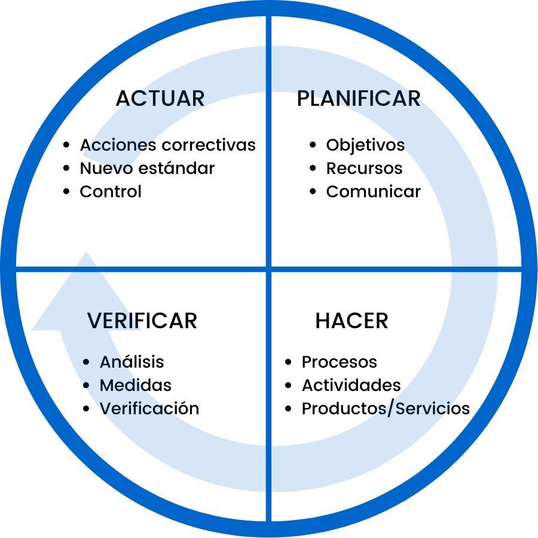

**Estrategias para desarrollar SGA**

Se desarrolla un SGA **propio** para la empresa, pero se sigue siempre una norma segun la cual se puede certificar dicho SGA (certificar provee varios beneficios). Estas normas pueden ser

- ISO 14001 (Mundo)
- EMAS (Europa)

**Terminologia de SGA**

- **Aspecto**: elementos/productos/servicios que se **realizan** **dentro** de la **organizacion** para llevar a cabo el servicio/fin que tienen **relacion** con el ambiente (Ej: Uso de un quimico, consumo de agua-electricidad, etc.)
- **Impacto**: Cambio de las **condiciones normales** actuales de un sistema (Ej: Cambiar el PH del rio)
- **Efecto**: Consecuencia que puede llegar a tener este cambio en el ambiente.

### ISO 14001

**Ventajas de implantar ISO 14001**

- Permite consumir **menos recursos** (depende del proceso) y **mejorar** la cuenta de **resultados**
- Tiene repercusiones positivas sobre la **calidad** de **procesos** y **productos**.
- Mejora la **relación ambiental** con la **Administración local** y **ambiental**
- **Motiva** a los **empleados** (Capacitaciones, premios).
- Para cumplir las nuevas **normativas** ambientales.
- Como **requisito** del **cliente**.
- Mejora la **imagen** ante la **sociedad** y los **consumidores**.
- Una **ventaja frente** a sus **competidores** en nuevos mercados
- Facilita el acceso a las **ayudas** y **subvenciones públicas**
- Puede facilitar **servicios financieros** y de **seguros ventajosos** (Garantia que empresa funciona bien)
- Mejor **valoración** en las **contrataciones públicas**.

Nota: Implementacion 2015 con vigencia desde 2017 Pide que demostremos la vinculacion con las partes interesadas.

Nota: Siempre certificamos procesos, no prouctos

**Requerimientos para la implantacion de ISO 14001**

- Inversiones economicas
- Recursos humanos
- Constancia para mantener el compromiso ambiental
- Esfuerzo para que todas las partes se impliquen

Nota: La norma dice que debemos hacer, pero el como lo hacemos lo define la empresa

Nota: Economia circular-> estrategia que tiene por objetivo reducir tanto la entrada de los materiales vírgenes como la producción de desechos, cerrando los «bucles» o flujos económicos y ecológicos de los recursos.​

## Implantar un SGA en una empresa

**Recomendaciones para implantar un SGA**

- Tener en claro el **objetivo final** del proyecto
- Analizar la **necesidad** de **recursos**
- Obtener el **apoyo** de la **dirección**
- **Involucrar** a los **empleados** que estén **motivados**
- Identificar un **líder**
- Disponer de la **información necesaria**.
- Planificar la **formación interna** necesaria en **materia ambiental**

**Implantando un SGA**

Los lideres de la organizacion se **comprometen** a realizar la implementacion/certificacion, luego se hace una **revision** de la gestion ambiental actual de la empresa para conocer la situacion actual y el punto de partida para alcanzar los requisitos propuestos. Luego identificamos toda la **legislacion aplicable** a nuestras actividades. Luego, preparamos una **politica ambiental** (compromisos que va a asumir la organizacion publicamente con respecto al ambiente).

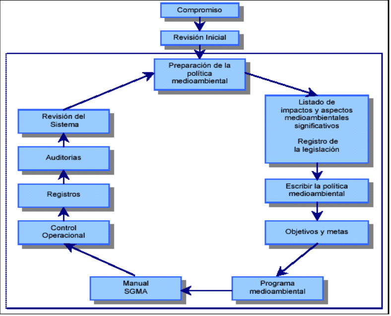

## Politica ambiental

La politica ambiental son **compromisos** con el medio ambiente preparados por la **direccion** de la empresa en un **documento publico**. Esta politica asegura que:

- Está definida al máximo nivel.
- Está **documentada**, **implantada** y **actualizada**.
- Sirve de base para establecer y revisar los objetivos y **metas ambientales**.
- Constituye un compromiso de **mejora continua** y **prevención**.
- Asume el **cumplimiento** de **requisitos legales** y reglamentarios.
- Está a **disposición del público**.

A continuacion especificamos los requisitos que la norma pide para poder certificar la empresa (No especifica como se deben cumplir).

**Identificacion de aspectos medioambientales**

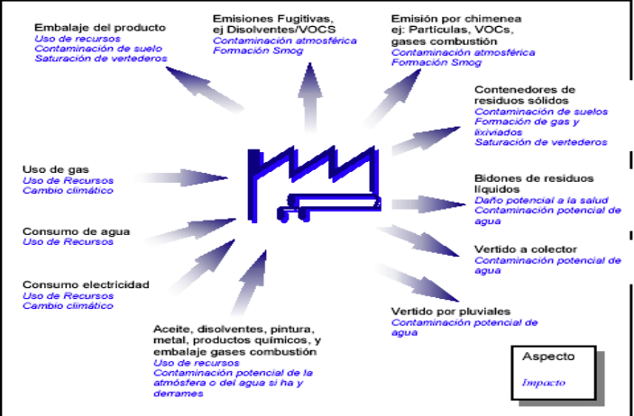

**Evaluar los impactos ambientales**

Una vez identificados los aspectos e impactos, priorizamos los impactos ambientales que necesariamente se deben gestionar a la brevedad. Se suele usar esta herramienta (matriz) para calificar dichos impactos (La empresa decide cual es la probabilidad y severidad de cada impacto)

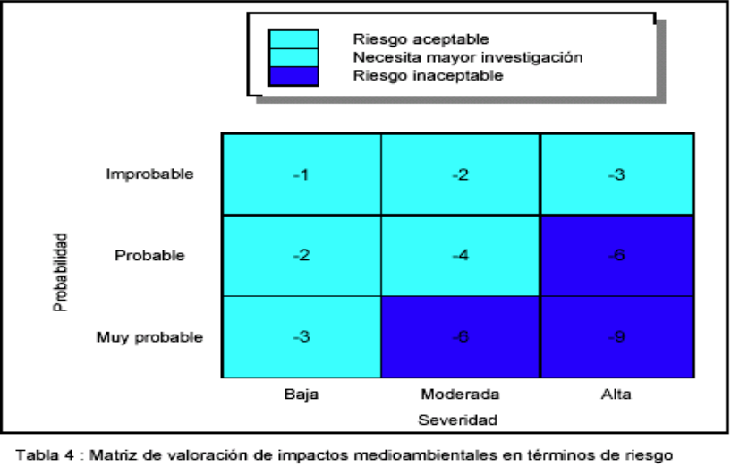

La evaluacion ambiental inical se plantea como una radiografia del estado actual de la empresa. En esta evaluacion se incluye:
- Identificacion de los impactos
- Practicas y procedimientos de gestion de la contaminacion
- Incidentes ocurridos
- Evaluacion de los aspectos ambientales para identificar los mas significativos
- Tener en cuenta la legislacion ambiental y la ley ISO 14001

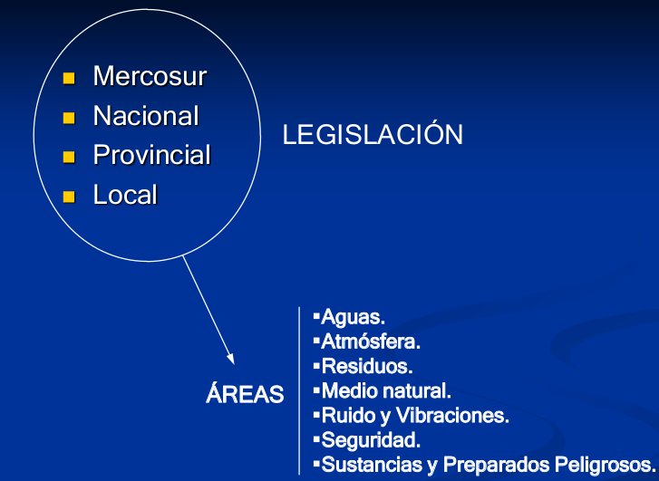

(?)

**Caracteristicas de los objetivos**

Los objetivos planteados en funcion de los compromisos asumidos en la politica ambiental deben tener ciertas caracteristicas:

- Deben conseguir una **mejora real** en la **actuación ambiental**
- Deben ser **consecuentes** con la **Política
Ambiental**
- Deben ser **realistas y razonables**
- Deben estar establecidos de acuerdo a los aspectos ambientales **significativos** de la actividad

**Posibles objetivos**

- **Reducción** de **residuos** y del **consumo de recursos**
- Reducción o **eliminación** de **emisiones contaminantes**
- **Rediseño** de **productos** para minimizar su impacto ambiental
- **Promoción** de la **concienciación** de los empleados y de la comunicación exterior

**Ejemplo de gestion de un objetivo**

Este es un **programa** para la gestion de producto.
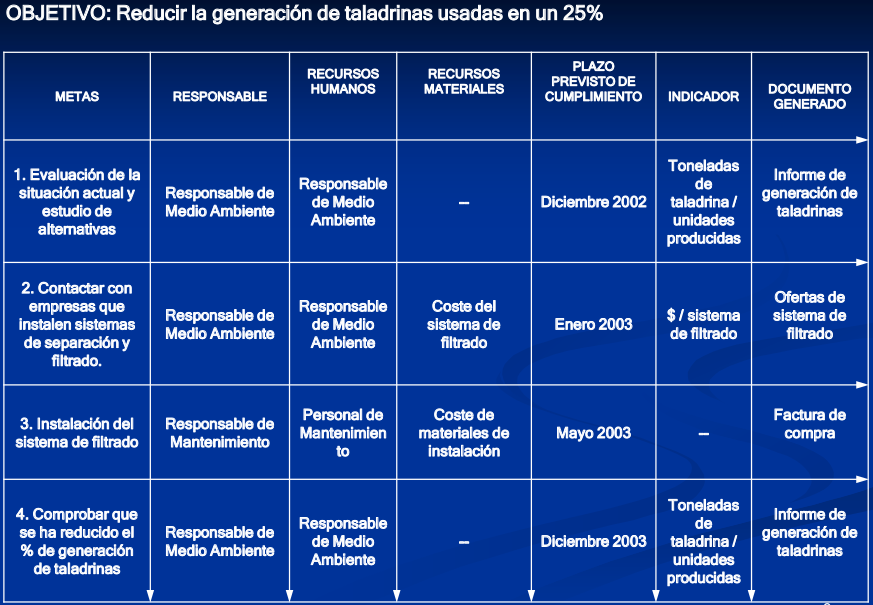

**Programa ambiental**

(Cuadro de arriba) Descripción documentada de las **responsabilidades** y los **medios** que la empresa destina a lograr los **objetivos** y **metas** medioambientales definidas en un **plazo establecido**. Dentro de esta descripcion se encuentra:
- ¿Quien?¿que?¿como?¿con que?¿cuando?
- Objetivos ambientales
- Metas
- Funciones y Responsabilidades
- Cronograma
- Medios necesarios
- Indicadores (si es posible)

**Estructura y responsabilidades**

La norma establece como requisito que se tiene que definir la estructura de la empresa (La norma no especifica como se define).  Ej:

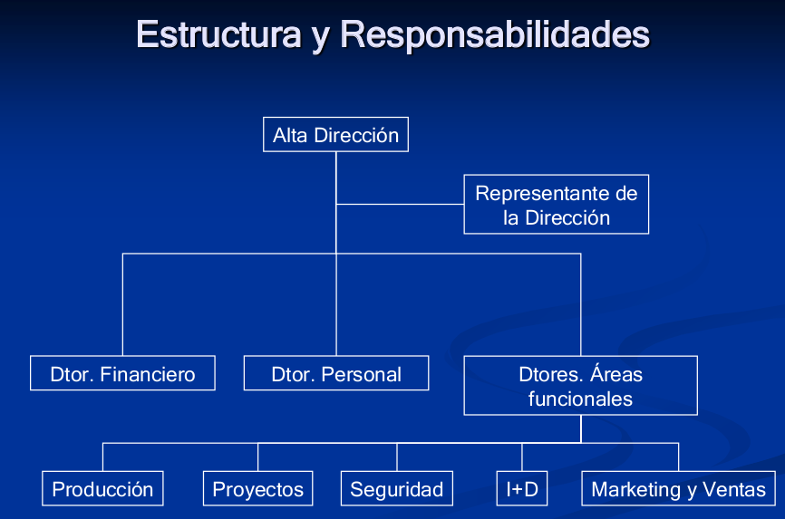

Cada sector tiene sus propias responsabilidades (Ver en power point).

**Documentacion del sistema**

Los procesos de documentacion son tan burocraticos como la empresa decida. Pero la norma pide que haya documentacion. Esta debe/ puede constar de

- **Manual de Gestión Ambiental** donde se plasma la política ambiental, se definen las responsabilidades y los objetivos, metas y programas.
- **Procedimientos e Instrucciones** Técnicas donde se describen cómo se realizan las distintas actividades de la empresa.
- **Otros documentos** como son los Planes de Auditorías, Planes de Formación, Programas, Normativa, etc.
- **Registros de incidentes**, quejas, etc.

Esta puede estar hecha sobre papel, o en formatos **word/pdf**.

Esta documentacion debe pasar por un proceso regular de **control**, actualizandose de ser necesario.

**Control operacional**

Gracias la documentacion identificamos y controlamos las operaciones y actividades de la empresa y nos focalizamos en los impactos ambientales mas significativos para trabajarlos. 

Esto lo hacemos tambien para prevenir situaciones de emergencia. Para esto se suele establecer un **programa de prevencion de riesgos** (Esto lo establece la norma)

**Seguimiento y medicion**

El proceso que llevamos a cabo para cumplir las metas ambientales propuestas por la propia empresa debe ser periodicamente revisado para verificar que estemos por el camino correcto.

Estos seguimientos constan de:

- Control y medición de las características clave de las operaciones y actividades con impacto significativo en el ambiente.
- Calibración y mantenimiento de equipos de inspección.
- Evaluación del cumplimiento de la legislación y reglamentación ambiental aplicable.
- Establecimiento y actualización de los procedimientos y registros pertinentes.

**Mal funcionamiento**

Luego de los seguimientos, puede que haya deficiencias en el sistema. estas pueden ser debido a deficiencias en el diseño, deficiencias en la implantación, deficiencias o fallos en la propia instalación, deficiencias o fallos en los equipos principales o auxiliares, errores humanos, etc.

En funcion de estas deficiencias tomamos acciones **preventivas** (prevenir que no pase de nuevo) y/o **correctoras**(Moderar los efectos negativos)

**Registros**

Los seguimientos junto con sus resultados deben estar registrados de manera precisa, legible e identificada con la actividad, producto o servicio implicado

**Auditoria**

Las auditorias son inspecciones, verificaciones realizadas por un auditor con el fin de comprobar si se cumple con lo esperado. Estas pueden ser: 

- Internas: Yo mismo verifico si todo anda bien
- Externas: Llamo a un auditor para verificar si todo anda bien, o para obtener/mantener/renovar la **certificacion**.

**Revision por direccion**

Luego de todo esto, la direccion realiza una revision final y en base a eso toma decisiones.

**Resumen**

**Proceso de certificacion**

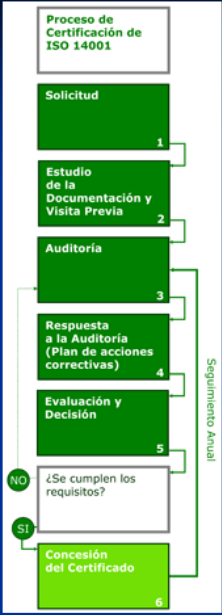

La empresa decide certificarse y solicita dicha certificacion. Junto con la solicitud, la empresa manda documentacion, que se estudia y se realiza una visita previa. Luego, se realiza una auditoria y en base a esta, la empresa realiza un plan de acciones correctivas. Si este plan cumple con los requisitos y es aprobado, se otorga la certificacion.

Esta certificacion dura 3 años, pero debe ser mantenida mediante un seguimiento anual.

## Produccion Mas Limpia (PML)

La **producción más limpia** es la aplicación continua de una **estrategia ambiental** **preventiva e integral**, a los procesos productivos, productos y servicios para incrementar la **eficiencia global** y reducir riesgos para los seres humanos y el ambiente.

La PML puede ser aplicada a los **procesos** empleados en **cualquier industria**, a los **productos** mismos y a los diferentes **servicios** prestados a la sociedad. 

Para empezar a implementar la PML, primero debemos **Identificar** **opciones** para **prevenir o reducir** la **generación de residuos** en fuente.

Para eso nos preguntamos:

1. Qué **clase** y qué **cantidad** de residuos están siendo generados?
2. Cuál es el **costo** relacionado con estos residuos?
3. **Dónde** exactamente se generan estos residuos?
4. **Por qué** se generan?
5. **Cómo pueden evitarse**?

La PML produce:

- **En los procesos productivos**: la PML conduce al **ahorro** de materias primas, agua y/o energía; a la **eliminación** de materias primas **tóxicas y peligrosas**; y a la reducción, en la fuente, de la **cantidad** y toxicidad de todas las **emisiones y desechos**, durante el proceso de producción.
- **En los productos**: la PML busca reducir los **impactos negativos** de los productos sobre el **ambiente**, la salud y la seguridad, durante todo su **ciclo de vida**, desde la extracción de las materias primas, pasando por la transformación y uso, hasta la disposición final del producto.
  
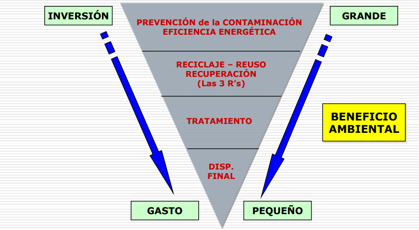

Mientras mas nos enfoquemos en la prevencion de los procesos productivos, mejor sera la inversion y mayor sera el beneficio ambiental que generaremos.

La PML se puede aplicar a cualquier tipo de organizacion. Ya sea a sus procesos, a los productos o a los servicios que esta brinde.

`Nota`: Un **residuo** es todo lo generado (solido, liquido, gaseoso, sonoro, etc.) que no es aprovechado y por lo tanto desechado.

**Beneficios para la empresa**

- Cumplimiento con la legislación
- Mejoras en la calidad del producto
- Mejora el desempeño ambiental
- Mejora la imagen de la empresa y producto 
- Reducción costos ambientales
- Nuevas oportunidades de mercado

Para **implementar** el PML, primero recolectamos los datos de la empresa.

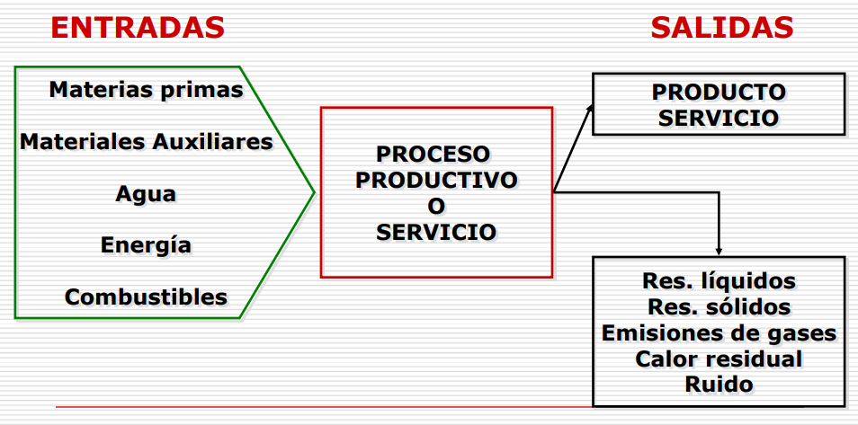

Luego analizamos el **proceso productivo**. nos preguntamos cuanta cantidad de desechos se producen, donde, porque, etc.

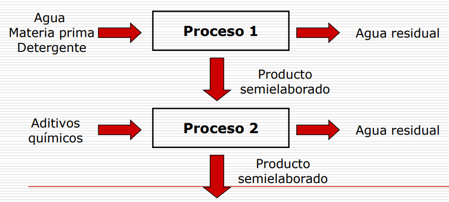

Luego generamos las opciones segun este diagrama:

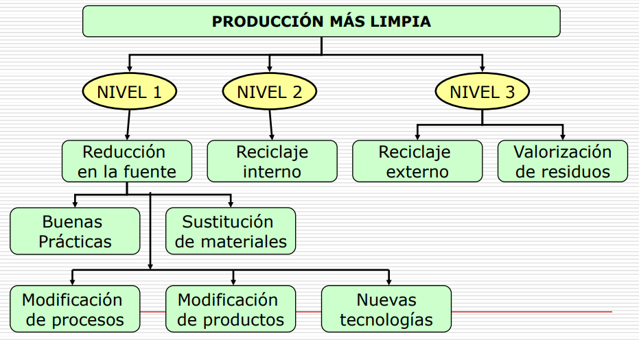

Se escogen las opciones mas viables y se implementan a travez del plan de accion ambiental.

Para un correcto desempeño del PML se debe tener un seguimiento y control del mismo que consta de:

- Control sistemático del cumplimiento del plan de acción ambiental.
- Evaluación de los beneficios obtenidos por su implementación.
- Análisis de los objetivos y metas ambientales.
- Evaluación de la contribución al mejoramiento del desempeño ambiental de la organización.

## Estudio del impacto ambiental

`EIA`: es un proceso de **análisis**, más o menos largo y complejo, encaminado a que los agentes implicados formen un **juicio previo**, lo más objetivo posible, sobre los **efectos ambientales** de una acción humana prevista (a la que se denomina **proyecto**) y sobre la posibilidad de **evitarlos**, **reducirlos** a niveles aceptables o **compensarlos**"

La ley es la que definen en que proyectos es necesarios un `EIA`.

Los impactos no necesariamente son ambientales (pueden ser culturales, quimicos, bioticos, socioeconomicos, etc) ni negativos.

En otras palabras, la `EIA` es:

- La `EIA` es un instrumento de **gestión pública**
- Es un **procedimiento administrativo**
- Como tal, trae implícita la capacidad de **establecer exigencias** y responsabilidades en los distintos niveles de gobierno
- Y también, sobre todo, de los sectores privados en su accionar con respecto al medio ambiente

A partir de estas conceptualizaciones se pone
de manifiesto que **cualquier actividad humana**
tiene **efectos** sobre el medio ambiente que
podrán ser positivos o negativos. 

Los problemas regionales que se generan a partir de estos impactos tienen repercusion con los problemas mundiales, y viceversa.

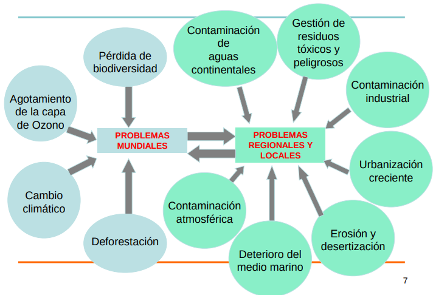

Al aplicar un `EIA` se debe estudiar:

1. La modificación de las características del medio.
2. La modificación de los valores o méritos, que hacen al mantenimiento o conservación de ese medio.
3. El significado ambiental que dichas modificaciones tienen en relación con la calidad de vida.

Este estudio se realiza analizando:

1. Los **síntomas** con que se expresa el efecto sobre el medio (contaminación, degradación de suelos, riesgos ambientales, etc.)
2. Las **causas** que originan el impacto (procesos productivos, irresponsabilidad de los actores sociales, insuficiente control, etc.)
3. Los **efectos** o repercusiones de los **síntomas** detectados (en los ecosistemas, en otras actividades, personas, etc.)
4. Los **agentes** implicados en las causas y los efectos.
5. La **sensibilización** de los actores implicados (administradores, población) para la prevención o corrección de las consecuencias de la acción desencadenante.
6. Las **capacidades** y **responsabilidades** de **intervención preventiva**, de control o compensatoria sobre causas y efectos.
7. Los **objetivos** a alcanzar en el tratamiento preventivo o correctivo (cómo hacerlo, para quién hacerlo, con quién hacerlo).

**Proceso de implementacion de un** `EIA`

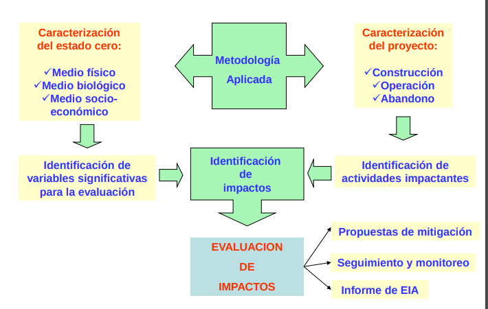

Mas profundidad en el PP

## Contaminacion ambiental

Es la presencia en el ambiente de uno o mas **contaminantes** que perjudique factores en dicho ambiente.

**Contaminante**: Sustancia quimica, biologica o radiologica en cualquier estado o forma que al encontrarse por encima de las concentraciones normales en algun elemento del medio ambiente, cambia su composicion natural.

Los contaminantes pueden ser (segun su naturaleza):
- Biologicos (microorganismos)
- Quimicos (organicos e inorganicos)
- Fisicos (Radiaciones, calor, solidos)

Las **fuentes** de contaminacion son aquellas **instalaciones**, **procesos** o **actividades** que provocan contaminación ambiental.

Estas pueden ser:
- Puntuales
- Difusas
- Segun su origen
  - Naturales
  - tecnologicas
  - agricolas
  - pecuarias
  - domesticas y municipales
- estacionarias
- moviles

### Tipos de contaminaciones

**Contaminacion del agua**

Puede provocar  efectos
adversos a la salud humana y a la calidad
ambiental de los ecosistemas asociados. Puede ser tanto al nivel superficial como subterraneo

**Contaminacion del aire**

emisión de sustancias peligrosas al aire, en una tasa que excede la capacidad de los procesos naturales para diluirlas. Se puede contaminar mediante solidos, liquidos, gaseosos y/o energicos

### Efecto invernadero

Aumento de la temperatura de la tierra, producido por la liberación de determinados gases a la atmósfera

Esto provoca:
- Cambios del clima
- Huracanes, inundaciones
- Elevación del nivel del mar
- Extinción de especies
- Desertificación y sequía

### Agotamiento de la capa de ozono

Debido a la emisión de gases que contienen cloro. esto genera un incremento de radiación  ltravioleta

### Lluvia acida

Cualquier forma de precipitación  cuya acidez es alta, debido a la absorción de contaminantes presentes en el aire. Esto genera:
- Disminución de pH en cuerpos de agua y suelos
- Corrosión de estructuras y edificaciones
- Desaparición de bosques
- Afectación a organismos acuáticos y terrestres

### Efectos de la contaminacion del aire

La contaminacion del aire afecta tanto a las personas como a los animales y a las plantas de muchas maneras distintas

### Efectos del ruido y vibraciones

estres, perdida de audicion, iriitabilidad, alteraciones del sistema nervioso, anulacion de reflejos, etc.

### Efectos de las radiaciones ionizantes

- desórdenes funcionales;
- inducción al cáncer;
- acortamiento de la vida;
- envejecimiento precoz;
- taras genéticas.

### Contaminacion de los suelos

Deterioro de las propiedades físicas, químicas y biológicas que experimentan los suelos, como resultado de la incorporación en su seno de diversas sustancias contaminantes.

Causas: 
- Prácticas agrícolas inadecuadas (aplicación de agroquímicos);
- Vertimientos de sustancias químicas;
- Descargas de residuales líquidos;
- Disposición de residuos sólidos;
- Actividad pecuaria;
- Fugas en nichos de confinamiento de desechos peligrosos.

Efectos:

-Pérdida de la capacidad productiva;
-desvalorización de terrenos;
- Afectaciones a la vegetación y a las poblaciones de microorganismos del suelo por la acumulación de contaminantes.
- Modificación de sus propiedades;
- acidificación;
- Contaminación con gérmenes patógenos;
- Afectaciones a la salud;
- Degradación paisajística.
