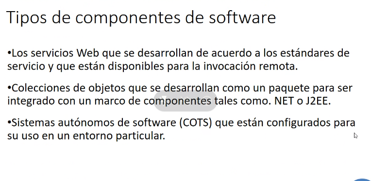

# Ingenieria de software

## Notas

* Estudiar los metodos de desarrollo de software en forma disciplinada y precisa.
* Se analiza todo lo relacionado a la gestion de proyectos de software.
* Se enfocan los estandares de calidad.

## Introduccion

La ingenieria de software es una **rama** de la **ingenieria** que aplica teorias, metodos y herramientas para el **desarrollo** de **sofware profesional**.

**¿Porque?**

* Economia suele depender de algun tipo de sofware.
* Cada vez mas sistemas incluyen sofware.
* Gasto en sofware representa una fraccion significativa en el PBI.
* Los errores de sofware suelen ser muy **caros** de **arreglar**.

La ingenieria de sofware tiene que ver con el desarrollo de software rentable. El mantenimiento del mismo es mucho mas costoso que su desarrollo.

`Nota: En un ciclo de vida de un sofware, el software empieza con la idea.`

`Nota: Un sofware para ser tal debe de estar documentado.`

Productos de sofware:
* **Productos Genericos** (El dueño de dicho sofware es el desarrollador del mismo)
* **Productos personalizados** (El dueño de dicho sofware es el cliente del mismo)

El buen software deben entregar al usuario la funcionalidad y desempeño requeridos y deben ser sustentables, confiables y utilizables.

Las actividades fundamentales de la ingenieria de software son la especificacion, desarrollo, validacion y evolucion del sofware.

La **ingenieria de software** es una disciplina de la ingenieria que se ocupa de todos los aspectos de la produccion de software desde las etapas mas iniciales de la especificacion del sistema hasta el mantenimiento del mismo despues de haber sido desplegado.

* **Disciplina**: Uso de teorias y metodos adecuados teniendo en cuenta las limitaciones financieras y de organizacion
* **Aspectos** de la **produccion** de **software**: No solo el desarrollo tecnico, sino todo el proceso en el ciclo de vida del software.

Actividades en el proceso de software:

* **Especificacion** del software: El cliente nos dice lo que hace falta.
* **Desarrollo** del software: (Autoexplicativo)
* **Validacion** del software: Se verifica la integridad del software
* **Evolucion** del software: Ya estando en operacion, mejoramos, agrandamos, arreglamos, o lo que sea necesario.

**Detalles** que afectan a la mayoria del software:
* **Heterogeneidad**: Los sistemas son cada vez mas grandes, con mas requerimientos, y abarcan mas ambitos.
* **Cambio empresarial** y **social**: A medida que avanza el tiempo, las necesidades de las empresas y las personas cambian, por lo que el software tambien deberia de cambiar para satisfacer dichas necesidades.
* **Sistemas embebidos** y de **control**.

## Procesos de software

Conjunto estructurado de actividades necesarias para desarrollar un sistema de software.
Todos los procesos implican:
* **Especificacion**
* **Diseño** e **implementacion**
* **Validacion** y **verificacion**
* **Evolucion**

Un **modelo** de **proceso** de **sofware** es una representacion abstracta de un proceso. Se presenta una descripcion de un proceso a partir de una perspectiva en particular.

Cuando describimos los procesos, hay que describir...

Procesos dirigidos por **plan** y por **procesos agiles**.

* Desarrollo dirigido por **plan**: Las planificaciones del proceso se planifican con antelacion y el progreso se mide en contra de este plan.
* **Procesos agiles**: La planificacion es **gradual** y es mas facil cambiar el proceso para reflejar los requisitos cambiantes de los clientes.

**No hay** procesos **correctos** o **incorrectos**. Es mas, en la mayoria de los procesos se suelen mezclar ambos procesos en distintas etapas. Pero si hay procesos mal o bien aplicados

**Modelos** de procesos de software:
* **Modelo de cascada**: Modelo sumamente estructurado y rigido (dirigido por plan) etapas y cronologia estrictamente definidas.
* **Desarrollo incremental**: las distintas etapas de desarrollo se intercalan. (puede ser plan o agil)
* **Ingenieria de sofware orientada a reutilizacion**: El sistema se ensambla a partir de componentes existentes.(?)

### Modelo de cascada

**Fases**:
* **Analisis de requerimientos**
* **Diseño y sistema de software**
* **Implementacion y pureba unitaria**
* **Integracion** y **prueba** del **sistema en general**
* **Operacion y mantenimiento**.

El principal inconveniente es acomodar el **cambio** luego de que el modelo se puso en marcha, sin mencionar que es **inflexible** (las necesidades de los clientes cambian con el tiempo). **Pocos sistemas** tienen **requisitos estables**

Este modelo se suele usar en **proyectos grandes** y desarrollados en **varios lugares a la vez**, ya que permite coordinar mejor el trabajo.

### Desarrollo incremental

**Beneficios**:
* Costo de atender las necesidades cambiantes del cliente es menor.
* Es mas facil obtener retroalimentacion de los clientes en mitad del desarrollo.
* Entrega y despliegue de software en menor tiempo.

**Contras**

El proceso no es facilmente visible.

La estructura del sistema tiende a degradarse a medida que se añaden nuevos documentos.

A medida que se añaden funcionalidades, se hace mas dificil terminar el proyecto en el tiempo acordado.

### Ingenieria de software orientado a la reutilizacion

Se basa en la reutilizacion sistematica de codigo.

**Etapas**
* Analisis de requerimientos
* Analisis de componentes ya desarrollados
* Modificacion de requerimientos (Ver si podemos utilizar los componentes ya desarrollados para satisfacer los requerimientos de este proyect)
* Configuracion del sistema con la reutilizacion
* Desarrollo e integracion

Ahora se suele reutilizar mucho en la construccion de muchos tipos de sistemas.

# TODO
