# Ingenieria de software

## Notas

* Estudiar los metodos de desarrollo de software en forma disciplinada y precisa.
* Se analiza todo lo relacionado a la gestion de proyectos de software.
* Se enfocan los estandares de calidad.

## Introduccion

La ingenieria de software es una **rama** de la **ingenieria** que aplica teorias, metodos y herramientas para el **desarrollo** de **sofware profesional**.

**¿Porque?**

* Economia suele depender de algun tipo de sofware.
* Cada vez mas sistemas incluyen sofware.
* Gasto en sofware representa una fraccion significativa en el PBI.
* Los errores de sofware suelen ser muy **caros** de **arreglar**.

La ingenieria de sofware tiene que ver con el desarrollo de software rentable. El mantenimiento del mismo es mucho mas costoso que su desarrollo.

`Nota: En un ciclo de vida de un sofware, el software empieza con la idea.`

`Nota: Un sofware para ser tal debe de estar documentado.`

Productos de sofware:
* **Productos Genericos** (El dueño de dicho sofware es el desarrollador del mismo)
* **Productos personalizados** (El dueño de dicho sofware es el cliente del mismo)

El buen software deben entregar al usuario la funcionalidad y desempeño requeridos y deben ser sustentables, confiables y utilizables.

Las actividades fundamentales de la ingenieria de software son la especificacion, desarrollo, validacion y evolucion del sofware.

La **ingenieria de software** es una disciplina de la ingenieria que se ocupa de todos los aspectos de la produccion de software desde las etapas mas iniciales de la especificacion del sistema hasta el mantenimiento del mismo despues de haber sido desplegado.

* **Disciplina**: Uso de teorias y metodos adecuados teniendo en cuenta las limitaciones financieras y de organizacion
* **Aspectos** de la **produccion** de **software**: No solo el desarrollo tecnico, sino todo el proceso en el ciclo de vida del software.

Actividades en el proceso de software:

* **Especificacion** del software: El cliente nos dice lo que hace falta.
* **Desarrollo** del software: (Autoexplicativo)
* **Validacion** del software: Se verifica la integridad del software
* **Evolucion** del software: Ya estando en operacion, mejoramos, agrandamos, arreglamos, o lo que sea necesario.

**Detalles** que afectan a la mayoria del software:
* **Heterogeneidad**: Los sistemas son cada vez mas grandes, con mas requerimientos, y abarcan mas ambitos.
* **Cambio empresarial** y **social**: A medida que avanza el tiempo, las necesidades de las empresas y las personas cambian, por lo que el software tambien deberia de cambiar para satisfacer dichas necesidades.
* **Sistemas embebidos** y de **control**.

## Procesos de software

Conjunto estructurado de actividades necesarias para desarrollar un sistema de software.
Todos los procesos implican:
* **Especificacion**
* **Diseño** e **implementacion**
* **Validacion** y **verificacion**
* **Evolucion**

Un **modelo** de **proceso** de **sofware** es una representacion abstracta de un proceso. Se presenta una descripcion de un proceso a partir de una perspectiva en particular.

Cuando describimos los procesos, hay que describir...

Procesos dirigidos por **plan** y por **procesos agiles**.

* Desarrollo dirigido por **plan**: Las planificaciones del proceso se planifican con antelacion y el progreso se mide en contra de este plan.
* **Procesos agiles**: La planificacion es **gradual** y es mas facil cambiar el proceso para reflejar los requisitos cambiantes de los clientes.

**No hay** procesos **correctos** o **incorrectos**. Es mas, en la mayoria de los procesos se suelen mezclar ambos procesos en distintas etapas. Pero si hay procesos mal o bien aplicados

**Modelos** de procesos de software:
* **Modelo de cascada**: Modelo sumamente estructurado y rigido (dirigido por plan) etapas y cronologia estrictamente definidas.
* **Desarrollo incremental**: las distintas etapas de desarrollo se intercalan. (puede ser plan o agil)
* **Ingenieria de sofware orientada a reutilizacion**: El sistema se ensambla a partir de componentes existentes.(?)

### Modelo de cascada

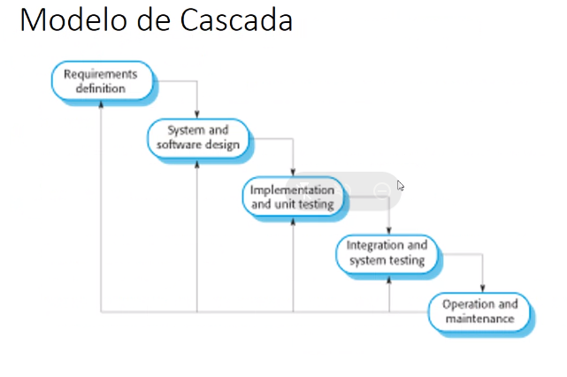

**Fases**:
* **Analisis de requerimientos**
* **Diseño y sistema de software**
* **Implementacion y pureba unitaria**
* **Integracion** y **prueba** del **sistema en general**
* **Operacion y mantenimiento**.

El principal inconveniente es acomodar el **cambio** luego de que el modelo se puso en marcha, sin mencionar que es **inflexible** (las necesidades de los clientes cambian con el tiempo). **Pocos sistemas** tienen **requisitos estables**

Este modelo se suele usar en **proyectos grandes** y desarrollados en **varios lugares a la vez**, ya que permite coordinar mejor el trabajo.

### Desarrollo incremental

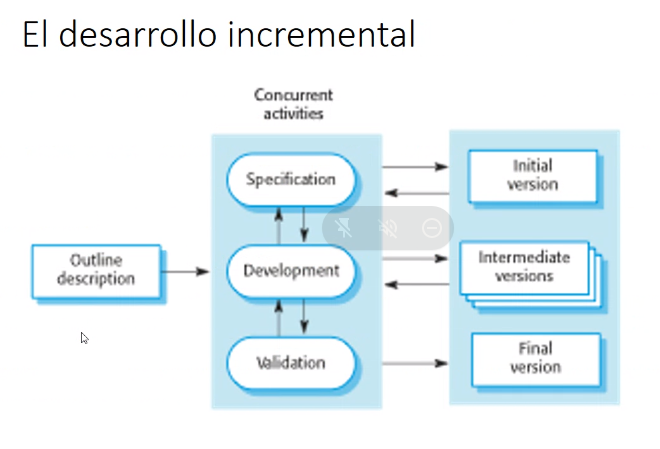

**Beneficios**:
* Costo de atender las necesidades cambiantes del cliente es menor.
* Es mas facil obtener retroalimentacion de los clientes en mitad del desarrollo.
* Entrega y despliegue de software en menor tiempo.

**Contras**

El proceso no es facilmente visible.

La estructura del sistema tiende a degradarse a medida que se añaden nuevos documentos.

A medida que se añaden funcionalidades, se hace mas dificil terminar el proyecto en el tiempo acordado.

### Ingenieria de software orientado a la reutilizacion

Se basa en la reutilizacion sistematica de codigo.

**Etapas**
* Analisis de requerimientos
* Analisis de componentes ya desarrollados
* Modificacion de requerimientos (Ver si podemos utilizar los componentes ya desarrollados para satisfacer los requerimientos de este proyect)
* Configuracion del sistema con la reutilizacion
* Desarrollo e integracion

Ahora se suele reutilizar mucho en la construccion de muchos tipos de sistemas.

## Especificaciones de software

Poder determinar para que va a servir, cuales son las necesidades que este producto de software va a requerir.

Es importante determinar no solamente las **funcionalidades** que debe **brindar** el sistema sino tambien sus **limites**.

Esta etapa se llama **ingenieria** de **requisitos** o **requerimientos**. y tiene **subetapas**:

* **Estudio de factibilidad**: Es factible construir el sistema? Tecnologica y financieramente es posible llevar a cabo el producto? es rentable?
* **Requerimientos, obtención y análisis**: Especificar los servicios que el sistema debe proveer. ¿Que requieren los actores del sistema? (**OJO!** Preguntar a **TODOS** los actores involucrados en el sistema a desarrollar)
* **Especificacion de requerimientos**
* **Validacion de los requerimientos**

## Diseño de software e implementacion

En esta etapa se analizan cosas para llegar a producir el producto. En esta etapa no se genera el producto, pero se va yendo a cosas concretas, se van pensando mas cosas tecnicas.

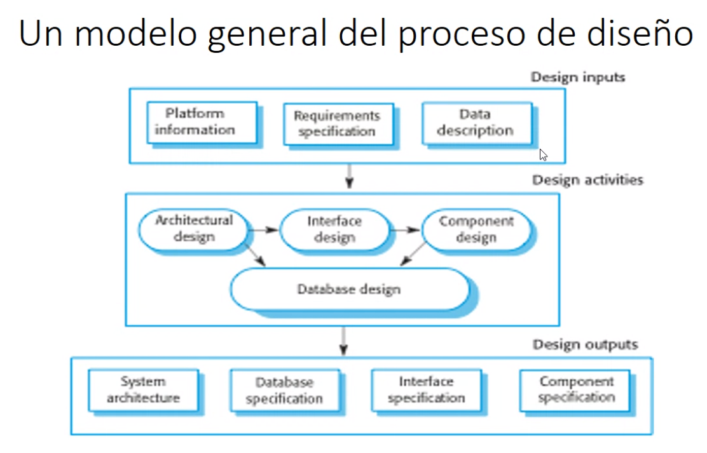

## Validacion y verificacion

Se ve si el sistema cumple con los requerimientos que el cliente pidio en un principio.

**Revision**

Se revisa cualquier cosa del proyecto.

**Pruebas**

* Pruebas de componentes
* Pruebas del sistema
* Pruebas de aceptacion

## Evolucion del software

Estar atento ante cualquier cambio en el ambiente en el que el producto de desarrolla. Un producto de software no termina al finalizar su desarrollo.

## Problema de cambio

El cambio es inevitable en todos los grandes proyecos de software. Esto conduce a requisitos nuevos y modificaciones. Las especificaciones del producto va cambiando.

Para reducir los costos de estos cambios, se pueden tomar las siguientes alternativas:

* **Evitar el cambio**: Anticiparse a posibles cambios para evitar el trabajo.
* **Tolerancia al cambio**: Diseñar el software de tal manera de poder enfrentar posibles cambios con el menor costo posible

## Software prototipado

Version inicial de un sistema que se utiliza para demonstrar conceptos y probar opciones de diseño (Mockup). Esto acerca al cliente al producto a desarrollar y podemos obtener requisitos de manera mucho mas precisa.

## Desarrollo Agil de software

`Nota: Manifiesto agil, documento con el que se empezo a pensar procedimiento de desarrollo agiles`

Este tipo de desarrollo tiene ciertos principios:

* **Participacion del cliente**: el cliente debe ser parte del edsarrollo interviniendo estrechamente durante el proceso de desarrollo.
* **Entrega incremental**: Se separa el proyecto en funcionalidades y se va entregando dichas funcionalidades periodicamente, agregando en cada iteracion nuevas funcionalidades.
* **Personas no procesos**: Las personas cooperan y trabajan en conjunto para concretar un desarrollo. son un EQUIPO no un GRUPO. Cada persona tiene sus intereses y talentos, y hay que saber aprovechar estos al maximo.
* **Adoptar el cambio**: Diseñar el sistema para adoptar los cambios. Ademas, dicho cambio sera tomado en cuenta como incremento del proyecto.
* **Mantener la simplicidad**: Escribir codigo simple y refactorizado.

Siguiendo estos principios y aplicando metodologias agiles, podriamos obtener proyectos de alta calidad en tiempos mucho mas cortos y con precios mas bajos.

**Aplicabilidad del metodo agil**

* Desarrollo de productos pequeños o medianos.
* Desarrollo de sistemas a medida en donde hay u claro compromiso por parte del cliente para participar en el proceso de desarrollo.
* Enfoque en pequeños equipos (?)

**Problemas de las metodologias agiles**

* Dificil mantener el interes de los clientes
* Los miembros deben de estar comprometidos para participar de manera intensa
* Priorizar cambios puede ser dificil donde hay multiples partes interesadas.
* Mantener simplicidad requiere un trabajo extra
* Contratos pueden ser un problema

**Mantenimiento de software**

Los metodos agiles se pueden implementar en la etapa de mantenimiento. Sin embargo se presentan un problema:

Al hacer enfasis en la minimizacion de la documentacion puede resultar dificultoso el labor de mantenimiento

**Plan VS. Agil**

No son opuestos. Las empresas pueden implementar ambos en un proyecto. El uso de uno o el otro depende de muchos factores como el tamaño de los equipos, entre otras cosas.

**Extreme programming**

Ejemplo: **scrum**

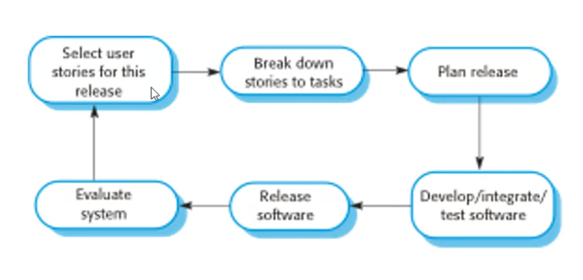

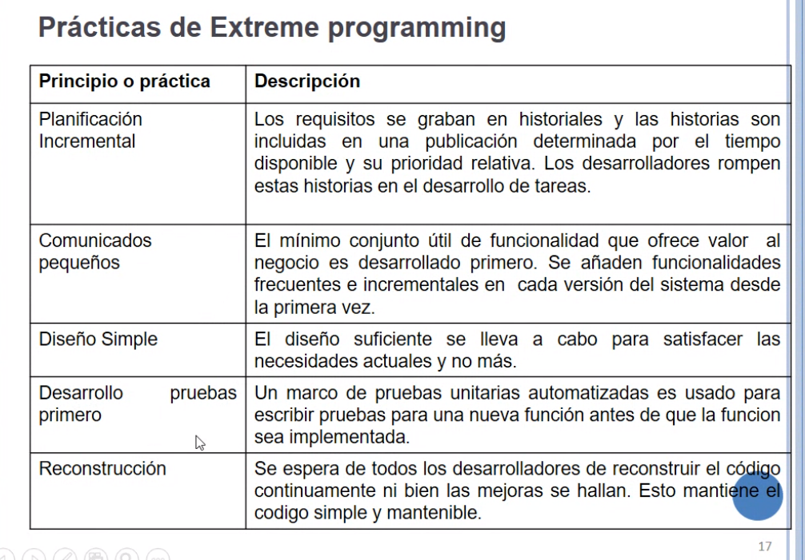

**Historia de usuario**:

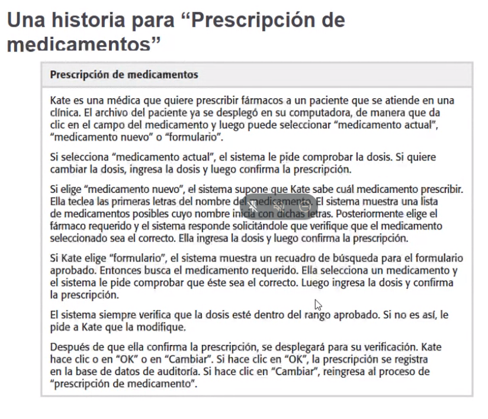
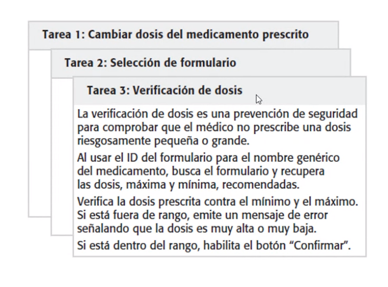

**Proceso de scrum**

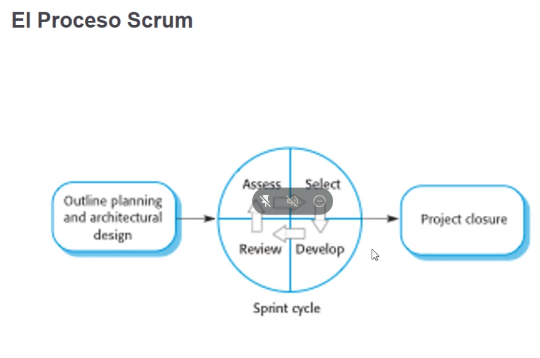

## Ingenieria de requerimientos

Proceso en el que se describen las funcionalidades y limitaciones del sistema en cuestion.

Un requerimiento es una declaracion abstractade un servicio o de una restriccion del sistema a una especifcacion funcional matematica detallada.

Los requisitos pueden ser ambiguos.
* Debe estar abierto a la interpretacion
* Debe estar definido con detalle
* Estas declaraciones pueden ser llamados requerimientos

**Tipos de requerimientos**

* **Requerimientos no funcionales**: Limitaciones de las funcionalidades que ofrece el sistema (restricciones de tiempo, proceso de desarrollo, normas, etc.)
* **Requerimientos funcionales**: define las funcionalidades que el sistema debe proveer
    * **Requerimientos del usuario**: Deben ser escritos en lenguaje natural, para que el cliente lo entienda.
    * **Requerimientos del sistema**: Documento estructurado que establece las descripciones detalladas de las funcionalidades del sisetma. Define todo lo que debe ser implementado asi que puede ser parte de un documento entre el cliente y el desarrollador.

**Ejemplo**:
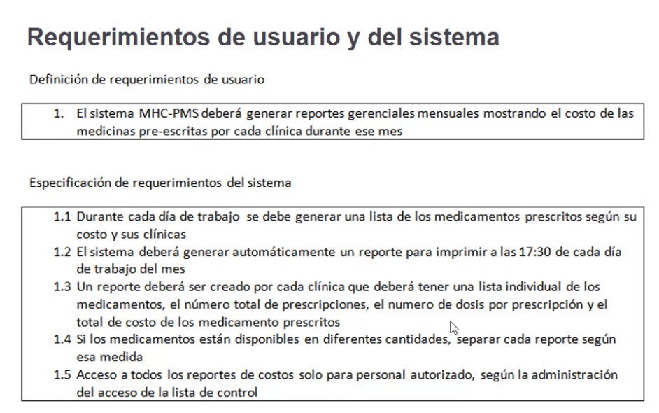

Los requerimientos no funcionales  pueden tener distintas causas / clasificaciones

**Requerimientos del producto**
* Ejecucion / velocidad / fiabilidad, etc. Son requerimientos que especifican que el rpoducto entregado debe comportarse de una manera particular

**Requerimientos organizacionales**
*  Consecuencia de politicas y procedimientos organizacionales, ej: estandares de procesos, requisitos de implementacion (usar un SGBD en especifico), etc.

**Requerimientos externos**
* Por ejemplo, restricciones legales.

Si alguno de estos requerimientos no se cumplen, el sistema es inutil

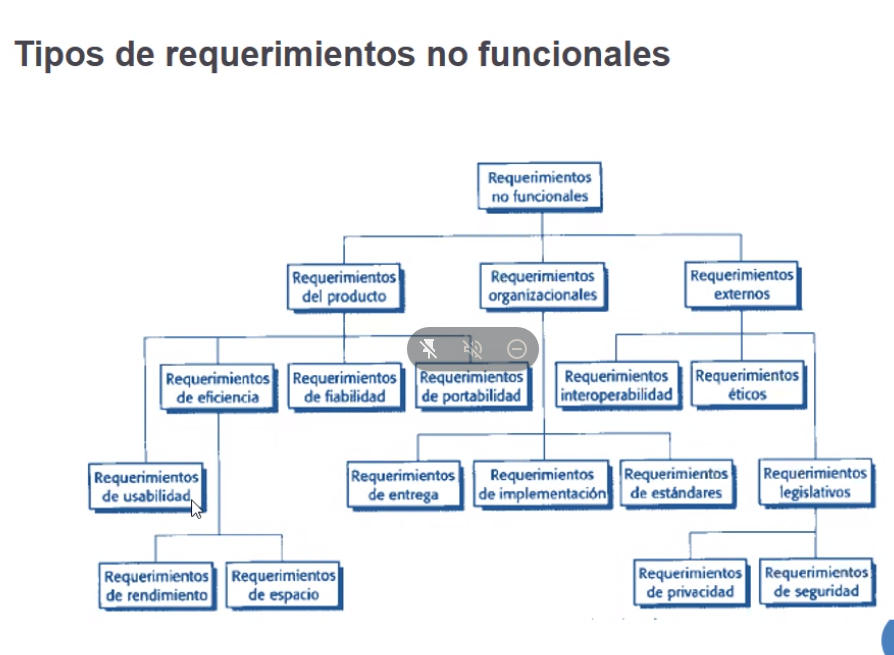

Los requerimientos no funcionales pueden ser muy dificiles de explicar y requerimientos imprecisos o ambiguos pueden ser muy dificiles de verificar.

Para resolver la hipotetica ambiguedad en estos requerimientos, se suelen aplicar metricas a cada tipo de propiedad.

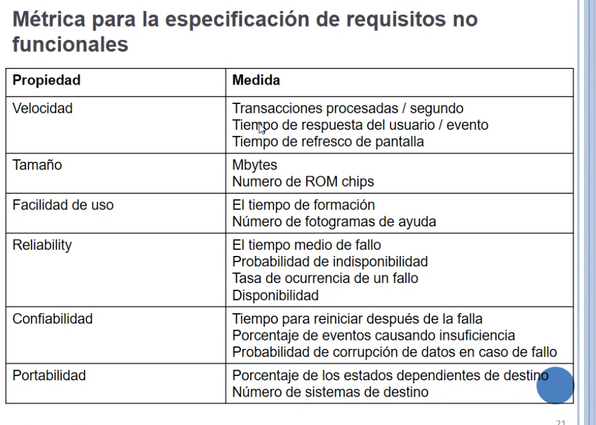

**Requerimientos del dominio**

Son los requerimientos del dominio sobre el cual se esta trabajando.

Estos requerimientos se expresan en el lenguaje del dominio en cuestion, por lo que puede ser dificil de entender por los programadores.

### Documento de requerimientos de software

Declaración oficial de lo que se requiere de los desarrolladores del sistema. Este debe incluir tanto una de finicion de los requisistos del usuario y una especificación de los requisitos del sistema.

Este documento **NO** es un documento de //. Se establece QUE es lo que el sistema debe hacer y NO COMO es que debe hacerlo,

En las metodologias planificadas, este documento es muy importante. Sin embargo, en los metodos agiles se argumenta que la elaboración de este documento es una perdida de tiempo, ya que los requerimientos cambian constantemente.

En metodos agiles, se suelen usar requisitos express como "historias de usuario"

**Usuarios de un documento de requerimientos**

La info dentro de un documento de requerimientos depende del sistema elaborado. Sin embargo, su estructura puede seguir un estandar definido por la IEEE. Una estructura tipo es la siguiente:

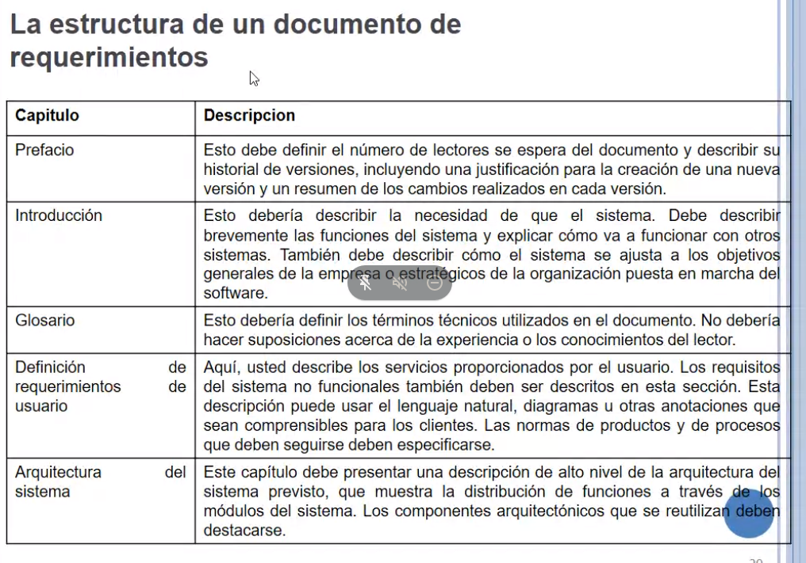
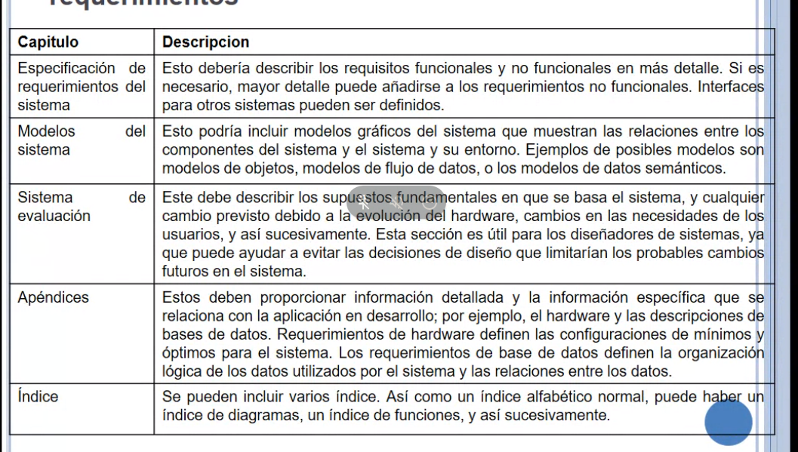

**Especificacion de requerimientos**

Proceso de escribir los requerimientos del sistema del usuairo y en un documento de requisitos.

**Maneras de escibir una especificacion de requerimientos del sistema**:

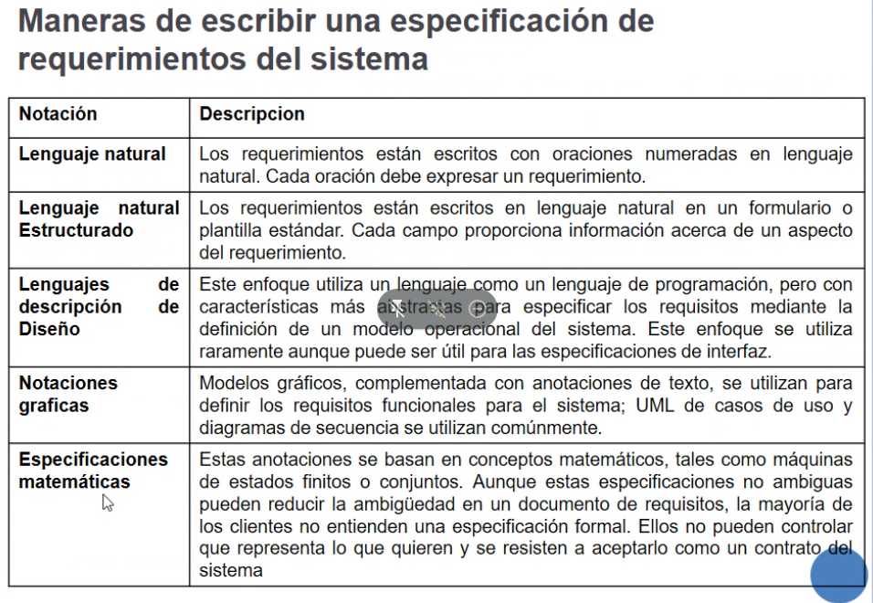

El lenguaje natural es muy ambiguo y poco claro. Da pie a la confusion y fusion de requerimientos.

Para quitar esta ambiguedad, se suele pasar a un lenguaje tecnico casi pseudocodigo.

Procesos de ingenieria de requerimientos:

* Obtener requerimientos (entrevistas)
* Analisar requerimientos
* Validar requerimientos
* Gestionar requerimientos

Estos procesos se realizan de manera iterativa:

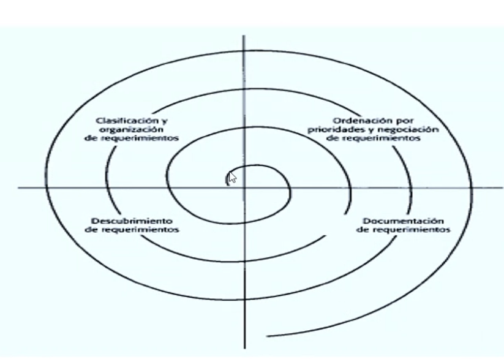

Estos procesos involucran tanto al personal tecnico como a usuarios finales, gerentes, ingenieros, expertos del dominio, etc. Estos se llaman **partes interesadas**.

Algunos de los problemas con el analisis de requerimientos:
* Los interesados no saben expresar lo que quieren
* Las partes interesadas expresan los requisitos en sus propios terminos
* Las diferentes partes interesadas pueden tener requisitos contradictorios
* Factores organizativos y politicos pueden  influir en requisitos del sistema
* Los requisitos cambian durante el proceso de analisis

**Descubrimiento de los requerimientos**

Una de las principales tecnicas es el proceso de **entrevistas**. Hay que hacer preguntas, o por lo menos tener en cuenta a todas las personas involucradas en el sistema a realizar.

Las entrevistas son encontrarse con los interesados y hablar con ellos para determinar sus necesidades. Estas pueden ser **formales** o **informales**, **abiertas** (el cliente explica lo que necesita a los ingenieros) o **cerradas** (los ingenieros hacen preguntas que los clientes responden)

Hay que tener en cuenta que los tecnicos / ingenieros no son expertos en el dominio en el que el sistema se va a desenvolver.

Para hacer las entrevistas mas llevaderas, en ellas se desarrollan **escenarios** que son un relato o un caso hipotetico en el que el sistema se utilizara.

**Casos de uso**

Tecnica basada en escenarios en UML que permiten identificar a los actores en una misma interaccion y que describen la interaccion misma.

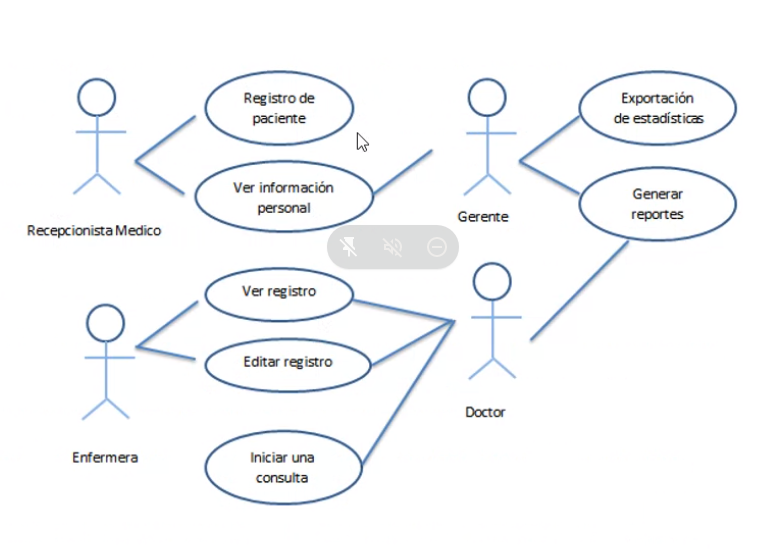

**Etnografia**

Tecnica de observación que se usa para entender los procesos operacionales y ayudar a derivar requierimientos de apoyo para dichos procesos

Consiste en ver como se realiza el proceso en el cual el sistema se va a basar para verificar requerimientos

**Validación de los requerimientos**

Proceso de verificar que los requerimientos definan realmente el sistema que requiere el cliente. Los requerimientos deben pasar las siguientes comprobaciónes:

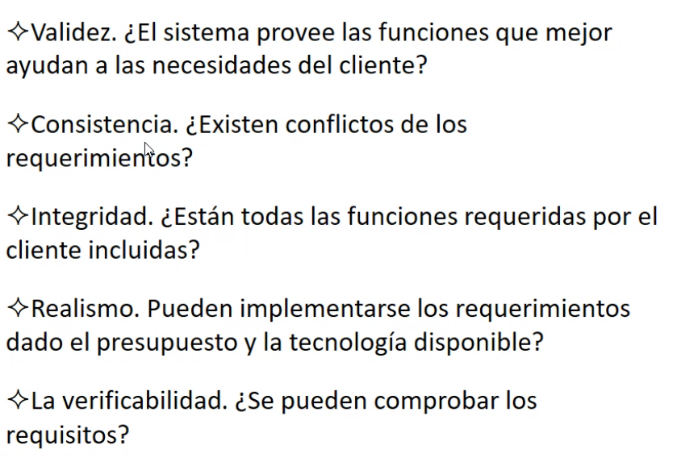
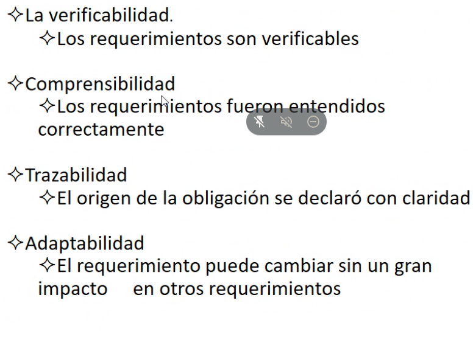
Tecnicas de validación de requerimientos

* **Criticas de requerimientos**: Analisis manual sistematico de los requerimientos. Se hacen revisiones periodicas
* **Prototipado**: Utilizando un modelo ejecutable del sistema para comprobar requerimientos (Mockup)
* **Generación de test**: Desarrollo de las prubebas de requerimientos para comprobar la capacidad de prueba.

## Usabilidad

Facilidad con la que las personas pueden usar una herramienta particular fabricado por personas con el fin de alcanzar un objetivo.

En general, la usabilidad es la cualidad que tiene un sistema por la cual permite a sus usuarios alcanzar objetivos con **efectividad, eficiencia y satisfacción**.

Es muy dificil medir la usabilididad (es muy relativo). Por lo que se puede medir a partir de pruebas **empiricas** y **relativas**

### Principios de la usabilidad:

* **Facilidad de aprendizaje** (predicibilidad, sintetizacion, familiaridad, consistencia)
* **Facilidad de uso** (Eficacia, eficiencia)
* **Flexibilidad** (Variedad de posibilidades con las que el usuario y el sistema pueden intercambiar info, ctrl+z)
* **Robustez** (Nivel de apoyo al usuario que facilita el cumplimiento de sus objetivos)

La usabilidad es un atributo de **calidad** de producto, dependiendo de los usuarios, tareas y contexto, mide:

* Facilidad de aprendizaje
* Eficiencia motriz y cognitiva
* Capacidad de recordad lo aprendido
* Manejo de errores
* Satisfacción subjetiva

### Diseño centrado en el usuario

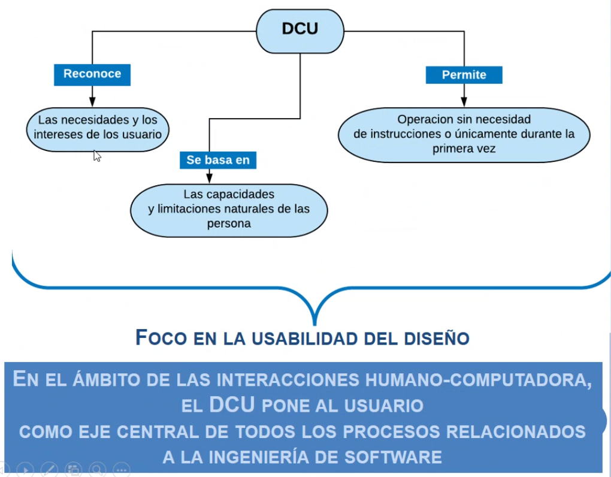

**Objetivos**

* Satisfacer las necesidades de todos los usuarios potenciales
* Adaptar la tecnologia usada a las expectativas de los usuarios
* Crear interfaces que faciliten la consecución de los objetivos de los usuarios.

**Fases**
* **Entender y especificar el contexto de uso**: Identificar a las personas a las que se dirige el producto, para que lo usaran y en que condiciones.
* **Especificar requisitos**: Identificar los objetivos del usuairo y del proveedor del producto a satisfacer.
* **Producir soluciones de diseño**:  Producir soluciones conceptuales, usando tecnicas y herramientas de prototupado
* **Evaluar**

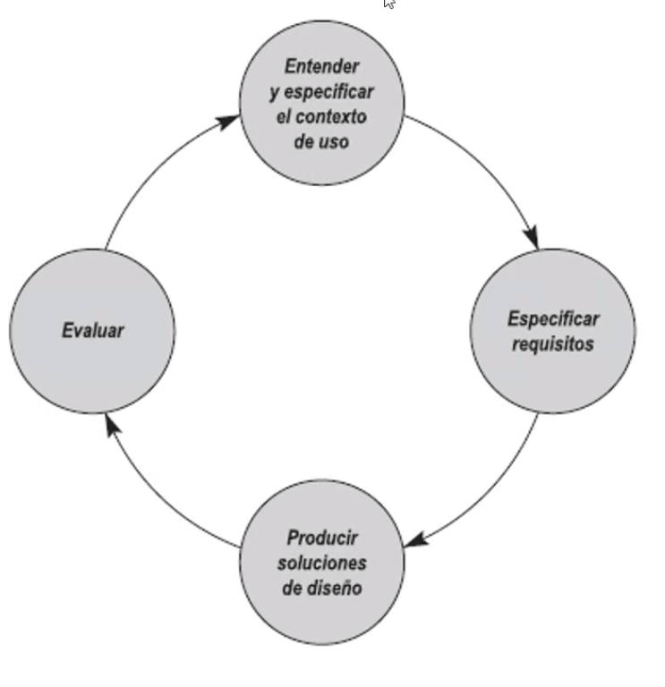

**Beneficios**

* **Aumento de la productividad**
* **Reduccion de errores**
* **Menor capacitacion y entrenamiento**
* **Aceptacion** (IMPORTANTE)

**Principios basicos de la DCU (?)**

* **Participacion activa de los usuarios**
* **Iteracion en el diseño** (Recibir retroalimentacion)
* **Utilizar un equipo multidiciplinario**

### Identificacion de los usuarios

* **usuarios primarios**: Van a usar el producto diariamente
* **usuarios secundarios**: Lo usan eventualmente o a travez de un intermediario
* **usuarios terciarios**: Se ven afectados por el uso del mismo

Para que un producto sea exitoso, se deben tener en cuenta a todos los tipos usuarios

**Prototipado**

Deben ser rapidamente elaborados y desechados. (dibujos en papel y lapiz --> mockups)

### Proceso de evaluacion

A medida que se avanza en el proceso de diseño, los prototipos pueden ser probados por los usuarios ya que ayudan a medir:

* **Eficacia**
* **Facilidad de aprendizaje**
* **Eficiencia**
* **Cualidad de ser recordado** (las operaciones del sistema)
* **Tasa de errores de usuario**
* **Satisfaccion subjetivo**

Para realizar esta evaluacion se realizan pruebas de usabilidad

**pruebas de usabilidad**

Se utilizan metodologias que requieren la participacion de usuarios reales. Los tipos de pruebas son:

* **Investigación etnografica**: Se observa a los usuarios en el lugar donde se utiliza el sistema para recopilar datos.
* **Diseño participativo**
* **Grupos focales**
* **Entrevistas**
* **Card sorting**

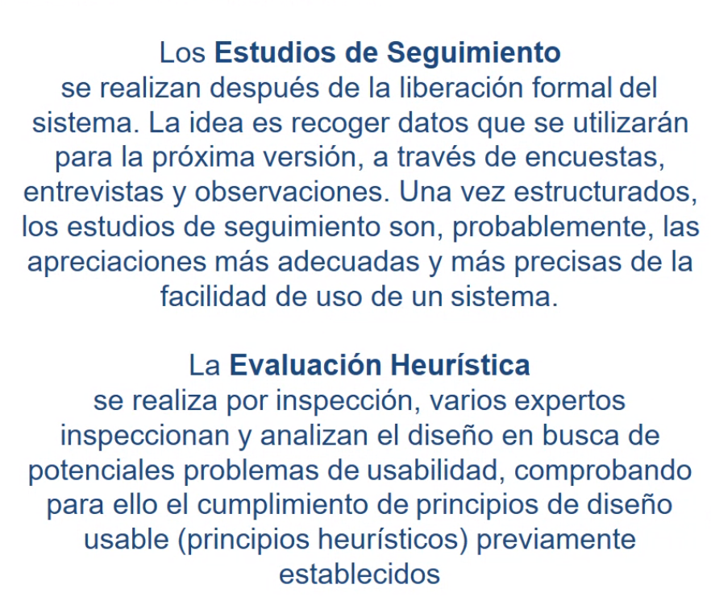

## Ocho reglas de oro de Shneiderman

1. **Consistencia**: Es importante el uso de iconos, colores, botones, etc. que sean familiares.
2. **Permitir que lo usuarios frecuentes usen atajos**: Permitir formas mas rapidas de hacer tareas.
3. **Retroalimentacion informativa**: Los usuarios deben saber donde estan y que es lo que estan hacviendo todo el tiempo. Cada accion debe tener una retroalimentacion legible y razonable
4. **Diseñar textos de dialogo para cerrar procesos**: Los usuarios deben saber cual ha sido el resultado de sus acciones.
5. **Manejo de errores**: Ofrecer una forma sencilla de corregir errores.
6. **Permitir deshacer operaciones**: Ofrecer formas de retroceder o revertir acciones
7. **Fomentar la sensacion de control**: Permitir que el usuario sea el que inicia las cosas.
8. **Reducir la carga de memoria a corto plazo**: Interfaz sencilla y con una jerarquia de informacion evidente.

## Los diez principios

1. **Visibilidad del estado del sistema**: Mantener a los usuarios informados sobre lo que ocurre.
2. **Consistencia entre el sistema y mundo real**: El sistema debe hablar el mismo lenguaje que el usuario.
3. **Control y libertad del usuario**: Ofrecer soporte para deshacer y rehacer acciones.
4. **Consistencia y estandares**: Se deben usar los mismos terminos/colores/iconos para indicar las mismas cosas
5. **Prevencion de errores**
6. **Reconocer es mejor que recordar**
7. **Flexibilidad y eficiencia de uso**: Atajos
8. **Diseño estetico y minimalista**: Solo contener la informacion importante, disminuyendo la visibilidad relativa
9. **Ayudar a reconocer, diagnosticar y recuperarse de errores**: Mensajes de error simples
10. **Ayuda y documentacion**: Proveer al usuario de ayuda y documentacion.

**Agregados PIEROTTI**

11. **Habilidades**: Incentivar las habilidades y experiencia del usuario
12. **Interaccion placentera respetuosa**: Favorecer la calidad del vida del usuario mediante una interaccion con un diseño estetico
13. **Privacidad**: Proteger la informacion privada del usuario.

## Modelado de sistemas

Proceso de elaboracion de modelos abstractos de un sistema, con cada modelo que presenta una vista o perspectiva diferente de ese sistema.

Se representa mediante algún tipo de notación gráfica, casi siempre basada en UML

Este proceso esta complementado por 4 perspectivas que nos permiten ver el sistema de distintas formas:

* **Perspectiva externa**: se modela el contexto o entorno del sistema
* **Perspectiva de interaccion**: Se modelan las interacciones entre un sistema y su entorno
* **Perspectiva estructural**: Se modela la organizacion de un sistema o la estructura de los datos procesados por el mismo.
* **Perspectiva conductal**: se modela el comportamiento dinamico del sistema y la forma en que responde a los eventos.

**Tipos de diagramas UML**

Hay muchos tipos de subestandandares UML, en este caso solo vamos a ver los mas usados:

* **Diagrama de actividad**: Muestran las actividades involucradas en un proceso.
* **Diagrama de casos de uso**: Muestran interacciones entre un sistema y su entorno.
* **Diagramas de secuencia**: muestran las interacciones entre los actores, el sistema y entre los componentes del sistema
* **Diagramas de clases**: Muestran las clases de objetos en el sistema y las asociaciones entre estas clases.
* **Diagramas de estado**: Muestran como el sistema reacciona a los acontecimientos internos y externos

El modelado se hace usando modelos graficos ya que es muy facil, simple, y ya que son modelos estandarizados todos entienden lo que se esta plantando.

### Modelos de contexto

Muestran el entorno o donde se va a usar el sistema. Estos modelos definen los **limites** del sistema

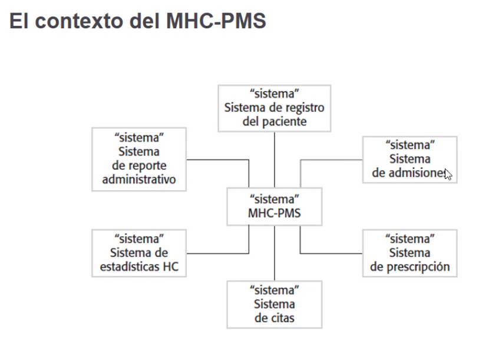

### Modelos de proceso

Como un workflow

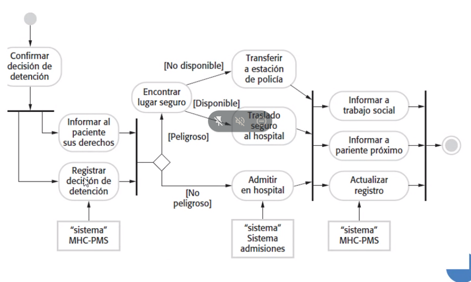

### Modelos de interaccion

Diagrama de caso de uso

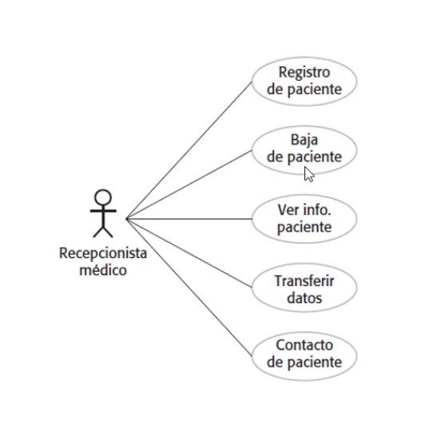

Diagrama de secuencia

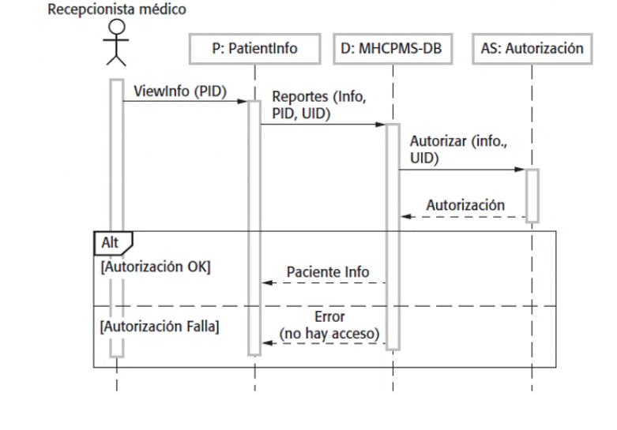

### Modelos estructurales

Muestran la organizacion de un sistema en fucnion de los componentes que conforman este sistema y sus relaciones. Estos modelos son estaticos.

**Diagramas de clases**

Se utilizan en el desarrollo de un modelo de sistema orientado a objetos.

Tenemos atributos, metodos y relaciones.

### Modelos de comportamiento

Modelos del comportamiento dinamico (Muestra las situaciones del sistema a medida que determinadas cosas van sucediendo) de un sistema, cuando se esta ejecutando.

Los estimulos pueden ser datos o eventos

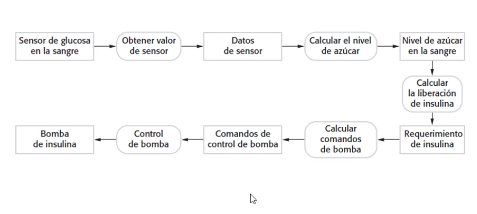

**Diagrama de estados**

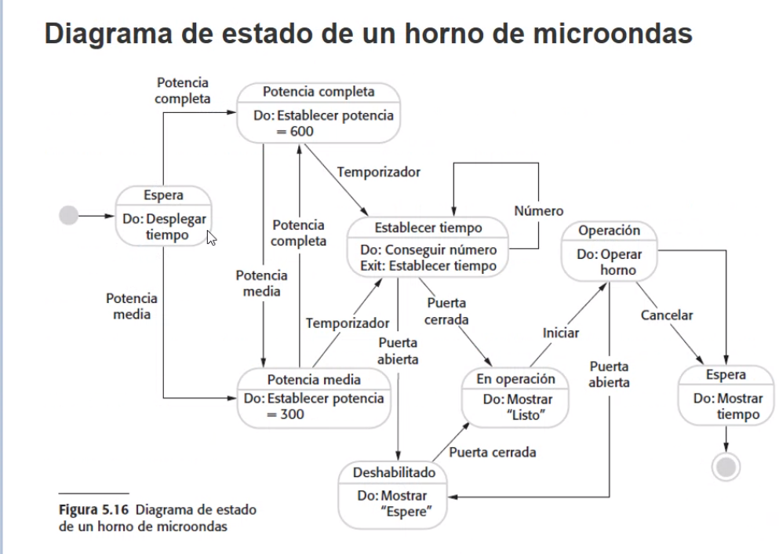

### Ingenieria dirigida por modelos

El modelado es un proceso imprescindible del desarrollo de buenos sistemas informaticos.

## Diseño arquitectonico

Es un proceso de diseño que permite la **identificación** de los **sub-sistemas** que componen un sistema y su comunicación.

El resultado de este proceso de diseño es una **descripción** de la arquitectura de software.

### Ventajas

* **Comunicación entre los stakeholders**: La arquitectura puede ser utilizada como un foco de discusión del sistema por los stakeholders
* **Analisis del sistema**: Analisis de si el sistema puede hacer frente a sus requerimientos no funcionales 
* **Reutilizacion a gran escala**: La arquitectura puede ser **reutilizable** a traves de una variedad de sistemas.

### Caracteristicas de un sistema / arquitectura (requerimientos no funcionales)

* **Rendimiento**: Se puede reducir al minimo las operaciones de comunicaciones (**grano grueso**).
* **Seguridad**: Una arquitectura con los procesos criticos en las capas mas interiores y protegidas.
* **disponibilidad**: Incluir componentes redundantes y mecanismos de tolerancia a fallos
* **Mantenibilidad**: Uso de grano fino, componentes reemplazables (Grano fino).

### Modelo - Vista - Controlador

* 3 Ejes ortogonales
* Mantenible
* Reutilizable
* Muy utilizado por los sistemas web

### Modelo de repositorio

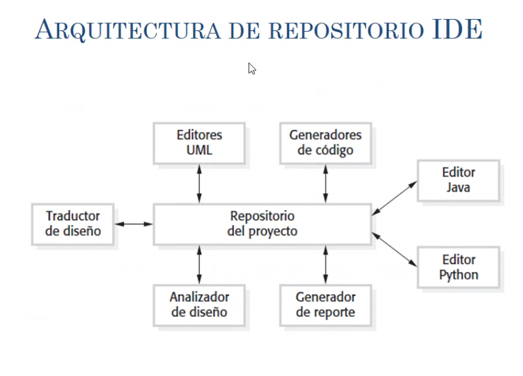

Son sub-sistemas que intercambian datos, pero todos pertenecen y funcionan en base al mismo repositorio.

**Ventajas**

* Facil de compartir grandes cantidades de datos
* Reutilizable
* Modularidad
* Resistente a fallos

**Desventajas**

* Si el repositorio falla, fallan todos los subsistemas (menos rendimiento)
* Evolución de datos dificil y costosa
* Dificil de distribuir de manera eficiente

### Modelo cliente servidor

Sistema distribuido que muestra como el modelo de datos y porcesamiento se distribute a traves de una gama de componentes.

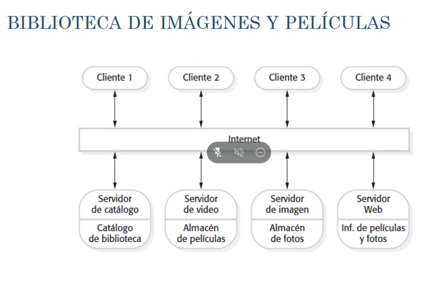

**Ventajas**

* Distribución de datos sencilla
* Uso eficaz de los sistemas en red. (hardware barato)
* Facil de añadir nuevos servidores

**Desventajas**

* Dependemos totalmente de la red

### Modelo de capas

Modelar la interaccion de subsistemas (Modelo OSI). Se puede organizar el sistema en capas, donde una capa puede comunicarse con la capa superior y con la inferior.

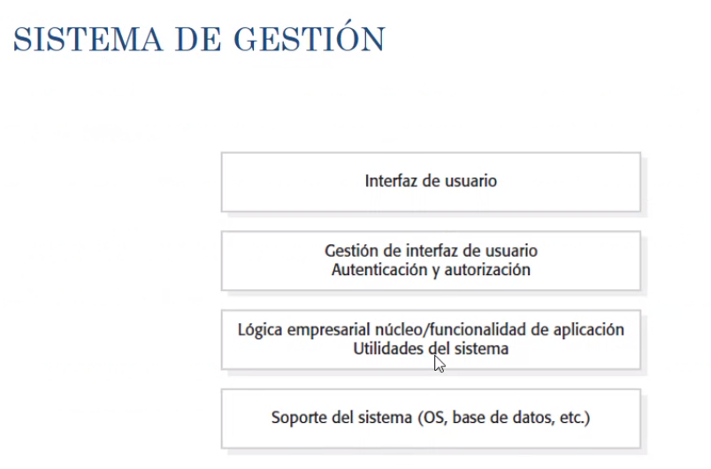

* Si modificamos una capa, probablemente debamos modificar todas las restantes

### Modelos de tuberia y filtro (pipeline)

Estructura en la cual los datos fluyen de un componente a otro para su procesamiento.

## Diseño e implementación

Es una etapa que nos da como resultado el proyecto ejecutable

El diseño de implementacion son subetapas que se desarrollan de manera entrelazada o paralela.

**Diseño**: Actividad creativa en la que se identifica los componentes de software y sus relaciones sobre la base de los requisitos del cliente

**Implementación**: Proceso de realizacion del diseño como un programa

Una vez destacados los requerimientos del cliente, podemos desarrollar un **nuevo proyecto**, o **comprar otro existente**, dependiendo de las necesidades del cliente, las aptitudes del hipotetico software a comprar, y las capacidades economicas manejadas.

Generalmente se implementa un proceso de diseño orientado a objetos, ya que esto nos da una mayor capacidad de reutilización. Este proceso de diseño consta las siguientes etapas:

* Definir el **contexto** y los modos de uso del sistema (modelo de contexto, modelo de casos de uso).
* Diseñar la **arquitectura** del sistema.
* Identificar los **principales objetos** del sistema ().
* Desarrollar **modelos** de **diseño**.
* Especificar las **interfaces** de objetos.

### Patrones de diseño

Forma de reutilizar el conocimiento abstracto sobre un problema y su solución (patron MVC, patrones estructurales, de comportamiento y creacionales)

## Pruebas de software

Validamos si lo que esta hecho funciona correctamente y hace lo que el cliente requiere.

