# Resumen lenguajes formales y automatas

## Indice

- [Resumen lenguajes formales y automatas](#resumen-lenguajes-formales-y-automatas)
  - [Indice](#indice)
  - [Lenguajes gramaticales y formales](#lenguajes-gramaticales-y-formales)
    - [Introduccion](#introduccion)
    - [Definiciones](#definiciones)
    - [Gramatica](#gramatica)
    - [Lenguaje](#lenguaje)
  - [Tipos de gramaticas](#tipos-de-gramaticas)
    - [Gramaticas tipo 0 (sin restricciones)](#gramaticas-tipo-0-sin-restricciones)
    - [Gramaticas tipo 1 (Dependientes del contexto)](#gramaticas-tipo-1-dependientes-del-contexto)
    - [Gramaticas tipo 2 (Dependientes del contexto)](#gramaticas-tipo-2-dependientes-del-contexto)
    - [Gramaticas tipo 3 (Regulares)](#gramaticas-tipo-3-regulares)
    - [Arbol de derivacion](#arbol-de-derivacion)
  - [Gramáticas Regulares y Autómatas Finitos](#gramáticas-regulares-y-autómatas-finitos)
    - [Maquinas Secuenciales](#maquinas-secuenciales)
    - [Maquina de Mealy](#maquina-de-mealy)
    - [Maquina de Moore](#maquina-de-moore)
    - [Automatas finitos deterministas](#automatas-finitos-deterministas)
      - [Minimizacion de automatas](#minimizacion-de-automatas)
    - [Automatas finitos no deterministas](#automatas-finitos-no-deterministas)
  - [Gramaticas de tipo 2 (independientes del contexto)](#gramaticas-de-tipo-2-independientes-del-contexto)
    - [Gramatica limpia](#gramatica-limpia)
    - [Gramatica bien formada](#gramatica-bien-formada)
    - [Forma normal de Chomsky](#forma-normal-de-chomsky)
    - [Forma normal de Greibach](#forma-normal-de-greibach)
  - [Automatas de pila](#automatas-de-pila)

## Lenguajes gramaticales y formales

### Introduccion

Lenguaje: Genera un **vinculo comunicacional** entre el emisor y el receptor en donde **ambos entienden lo mismo**.

Ejemplo de lenguaje **gramatical**: un idioma

Ejemplo de lenguaje **formal**: Lenguaje de programacion.

Los lenguajes formales no deben dar lugar a la **ambiguedad**

### Definiciones

Para crear un lenguaje se necesita:
- **Simbolos**: Entidad abstracta no definible (a,b,c, etc.)
- vocabulario/**alfabeto**: conjunto **finito** y n**o vacio** de simbolos
- **Cadena** / **palabra**: Secuencia finita de simbolos de un determinado alfabeto.
- **Longitud de simbolos**: Cantidad de simbolos en una cadena
- **Cadena vacia**: Se denota con |λ|
- **Concatenacion de cadenas**: α.β = αβ. El elemento neutro de la concatenacion es λ 
- **Universo del discurso**: conjunto de **todas las cadenas** que se pueden formar con los simbolos de un alfabeto. 
  - Se denota W(V)
  - W(V) es un conjunto infinito
  - La cadena vacia pertenece a W(V)

- **Lenguaje**: Subconjunto del universo del discurso de un alfabeto V. Este se puede definir por:
  - **Enumeracion**: {a,aa,aab,aaab}
  - **definicion**: {a^i b^j | i>=1 ^ b>=0}
- **Lenguaje vacio**: Conjunto vacio denotado por {∅}
- **Gramatica**:ente formal para especificar, de una manera finita, el conjunto de cadenas de símbolos que constituyen un lenguaje.

### Gramatica
Cuadrupula: G{VT,VN,S,P}

Donde:
- **VT**: Simbolos terminales
- **VN**: Simbolos no terminales
- **S**: Simbolo inicial / axioma
- **P**: Producciones / reglas de derivacion

**Propiedades**:
- Todas las **cadenas** del lenguaje definido por la gramática están formados con símbolos del **vocabulario terminal** VT. 
- El **vocabulario terminal** se define por **enumeración** de los **símbolos terminales**.
- El **vocabulario no terminal** VN es el conjunto de símbolos introducidos como **elementos auxiliares** para la definición de la gramática, y que **no figuran** en las **sentencias del lenguaje**. 
- El vocabulario no terminal se define por **enumeración** de los **símbolos no terminales**.
- La **intersección** entre el **vocabulario terminal** y **no terminal** es el **conjunto vacio** : {VN} ∩ {VT} = {∅}

### Lenguaje

El lenguaje L(G) generado por una gramática G es el **conjunto** de **todas las sentencias** que puede **generar G** (L(G)= {η ∈VT / S→ η}).

Una **sentencia** pertenece a L(G) si :
- Está compuesta de **símbolos terminales**
- La sentencia puede **derivarse** del símbolo inicial **S** aplicando las reglas de **producción** de la gramática.

Dos gramáticas son **equivalentes** si ambas **generan** el **mismo lenguaje** (L(G1)=L(G2)).

## Tipos de gramaticas

Chomsky definió **cuatro tipos** distintos de gramáticas en función de la **forma** de las **producciones**.

La clasificación comienza con un tipo de gramáticas **universal** y aplicando **restricciones** a sus reglas de derivación se van obteniendo los otros tres tipos de gramáticas. 

Esta clasificación es jerárquica, es decir **cada tipo** de gramáticas **engloba** a todos los **tipos siguientes**.

### Gramaticas tipo 0 (sin restricciones)

α → β

**Restricciones**:

- α debe contener al menos **un símbolo no terminal**.

- No puede haber reglas de la forma λ → β donde λ es la **cadena vacía**.

### Gramaticas tipo 1 (Dependientes del contexto)

αAβ → α y β

Siendo:
- A ∈ VN;
- α,β ∈(VN ∪ VT)  
- γ ∈(VN ∪ VT)

A deriva en **γ** solo si su contexto es α…β (esta precedida por α y seguida por β) (?)

Las cadenas que se obtienen en cualquier derivación de una gramática de tipo 1 son de **longitud no decreciente**, es decir : α → β   ⇒    |β|≥|α|

La longitud de la **parte derecha** de la producción es **mayor o igual** a la de la **parte izquierda**.

### Gramaticas tipo 2 (Dependientes del contexto)

Sus reglas de producción tan sólo admiten tener **un símbolo no terminal** en su **parte izquierda**, es decir son de la forma :

A→ α

siendo: 
- A ∈ VN
- α ∈(VN ∪ VT)

### Gramaticas tipo 3 (Regulares)

Sus reglas de producción **comienzan** por un **símbolo terminal**, que puede ser seguido o no por **un** símbolo no terminal.

A→aB 

A→Ba 

A→α

siendo 
- A,B ∈ VN 
- α ∈ VT.

### Arbol de derivacion

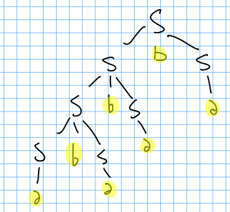

## Gramáticas Regulares y Autómatas Finitos

`Nota`: Los simbolos terminales de los lenguajes de programacion (lenguajes formales) son las palabras reservadas (IF, WHILE, etc...)

`Nota`: Las "gramaticas regulares" pueden ser verificadas por maquinas automatas

### Maquinas Secuenciales

Una maquina secuencial es un **automata** (Máquina automática programable capaz de realizar determinadas operaciones de manera autónoma) que dada una palabra de **entrada** puede generar alguna **salida**

Toda maquina posee:

- Alfabeto de **entrada**.
- Conjunto finito de **estados**.
- **Función de transición** entre estados.
- Algún tipo especifico de **salida**

**Estado**

Identifica de forma única una **situación** del sistema.

**Diagrama de estados**

Es un diagrama de nodos y aristas (**Grafo**). Muestra como la máquina **evoluciona** a través de los estados. (JFLAP)

**Transicion**

Cambio de un estado al próximo.

**Proximo estado**

El estado al que irá la máquina mediante una transición.

### Maquina de Mealy

La salida depende de la **entrada** y del **estado actual** de la máquina.

**Notacion**

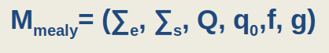

**Donde**:

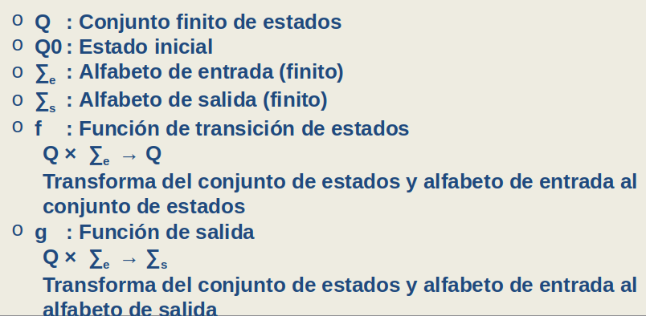

### Maquina de Moore

El **estado** y el **símbolo** de entrada **actual** deciden el **siguiente estado**. La **salida** depende solo del **estado actual** de la máquina. 

**Notacion**

**Donde**

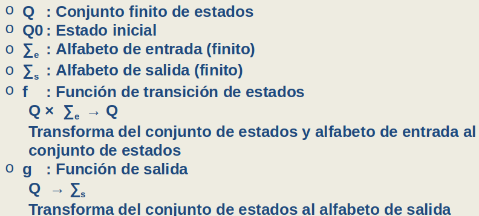

### Automatas finitos deterministas

Son máquinas secuenciales que se utilizan para **reconocer patrones**. El par (entrada, estado actual) define la transición al nuevo estado.

`Nota`: No hay alfabeto de salida. El autómata acepta o no acepta la cadena de entrada

Cuando la cadena de entrada se procesa con éxito y el autómata **alcanza** su **estado final** dicha **cadena** es **aceptada**, en caso contrario es **rechazada**.

**Notacion**

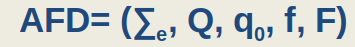

**Donde**

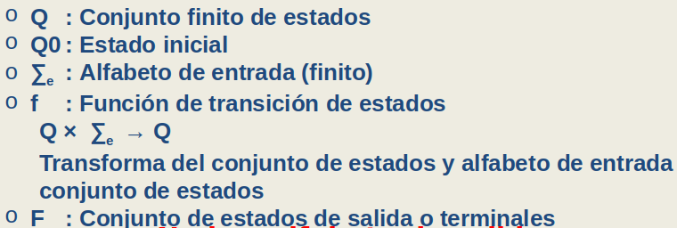

El automata es **determinista** si:

- para cada entrada/estado hay una unica transicion
- Todas las transiciones estan definidas para c/estado
- no hay transiciones `espontaneas` (?)

**Accesibilidad entre estados**

Dados dos estados **p** y **q**, se dice que q es **accesible** desde p, si  existe una **palabra** x formada por símbolos del alfabeto de entrada tal que **partiendo de p** y aplicando  la función de transición se **pueda llegar a q**

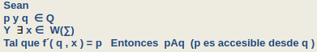

**Conjunto conexo**

Es aquel en donde **todos sus estados** son **accesibles** desde el **estado inicial**. Si en un AFD existen estados **no conexos** (no accesibles desde el estado inicial), estos **pueden ser eliminados**.

**Equivalencia de automatas**

Dos automatas son equivalentes si reconocen el mismo lenguaje

**Equivalencia de estados**

Dos estados P y Q son equivalentes si:

- Para toda cadena x que partiendo del estado p llega hasta un estado de aceptación, lo hace partiendo desde el estado q. 
- Para toda otra cadena  y que partiendo del estado p no llega a un estado de aceptación, tampoco lo hace partiendo  desde el estado q.

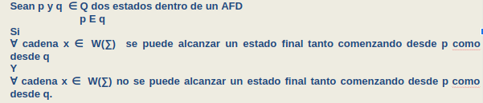

**Equivalencia de estados de longitud n**

Dos estados p y q serán equivalentes de longitud n si: cumplen la equivalencia anterior pero la longitud de las cadenas x e y es menor o igual a n.

#### Minimizacion de automatas

El objetivo es obtener un autómata equivalente al original, o sea que reconozca el mismo lenguaje,  con el **menor número posible de estados**.

**Pasos**

1. Encontrar el **autómata conexo**: todos sus estados accesibles desde el estado inicial. Si existiera algún estado que no cumpliera con esta condición se lo podrá **eliminar**, sin que se afecte el lenguaje aceptado por el autómata.
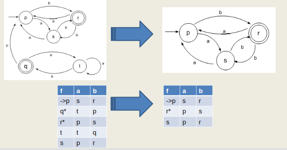
2. Determinar el **Conjunto cociente**: el **mínimo número de estados** con **diferente significado**.
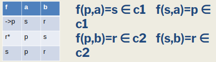
3. **Construir** el **nuevo autómata** utilizando los estados determinados por las clases de equivalencia. 
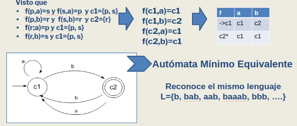

### Automatas finitos no deterministas

Se describen formalmente como:

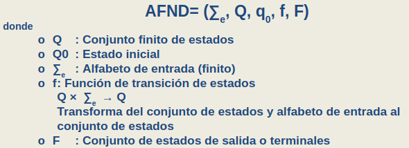

Un automata es no determinista si no se cumple por lo menos una de los 3 requerimientos para que sea determinista.

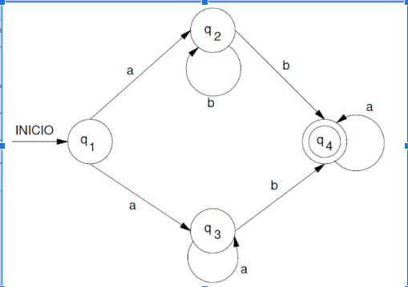

Se puede transformar un automata **no determinista** a uno **determinista** de tal manera que ambos aceptan el mismo lenguaje realizando un metodo anologo al de reducir un AFD a su minima exprecion (determinando conjuntos cocientes).

## Gramaticas de tipo 2 (independientes del contexto)

Estas gramaticas son de vital importancia en el mundo de la programacion ya que tienen el mismo funcionamiento que un compilador.

Para que una gramatica tipo 2 sea reconocida por una maquina automata, primero hay que pasar por un procedimiento consistente de estos 3 pasos:

- Gramatica limpia
- Gramatica bien formada
- Formas normales de Chomsky y Greinbach

### Gramatica limpia

Una gramatica limpia no tiene

- **Reglas innecesarias**: son las que tienen la forma A::=A (un no terminal que deriva en si mismo).
- **Reglas inaccesibles**: aquellos símbolos no terminales (A) que no pueden ser alcanzados por derivación desde el axioma de la gramática, S.
- **Simbolos superfluos**:
  - **No terminal**: es aquel del que **solo** se pueden derivar palabras en las que existe **al menos** un símbolo no terminal.
  - **Terminal**: Es aquel que no puede ser alcanzado por derivación desde el axioma (no aparece en la parte derecha de ninguna producción).

Para conseguir una gramatica limpia, se sigue el proceso explicado en el siguiente ejemplo:

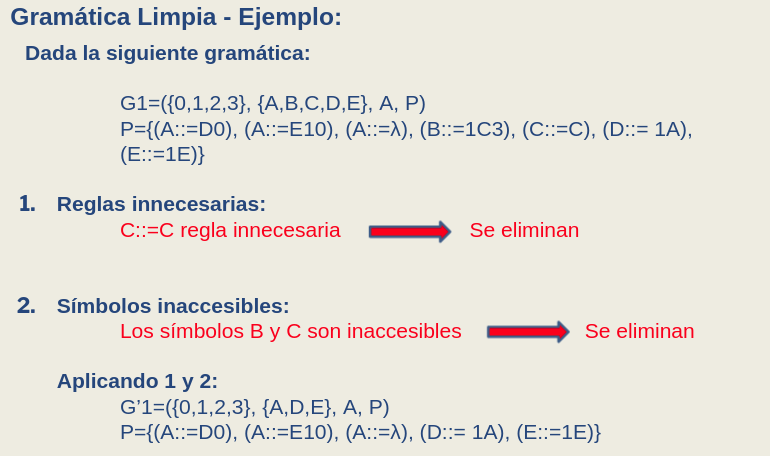
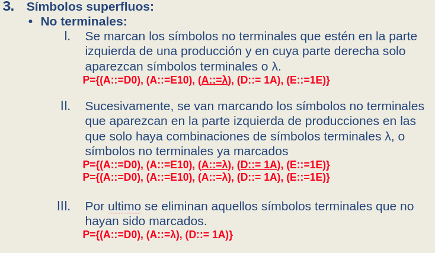
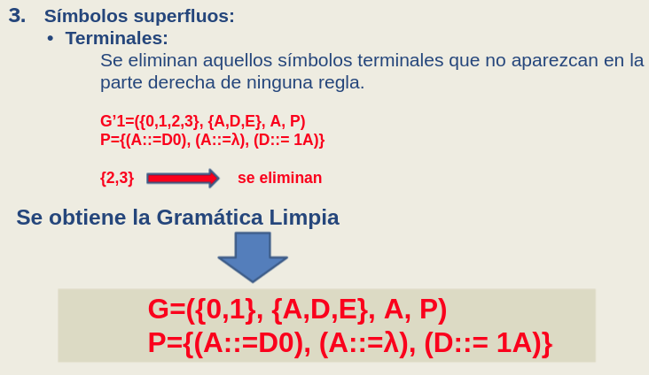

### Gramatica bien formada

Una gramatica esta bien formada si
- **Esta limpia**
- **No tiene**:
  - **Reglas no generativas**: Una regla es no generativa cuando en A::= λ , A **no es** el **axioma** (S)
  - **Reglas de redefinicion**: Una regla es de redenominación cuando A::=B con A y B **no terminales**. 

Para conseguir una gramatica bien formada, se sigue el procedimiento explicado en este ejemplo:

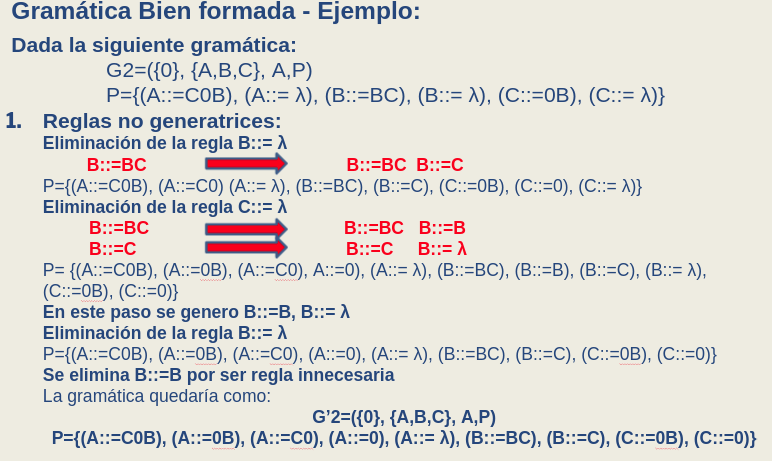
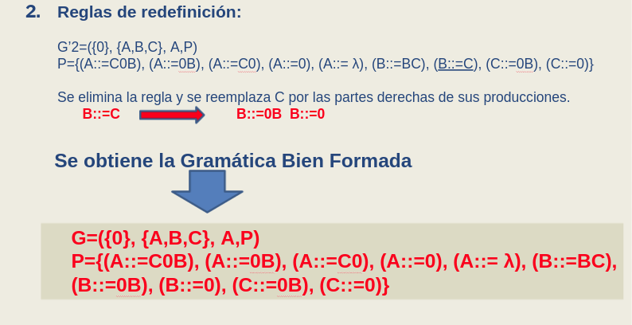

### Forma normal de Chomsky

Una gramatica esta en su forma normal de Chomsky si

- Esta bien formada
- Las producciones solo son de la forma P={(A::=BC) ó (S::=λ) ó (A::=a)}

Destacamos de las gramaticas expresadas en esta forma normal que los árboles de derivación, salvo en las derivaciones correspondientes a las hojas, **son binarios**. 

Para obtener una gramatica en su forma normal de Chomsky, seguimos el proceidimiento explicado en el siguiente ejemplo:

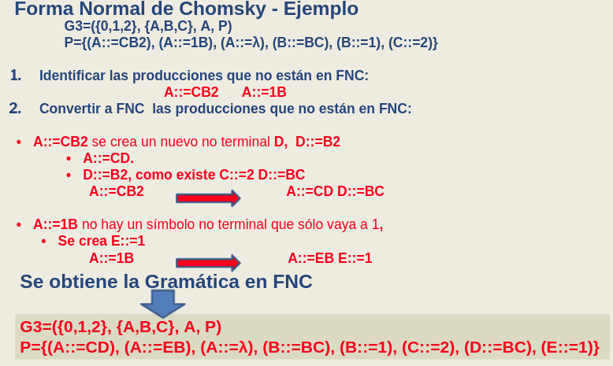

### Forma normal de Greibach

Una gramatica esta en su forma normal de Greibach si:
- Esta bien formada
- Las producciones son de la forma: A →a ó A →aB1B2…Bk donde Bi son no terminales.

En otras palabras, **no** puede **tener** producciones **recursivas por izquierda**, y cada produccion debe tener **UN** simbolo terminal del alfabeto

Para obtener una gramatica en su forma normal de Greibach, se sigue el procedimiento explicado en el siguiente ejemplo:

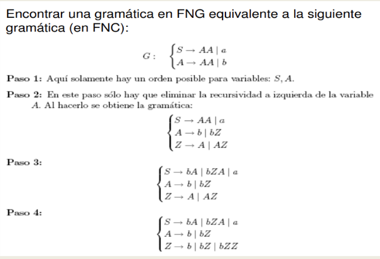

## Automatas de pila

Los autómatas de Pila reconocen palabras de lenguajes generados por **gramáticas libres de contexto** 
Un AP es básicamente un AF con una  pila, en donde se puede **almacenar y recordar** información. 
Los AP solo pueden acceder a la información  almacenada en forma **LIFO**. 

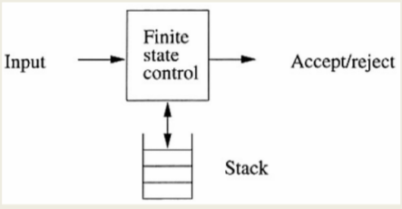

En una **transición** el AP: 

- Consume un símbolo de entrada.
- Se va a un nuevo estado (que puede ser el mismo).
- Se modifica el **tope** de la pila:
 - Queda el mismo símbolo en el tope (no hace nada) 
 - Hace pop (elimina lo que esta en el tope) 
 - Cambia el tope por otro valor (reemplazo con pop/push)
 - Hace push cambiando el tope
