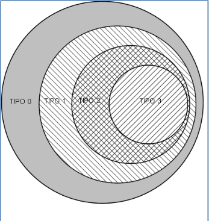

# Resumen lenguajes formales y automatas

## Indice

- [Resumen lenguajes formales y automatas](#resumen-lenguajes-formales-y-automatas)
  - [Indice](#indice)
  - [Lenguajes gramaticales y formales](#lenguajes-gramaticales-y-formales)
    - [Introduccion](#introduccion)
    - [Definiciones](#definiciones)
    - [Gramatica](#gramatica)
    - [Lenguaje](#lenguaje)
  - [Tipos de gramaticas](#tipos-de-gramaticas)
    - [Gramaticas tipo 0 (sin restricciones)](#gramaticas-tipo-0-sin-restricciones)
    - [Gramaticas tipo 1 (Dependientes del contexto)](#gramaticas-tipo-1-dependientes-del-contexto)
    - [Gramaticas tipo 2 (Dependientes del contexto)](#gramaticas-tipo-2-dependientes-del-contexto)
    - [Gramaticas tipo 3 (Regulares)](#gramaticas-tipo-3-regulares)

## Lenguajes gramaticales y formales

### Introduccion

Lenguaje: Genera un **vinculo comunicacional** entre el emisor y el receptor en donde **ambos entienden lo mismo**.

Ejemplo de lenguaje **gramatical**: un idioma

Ejemplo de lenguaje **formal**: Lenguaje de programacion.

Los lenguajes formales no deben dar lugar a la **ambiguedad**

### Definiciones

Para crear un lenguaje se necesita:
- **Simbolos**: Entidad abstracta no definible (a,b,c, etc.)
- vocabulario/**alfabeto**: conjunto **finito** y n**o vacio** de simbolos
- **Cadena** / **palabra**: Secuencia finita de simbolos de un determinado alfabeto.
- **Longitud de simbolos**: Cantidad de simbolos en una cadena
- **Cadena vacia**: Se denota con |λ|
- **Concatenacion de cadenas**: α.β = αβ. El elemento neutro de la concatenacion es λ 
- **Universo del discurso**: conjunto de **todas las cadenas** que se pueden formar con los simbolos de un alfabeto. 
  - Se denota W(V)
  - W(V) es un conjunto infinito
  - La cadena vacia pertenece a W(V)

- **Lenguaje**: Subconjunto del universo del discurso de un alfabeto V. Este se puede definir por:
  - **Enumeracion**: {a,aa,aab,aaab}
  - **definicion**: {a^i b^j | i>=1 ^ b>=0}
- **Lenguaje vacio**: Conjunto vacio denotado por {∅}
- **Gramatica**:ente formal para especificar, de una manera finita, el conjunto de cadenas de símbolos que constituyen un lenguaje.

### Gramatica
Cuadrupula: G{VT,VN,S,P}

Donde:
- **VT**: Simbolos terminales
- **VN**: Simbolos no terminales
- **S**: Simbolo inicial / axioma
- **P**: Producciones / reglas de derivacion

**Propiedades**:
- Todas las **cadenas** del lenguaje definido por la gramática están formados con símbolos del **vocabulario terminal** VT. 
- El **vocabulario terminal** se define por **enumeración** de los **símbolos terminales**.
- El **vocabulario no terminal** VN es el conjunto de símbolos introducidos como **elementos auxiliares** para la definición de la gramática, y que **no figuran** en las **sentencias del lenguaje**. 
- El vocabulario no terminal se define por **enumeración** de los **símbolos no terminales**.
- La **intersección** entre el **vocabulario terminal** y **no terminal** es el **conjunto vacio** : {VN} ∩ {VT} = {∅}

### Lenguaje

El lenguaje L(G) generado por una gramática G es el **conjunto** de **todas las sentencias** que puede **generar G** (L(G)= {η ∈VT / S→ η}).

Una **sentencia** pertenece a L(G) si :
- Está compuesta de **símbolos terminales**
- La sentencia puede **derivarse** del símbolo inicial **S** aplicando las reglas de **producción** de la gramática.

Dos gramáticas son **equivalentes** si ambas **generan** el **mismo lenguaje** (L(G1)=L(G2)).

## Tipos de gramaticas

Chomsky definió **cuatro tipos** distintos de gramáticas en función de la **forma** de las **producciones**.

La clasificación comienza con un tipo de gramáticas **universal** y aplicando **restricciones** a sus reglas de derivación se van obteniendo los otros tres tipos de gramáticas. 

Esta clasificación es jerárquica, es decir **cada tipo** de gramáticas **engloba** a todos los **tipos siguientes**.

### Gramaticas tipo 0 (sin restricciones)

α → β

**Restricciones**:

- α debe contener al menos **un símbolo no terminal**.

- No puede haber reglas de la forma λ → β donde λ es la **cadena vacía**.

### Gramaticas tipo 1 (Dependientes del contexto)

αAβ → α y β

Siendo:
- A ∈ VN;
- α,β ∈(VN ∪ VT)  
- γ ∈(VN ∪ VT)

A deriva en **γ** solo si su contexto es α…β (esta precedida por α y seguida por β) (?)

Las cadenas que se obtienen en cualquier derivación de una gramática de tipo 1 son de **longitud no decreciente**, es decir : α → β   ⇒    |β|≥|α|

La longitud de la **parte derecha** de la producción es **mayor o igual** a la de la **parte izquierda**.

### Gramaticas tipo 2 (Dependientes del contexto)

Sus reglas de producción tan sólo admiten tener **un símbolo no terminal** en su **parte izquierda**, es decir son de la forma :

A→ α

siendo: 
- A ∈ VN
- α ∈(VN ∪ VT)

### Gramaticas tipo 3 (Regulares)

Sus reglas de producción **comienzan** por un **símbolo terminal**, que puede ser seguido o no por **un** símbolo no terminal.

A→aB 

A→Ba 

A→α

siendo 
- A,B ∈ VN 
- α ∈ VT.