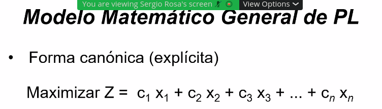
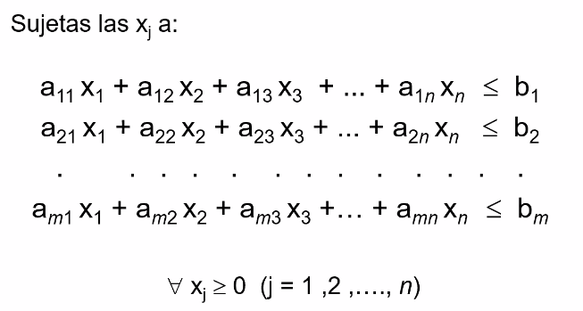
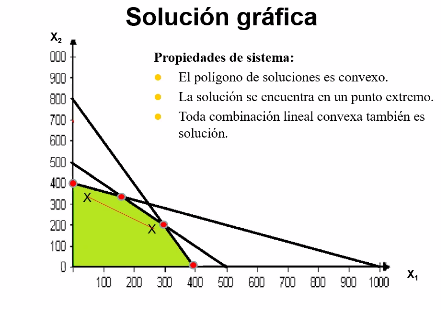

# Modelos y simulación parte 1

Notas:

* Hay 3 parciales.
* Con un promedio mayor a 8 hay promocion parcial.
* Profesor teorico **modelos**: Sergio Rosa.
* Libros: 
    * Metodos cuantitativos de Andersson.
    * Hay mas libros...
    * Los capitulos los va a subir el profe.
* Parciales puramente practicos
* Correo profe: 

## Introduccion

**Investigacion operativa**: Aplicacion del **metodo cientifico** a la toma de decisiones ejecutivas y/o empresariales con un enfoque sistemico. ("Arte/Ciencia de modelar situaciones complejas y desarrollar tecnicas de solucion apra resolver modelos")

Surgio durante la **2da guerra mundial** al querer optimizar el uso de los recursos para dicha guerra. Luego, en las distintas industrias se siguieron usando los modelos implementados en dicha etapa.

**Modelo**: Version simplificada de la realidad (abstraccion). 

**Metodogia** para **resolver problemas** ( similar al metodo cientifico):

1. Planteo del **problema**: 
    * Identificar/ definir **variables**:
        * **Controlables**: De decision (Ej: decido que cantidad de dinero invertir)
        * No **controlables**: No e pueden controlar xD
    * Plantear un **objetivo**
    * Plantear **restricciones** 
2. **Construccion** del **modelo**: Se justifica la elaboracion de un modelo cuando se toman deciciones parecidas en cortos intervalos de tiempo
3. Generar una **solucion**: encontrar valores de las variables que maximizan ingresos o minimizan costos, entre otros objetivos.
4. **Validacion** de la solucion: Afinamos el modelo para obtener mejores resultados y mejorar los niveles de certeza/precision. (Deben generar soluciones racionables)
5. **Implementacion**
6. **Evaluacion** de los **resultados**

## Unidad 1: Programacion lineal

Todo modelo de programacion lineal esta sujeto a un conjunto de **restricciones** que se deben cumplir (como los recursos, la demanda, entre otras dependiendo del caso.)

(La ultima condicion es la de **no negatividad**)

Se llama **programacion lineal** porque las funciones objetivo (Z) son funciones lineales, incluso las funciones "restricciones". 

Con respecto al metodo cientifico, en clase solo llegaremos a realizar los **primeros 3 pasos** para crear los modelos.

Para resolver los modelos (Encontrar los valores de las variables que cumplan con los objetivos) Podemos utilizar los siguientes metodos:

* Metodo matricial (Restricciones => Sistema de inecuaciones lineales)
* Metodo grafico
* Utilizar algun software

En esta solucion grafica, el area verde indica los valores de las incognitas que estan dentro de las restricciones. Este **Poligono de soluciones** es **convexo** (La combinacion lineal de 2 puntos dentro del poligono pertenece tambien a la region del poligono.) Esto da a lugar a que toda solucion **optima** se encuentra en los **puntos extremos** (puntos rojos de la imagen). El punto mas optimo dependera del objetivo que querramos cumplir.

* **Soluciones**
    * S. **factibles** (area verde)
        * S. factibles **basicas** (puntos extremos)
            * S. f. **degeneradas** Tiene que ver con la cantidad de variables que son ceros
            * S. f. **no degeneradas** (TODO)
        * S. factibles basicas **optimas** (puntos extremos acordes a nuestros objetivos)
    * S. **no factibles** (no area verde)

`Nota: **Variables de olgura** son las variables cuyos valores sobran en las soluciones optimas.`

<!-- **Modelos**:

* a
*  
* 
*  -->