# Modelos y simulación parte 1

Notas:

* Hay 3 parciales.
* Con un promedio mayor a 8 hay promocion parcial.
* Profesor teorico **modelos**: Sergio Rosa.
* Libros: 
    * Metodos cuantitativos de Andersson.
    * Hay mas libros...
    * Los capitulos los va a subir el profe.
* Parciales puramente practicos
* Correo profe: 

## Introduccion

**Investigacion operativa**: Aplicacion del **metodo cientifico** a la toma de decisiones ejecutivas y/o empresariales con un enfoque sistemico. ("Arte/Ciencia de modelar situaciones complejas y desarrollar tecnicas de solucion apra resolver modelos")

Surgio durante la **2da guerra mundial** al querer optimizar el uso de los recursos para dicha guerra. Luego, en las distintas industrias se siguieron usando los modelos implementados en dicha etapa.

**Modelo**: Version simplificada de la realidad (abstraccion). 

**Metodogia** para **resolver problemas** ( similar al metodo cientifico):

1. Planteo del **problema**: 
    * Identificar/ definir **variables**:
        * **Controlables**: De decision (Ej: decido que cantidad de dinero invertir)
        * No **controlables**: No e pueden controlar xD
    * Plantear un **objetivo**
    * Plantear **restricciones** 
2. **Construccion** del **modelo**: Se justifica la elaboracion de un modelo cuando se toman deciciones parecidas en cortos intervalos de tiempo
3. Generar una **solucion**: encontrar valores de las variables que maximizan ingresos o minimizan costos, entre otros objetivos.
4. **Validacion** de la solucion: Afinamos el modelo para obtener mejores resultados y mejorar los niveles de certeza/precision. (Deben generar soluciones racionables)
5. **Implementacion**
6. **Evaluacion** de los **resultados**

## Unidad 1: Programacion lineal

Todo modelo de programacion lineal esta sujeto a un conjunto de **restricciones** que se deben cumplir (como los recursos, la demanda, entre otras dependiendo del caso.)

(La ultima condicion es la de **no negatividad**)

Se llama **programacion lineal** porque las funciones objetivo (Z) son funciones lineales, incluso las funciones "restricciones". 

Con respecto al metodo cientifico, en clase solo llegaremos a realizar los **primeros 3 pasos** para crear los modelos.

Para resolver los modelos (Encontrar los valores de las variables que cumplan con los objetivos) Podemos utilizar los siguientes metodos:

* Metodo matricial (Restricciones => Sistema de inecuaciones lineales)
* Metodo grafico
* Utilizar algun software

En esta solucion grafica, el area verde indica los valores de las incognitas que estan dentro de las restricciones. Este **Poligono de soluciones** es **convexo** (La combinacion lineal de 2 puntos dentro del poligono pertenece tambien a la region del poligono.) Esto da a lugar a que toda solucion **optima** se encuentra en los **puntos extremos** (puntos rojos de la imagen). El punto mas optimo dependera del objetivo que querramos cumplir.

* **Soluciones**
    * S. **factibles** (area verde)
        * S. factibles **basicas** (puntos extremos)
            * S. f. **degeneradas** Tiene que ver con la cantidad de variables que son ceros
            * S. f. **no degeneradas** (TODO)
        * S. factibles basicas **optimas** (puntos extremos acordes a nuestros objetivos)
    * S. **no factibles** (no area verde)

`Nota: **Variables de olgura** son las variables cuyos valores sobran en las soluciones optimas.`

Las inecuaciones de las restricciones pueden transformarse a **ecuaciones** añadiendo nuevas **variables de holgura** segun corresponda (**Forma estandar**)

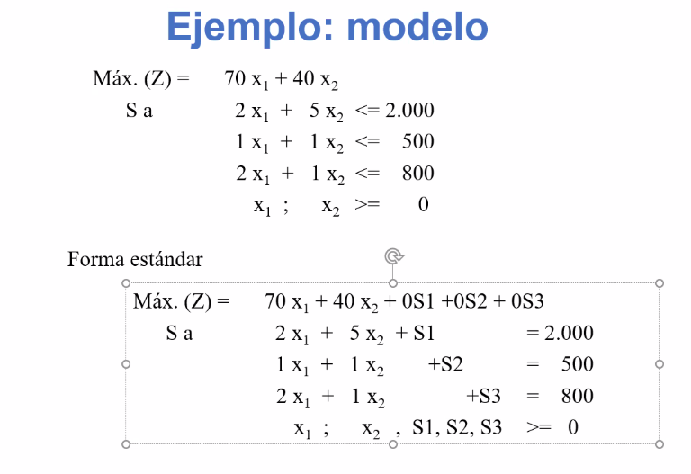

Siempre las restricciones forman un **sistema** **compatible indeterminado**, por lo que hay infinitas soluciones (poligono solucion)

Se pueden obtener la cantidad de **soluciones basicas** mediante este procedimiento:

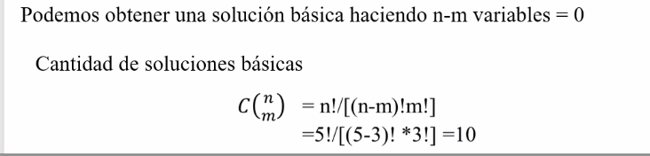

Donde `n` son las variables y `m` las ecuaciones.

Todos los puntos de la siguiente imagen son **soluciones basicas**. solo que los azules son **factibles** y los rojos son **no factible**

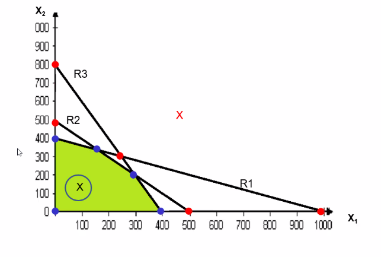

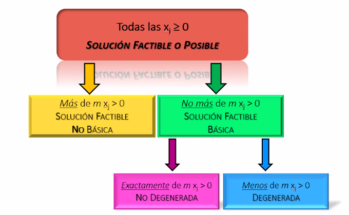

Formas de expresar los modelos (ademas de la forma estandar):

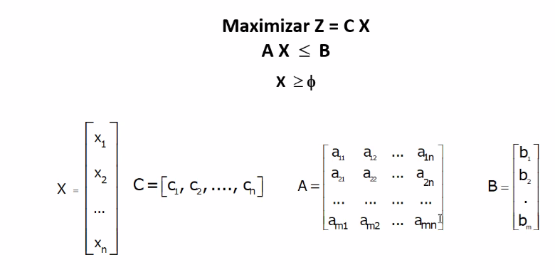
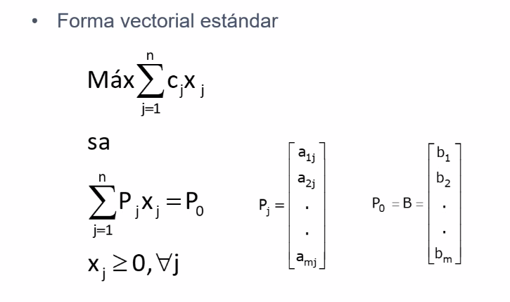

En los modelos de programacion lineal se deben cumplir los siguientes **supuestos**:
* **Un solo objetivo**
* Un **conjunto** de **restricciones**
* **Proporcionalidad**
* **Divisibilidad**
* **Actividad**
* **Certidumbre**
* **No negatividad** de las variables

**Interpretacion de los resultados y analisis de sensibilidad.**

* Se analizan cambios en el coeficiente de la funcion objetivo

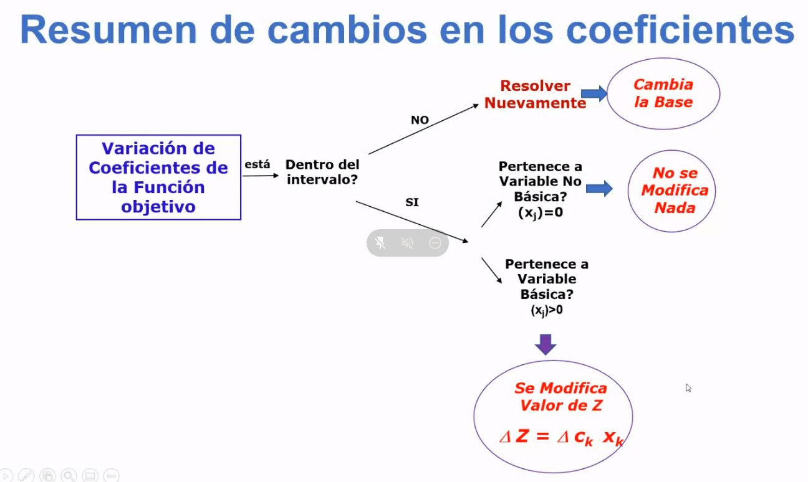

* Cambio en la parte derecha de las restricciones: Se amplian las restricciones, el poligono cambia y los resultados tambien

Las restricciones pueden ser limitantes o no limitantes:

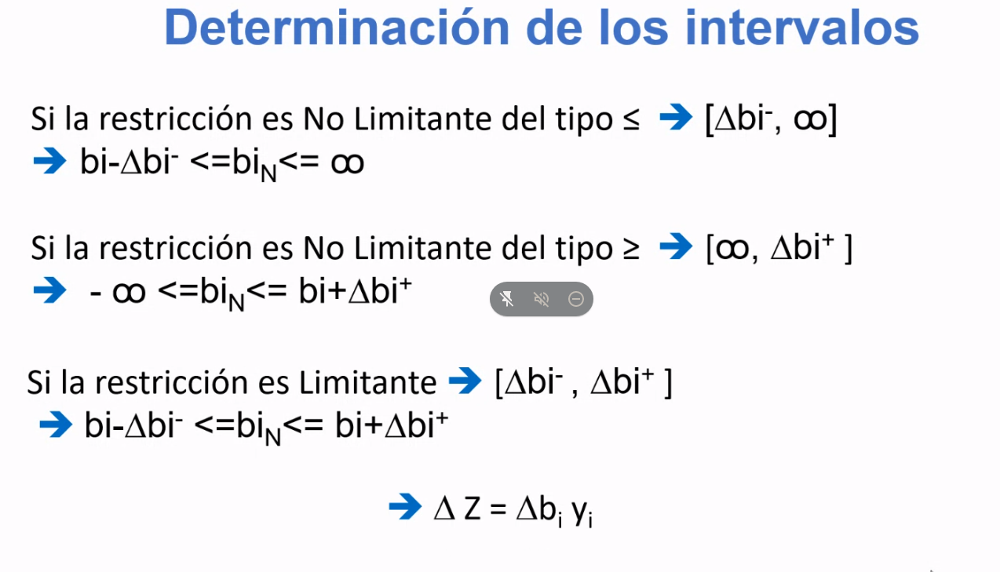

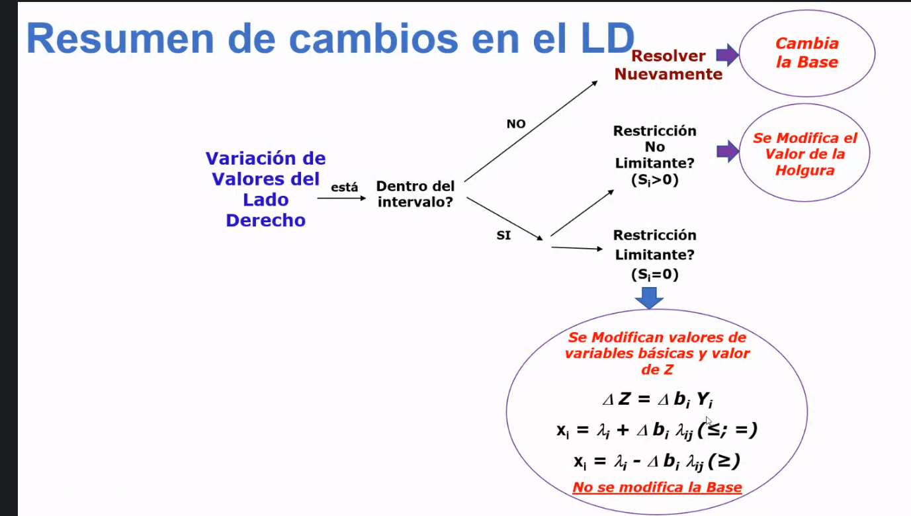

## Programacion lineal entera

Los valores de las variables pueden ser enteros.

**Variables / restricciones binarias**

Estas variables / restricciones nos permiten representar **condiciones logicas**. Ej:

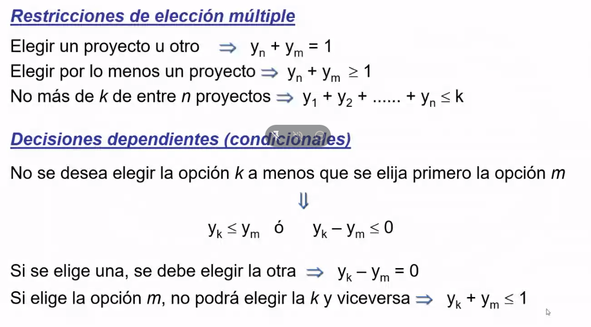

**restricciones tamaño de lote**

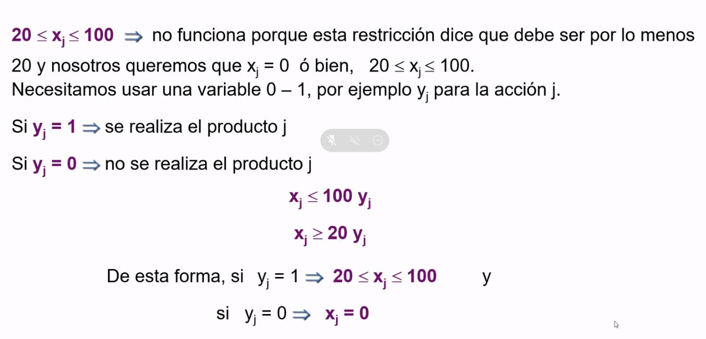

**Restricciones de costo fijo**

**Transporte y asignacion**

Se ve como otro modelo pero es parte de la PL

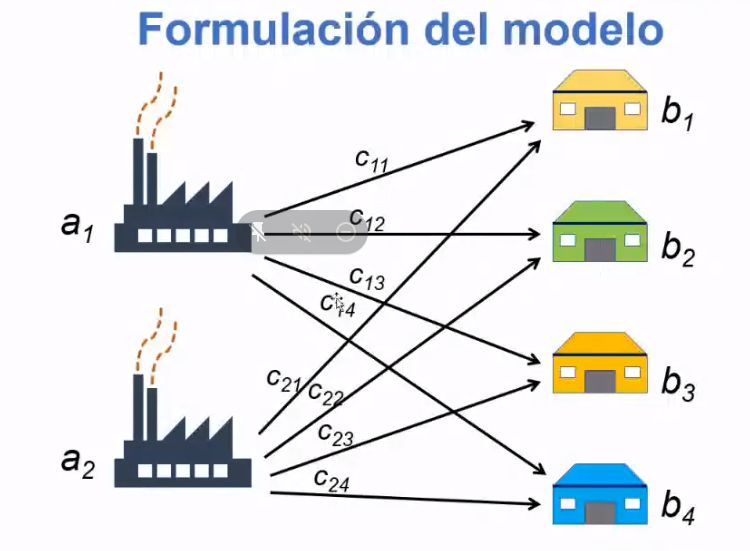

En general siempre es un problema de minimizacion. 

Las variables de decision (X_ij) son la cantidad de unidades de producto a enviar desde el origen i al destino j por unidad de tiempo

Como restricciones voy a tener:
* Restricciones por c/u de los clientes (demanda)
* Restricciones por c/u de las "fabricas" (capacidad)
* Condicion de no negatividad y enteras

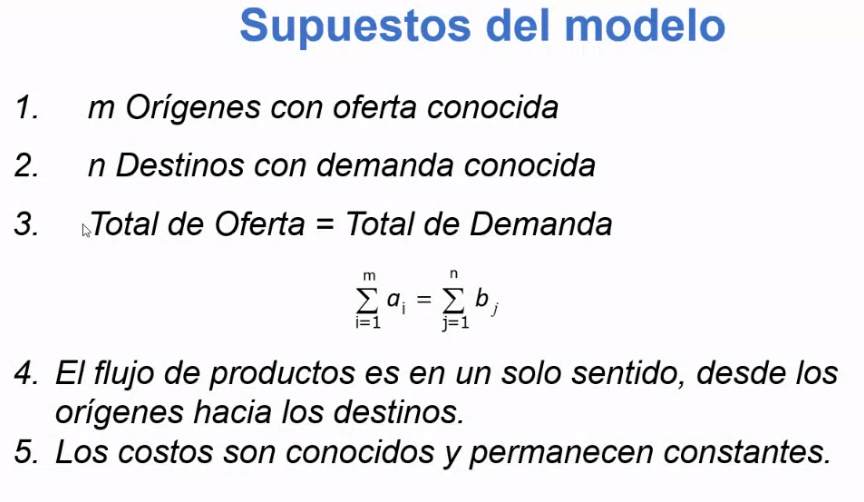

El problema de la asignación es similar al de transporte, se pueden resolver mediante la PL (A lo mejor no es la mejor solución). 

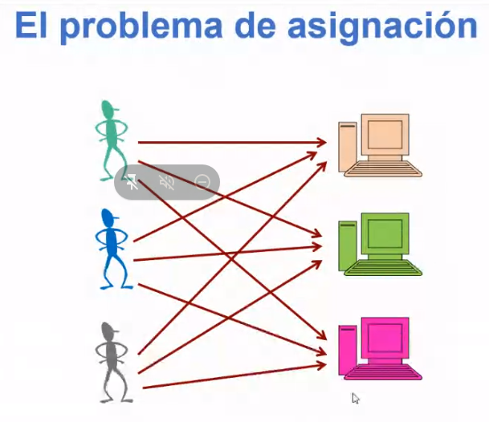

Tiene que haber tantos operarios como puestos de trabajo.

Este modelo utiliza variables binarias (se asigna o no el operario I al puesto J).

En general el problema de asignación suele ser de minimización de costos.

## Inventarios

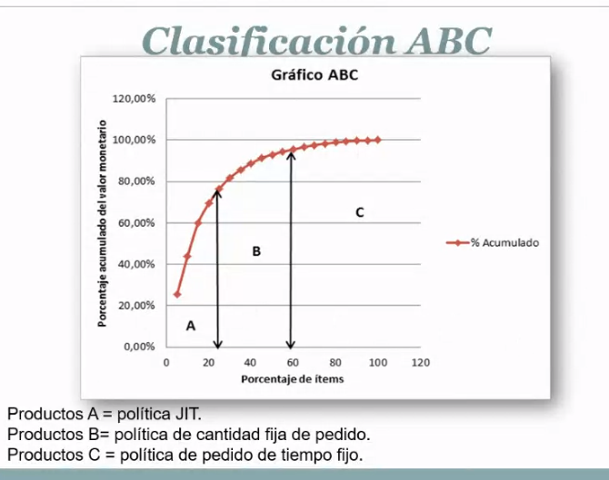

Principio de pareto para inventarios (20% de productos generan el 80% de los gastos, producto A, 30% generan un 15% de costos, y un 50% generan un 5% de costos)

Los costos a la hora de analizar stocks son:

* Costo de mantener el stock
* Costo de pedido
* Costo por agotamiento o ruptura
* Costo de adquisición

Ejercicio tipo: cuantos productos tipo C se necesita reabasteser 1 vez por año.

Politica de periodo de tiempo fijo

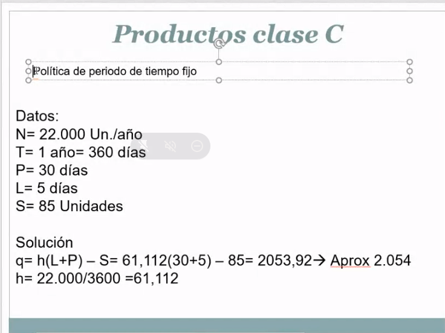

Politica de cantidad fija de pedido

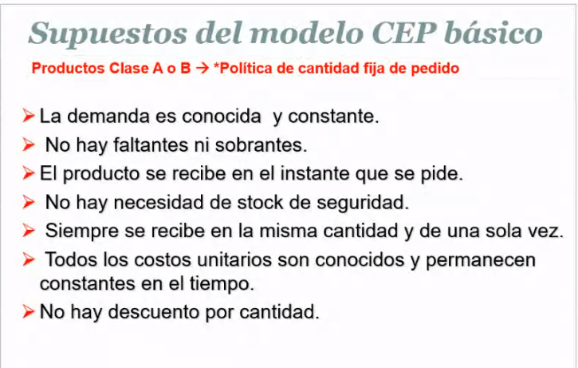

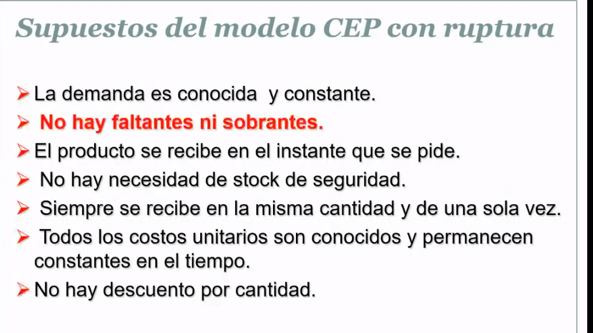

**TODO**

## Redes

Grafos:

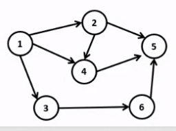

### Principio de optimidad

Todo subcamino de un camino (secuencia de nodos y arcos que llevan de un nodo inicial a uno final) de valuacion optima es tambien de valuacion optima, comparado con todos los otros caminos que unen sus mismos vertices extremos

### Arbol de expancion minima

Es una red con n nodos **conexa** sin ciclos

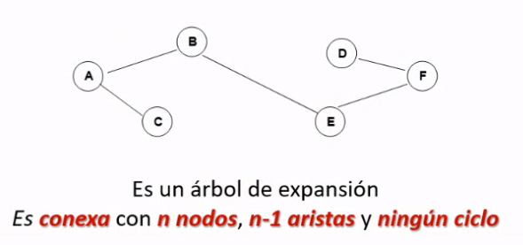

### Notacion

**Arbol**: Subred conexa sin ciclo y no dirigida

**Arbol de expansion**: Subred conexa que no contiene ciclos no dirigidos y llega a todos los nodos de la red

Usamos un algoritmo parecido al de Dijkstra, que se puede implementar usando PL

### Ruta mas corta

El problema es encontrar el camino de valor minimo que une un nodo con otro.

Es una red conexa y no dirigida con 2 nodos especiales (origen y destino)

A cada ligadura de la red (arco no dirigido) se asocia una distancia no negativa

Aca si usamos el algoritmo de Dijkstra

### Redes de flujo maximo

Si o si son redes orientadas.