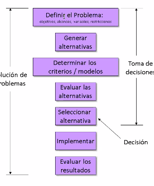
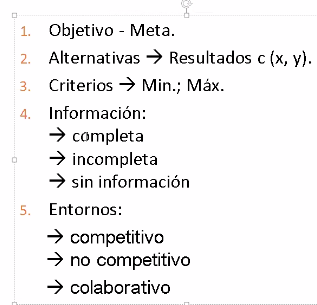
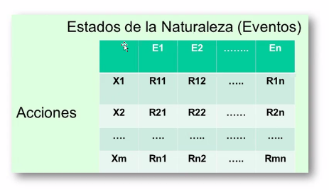
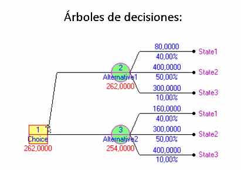

# Modelos y simulación parte 2

## Teoria y proceso de la decision

Las tomas de decisiones se suelen hacer con emociones

**Proceso general de tomas de decisiones**:

**Componentes** y **entornos** de toma de decision:

Caracteristicas de la toma de decisiones:

* Complejidad (Inherente a los sistemas dinamicos)
* Incertidumbre (No se puede saber la probabilidad de ocurriencia de algo)
* Riesgos (Al tomar decisiones se realizan analisis de riesgos)
* Multiples situaciones

Analisis de sensibilidad (?) (Ver cuanto impactan las posibles situaciones)

Caracterizacion de los universos en funcion del conocimiento de la informacion

1. Informacion completa -->Universo cierto (Fisica/matematica)
2. Informacion incompleta --> Universo aleatoreo (probabilidades / Juegos de azar)
3. Sin Informacion --> Universo incierto (Sin info / )
3. Ambiente competitivo --> Universo hostil (Mi ganancia es la perdida del otro) 

Herramientas a utilizar para resolver problemas:

Matriz

Los resultados de esta matriz se suelen llamar

Arbol de decision

