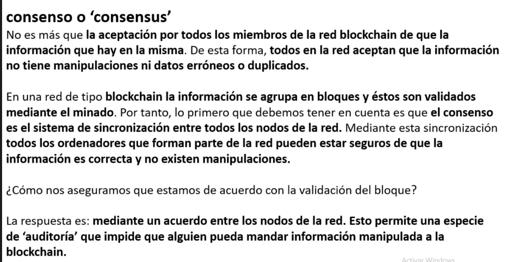
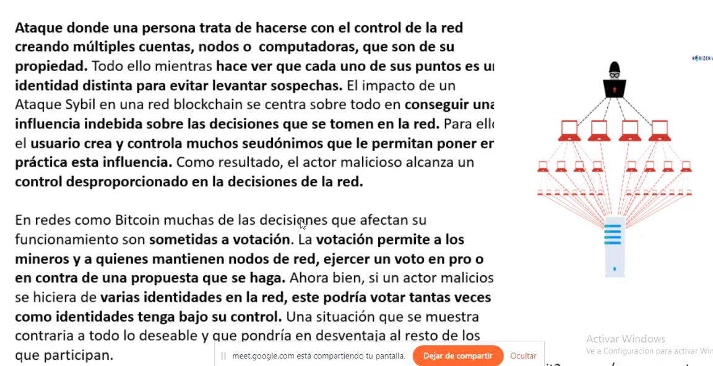

# Seminario de Blockchain

## Notas:

* Libro: Andreas M. Antonopoulos
* Parciales presenciales (quizas)

## Introduccion

Concepto economico de **dinero**:

Todo activo bien aceptado como medio de pago o medicion del valor...

Propiedades del dinero:
* Unidad de cuenta y patron de precios
* Medio de pago
* Deposito de valor

"El dinero es una tecnologia y una forma de lenguaje tan antigua como el mismo"

Etapas del **dinero**:
* Trueque
* Dinero mercancia
* Dinero metalico (oro)
* Dinero papel
* Dinero Fiduciario (fe)
* Dinero de plastico/ Bancario

`Nota: Acuerdos de Bretton Woods 1944`

`Nota: Emision de dinero es centralizada`

`Nota: Mayor cantidad de dinero es digital`

## Bitcoin

Bitcoin propone un nuevo modelo de confianza, la confianza en la tecnologia. Surgio debido a la crisis del 2008

Bitcoin es dinero digital, una moneda, una tecnologia, y una red internacional de pagos e intercambios totalmente **descentralizada**, no sustentada en los bancos ni en cualquier gobierno.

Bitcoin es el internet del dinero, no el dinero de internet.

* Bitcoin es dinero digital, se puede enviar a cualquier lugar del mundo de manera instantania con una comicion minuscula.
* No es una compania ni una organizacion, sino un protocolo estandar. (regulada por una organizacion)

`Nota: Blockchain es 1 de las 4 tecnologias de bitcoin (Bitcoin protocol, blockchain, consensus rules, proof-of-work algorithm)`

`Nota: Satoshi nakamoto, cypherpunks`

Bitcoin soluciona: 
* La necesidad de contar con un intermediario al realizar una transaccion
* El problema del doble gasto

Bitcoin es:
- Unidad monetaria
- Red p2p
- Software

**Red P2P**: Red de usuarios o pares en donde no hay un **servidor central**, sino que las partes actuan de manera autonoma respondiendo a un protocolo de comunicaciones y consenso comun. (Todos los usuarios conectados a la red p2p son usuarios y servidor al mismo tiempo, por lo que la velocidad de transferencia de archivos se mejora, como bittorrent)

**Criptografia asimetrica**: Metodo criptografico que usa un **par** de claves para el envio de mensajes. Una publica y una privada (la privada es la que nos da propiedad sobre el bitcoin). El hasheo es de una sola direccion.

**Firma digital**: A travez de ambas claves de la criptografia asimetrica se firma la transaccion (mensajes).

## Blockchain

**SHA 256 - Secure Hash Algorithm**: Huella digital de cualquier tipo de dato o informacion

Caracteristicas de SHA 256:

* **Unidireccional**: No se puede descifrar un contenido sifrado
* **Equilibrio** entre **seguridad** y **costo computacional** adecuado, por lo que es el mas usado
* La **longitud** del hash es **siempre igual**

**Bloque**:

Es como un elemento o como un nodo que tiene los campos 
* Nonce: Numero que se busca obtener para que haya x cantidad de ceros al principio del hash. 
* datos: Los datos del bloque
* hash: La "firma"

`Nota: Un hash que empieza con 4 ceros es admitido por la blockchain, significa que el bloque esta confirmado o firmado`

Una blockchain es una cadena de bloques, cada bloque apunta al anterior.

**Bloque genesis**: El primer bloque, no tiene antecesor.

Si modificamos un bloque, todos los demas bloques d ela cadena que apuntan a dicho bloque, o a bloques q apuntan a este bloque se rompen

**Blockchain Distribuida**

Es una blockchain con x cantidad de copias de la misma (Peers). Si hay alguna copia distinta de las demas, esta se descarta.

**Criptomoneda**: Sistema de intercambio de valor autosostenible

**Token**: Medio para representar cosas del mundo real, no es autosostenible, depende de otro sistema para funcionar.

**Criptomoneda != Token**

**Coinbase transactions (?)**

Cuando un minero resuelve la transaccion / termina de minar un bloque, recibe una cantidad de coins, estos coins son otorgados en base a la cantidad de bloques actulales y la "coinbase" 

para 2140 no va a haber mas bitcoins nuevos (21 millones).

**Tipos de redes**

La **red centralizada** es aquella en el que los ordenadores son perifericos y todos estan conectados a unidad central sobre la que recae todo el control y gestion de la red.

**Beneficios**
* Mucho mas rapido
* Entre otras

**Contras**
* Si se ataca al servidor, se cae todo el sistema.

Hay "blockchain's" centralizadas como Ripple y Hyperledger

Las **redes descentralizadas** (Dash, EOS) no llegan a ser **distribuidas**. Hay ciertos nodos con mucho mas poder que otros. Los nodos no son todos iguales

Las **redes distribuidas** (Bitcoin, Bittorrent) no tienen ningun centro individual o colectivo. los ordenadores se unen uno a otro de tal forma que ninguno de ellos tiene el poder de filtro sobre la info que se transmite en la red. Este tipo de red es practica, robusta y eficiente.

## Doble gasto

Un acto / ataque en el que se hace una copia de una moneda y se utiliza para realizar mas de una transaccion. Es un efecto potencial del dinero digital.

Bitcoin para prevenir el doble gasto realiza una validacion y registro de todas las transacciones realizadas y se realiza una verificacion para comprobar la autenticidad de cada operacion mediante la aplicacion de un instrumento conocido como prueba da trabajo.

## Generales bizantinos

Se puede atacar al sistema si se tiene una cantidad de nodos muy grande dedicado a atacar dicho sistema. Bitcoin y Blockchain preveen esto.

**Tecnologias del Bitcoin**

* **Bitcoin protocol**: Red descentralizada P2P
* **The Blockchain**: Libro de registros publicos de transacciones en forma de cadena de bloques
* **Reglas de consenso**: Reglas para la validacion de transacciones y emision monetaria
* **Proof of work**: Sistema descentralizado de verificacion de transacciones
* Criptografia asimetrica

## Nodo

Punto de conexion fisico o virtual donde se puede crear, enviar y recibir toda clase de datos e informacion. Son ordenadores que estan interconectados a la red de una criptomoneda

* **Nodos completos**: Implementan el cliente de bitcoin y almaecenan una copia exacta, completa y actualizada de la blockchain de bitcoin
* **Supernodos**: Son todos aquellos **nodos completos** que **operan** en la red de bitcoin de forma publica y abierta.
* **Nodo de mineria**: **Nodos completos** que ejecutan un **software de mineria**
* **Nodos ligeros**: Aquellos nodos que dependen de un tercero para realizar las validaciones de las transacciones de la red. No almacenan una copia completa de la blockchain, reciben la info de supernodos. Se utilizn apra ejecutar operaciones en dispositivos moviles o brindar servicios como wallets.

## Blockchain

Cadena de bloques, un libro mayor de acontecimientos digitales que esta distribuido o compartido entre muchas partes diferentes. Solo puede ser actualizado a partir del ocnsenso de la mayoria de participantes del sistema y, una vez introducida, la info nunca puede ser borrada.

Los bloques tienen mas o menos 2000 transacciones, que es el equivalente a 1 mega de informacion. Pero gracias a la blockchain, cada bloque tiene indirectamente todas las transacciones porque cada bloque apunta al bloque anterior, que contiene otras 2000 transacciones

Pilares de las **blockchains publicas**

* Son **revolucionarias** 
* **Open**: Accesible por todos 
* **Borderless**: Internacional / global / universal
* **Neutrales**: Se puede transferir sin interceptar o cuestionar dicha transaccion.
* **Incensurable**: Ninguna autoridad puede detener la transferencia de fondos de una cuenta a otra.
* **Inmutable**: Es muy dificil de mutar.
* Auditable/transparente/publica: Todas las transacciones pueden ser verificables por todos los usuarios de la red.
* **Privada**: Es anonimo

## Reglas de concenso

Tener consenso respecto a la historia de las transacciones y sobre las reglas necesarias para agregar transacciones.

Para evitar que se añadan bloques erroneos, cada uno de esos bloques necesita una revision y confirmacion. 

Todos los nodos deben aceptar los datos para confirmar la integridad de los nuevos bloques.

Los mineros son imprecindibles para que las transaccines sean incluidas en un bloque.

Con este sistema nos aseguramos que ninguna entidad puede manipular o controlar la red.

Cuando se rompe el consenso se generan bifurcaciones (hard fork o soft fork)

## Proof of work (Mineria)

**Ataque Sybil**:

En bitcoin, una PC solo puede realizar 1 voto mediante la proof of work (Este fue creado en un principio para evitar el spam). Para resolver y activar un nodo, se debe de resolver un problema matematico (hash) mediante un mecanismo de pureba y error. Esto es muy costoso y lleva su tiempo, por lo que una PC tiene q estar dedicada solo a eso.

* **Etapa 1**: El cliente se conecta con la red P2P y se le asigna una tarea costosa (+ o - costosa depende de la cantidad de ceros asignados al hash) para recibir un incentivo economico.
* **Etapa 2**: Se resuelve el acertijo (mineria), cosa que conlleva el uso de mucha potencia de computacion.
* **Etapa 3**: Una vez resuelta la terea computacional, el cliente comparte con la red para verificar los resultados. Si se cumplen los requisitos, se brinda el acceso a los recursos de la red.
* **Etapa 4**: Con la confirmacion de la tarea, el cliente accede a los recursos de la red y recibe una ganancia por el trabajo computacional realizado.

## Clase practica N°2

Claves **publicas** y **privadas** / funcionamiento de las **firmas digitales**

**Clave privada**: Numero largo y random, secreta y perteneciente a cada usuario.

**Clave publica**: Es como el CBU o DNI, es decir que es publica y se comparte con todo el mundo. Teniendo una clave publica **no se puede obtener** la privada.

Para **encriptar** un mensaje, se usa la **llave publica**, para **desencriptarlo** la **privada**.

Para **firmar** un mensaje se utiliza la **clave privada**, para **verificar** la firma, se usa la **clave publica**.

### Dash

Dash es una moneda digital que aporta elementos propios llamados **nodos maestros**. Tiene una (DAO, organizacion autonoma descentralizada) y cuenta confucniones especificas opcionales para enviar transacciones (privateSend e instantSend). Para el año  va a haber  18.900.000 monedas como maximo, un bloque se genera cada 2.6 minutos y el halving es de 1 año y se reduce un %7.14 mas rapido que en bitcoin.

Dash soluciona la privacidad y rapidez de bitcoin. (privacidad porque en bitcoin los registros son publicos, por lo que se pueden trackear las transacciones.)

Los nodos maestros son como nodos completos de bitcoin pero con funcionalidades adicionales. Estos confirman transacciones sin que toda la red participe en el proceso, lo que reduce el tiempo y costo de las operaciones.

El privateSend cruza nuestra operacion con la de otros usuarios, por lo que no se van a poder rastrear y asi se puede mejorar la privacidad.

Los nodos maestros solo son usados al realizar operaciones instantaneas o privadas.

## Transacciones

Una transaccion esta formada por:
- input: referencias de una transaccion pasada que no ha sido empleada en ninguna otra transaccion
- output: Direccion a la cual se realiza la transferencia y la direccion de cambio o retorno
- identificador(TXid): Direccion de hash que se genera a partir de las entradas y las salidas.
- tarifa de comicion(fee): Pequeño pago que reciben los mienros por procesar una transaccion.<>