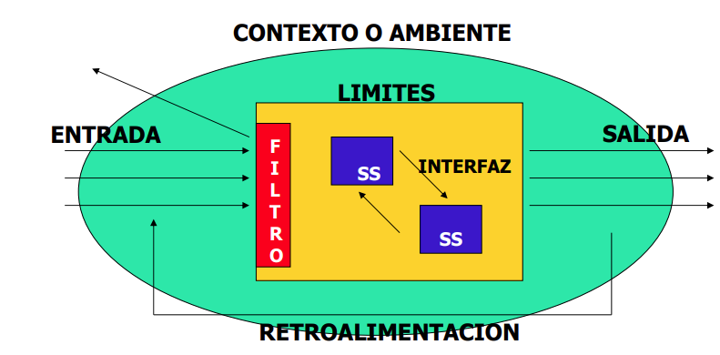

# Resumen de Sistemas de Informacion
## Indice
- [Resumen de Sistemas de Informacion](#resumen-de-sistemas-de-informacion)
  - [Indice](#indice)
  - [UNIDAD 1: Teoria general de sistemas (TGS)](#unidad-1-teoria-general-de-sistemas-tgs)
    - [Teoría de sistemas](#teoría-de-sistemas)
      - [Sociedad para la Investigación General de Sistemas (ISSS):](#sociedad-para-la-investigación-general-de-sistemas-isss)
    - [Sistemas](#sistemas)
      - [Elementos de un sistema](#elementos-de-un-sistema)
      - [Clasificacion de los sistemas](#clasificacion-de-los-sistemas)
      - [Principios generales de un sistema](#principios-generales-de-un-sistema)
    - [TGS (?)](#tgs-)

## UNIDAD 1: Teoria general de sistemas (TGS)

### Teoría de sistemas 
o **teoría general de sistemas** (TGS) es el **estudio** interdisciplinario de los **sistemas en general**. Su propósito es estudiar los **principios aplicables** a los **sistemas** en cualquier nivel en **todos los campos** de la investigación. (Wikipedia, Teoria general de sistemas)

```“Conjunto de conceptos generales, principios, instrumentos, problemas, métodos y técnicas relacionadas con los SISTEMAS"```

#### Sociedad para la Investigación General de Sistemas (ISSS): 
Fue organizada en 1954 para **impulsar el desarrollo de sistemas teóricos** aplicables a más de uno de los compartimientos tradicionales del conocimiento.
Sus **funciones** principales son:
 
 - Investigar el **isomorfismo** de conceptos, modelos, leyes en distintos campos de las ciencias
 - Incentivar **transferencia** entre campos en donde haya isomorfismo. 
 - Estimular el **desarrollo** de **modelos teóricos adecuados** en campos que no lo tengan.
 - **Minimizar** la **repetición** de **esfuerzo teórico** en distintos campos con igual isomorfismo.
 - **Promover** la **unidad** de la ciencia y la **mejor comunicación** entre **especialistas**.

Su **proposito** (TGS) es **descubrir** las similitudes o **isomorfismos** en las **construcciones teóricas** de las distintas disciplinas. (Se puede aplicar a qualquier sistema de cualquier disciplina cientifica)

Algunos isomorfismos de sistemas son por ejemplo:

1. *Ventilador y helicoptero* (Homomorficos)
2. *2 automóviles de distinta marca* (Isomorfos)

**Isomorfismos**
: Si sistemas pertenecientes a distintos campos del saber tienen la misma estructura, debe ser posible expresar esta estructura en un lenguaje universal comun, suceptible a ser traducido en una tecnologia particular.\
Ej: Sistema de cañerias y sistema electrico

**Niveles**: (?) ¿Complejidad de los sistemas?

**Enfoque de sistemas**
: Dado un objetivo, se busca el camino mas eficaz y optimo para lograrlo. Conocemos 2 enfoques:
 - **Enfoque analitico**: Parte del principio de estudiar **aisladamente** las diferentes partes de un sistema; es decir consiste en **descomponer** al sistema en tantos **elementos simples** como sea posible y estudiar cada uno de ellos **en detalle**.
 - **Enfoque sistemico**: Engloba la totalidad de los elementos del sistema en estudio. No centra su atención en el análisis de cada uno de los elementos que forman el sistema, sino que se basa en una percepción global, en la finalidad del sistema. Se concentra en las **interacciones** de los elementos y considera los efectos de dichas interacciones.

### Sistemas

Conjunto de **elementos** que ordenadamente
**relacionadas entre sí** contribuyen a un **fin** determinado (Ej: sistema nervioso del cuerpo humano)

Hay varias definiciones de sistema, pero en general comparten 2 denominadores en comun:

1. **Totalidad**: El todo (Elementos interrelacionados) es mas grande que la suma de sus partes
2. **Proposito**: mision, razon u objetivo del sistema.

**Propiedades emergentes**

Al decir que un sistema funciona como un
todo, ese todo tiene propiedades diferentes
de las partes individuales que lo componen (Ej: Arco iris -> lluvia, sol y atmosfera).

Estructura de un sistema → Lo que el sistema es.

Proceso de un sistema → Lo que el sistema hace.

**Diagrama de un sistema**



#### Elementos de un sistema

1. **Contexto**: medio circundante o entorno
2. **Limites**: o fronteras físicas o abstractas
3. **Entradas**: insumos
4. **Salidas**: productos o resultados
5. **Recursos**: componentes, partes, elementos (pueden ser SUBSISTEMAS)
6. **Procesos**
7. **Retroalimentacion**: mecanismo de control en el cual los **resultados** obtenidos de una tarea o actividad son **reintroducidos** en el sistema con la finalidad de **incidir** o actuar sobre las decisiones o **acciones futuras**.

**Tipos de entradas de un sistema**
- **Activantes**:son los datos e información
sobre los que el sistema actúa para
producir una salida.
- **De mantenimiento**: están integradas
estrechamente al **sistema de control**

**Recursos de un sistema**

**Subsistema**: Componente de un sistema que tambien es un sistema.

En todo sistema debe haber **interrelación** entre sus **componentes o subsistemas** y transferencia de información entre ellos, para que cada uno pueda realizar sus tareas.

**Tipos de recursos**:
- Fisicos o Abstractos
- Objetos, Conceptuales o Sujetos

**Procesos de un sistema**
**Actividades** que el sistema aplica sobre los elementos de **entrada** para **convertirlos** en elementos de **salida**.

**Retroalimentacion**

Mecanismo de ajuste y **control** que tiene como objetivo **mantener** el **equilibrio** de un sistema. (se comparan las salidas con el objetivo establecido)

#### Clasificacion de los sistemas

- **Abiertos**: Se relacionan con el medio y son influyentes en este
- **Cerrados**: No interactuan con el medio

- **Abstractos**: Solo conceptuales (Ej: sistemas sociales, culturales, religiosos)
- **Fisicos**: Conjuntos de elementos materiales que operan en conjunto para lograr un objetivo

Tambien hay clasificaciones de sistemas hechas por:
- Kenneth E. Boulding
- María Margarita Sanchez Forero
- Lancaster
- Burch
- O’Connor

**Jerarquias**

Suprasistema → Sistema → Subsistema (Recursividad)

#### Principios generales de un sistema

- SINERGIA
- RECURSIVIDAD
- ENTROPÍA
- ENTROPÍA POSITIVA
- ENTROPÍA NEGATIVA
- HOMEOSTASIS
- TELEOLOGÍA
- EQUIFINALIDAD
- MULTIFINALIDAD

**Sinergia**

El **todo** es mayor que la **suma** de sus **partes**

**Recursividad**

Implica que los sistemas **inferiores** se encuentran **contenidos** en los sistemas **superiores** (suprasistemas, sistemas y subsistemas). Y todos son **sinergéticos**.

**ENTROPÍA**

Tendencia a la desorganización, decadencia y agotamiento del mismo. (?)

**TELEOLOGÍA**

Tendencia del sistema a la consecución
de un **fin u objetivo**
- **Equifinalidad**: Un solo fin, quizas por diferentes caminos
- **Multifinalidad**: Muchos fines, quizas por un solo camino

**HOMEOSTASIS**

Tendencia a **adaptarse** con el fin de alcanzar un **equilibrio interno** frente a los **cambios externos** del medio ambiente.

### TGS (?)